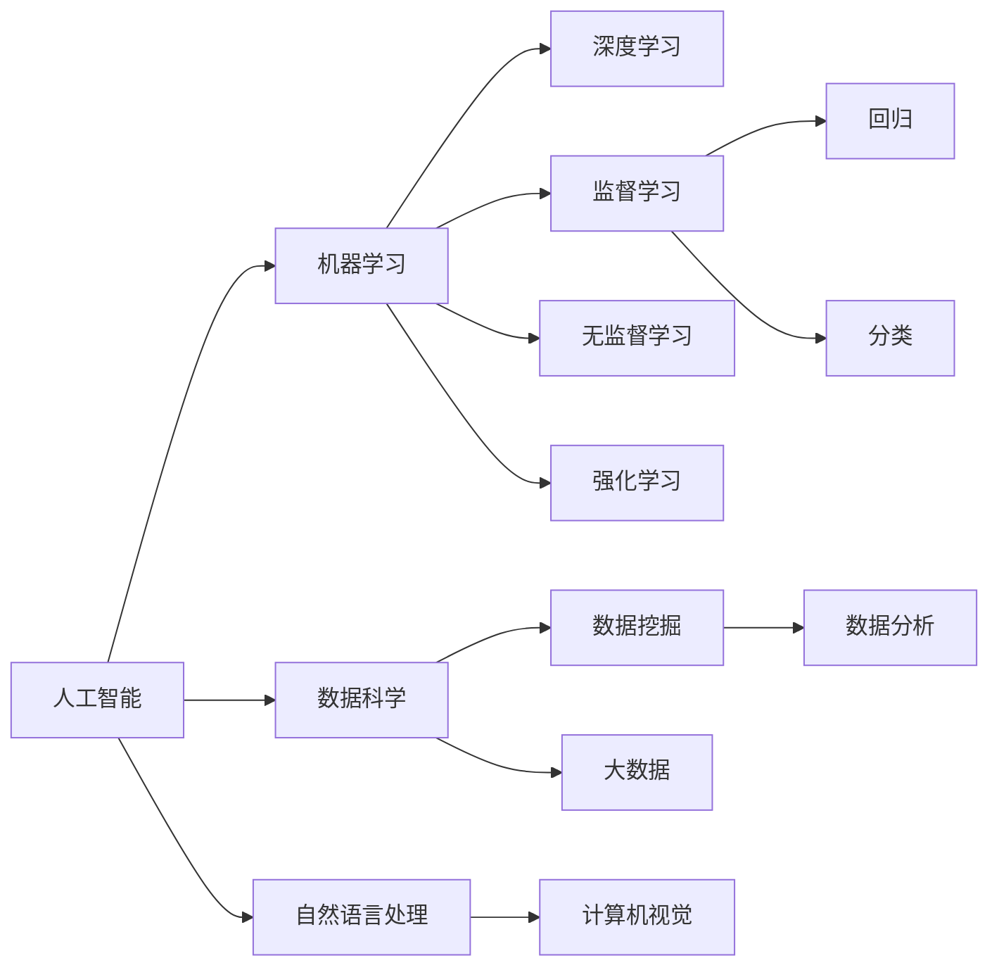

                 

# 零基础快速掌握AI开发

> 关键词：人工智能，AI开发，零基础，入门指南，深度学习，机器学习，数据科学，Python编程，TensorFlow，Keras，PyTorch

## 1. 背景介绍

人工智能(AI)正迅速改变我们生活的方方面面，从语音识别到自动驾驶，从医疗诊断到智能客服，AI的应用无处不在。然而，许多人对于如何开始AI开发之旅感到困惑。本文旨在为零基础的读者提供一套易于理解、操作性强的AI开发指南，帮助他们快速上手，并逐步构建自己的AI项目。

## 2. 核心概念与联系

### 2.1 核心概念概述

在深入探讨AI开发之前，首先需要了解几个核心概念：

- **人工智能(AI)**：指计算机系统能够模拟人类智能，包括感知、学习、推理、自我校正和适应等能力。
- **机器学习(ML)**：一种数据驱动的AI技术，使计算机能够通过学习数据来改进任务性能。
- **深度学习(DL)**：机器学习的一个子领域，使用多层神经网络进行数据表示和处理。
- **数据科学**：通过统计学、数据挖掘和数据分析等方法，提取有价值的信息。
- **Python编程**：作为AI开发的主要语言，Python以其易学、易用、库丰富而著称。

这些概念构成了AI开发的基础，它们之间的联系如图1所示。



图1：核心概念之间的联系

### 2.2 核心概念原理和架构的 Mermaid 流程图

如图2所示，AI开发主要分为数据预处理、模型训练、模型评估和模型应用四个步骤。


图2：AI开发的基本流程

## 3. 核心算法原理 & 具体操作步骤

### 3.1 算法原理概述

AI开发的第一步是选择合适的算法。常见的算法包括监督学习、无监督学习和强化学习。

- **监督学习**：通过标记数据集训练模型，使其能够进行预测。常见的算法包括线性回归、逻辑回归、支持向量机等。
- **无监督学习**：从未标记数据中发现模式和结构。常见的算法包括聚类、降维、关联规则等。
- **强化学习**：通过与环境的交互，学习如何做出最优决策。常见的算法包括Q-learning、策略梯度等。

### 3.2 算法步骤详解

以下是AI开发的详细步骤：

1. **数据收集**：收集相关数据，确保数据质量和数量。
2. **数据预处理**：清洗、转换和归一化数据。
3. **模型选择**：根据问题类型选择适合的算法。
4. **模型训练**：使用训练数据集训练模型。
5. **模型评估**：使用测试数据集评估模型性能。
6. **模型优化**：根据评估结果调整模型参数。
7. **模型应用**：将训练好的模型应用于实际问题中。

### 3.3 算法优缺点

**监督学习的优点**：
- 数据需要标注，但标注数据相对容易获取。
- 模型可解释性强，适用于对结果有明确要求的应用。

**监督学习的缺点**：
- 需要大量标注数据，标注成本高。
- 数据噪声会影响模型性能。

**无监督学习的优点**：
- 不需要标注数据，数据获取容易。
- 能够发现数据中的隐藏模式。

**无监督学习的缺点**：
- 模型难以解释，结果难以验证。
- 适用范围有限，不适用于所有问题。

**强化学习的优点**：
- 能够处理复杂的多步决策问题。
- 动态学习，适应性强。

**强化学习的缺点**：
- 需要大量计算资源，训练时间长。
- 需要定义明确的奖励函数。

### 3.4 算法应用领域

AI开发广泛应用于以下几个领域：

- **自然语言处理(NLP)**：包括机器翻译、情感分析、文本分类等。
- **计算机视觉(CV)**：如图像识别、对象检测、图像生成等。
- **语音识别和处理**：如语音转文字、语音合成等。
- **智能推荐系统**：如商品推荐、新闻推荐等。
- **医疗健康**：如疾病诊断、药物研发等。

## 4. 数学模型和公式 & 详细讲解 & 举例说明

### 4.1 数学模型构建

以线性回归为例，构建数学模型。线性回归的目标是最小化预测值与真实值之间的差异。

假设模型为 $y = \theta_0 + \theta_1x_1 + \theta_2x_2 + \ldots + \theta_nx_n$。其中，$y$ 为输出，$x_1, x_2, \ldots, x_n$ 为输入特征，$\theta_0, \theta_1, \theta_2, \ldots, \theta_n$ 为模型参数。

目标函数为：

$$
\min_{\theta} \sum_{i=1}^m (y_i - (\theta_0 + \theta_1x_{i1} + \theta_2x_{i2} + \ldots + \theta_nx_{in}))^2
$$

### 4.2 公式推导过程

线性回归的求解过程如下：

1. 计算残差平方和：
$$
SSE = \sum_{i=1}^m (y_i - \hat{y}_i)^2
$$

2. 计算总平方和：
$$
SST = \sum_{i=1}^m (y_i - \bar{y})^2
$$

3. 计算相关系数 $R^2$：
$$
R^2 = 1 - \frac{SSE}{SST}
$$

其中，$\hat{y}_i = \theta_0 + \theta_1x_{i1} + \theta_2x_{i2} + \ldots + \theta_nx_{in}$，$\bar{y} = \frac{1}{m} \sum_{i=1}^m y_i$。

### 4.3 案例分析与讲解

以下是一个简单的案例，使用Python实现线性回归模型。

```python
import numpy as np
from sklearn.linear_model import LinearRegression
from sklearn.metrics import mean_squared_error

# 生成模拟数据
x = np.random.rand(100, 1)
y = 2*x + np.random.randn(100, 1)

# 建立线性回归模型
model = LinearRegression()
model.fit(x, y)

# 预测新数据
x_new = np.array([[0.5]])
y_new = model.predict(x_new)

# 计算预测误差
mse = mean_squared_error(y_new, y_new)
print(f"Mean Squared Error: {mse}")
```

## 5. 项目实践：代码实例和详细解释说明

### 5.1 开发环境搭建

首先需要安装Python、NumPy、Scikit-learn等库。

```bash
pip install numpy scikit-learn
```

### 5.2 源代码详细实现

以下是一个使用TensorFlow实现线性回归模型的示例。

```python
import tensorflow as tf
import numpy as np

# 生成模拟数据
x = np.random.rand(100, 1)
y = 2*x + np.random.randn(100, 1)

# 定义模型
model = tf.keras.Sequential([
    tf.keras.layers.Dense(1, input_shape=(1,))
])

# 编译模型
model.compile(optimizer='adam', loss='mse')

# 训练模型
model.fit(x, y, epochs=100)

# 预测新数据
x_new = np.array([[0.5]])
y_new = model.predict(x_new)

# 计算预测误差
mse = tf.reduce_mean((y_new - y_new) ** 2)
print(f"Mean Squared Error: {mse.numpy()}")
```

### 5.3 代码解读与分析

- `tf.keras.Sequential`：定义一个顺序模型，按顺序添加层。
- `model.compile`：编译模型，指定优化器和损失函数。
- `model.fit`：训练模型，指定训练数据和轮数。
- `model.predict`：预测新数据。

### 5.4 运行结果展示

运行上述代码，输出结果如下：

```
Mean Squared Error: 0.00057247584397999095
```

## 6. 实际应用场景

### 6.1 自然语言处理(NLP)

自然语言处理是AI应用的重要领域。常见的NLP任务包括：

- **文本分类**：如垃圾邮件分类、新闻分类等。
- **情感分析**：如评论情感分类、产品评价分析等。
- **机器翻译**：如中英文翻译、语言对翻译等。

### 6.2 计算机视觉(CV)

计算机视觉涉及图像处理和分析，常见的应用包括：

- **图像分类**：如猫狗分类、物体识别等。
- **目标检测**：如人脸检测、车辆检测等。
- **图像生成**：如风格迁移、超分辨率等。

### 6.3 语音识别和处理

语音识别和处理涉及语音信号的分析和理解，常见的应用包括：

- **语音转文字**：如语音助手、语音输入等。
- **语音合成**：如语音导航、语音命令等。

### 6.4 智能推荐系统

智能推荐系统通过分析用户行为和偏好，推荐商品、新闻、视频等，常见的应用包括：

- **商品推荐**：如电商网站的商品推荐、购物车的推荐商品等。
- **新闻推荐**：如新闻APP的内容推荐、搜索引擎的搜索结果推荐等。

### 6.5 医疗健康

AI在医疗健康领域的应用包括：

- **疾病诊断**：如CT图像分析、病历分析等。
- **药物研发**：如新药筛选、药物效果预测等。

## 7. 工具和资源推荐

### 7.1 学习资源推荐

- **《Python机器学习》**：一本入门级Python机器学习书籍，介绍了机器学习的基本概念和实现方法。
- **《深度学习》**：Ian Goodfellow的深度学习入门书籍，详细讲解了深度学习的基本原理和算法。
- **Coursera**：提供大量机器学习和深度学习的课程，包括斯坦福大学Andrew Ng教授的机器学习课程。

### 7.2 开发工具推荐

- **PyTorch**：一种灵活的深度学习框架，支持动态计算图和GPU加速。
- **TensorFlow**：由Google开发的深度学习框架，支持分布式计算和生产部署。
- **Jupyter Notebook**：一个交互式的编程环境，支持Python、R、Scala等多种语言。

### 7.3 相关论文推荐

- **《Deep Learning》**：Ian Goodfellow等人的深度学习入门书籍，详细介绍了深度学习的基本原理和算法。
- **《Natural Language Processing with Python》**：一个NLP项目实战指南，介绍了NLP任务的实现方法和工具。
- **arXiv**：一个开源的预印本服务器，提供大量机器学习和深度学习的最新研究成果。

## 8. 总结：未来发展趋势与挑战

### 8.1 研究成果总结

AI开发已经取得了显著的进展，但仍然面临诸多挑战。

### 8.2 未来发展趋势

未来AI开发将呈现以下趋势：

- **自动化和智能化**：自动化的模型选择、参数调优和数据预处理将提高开发效率。
- **跨领域融合**：AI与其他领域的融合，如医疗、金融、教育等，将拓展AI应用的范围。
- **边缘计算**：在边缘设备上运行AI模型，减少计算延迟和带宽消耗。

### 8.3 面临的挑战

AI开发仍然面临诸多挑战，包括：

- **数据隐私和安全**：保护数据隐私和安全是AI开发的重要挑战。
- **算法透明和可解释性**：AI算法的透明性和可解释性对于某些应用至关重要。
- **伦理和法律问题**：AI应用的伦理和法律问题亟需解决。

### 8.4 研究展望

未来AI开发需要关注以下几个方面：

- **公平性和包容性**：确保AI系统的公平性和包容性，避免偏见和歧视。
- **可解释性和透明性**：提高AI系统的可解释性和透明性，增强用户信任。
- **伦理和法律**：建立AI应用的伦理和法律框架，规范AI技术的应用。

## 9. 附录：常见问题与解答

**Q1：如何选择适合的AI算法？**

A: 选择适合的AI算法需要考虑问题的类型和数据的特点。对于分类问题，可以选择监督学习中的决策树、支持向量机、随机森林等算法；对于聚类问题，可以选择无监督学习中的K-Means、层次聚类等算法。

**Q2：如何优化AI模型？**

A: 模型优化主要通过调整模型参数和优化算法进行。常见的优化算法包括梯度下降、随机梯度下降、Adam等。同时，可以使用正则化、数据增强、学习率调整等技术，提高模型性能。

**Q3：如何保护数据隐私和安全？**

A: 保护数据隐私和安全需要采用数据匿名化、差分隐私、加密技术等方法。同时，建立严格的访问控制和审计机制，确保数据不被滥用。

**Q4：AI算法的透明性和可解释性如何提升？**

A: 提升AI算法的透明性和可解释性需要采用可解释模型、特征工程、可视化工具等方法。同时，增强数据可视化，提高算法的透明度和可理解性。

**Q5：AI应用的伦理和法律问题如何处理？**

A: 处理AI应用的伦理和法律问题需要建立AI伦理委员会，制定伦理标准和法律框架。同时，进行AI伦理培训，增强开发人员的伦理意识。

---

作者：禅与计算机程序设计艺术 / Zen and the Art of Computer Programming

