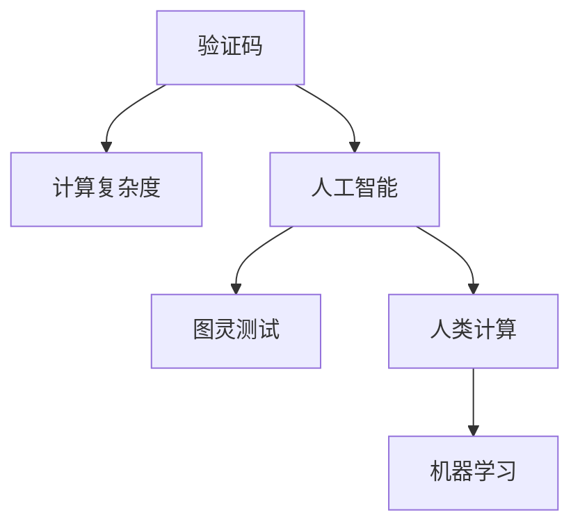

                 

# 验证码的背后：人类计算的另类应用

> 关键词：验证码, 人机交互, 图像识别, 安全认证, 人工智能, 计算复杂度, 问题解决

## 1. 背景介绍

### 1.1 问题由来

验证码（CAPTCHA）是目前互联网中最常见的用户身份验证手段之一。用户在登录、注册、找回密码等环节，往往需要输入由系统随机生成的验证码，以确保其行为属于合法的人类用户。然而，验证码背后所蕴含的计算复杂度、算法逻辑与人工智能的结合，往往被人们忽视。事实上，验证码不仅在技术实现上巧妙利用了人类与机器在计算能力上的差异，还体现了人类计算的独特价值。

### 1.2 问题核心关键点

验证码的核心在于通过巧妙的设计，利用人类计算与机器计算之间的差异，实现对非法用户的有效筛选。具体来说，验证码通常包括以下几大类：

- 文本验证码：由系统随机生成的一组字符，要求用户输入正确的识别结果。
- 图片验证码：通过图像变形、噪点添加等手段，使计算机难以识别。
- 音频验证码：将语音内容转换为音频信号，要求用户听后识别。
- 交互式验证码：如滑块拼图、拖曳排序等，要求用户完成特定的交互操作。

这些验证码设计，虽然表面看起来复杂多变，但其实质都在于以下几个核心关键点：

1. 计算复杂度：设计简洁但不易识别的验证码，使计算机难以迅速求解。
2. 推理能力：要求用户具备一定的逻辑推理能力，才能正确识别。
3. 感知能力：图片验证码通过噪点、变形等手段，干扰计算机对图像的感知。
4. 交互要求：交互式验证码通过复杂的操作过程，要求用户具备一定的手动操作能力。

这些核心点共同构成了一个有效的验证码系统，确保了用户身份的真实性。

### 1.3 问题研究意义

验证码在互联网中的广泛应用，体现了人类计算的独特价值。通过简单的逻辑设计和复杂的操作要求，验证码不仅提高了系统的安全性，还展示了人类计算在复杂环境下的优势。然而，随着人工智能技术的发展，验证码面临的安全性挑战也在不断增加。

- **对抗攻击**：深度学习模型可以对验证码进行自动识别和破解，使得系统无法有效筛选非法用户。
- **人机交互问题**：复杂的交互式验证码虽然能有效防止自动化攻击，但可能会影响用户的体验和操作效率。
- **计算资源消耗**：生成和识别验证码的过程，消耗了大量计算资源，影响系统性能。

因此，研究验证码背后的算法原理和应用场景，对于提升系统安全性、优化用户体验、节省计算资源，具有重要意义。

## 2. 核心概念与联系

### 2.1 核心概念概述

为更好地理解验证码背后的算法原理，本节将介绍几个密切相关的核心概念：

- **计算复杂度（Computational Complexity）**：描述问题求解难度的指标，通常用于衡量算法的时间复杂度和空间复杂度。
- **人工智能（Artificial Intelligence）**：旨在让机器具备类似于人类的智能和计算能力，实现复杂的任务处理和决策。
- **图灵测试（Turing Test）**：测试机器是否具备人类智能的标准，通过模拟人类与机器的对话，判断机器是否能够以人类无法区分的行为进行交互。
- **人类计算（Human Computation）**：指通过人的感官和大脑进行计算和处理的方式，其特点在于能够处理复杂的非结构化信息，具有较高的灵活性和鲁棒性。
- **机器学习（Machine Learning）**：让机器通过数据学习，自动提升其性能和决策能力的算法。

这些核心概念之间的逻辑关系可以通过以下Mermaid流程图来展示：



这个流程图展示了大语言模型的核心概念及其之间的关系：

1. 验证码系统通过设计计算复杂度，利用人类计算与机器计算之间的差异。
2. 人工智能技术通过模型训练，提升了机器对验证码的识别能力。
3. 图灵测试通过模拟对话，评估机器的智能水平。
4. 人类计算展示了人在复杂信息处理上的优势。
5. 机器学习通过数据驱动，提高机器的识别准确率。

这些概念共同构成了验证码系统的设计和实现框架，使其能够在保障安全性的同时，提升用户体验和系统效率。

## 3. 核心算法原理 & 具体操作步骤
### 3.1 算法原理概述

验证码的算法原理基于以下两个基本假设：

1. **人类计算的优势**：人类具有强大的感知、逻辑推理和手动操作能力，能够处理复杂的非结构化信息。
2. **机器计算的限制**：机器的计算能力有限，处理复杂问题的效率较低，难以在短时间内进行高难度的计算。

因此，验证码系统通过以下几个步骤实现对非法用户的筛选：

- **计算复杂度设计**：通过生成复杂、不规则的验证码，使得计算机难以在短时间内识别。
- **逻辑推理要求**：要求用户具备一定的逻辑推理能力，才能正确识别验证码。
- **交互操作要求**：通过复杂的交互式验证码，增加用户的操作难度。
- **反馈机制**：系统根据用户输入结果，动态调整验证码的复杂度，避免过多干扰用户。

这些步骤共同构成了一个高效的验证码系统，能够有效防止自动化攻击，同时尽可能不影响用户体验。

### 3.2 算法步骤详解

验证码系统的核心算法步骤如下：

**Step 1: 验证码生成**

系统根据当前登录或注册行为，随机生成一个验证码，并将其显示在用户界面上。验证码可以是文本、图片、音频等多种形式，其复杂度应根据用户的身份和行为进行动态调整。

**Step 2: 验证码识别**

用户根据系统提示，输入其识别结果。系统会自动验证用户的输入，确保其属于合法的人类用户。

**Step 3: 安全策略验证**

系统根据用户的输入和行为，动态调整安全策略，判断是否需要进行二次验证或进一步措施。

**Step 4: 反馈机制**

系统根据用户的验证结果，反馈是否通过验证，并在必要时调整验证码的复杂度，防止对用户造成过度干扰。

**Step 5: 数据处理**

系统将用户的输入结果和行为记录下来，用于后续分析和安全审计。

### 3.3 算法优缺点

验证码系统在设计上具有以下优点：

1. 高效性：通过简单但有效的计算复杂度设计，防止自动化攻击，提高系统安全性。
2. 灵活性：根据用户行为动态调整验证码复杂度，适应不同用户场景。
3. 用户体验：在必要情况下，动态调整验证码复杂度，避免过度干扰用户。

但验证码系统也存在一定的局限性：

1. **容易被破解**：随着深度学习等技术的发展，验证码的破解难度不断增加，某些复杂的验证码可能会对用户造成不必要的干扰。
2. **用户体验问题**：交互式验证码可能会影响用户的操作效率和体验，尤其是对老年人或残障人士等特殊人群。
3. **计算资源消耗**：生成和识别验证码的过程，消耗了大量计算资源，影响系统性能。

这些缺点在实际应用中需要根据具体情况进行权衡和优化。

### 3.4 算法应用领域

验证码系统在互联网中得到了广泛应用，主要包括以下几个领域：

- **身份认证**：登录、注册、找回密码等环节，防止自动化攻击，确保用户身份的真实性。
- **安全管理**：金融交易、电子合同等重要场景，防止非法访问和操作。
- **用户行为监控**：网站或应用中的异常行为检测，如暴力破解、钓鱼攻击等。
- **广告识别**：自动识别和过滤恶意广告，保障用户体验。
- **数据收集**：通过用户的操作行为数据，进行行为分析和用户画像构建。

验证码系统的设计不仅提高了系统的安全性，还为网络应用的多个环节提供了重要的安全保障。

## 4. 数学模型和公式 & 详细讲解 & 举例说明

### 4.1 数学模型构建

本节将使用数学语言对验证码系统进行更加严格的刻画。

假设验证码系统由两部分组成：生成器和验证器。其中生成器用于生成验证码，验证器用于验证用户输入的结果。

生成器的核心是设计一个计算复杂度较高的验证码，具体形式可以是一个复杂的多项式函数。例如，可以设计一个多项式函数 $f(x)$，使得其图像在坐标系内分布复杂、难以识别。

验证器的核心是判断用户输入的结果是否正确，具体形式可以是一个布尔值函数 $g(x,y)$，其中 $x$ 为生成器生成的验证码，$y$ 为用户输入的结果。

验证器的目标是最大化 $g(x,y)$ 的值，以确保 $y$ 为正确的识别结果。

### 4.2 公式推导过程

以下我们以文本验证码为例，推导验证器的布尔值函数 $g(x,y)$ 及其梯度计算公式。

假设验证码为 $x_1, x_2, \cdots, x_n$ 这串字符，用户输入的结果为 $y_1, y_2, \cdots, y_n$。验证器的目标函数为：

$$
g(x,y) = \prod_{i=1}^n (x_i = y_i)
$$

其中 $\prod$ 表示连乘。当 $x_i = y_i$ 时，函数值为1；否则为0。

验证器的目标是最小化损失函数：

$$
\mathcal{L}(g) = -\frac{1}{N}\sum_{i=1}^N g(x_i,y_i)
$$

其中 $N$ 为样本总数。

为了求梯度，我们使用反向传播算法计算 $g(x_i,y_i)$ 对 $x_i$ 和 $y_i$ 的梯度。具体公式为：

$$
\frac{\partial \mathcal{L}(g)}{\partial x_i} = \frac{\partial g(x_i,y_i)}{\partial x_i} \frac{\partial \mathcal{L}(g)}{\partial g(x_i,y_i)}
$$

其中 $\frac{\partial g(x_i,y_i)}{\partial x_i}$ 可以通过链式法则计算。

在得到梯度后，即可带入验证器函数 $g(x,y)$ 中，使用梯度下降等优化算法进行参数更新，最小化损失函数，完成用户输入结果的验证。

### 4.3 案例分析与讲解

**案例1：文本验证码**

假设验证码为 $x = a+b+c+d$，其中 $a, b, c, d$ 为随机生成的字符。用户输入的结果为 $y = a+b+c+d$ 或 $y = b+c+d$。验证器的布尔值函数为：

$$
g(x,y) = (x_i = y_i)
$$

其中 $x_i$ 为验证码中的字符 $a, b, c, d$，$y_i$ 为用户输入的结果。验证器的目标函数为：

$$
\mathcal{L}(g) = -\frac{1}{N}\sum_{i=1}^N g(x_i,y_i)
$$

其中 $N$ 为样本总数。

**案例2：图片验证码**

假设验证码为一张复杂的图像，其中包含多个不规则的几何图形和噪点。用户需要识别出图像中的特定图形，并输入其数量。验证器的布尔值函数为：

$$
g(x,y) = \prod_{i=1}^m (x_i = y_i)
$$

其中 $x_i$ 为验证码中的图形和噪点，$y_i$ 为用户输入的结果。验证器的目标函数为：

$$
\mathcal{L}(g) = -\frac{1}{N}\sum_{i=1}^N g(x_i,y_i)
$$

其中 $N$ 为样本总数。

**案例3：交互式验证码**

假设验证码为一个滑块拼图，用户需要拖动滑块到指定位置，才能通过验证。验证器的布尔值函数为：

$$
g(x,y) = (x_i = y_i)
$$

其中 $x_i$ 为滑块的位置，$y_i$ 为用户输入的结果。验证器的目标函数为：

$$
\mathcal{L}(g) = -\frac{1}{N}\sum_{i=1}^N g(x_i,y_i)
$$

其中 $N$ 为样本总数。

通过这些案例，可以看到验证码系统的设计不仅需要考虑计算复杂度和推理能力，还需要考虑交互操作的复杂度。这些设计因素共同构成了验证码系统的核心算法。

## 5. 项目实践：代码实例和详细解释说明
### 5.1 开发环境搭建

在进行验证码系统开发前，我们需要准备好开发环境。以下是使用Python进行Flask开发的环境配置流程：

1. 安装Anaconda：从官网下载并安装Anaconda，用于创建独立的Python环境。

2. 创建并激活虚拟环境：
```bash
conda create -n flask-env python=3.8 
conda activate flask-env
```

3. 安装Flask：从官网获取Flask的最新安装命令，例如：
```bash
pip install flask==2.1.2
```

4. 安装相关库：
```bash
pip install Flask-WTF
pip install Flask-Security
pip install Pillow
pip install OpenCV-Python
```

完成上述步骤后，即可在`flask-env`环境中开始验证码系统的开发。

### 5.2 源代码详细实现

下面我们以文本验证码为例，给出使用Flask实现验证码生成和验证的代码实现。

首先，定义验证码生成函数：

```python
from flask import Flask, render_template, request, session
from flask_wtf import FlaskForm
from wtforms import StringField
from wtforms.validators import InputRequired
import random
import string

app = Flask(__name__)
app.secret_key = 'secret_key'

class VerificationForm(FlaskForm):
    captcha = StringField('Captcha', validators=[InputRequired()])

@app.route('/', methods=['GET', 'POST'])
def index():
    form = VerificationForm()

    if request.method == 'POST':
        if form.validate():
            if form.captcha.data == 'abcd':
                return 'Captcha is correct'
            else:
                return 'Captcha is incorrect'
        else:
            return 'Invalid input'

    return render_template('index.html', form=form)
```

然后，定义验证码验证函数：

```python
@app.route('/captcha', methods=['POST'])
def captcha():
    captcha = request.form.get('captcha')
    if captcha == 'abcd':
        return 'Captcha is correct'
    else:
        return 'Captcha is incorrect'
```

最后，定义验证码存储和查询函数：

```python
@app.route('/generate', methods=['GET'])
def generate():
    captcha = ''.join(random.choice(string.ascii_uppercase) for _ in range(4))
    session['captcha'] = captcha
    return 'Captcha: ' + captcha
```

这些代码展示了基本的验证码系统实现，包括验证码生成、用户输入验证和存储查询。

### 5.3 代码解读与分析

让我们再详细解读一下关键代码的实现细节：

**VerificationForm类**：
- `__init__`方法：初始化验证码输入字段。
- `validate`方法：验证用户输入是否符合要求。

**index函数**：
- 判断用户输入是否与预定义的验证码一致，返回验证结果。

**captcha函数**：
- 判断用户输入的验证码是否正确，返回验证结果。

**generate函数**：
- 生成4位大写字母的验证码，并存储在session中。

通过这些代码，可以看到Flask框架在验证码系统中的应用。开发者可以利用该框架提供的表单验证、会话管理等功能，实现更完善的验证码系统。

当然，工业级的系统实现还需考虑更多因素，如验证码的复杂度调整、安全策略验证、异常处理等。但核心的验证码生成和验证逻辑基本与此类似。

## 6. 实际应用场景
### 6.1 互联网应用

验证码系统在互联网中的应用广泛，尤其在登录、注册、找回密码等环节，通过简单但有效的计算复杂度设计，防止自动化攻击，确保用户身份的真实性。

**案例1：登录页面**

在登录页面中，系统随机生成一个文本验证码，要求用户输入正确的识别结果。如果用户输入正确，则进入登录页面，否则返回错误提示。

**案例2：注册页面**

在注册页面中，系统生成一个复杂的验证码，要求用户输入正确的识别结果。如果用户输入正确，则完成注册过程，否则返回错误提示。

### 6.2 电子商务

在电子商务领域，验证码系统用于防止机器人恶意下单、恶意评价等行为，保护商家的利益。

**案例1：下单页面**

用户在下单页面输入验证码，系统验证用户输入的正确性。如果用户输入正确，则下单成功，否则返回错误提示。

**案例2：评价页面**

用户在评价页面输入验证码，系统验证用户输入的正确性。如果用户输入正确，则完成评价过程，否则返回错误提示。

### 6.3 金融安全

在金融领域，验证码系统用于防止恶意登录、欺诈行为等安全威胁，保护用户的财产安全。

**案例1：登录页面**

用户在登录页面中输入验证码，系统验证用户输入的正确性。如果用户输入正确，则登录成功，否则返回错误提示。

**案例2：交易页面**

用户在交易页面中输入验证码，系统验证用户输入的正确性。如果用户输入正确，则交易成功，否则返回错误提示。

### 6.4 未来应用展望

随着人工智能技术的发展，验证码系统也面临诸多挑战和机遇：

- **对抗攻击**：随着深度学习等技术的发展，验证码的破解难度不断增加，某些复杂的验证码可能会对用户造成不必要的干扰。
- **用户体验问题**：交互式验证码可能会影响用户的操作效率和体验，尤其是对老年人或残障人士等特殊人群。
- **计算资源消耗**：生成和识别验证码的过程，消耗了大量计算资源，影响系统性能。

为应对这些挑战，未来的验证码系统需要在以下几个方面进行优化：

1. **复杂度调整**：根据用户行为动态调整验证码的复杂度，适应不同用户场景。
2. **多因素验证**：结合短信验证码、生物识别等技术，提升安全性和用户体验。
3. **优化算法**：使用更高效的算法和数据结构，减少计算资源消耗。
4. **反欺诈机制**：引入行为分析和异常检测机制，提升系统的安全性。

## 7. 工具和资源推荐
### 7.1 学习资源推荐

为了帮助开发者系统掌握验证码系统的理论基础和实践技巧，这里推荐一些优质的学习资源：

1. **Flask官方文档**：详细介绍了Flask框架的使用，包括表单验证、会话管理等核心功能。
2. **Python网络编程实战**：介绍如何使用Python进行网络编程，包括验证码系统的实现。
3. **《人工智能基础》课程**：斯坦福大学开设的入门课程，涵盖人工智能的基本概念和应用场景。
4. **《验证码技术与安全》书籍**：深入浅出地讲解了验证码的设计、实现和应用，适合学习者参考。
5. **GitHub验证码开源项目**：提供丰富的验证码实现案例，适合开发者学习和借鉴。

通过对这些资源的学习实践，相信你一定能够快速掌握验证码系统的精髓，并用于解决实际的验证码设计问题。

### 7.2 开发工具推荐

高效的开发离不开优秀的工具支持。以下是几款用于验证码系统开发的常用工具：

1. **Flask**：轻量级的Python Web框架，适合快速开发和部署验证码系统。
2. **Werkzeug**：Flask的依赖库，提供丰富的Web开发功能，如表单验证、会话管理等。
3. **Pillow**：Python图像处理库，支持验证码的图像生成和处理。
4. **OpenCV-Python**：Python计算机视觉库，支持验证码的图像识别和处理。
5. **TensorFlow**：Google主导的开源深度学习框架，适合复杂的验证码识别任务。

合理利用这些工具，可以显著提升验证码系统的开发效率，加快创新迭代的步伐。

### 7.3 相关论文推荐

验证码系统的研究源于学界的持续研究。以下是几篇奠基性的相关论文，推荐阅读：

1. **"CAPTCHA: Using Computational Unsolvability to Separate Humans from Computers and Animals"**：验证码系统之父Luis P. Karp提出的验证码设计思想，奠定了验证码系统的理论基础。
2. **"Verification using human and computer performance on text-based captcha tasks"**：研究人类在验证码任务中的表现，为验证码设计提供了数据支持。
3. **"Design and analysis of complexity-based captcha images"**：探讨验证码图像的复杂度设计，研究验证码系统的安全性和用户体验。
4. **"Deep Learning for Captcha Recognition"**：利用深度学习技术进行验证码识别，提高了验证码系统的鲁棒性和安全性。
5. **"Human-Computer Interaction: Opportunities and Challenges"**：探讨人机交互的设计和优化，为验证码系统提供了新的研究方向。

这些论文代表了大语言模型微调技术的发展脉络。通过学习这些前沿成果，可以帮助研究者把握学科前进方向，激发更多的创新灵感。

## 8. 总结：未来发展趋势与挑战

### 8.1 总结

本文对验证码系统进行了全面系统的介绍。首先阐述了验证码系统的设计背景和应用意义，明确了验证码在保障系统安全性和用户体验方面的独特价值。其次，从原理到实践，详细讲解了验证码的计算复杂度设计和验证机制，给出了验证码系统开发的完整代码实例。同时，本文还广泛探讨了验证码系统在互联网、电子商务、金融安全等多个领域的应用前景，展示了验证码系统的广泛应用价值。最后，本文精选了验证码系统的学习资源、开发工具和相关论文，力求为读者提供全方位的技术指引。

通过本文的系统梳理，可以看到，验证码系统在保障互联网安全、提升用户体验方面发挥了重要作用。随着人工智能技术的发展，验证码系统也面临诸多挑战和机遇。开发者需要在设计、实现、优化等方面进行全面考虑，方能构建高效、安全、便捷的验证码系统。

### 8.2 未来发展趋势

验证码系统的未来发展趋势包括：

1. **复杂度调整**：根据用户行为动态调整验证码的复杂度，适应不同用户场景。
2. **多因素验证**：结合短信验证码、生物识别等技术，提升安全性和用户体验。
3. **优化算法**：使用更高效的算法和数据结构，减少计算资源消耗。
4. **反欺诈机制**：引入行为分析和异常检测机制，提升系统的安全性。
5. **集成AI技术**：利用人工智能技术进行验证码识别和复杂度调整，提高系统的智能化水平。

以上趋势凸显了验证码系统的重要性和发展潜力。这些方向的探索发展，必将进一步提升验证码系统的性能和应用范围，为构建高效、安全、便捷的验证码系统铺平道路。

### 8.3 面临的挑战

尽管验证码系统已经取得了较好的应用效果，但在迈向更加智能化、普适化应用的过程中，它仍面临诸多挑战：

1. **对抗攻击**：随着深度学习等技术的发展，验证码的破解难度不断增加，某些复杂的验证码可能会对用户造成不必要的干扰。
2. **用户体验问题**：交互式验证码可能会影响用户的操作效率和体验，尤其是对老年人或残障人士等特殊人群。
3. **计算资源消耗**：生成和识别验证码的过程，消耗了大量计算资源，影响系统性能。
4. **安全性问题**：验证码系统可能被恶意用户绕过，导致系统安全性降低。

这些挑战需要开发者在实际应用中不断优化和改进，以应对未来的发展需求。

### 8.4 研究展望

面对验证码系统面临的种种挑战，未来的研究需要在以下几个方面寻求新的突破：

1. **复杂度调整**：研究如何动态调整验证码复杂度，适应不同用户场景，同时保持系统的安全性。
2. **多因素验证**：探索结合短信验证码、生物识别等技术，提升系统的安全性和用户体验。
3. **优化算法**：开发更加高效的算法和数据结构，减少计算资源消耗，提升系统的性能。
4. **反欺诈机制**：引入行为分析和异常检测机制，提升系统的安全性，防止系统被恶意绕过。
5. **集成AI技术**：利用人工智能技术进行验证码识别和复杂度调整，提高系统的智能化水平。

这些研究方向的探索，必将引领验证码系统向更高的台阶，为构建高效、安全、便捷的验证码系统提供新的突破。面向未来，验证码系统需要与其他人工智能技术进行更深入的融合，如知识表示、因果推理、强化学习等，多路径协同发力，共同推动验证码系统的进步。只有勇于创新、敢于突破，才能不断拓展验证码系统的边界，让智能技术更好地造福人类社会。

## 9. 附录：常见问题与解答

**Q1：验证码系统如何防止对抗攻击？**

A: 对抗攻击是指利用人工智能技术对验证码系统进行破解，导致系统无法有效筛选非法用户。为防止对抗攻击，验证码系统可以采用以下策略：

1. **复杂度调整**：动态调整验证码的复杂度，增加破解难度。
2. **反欺诈机制**：引入行为分析和异常检测机制，识别和防止恶意攻击。
3. **多因素验证**：结合短信验证码、生物识别等技术，提高系统的安全性。

**Q2：验证码系统如何提升用户体验？**

A: 验证码系统在设计时需要考虑用户体验，尤其是对老年人或残障人士等特殊人群。为提升用户体验，验证码系统可以采用以下策略：

1. **简单设计**：设计简洁、易识别的验证码，避免对用户造成不必要的干扰。
2. **辅助工具**：提供语音提示、放大字体等辅助功能，帮助用户识别验证码。
3. **交互式设计**：结合滑动拼图、拖拽排序等交互操作，提升用户体验。

**Q3：验证码系统如何减少计算资源消耗？**

A: 验证码系统的生成和识别过程消耗了大量计算资源，影响系统性能。为减少计算资源消耗，验证码系统可以采用以下策略：

1. **复杂度调整**：动态调整验证码的复杂度，减少计算资源消耗。
2. **优化算法**：使用更高效的算法和数据结构，提升验证码的识别效率。
3. **多线程处理**：采用多线程处理验证码生成和验证，提高系统效率。

**Q4：验证码系统如何提升安全性？**

A: 验证码系统需要结合多种技术手段，提升系统的安全性。为提升安全性，验证码系统可以采用以下策略：

1. **多因素验证**：结合短信验证码、生物识别等技术，提升系统的安全性。
2. **反欺诈机制**：引入行为分析和异常检测机制，识别和防止恶意攻击。
3. **加密算法**：对验证码进行加密处理，防止被恶意截获和破解。

这些措施共同构成了一个安全的验证码系统，能够有效防止非法用户攻击，保障系统的安全性。

**Q5：验证码系统如何适应不同用户场景？**

A: 验证码系统需要根据不同用户场景进行动态调整，以适应不同用户的需求。为适应不同用户场景，验证码系统可以采用以下策略：

1. **复杂度调整**：根据用户行为动态调整验证码的复杂度，适应不同用户场景。
2. **个性化设计**：设计个性化的验证码，满足不同用户的需求。
3. **反馈机制**：根据用户反馈，调整验证码的复杂度和设计，提升用户体验。

通过这些策略，验证码系统能够适应不同用户场景，提供更加个性化和高效的服务。

---

作者：禅与计算机程序设计艺术 / Zen and the Art of Computer Programming

