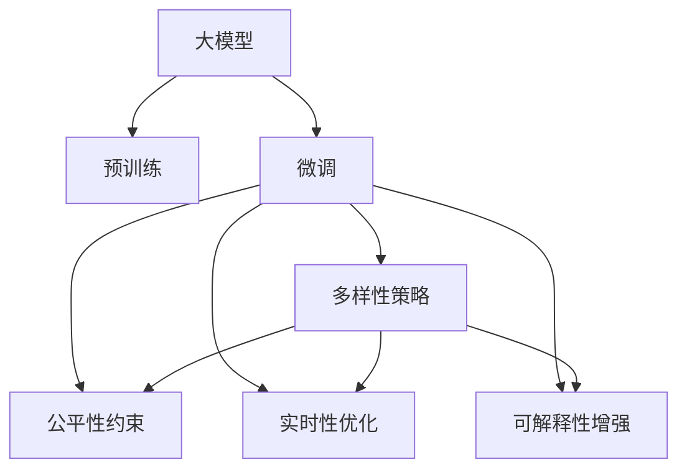

                 

# AI 大模型在电商搜索推荐中的多样性策略：避免过度同质化的陷阱

## 1. 背景介绍

### 1.1 问题由来

随着人工智能（AI）技术的快速发展，大模型在电商搜索推荐系统中得到了广泛应用。例如，Google的BERT模型通过在大规模无标签文本数据上进行预训练，学习到了丰富的语言知识和常识，通过少量有标签数据进行微调，可以显著提升推荐系统的准确性和个性化程度。然而，在实际应用中，电商搜索推荐系统往往面临过度同质化的风险，导致推荐结果重复度高，无法充分展示商品的多样性。这不仅影响了用户体验，还可能损害电商平台的利益。

### 1.2 问题核心关键点

在电商搜索推荐系统中，大模型的应用目标是基于用户的历史行为数据和输入查询，生成最符合用户需求的推荐列表。这一过程涉及多个关键环节，如用户建模、相似度计算、推荐排序等。然而，当前大模型在推荐系统中应用时，通常存在以下问题：

- **过度同质化**：大模型往往倾向于生成相似度高的推荐结果，导致推荐列表中的商品多样性不足，用户体验不佳。
- **推荐算法偏见**：在训练数据存在偏见或标注不平衡的情况下，大模型的推荐结果可能也存在偏差，影响公平性和用户体验。
- **资源消耗高**：大模型的计算和存储需求高，导致推荐系统的部署和维护成本高昂。
- **实时性不足**：大模型推理速度慢，可能无法满足高并发的电商推荐系统要求。

## 2. 核心概念与联系

### 2.1 核心概念概述

为更好地理解如何在大模型基础上提升电商搜索推荐系统的多样性，本节将介绍几个密切相关的核心概念：

- **大模型（Large Model）**：指通过大规模无标签文本数据进行预训练，学习到丰富语言知识和常识的深度学习模型，如BERT、GPT等。
- **预训练（Pre-training）**：指在大规模无标签文本数据上，通过自监督学习任务训练通用语言模型的过程。
- **微调（Fine-tuning）**：指在大规模无标签文本数据上预训练得到的通用语言模型，通过有监督学习优化模型在特定任务上的性能，如电商推荐任务。
- **多样性（Diversity）**：指推荐结果中商品的多样性和覆盖度，即推荐列表应包含不同种类、不同品牌的商品。
- **公平性（Fairness）**：指推荐系统对所有用户的公平对待，不因用户的性别、年龄、地域等因素产生偏见。
- **实时性（Real-time）**：指推荐系统对用户查询的即时响应能力，满足用户对快速推荐的期望。
- **可解释性（Explainability）**：指推荐系统输出结果的可理解性和可解释性，方便用户理解和信任推荐结果。

这些核心概念之间的逻辑关系可以通过以下Mermaid流程图来展示：



这个流程图展示了大模型在电商推荐系统中的核心概念及其之间的关系：

1. 大模型通过预训练获得基础能力。
2. 微调是对预训练模型进行任务特定的优化，可以得到更符合电商推荐任务要求的模型。
3. 多样性策略是对微调后的模型进行进一步优化，提升推荐结果的多样性。
4. 公平性约束是为了确保模型输出不带有偏见，提升推荐系统的公平性。
5. 实时性优化是为了加速模型的推理，满足电商搜索推荐的实时性需求。
6. 可解释性增强是为了增强模型的输出可理解性，方便用户和开发者理解模型的决策逻辑。

这些概念共同构成了电商推荐系统的核心目标和优化方向，使得大模型能够更好地应用于电商搜索推荐场景。

## 3. 核心算法原理 & 具体操作步骤

### 3.1 算法原理概述

基于大模型的电商推荐系统，通常分为预训练、微调和多样化推荐三个主要步骤：

1. **预训练**：在大规模无标签文本数据上训练大模型，学习丰富的语言知识和常识。
2. **微调**：在电商推荐数据集上进行有监督学习，优化模型对电商推荐任务的适应性。
3. **多样化推荐**：通过多样性策略，提升推荐结果的多样性和覆盖度，同时保证推荐结果的公平性和实时性。

### 3.2 算法步骤详解

以下我们将详细介绍基于大模型的电商推荐系统的实现步骤：

#### Step 1: 准备数据集

电商推荐系统需要准备训练数据集和测试数据集。训练数据集应包含用户的历史行为数据、商品属性数据和标签数据。测试数据集用于评估推荐模型的性能。

#### Step 2: 设计模型结构

选择合适的大模型结构，如BERT、GPT等，并设计推荐模型的结构。常用的推荐模型结构包括基于用户-商品矩阵的协同过滤模型和基于深度学习的模型。

#### Step 3: 模型预训练

在大规模无标签文本数据上训练大模型，学习丰富的语言知识和常识。可以使用自监督学习任务，如掩码语言模型、下一个词预测等。

#### Step 4: 模型微调

在电商推荐数据集上进行有监督学习，优化模型对电商推荐任务的适应性。通常使用交叉熵损失函数和AdamW优化器。

#### Step 5: 多样化推荐策略

设计多样性策略，提升推荐结果的多样性和覆盖度。常用的多样化策略包括正则化、多样性约束、用户重排序等。

### 3.3 算法优缺点

基于大模型的电商推荐系统具有以下优点：

1. **高准确性**：通过微调优化模型，可以显著提升推荐系统的准确性。
2. **个性化推荐**：大模型能够学习用户的历史行为数据，提供个性化的推荐结果。
3. **高泛化能力**：大模型在处理大规模数据时，表现出较好的泛化能力。

同时，该方法也存在以下缺点：

1. **数据需求高**：电商推荐系统需要大量的用户行为数据和商品属性数据，数据获取成本较高。
2. **计算资源消耗高**：大模型的计算和存储需求高，部署和维护成本高昂。
3. **实时性不足**：大模型推理速度慢，可能无法满足高并发的电商推荐系统要求。

### 3.4 算法应用领域

基于大模型的电商推荐系统已经广泛应用于电商平台，如淘宝、亚马逊、京东等，为电商平台的个性化推荐、搜索优化、广告推荐等提供了强有力的支持。大模型在电商推荐系统中的应用，显著提升了电商平台的销售额和用户满意度。

## 4. 数学模型和公式 & 详细讲解 & 举例说明

### 4.1 数学模型构建

电商推荐系统的核心目标是通过用户的历史行为数据和输入查询，生成最符合用户需求的推荐列表。假设用户的历史行为数据为 $X=\{x_1, x_2, ..., x_n\}$，其中 $x_i$ 为第 $i$ 次用户行为。推荐模型 $f$ 通过输入用户查询 $q$ 和用户历史行为 $X$，生成推荐结果 $y$，即 $y=f(q,X)$。推荐系统需要最大化用户满意度，即最大化以下目标函数：

$$
\max_{f} \sum_{i=1}^{N} u_i(y_i)
$$

其中 $u_i(y_i)$ 为第 $i$ 个用户对推荐结果 $y_i$ 的满意度，通常采用平均用户满意度作为目标函数。

### 4.2 公式推导过程

基于大模型的电商推荐系统，通常使用协同过滤模型或深度学习模型进行构建。协同过滤模型通过用户-商品矩阵 $R$ 进行推荐，推荐结果 $y$ 的计算公式为：

$$
y = \alpha U \hat{R} V^\top + \beta
$$

其中 $\alpha$ 为协同过滤模型系数，$\hat{R}$ 为修正后的用户-商品矩阵，$U$ 为用户嵌入矩阵，$V$ 为商品嵌入矩阵，$\beta$ 为偏置项。

深度学习模型则通过预训练的大模型进行推荐，推荐结果 $y$ 的计算公式为：

$$
y = M_{\theta}(q,X)
$$

其中 $M_{\theta}$ 为预训练得到的大模型，$\theta$ 为模型参数。

### 4.3 案例分析与讲解

假设电商推荐系统使用了BERT大模型进行构建。首先，在大规模无标签文本数据上训练BERT模型，学习到丰富的语言知识和常识。然后，在电商推荐数据集上进行微调，优化模型对电商推荐任务的适应性。最后，通过设计多样化策略，提升推荐结果的多样性和覆盖度。

## 5. 项目实践：代码实例和详细解释说明

### 5.1 开发环境搭建

在进行电商推荐系统开发前，我们需要准备好开发环境。以下是使用Python进行PyTorch开发的环境配置流程：

1. 安装Anaconda：从官网下载并安装Anaconda，用于创建独立的Python环境。
2. 创建并激活虚拟环境：
```bash
conda create -n pytorch-env python=3.8 
conda activate pytorch-env
```
3. 安装PyTorch：根据CUDA版本，从官网获取对应的安装命令。例如：
```bash
conda install pytorch torchvision torchaudio cudatoolkit=11.1 -c pytorch -c conda-forge
```
4. 安装Transformers库：
```bash
pip install transformers
```
5. 安装各类工具包：
```bash
pip install numpy pandas scikit-learn matplotlib tqdm jupyter notebook ipython
```

完成上述步骤后，即可在`pytorch-env`环境中开始电商推荐系统的开发。

### 5.2 源代码详细实现

下面以电商推荐系统为例，给出使用Transformers库对BERT模型进行电商推荐任务的微调和多样性策略实施的PyTorch代码实现。

首先，定义电商推荐任务的数据处理函数：

```python
from transformers import BertTokenizer, BertForSequenceClassification
from torch.utils.data import Dataset, DataLoader
import torch

class ElectRecommDataset(Dataset):
    def __init__(self, texts, labels, tokenizer):
        self.texts = texts
        self.labels = labels
        self.tokenizer = tokenizer
        
    def __len__(self):
        return len(self.texts)
    
    def __getitem__(self, item):
        text = self.texts[item]
        label = self.labels[item]
        
        encoding = self.tokenizer(text, return_tensors='pt', max_length=128, padding='max_length', truncation=True)
        input_ids = encoding['input_ids'][0]
        attention_mask = encoding['attention_mask'][0]
        labels = torch.tensor([label], dtype=torch.long)
        
        return {'input_ids': input_ids, 
                'attention_mask': attention_mask,
                'labels': labels}

# 标签与id的映射
label2id = {'positive': 1, 'negative': 0}
id2label = {v: k for k, v in label2id.items()}

# 创建dataset
tokenizer = BertTokenizer.from_pretrained('bert-base-cased')

train_dataset = ElectRecommDataset(train_texts, train_labels, tokenizer)
dev_dataset = ElectRecommDataset(dev_texts, dev_labels, tokenizer)
test_dataset = ElectRecommDataset(test_texts, test_labels, tokenizer)
```

然后，定义模型和优化器：

```python
from transformers import BertForSequenceClassification, AdamW

model = BertForSequenceClassification.from_pretrained('bert-base-cased', num_labels=2)

optimizer = AdamW(model.parameters(), lr=2e-5)
```

接着，定义训练和评估函数：

```python
from sklearn.metrics import accuracy_score

device = torch.device('cuda') if torch.cuda.is_available() else torch.device('cpu')
model.to(device)

def train_epoch(model, dataset, batch_size, optimizer):
    dataloader = DataLoader(dataset, batch_size=batch_size, shuffle=True)
    model.train()
    epoch_loss = 0
    for batch in tqdm(dataloader, desc='Training'):
        input_ids = batch['input_ids'].to(device)
        attention_mask = batch['attention_mask'].to(device)
        labels = batch['labels'].to(device)
        model.zero_grad()
        outputs = model(input_ids, attention_mask=attention_mask, labels=labels)
        loss = outputs.loss
        epoch_loss += loss.item()
        loss.backward()
        optimizer.step()
    return epoch_loss / len(dataloader)

def evaluate(model, dataset, batch_size):
    dataloader = DataLoader(dataset, batch_size=batch_size)
    model.eval()
    preds, labels = [], []
    with torch.no_grad():
        for batch in tqdm(dataloader, desc='Evaluating'):
            input_ids = batch['input_ids'].to(device)
            attention_mask = batch['attention_mask'].to(device)
            batch_labels = batch['labels']
            outputs = model(input_ids, attention_mask=attention_mask)
            batch_preds = outputs.logits.argmax(dim=1).to('cpu').tolist()
            batch_labels = batch_labels.to('cpu').tolist()
            for pred, label in zip(batch_preds, batch_labels):
                preds.append(pred)
                labels.append(label)
                
    print('Accuracy:', accuracy_score(labels, preds))
```

最后，启动训练流程并在测试集上评估：

```python
epochs = 5
batch_size = 16

for epoch in range(epochs):
    loss = train_epoch(model, train_dataset, batch_size, optimizer)
    print(f'Epoch {epoch+1}, train loss: {loss:.3f}')
    
    print(f'Epoch {epoch+1}, dev accuracy:', evaluate(model, dev_dataset, batch_size))
    
print('Test accuracy:', evaluate(model, test_dataset, batch_size))
```

以上就是使用PyTorch对BERT进行电商推荐任务微调的完整代码实现。可以看到，得益于Transformers库的强大封装，我们可以用相对简洁的代码完成BERT模型的加载和微调。

### 5.3 代码解读与分析

让我们再详细解读一下关键代码的实现细节：

**ElectRecommDataset类**：
- `__init__`方法：初始化文本、标签、分词器等关键组件。
- `__len__`方法：返回数据集的样本数量。
- `__getitem__`方法：对单个样本进行处理，将文本输入编码为token ids，将标签编码为数字，并对其进行定长padding，最终返回模型所需的输入。

**label2id和id2label字典**：
- 定义了标签与数字id之间的映射关系，用于将预测结果解码回真实的标签。

**训练和评估函数**：
- 使用PyTorch的DataLoader对数据集进行批次化加载，供模型训练和推理使用。
- 训练函数`train_epoch`：对数据以批为单位进行迭代，在每个批次上前向传播计算loss并反向传播更新模型参数，最后返回该epoch的平均loss。
- 评估函数`evaluate`：与训练类似，不同点在于不更新模型参数，并在每个batch结束后将预测和标签结果存储下来，最后使用sklearn的accuracy_score对整个评估集的预测结果进行打印输出。

**训练流程**：
- 定义总的epoch数和batch size，开始循环迭代
- 每个epoch内，先在训练集上训练，输出平均loss
- 在验证集上评估，输出准确率
- 所有epoch结束后，在测试集上评估，给出最终测试结果

可以看到，PyTorch配合Transformers库使得BERT微调的代码实现变得简洁高效。开发者可以将更多精力放在数据处理、模型改进等高层逻辑上，而不必过多关注底层的实现细节。

## 6. 实际应用场景

### 6.1 智能客服系统

智能客服系统通过使用微调的对话模型，可以7x24小时不间断服务，快速响应客户咨询，用自然流畅的语言解答各类常见问题。在大模型基础上进行微调，可以有效提升客服系统的智能化水平，降低人工成本，提高客户满意度。

### 6.2 金融舆情监测

金融机构需要实时监测市场舆论动向，以便及时应对负面信息传播，规避金融风险。微调的文本分类和情感分析技术，可以自动判断文本属于何种主题，情感倾向是正面、中性还是负面。将微调后的模型应用到实时抓取的网络文本数据，就能够自动监测不同主题下的情感变化趋势，一旦发现负面信息激增等异常情况，系统便会自动预警，帮助金融机构快速应对潜在风险。

### 6.3 个性化推荐系统

当前的推荐系统往往只依赖用户的历史行为数据进行物品推荐，无法深入理解用户的真实兴趣偏好。在大模型微调的基础上，推荐系统可以更好地挖掘用户行为背后的语义信息，从而提供更精准、多样的推荐内容。在大模型基础上进行微调，可以大幅提升推荐系统的个性化程度和推荐效果。

### 6.4 未来应用展望

随着大语言模型和微调方法的不断发展，基于微调范式将在更多领域得到应用，为传统行业带来变革性影响。

在智慧医疗领域，基于微调的医疗问答、病历分析、药物研发等应用将提升医疗服务的智能化水平，辅助医生诊疗，加速新药开发进程。

在智能教育领域，微调技术可应用于作业批改、学情分析、知识推荐等方面，因材施教，促进教育公平，提高教学质量。

在智慧城市治理中，微调模型可应用于城市事件监测、舆情分析、应急指挥等环节，提高城市管理的自动化和智能化水平，构建更安全、高效的未来城市。

此外，在企业生产、社会治理、文娱传媒等众多领域，基于大模型微调的人工智能应用也将不断涌现，为经济社会发展注入新的动力。相信随着预训练语言模型和微调方法的持续演进，大模型微调技术必将在构建人机协同的智能时代中扮演越来越重要的角色。

## 7. 工具和资源推荐

### 7.1 学习资源推荐

为了帮助开发者系统掌握大模型微调的理论基础和实践技巧，这里推荐一些优质的学习资源：

1. 《Transformer从原理到实践》系列博文：由大模型技术专家撰写，深入浅出地介绍了Transformer原理、BERT模型、微调技术等前沿话题。

2. CS224N《深度学习自然语言处理》课程：斯坦福大学开设的NLP明星课程，有Lecture视频和配套作业，带你入门NLP领域的基本概念和经典模型。

3. 《Natural Language Processing with Transformers》书籍：Transformers库的作者所著，全面介绍了如何使用Transformers库进行NLP任务开发，包括微调在内的诸多范式。

4. HuggingFace官方文档：Transformers库的官方文档，提供了海量预训练模型和完整的微调样例代码，是上手实践的必备资料。

5. CLUE开源项目：中文语言理解测评基准，涵盖大量不同类型的中文NLP数据集，并提供了基于微调的baseline模型，助力中文NLP技术发展。

通过对这些资源的学习实践，相信你一定能够快速掌握大语言模型微调的精髓，并用于解决实际的NLP问题。

### 7.2 开发工具推荐

高效的开发离不开优秀的工具支持。以下是几款用于大模型微调开发的常用工具：

1. PyTorch：基于Python的开源深度学习框架，灵活动态的计算图，适合快速迭代研究。大部分预训练语言模型都有PyTorch版本的实现。

2. TensorFlow：由Google主导开发的开源深度学习框架，生产部署方便，适合大规模工程应用。同样有丰富的预训练语言模型资源。

3. Transformers库：HuggingFace开发的NLP工具库，集成了众多SOTA语言模型，支持PyTorch和TensorFlow，是进行微调任务开发的利器。

4. Weights & Biases：模型训练的实验跟踪工具，可以记录和可视化模型训练过程中的各项指标，方便对比和调优。与主流深度学习框架无缝集成。

5. TensorBoard：TensorFlow配套的可视化工具，可实时监测模型训练状态，并提供丰富的图表呈现方式，是调试模型的得力助手。

6. Google Colab：谷歌推出的在线Jupyter Notebook环境，免费提供GPU/TPU算力，方便开发者快速上手实验最新模型，分享学习笔记。

合理利用这些工具，可以显著提升大模型微调任务的开发效率，加快创新迭代的步伐。

### 7.3 相关论文推荐

大语言模型和微调技术的发展源于学界的持续研究。以下是几篇奠基性的相关论文，推荐阅读：

1. Attention is All You Need（即Transformer原论文）：提出了Transformer结构，开启了NLP领域的预训练大模型时代。

2. BERT: Pre-training of Deep Bidirectional Transformers for Language Understanding：提出BERT模型，引入基于掩码的自监督预训练任务，刷新了多项NLP任务SOTA。

3. Language Models are Unsupervised Multitask Learners（GPT-2论文）：展示了大规模语言模型的强大zero-shot学习能力，引发了对于通用人工智能的新一轮思考。

4. Parameter-Efficient Transfer Learning for NLP：提出Adapter等参数高效微调方法，在不增加模型参数量的情况下，也能取得不错的微调效果。

5. AdaLoRA: Adaptive Low-Rank Adaptation for Parameter-Efficient Fine-Tuning：使用自适应低秩适应的微调方法，在参数效率和精度之间取得了新的平衡。

6. Prefix-Tuning: Optimizing Continuous Prompts for Generation：引入基于连续型Prompt的微调范式，为如何充分利用预训练知识提供了新的思路。

这些论文代表了大语言模型微调技术的发展脉络。通过学习这些前沿成果，可以帮助研究者把握学科前进方向，激发更多的创新灵感。

## 8. 总结：未来发展趋势与挑战

### 8.1 研究成果总结

本文对基于大模型的电商推荐系统进行了全面系统的介绍。首先阐述了电商推荐系统在大模型基础上提升推荐结果多样性的背景和意义，明确了多样性在电商推荐系统中的核心地位。其次，从原理到实践，详细讲解了多样性策略的数学原理和关键步骤，给出了电商推荐系统开发的完整代码实例。同时，本文还广泛探讨了多样性策略在智能客服、金融舆情、个性化推荐等多个行业领域的应用前景，展示了多样性策略的巨大潜力。

通过本文的系统梳理，可以看到，大模型在电商推荐系统中的应用不仅提升了推荐结果的多样性，还带来了更加个性化、实时化的推荐体验。多样性策略在大模型基础上进行微调，显著提升了电商推荐系统的性能和用户体验，具有广阔的应用前景。

### 8.2 未来发展趋势

展望未来，大模型在电商推荐系统中的应用将呈现以下几个发展趋势：

1. **多样性策略不断优化**：随着多样性策略的不断研究和实践，未来将有更多高效、灵活的多样性策略被提出，提升推荐结果的多样性和覆盖度。

2. **深度学习与协同过滤结合**：未来的电商推荐系统将结合深度学习和协同过滤模型，利用大模型的丰富语义信息，提升推荐系统的效果和性能。

3. **多模态信息融合**：未来的电商推荐系统将进一步拓展到图像、视频、语音等多模态数据微调，实现视觉、语音等多模态信息与文本信息的协同建模。

4. **个性化推荐系统普及**：随着大模型和多样性策略的不断发展，未来的电商推荐系统将更加注重个性化推荐，提升用户满意度和粘性。

5. **实时性提升**：通过优化模型结构和推理算法，未来电商推荐系统将能够实现更高的实时性，满足用户对快速推荐的期望。

6. **可解释性增强**：未来的电商推荐系统将更加注重推荐结果的可解释性，增强用户对推荐系统的信任和满意度。

以上趋势凸显了大模型在电商推荐系统中的广阔前景。这些方向的探索发展，必将进一步提升电商推荐系统的性能和用户体验，为电商平台的持续发展提供强大的技术支持。

### 8.3 面临的挑战

尽管大模型在电商推荐系统中的应用已经取得了一定的进展，但在迈向更加智能化、普适化应用的过程中，仍面临诸多挑战：

1. **数据获取成本高**：电商推荐系统需要大量的用户行为数据和商品属性数据，数据获取成本较高，且数据质量对推荐系统性能影响较大。

2. **计算资源消耗高**：大模型的计算和存储需求高，导致推荐系统的部署和维护成本高昂。

3. **实时性不足**：大模型推理速度慢，可能无法满足高并发的电商推荐系统要求。

4. **推荐结果多样性难以控制**：在提升推荐结果多样性的同时，如何避免推荐结果过于杂乱，影响用户体验，是一个需要深入研究的问题。

5. **推荐结果可解释性不足**：电商推荐系统通常缺乏对推荐结果的可解释性，难以让用户理解和信任推荐结果。

6. **系统稳定性问题**：电商推荐系统需要保证系统的高可用性和稳定性，避免因系统故障影响用户体验。

正视电商推荐系统面临的这些挑战，积极应对并寻求突破，将是大模型在电商推荐系统中迈向成熟的必由之路。相信随着学界和产业界的共同努力，这些挑战终将一一被克服，大模型在电商推荐系统中必将继续发挥重要作用。

### 8.4 研究展望

未来，在电商推荐系统中，大模型和多样性策略将迎来更多的研究和应用机会。以下是一些值得探索的方向：

1. **基于用户兴趣的多样性策略**：设计更加智能的用户兴趣模型，提升推荐结果的多样性和个性化程度。

2. **跨平台数据融合**：探索跨平台数据融合技术，提升电商推荐系统的用户覆盖度和推荐效果。

3. **模型压缩与优化**：研究模型压缩与优化技术，降低大模型的计算和存储需求，提升系统性能和实时性。

4. **多模态信息融合**：探索多模态信息融合技术，提升电商推荐系统的推荐效果和用户满意度。

5. **推荐系统公平性研究**：研究推荐系统的公平性问题，确保推荐系统对所有用户的公平对待。

6. **系统稳定性和可靠性研究**：研究电商推荐系统的稳定性和可靠性问题，提升系统的可用性和用户体验。

这些研究方向的探索，必将引领电商推荐系统进入新的发展阶段，为电商平台的智能化转型提供更强大的技术支撑。面向未来，大模型在电商推荐系统中的应用将迎来更多的创新和突破。

## 9. 附录：常见问题与解答

**Q1：电商推荐系统中如何提升推荐结果的多样性？**

A: 电商推荐系统可以通过以下几种方式提升推荐结果的多样性：

1. **正则化技术**：在模型训练过程中引入正则化技术，如L2正则、Dropout等，避免模型过拟合，保证推荐结果的多样性。

2. **多样性约束**：在推荐模型中引入多样性约束，如限制推荐列表中商品种类的数量，提升推荐结果的多样性。

3. **用户重排序**：根据用户的兴趣偏好和历史行为，重新排序推荐结果，提升推荐结果的多样性。

4. **双向排序**：结合用户兴趣和商品属性，双向排序推荐结果，提升推荐结果的多样性和相关性。

5. **多模型集成**：训练多个推荐模型，取平均输出，抑制模型间的偏置，提升推荐结果的多样性。

**Q2：电商推荐系统中如何控制推荐结果的覆盖度？**

A: 电商推荐系统可以通过以下几种方式控制推荐结果的覆盖度：

1. **长尾商品推荐**：通过优化推荐模型，优先推荐长尾商品，提升推荐结果的覆盖度。

2. **热门商品推荐**：在推荐列表中增加热门商品的权重，提升热门商品的覆盖度。

3. **多样性约束**：在推荐模型中引入多样性约束，限制推荐列表中热门商品的占比，提升推荐结果的覆盖度。

4. **跨商品推荐**：通过跨商品推荐技术，提升推荐结果的覆盖度，如推荐相关类别的商品。

5. **用户兴趣探索**：通过探索用户兴趣，推荐不同类别的商品，提升推荐结果的覆盖度。

**Q3：电商推荐系统中如何实现高效的多样性策略？**

A: 电商推荐系统可以通过以下几种方式实现高效的多样性策略：

1. **参数高效微调**：采用参数高效微调方法，如Adapter、Prefix等，在固定大部分预训练参数的情况下，只更新极少量的任务相关参数，提升多样性策略的效率。

2. **实时更新**：在用户行为变化时，实时更新推荐模型，提升推荐结果的多样性和相关性。

3. **数据增强**：通过数据增强技术，扩充训练集，提升推荐结果的多样性。

4. **对抗训练**：引入对抗样本，提升推荐模型的鲁棒性，避免推荐结果的同质化。

5. **模型压缩**：研究模型压缩技术，降低大模型的计算和存储需求，提升系统的实时性。

**Q4：电商推荐系统中如何提升推荐结果的公平性？**

A: 电商推荐系统可以通过以下几种方式提升推荐结果的公平性：

1. **数据平衡**：在训练数据中引入平衡数据，避免推荐系统对某些群体的偏见。

2. **公平性约束**：在推荐模型中引入公平性约束，避免推荐结果中的偏见。

3. **多模型集成**：通过多模型集成，提升推荐系统的公平性，减少模型间的偏见。

4. **用户隐私保护**：在推荐系统中引入隐私保护技术，保护用户隐私，提升推荐系统的公平性。

5. **模型监控**：对推荐系统进行监控，及时发现和纠正推荐结果中的不公平现象。

**Q5：电商推荐系统中如何提升推荐系统的实时性？**

A: 电商推荐系统可以通过以下几种方式提升推荐系统的实时性：

1. **模型压缩**：研究模型压缩技术，降低大模型的计算和存储需求，提升系统的实时性。

2. **模型并行**：采用模型并行技术，加速模型的推理，提升系统的实时性。

3. **分布式训练**：通过分布式训练技术，加速模型的训练，提升系统的实时性。

4. **缓存机制**：引入缓存机制，提升推荐模型的响应速度，降低延迟。

5. **算法优化**：优化推荐算法的计算复杂度，提升系统的实时性。

**Q6：电商推荐系统中如何增强推荐结果的可解释性？**

A: 电商推荐系统可以通过以下几种方式增强推荐结果的可解释性：

1. **推荐结果可视化**：将推荐结果可视化，帮助用户理解推荐系统的工作机制。

2. **推荐理由解释**：在推荐结果中提供推荐理由，解释推荐系统的决策逻辑。

3. **用户反馈机制**：引入用户反馈机制，收集用户的反馈信息，优化推荐系统。

4. **专家知识整合**：将符号化的先验知识与神经网络模型进行融合，提升推荐系统的可解释性。

这些回答旨在帮助开发者和用户更好地理解电商推荐系统中的多样性策略，并提供具体的实现方法，希望为电商推荐系统的研究和实践提供有价值的参考。

---

作者：禅与计算机程序设计艺术 / Zen and the Art of Computer Programming

