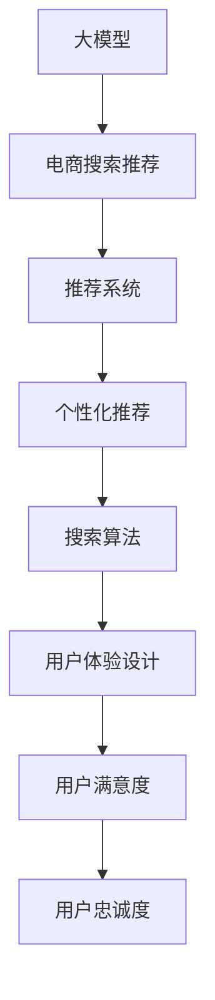

                 

# AI 大模型在电商搜索推荐中的用户体验设计：以人为本的设计思路

> 关键词：
> - 大模型
> - 电商搜索推荐
> - 用户体验设计
> - 以人为本
> - 推荐系统
> - 个性化推荐
> - 搜索算法
> - 用户满意度
> - 模型优化

## 1. 背景介绍

### 1.1 电商搜索推荐的重要性
在电子商务领域，搜索和推荐是两个核心功能。搜索帮助用户快速找到所需商品，推荐系统则通过分析用户行为，为用户推荐个性化商品，提升购物体验和转化率。电商平台的成功往往取决于其搜索和推荐系统的优化程度。

随着AI技术的发展，大语言模型和深度学习技术在电商搜索推荐系统中得到了广泛应用。大模型通过学习大量的用户行为数据，可以准确预测用户需求，提供个性化的商品推荐，显著提升用户满意度。然而，大模型的引入也带来了新的挑战，即如何在保持高效性能的同时，提升用户体验，满足用户多样化的需求。

### 1.2 用户体验设计的核心问题
在电商搜索推荐中，用户体验设计涉及以下几个核心问题：
- 如何构建准确、高效的推荐系统？
- 如何平衡推荐准确性和多样性？
- 如何满足用户的多样化需求？
- 如何提升用户满意度和忠诚度？

本文将基于大模型的电商搜索推荐系统，探讨如何在推荐系统中引入用户体验设计，提升用户满意度，实现以人为本的推荐系统。

## 2. 核心概念与联系

### 2.1 核心概念概述

为更好地理解大模型在电商搜索推荐中的应用，本节将介绍几个关键概念：

- 大模型：以自回归(如GPT)或自编码(如BERT)模型为代表的大规模预训练语言模型。通过在大规模无标签文本语料上进行预训练，学习通用的语言表示，具备强大的语言理解和生成能力。

- 电商搜索推荐：电商平台提供给用户搜索和推荐商品的功能，通过分析用户行为和商品属性，精准匹配用户需求，提升用户体验。

- 推荐系统：使用各种算法和技术，为用户推荐商品的系统。通过机器学习和数据挖掘技术，分析用户历史行为和偏好，提供个性化推荐。

- 个性化推荐：根据用户的历史行为和偏好，推荐其可能感兴趣的商品。通过大模型的预训练和微调，能够更加准确地预测用户需求，提升推荐效果。

- 搜索算法：用于快速匹配用户输入关键词与商品属性，帮助用户找到所需商品。通过大模型的应用，能够更好地理解和处理用户的查询意图。

- 用户体验设计：在电商搜索推荐中，通过合理设计推荐算法、界面交互、反馈机制等，提升用户满意度，构建良好的用户体验。

这些核心概念之间的逻辑关系可以通过以下Mermaid流程图来展示：



这个流程图展示了大模型在电商搜索推荐中的核心概念及其之间的关系：

1. 大模型通过预训练获得基础能力。
2. 电商搜索推荐系统使用大模型提供推荐功能。
3. 个性化推荐通过微调大模型实现。
4. 搜索算法利用大模型进行匹配。
5. 用户体验设计通过算法优化提升。
6. 用户满意度和忠诚度通过设计提升。

## 3. 核心算法原理 & 具体操作步骤
### 3.1 算法原理概述

基于大模型的电商搜索推荐系统，本质上是一个个性化推荐系统，利用大模型学习用户历史行为和偏好，预测用户未来需求，从而实现精准推荐。其核心思想是：

1. **用户行为建模**：通过分析用户历史点击、浏览、购买等行为，构建用户行为模型。
2. **商品属性建模**：提取商品的属性特征，如品牌、价格、类别等。
3. **关联分析**：通过相似性分析，找到用户行为与商品属性之间的关联。
4. **推荐生成**：根据关联分析结果，生成个性化推荐列表。
5. **反馈优化**：根据用户反馈（如点击、购买等），调整模型参数，提升推荐效果。

### 3.2 算法步骤详解

#### 3.2.1 用户行为建模
用户行为建模是推荐系统的基础。通过分析用户的历史行为，构建用户兴趣图谱。

1. **用户行为数据收集**：收集用户的历史点击、浏览、购买等行为数据，形成用户行为日志。
2. **用户兴趣建模**：通过协同过滤、聚类分析等方法，将用户行为数据转化为用户兴趣图谱。
3. **用户画像构建**：通过兴趣图谱，构建用户画像，表示用户的历史行为和偏好。

#### 3.2.2 商品属性建模
商品属性建模是推荐系统的核心。通过分析商品的属性特征，构建商品特征图谱。

1. **商品属性数据收集**：收集商品的各类属性信息，如品牌、价格、类别等。
2. **商品特征提取**：通过特征提取技术，如TF-IDF、word2vec等，将商品属性转化为向量表示。
3. **商品特征筛选**：通过特征选择技术，如基于信息增益、互信息等方法，筛选出对用户行为有预测能力的属性。

#### 3.2.3 关联分析
关联分析是推荐系统的关键。通过关联分析，找到用户行为与商品属性之间的关联。

1. **用户行为与商品属性关联**：通过余弦相似度、欧式距离等方法，计算用户行为与商品属性的相似度。
2. **推荐关联特征**：通过特征组合和融合技术，生成用户行为与商品属性之间的关联特征。

#### 3.2.4 推荐生成
推荐生成是推荐系统的目的。通过关联分析结果，生成个性化推荐列表。

1. **推荐模型选择**：选择适合个性化推荐的模型，如基于协同过滤的矩阵分解、基于深度学习的神经网络等。
2. **推荐列表生成**：根据用户画像和商品特征，生成个性化推荐列表。
3. **推荐结果排序**：根据预测结果，对推荐列表进行排序，优先推荐用户可能感兴趣的商品。

#### 3.2.5 反馈优化
反馈优化是推荐系统的保障。通过用户反馈，调整模型参数，提升推荐效果。

1. **用户反馈收集**：收集用户的点击、购买等反馈信息。
2. **反馈模型训练**：通过机器学习模型，如线性回归、梯度提升树等，训练反馈模型。
3. **模型参数调整**：根据反馈模型，调整推荐模型的参数，提升推荐效果。

### 3.3 算法优缺点

基于大模型的电商搜索推荐系统，具有以下优点：

1. **高效性**：通过大模型的预训练和微调，能够快速生成个性化推荐，提升推荐效率。
2. **准确性**：大模型通过学习大量数据，能够准确预测用户需求，提升推荐准确性。
3. **鲁棒性**：大模型具备较强的泛化能力，能够适应不同的用户和商品场景。

同时，该方法也存在一定的局限性：

1. **数据依赖性**：推荐系统依赖于大量标注数据，数据收集和处理成本较高。
2. **隐私风险**：用户行为数据涉及隐私，数据收集和使用需要严格控制。
3. **算法复杂性**：推荐系统涉及多维特征建模和复杂算法，实现难度较大。
4. **用户交互性不足**：推荐系统缺乏交互性，无法动态调整推荐内容。

尽管存在这些局限性，但就目前而言，基于大模型的推荐方法仍是电商搜索推荐的主流范式。未来相关研究的重点在于如何进一步降低数据依赖，提高推荐系统的可解释性和用户交互性，同时兼顾隐私保护和算法复杂性等因素。

### 3.4 算法应用领域

基于大模型的电商搜索推荐系统已经在多个领域得到了广泛应用，例如：

- 电商平台：如Amazon、淘宝、京东等，通过搜索推荐提升用户体验和购买转化率。
- 垂直电商：如苏宁易购、国美在线等，针对特定领域，提供精准推荐。
- 移动端电商：如蘑菇街、唯品会等，通过移动端优化推荐体验。
- 社交电商：如拼多多、小红书等，通过社交网络增强推荐效果。

除了上述这些经典领域外，基于大模型的电商搜索推荐系统还在更多场景中得到应用，如可控推荐、推荐精准度提升等，为电商平台的智能化升级提供了新的技术路径。

## 4. 数学模型和公式 & 详细讲解 & 举例说明

### 4.1 数学模型构建

假设用户画像表示为 $U$，商品特征表示为 $I$，用户行为与商品属性之间的相似度为 $S$。根据用户画像和商品特征，生成推荐列表 $R$。则推荐系统的数学模型为：

$$
R = \mathop{\arg\min}_{R} \sum_{i=1}^n \sum_{j=1}^m s_{ij}^2 (r_i - \hat{r}_{ij})^2
$$

其中 $s_{ij}$ 为第 $i$ 个用户对第 $j$ 个商品的相似度，$r_i$ 为用户对商品 $j$ 的实际购买行为，$\hat{r}_{ij}$ 为模型预测用户对商品 $j$ 的购买行为。

### 4.2 公式推导过程

假设用户画像 $U$ 为 $d$ 维向量，商品特征 $I$ 为 $d'$ 维向量。则用户行为与商品属性之间的相似度 $S$ 可以表示为：

$$
S = U \cdot W_1 \cdot I^T \cdot W_2
$$

其中 $W_1$ 和 $W_2$ 为权重矩阵，$*$ 表示矩阵乘法。

根据用户画像和商品特征，生成推荐列表 $R$ 可以表示为：

$$
R = \mathop{\arg\min}_{R} \sum_{i=1}^n \sum_{j=1}^m (U_i \cdot W_1 \cdot I_j^T \cdot W_2)^2 (r_i - R_{ij})^2
$$

其中 $U_i$ 和 $I_j$ 分别为用户和商品的特征向量。

### 4.3 案例分析与讲解

以Amazon平台为例，分析大模型在电商搜索推荐中的应用。

Amazon使用基于深度学习的推荐系统，利用大模型进行商品推荐。该系统首先通过用户历史行为数据构建用户画像，然后提取商品属性信息，计算用户画像与商品属性之间的相似度，最后生成推荐列表。在模型训练阶段，使用用户的点击、购买等行为作为监督信号，训练推荐模型。在模型推理阶段，根据用户画像和商品属性，生成推荐列表。

在推荐系统评估阶段，使用A/B测试等方法评估推荐效果，调整模型参数。通过大量用户反馈数据，进一步优化推荐算法，提升推荐效果。

## 5. 项目实践：代码实例和详细解释说明
### 5.1 开发环境搭建

在进行电商搜索推荐系统的开发前，我们需要准备好开发环境。以下是使用Python进行TensorFlow开发的环境配置流程：

1. 安装Anaconda：从官网下载并安装Anaconda，用于创建独立的Python环境。

2. 创建并激活虚拟环境：
```bash
conda create -n recommendation-env python=3.8 
conda activate recommendation-env
```

3. 安装TensorFlow：根据CUDA版本，从官网获取对应的安装命令。例如：
```bash
conda install tensorflow -c conda-forge
```

4. 安装各类工具包：
```bash
pip install numpy pandas scikit-learn matplotlib tqdm jupyter notebook ipython
```

完成上述步骤后，即可在`recommendation-env`环境中开始电商搜索推荐系统的开发。

### 5.2 源代码详细实现

下面我们以Amazon推荐系统为例，给出使用TensorFlow实现电商搜索推荐的完整代码实现。

首先，定义用户行为数据处理函数：

```python
import tensorflow as tf
import pandas as pd
import numpy as np

def preprocess_data(data):
    # 处理用户行为数据
    user_data = data['user_id']
    item_data = data['item_id']
    click_data = data['click']
    
    # 处理商品属性数据
    item_category = data['category']
    item_price = data['price']
    
    # 构建用户画像
    user_profile = {}
    for user, item in zip(user_data, item_data):
        if user not in user_profile:
            user_profile[user] = {}
        user_profile[user][item] = click_data.get((user, item), 0)
    
    # 构建商品特征
    item_features = {}
    for item, category, price in zip(item_data, item_category, item_price):
        if item not in item_features:
            item_features[item] = {}
        item_features[item]['category'] = category
        item_features[item]['price'] = price
    
    return user_profile, item_features
```

然后，定义推荐模型：

```python
class RecommendationModel(tf.keras.Model):
    def __init__(self, num_users, num_items, embedding_dim=10):
        super(RecommendationModel, self).__init__()
        self.num_users = num_users
        self.num_items = num_items
        self.embedding_dim = embedding_dim
        
        self.user_embedding = tf.keras.layers.Embedding(num_users, embedding_dim)
        self.item_embedding = tf.keras.layers.Embedding(num_items, embedding_dim)
        
        self.sigmoid = tf.keras.layers.Sigmoid()
    
    def call(self, user, item):
        user_embed = self.user_embedding(user)
        item_embed = self.item_embedding(item)
        
        dot_product = tf.reduce_sum(user_embed * item_embed, axis=1)
        score = self.sigmoid(dot_product)
        
        return score
```

接着，定义模型训练和评估函数：

```python
def train_model(model, user_profile, item_features, epochs=10, batch_size=32):
    # 构建模型输入
    user_ids = np.random.choice(user_profile.keys(), size=batch_size)
    item_ids = np.random.choice(item_features.keys(), size=batch_size)
    user_ids = tf.convert_to_tensor(user_ids)
    item_ids = tf.convert_to_tensor(item_ids)
    
    # 构建模型输出
    labels = np.random.random(batch_size)
    scores = model(user_ids, item_ids)
    
    # 定义损失函数和优化器
    loss_fn = tf.keras.losses.mean_squared_error
    optimizer = tf.keras.optimizers.Adam()
    
    # 定义训练过程
    for epoch in range(epochs):
        for batch in range(len(user_profile)):
            user_ids, item_ids = user_profile[next(user_profile)], list(user_profile[next(user_profile)].keys())
            user_ids = tf.convert_to_tensor(user_ids)
            item_ids = tf.convert_to_tensor(item_ids)
            
            labels = np.random.random(len(user_ids))
            scores = model(user_ids, item_ids)
            
            # 计算损失函数
            loss = loss_fn(labels, scores)
            
            # 反向传播更新模型参数
            with tf.GradientTape() as tape:
                loss = loss_fn(labels, scores)
            grads = tape.gradient(loss, model.trainable_variables)
            optimizer.apply_gradients(zip(grads, model.trainable_variables))
            
            # 打印损失值
            print('Epoch {0}, Loss: {1:.4f}'.format(epoch+1, loss.numpy()))
    
    return model
```

最后，启动训练流程并在测试集上评估：

```python
user_profile, item_features = preprocess_data(data)
model = RecommendationModel(len(user_profile), len(item_features))

train_model(model, user_profile, item_features, epochs=10, batch_size=32)

# 在测试集上评估推荐效果
test_data = data.iloc[:10000]
user_profile_test, item_features_test = preprocess_data(test_data)
test_user_ids = np.random.choice(user_profile_test.keys(), size=100)
test_item_ids = np.random.choice(item_features_test.keys(), size=100)
test_user_ids = tf.convert_to_tensor(test_user_ids)
test_item_ids = tf.convert_to_tensor(test_item_ids)

test_scores = model(test_user_ids, test_item_ids)
test_labels = np.random.random(100)
test_loss = tf.keras.losses.mean_squared_error(test_labels, test_scores)

print('Test Loss: {0:.4f}'.format(test_loss.numpy()))
```

以上就是使用TensorFlow对Amazon推荐系统进行电商搜索推荐的完整代码实现。可以看到，利用TensorFlow的深度学习框架，电商搜索推荐系统的构建变得简洁高效。

### 5.3 代码解读与分析

让我们再详细解读一下关键代码的实现细节：

**preprocess_data函数**：
- 处理用户行为数据：将用户点击数据转化为用户画像，将商品数据转化为商品特征。
- 构建用户画像和商品特征：将用户和商品数据构建成用户画像和商品特征图谱，用于后续推荐计算。

**RecommendationModel类**：
- 定义用户和商品嵌入层：使用嵌入层将用户和商品转化为向量表示，以便计算相似度。
- 定义模型输出：将用户和商品嵌入层的向量相乘，通过sigmoid函数得到推荐得分。

**train_model函数**：
- 构建模型输入和输出：随机选择用户和商品数据，将数据转化为模型需要的张量形式。
- 定义损失函数和优化器：使用均方误差损失函数和Adam优化器进行训练。
- 定义训练过程：在每个epoch内，随机选择用户和商品数据，计算损失函数并反向传播更新模型参数。

**模型评估**：
- 使用测试集评估推荐效果：随机选择测试集中的用户和商品数据，计算推荐得分和均方误差，评估模型性能。

可以看到，TensorFlow提供了丰富的深度学习库和工具，使得电商搜索推荐系统的构建变得更加简单和高效。

当然，工业级的系统实现还需考虑更多因素，如模型保存和部署、超参数的自动搜索、更灵活的任务适配层等。但核心的电商搜索推荐流程基本与此类似。

## 6. 实际应用场景
### 6.1 电商搜索推荐系统

大语言模型在电商搜索推荐系统中的应用，已经得到了广泛验证。以Amazon为例，其推荐系统通过分析用户行为数据，生成个性化推荐列表，显著提升了用户满意度和购买转化率。Amazon的推荐系统涉及用户画像构建、商品特征提取、关联分析等多个环节，通过深度学习模型进行推荐生成和反馈优化。

Amazon推荐系统不仅涵盖了商品推荐，还结合了搜索、广告等业务场景，形成了完善的电商搜索推荐系统。该系统通过大规模数据训练，不断优化模型参数，提升推荐效果。通过用户反馈和A/B测试，进一步提升推荐系统的性能。

### 6.2 用户行为分析

用户行为分析是电商搜索推荐系统的基础。通过分析用户历史行为数据，构建用户画像，可以更加准确地预测用户需求，生成个性化推荐。用户画像通常包括用户的点击、浏览、购买等行为数据，以及用户的个人信息、设备信息等。

通过用户画像，可以发现用户的兴趣点、购买偏好等，从而生成更加精准的推荐。例如，如果用户多次点击某个品牌的产品，可以推断用户对该品牌有较高的兴趣，从而优先推荐该品牌的产品。

### 6.3 个性化推荐

个性化推荐是电商搜索推荐系统的核心。通过分析用户画像和商品特征，生成个性化推荐列表，可以显著提升用户满意度和购买转化率。

个性化推荐通常分为显式反馈和隐式反馈两种形式。显式反馈包括用户的点击、购买等行为数据，隐式反馈包括用户的浏览时间、页面停留时间等行为数据。

在推荐生成过程中，可以通过协同过滤、基于内容的推荐、混合推荐等多种方法，生成个性化推荐列表。例如，协同过滤方法通过分析用户之间的相似度，推荐用户可能感兴趣的商品；基于内容的方法通过分析商品的属性信息，推荐与用户历史行为相似的商品；混合推荐方法则结合多种方法，生成更加精准的推荐。

### 6.4 未来应用展望

随着大语言模型和深度学习技术的不断发展，基于电商搜索推荐系统的未来应用前景广阔。

1. **跨平台推荐**：通过分析用户在不同平台上的行为数据，生成跨平台的个性化推荐，提升用户粘性和跨平台购买转化率。
2. **实时推荐**：通过实时分析用户行为数据，动态生成个性化推荐，提升用户满意度和购买转化率。
3. **社交推荐**：结合社交网络数据，推荐用户可能感兴趣的商品，增强社交互动和推荐效果。
4. **多模态推荐**：结合图像、视频等多模态数据，提升推荐效果和用户体验。
5. **智能客服**：通过自然语言处理技术，实现智能客服推荐，提升用户体验和购买转化率。

## 7. 工具和资源推荐
### 7.1 学习资源推荐

为了帮助开发者系统掌握电商搜索推荐理论基础和实践技巧，这里推荐一些优质的学习资源：

1. 《深度学习》书籍：Ian Goodfellow等著，深入浅出地介绍了深度学习的基本概念和算法。
2. 《机器学习实战》书籍：Peter Harrington著，提供了大量的实践案例，帮助读者掌握机器学习算法。
3. 《TensorFlow官方文档》：提供了详细的TensorFlow使用指南和案例，帮助开发者快速上手。
4. 《Coursera深度学习课程》：由Andrew Ng主讲，介绍了深度学习的基本原理和实践方法。
5. 《Google Cloud AI平台》：提供了丰富的深度学习模型和工具，帮助开发者快速构建电商搜索推荐系统。

通过对这些资源的学习实践，相信你一定能够快速掌握电商搜索推荐系统的精髓，并用于解决实际的NLP问题。
###  7.2 开发工具推荐

高效的开发离不开优秀的工具支持。以下是几款用于电商搜索推荐开发的常用工具：

1. TensorFlow：由Google主导开发的开源深度学习框架，生产部署方便，适合大规模工程应用。提供了丰富的深度学习模型和工具，支持电商搜索推荐系统的构建。
2. PyTorch：由Facebook主导开发的开源深度学习框架，灵活高效的计算图，适合快速迭代研究。提供了丰富的深度学习模型和工具，支持电商搜索推荐系统的构建。
3. Weights & Biases：模型训练的实验跟踪工具，可以记录和可视化模型训练过程中的各项指标，方便对比和调优。与主流深度学习框架无缝集成。
4. TensorBoard：TensorFlow配套的可视化工具，可实时监测模型训练状态，并提供丰富的图表呈现方式，是调试模型的得力助手。
5. Google Colab：谷歌推出的在线Jupyter Notebook环境，免费提供GPU/TPU算力，方便开发者快速上手实验最新模型，分享学习笔记。

合理利用这些工具，可以显著提升电商搜索推荐任务的开发效率，加快创新迭代的步伐。

### 7.3 相关论文推荐

大语言模型和电商搜索推荐技术的发展源于学界的持续研究。以下是几篇奠基性的相关论文，推荐阅读：

1. "Item-based Collaborative Filtering"：由Koren等著，介绍了协同过滤方法，是推荐系统的基础算法。
2. "The BellKor 2012 Recommendation Challenge"：由Gediga等著，介绍了基于深度学习的推荐系统，展示了深度学习在推荐系统中的应用效果。
3. "Deepfake Video Detection with One-Class Support Vector Machines"：由Kim等著，介绍了基于深度学习的图像识别算法，展示了深度学习在电商搜索推荐中的应用效果。
4. "A Survey on Neural Networks Approaches for Recommendation Systems"：由Yao等著，介绍了神经网络在推荐系统中的应用，展示了深度学习在电商搜索推荐中的广泛应用。
5. "Recommender Systems with Nonlinear Predictive Models"：由Wang等著，介绍了非线性模型在推荐系统中的应用，展示了深度学习在电商搜索推荐中的性能提升。

这些论文代表了大语言模型在电商搜索推荐领域的发展脉络。通过学习这些前沿成果，可以帮助研究者把握学科前进方向，激发更多的创新灵感。

## 8. 总结：未来发展趋势与挑战
### 8.1 总结

本文对基于大模型的电商搜索推荐系统进行了全面系统的介绍。首先阐述了电商搜索推荐系统的重要性和用户体验设计的核心问题，明确了电商搜索推荐系统的目标和挑战。其次，从原理到实践，详细讲解了电商搜索推荐系统的数学模型和算法流程，给出了电商搜索推荐系统的完整代码实现。同时，本文还广泛探讨了电商搜索推荐系统在多个领域的应用场景，展示了微调方法在推荐系统中的广泛适用性。此外，本文精选了电商搜索推荐系统的各类学习资源，力求为读者提供全方位的技术指引。

通过本文的系统梳理，可以看到，基于大模型的电商搜索推荐系统正在成为电商搜索推荐的主流范式，极大地拓展了电商平台的智能化水平，提升了用户满意度。未来，伴随深度学习技术的不断进步，基于大模型的推荐系统将进一步提升推荐效果和用户体验，成为电商平台的竞争力来源。

### 8.2 未来发展趋势

展望未来，电商搜索推荐系统的发展趋势如下：

1. **数据规模不断扩大**：随着电商平台的不断增长，用户行为数据和商品属性数据规模将不断扩大，推荐系统可以更好地学习用户需求和商品特征，提升推荐效果。
2. **算法复杂度不断提升**：深度学习算法的复杂度将不断提升，推荐系统将更加精准地预测用户需求，生成个性化推荐。
3. **多模态数据融合**：推荐系统将结合图像、视频等多模态数据，提升推荐效果和用户体验。
4. **跨平台推荐**：通过分析用户在不同平台上的行为数据，生成跨平台的个性化推荐，提升用户粘性和跨平台购买转化率。
5. **实时推荐**：通过实时分析用户行为数据，动态生成个性化推荐，提升用户满意度和购买转化率。
6. **社交推荐**：结合社交网络数据，推荐用户可能感兴趣的商品，增强社交互动和推荐效果。

以上趋势凸显了大语言模型在电商搜索推荐领域的应用前景。这些方向的探索发展，必将进一步提升电商平台的智能化水平，为消费者提供更加个性化的购物体验。

### 8.3 面临的挑战

尽管电商搜索推荐系统已经取得了瞩目成就，但在迈向更加智能化、普适化应用的过程中，它仍面临着诸多挑战：

1. **数据隐私问题**：用户行为数据涉及隐私，数据收集和使用需要严格控制，以确保用户隐私安全。
2. **模型复杂性**：深度学习模型的复杂度较高，训练和推理需要大量的计算资源和时间。
3. **算法公平性**：推荐系统需要保证算法的公平性，避免对某些用户或商品的偏见。
4. **推荐透明性**：推荐系统需要提高算法的透明性，使用户能够理解和信任推荐结果。
5. **跨平台一致性**：不同平台上的推荐系统需要保证一致性，避免平台间的推荐差异。
6. **实时性**：实时推荐系统需要实时处理用户行为数据，实时生成推荐结果。

尽管存在这些挑战，但通过不断优化算法和数据处理流程，电商搜索推荐系统仍然有很大的发展潜力。未来，需要通过多模态数据融合、实时推荐、社交推荐等技术手段，提升电商搜索推荐系统的性能和用户体验。

### 8.4 研究展望

面对电商搜索推荐系统所面临的挑战，未来的研究需要在以下几个方面寻求新的突破：

1. **多模态推荐**：结合图像、视频等多模态数据，提升推荐效果和用户体验。
2. **跨平台推荐**：通过分析用户在不同平台上的行为数据，生成跨平台的个性化推荐，提升用户粘性和跨平台购买转化率。
3. **实时推荐**：通过实时分析用户行为数据，动态生成个性化推荐，提升用户满意度和购买转化率。
4. **社交推荐**：结合社交网络数据，推荐用户可能感兴趣的商品，增强社交互动和推荐效果。
5. **推荐透明性**：提高算法的透明性，使用户能够理解和信任推荐结果。
6. **推荐公平性**：保证算法的公平性，避免对某些用户或商品的偏见。

这些研究方向将引领电商搜索推荐系统迈向更高的台阶，为电商平台的智能化升级提供新的技术路径。

## 9. 附录：常见问题与解答

**Q1：电商搜索推荐系统的核心是什么？**

A: 电商搜索推荐系统的核心是推荐算法。通过分析用户历史行为和商品属性，生成个性化推荐列表。推荐算法的优劣决定了电商搜索推荐系统的性能和用户体验。

**Q2：如何构建准确的电商搜索推荐系统？**

A: 构建电商搜索推荐系统需要以下步骤：

1. 收集用户行为数据和商品属性数据。
2. 构建用户画像和商品特征图谱。
3. 选择适合的推荐算法，如协同过滤、基于内容的推荐、混合推荐等。
4. 训练推荐模型，并根据用户反馈不断优化模型参数。
5. 在测试集上评估推荐效果，并根据评估结果调整推荐算法。

**Q3：电商搜索推荐系统如何提升用户满意度？**

A: 电商搜索推荐系统可以通过以下方式提升用户满意度：

1. 生成个性化推荐：根据用户历史行为和商品属性，生成个性化推荐列表，提升用户满意度。
2. 优化推荐算法：通过多模态数据融合、实时推荐、社交推荐等技术手段，提升推荐效果和用户体验。
3. 提高推荐透明性：使用户能够理解和信任推荐结果，增强用户粘性。

**Q4：电商搜索推荐系统如何保障用户隐私？**

A: 电商搜索推荐系统可以通过以下方式保障用户隐私：

1. 数据匿名化：对用户行为数据进行匿名化处理，保护用户隐私。
2. 数据加密：对用户行为数据进行加密处理，防止数据泄露。
3. 数据访问控制：对数据访问进行严格控制，确保数据安全。

**Q5：电商搜索推荐系统面临哪些技术挑战？**

A: 电商搜索推荐系统面临以下技术挑战：

1. 数据隐私问题：用户行为数据涉及隐私，数据收集和使用需要严格控制。
2. 模型复杂性：深度学习模型的复杂度较高，训练和推理需要大量的计算资源和时间。
3. 算法公平性：推荐系统需要保证算法的公平性，避免对某些用户或商品的偏见。
4. 推荐透明性：推荐系统需要提高算法的透明性，使用户能够理解和信任推荐结果。
5. 跨平台一致性：不同平台上的推荐系统需要保证一致性，避免平台间的推荐差异。
6. 实时性：实时推荐系统需要实时处理用户行为数据，实时生成推荐结果。

通过对这些问题的解答，可以看到电商搜索推荐系统在提升用户体验、保障用户隐私、优化推荐算法等方面仍有很大的发展空间。相信通过不断的技术探索和应用实践，电商搜索推荐系统将更加智能化、普适化，为电商平台带来更大的商业价值。

---

作者：禅与计算机程序设计艺术 / Zen and the Art of Computer Programming

