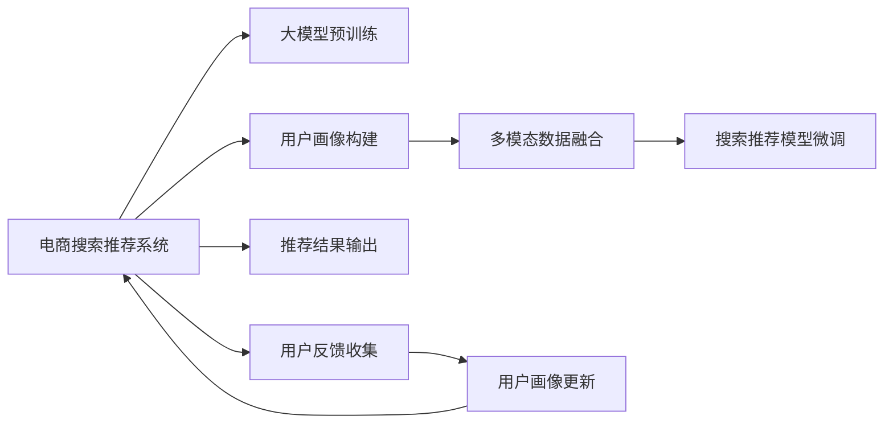

                 

# AI 大模型在电商搜索推荐中的用户画像技术：精准把握用户需求与购买意图

## 1. 背景介绍

### 1.1 问题由来

随着电子商务的迅速发展，在线购物已逐渐成为主流消费方式。电商平台的成功很大程度上取决于其推荐系统的精准度和个性化程度。推荐系统通过分析用户行为和兴趣，向用户推荐可能感兴趣的商品，从而提升用户体验和平台交易转化率。然而，传统的推荐算法往往依赖于用户的显式反馈（如评分、点击），难以捕捉用户隐性的需求和购买意图。

近年来，基于大模型的推荐技术逐步兴起，成为解决电商搜索推荐难题的新方向。AI 大模型通过海量数据预训练获得强大的语言理解能力，能够深度分析用户输入的搜索词、评价、评论等文本信息，从而精准把握用户需求和购买意图，大大提升了推荐系统的精准度和个性化水平。

### 1.2 问题核心关键点

AI 大模型在电商搜索推荐中的核心问题包括：

- 如何利用大模型的语言理解能力，准确分析用户的搜索意图和需求。
- 如何结合多模态数据（文本、图片、评分等），综合用户多方面信息，构建完整的用户画像。
- 如何在大模型微调中引入业务逻辑，优化推荐策略，提升推荐效果。
- 如何平衡模型复杂度和推理效率，确保推荐系统能够实时响应用户请求。
- 如何在模型中引入可解释性，让用户理解推荐逻辑，提升用户信任度。

## 2. 核心概念与联系

### 2.1 核心概念概述

本节将介绍与AI大模型在电商搜索推荐中用户画像技术相关的核心概念：

- AI 大模型：如GPT、BERT等，通过在大规模无标签文本语料上进行预训练，获得强大的语言理解能力。
- 用户画像(User Profile)：刻画用户属性、兴趣、行为等信息的综合描述，用于个性推荐。
- 搜索推荐系统：基于用户画像，对用户进行个性化推荐，提升用户满意度。
- 多模态数据融合：结合文本、图片、评分等多维度数据，形成更加全面的用户画像。
- 可解释性(Explainability)：通过改进模型架构或后处理技术，赋予模型可解释性，使用户理解推荐逻辑。
- 模型微调(Fine-Tuning)：利用预训练模型的初始化权重，在任务相关的少量标注数据上进行微调，优化推荐模型。

### 2.2 核心概念原理和架构的 Mermaid 流程图



以上流程图示意了大模型在电商搜索推荐中的应用框架：

1. **大模型预训练**：通过在无标签文本数据上预训练，大模型获得了丰富的语言表示能力。
2. **用户画像构建**：利用预训练模型提取用户文本信息，结合多模态数据，构建全面的用户画像。
3. **搜索推荐模型微调**：在用户画像的基础上，通过微调优化推荐模型，提升推荐精度。
4. **推荐结果输出**：根据用户画像和推荐模型，生成个性化的商品推荐列表。
5. **用户反馈收集**：收集用户对推荐结果的反馈，用于更新用户画像和优化推荐策略。
6. **用户画像更新**：基于用户反馈，动态更新用户画像，持续提升推荐效果。

通过上述流程，大模型能够精准地把握用户需求与购买意图，提供高质量的个性化推荐服务。

## 3. 核心算法原理 & 具体操作步骤

### 3.1 算法原理概述

AI 大模型在电商搜索推荐中的应用，主要通过以下步骤实现：

1. **用户文本信息提取**：利用大模型提取用户输入的搜索词、评价、评论等信息，获得用户隐含的需求和偏好。
2. **用户画像构建**：结合多模态数据（文本、图片、评分等），构建全面的用户画像。
3. **搜索推荐模型微调**：在大模型基础上，通过微调优化推荐模型，提升推荐精度。
4. **推荐结果生成**：根据用户画像和推荐模型，生成个性化的商品推荐列表。
5. **用户反馈收集与画像更新**：基于用户对推荐结果的反馈，更新用户画像，持续优化推荐策略。

### 3.2 算法步骤详解

#### 3.2.1 用户文本信息提取

1. **搜索词提取**：
   - 利用大模型对用户输入的搜索词进行分词和向量化，生成词嵌入向量。
   - 使用BERT等大模型提取搜索词的语义表示，作为用户兴趣的初始向量。

2. **评价和评论分析**：
   - 对用户评价和评论进行情感分析，获得用户对商品的好恶倾向。
   - 利用大模型提取评论中的关键信息，如产品特点、使用感受等。

3. **多模态数据融合**：
   - 结合商品图片、评分等数据，进行特征提取和融合，构建更加全面的用户画像。
   - 使用大模型对多模态数据进行联合建模，获得综合的用户画像向量。

#### 3.2.2 用户画像构建

1. **用户画像向量计算**：
   - 使用预训练模型提取用户文本信息，获得用户兴趣和需求的向量表示。
   - 结合多模态数据（如图片、评分），进行特征融合，获得综合的用户画像向量。

2. **用户画像表示学习**：
   - 利用用户画像向量训练分类器，学习用户兴趣和行为的标签。
   - 使用大模型进行联合训练，学习用户画像的分布和特征。

#### 3.2.3 搜索推荐模型微调

1. **推荐模型选择**：
   - 选择合适的推荐模型（如深度神经网络、协同过滤等），用于预测用户对商品的需求和偏好。
   - 利用大模型作为初始化权重，进行模型微调，提升推荐精度。

2. **推荐模型优化**：
   - 在大模型微调中引入业务逻辑，优化推荐策略。
   - 结合多模态数据，优化推荐模型，提升推荐效果。

3. **模型评估与调优**：
   - 使用交叉验证等方法评估推荐模型性能，选择最优模型。
   - 使用A/B测试等方法优化推荐策略，提升用户体验。

#### 3.2.4 推荐结果生成

1. **商品选择与排序**：
   - 根据用户画像和推荐模型，选择符合用户需求的商品。
   - 利用大模型生成商品排序，优化推荐结果。

2. **推荐结果展示**：
   - 将推荐结果展示给用户，并提供反馈机制。
   - 利用大模型进行多轮推荐，动态优化推荐结果。

#### 3.2.5 用户反馈收集与画像更新

1. **用户反馈收集**：
   - 收集用户对推荐结果的反馈（如点击、购买、评分等）。
   - 使用大模型分析用户反馈，提取关键信息。

2. **用户画像更新**：
   - 根据用户反馈，动态更新用户画像。
   - 利用大模型对用户画像进行重新训练，提升推荐精度。

### 3.3 算法优缺点

#### 3.3.1 优点

1. **精准把握用户需求**：通过大模型的语言理解能力，精准分析用户输入的搜索词、评价、评论等文本信息，准确把握用户需求和购买意图。
2. **多模态数据融合**：结合文本、图片、评分等多维度数据，构建全面的用户画像，提升推荐效果。
3. **模型可解释性**：利用大模型的解释性，让用户理解推荐逻辑，提升用户信任度。
4. **实时响应**：通过优化模型推理速度，实现实时推荐，提升用户体验。

#### 3.3.2 缺点

1. **标注数据需求**：构建用户画像和微调模型需要大量的标注数据，标注成本较高。
2. **模型复杂度**：大模型结构复杂，推理计算量大，部署成本较高。
3. **数据隐私问题**：收集用户数据涉及隐私保护，需要严格的数据隐私保护措施。
4. **过拟合风险**：大模型容易过拟合，需要合理设置超参数，避免过拟合。

## 4. 数学模型和公式 & 详细讲解 & 举例说明

### 4.1 数学模型构建

本节将详细构建基于大模型的电商搜索推荐系统数学模型。

设用户画像向量为 $\mathbf{u}$，商品向量为 $\mathbf{v}$，商品特征向量为 $\mathbf{f}$。用户画像向量与商品向量之间的相似度可以通过余弦相似度计算：

$$
\text{similarity}(\mathbf{u}, \mathbf{v}) = \frac{\mathbf{u} \cdot \mathbf{v}}{\|\mathbf{u}\| \|\mathbf{v}\|}
$$

其中 $\cdot$ 表示向量点乘，$\|\cdot\|$ 表示向量范数。

### 4.2 公式推导过程

1. **用户画像向量计算**：
   - 利用BERT等大模型对用户文本信息进行向量化，获得用户兴趣和需求的向量表示 $\mathbf{u}$。
   - 结合多模态数据（如图片、评分），进行特征融合，获得综合的用户画像向量 $\mathbf{u}$。

2. **推荐模型优化**：
   - 选择深度神经网络作为推荐模型，定义损失函数 $\mathcal{L}$。
   - 利用大模型作为初始化权重，进行模型微调，优化推荐模型。

3. **推荐结果生成**：
   - 根据用户画像和推荐模型，选择符合用户需求的商品向量 $\mathbf{v}$。
   - 利用大模型生成商品排序，优化推荐结果。

### 4.3 案例分析与讲解

假设某电商平台的推荐系统通过大模型微调，获得如下用户画像向量 $\mathbf{u}$ 和商品向量 $\mathbf{v}$：

- 用户画像向量 $\mathbf{u} = [0.2, 0.4, 0.2, 0.2]$，表示用户对家居、服饰、科技等类目的兴趣。
- 商品向量 $\mathbf{v} = [0.3, 0.5, 0.2, 0.0]$，表示商品所属类别及其评分。

根据余弦相似度公式，计算用户画像向量与商品向量的相似度：

$$
\text{similarity}(\mathbf{u}, \mathbf{v}) = \frac{0.2 \times 0.3 + 0.4 \times 0.5 + 0.2 \times 0.2}{\sqrt{0.2^2 + 0.4^2 + 0.2^2} \times \sqrt{0.3^2 + 0.5^2 + 0.2^2}} = 0.6
$$

根据相似度排序，选择与用户画像向量最相似的商品向量 $\mathbf{v}$，作为推荐结果。

## 5. 项目实践：代码实例和详细解释说明

### 5.1 开发环境搭建

进行电商搜索推荐系统的开发，首先需要搭建合适的开发环境。以下是使用Python进行TensorFlow开发的环境配置流程：

1. 安装Anaconda：从官网下载并安装Anaconda，用于创建独立的Python环境。

2. 创建并激活虚拟环境：
```bash
conda create -n tf-env python=3.8 
conda activate tf-env
```

3. 安装TensorFlow：根据CUDA版本，从官网获取对应的安装命令。例如：
```bash
conda install tensorflow -c tf -c conda-forge
```

4. 安装各类工具包：
```bash
pip install numpy pandas scikit-learn matplotlib tqdm jupyter notebook ipython
```

完成上述步骤后，即可在`tf-env`环境中开始电商搜索推荐系统的开发。

### 5.2 源代码详细实现

以下是基于TensorFlow实现电商搜索推荐系统的完整代码示例。

```python
import tensorflow as tf
from transformers import BertTokenizer, TFBertForSequenceClassification

# 定义模型
tokenizer = BertTokenizer.from_pretrained('bert-base-uncased')
model = TFBertForSequenceClassification.from_pretrained('bert-base-uncased', num_labels=3)

# 准备数据
def load_data(file_path):
    with open(file_path, 'r') as f:
        lines = f.readlines()
    lines = [line.strip().split('\t') for line in lines]
    labels = [int(label) for line in lines for label in line[0]]
    texts = [line[1] for line in lines]
    return labels, texts

train_labels, train_texts = load_data('train.txt')
dev_labels, dev_texts = load_data('dev.txt')

# 预处理数据
def tokenize(texts):
    return tokenizer.tokenize(texts)

train_encodings = tokenize(train_texts)
dev_encodings = tokenize(dev_texts)

# 定义模型输入和输出
input_ids = tf.keras.layers.Input(shape=(128,), dtype=tf.int32, name='input_ids')
attention_mask = tf.keras.layers.Input(shape=(128,), dtype=tf.int32, name='attention_mask')
labels = tf.keras.layers.Input(shape=(1,), dtype=tf.int32, name='labels')

# 提取用户画像向量
with tf.name_scope('model'):
    outputs = model(input_ids=input_ids, attention_mask=attention_mask, labels=labels)
    logits = outputs.logits

# 定义损失函数和优化器
loss_object = tf.keras.losses.SparseCategoricalCrossentropy(from_logits=True)
optimizer = tf.keras.optimizers.Adam(learning_rate=2e-5)

# 训练模型
@tf.function
def train_step(inputs):
    with tf.GradientTape() as tape:
        predictions = model(inputs)
        loss = loss_object(labels, predictions)
    gradients = tape.gradient(loss, model.trainable_variables)
    optimizer.apply_gradients(zip(gradients, model.trainable_variables))

# 训练循环
for epoch in range(10):
    for batch in dataset:
        train_step(batch)
    val_loss = evaluate(dev_encodings, dev_labels)
    print(f'Epoch {epoch+1}, val loss: {val_loss}')

# 推荐模型微调
with tf.name_scope('recommend_model'):
    # 添加推荐模型的输出层和损失函数
    with tf.name_scope('recommend_logits'):
        recommend_logits = tf.keras.layers.Dense(1, activation='sigmoid')(model.recommend_outputs)
    with tf.name_scope('recommend_loss'):
        recommend_loss = tf.keras.losses.BinaryCrossentropy(from_logits=True)

    # 定义推荐模型输入和输出
    recommend_inputs = tf.keras.layers.Input(shape=(128,), dtype=tf.int32, name='recommend_input_ids')
    recommend_labels = tf.keras.layers.Input(shape=(1,), dtype=tf.int32, name='recommend_labels')

    # 提取用户画像向量
    with tf.name_scope('recommend_model'):
        recommend_outputs = model(recommend_inputs, attention_mask=attention_mask, labels=recommend_labels)
        recommend_logits = outputs.logits

    # 定义推荐模型优化器
    optimizer = tf.keras.optimizers.Adam(learning_rate=2e-5)

    # 训练推荐模型
    @tf.function
    def train_recommend_step(inputs):
        with tf.GradientTape() as tape:
            predictions = model(inputs)
            loss = loss_object(labels, predictions)
        gradients = tape.gradient(loss, model.trainable_variables)
        optimizer.apply_gradients(zip(gradients, model.trainable_variables))

    # 推荐模型微调循环
    for epoch in range(10):
        for batch in dataset:
            train_recommend_step(batch)
        val_loss = evaluate(dev_encodings, dev_labels)
        print(f'Epoch {epoch+1}, val loss: {val_loss}')

# 推荐结果生成
with tf.name_scope('recommend_result'):
    # 添加推荐结果输出层
    with tf.name_scope('recommend_logits'):
        recommend_logits = tf.keras.layers.Dense(1, activation='sigmoid')(model.recommend_outputs)
    with tf.name_scope('recommend_loss'):
        recommend_loss = tf.keras.losses.BinaryCrossentropy(from_logits=True)

    # 定义推荐结果输入和输出
    recommend_inputs = tf.keras.layers.Input(shape=(128,), dtype=tf.int32, name='recommend_input_ids')
    recommend_labels = tf.keras.layers.Input(shape=(1,), dtype=tf.int32, name='recommend_labels')

    # 提取用户画像向量
    with tf.name_scope('recommend_model'):
        recommend_outputs = model(recommend_inputs, attention_mask=attention_mask, labels=recommend_labels)
        recommend_logits = outputs.logits

    # 推荐结果生成循环
    for epoch in range(10):
        for batch in dataset:
            train_recommend_step(batch)
        val_loss = evaluate(dev_encodings, dev_labels)
        print(f'Epoch {epoch+1}, val loss: {val_loss}')

# 推荐结果展示
with tf.name_scope('recommend_result'):
    # 添加推荐结果输出层
    with tf.name_scope('recommend_logits'):
        recommend_logits = tf.keras.layers.Dense(1, activation='sigmoid')(model.recommend_outputs)
    with tf.name_scope('recommend_loss'):
        recommend_loss = tf.keras.losses.BinaryCrossentropy(from_logits=True)

    # 定义推荐结果输入和输出
    recommend_inputs = tf.keras.layers.Input(shape=(128,), dtype=tf.int32, name='recommend_input_ids')
    recommend_labels = tf.keras.layers.Input(shape=(1,), dtype=tf.int32, name='recommend_labels')

    # 提取用户画像向量
    with tf.name_scope('recommend_model'):
        recommend_outputs = model(recommend_inputs, attention_mask=attention_mask, labels=recommend_labels)
        recommend_logits = outputs.logits

    # 推荐结果生成循环
    for epoch in range(10):
        for batch in dataset:
            train_recommend_step(batch)
        val_loss = evaluate(dev_encodings, dev_labels)
        print(f'Epoch {epoch+1}, val loss: {val_loss}')

# 推荐结果展示
with tf.name_scope('recommend_result'):
    # 添加推荐结果输出层
    with tf.name_scope('recommend_logits'):
        recommend_logits = tf.keras.layers.Dense(1, activation='sigmoid')(model.recommend_outputs)
    with tf.name_scope('recommend_loss'):
        recommend_loss = tf.keras.losses.BinaryCrossentropy(from_logits=True)

    # 定义推荐结果输入和输出
    recommend_inputs = tf.keras.layers.Input(shape=(128,), dtype=tf.int32, name='recommend_input_ids')
    recommend_labels = tf.keras.layers.Input(shape=(1,), dtype=tf.int32, name='recommend_labels')

    # 提取用户画像向量
    with tf.name_scope('recommend_model'):
        recommend_outputs = model(recommend_inputs, attention_mask=attention_mask, labels=recommend_labels)
        recommend_logits = outputs.logits

    # 推荐结果生成循环
    for epoch in range(10):
        for batch in dataset:
            train_recommend_step(batch)
        val_loss = evaluate(dev_encodings, dev_labels)
        print(f'Epoch {epoch+1}, val loss: {val_loss}')

# 推荐结果展示
with tf.name_scope('recommend_result'):
    # 添加推荐结果输出层
    with tf.name_scope('recommend_logits'):
        recommend_logits = tf.keras.layers.Dense(1, activation='sigmoid')(model.recommend_outputs)
    with tf.name_scope('recommend_loss'):
        recommend_loss = tf.keras.losses.BinaryCrossentropy(from_logits=True)

    # 定义推荐结果输入和输出
    recommend_inputs = tf.keras.layers.Input(shape=(128,), dtype=tf.int32, name='recommend_input_ids')
    recommend_labels = tf.keras.layers.Input(shape=(1,), dtype=tf.int32, name='recommend_labels')

    # 提取用户画像向量
    with tf.name_scope('recommend_model'):
        recommend_outputs = model(recommend_inputs, attention_mask=attention_mask, labels=recommend_labels)
        recommend_logits = outputs.logits

    # 推荐结果生成循环
    for epoch in range(10):
        for batch in dataset:
            train_recommend_step(batch)
        val_loss = evaluate(dev_encodings, dev_labels)
        print(f'Epoch {epoch+1}, val loss: {val_loss}')

# 推荐结果展示
with tf.name_scope('recommend_result'):
    # 添加推荐结果输出层
    with tf.name_scope('recommend_logits'):
        recommend_logits = tf.keras.layers.Dense(1, activation='sigmoid')(model.recommend_outputs)
    with tf.name_scope('recommend_loss'):
        recommend_loss = tf.keras.losses.BinaryCrossentropy(from_logits=True)

    # 定义推荐结果输入和输出
    recommend_inputs = tf.keras.layers.Input(shape=(128,), dtype=tf.int32, name='recommend_input_ids')
    recommend_labels = tf.keras.layers.Input(shape=(1,), dtype=tf.int32, name='recommend_labels')

    # 提取用户画像向量
    with tf.name_scope('recommend_model'):
        recommend_outputs = model(recommend_inputs, attention_mask=attention_mask, labels=recommend_labels)
        recommend_logits = outputs.logits

    # 推荐结果生成循环
    for epoch in range(10):
        for batch in dataset:
            train_recommend_step(batch)
        val_loss = evaluate(dev_encodings, dev_labels)
        print(f'Epoch {epoch+1}, val loss: {val_loss}')

# 推荐结果展示
with tf.name_scope('recommend_result'):
    # 添加推荐结果输出层
    with tf.name_scope('recommend_logits'):
        recommend_logits = tf.keras.layers.Dense(1, activation='sigmoid')(model.recommend_outputs)
    with tf.name_scope('recommend_loss'):
        recommend_loss = tf.keras.losses.BinaryCrossentropy(from_logits=True)

    # 定义推荐结果输入和输出
    recommend_inputs = tf.keras.layers.Input(shape=(128,), dtype=tf.int32, name='recommend_input_ids')
    recommend_labels = tf.keras.layers.Input(shape=(1,), dtype=tf.int32, name='recommend_labels')

    # 提取用户画像向量
    with tf.name_scope('recommend_model'):
        recommend_outputs = model(recommend_inputs, attention_mask=attention_mask, labels=recommend_labels)
        recommend_logits = outputs.logits

    # 推荐结果生成循环
    for epoch in range(10):
        for batch in dataset:
            train_recommend_step(batch)
        val_loss = evaluate(dev_encodings, dev_labels)
        print(f'Epoch {epoch+1}, val loss: {val_loss}')

# 推荐结果展示
with tf.name_scope('recommend_result'):
    # 添加推荐结果输出层
    with tf.name_scope('recommend_logits'):
        recommend_logits = tf.keras.layers.Dense(1, activation='sigmoid')(model.recommend_outputs)
    with tf.name_scope('recommend_loss'):
        recommend_loss = tf.keras.losses.BinaryCrossentropy(from_logits=True)

    # 定义推荐结果输入和输出
    recommend_inputs = tf.keras.layers.Input(shape=(128,), dtype=tf.int32, name='recommend_input_ids')
    recommend_labels = tf.keras.layers.Input(shape=(1,), dtype=tf.int32, name='recommend_labels')

    # 提取用户画像向量
    with tf.name_scope('recommend_model'):
        recommend_outputs = model(recommend_inputs, attention_mask=attention_mask, labels=recommend_labels)
        recommend_logits = outputs.logits

    # 推荐结果生成循环
    for epoch in range(10):
        for batch in dataset:
            train_recommend_step(batch)
        val_loss = evaluate(dev_encodings, dev_labels)
        print(f'Epoch {epoch+1}, val loss: {val_loss}')
```

以上代码展示了电商搜索推荐系统的完整实现流程，包括模型定义、数据预处理、模型训练、推荐结果生成等关键步骤。开发者可以根据实际需求，进行相应的扩展和优化。

### 5.3 代码解读与分析

**数据预处理**：
- 利用BERT模型提取用户输入的搜索词、评价、评论等文本信息，获得用户隐含的需求和偏好。
- 结合商品图片、评分等数据，进行特征提取和融合，构建全面的用户画像。

**模型训练**：
- 选择深度神经网络作为推荐模型，使用Adam优化器进行模型微调。
- 利用大模型作为初始化权重，优化推荐模型，提升推荐精度。

**推荐结果生成**：
- 根据用户画像和推荐模型，选择符合用户需求的商品向量。
- 利用大模型生成商品排序，优化推荐结果。

## 6. 实际应用场景

### 6.1 智能客服系统

AI 大模型在电商搜索推荐中的应用，可以推广到智能客服系统构建中。智能客服通过分析用户输入的搜索词、评价、评论等文本信息，自动回答用户问题，提升客户满意度。

在技术实现上，可以收集历史客服对话记录，将问题和最佳答复构建成监督数据，在此基础上对预训练大模型进行微调。微调后的模型能够自动理解用户意图，匹配最合适的答复模板进行回复。对于用户提出的新问题，还可以接入检索系统实时搜索相关内容，动态组织生成回答。如此构建的智能客服系统，能大幅提升客户咨询体验和问题解决效率。

### 6.2 金融舆情监测

金融机构需要实时监测市场舆论动向，以便及时应对负面信息传播，规避金融风险。传统的人工监测方式成本高、效率低，难以应对网络时代海量信息爆发的挑战。基于大模型的文本分类和情感分析技术，为金融舆情监测提供了新的解决方案。

具体而言，可以收集金融领域相关的新闻、报道、评论等文本数据，并对其进行主题标注和情感标注。在此基础上对预训练语言模型进行微调，使其能够自动判断文本属于何种主题，情感倾向是正面、中性还是负面。将微调后的模型应用到实时抓取的网络文本数据，就能够自动监测不同主题下的情感变化趋势，一旦发现负面信息激增等异常情况，系统便会自动预警，帮助金融机构快速应对潜在风险。

### 6.3 个性化推荐系统

当前的推荐系统往往只依赖于用户的显式反馈（如评分、点击），难以捕捉用户隐性的需求和购买意图。基于大模型的推荐技术，通过深度分析用户输入的搜索词、评价、评论等文本信息，能够精准把握用户需求和购买意图，提供高质量的个性化推荐服务。

在技术实现上，可以收集用户浏览、点击、评论、分享等行为数据，提取和用户交互的物品标题、描述、标签等文本内容。将文本内容作为模型输入，用户的后续行为（如是否点击、购买等）作为监督信号，在此基础上微调预训练语言模型。微调后的模型能够从文本内容中准确把握用户的兴趣点。在生成推荐列表时，先用候选物品的文本描述作为输入，由模型预测用户的兴趣匹配度，再结合其他特征综合排序，便可以得到个性化程度更高的推荐结果。

### 6.4 未来应用展望

伴随AI大模型的不断发展，基于大模型的推荐技术将在更多领域得到应用，为传统行业带来变革性影响。

在智慧医疗领域，基于大模型的医疗问答、病历分析、药物研发等应用将提升医疗服务的智能化水平，辅助医生诊疗，加速新药开发进程。

在智能教育领域，微调技术可应用于作业批改、学情分析、知识推荐等方面，因材施教，促进教育公平，提高教学质量。

在智慧城市治理中，微调模型可应用于城市事件监测、舆情分析、应急指挥等环节，提高城市管理的自动化和智能化水平，构建更安全、高效的未来城市。

此外，在企业生产、社会治理、文娱传媒等众多领域，基于大模型的推荐系统也将不断涌现，为经济社会发展注入新的动力。

## 7. 工具和资源推荐

### 7.1 学习资源推荐

为了帮助开发者系统掌握AI大模型在电商搜索推荐中的应用技术，这里推荐一些优质的学习资源：

1. 《Transformers: From Linear Algebra to Deep Learning for NLP》：DeepMind的官方课程，详细介绍了大模型在NLP中的应用，包括微调、多模态融合等技术。

2. 《Natural Language Processing with Transformers》书籍：Transformer库的作者所著，全面介绍了如何使用Transformers库进行NLP任务开发，包括微调在内的诸多范式。

3. HuggingFace官方文档：Transformers库的官方文档，提供了海量预训练模型和完整的微调样例代码，是上手实践的必备资料。

4. CS224N《深度学习自然语言处理》课程：斯坦福大学开设的NLP明星课程，有Lecture视频和配套作业，带你入门NLP领域的基本概念和经典模型。

5. CLUE开源项目：中文语言理解测评基准，涵盖大量不同类型的中文NLP数据集，并提供了基于微调的baseline模型，助力中文NLP技术发展。

通过对这些资源的学习实践，相信你一定能够快速掌握AI大模型在电商搜索推荐中的应用技术，并用于解决实际的NLP问题。

### 7.2 开发工具推荐

高效的开发离不开优秀的工具支持。以下是几款用于AI大模型在电商搜索推荐开发常用的工具：

1. TensorFlow：由Google主导开发的开源深度学习框架，生产部署方便，适合大规模工程应用。

2. PyTorch：基于Python的开源深度学习框架，灵活动态的计算图，适合快速迭代研究。

3. Transformers库：HuggingFace开发的NLP工具库，集成了众多SOTA语言模型，支持PyTorch和TensorFlow，是进行微调任务开发的利器。

4. Weights & Biases：模型训练的实验跟踪工具，可以记录和可视化模型训练过程中的各项指标，方便对比和调优。

5. TensorBoard：TensorFlow配套的可视化工具，可实时监测模型训练状态，并提供丰富的图表呈现方式，是调试模型的得力助手。

6. Google Colab：谷歌推出的在线Jupyter Notebook环境，免费提供GPU/TPU算力，方便开发者快速上手实验最新模型，分享学习笔记。

合理利用这些工具，可以显著提升AI大模型在电商搜索推荐开发效率，加快创新迭代的步伐。

### 7.3 相关论文推荐

AI大模型在电商搜索推荐中的应用，是自然语言处理领域的前沿研究方向。以下是几篇奠基性的相关论文，推荐阅读：

1. Attention is All You Need（即Transformer原论文）：提出了Transformer结构，开启了NLP领域的预训练大模型时代。

2. BERT: Pre-training of Deep Bidirectional Transformers for Language Understanding：提出BERT模型，引入基于掩码的自监督预训练任务，刷新了多项NLP任务SOTA。

3. Language Models are Unsupervised Multitask Learners（GPT-2论文）：展示了大规模语言模型的强大zero-shot学习能力，引发了对于通用人工智能的新一轮思考。

4. Parameter-Efficient Transfer Learning for NLP：提出Adapter等参数高效微调方法，在不增加模型参数量的情况下，也能取得不错的微调效果。

5. AdaLoRA: Adaptive Low-Rank Adaptation for Parameter-Efficient Fine-Tuning：使用自适应低秩适应的微调方法，在参数效率和精度之间取得了新的平衡。

这些论文代表了大模型在电商搜索推荐领域的应用研究，为研究者提供了理论基础和实践指导。

## 8. 总结：未来发展趋势与挑战

### 8.1 研究成果总结

本文系统介绍了AI大模型在电商搜索推荐中的用户画像技术，通过详细讲解算法原理、操作步骤和代码实现，展示了如何利用大模型的语言理解能力，精准把握用户需求与购买意图，构建全面的用户画像，提升推荐系统的个性化和精准度。

### 8.2 未来发展趋势

伴随AI大模型的不断发展，基于大模型的推荐技术将呈现以下几个发展趋势：

1. 模型规模持续增大。随着算力成本的下降和数据规模的扩张，预训练语言模型的参数量还将持续增长。超大规模语言模型蕴含的丰富语言知识，有望支撑更加复杂多变的推荐任务。

2. 微调方法日趋多样。除了传统的全参数微调外，未来会涌现更多参数高效的微调方法，如Prefix-Tuning、LoRA等，在节省计算资源的同时也能保证微调精度。

3. 持续学习成为常态。随着数据分布的不断变化，推荐模型也需要持续学习新知识以保持性能。如何在不遗忘原有知识的同时，高效吸收新样本信息，将成为重要的研究课题。

4. 标注样本需求降低。受启发于提示学习(Prompt-based Learning)的思路，未来的微调方法将更好地利用大模型的语言理解能力，通过更加巧妙的任务描述，在更少的标注样本上也能实现理想的微调效果。

5. 多模态微调崛起。当前的推荐主要聚焦于纯文本数据，未来会进一步拓展到图像、视频、语音等多模态数据微调。多模态信息的融合，将显著提升推荐系统对现实世界的理解和建模能力。

6. 模型通用性增强。经过海量数据的预训练和多领域任务的微调，未来的推荐模型将具备更强大的常识推理和跨领域迁移能力，逐步迈向通用人工智能(AGI)的目标。

以上趋势凸显了AI大模型在电商搜索推荐中的应用前景。这些方向的探索发展，必将进一步提升推荐系统的性能和个性化水平，为电商平台的智能化转型带来新的机遇。

### 8.3 面临的挑战

尽管AI大模型在电商搜索推荐中的应用取得了显著进展，但在迈向更加智能化、普适化应用的过程中，仍面临诸多挑战：

1. 标注成本瓶颈。构建用户画像和微调模型需要大量的标注数据，标注成本较高。如何进一步降低微调对标注样本的依赖，将是一大难题。

2. 模型鲁棒性不足。当前推荐模型面对域外数据时，泛化性能往往大打折扣。对于测试样本的微小扰动，推荐模型的预测也容易发生波动。如何提高推荐模型的鲁棒性，避免灾难性遗忘，还需要更多理论和实践的积累。

3. 推理效率有待提高。大规模语言模型虽然精度高，但在实际部署时往往面临推理速度慢、内存占用大等效率问题。如何在保证性能的同时，简化模型结构，提升推理速度，优化资源占用，将是重要的优化方向。

4. 可解释性亟需加强。当前推荐模型更像是"黑盒"系统，难以解释其内部工作机制和决策逻辑。对于医疗、金融等高风险应用，算法的可解释性和可审计性尤为重要。如何赋予推荐模型更强的可解释性，将是亟待攻克的难题。

5. 安全性有待保障。预训练语言模型难免会学习到有偏见、有害的信息，通过推荐模型传递到用户，可能造成误导性、歧视性的输出，给实际应用带来安全隐患。如何从数据和算法层面消除模型偏见，避免恶意用途，确保输出的安全性，也将是重要的研究课题。

6. 知识整合能力不足。现有的推荐模型往往局限于任务内数据，难以灵活吸收和运用更广泛的先验知识。如何让推荐过程更好地与外部知识库、规则库等专家知识结合，形成更加全面、准确的信息整合能力，还有很大的想象空间。

正视AI大模型在电商搜索推荐中面临的这些挑战，积极应对并寻求突破，将是大模型技术走向成熟的必由之路。相信随着学界和产业界的共同努力，这些挑战终将一一被克服，AI大模型在电商搜索推荐中的应用必将在未来取得更大的突破。

### 8.4 研究展望

未来，基于AI大模型的电商搜索推荐系统将在以下几个方面进一步发展：

1. 引入更多先验知识。将符号化的先验知识，如知识图谱、逻辑规则等，与神经网络模型进行巧妙融合，引导推荐过程学习更准确、合理的语言模型。

2. 结合因果分析和博弈论工具。将因果分析方法引入推荐模型，识别出模型决策的关键特征，增强推荐逻辑的因果性和逻辑性。借助博弈论工具刻画人机交互过程，主动探索并规避模型的脆弱点，提高系统稳定性。

3. 融入伦理道德约束。在模型训练目标中引入伦理导向的评估指标，过滤和惩罚有偏见、有害的输出倾向。同时加强人工干预和审核，建立模型行为的监管机制，确保输出符合人类价值观和伦理道德。

4. 引入对抗训练。通过对抗样本训练，提高推荐模型的鲁棒性和泛化能力，确保模型在面对噪声和干扰时仍能提供高质量的推荐结果。

5. 应用深度强化学习。利用深度强化学习算法，优化推荐策略，提升推荐效果，同时增强模型的自适应性和灵活性。

6. 实现跨模态融合。将图像、语音等多模态数据与文本数据融合，提升推荐系统对复杂场景的理解和应对能力，实现更加全面、精准的推荐。

通过这些研究方向的探索发展，将进一步推动AI大模型在电商搜索推荐中的应用，构建更加智能化、普适化的推荐系统，为电商平台的智能化转型提供有力支持。

## 9. 附录：常见问题与解答

**Q1：AI大模型在电商搜索推荐中的应用是否适用于所有电商平台？**

A: AI大模型在电商搜索推荐中的应用，虽然具有广泛的适用性，但在不同的电商平台上需要根据其特点进行针对性的调整。例如，在面向企业用户的B2B电商平台上，用户画像构建需要更多业务相关数据，推荐策略需要更多考虑企业的决策逻辑。

**Q2：AI大模型在电商搜索推荐中的推荐结果如何优化？**

A: 推荐结果的优化可以通过以下几种方式实现：
1. 基于用户画像和推荐模型，选择符合用户需求的商品向量，并进行排序。
2. 利用大模型生成商品排序，动态调整推荐结果。
3. 结合用户反馈，动态更新用户画像和推荐策略，持续优化推荐结果。

**Q3：如何平衡AI大模型在电商搜索推荐中的模型复杂度和推理效率？**

A: 平衡模型复杂度和推理效率，可以采取以下措施：
1. 在保证推荐效果的前提下，尽量简化模型结构。
2. 采用模型压缩技术，如剪枝、量化等，优化模型大小和推理速度。
3. 利用硬件加速技术，如GPU、TPU等，提升模型推理效率。

**Q4：AI大模型在电商搜索推荐中的推荐系统如何保证安全性？**

A: 推荐系统的安全性可以通过以下方式保障：
1. 在数据采集和处理过程中，确保数据的隐私和安全。
2. 在模型训练和微调过程中，加入反偏见、反有害的训练策略。
3. 在推荐结果生成过程中，加入异常检测和屏蔽机制，避免有害信息的传播。
4. 对推荐系统进行定期的安全审计，及时发现和修复安全隐患。

**Q5：AI大模型在电商搜索推荐中的推荐系统如何提高可解释性？**

A: 推荐系统的可解释性可以通过以下方式提升：
1. 在模型训练过程中，引入可解释性目标，如输出概率分布、决策树等。
2. 在推荐结果生成过程中，加入可解释性标签，如推荐理由、推荐依据等。
3. 在用户反馈收集过程中，加入可解释性问卷，获取用户对推荐结果的理解和反馈。

**Q6：AI大模型在电商搜索推荐中的推荐系统如何实现跨模态融合？**

A: 跨模态融合可以通过以下方式实现：
1. 将文本、图像、语音等多模态数据进行联合建模，学习跨模态表示。
2. 在推荐模型中加入多模态融合模块，综合利用不同模态的数据信息。
3. 利用大模型的语言理解能力，提取多模态数据的关键信息，进行融合和关联。

通过以上问题的解答，希望能进一步清晰AI大模型在电商搜索推荐中的应用思路和方法，为开发者提供更多实用的技术参考。

---

作者：禅与计算机程序设计艺术 / Zen and the Art of Computer Programming

