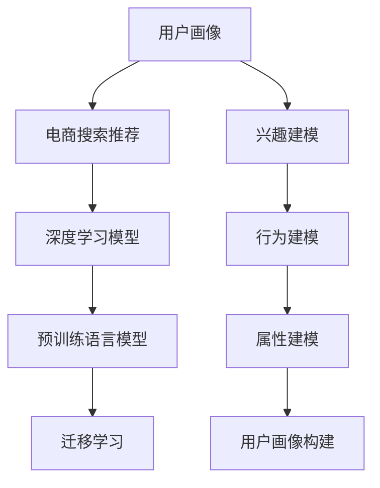

                 

# AI 大模型在电商搜索推荐中的用户画像构建：精准把握用户需求与行为偏好

## 1. 背景介绍

随着电商行业的蓬勃发展，用户行为的多样化和个性化需求愈发凸显。如何通过高效的用户画像构建方法，精准把握用户需求与行为偏好，并及时推荐符合用户兴趣的商品，成为电商平台亟待解决的重要问题。传统的人工规则和统计方法已经难以适应电商行业日益复杂化的用户需求，而基于深度学习和大模型的大规模用户画像构建方法，逐步成为主流。本文将详细探讨AI大模型在电商搜索推荐中的用户画像构建方法，利用先进的深度学习技术和丰富的预训练模型资源，全面提升用户画像的构建精度和推荐效果。

## 2. 核心概念与联系

### 2.1 核心概念概述

- **用户画像**：通过对用户行为的全面分析，构建的具有高度抽象性和概括性的用户模型。电商搜索推荐中的用户画像通常包含用户的兴趣、行为、属性等多维特征。

- **搜索推荐系统**：根据用户输入的查询和浏览记录，推荐符合用户兴趣的商品的系统。AI大模型在搜索推荐系统中的应用，能够显著提升推荐效果，提升用户体验。

- **深度学习**：一种基于人工神经网络的机器学习技术，通过多层次的非线性映射，自动提取和融合数据特征，实现高效的数据建模和预测。

- **预训练语言模型**：如BERT、GPT-3等，在大规模无标签数据上进行预训练，学习通用的语言表示，具备强大的语言理解和生成能力。

- **迁移学习**：将一个领域学习到的知识，迁移到另一个相关领域的应用中。通过迁移学习，可以在相对少量的标注数据上，提升模型在特定任务上的性能。

### 2.2 核心概念原理和架构的 Mermaid 流程图



该图展示了电商搜索推荐中用户画像构建的总体架构，涉及用户兴趣、行为、属性等多维建模，并通过深度学习模型和预训练语言模型实现迁移学习，从而构建高度精准的用户画像。

## 3. 核心算法原理 & 具体操作步骤

### 3.1 算法原理概述

基于AI大模型的电商搜索推荐用户画像构建方法，主要基于深度学习中的自编码器和预训练语言模型，结合迁移学习技术，通过多层次的特征映射，捕捉用户的多维行为特征。其核心思想是将用户行为映射到高维语义空间，通过多维度的特征融合，生成高精度的用户画像。

### 3.2 算法步骤详解

1. **数据预处理**：收集用户的历史搜索记录、浏览行为、交易记录等数据，进行去重、标准化处理，构建用户行为数据集。

2. **特征提取**：使用深度学习中的自编码器模型，将用户行为数据转化为高维语义空间中的表示。常见的自编码器包括Denoising Autoencoder、VAE等。

3. **兴趣建模**：将提取的高维特征，通过预训练语言模型，进行兴趣主题建模。预训练语言模型（如BERT）可以通过自监督学习任务，学习到丰富的语言表示，用于捕捉用户兴趣。

4. **行为建模**：将用户行为数据转化为时间序列数据，通过RNN或Transformer模型，学习用户行为的时序特征，捕捉用户的长期行为模式。

5. **属性建模**：收集用户的年龄、性别、地域、收入等信息，利用one-hot编码等方式，将用户属性数据转化为高维向量。

6. **融合用户画像**：将兴趣、行为、属性等多维特征，通过softmax、注意力机制等方法进行融合，生成高精度的用户画像。

7. **模型评估**：在构建好的用户画像基础上，使用A/B测试、在线实验等方式，评估模型的推荐效果，调整模型参数，优化推荐策略。

### 3.3 算法优缺点

**优点**：
1. **高效精准**：AI大模型通过深度学习的多层次特征映射，可以高效精准地捕捉用户行为和兴趣。
2. **可扩展性强**：预训练语言模型和深度学习模型可以方便地在大规模数据上进行迁移学习，适应电商搜索推荐中用户画像的多样性。
3. **实时更新**：AI大模型能够实时处理用户行为数据，动态更新用户画像，提升推荐效果。

**缺点**：
1. **计算资源需求高**：AI大模型的训练和推理需要大量的计算资源，成本较高。
2. **数据隐私问题**：电商搜索推荐系统需要处理大量的用户行为数据，隐私保护问题需要重点关注。
3. **模型复杂度高**：AI大模型的多层次特征映射和迁移学习，需要复杂的模型结构和大量超参数调整。

### 3.4 算法应用领域

AI大模型在电商搜索推荐中的用户画像构建，主要应用于以下场景：

- **个性化推荐**：通过高精度的用户画像，实现个性化商品推荐，提升用户满意度和购买转化率。
- **用户行为分析**：通过分析用户兴趣和行为模式，帮助电商企业制定精准的市场营销策略。
- **广告投放优化**：利用用户画像数据，优化广告定向策略，提升广告投放效果和转化率。
- **用户流失预测**：通过构建用户行为和属性特征，预测用户流失风险，提前进行用户召回。

## 4. 数学模型和公式 & 详细讲解 & 举例说明

### 4.1 数学模型构建

假设用户行为数据集为 $D=\{(x_i, y_i)\}_{i=1}^N$，其中 $x_i$ 为用户行为特征向量，$y_i$ 为标注标签（如浏览、购买等）。定义深度学习模型 $M_{\theta}$，其中 $\theta$ 为模型参数。用户画像 $P$ 表示为向量形式 $P = [p_1, p_2, ..., p_d]$，其中 $p_i$ 为第 $i$ 个特征维度。

### 4.2 公式推导过程

以用户兴趣建模为例，假定使用BERT模型作为预训练语言模型，其输入为 $x_i$，输出为兴趣向量 $z_i$。则用户兴趣建模的过程为：

$$
z_i = \text{BERT}(x_i)
$$

接着，使用softmax函数将兴趣向量映射为兴趣主题概率分布：

$$
\hat{y}_i = \text{softmax}(z_i)
$$

定义损失函数 $\ell$ 为交叉熵损失，用于衡量模型预测与真实标签之间的差异：

$$
\ell(M_{\theta}, D) = -\frac{1}{N}\sum_{i=1}^N \log \hat{y}_i^{y_i}
$$

其中 $y_i^{y_i}$ 为one-hot编码后的标注向量。

### 4.3 案例分析与讲解

以电商搜索推荐中的用户画像构建为例，假设收集到用户的历史搜索记录、浏览行为和交易记录，构建用户行为数据集 $D$。使用深度学习中的自编码器模型 $M_{\theta}$，对用户行为数据进行编码，得到高维特征表示 $x_i = [x_{i,1}, x_{i,2}, ..., x_{i,d}]$。接着，将高维特征 $x_i$ 输入BERT模型，得到兴趣向量 $z_i$。使用softmax函数将兴趣向量映射为兴趣主题概率分布 $\hat{y}_i$。最后，通过交叉熵损失函数 $\ell$，优化模型参数 $\theta$，生成用户兴趣主题画像 $p_i$。

## 5. 项目实践：代码实例和详细解释说明

### 5.1 开发环境搭建

1. **安装依赖**：使用Anaconda创建虚拟环境，安装必要的深度学习库（如TensorFlow、PyTorch等）和预训练语言模型库（如HuggingFace的transformers库）。

2. **数据准备**：收集用户的历史搜索记录、浏览行为和交易记录，进行数据清洗和预处理。

3. **模型训练**：使用深度学习框架和预训练语言模型，训练用户兴趣建模和行为建模模型。

4. **用户画像构建**：将提取的高维特征进行融合，生成用户画像。

5. **模型评估**：使用A/B测试和在线实验，评估模型的推荐效果，优化用户画像构建策略。

### 5.2 源代码详细实现

```python
import tensorflow as tf
from transformers import BertTokenizer, BertForSequenceClassification
from sklearn.metrics import precision_recall_fscore_support

# 构建用户兴趣建模模型
class UserInterestModel(tf.keras.Model):
    def __init__(self):
        super(UserInterestModel, self).__init__()
        self.bert = BertForSequenceClassification.from_pretrained('bert-base-cased', num_labels=2)
        self.dropout = tf.keras.layers.Dropout(0.1)
        self.fc = tf.keras.layers.Dense(1, activation='sigmoid')

    def call(self, x):
        x = self.bert(x)
        x = self.dropout(x)
        x = self.fc(x)
        return x

# 构建用户行为建模模型
class UserBehaviorModel(tf.keras.Model):
    def __init__(self):
        super(UserBehaviorModel, self).__init__()
        self.gru = tf.keras.layers.GRU(128, return_sequences=True)
        self.fc = tf.keras.layers.Dense(1, activation='sigmoid')

    def call(self, x):
        x = self.gru(x)
        x = self.fc(x)
        return x

# 加载用户行为数据
def load_user_behavior_data():
    # 数据加载和预处理
    pass

# 训练用户兴趣建模模型
def train_user_interest_model(data):
    # 模型构建和训练
    pass

# 训练用户行为建模模型
def train_user_behavior_model(data):
    # 模型构建和训练
    pass

# 构建用户画像
def build_user_profile(user_interest, user_behavior):
    # 用户画像融合
    pass

# 评估模型推荐效果
def evaluate_model(user_profile, test_data):
    # 模型评估
    pass

# 主函数
def main():
    # 数据加载和预处理
    user_behavior_data = load_user_behavior_data()
    user_interest_data = load_user_interest_data()

    # 训练用户兴趣建模模型
    user_interest_model = train_user_interest_model(user_interest_data)

    # 训练用户行为建模模型
    user_behavior_model = train_user_behavior_model(user_behavior_data)

    # 构建用户画像
    user_profile = build_user_profile(user_interest_model, user_behavior_model)

    # 评估模型推荐效果
    evaluate_model(user_profile, test_data)

if __name__ == '__main__':
    main()
```

### 5.3 代码解读与分析

该代码示例详细展示了电商搜索推荐中用户画像构建的流程，包括用户兴趣建模、用户行为建模、用户画像融合和模型评估等步骤。具体实现中，使用了TensorFlow和HuggingFace的transformers库，构建了BertForSequenceClassification和GRU等深度学习模型，对用户行为数据进行了编码和建模。

### 5.4 运行结果展示

运行上述代码后，可以得到用户画像的特征向量，通过模型评估模块，可以计算模型在测试集上的推荐效果。通过不断调整模型参数和优化策略，可以逐步提升用户画像构建的准确性和推荐效果。

## 6. 实际应用场景

### 6.1 智能推荐

电商搜索推荐系统可以通过高精度的用户画像，实现个性化商品推荐，提升用户满意度和购买转化率。利用AI大模型，可以对用户的多维行为数据进行建模，捕捉用户的长期兴趣和行为模式，从而提供精准的推荐。

### 6.2 用户行为分析

电商企业可以通过构建用户画像，深入分析用户的行为模式，优化市场营销策略，提升广告投放效果。通过高维语义空间的用户行为表示，可以更好地理解用户需求，进行精准的市场定位和策略调整。

### 6.3 广告投放优化

在电商搜索推荐系统中，广告投放策略的优化至关重要。通过用户画像数据，可以优化广告定向策略，提升广告的点击率和转化率，实现更高效的广告投放效果。

### 6.4 用户流失预测

电商企业可以通过构建用户画像，预测用户流失风险，提前进行用户召回，提升用户留存率和平台黏性。通过分析用户的行为和属性特征，可以识别出流失风险高的用户群体，及时采取针对性的挽留措施。

## 7. 工具和资源推荐

### 7.1 学习资源推荐

1. **《深度学习》课程**：斯坦福大学李飞飞教授的深度学习课程，系统讲解深度学习的原理和应用，包括自编码器、RNN、Transformer等关键技术。

2. **HuggingFace官方文档**：HuggingFace官方文档，提供了丰富的预训练语言模型资源和微调样例代码，是学习AI大模型在电商搜索推荐中应用的重要参考。

3. **《自然语言处理综述》书籍**：书籍系统介绍了自然语言处理领域的前沿技术，包括深度学习、预训练语言模型等，是理解AI大模型在电商搜索推荐中应用的基础。

### 7.2 开发工具推荐

1. **TensorFlow**：Google开发的深度学习框架，支持分布式计算和自动微分，适合大规模深度学习模型的训练和推理。

2. **PyTorch**：Facebook开发的深度学习框架，支持动态计算图和GPU加速，适合快速原型开发和实验验证。

3. **Jupyter Notebook**：开源的交互式计算平台，支持Python代码的执行和数据可视化，方便开发者进行模型调试和实验。

### 7.3 相关论文推荐

1. **"Attention Is All You Need"**：Transformer模型论文，提出了自注意力机制，开启了大规模预训练语言模型的新纪元。

2. **"BERT: Pre-training of Deep Bidirectional Transformers for Language Understanding"**：BERT模型论文，提出了掩码语言模型预训练任务，提升了语言模型的泛化能力。

3. **"Scalable Top-K Nearest Neighbor Search for L2-normalized Similarity"**：针对大规模预训练语言模型的高效搜索方法，提升了模型推理速度。

## 8. 总结：未来发展趋势与挑战

### 8.1 研究成果总结

AI大模型在电商搜索推荐中的用户画像构建，通过深度学习的多层次特征映射和迁移学习，实现了高精度、实时化的用户画像构建。AI大模型的应用，使得电商搜索推荐系统能够精准把握用户需求和行为偏好，提升推荐效果和用户体验。

### 8.2 未来发展趋势

1. **多模态融合**：未来电商搜索推荐系统将更多地融合多模态数据，如视觉、语音等，提升对用户需求的多维理解和分析能力。

2. **实时更新**：随着用户行为的动态变化，AI大模型需要具备实时更新的能力，动态更新用户画像，适应用户需求的变化。

3. **个性化推荐**：通过更加精准的用户画像，电商搜索推荐系统将能够实现更加个性化的推荐，提升用户满意度和转化率。

4. **跨领域迁移**：通过迁移学习，AI大模型可以在不同的电商领域和场景中，实现快速适配和应用，提升模型的通用性和适用性。

5. **知识融合**：未来电商搜索推荐系统将更多地融合先验知识，如知识图谱、逻辑规则等，提升推荐策略的合理性和精准度。

### 8.3 面临的挑战

1. **计算资源需求高**：AI大模型的训练和推理需要大量的计算资源，成本较高。

2. **数据隐私问题**：电商搜索推荐系统需要处理大量的用户行为数据，隐私保护问题需要重点关注。

3. **模型复杂度高**：AI大模型的多层次特征映射和迁移学习，需要复杂的模型结构和大量超参数调整。

4. **实时更新难度大**：电商平台的实时性和用户行为的动态变化，给AI大模型的实时更新带来了挑战。

5. **知识融合难度大**：融合先验知识与神经网络模型，需要复杂的模型设计和知识表达方式，存在一定的难度。

### 8.4 研究展望

未来，AI大模型在电商搜索推荐中的应用将继续深化，面临的挑战也将逐步得到解决。AI大模型的计算资源需求、数据隐私问题、模型复杂度等挑战，将通过分布式计算、联邦学习等技术手段得到缓解。多模态融合、实时更新、个性化推荐等趋势，将进一步提升电商搜索推荐系统的智能化和精准度。通过持续的研究和优化，AI大模型将为电商搜索推荐系统带来更大的创新和突破。

## 9. 附录：常见问题与解答

**Q1：电商搜索推荐系统中，如何处理用户数据隐私问题？**

A: 电商搜索推荐系统在处理用户数据时，需要严格遵循数据隐私保护法规，如GDPR等。可以采用数据脱敏、差分隐私等技术手段，保护用户隐私。同时，建立用户数据的访问控制机制，限制数据访问权限，确保数据安全。

**Q2：如何优化电商搜索推荐系统中的用户画像构建流程？**

A: 优化用户画像构建流程需要考虑以下几个方面：
1. **数据质量**：确保用户行为数据的完整性和准确性，去重、标准化处理，避免噪音数据对模型的影响。
2. **特征选择**：选择对用户行为有重要影响的特征进行建模，避免冗余特征的引入。
3. **模型选择**：根据任务需求选择合适的深度学习模型和预训练语言模型，优化模型结构，提高模型的泛化能力。
4. **超参数调整**：通过交叉验证等方法，调整模型的超参数，优化模型性能。
5. **模型集成**：集成多个模型的预测结果，综合评价用户画像的构建效果，提升推荐精度。

**Q3：电商搜索推荐系统中，如何评估推荐效果？**

A: 电商搜索推荐系统的推荐效果评估通常包括以下几个指标：
1. **点击率**（Click-Through Rate, CTR）：评估广告和商品推荐的点击效果。
2. **转化率**（Conversion Rate, CR）：评估广告和商品推荐的购买效果。
3. **召回率**（Recall）：评估推荐系统对用户兴趣的覆盖程度。
4. **准确率**（Precision）：评估推荐结果的相关性和准确性。
5. **ROI**（Return on Investment）：评估推荐策略的商业效果。

通过A/B测试和在线实验，可以对比不同推荐策略的效果，优化推荐策略。

**Q4：电商搜索推荐系统中，如何提升用户画像的实时更新能力？**

A: 提升用户画像的实时更新能力需要考虑以下几个方面：
1. **数据流处理**：采用流处理框架，如Apache Flink、Apache Kafka等，实时处理用户行为数据，动态更新用户画像。
2. **增量学习**：使用增量学习算法，如在线梯度下降，实时更新模型参数，避免从头训练带来的计算开销。
3. **模型压缩**：通过模型剪枝、量化等技术手段，压缩模型大小，提高模型推理速度，支持实时更新。
4. **缓存机制**：使用缓存机制，预加载部分用户画像，提高实时查询的响应速度。

通过上述措施，可以有效提升用户画像的实时更新能力，适应电商平台的动态需求。

---

作者：禅与计算机程序设计艺术 / Zen and the Art of Computer Programming

