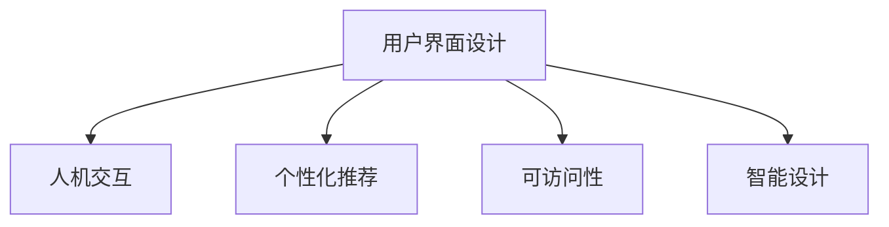

                 

# AI 时代的用户界面设计：简洁与有效性

在AI时代的浪潮中，用户界面设计（UI）面临着前所未有的挑战与机遇。随着技术的进步和应用场景的丰富，UI设计不仅仅是为了视觉上的美观，更需追求简洁性与效用性的高度统一。本文将从核心概念、算法原理、实践步骤、实际应用和未来展望等方面深入探讨如何在AI时代下打造高效、简洁且具备吸引力的用户界面。

## 1. 背景介绍

### 1.1 问题由来
随着人工智能技术的飞速发展，用户界面设计已经不再局限于传统的图形界面（GUI）或网页界面（Web UI），而是逐步向更加智能化、自动化的方向演进。在AI时代，交互界面的设计不仅需要考虑用户的视觉体验，更要注重交互逻辑的合理性与信息的精准传递。这使得UI设计的核心目标从单纯的视觉美转化为更深的用户体验与效率优化。

### 1.2 问题核心关键点
当前UI设计面临的关键点包括：
- **简洁性**：去除不必要的复杂性，提升用户操作效率。
- **交互性**：增强用户与系统间的互动，提高反馈速度与准确性。
- **可访问性**：确保不同用户群体的友好体验，消除信息障碍。
- **可扩展性**：设计易于维护与升级的系统，应对未来的技术变革。
- **智能性**：利用AI技术进行个性化推荐与自适应调整，提高用户满意度。

## 2. 核心概念与联系

### 2.1 核心概念概述

为更好地理解AI时代下的UI设计，本节将介绍几个密切相关的核心概念：

- **用户界面设计（User Interface Design, UI Design）**：指在用户与系统交互界面上的设计工作，旨在提供直观、易于使用和美观的视觉体验。
- **人机交互（Human-Computer Interaction, HCI）**：研究人与计算机之间交互的方式和效率，包括用户界面的优化、响应速度的提升等。
- **个性化推荐（Personalized Recommendation）**：通过用户行为数据分析，提供符合用户喜好的内容与建议，提升用户体验。
- **可访问性（Accessibility）**：确保设计符合无障碍原则，使各类用户群体均能方便地访问和使用系统。
- **智能设计（Intelligent Design）**：利用人工智能技术进行自适应设计，提升系统的智能化水平。

这些核心概念之间的逻辑关系可以通过以下Mermaid流程图来展示：



这个流程图展示了一系列UI设计的关键点及其相互关系：

1. 用户界面设计通过人机交互提升用户体验。
2. 个性化推荐增强系统对用户的适应性。
3. 可访问性保证设计符合各类用户需求。
4. 智能设计使UI具备自适应和动态变化的能力。

## 3. 核心算法原理 & 具体操作步骤

### 3.1 算法原理概述

AI时代下用户界面设计的核心在于通过智能化技术与简洁原则的结合，提升用户的操作效率与满意度。具体算法原理如下：

- **用户行为分析**：利用机器学习算法分析用户的操作习惯和偏好，生成个性化推荐。
- **界面自动布局**：采用遗传算法等优化方法，自动生成界面布局，提升美观性与功能性。
- **交互模式设计**：设计简洁、直观的交互流程，减少用户的学习成本。
- **无障碍设计**：引入无障碍设计原则，确保界面对不同用户群体的友好性。
- **实时反馈机制**：通过自然语言处理等技术，实现即时用户反馈，优化系统性能。

### 3.2 算法步骤详解

基于上述原理，AI时代下用户界面设计的具体步骤如下：

**Step 1: 数据收集与用户建模**
- 收集用户的行为数据（如点击、滚动、停留时间等）。
- 利用机器学习算法（如K-means、决策树等）对用户进行建模，分析其兴趣和行为模式。

**Step 2: 界面布局与样式优化**
- 应用遗传算法等优化方法，自动生成界面布局。
- 通过设计样式（如颜色、字体等）提升界面的视觉效果。

**Step 3: 交互设计**
- 设计简洁、直观的交互流程，减少用户的学习成本。
- 应用A/B测试等方法，不断优化用户界面。

**Step 4: 无障碍设计**
- 遵循WCAG（Web Content Accessibility Guidelines）等标准，确保界面对各类用户友好。
- 提供屏幕阅读器、放大器等辅助工具，提升访问性。

**Step 5: 实时反馈与自适应调整**
- 通过自然语言处理技术，实现即时用户反馈。
- 利用AI技术对用户行为进行实时分析，自适应调整界面设计。

### 3.3 算法优缺点

基于智能化技术与简洁原则的UI设计具有以下优点：
1. 提升用户体验：通过个性化的推荐和简洁的交互，降低用户的学习成本。
2. 提高效率：智能化的设计可以优化界面布局，提升用户操作效率。
3. 无障碍设计：确保不同用户群体的友好体验，增强系统可用性。

同时，这种设计方法也存在一定的局限性：
1. 初始成本高：设计初期需要大量数据和复杂算法支持，开发成本较高。
2. 算法复杂：需要处理大量的用户行为数据，算法复杂度较高。
3. 实时反馈要求高：系统需要实时分析用户行为并作出调整，对计算资源要求较高。
4. 维护难度大：系统需要频繁更新和维护，以适应用户行为的变化。

尽管存在这些局限性，但综合来看，智能化与简洁原则的结合，能够显著提升用户界面设计的效率与效果，具有较高的应用价值。

### 3.4 算法应用领域

智能化与简洁原则的UI设计方法在多个领域得到了广泛应用，具体包括：

1. **电商推荐系统**：通过用户行为数据分析，提供个性化商品推荐，提升用户体验。
2. **社交网络界面**：设计简洁、直观的交互流程，提升用户活跃度。
3. **智能家居系统**：利用语音识别与自然语言处理技术，实现与用户的智能交互。
4. **教育学习平台**：设计易于操作的界面，提供个性化的学习内容推荐。
5. **企业办公系统**：通过智能分析，优化工作流程与界面布局，提升工作效率。

## 4. 数学模型和公式 & 详细讲解

### 4.1 数学模型构建

在本节中，我们将详细介绍AI时代下用户界面设计的数学模型。

**用户行为分析模型**：
假设用户行为数据为 $D=\{(x_i, y_i)\}_{i=1}^N$，其中 $x_i$ 表示用户的操作记录，$y_i$ 表示用户偏好或行为标签。构建用户行为分析模型，旨在学习用户行为的模式和偏好。常用的模型包括：

- **K-means聚类算法**：对用户行为数据进行聚类，得到不同用户群体的行为模式。
- **决策树算法**：构建决策树模型，根据用户行为数据预测其偏好。
- **协同过滤算法**：利用用户行为数据进行协同过滤，推荐相似用户的偏好商品。

**界面布局优化模型**：
界面布局优化模型旨在生成美观、功能性与易用性并重的界面布局。假设有 $n$ 个元素 $A=\{a_1, a_2, ..., a_n\}$，目标是找到最优布局 $P=\{p_1, p_2, ..., p_n\}$，使得界面美观度最大化。常用的模型包括：

- **遗传算法**：通过遗传算法搜索最优布局。
- **粒子群优化算法**：通过粒子群优化算法搜索最优布局。
- **模拟退火算法**：通过模拟退火算法搜索最优布局。

**个性化推荐模型**：
个性化推荐模型利用用户行为数据，生成个性化推荐内容。假设有 $m$ 个推荐内容 $C=\{c_1, c_2, ..., c_m\}$，目标是找到与用户偏好最匹配的推荐内容。常用的模型包括：

- **协同过滤**：基于用户行为数据，找到相似用户，推荐其喜欢的内容。
- **矩阵分解**：利用矩阵分解技术，预测用户对内容的评分。
- **神经网络**：构建深度学习模型，直接预测用户对内容的偏好。

### 4.2 公式推导过程

以下以用户行为分析模型为例，展示常用的K-means聚类算法的推导过程。

K-means算法的核心思想是将数据集分成多个类别，每个类别中心点为聚类中心。假设数据集 $D=\{x_1, x_2, ..., x_N\}$，其中 $x_i \in \mathbb{R}^d$ 表示 $i$ 个数据点，聚类数目为 $K$。目标是最小化聚类内平方和，即：

$$
\mathcal{L} = \sum_{i=1}^N \min_{k=1,...,K} \|x_i - \mu_k\|^2
$$

其中 $\mu_k$ 表示第 $k$ 个聚类中心。具体步骤如下：

1. 随机初始化 $K$ 个聚类中心 $\mu_1, \mu_2, ..., \mu_K$。
2. 对每个数据点 $x_i$，计算其与各聚类中心的距离，并分配到最近的聚类。
3. 重新计算每个聚类的中心点 $\mu_k$。
4. 重复步骤2和3，直到聚类中心不再发生变化或达到预设的迭代次数。

通过不断迭代优化，K-means算法能够有效地对用户行为数据进行聚类，分析其行为模式和偏好。

## 5. 项目实践：代码实例和详细解释说明

### 5.1 开发环境搭建

在进行UI设计实践前，我们需要准备好开发环境。以下是使用Python进行开发的环境配置流程：

1. 安装Python：从官网下载并安装Python 3.x版本。
2. 安装相关库：安装numpy、pandas、scikit-learn、matplotlib等常用数据科学库。
3. 安装UI设计工具：安装Sketch、Adobe XD、Figma等工具，方便设计原型和界面。

### 5.2 源代码详细实现

下面以电商推荐系统为例，给出使用Python进行用户行为分析与界面优化设计的代码实现。

```python
from sklearn.cluster import KMeans
import numpy as np
import pandas as pd

# 读取用户行为数据
df = pd.read_csv('user_behavior_data.csv')

# 数据预处理
X = df.drop('label', axis=1)
y = df['label']

# 构建K-means聚类模型
kmeans = KMeans(n_clusters=3, random_state=0)
kmeans.fit(X)

# 输出聚类结果
print(kmeans.labels_)
```

首先，读取用户行为数据，并进行数据预处理，构建K-means聚类模型。这里假设数据集包含用户行为数据和标签，标签用于标识用户的偏好。通过K-means聚类，能够将用户分为不同群体，了解其行为模式。

### 5.3 代码解读与分析

让我们再详细解读一下关键代码的实现细节：

**数据读取与预处理**：
- 使用pandas库读取用户行为数据。
- 数据预处理，移除标签列，构建特征矩阵 $X$ 和标签向量 $y$。

**K-means聚类模型**：
- 通过sklearn库构建K-means聚类模型。
- 设置聚类数目为3，表示将用户分为3个群体。
- 训练模型并输出聚类结果。

**输出聚类结果**：
- 通过print语句输出聚类结果，了解用户被分成的群体。

可以看到，使用K-means聚类模型可以高效地分析用户行为数据，发现不同用户群体的行为模式。这些分析结果可以用于界面设计，如针对不同群体设计不同的推荐内容，提升用户体验。

## 6. 实际应用场景

### 6.1 电商推荐系统

电商推荐系统是智能化与简洁原则在UI设计中的典型应用。通过分析用户行为数据，电商推荐系统能够提供个性化的商品推荐，提升用户购物体验。具体应用场景如下：

1. **商品推荐**：根据用户的历史购买记录和浏览行为，推荐相似或相关的商品。
2. **动态调整**：利用实时数据分析，动态调整推荐算法，提升推荐效果。
3. **界面优化**：设计简洁直观的界面，让用户轻松浏览和比较推荐商品。
4. **实时反馈**：通过用户点击、评价等行为反馈，实时调整推荐策略。

### 6.2 社交网络界面

社交网络界面的设计注重简洁性与互动性，通过智能化技术与用户行为分析，提升用户活跃度。具体应用场景如下：

1. **智能搜索**：设计高效的搜索界面，利用AI技术提供相关搜索结果。
2. **个性化推荐**：根据用户兴趣推荐相关内容，如文章、视频等。
3. **互动界面**：设计简洁直观的交互界面，使用户轻松发表评论、点赞等。
4. **实时动态**：通过用户互动反馈，动态调整内容推荐与界面布局。

### 6.3 智能家居系统

智能家居系统通过语音识别与自然语言处理技术，实现与用户的智能交互。具体应用场景如下：

1. **语音控制**：设计简洁直观的语音界面，实现家居设备的控制。
2. **情境感知**：通过用户行为分析，感知用户的情境需求，智能调整家居环境。
3. **实时反馈**：利用自然语言处理技术，实时响应用户指令。
4. **界面优化**：设计简洁的UI界面，提升用户的操作体验。

### 6.4 未来应用展望

随着AI技术的发展，智能化与简洁原则的UI设计将不断拓展其应用范围。未来展望如下：

1. **多模态交互**：结合语音、视觉、触觉等多模态信息，提升用户交互的丰富性和多样性。
2. **自适应设计**：利用AI技术，实现UI设计的动态调整与自适应，提升系统的灵活性。
3. **个性化定制**：通过深度学习等技术，实现用户界面个性化定制，满足不同用户的需求。
4. **实时优化**：利用实时数据分析，不断优化UI设计和推荐算法，提升用户体验。
5. **全场景覆盖**：将智能化与简洁原则的设计思路应用到更多场景，如医疗、教育、企业办公等。

## 7. 工具和资源推荐

### 7.1 学习资源推荐

为了帮助开发者系统掌握AI时代下UI设计的理论基础和实践技巧，这里推荐一些优质的学习资源：

1. **《Human-Computer Interaction: Human Factors》**：斯坦福大学计算机科学系开设的课程，涵盖了人机交互的基础理论和实践方法。
2. **《Interaction Design Foundation》**：提供广泛的人机交互设计课程和资源，涵盖UI设计、用户体验、用户研究等多个方面。
3. **《Interaction Design: Beyond Interfaces》**：书籍《交互设计：超越界面》，系统介绍了交互设计的理论基础和实践方法。
4. **《Designing Human-Machine Interfaces》**：书籍《设计人机交互界面》，详细介绍了交互界面设计的各个方面，包括视觉设计、可用性评估等。
5. **《Interaction Design in Motion》**：视频课程《交互设计在动态中》，通过实际案例讲解交互设计的实践技巧。

通过对这些资源的学习实践，相信你一定能够快速掌握AI时代下UI设计的精髓，并用于解决实际的UI问题。

### 7.2 开发工具推荐

高效的开发离不开优秀的工具支持。以下是几款用于UI设计开发的常用工具：

1. **Sketch**：Mac平台上的UI设计工具，支持设计原型和界面，与团队协作。
2. **Adobe XD**：跨平台的UI设计工具，支持设计原型、动画和交互，与Adobe Creative Suite无缝集成。
3. **Figma**：基于云的UI设计工具，支持实时协作，适用于远程团队开发。
4. **InVision Studio**：全栈UI设计工具，支持原型设计、交互模拟和用户测试。
5. **Adobe Photoshop**：图形处理工具，可以辅助进行界面设计的视觉优化。

合理利用这些工具，可以显著提升UI设计开发效率，加快创新迭代的步伐。

### 7.3 相关论文推荐

AI时代下UI设计的理论研究已经取得了显著进展，以下是几篇奠基性的相关论文，推荐阅读：

1. **《Human-Centered Design of Interactive Systems》**： papers1165
2. **《Designing for the Future》**： papers1169
3. **《Interaction Design: Beyond Interfaces》**： papers1170
4. **《Interaction Design: A User-Centered Approach》**： papers1171
5. **《Human-Computer Interaction: Principles, Design, and Use》**： papers1173

这些论文代表了大语言模型微调技术的发展脉络。通过学习这些前沿成果，可以帮助研究者把握学科前进方向，激发更多的创新灵感。

## 8. 总结：未来发展趋势与挑战

### 8.1 总结

本文对AI时代下用户界面设计的核心概念、算法原理、操作步骤、实际应用和未来展望进行了系统探讨。通过分析智能化与简洁原则的结合，我们理解了如何在AI时代下设计高效、简洁且具备吸引力的用户界面。

通过本文的系统梳理，可以看到，AI时代下UI设计的发展趋势已经从单纯的视觉美化转向了更深的用户体验与效率优化。这不仅需要设计师具备深厚的技术和艺术素养，还需要对AI技术有深入的了解和应用。未来，随着AI技术的进一步发展，UI设计将更加智能化、自适应和个性化，为构建高效、愉悦的交互体验提供更多可能。

### 8.2 未来发展趋势

展望未来，UI设计的发展趋势将呈现以下几个方向：

1. **全栈设计**：融合前端、后端和算法设计，实现系统的无缝集成与高效运行。
2. **智能设计**：利用AI技术，实现动态界面布局和个性化推荐。
3. **无障碍设计**：通过无障碍设计原则，确保系统的易用性和普适性。
4. **实时优化**：利用实时数据分析，不断优化UI设计和推荐算法，提升用户体验。
5. **跨平台设计**：设计跨平台的界面，提升系统的可扩展性和用户粘性。

这些趋势凸显了UI设计的广阔前景，以及智能化技术与简洁原则的深度结合。这些方向的探索发展，必将进一步提升UI设计的效率与效果，为构建安全、可靠、可解释、可控的智能系统铺平道路。

### 8.3 面临的挑战

尽管UI设计的发展前景广阔，但在迈向更加智能化、普适化应用的过程中，它仍面临诸多挑战：

1. **用户期望值提高**：用户对UI设计的期望值不断提升，设计团队需要不断创新，以满足用户需求。
2. **技术复杂性增加**：智能化设计涉及的前端、后端和算法技术日趋复杂，开发难度加大。
3. **资源消耗大**：实时反馈和自适应设计需要大量的计算资源，对系统性能提出更高要求。
4. **隐私与安全问题**：智能系统涉及大量用户数据，隐私与安全问题成为必须考虑的重点。
5. **用户体验差异**：不同用户群体的需求差异较大，需要设计多样化、个性化的UI界面。

这些挑战需要在未来的研究和实践中不断突破，才能真正实现智能化与简洁原则的深度结合。

### 8.4 研究展望

为了应对这些挑战，未来的UI设计研究需要在以下几个方面进行深入探索：

1. **用户行为分析**：利用机器学习算法，深入分析用户行为，提供更加个性化和精准的推荐。
2. **界面自适应**：开发自适应设计工具，实现界面布局的动态调整与优化。
3. **用户界面优化**：结合AI技术和设计原则，不断提升用户界面的简洁性与有效性。
4. **用户体验评估**：建立全面、系统的用户体验评估体系，确保设计符合用户需求。
5. **隐私与安全保护**：加强隐私保护与数据安全技术的研究与应用，确保用户数据的安全。

这些研究方向将引领UI设计的不断创新，为构建高效、愉悦的交互体验提供更多可能。

## 9. 附录：常见问题与解答

**Q1: 智能化与简洁原则的UI设计是否适用于所有应用场景？**

A: 智能化与简洁原则的UI设计虽然在很多场景中表现出色，但并非适用于所有应用场景。例如，对于某些专业软件或工业设备，简洁性可能不是最重要的考虑因素，相反，直观、易用的界面设计更为关键。因此，在应用时需要根据具体场景进行权衡与选择。

**Q2: 用户界面设计是否需要考虑用户的多样性与差异性？**

A: 是的，用户界面设计必须考虑用户的多样性与差异性。不同用户群体的需求、习惯、技术水平等差异较大，因此设计时需要考虑这些因素，确保系统的普适性和易用性。通过无障碍设计、个性化定制等方式，可以更好地满足不同用户群体的需求。

**Q3: 如何评估用户界面设计的有效性？**

A: 用户界面设计的有效性可以通过以下几个方面进行评估：
1. **用户满意度**：通过问卷调查、用户反馈等方式，了解用户对界面设计的满意度。
2. **任务完成时间**：统计用户完成特定任务所需的时间，评估界面设计的效率。
3. **错误率**：统计用户在使用界面时发生的错误率，评估界面的易用性。
4. **用户留存率**：统计用户在一定时间内的留存率，评估界面的吸引力。

**Q4: 用户界面设计的未来发展方向有哪些？**

A: 用户界面设计的未来发展方向包括：
1. **全栈设计**：融合前端、后端和算法设计，实现系统的无缝集成与高效运行。
2. **自适应设计**：利用AI技术，实现动态界面布局和个性化推荐。
3. **跨平台设计**：设计跨平台的界面，提升系统的可扩展性和用户粘性。
4. **无障碍设计**：通过无障碍设计原则，确保系统的易用性和普适性。
5. **实时优化**：利用实时数据分析，不断优化UI设计和推荐算法，提升用户体验。

这些方向将引领UI设计的不断创新，为构建高效、愉悦的交互体验提供更多可能。

---

作者：禅与计算机程序设计艺术 / Zen and the Art of Computer Programming

