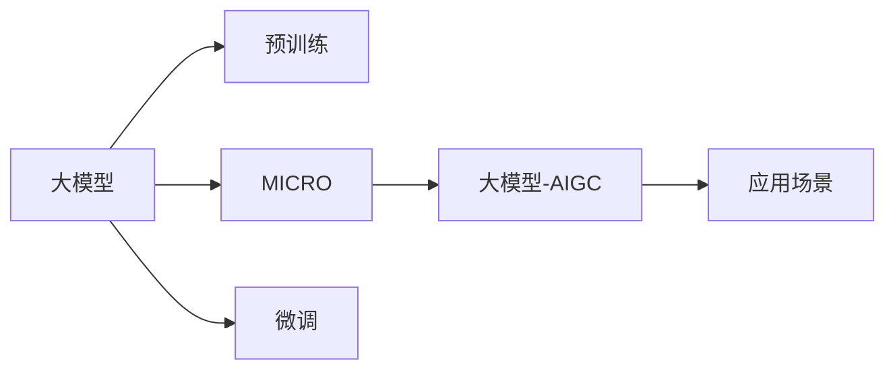

                 

# AIGC的社会影响与应对策略

## 1. 背景介绍

人工智能（AI）和大模型技术在过去几年中飞速发展，AI生成内容（AIGC）已经成为许多行业的重要应用。从内容创作到个性化推荐，从辅助诊断到智能客服，AIGC正在改变我们的生活方式，带来前所未有的便利和效率。但与此同时，AIGC技术的应用也引发了一系列社会和伦理问题，需要引起我们的关注和思考。本文将探讨AIGC的社会影响，并提出应对策略，以确保其在带来正面效益的同时，也能和谐地融入我们的社会。

## 2. 核心概念与联系

### 2.1 核心概念概述

AIGC（Artificial Intelligence Generated Content）是指利用人工智能技术自动生成文本、图像、视频等内容的技术。AIGC技术基于大模型（如GPT-3、DALL·E等），通过大规模预训练和微调（Fine-tuning），可以在短时间内生成高质量、高度拟真的内容。AIGC技术不仅在内容创作上应用广泛，还在游戏开发、教育、医疗、金融等领域展现出巨大潜力。

### 2.2 核心概念原理和架构的 Mermaid 流程图



该流程图展示了大模型在AIGC技术中的应用路径：通过预训练获得基础能力，并通过微调适配特定任务，生成高质量的AIGC内容，最终在多个应用场景中实现落地。

## 3. 核心算法原理 & 具体操作步骤

### 3.1 算法原理概述

AIGC的核心算法是基于Transformer结构的预训练大模型，通过自监督学习和监督学习的方式，在大规模数据上进行训练。预训练阶段，模型通过掩码语言模型（Masked Language Model, MLM）、自回归语言模型（Autoregressive Language Model, ARLM）等任务，学习到丰富的语言结构和语义表示。在微调阶段，模型通过特定任务（如文本生成、图像生成等）的监督信号，进一步优化语言模型，生成符合任务要求的AIGC内容。

### 3.2 算法步骤详解

1. **预训练**：使用大规模无标签数据对大模型进行预训练，通过掩码语言模型等自监督任务学习语言的通用表示。
2. **微调**：将预训练模型适配特定任务，使用小规模标注数据对模型进行微调，优化模型在特定任务上的表现。
3. **生成内容**：将微调后的模型应用于各种内容生成任务，自动生成文本、图像、视频等。

### 3.3 算法优缺点

#### 优点

- **高效生成**：AIGC技术可以快速生成大量高质量内容，节省人力成本。
- **广泛应用**：AIGC技术在内容创作、教育、医疗等多个领域都有广泛应用，提升效率和质量。
- **灵活性高**：AIGC技术可以根据任务需求，灵活调整模型参数和训练方式，适应不同应用场景。

#### 缺点

- **质量不稳定**：生成的内容可能存在逻辑错误、事实错误等问题，影响用户体验。
- **伦理和隐私问题**：AIGC内容可能包含误导性信息、偏见和歧视，引发伦理和隐私问题。
- **知识产权风险**：AIGC内容可能与现有作品混淆，引发知识产权争议。

### 3.4 算法应用领域

AIGC技术已经在多个领域得到应用：

- **内容创作**：自动生成新闻、小说、文章等文本内容，提升内容创作效率和多样性。
- **教育**：辅助教学，生成个性化学习材料和作业，提高学习效果。
- **医疗**：生成医学科普、健康指南等内容，辅助医生诊断和治疗决策。
- **金融**：生成财经新闻、市场分析等内容，辅助投资者决策。
- **娱乐**：生成影视剧剧本、音乐等，丰富娱乐内容。

## 4. 数学模型和公式 & 详细讲解 & 举例说明

### 4.1 数学模型构建

AIGC的生成过程可以表示为：

$$
p(x|y) = \frac{e^{E_{\theta}(x,y)}}{Z_{\theta}(y)}
$$

其中，$x$ 表示生成的内容，$y$ 表示任务的输入（如标签、文本等），$E_{\theta}(x,y)$ 表示模型对 $(x,y)$ 的联合概率估计，$Z_{\theta}(y)$ 表示归一化因子，通常可以通过最大似然估计求得。

### 4.2 公式推导过程

AIGC模型的生成过程可以通过变分推断（Variational Inference）方法进行优化：

1. **变分推断目标**：

$$
\arg\min_{q_{\phi}(y)} \mathcal{K}L_{q_{\phi}} - \mathbb{E}_{q_{\phi}}[E_{\theta}(x,y)]
$$

其中，$q_{\phi}(y)$ 表示变分分布，$\mathcal{K}L_{q_{\phi}}$ 表示变分下界，$\mathbb{E}_{q_{\phi}}[E_{\theta}(x,y)]$ 表示模型对 $(x,y)$ 的期望估计。

2. **目标函数的分解**：

$$
\mathcal{K}L_{q_{\phi}} = \mathbb{E}_{q_{\phi}}[\log p_{\theta}(y)] - \mathbb{E}_{q_{\phi}}[\log q_{\phi}(y)]
$$

3. **优化目标的求解**：

$$
\min_{\theta,\phi} \mathcal{K}L_{q_{\phi}} - \mathbb{E}_{q_{\phi}}[E_{\theta}(x,y)]
$$

通过优化上述目标函数，可以实现对AIGC模型的参数 $\theta$ 和变分分布参数 $\phi$ 的联合优化，生成高质量的内容。

### 4.3 案例分析与讲解

以文本生成任务为例，假设我们要生成一段关于“人工智能”的段落。首先，将“人工智能”作为输入，通过变分推断方法，求得模型对“人工智能”的变分分布 $q_{\phi}(y)$，再通过联合概率估计 $E_{\theta}(x,y)$，生成一段包含“人工智能”概念的文本内容。

## 5. 项目实践：代码实例和详细解释说明

### 5.1 开发环境搭建

要实现AIGC技术，需要搭建Python开发环境，并使用PyTorch等深度学习框架。以下是一个简单的搭建流程：

1. 安装Anaconda并创建虚拟环境：
```bash
conda create -n pytorch-env python=3.8
conda activate pytorch-env
```

2. 安装必要的库：
```bash
pip install torch transformers sklearn
```

### 5.2 源代码详细实现

以下是一个使用Hugging Face Transformers库进行文本生成的代码示例：

```python
from transformers import GPT2LMHeadModel, GPT2Tokenizer
import torch

# 加载预训练模型和tokenizer
model = GPT2LMHeadModel.from_pretrained('gpt2')
tokenizer = GPT2Tokenizer.from_pretrained('gpt2')

# 定义生成文本函数
def generate_text(prompt, num_words):
    inputs = tokenizer.encode(prompt, return_tensors='pt')
    outputs = model.generate(inputs, num_return_sequences=1, max_length=128)
    return tokenizer.decode(outputs[0], skip_special_tokens=True)

# 生成文本
result = generate_text("人工智能", 100)
print(result)
```

### 5.3 代码解读与分析

上述代码首先加载了预训练的GPT-2模型和tokenizer，然后使用generate_text函数生成了一段包含“人工智能”概念的文本。代码的核心在于：

- 将输入文本编码为token ids。
- 使用预训练模型生成输出序列。
- 将输出序列解码为文本内容。

## 6. 实际应用场景

### 6.1 内容创作

AIGC技术在内容创作领域的应用非常广泛，例如：

- **新闻生成**：自动生成新闻报道、评论等，提升媒体内容的生成速度和多样性。
- **小说生成**：生成小说情节、人物对话等内容，丰富文学作品。
- **广告文案**：自动生成广告文案，提升广告创作的效率。

### 6.2 教育

AIGC技术在教育领域的应用包括：

- **个性化学习材料**：根据学生的学习进度和兴趣，自动生成个性化的学习材料。
- **作业生成**：自动生成数学、物理等学科的作业，辅助教师教学。

### 6.3 医疗

AIGC技术在医疗领域的应用包括：

- **医学科普**：生成医学科普文章，提升公众健康意识。
- **诊断辅助**：生成医学诊断报告，辅助医生诊疗。

### 6.4 金融

AIGC技术在金融领域的应用包括：

- **市场分析**：生成财经新闻、市场分析等内容，辅助投资者决策。
- **风险预警**：生成风险提示，提升金融风险管理能力。

### 6.5 娱乐

AIGC技术在娱乐领域的应用包括：

- **影视剧剧本**：生成影视剧剧本，缩短剧本创作时间。
- **音乐生成**：生成音乐作品，丰富音乐内容。

## 7. 工具和资源推荐

### 7.1 学习资源推荐

- **《深度学习》书籍**：Ian Goodfellow等著，深入讲解深度学习理论和方法。
- **《Transformers》论文**：Ashish Vaswani等著，介绍Transformer结构和预训练大模型的原理。
- **《生成对抗网络》论文**：Ian Goodfellow等著，介绍生成对抗网络（GAN）的原理和应用。

### 7.2 开发工具推荐

- **PyTorch**：深度学习框架，支持GPU加速，适合AIGC模型的训练和推理。
- **TensorFlow**：深度学习框架，支持分布式训练，适合大规模AIGC模型的部署。
- **Hugging Face Transformers**：基于Transformer的NLP工具库，提供丰富的预训练模型和微调API。

### 7.3 相关论文推荐

- **A Variational Framework for Deep Generative Models**：Ian Goodfellow等，介绍变分推断方法。
- **Language Models are Unsupervised Multitask Learners**：Alec Radford等，介绍预训练大模型的原理。
- **Generating Diverse and High-Quality Content with Pre-Trained Language Models**：Samantha Shleifer等，介绍AIGC技术在内容创作中的应用。

## 8. 总结：未来发展趋势与挑战

### 8.1 研究成果总结

AIGC技术已经在多个领域展示了其强大的应用潜力，但同时也引发了一系列社会和伦理问题。当前的研究成果包括：

- **变分推断方法**：通过变分推断方法，优化AIGC模型的生成过程，提升生成内容的自然度。
- **预训练大模型**：通过大规模预训练，学习通用的语言表示，提升AIGC内容的质量和多样性。
- **对抗生成网络**：通过对抗生成网络（GAN）方法，生成高质量的图像和视频内容。

### 8.2 未来发展趋势

AIGC技术的未来发展趋势包括：

- **大规模预训练**：随着算力成本的下降，预训练模型的规模将不断增大，生成内容的质量和多样性将进一步提升。
- **多模态融合**：结合视觉、语音等多种模态数据，生成更加丰富和真实的内容。
- **交互生成**：实现人机交互式生成，提升用户体验。
- **个性化生成**：根据用户偏好，生成个性化内容，提升内容的针对性和可接受度。

### 8.3 面临的挑战

AIGC技术在未来的发展中，需要面对以下挑战：

- **质量稳定性**：生成内容的质量和稳定性需要进一步提升。
- **伦理和隐私问题**：需要制定相应的伦理和隐私保护措施，避免内容误导和隐私泄露。
- **知识产权风险**：需要明确AIGC内容的知识产权归属，避免与现有作品混淆。

### 8.4 研究展望

未来的研究展望包括：

- **多模态融合**：结合多种模态数据，提升内容的真实性和多样性。
- **交互生成**：实现人机交互式生成，提升用户体验。
- **个性化生成**：根据用户偏好，生成个性化内容，提升内容的针对性和可接受度。
- **伦理和隐私保护**：制定相应的伦理和隐私保护措施，确保内容的合法性和安全性。

## 9. 附录：常见问题与解答

**Q1: AIGC技术是否存在版权问题？**

A: AIGC技术生成的内容可能会与现有作品混淆，导致版权争议。为了避免版权问题，应在使用AIGC技术时明确版权归属，并尊重现有作品的版权。

**Q2: AIGC技术是否存在误导性信息？**

A: 由于AIGC技术在生成过程中可能引入偏见和歧视，生成的内容可能包含误导性信息。为了减少误导性信息，应在生成过程中加入伦理和价值观约束，确保内容的真实性和公正性。

**Q3: AIGC技术是否适用于所有应用场景？**

A: AIGC技术在内容创作、教育、医疗、金融等领域都有广泛应用，但在一些专业性和安全性要求较高的场景中，需要结合人工干预，确保内容的质量和安全性。

**Q4: AIGC技术是否会取代人类创作者？**

A: AIGC技术可以辅助人类创作者生成内容，提升创作效率和多样性，但不会完全取代人类创作者。人类创作者的独特创意和情感表达，是AIGC技术难以替代的。

---

作者：禅与计算机程序设计艺术 / Zen and the Art of Computer Programming

