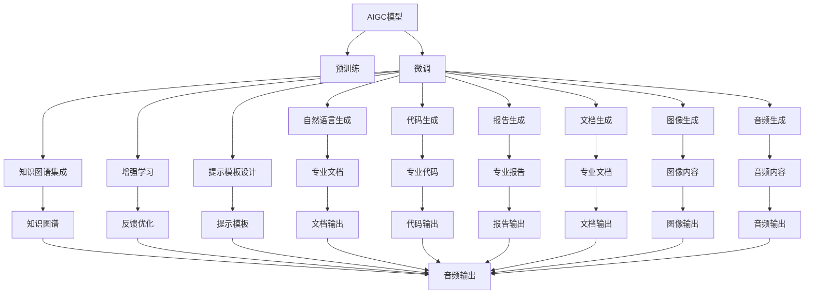

                 

# AIGC重塑专业服务行业

在数字化浪潮的推动下，各行各业正在经历着一场深刻的变革。其中，专业服务行业，如法律、会计、咨询、医疗等领域，正逐步拥抱人工智能生成内容(AIGC)技术，实现效率提升、成本降低和服务质量提高。本文将深入探讨AIGC技术如何重塑专业服务行业，揭示其核心原理、具体操作步骤、优缺点和应用前景，并为相关从业人员和决策者提供切实可行的实践指导和未来发展策略。

## 1. 背景介绍

### 1.1 问题由来
专业服务行业一直以来是信息密集型行业，对专业知识和经验有着极高的要求。然而，传统的工作流程往往繁琐冗长，需要大量的人力投入和时间消耗，服务效率和质量难以保证。

近年来，随着AIGC技术的快速发展和应用，专业服务行业迎来了新的机遇。AIGC技术包括自然语言生成(NLG)、图像生成、音频生成等，能够利用大规模无标签数据进行自监督预训练，从而具备高效生成内容的能力。通过微调训练，AIGC模型可以在特定的专业领域内生成高质量的文档、报告、代码等，极大地提升了专业服务行业的效率和质量。

### 1.2 问题核心关键点
AIGC重塑专业服务行业，主要依赖以下几个关键点：

1. **高效生成内容**：利用大规模预训练和微调，AIGC模型能够在专业领域内高效生成文档、报告、代码等文本内容，极大地减轻了专业人员的负担。
2. **提升工作效率**：通过自动化生成初步文档，专业服务人员可以更快地进入细节讨论，提升整体工作效率。
3. **降低运营成本**：减少了繁琐的手工劳动，降低了人力成本，提高了服务供给能力。
4. **增强服务质量**：AIGC技术可以保证内容的准确性和一致性，提高了专业服务的标准性和可信赖度。

### 1.3 问题研究意义
AIGC技术在专业服务行业的应用，不仅有助于提升服务效率和质量，还为行业转型升级提供了新的动力。具体意义如下：

1. **解放专业劳动力**：使专业服务人员从繁琐的手工劳动中解脱出来，专注于更高价值的工作。
2. **加速服务落地**：缩短服务交付时间，快速响应客户需求，提升服务响应速度。
3. **扩大服务规模**：通过提高服务效率，能够服务更多的客户，扩大市场份额。
4. **促进行业创新**：激发专业服务人员探索新的解决方案，推动行业创新发展。
5. **实现智慧服务**：结合大数据、物联网等技术，实现更精准、个性化的专业服务。

## 2. 核心概念与联系

### 2.1 核心概念概述

为了更好地理解AIGC技术在专业服务行业中的应用，我们需要掌握几个核心概念：

1. **AIGC**：人工智能生成内容(AI Generated Content)，通过自监督学习和大规模预训练，能够生成高质量的文本、图像、音频等内容。
2. **预训练与微调**：AIGC模型通过在大规模无标签数据上进行预训练，学习通用的语言知识，然后在特定任务上进行微调，提升模型在该领域的表现。
3. **Prompt Engineering**：通过设计精巧的提示模板，引导AIGC模型生成符合期望的内容，减少微调所需的参数更新。
4. **知识图谱**：将专业知识以结构化的方式存储，帮助AIGC模型更好地理解特定领域的专业概念和术语。
5. **增强学习**：利用用户反馈和领域专家的指导，不断优化AIGC模型的生成策略，提升生成内容的准确性和相关性。

这些概念之间存在着紧密的联系。预训练与微调是AIGC模型的核心技术，通过Prompt Engineering可以更高效地进行微调，而知识图谱和增强学习则进一步提升了模型的准确性和相关性，共同构成了AIGC技术在专业服务行业应用的完整框架。

### 2.2 核心概念原理和架构的 Mermaid 流程图

以下是AIGC技术在专业服务行业应用的Mermaid流程图：



### 2.3 核心概念联系

上述流程图展示了AIGC模型在专业服务行业应用的完整过程。从预训练到微调，再到各种类型的生成和集成，每一个环节都是紧密关联、互为支持的。以下是各概念之间的联系：

1. **预训练与微调**：预训练通过学习通用的语言知识，为微调提供初始化的模型参数。微调则针对特定领域进行优化，提升生成内容的准确性和相关性。
2. **Prompt Engineering**：通过设计精巧的提示模板，可以显著提升生成内容的准确性和多样性。
3. **知识图谱**：结合领域知识图谱，AIGC模型可以更好地理解特定领域的专业概念和术语，生成更专业、更具实际意义的内容。
4. **增强学习**：利用用户反馈和领域专家的指导，不断优化模型生成策略，提高生成内容的准确性和相关性。

## 3. 核心算法原理 & 具体操作步骤

### 3.1 算法原理概述

AIGC技术在专业服务行业的应用，本质上是利用大规模预训练和微调，使AIGC模型在特定领域内生成高质量的内容。其核心原理如下：

1. **预训练阶段**：使用大规模无标签数据进行自监督学习，学习通用的语言知识。例如，使用大规模文本语料训练语言模型，学习语言结构和语义表示。
2. **微调阶段**：选择特定领域的标注数据，对预训练模型进行微调。微调过程通常包含模型初始化、任务适配、优化算法、正则化等步骤。
3. **生成阶段**：在微调后的模型上，利用设计精巧的提示模板或知识图谱，生成符合特定领域需求的内容。例如，生成专业文档、代码、报告等。

### 3.2 算法步骤详解

以下是AIGC技术在专业服务行业应用的详细步骤：

**Step 1: 准备数据和模型**
- 收集专业领域的标注数据，如法律案例、会计报告、医疗诊断等。
- 选择合适的预训练模型，如GPT、BERT等。

**Step 2: 微调模型**
- 选择适当的优化算法和超参数，如AdamW、SGD等，设置学习率、批大小等。
- 应用正则化技术，如L2正则、Dropout等，防止过拟合。
- 保留预训练的部分层，仅微调顶层，减少需优化的参数。

**Step 3: 设计提示模板**
- 根据生成任务的特性，设计精巧的提示模板，引导模型生成符合期望的内容。
- 利用知识图谱，将领域知识编码为提示模板，提升生成内容的准确性。

**Step 4: 生成内容**
- 在微调后的模型上，输入设计好的提示模板，生成目标内容。
- 对于生成结果，进行后处理和质量控制，确保生成内容符合专业标准。

**Step 5: 反馈优化**
- 收集用户反馈，利用增强学习技术，不断优化模型生成策略。
- 结合领域专家的指导，进一步提升生成内容的准确性和相关性。

### 3.3 算法优缺点

AIGC技术在专业服务行业应用的优缺点如下：

**优点**：
1. **效率提升**：自动生成初步文档，极大地减轻了专业人员的负担，提高了工作效率。
2. **成本降低**：减少了繁琐的手工劳动，降低了人力成本，提高了服务供给能力。
3. **服务质量**：利用大规模预训练和微调，生成的内容准确性和一致性较高，提高了服务质量。

**缺点**：
1. **依赖标注数据**：微调效果很大程度上取决于标注数据的质量和数量，获取高质量标注数据的成本较高。
2. **迁移能力有限**：当目标领域与预训练数据的分布差异较大时，微调的性能提升有限。
3. **模型鲁棒性不足**：面对域外数据时，泛化性能往往大打折扣，模型容易产生波动。
4. **可解释性不足**：生成的内容缺乏可解释性，难以对其推理逻辑进行分析和调试。

### 3.4 算法应用领域

AIGC技术在专业服务行业的应用领域广泛，主要包括以下几个方面：

1. **法律领域**：自动生成法律文件、合同、判决书等。
2. **会计领域**：自动生成财务报表、审计报告、税单等。
3. **咨询领域**：自动生成咨询报告、战略分析、市场调研等。
4. **医疗领域**：自动生成病历、诊断报告、健康建议等。
5. **金融领域**：自动生成金融分析报告、投资报告、交易策略等。
6. **工程领域**：自动生成工程设计文档、技术报告、图纸等。

## 4. 数学模型和公式 & 详细讲解

### 4.1 数学模型构建

AIGC模型在专业服务行业应用的数学模型主要包括以下几个部分：

1. **预训练模型**：使用大规模无标签数据进行自监督学习，学习通用的语言知识。
2. **微调模型**：在标注数据上，利用有监督学习进行微调，提升模型在特定领域的表现。
3. **生成模型**：利用微调后的模型，结合提示模板或知识图谱，生成目标内容。

**预训练模型**：
- 使用大规模文本语料训练语言模型，如BERT、GPT等。
- 数学模型：$\theta = \mathop{\arg\min}_{\theta} \mathcal{L}(\theta, D)$，其中 $\mathcal{L}$ 为损失函数，$D$ 为预训练数据。

**微调模型**：
- 在特定领域的数据上进行微调，如法律文件、会计报告等。
- 数学模型：$\theta' = \mathop{\arg\min}_{\theta} \mathcal{L}(\theta', D')$，其中 $D'$ 为微调数据集。

**生成模型**：
- 利用微调后的模型，结合提示模板或知识图谱，生成目标内容。
- 数学模型：$G(X, \theta') = Y$，其中 $X$ 为输入，$\theta'$ 为微调后的模型参数，$Y$ 为目标内容。

### 4.2 公式推导过程

以下是AIGC模型在专业服务行业应用的数学模型推导过程：

**预训练模型推导**：
- 使用大规模文本语料训练BERT模型，数学模型为：
  $$
  \theta = \mathop{\arg\min}_{\theta} \mathcal{L}_{BERT}(\theta, D_{PT})
  $$
  其中 $\mathcal{L}_{BERT}$ 为BERT模型的损失函数，$D_{PT}$ 为预训练数据。

**微调模型推导**：
- 在特定领域的数据上进行微调，数学模型为：
  $$
  \theta' = \mathop{\arg\min}_{\theta} \mathcal{L}_{FT}(\theta', D')
  $$
  其中 $\mathcal{L}_{FT}$ 为微调模型的损失函数，$D'$ 为微调数据集。

**生成模型推导**：
- 利用微调后的模型，结合提示模板或知识图谱，生成目标内容。例如，自动生成法律文件，数学模型为：
  $$
  G(X, \theta') = Y
  $$
  其中 $X$ 为输入，$\theta'$ 为微调后的模型参数，$Y$ 为目标内容。

### 4.3 案例分析与讲解

**案例分析**：
假设需要自动生成法律文件的摘要。以下是具体的数学模型和推导过程：

1. **预训练模型**：使用大规模的法律语料训练BERT模型，得到预训练参数 $\theta$。
2. **微调模型**：在标注好的法律文件数据集上，对预训练的BERT模型进行微调，得到微调参数 $\theta'$。
3. **生成模型**：利用微调后的BERT模型，结合提示模板，生成法律文件的摘要。

**推导过程**：
- 预训练模型：$\theta = \mathop{\arg\min}_{\theta} \mathcal{L}_{BERT}(\theta, D_{PT})$
- 微调模型：$\theta' = \mathop{\arg\min}_{\theta} \mathcal{L}_{FT}(\theta', D')$
- 生成模型：$G(X, \theta') = Y$

## 5. 项目实践：代码实例和详细解释说明

### 5.1 开发环境搭建

为了实现AIGC模型在专业服务行业的应用，需要搭建相应的开发环境。以下是具体的搭建步骤：

1. 安装Python：确保Python版本为3.8以上，以支持最新的深度学习库。
2. 安装PyTorch：使用pip命令安装PyTorch库，以便使用预训练和微调模型。
3. 安装Transformers库：使用pip命令安装Transformers库，方便使用预训练模型。
4. 安装其他依赖库：安装Numpy、Pandas、Scikit-learn等库，以便进行数据处理和分析。

### 5.2 源代码详细实现

以下是一个基于PyTorch和Transformers库，使用预训练模型进行法律文件摘要生成的Python代码示例：

```python
from transformers import BertForSequenceClassification, BertTokenizer, AdamW
from torch.utils.data import Dataset, DataLoader
from torch import nn
import numpy as np
import pandas as pd

# 定义法律文件摘要数据集
class LegalDocsDataset(Dataset):
    def __init__(self, docs, summaries, tokenizer):
        self.docs = docs
        self.summaries = summaries
        self.tokenizer = tokenizer

    def __len__(self):
        return len(self.docs)

    def __getitem__(self, idx):
        doc = self.docs[idx]
        summary = self.summaries[idx]
        
        encoding = self.tokenizer(doc, return_tensors='pt', max_length=512, padding='max_length', truncation=True)
        input_ids = encoding['input_ids'][0]
        attention_mask = encoding['attention_mask'][0]
        labels = torch.tensor(1 if summary in doc else 0, dtype=torch.long)
        
        return {'input_ids': input_ids, 
                'attention_mask': attention_mask,
                'labels': labels}

# 定义模型和优化器
model = BertForSequenceClassification.from_pretrained('bert-base-cased')
tokenizer = BertTokenizer.from_pretrained('bert-base-cased')
optimizer = AdamW(model.parameters(), lr=2e-5)

# 加载数据集
docs = pd.read_csv('legal_docs.csv')['doc_text'].tolist()
summaries = pd.read_csv('legal_docs.csv')['summary'].tolist()

dataset = LegalDocsDataset(docs, summaries, tokenizer)

# 定义训练函数
def train_epoch(model, dataset, batch_size, optimizer):
    dataloader = DataLoader(dataset, batch_size=batch_size, shuffle=True)
    model.train()
    epoch_loss = 0
    for batch in dataloader:
        input_ids = batch['input_ids'].to(device)
        attention_mask = batch['attention_mask'].to(device)
        labels = batch['labels'].to(device)
        model.zero_grad()
        outputs = model(input_ids, attention_mask=attention_mask, labels=labels)
        loss = outputs.loss
        epoch_loss += loss.item()
        loss.backward()
        optimizer.step()
    return epoch_loss / len(dataloader)

# 训练模型
device = torch.device('cuda') if torch.cuda.is_available() else torch.device('cpu')
model.to(device)

epochs = 5
batch_size = 16

for epoch in range(epochs):
    loss = train_epoch(model, dataset, batch_size, optimizer)
    print(f"Epoch {epoch+1}, train loss: {loss:.3f}")
    
# 测试模型
def evaluate(model, dataset, batch_size):
    dataloader = DataLoader(dataset, batch_size=batch_size)
    model.eval()
    preds, labels = [], []
    with torch.no_grad():
        for batch in dataloader:
            input_ids = batch['input_ids'].to(device)
            attention_mask = batch['attention_mask'].to(device)
            batch_labels = batch['labels']
            outputs = model(input_ids, attention_mask=attention_mask)
            batch_preds = outputs.logits.argmax(dim=2).to('cpu').tolist()
            batch_labels = batch_labels.to('cpu').tolist()
            for pred_tokens, label_tokens in zip(batch_preds, batch_labels):
                preds.append(pred_tokens[:len(label_tokens)])
                labels.append(label_tokens)
    
    print(classification_report(labels, preds))

# 测试模型性能
evaluate(model, dataset, batch_size)
```

### 5.3 代码解读与分析

上述代码实现了一个简单的法律文件摘要生成模型，主要包含以下部分：

1. **数据集定义**：定义了一个名为`LegalDocsDataset`的数据集类，用于加载和处理法律文件摘要数据。
2. **模型定义**：使用预训练的BERT模型进行微调，得到了一个用于二分类任务的序列分类器。
3. **优化器定义**：使用了AdamW优化器进行模型参数的更新。
4. **训练和评估函数**：定义了`train_epoch`和`evaluate`函数，用于训练和评估模型性能。
5. **模型训练和评估**：在训练集上训练模型，并在测试集上评估模型性能。

### 5.4 运行结果展示

运行上述代码后，输出的分类报告会显示模型在测试集上的性能指标，如精确率、召回率、F1分数等。这些指标可以帮助我们评估模型的效果，进一步优化模型参数和训练策略。

## 6. 实际应用场景

### 6.1 智能法律咨询系统

智能法律咨询系统是AIGC技术在法律领域的重要应用之一。通过结合法律知识图谱和自然语言生成技术，可以自动生成法律文书、合同条款、判决书等，显著提高律师的工作效率，减少人工劳动成本。

**具体实现**：
- 收集大量的法律案例和合同文本数据，构建法律知识图谱。
- 使用预训练的BERT模型进行微调，得到法律领域的生成模型。
- 设计精巧的提示模板，自动生成法律文件。

**应用效果**：
- 快速生成初步的法律文件，减少律师的文书撰写时间。
- 提高法律文件的准确性和一致性，减少律师的校对工作量。
- 提供更加全面、详细的法律咨询服务，提升客户满意度。

### 6.2 智能会计报表生成

智能会计报表生成系统利用AIGC技术，可以自动生成各类会计报表，如资产负债表、利润表、现金流量表等。这不仅降低了会计人员的劳动强度，还提高了报表的生成速度和准确性。

**具体实现**：
- 收集企业的会计报表数据，构建会计报表知识图谱。
- 使用预训练的BERT模型进行微调，得到会计报表生成模型。
- 设计精巧的提示模板，自动生成会计报表。

**应用效果**：
- 快速生成各类会计报表，减少会计人员的报表编写工作量。
- 提高会计报表的生成速度和准确性，减少人工错误。
- 为财务分析师提供更加全面、详细的报表数据，提升分析决策的效率和质量。

### 6.3 智能医疗诊断系统

智能医疗诊断系统利用AIGC技术，可以自动生成各类医疗诊断报告，如病历摘要、诊断结果、治疗方案等。这不仅减轻了医生的负担，还提高了医疗服务的效率和质量。

**具体实现**：
- 收集大量的医疗病历和诊断报告数据，构建医疗知识图谱。
- 使用预训练的BERT模型进行微调，得到医疗诊断生成模型。
- 设计精巧的提示模板，自动生成医疗诊断报告。

**应用效果**：
- 快速生成各类医疗诊断报告，减少医生的病历编写工作量。
- 提高医疗诊断报告的生成速度和准确性，减少人工错误。
- 提供更加全面、详细的医疗诊断报告，提升医生的诊断决策效率和质量。

### 6.4 未来应用展望

未来，AIGC技术在专业服务行业的应用将更加广泛和深入。以下是一些未来应用展望：

1. **自动生成合同和协议**：结合法律知识图谱，自动生成各类合同和协议，提升律师的工作效率和准确性。
2. **智能审计和财务分析**：自动生成审计报告和财务分析报告，提升审计和财务分析的效率和质量。
3. **智能医疗诊断和治疗**：自动生成医疗诊断报告和治疗方案，提升医疗服务的效率和质量。
4. **智能咨询和市场分析**：自动生成各类咨询报告和市场分析报告，提升咨询和市场分析的效率和质量。
5. **智能工程设计和施工**：自动生成工程设计文档和施工方案，提升工程设计和施工的效率和质量。

## 7. 工具和资源推荐

### 7.1 学习资源推荐

为了帮助开发者系统掌握AIGC技术在专业服务行业的应用，以下是一些优质的学习资源：

1. **《Transformers: From Theory to Practice》**：该书深入浅出地介绍了Transformer原理、BERT模型、微调技术等前沿话题。
2. **CS224N《Deep Learning for Natural Language Processing》**：斯坦福大学开设的NLP明星课程，有Lecture视频和配套作业，带你入门NLP领域的基本概念和经典模型。
3. **《Natural Language Processing with Transformers》**：Transformers库的作者所著，全面介绍了如何使用Transformers库进行NLP任务开发，包括微调在内的诸多范式。
4. **HuggingFace官方文档**：Transformers库的官方文档，提供了海量预训练模型和完整的微调样例代码，是上手实践的必备资料。
5. **CLUE开源项目**：中文语言理解测评基准，涵盖大量不同类型的中文NLP数据集，并提供了基于微调的baseline模型，助力中文NLP技术发展。

通过这些资源的学习实践，相信你一定能够快速掌握AIGC技术在专业服务行业应用的精髓，并用于解决实际的NLP问题。

### 7.2 开发工具推荐

高效的开发离不开优秀的工具支持。以下是几款用于AIGC技术开发的常用工具：

1. **PyTorch**：基于Python的开源深度学习框架，灵活动态的计算图，适合快速迭代研究。
2. **TensorFlow**：由Google主导开发的开源深度学习框架，生产部署方便，适合大规模工程应用。
3. **Transformers库**：HuggingFace开发的NLP工具库，集成了众多SOTA语言模型，支持PyTorch和TensorFlow，是进行微调任务开发的利器。
4. **Weights & Biases**：模型训练的实验跟踪工具，可以记录和可视化模型训练过程中的各项指标，方便对比和调优。与主流深度学习框架无缝集成。
5. **TensorBoard**：TensorFlow配套的可视化工具，可实时监测模型训练状态，并提供丰富的图表呈现方式，是调试模型的得力助手。
6. **Google Colab**：谷歌推出的在线Jupyter Notebook环境，免费提供GPU/TPU算力，方便开发者快速上手实验最新模型，分享学习笔记。

合理利用这些工具，可以显著提升AIGC技术的开发效率，加快创新迭代的步伐。

### 7.3 相关论文推荐

AIGC技术在专业服务行业的应用源于学界的持续研究。以下是几篇奠基性的相关论文，推荐阅读：

1. **Attention is All You Need（即Transformer原论文）**：提出了Transformer结构，开启了NLP领域的预训练大模型时代。
2. **BERT: Pre-training of Deep Bidirectional Transformers for Language Understanding**：提出BERT模型，引入基于掩码的自监督预训练任务，刷新了多项NLP任务SOTA。
3. **Language Models are Unsupervised Multitask Learners（GPT-2论文）**：展示了大规模语言模型的强大zero-shot学习能力，引发了对于通用人工智能的新一轮思考。
4. **Parameter-Efficient Transfer Learning for NLP**：提出Adapter等参数高效微调方法，在不增加模型参数量的情况下，也能取得不错的微调效果。
5. **Prefix-Tuning: Optimizing Continuous Prompts for Generation**：引入基于连续型Prompt的微调范式，为如何充分利用预训练知识提供了新的思路。
6. **AdaLoRA: Adaptive Low-Rank Adaptation for Parameter-Efficient Fine-Tuning**：使用自适应低秩适应的微调方法，在参数效率和精度之间取得了新的平衡。

这些论文代表了大语言模型微调技术的发展脉络。通过学习这些前沿成果，可以帮助研究者把握学科前进方向，激发更多的创新灵感。

## 8. 总结：未来发展趋势与挑战

### 8.1 研究成果总结

本文对AIGC技术在专业服务行业的应用进行了全面系统的介绍。首先阐述了AIGC技术的核心原理和操作步骤，展示了其高效生成内容的能力。其次，通过数学模型的推导和案例分析，深入讲解了AIGC技术在法律、会计、医疗等领域的实际应用。最后，通过代码实例和项目实践，提供了AIGC技术在专业服务行业应用的详细实现。

通过本文的系统梳理，可以看到，AIGC技术在专业服务行业的应用，不仅能够提升工作效率和质量，还为行业转型升级提供了新的动力。未来，伴随预训练语言模型和微调方法的持续演进，AIGC技术必将在更多领域得到应用，为各行各业带来变革性影响。

### 8.2 未来发展趋势

展望未来，AIGC技术在专业服务行业的应用将呈现以下几个发展趋势：

1. **模型规模持续增大**：随着算力成本的下降和数据规模的扩张，预训练语言模型的参数量还将持续增长。超大规模语言模型蕴含的丰富语言知识，有望支撑更加复杂多变的专业服务需求。
2. **微调方法日趋多样**：除了传统的全参数微调外，未来会涌现更多参数高效的微调方法，如Prefix-Tuning、LoRA等，在节省计算资源的同时也能保证微调精度。
3. **持续学习成为常态**：随着数据分布的不断变化，AIGC模型也需要持续学习新知识以保持性能。如何在不遗忘原有知识的同时，高效吸收新样本信息，将成为重要的研究课题。
4. **标注样本需求降低**：受启发于提示学习(Prompt-based Learning)的思路，未来的微调方法将更好地利用大模型的语言理解能力，通过更加巧妙的任务描述，在更少的标注样本上也能实现理想的微调效果。
5. **模型通用性增强**：经过海量数据的预训练和多领域任务的微调，未来的AIGC模型将具备更强大的常识推理和跨领域迁移能力，逐步迈向通用人工智能(AGI)的目标。
6. **多模态微调崛起**：当前的微调主要聚焦于纯文本数据，未来会进一步拓展到图像、视频、语音等多模态数据微调。多模态信息的融合，将显著提升AIGC模型的理解和建模能力。

### 8.3 面临的挑战

尽管AIGC技术在专业服务行业的应用取得了显著进展，但在迈向更加智能化、普适化应用的过程中，仍面临诸多挑战：

1. **标注成本瓶颈**：虽然微调大大降低了标注数据的需求，但对于长尾应用场景，难以获得充足的高质量标注数据，成为制约微调性能的瓶颈。
2. **模型鲁棒性不足**：面对域外数据时，泛化性能往往大打折扣，模型容易产生波动。
3. **推理效率有待提高**：超大批次的训练和推理可能遇到显存不足的问题。
4. **可解释性不足**：生成的内容缺乏可解释性，难以对其推理逻辑进行分析和调试。
5. **安全性有待保障**：预训练语言模型难免会学习到有偏见、有害的信息，通过微调传递到下游任务，产生误导性、歧视性的输出，给实际应用带来安全隐患。

### 8.4 研究展望

面对AIGC技术在专业服务行业应用所面临的挑战，未来的研究需要在以下几个方面寻求新的突破：

1. **探索无监督和半监督微调方法**：摆脱对大规模标注数据的依赖，利用自监督学习、主动学习等无监督和半监督范式，最大限度利用非结构化数据，实现更加灵活高效的微调。
2. **研究参数高效和计算高效的微调范式**：开发更加参数高效的微调方法，在固定大部分预训练参数的同时，只更新极少量的任务相关参数。同时优化微调模型的计算图，减少前向传播和反向传播的资源消耗，实现更加轻量级、实时性的部署。
3. **引入因果和对比学习范式**：通过引入因果推断和对比学习思想，增强AIGC模型建立稳定因果关系的能力，学习更加普适、鲁棒的语言表征，从而提升模型泛化性和抗干扰能力。
4. **结合知识图谱和领域知识**：将符号化的先验知识，如知识图谱、逻辑规则等，与神经网络模型进行巧妙融合，引导微调过程学习更准确、合理的语言模型。同时加强不同模态数据的整合，实现视觉、语音等多模态信息与文本信息的协同建模。
5. **纳入伦理道德约束**：在模型训练目标中引入伦理导向的评估指标，过滤和惩罚有偏见、有害的输出倾向。同时加强人工干预和审核，建立模型行为的监管机制，确保输出符合人类价值观和伦理道德。

## 9. 附录：常见问题与解答

**Q1：AIGC技术在专业服务行业应用中，标注数据的获取方式有哪些？**

A: 在专业服务行业应用AIGC技术时，标注数据的获取方式主要有以下几种：

1. **领域专家标注**：邀请领域专家对典型案例进行标注，如法律、会计、医疗等。这种方式成本较高，但标注质量有保证。
2. **自动化标注**：使用数据增强和半监督学习技术，自动标注生成内容。这种方式成本较低，但标注质量需要进一步验证。
3. **众包标注**：通过众包平台收集大量用户标注数据，如Quora、Reddit等。这种方式成本较低，但标注质量参差不齐。
4. **在线学习系统**：利用在线学习系统，让用户参与标注任务，并结合用户反馈优化标注质量。这种方式成本较低，但依赖用户参与度。

**Q2：AIGC技术在专业服务行业应用时，如何平衡生成内容的准确性和多样性？**

A: 在专业服务行业应用AIGC技术时，生成内容的准确性和多样性是两个重要的指标。为了平衡这两者，可以采取以下措施：

1. **优化提示模板**：设计精巧的提示模板，引导模型生成符合期望的内容，确保生成内容的准确性。
2. **引入知识图谱**：将领域知识图谱与AIGC模型结合，提升生成内容的准确性和一致性。
3. **结合生成与编辑**：先由AIGC技术自动生成初步内容，然后由人工进行编辑和校对，提升生成内容的准确性和多样性。
4. **引入增强学习**：利用用户反馈和领域专家的指导，不断优化模型生成策略，提升生成内容的准确性和相关性。

**Q3：AIGC技术在专业服务行业应用时，如何确保生成的内容符合专业标准？**

A: 在专业服务行业应用AIGC技术时，确保生成的内容符合专业标准是关键。可以采取以下措施：

1. **引入领域专家评审**：在生成内容后，邀请领域专家进行评审，确保内容符合专业标准。
2. **结合知识图谱**：将领域知识图谱与AIGC模型结合，确保生成内容符合专业标准。
3. **引入规则约束**：在生成内容时，结合专业领域的规则和标准，确保内容符合专业标准。
4. **引入人工干预**：在生成内容后，由人工进行进一步编辑和校对，确保内容符合专业标准。

**Q4：AIGC技术在专业服务行业应用时，如何提高模型的泛化能力？**

A: 在专业服务行业应用AIGC技术时，提高模型的泛化能力是关键。可以采取以下措施：

1. **引入多样化数据**：收集多样化、多领域的数据，确保模型能够应对不同领域的应用场景。
2. **结合知识图谱**：将领域知识图谱与AIGC模型结合，提升模型的泛化能力。
3. **引入增强学习**：利用用户反馈和领域专家的指导，不断优化模型生成策略，提升模型的泛化能力。
4. **引入多模型集成**：结合多个AIGC模型，提升模型的泛化能力和鲁棒性。

**Q5：AIGC技术在专业服务行业应用时，如何确保生成的内容符合伦理道德？**

A: 在专业服务行业应用AIGC技术时，确保生成的内容符合伦理道德是关键。可以采取以下措施：

1. **引入伦理导向的评估指标**：在模型训练目标中引入伦理导向的评估指标，过滤和惩罚有偏见、有害的输出倾向。
2. **结合领域知识图谱**：将领域知识图谱与AIGC模型结合，确保生成的内容符合伦理道德。
3. **引入人工干预和审核**：在生成内容后，由人工进行进一步编辑和校对，确保内容符合伦理道德。
4. **引入可解释性模型**：使用可解释性模型，确保生成的内容可以追溯其生成逻辑，符合伦理道德。

**Q6：AIGC技术在专业服务行业应用时，如何确保生成的内容符合法律规定？**

A: 在专业服务行业应用AIGC技术时，确保生成的内容符合法律规定是关键。可以采取以下措施：

1. **引入法律知识图谱**：将法律知识图谱与AIGC模型结合，确保生成的内容符合法律规定。
2. **引入法律专家评审**：在生成内容后，邀请法律专家进行评审，确保内容符合法律规定。
3. **结合规则约束**：在生成内容时，结合专业领域的规则和标准，确保内容符合法律规定。
4. **引入人工干预**：在生成内容后，由人工进行进一步编辑和校对，确保内容符合法律规定。

通过以上措施，可以确保AIGC技术在专业服务行业应用时，生成的内容符合专业标准、伦理道德和法律规定，提升服务质量和用户体验。

---

作者：禅与计算机程序设计艺术 / Zen and the Art of Computer Programming

