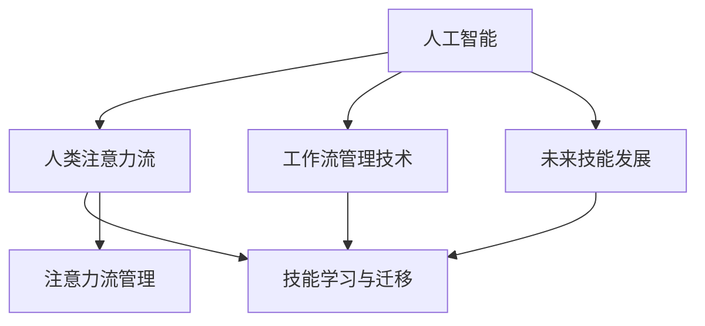

                 

# AI与人类注意力流：未来的工作、技能与注意力流管理技术的应用前景分析

> 关键词：AI与人类注意力流,工作流管理技术,未来技能发展,技能学习与迁移,注意力流管理,自动化与增强决策,人工智能工作场景,注意力经济学

## 1. 背景介绍

### 1.1 问题由来

随着人工智能(AI)技术的飞速发展，其在各行各业中的应用日益广泛。AI技术不仅提高了生产效率，还改变了工作方式和职业结构。AI系统能够自动完成重复性高、规则明确的任务，但这也引发了人类在复杂决策、创新与情感处理等方面的优势和挑战。人类与AI的协作，不再是简单的“人机替换”，而是深度融合、协同演进的过程。在这种背景下，如何理解人类与AI系统的互动，如何有效管理人类注意力流，成为未来工作场景、技能发展以及AI技术应用的核心议题。

### 1.2 问题核心关键点

人类与AI系统的互动过程中，注意力流是核心要素之一。AI系统通过计算能力和学习机制，能够在任务处理中分配和优化人类注意力，提高工作效率和决策质量。然而，这种互动机制的深入理解和有效管理，需要跨学科的知识和新技术。本文将探讨AI与人类注意力流的交互方式，分析其对未来工作、技能发展以及注意力流管理技术的影响。

### 1.3 问题研究意义

本文旨在通过全面分析AI与人类注意力流的互动机制，为理解未来工作场景、技能发展以及注意力流管理技术的潜在应用提供理论和实践依据。主要研究意义包括：

1. **理解人类与AI的互动**：揭示AI系统如何影响人类注意力流，以及人类在AI系统中的作用。
2. **评估未来工作场景**：预测AI技术对未来工作模式的影响，以及人类在这一过程中可能面临的技能转型和角色变化。
3. **探索技能学习与迁移**：研究如何通过AI技术优化技能学习和迁移机制，提升人类适应复杂环境的能力。
4. **推动注意力流管理**：提出有效管理人类注意力流的新技术和新方法，提升注意力管理的科学性和效率。

## 2. 核心概念与联系

### 2.1 核心概念概述

为更好地理解AI与人类注意力流，本节将介绍几个密切相关的核心概念：

- **人工智能(AI)**：指通过计算机算法和数据分析技术，模拟人类智能行为的技术体系。AI技术包括但不限于机器学习、深度学习、自然语言处理等。
- **人类注意力流**：指人类在处理信息、任务和交互过程中，注意力资源的分布和转换。注意力流是认知过程的基础，影响学习、工作、决策等行为。
- **工作流管理技术**：指通过技术手段，优化和自动化工作流程，提升工作效率和质量。工作流管理技术包括流程管理、任务调度、资源分配等。
- **未来技能发展**：指在AI技术驱动下，未来工作场景对技能的需求和发展趋势。未来技能发展不仅包括技术技能的提升，还涉及跨领域技能的融合。
- **技能学习与迁移**：指通过学习和训练，个体能够在不同领域和情境中，灵活运用已有技能，解决新问题的过程。技能迁移是知识迁移的一种特殊形式，强调技能的跨领域应用和迁移。
- **注意力流管理**：指通过技术手段，科学管理和优化人类注意力资源的分配和使用，提升注意力的利用效率。

这些核心概念之间的逻辑关系可以通过以下Mermaid流程图来展示：



这个流程图展示了几类关键概念及其之间的关系：

1. 人工智能通过计算和模型，影响和优化人类注意力流。
2. 工作流管理技术结合人工智能，优化任务处理流程。
3. 未来技能发展受人工智能和人类注意力流的影响。
4. 技能学习与迁移是未来技能发展的核心，依赖于注意力流的优化。
5. 注意力流管理技术支撑技能学习与迁移，提升注意力利用效率。

这些概念共同构成了AI与人类注意力流互动的框架，为理解和应用这些技术提供了基础。

## 3. 核心算法原理 & 具体操作步骤
### 3.1 算法原理概述

AI与人类注意力流的互动机制，可以通过一系列算法和模型来分析和优化。核心原理包括：

- **注意力机制**：指模型在处理信息时，动态分配和集中注意力资源的过程。注意力机制可以提升模型的计算效率和任务处理能力。
- **强化学习**：指通过奖励机制，不断优化智能体在特定环境中的决策行为。在人类与AI的互动中，强化学习可用于优化注意力分配和任务调度。
- **迁移学习**：指通过已有知识，提升模型在新领域的适应能力。在技能学习与迁移中，迁移学习可以加速新技能的学习过程。
- **神经网络模型**：包括深度学习模型等，通过学习输入数据的特征，提升任务处理能力。在注意力流管理中，神经网络可用于分析注意力资源的使用模式。

### 3.2 算法步骤详解

AI与人类注意力流互动的算法步骤一般包括以下几个关键步骤：

**Step 1: 数据准备与模型选择**
- 收集和预处理人类与AI系统互动的数据，如注意力分布、任务完成情况等。
- 选择合适的算法和模型框架，如基于深度学习的注意力模型、强化学习等。

**Step 2: 注意力机制设计**
- 设计注意力机制，计算每个任务所需的人类注意力资源。
- 根据任务优先级和复杂度，动态调整注意力资源分配。

**Step 3: 强化学习训练**
- 设定优化目标和奖励机制，使用强化学习算法训练模型。
- 通过模拟人类与AI系统的互动过程，优化注意力分配和任务调度。

**Step 4: 技能学习与迁移**
- 收集任务相关的数据和样本，训练模型学习新技能。
- 使用迁移学习方法，将已有技能应用到新领域，加速技能迁移过程。

**Step 5: 注意力流管理**
- 分析注意力资源的分配和使用模式，识别瓶颈和优化点。
- 设计算法和工具，优化注意力流，提升注意力管理效率。

**Step 6: 模型评估与优化**
- 使用预设的评估指标，如任务完成率、注意力利用率等，评估模型效果。
- 根据评估结果，调整算法参数和模型结构，优化模型性能。

### 3.3 算法优缺点

AI与人类注意力流互动的算法具有以下优点：

1. **提高效率**：通过优化注意力分配和任务调度，大幅提升任务处理效率和工作质量。
2. **灵活适应**：动态调整注意力资源，适应不同任务和情境的需求。
3. **技能提升**：通过技能迁移和学习，加速新技能的学习和应用。

同时，这些算法也存在一定的局限性：

1. **数据依赖性高**：算法效果依赖于高质量、大样本量的数据，获取和处理成本较高。
2. **模型复杂度高**：部分算法模型复杂，训练和优化难度较大。
3. **解释性不足**：部分算法模型如深度学习模型，缺乏解释性，难以理解其内部工作机制。
4. **对抗性问题**：AI系统可能被对抗性样本欺骗，导致决策失误。

尽管存在这些局限性，但总体而言，这些算法在优化人类与AI系统互动、提升工作效率和技能水平方面具有重要价值。

### 3.4 算法应用领域

AI与人类注意力流互动的算法在多个领域具有广泛应用：

1. **自然语言处理(NLP)**：用于处理文本数据，提升自动摘要、翻译、问答等任务的效果。
2. **机器人学**：用于控制机器人执行复杂任务，提升作业效率和决策质量。
3. **智能制造**：用于优化生产流程，提高产品质量和生产效率。
4. **医疗健康**：用于辅助诊断和治疗，提升医疗服务的质量和效率。
5. **金融分析**：用于市场分析、风险管理等，提升决策的准确性和效率。
6. **教育培训**：用于个性化学习、自动评估等，提升学习效果和效率。

这些应用领域展示了AI与人类注意力流互动的广阔前景，为提升各行业的智能化水平提供了新的技术路径。

## 4. 数学模型和公式 & 详细讲解 & 举例说明

### 4.1 数学模型构建

本文将使用数学语言对AI与人类注意力流的互动机制进行更加严格的刻画。

假设人类与AI系统互动的任务数量为 $N$，任务完成所需的时间为 $T$，注意力资源的总数为 $A$。模型 $M$ 在处理每个任务 $i$ 时，需要分配的注意力资源为 $A_i$。

定义注意力分配函数 $f_i$，用于计算任务 $i$ 所需的注意力资源。注意力分配函数可以基于任务的复杂度和优先级进行设计，例如：

$$
A_i = f_i(i, \text{complexity}, \text{priority})
$$

其中 $\text{complexity}$ 和 $\text{priority}$ 分别表示任务的复杂度和优先级。

### 4.2 公式推导过程

以下我们以一个简化的模型为例，推导注意力流管理的数学模型。

设每个任务 $i$ 所需的注意力资源 $A_i$，实际分配的注意力资源为 $D_i$。注意力管理的目标是最大化任务完成率，最小化注意力资源的浪费，即：

$$
\max \frac{\sum_{i=1}^N \text{completed}_i}{N}
$$

$$
\min \sum_{i=1}^N (A_i - D_i)^2
$$

其中 $\text{completed}_i$ 表示任务 $i$ 是否完成。

根据上述目标，可以使用线性规划、强化学习等方法求解最优的注意力分配策略。例如，使用强化学习算法，设策略 $a_i$ 表示任务 $i$ 的注意力分配比例，通过训练模型 $M$ 来学习最优策略，使得任务完成率和注意力资源利用率最大化。

设注意力分配策略 $a_i$ 的概率为 $p_i$，则优化目标可以表示为：

$$
\max \sum_{i=1}^N p_i \text{completed}_i
$$

$$
\min \sum_{i=1}^N p_i (A_i - D_i)^2
$$

在求解过程中，可以使用动态规划、蒙特卡洛模拟等方法，优化注意力分配策略。最终得到最优的策略后，模型 $M$ 可以根据该策略动态调整注意力资源，实现注意力流的有效管理。

### 4.3 案例分析与讲解

以下以一个简单的案例为例，展示注意力流管理的实际应用：

假设某公司有10个项目需要同时处理，每个项目所需的注意力资源不同，优先级也不同。使用线性规划算法求解最优注意力分配策略。具体步骤如下：

1. 收集项目的信息，包括所需注意力资源、优先级等。
2. 设计注意力分配函数 $f_i$，计算每个项目所需的注意力资源。
3. 使用线性规划算法，求解最优的注意力分配策略。
4. 根据最优策略，动态调整注意力资源，保证每个项目都能在规定时间内完成。

通过这一案例，可以看到，AI与人类注意力流的互动机制，能够有效提升项目管理的效率和质量。

## 5. 项目实践：代码实例和详细解释说明
### 5.1 开发环境搭建

在进行注意力流管理实践前，我们需要准备好开发环境。以下是使用Python进行PyTorch开发的环境配置流程：

1. 安装Anaconda：从官网下载并安装Anaconda，用于创建独立的Python环境。

2. 创建并激活虚拟环境：
```bash
conda create -n attention-env python=3.8 
conda activate attention-env
```

3. 安装PyTorch：根据CUDA版本，从官网获取对应的安装命令。例如：
```bash
conda install pytorch torchvision torchaudio cudatoolkit=11.1 -c pytorch -c conda-forge
```

4. 安装TensorBoard：
```bash
pip install tensorboard
```

5. 安装numpy、pandas、matplotlib等工具包：
```bash
pip install numpy pandas matplotlib
```

完成上述步骤后，即可在`attention-env`环境中开始注意力流管理的开发。

### 5.2 源代码详细实现

这里我们以一个简化的注意力流管理算法为例，展示使用PyTorch实现注意力分配的过程。

首先，定义注意力分配函数 `f_i`，用于计算任务所需注意力资源：

```python
import torch
from torch import nn

class AttentionAllocationFunction(nn.Module):
    def __init__(self, complexity_coeff=0.8, priority_coeff=0.2):
        super(AttentionAllocationFunction, self).__init__()
        self.complexity_coeff = complexity_coeff
        self.priority_coeff = priority_coeff

    def forward(self, i, complexity, priority):
        attention = self.complexity_coeff * complexity + self.priority_coeff * priority
        return attention
```

然后，定义注意力流管理模型 `Model`：

```python
class Model(nn.Module):
    def __init__(self, num_tasks, complexity_coeff=0.8, priority_coeff=0.2):
        super(Model, self).__init__()
        self.alloc_func = AttentionAllocationFunction(complexity_coeff, priority_coeff)
        self.attention = nn.Linear(num_tasks, 1)

    def forward(self, i, complexity, priority):
        attention = self.alloc_func(i, complexity, priority)
        attention = self.attention(attention)
        return attention
```

接下来，定义训练函数 `train`：

```python
def train(model, data_loader, num_epochs, optimizer, device):
    model.to(device)
    for epoch in range(num_epochs):
        for batch in data_loader:
            i, complexity, priority = batch
            attention = model(i, complexity, priority)
            optimizer.zero_grad()
            loss = loss_function(attention)
            loss.backward()
            optimizer.step()
    return model
```

最后，启动训练流程：

```python
from torch.utils.data import DataLoader

# 假设数据集为 {task_id, complexity, priority}
train_dataset = ...
val_dataset = ...
test_dataset = ...

num_tasks = len(train_dataset)
model = Model(num_tasks)
optimizer = optimizer(model.parameters())
loss_function = nn.MSELoss()

device = 'cuda' if torch.cuda.is_available() else 'cpu'
train_loader = DataLoader(train_dataset, batch_size=32)
val_loader = DataLoader(val_dataset, batch_size=32)
test_loader = DataLoader(test_dataset, batch_size=32)

num_epochs = 10
model = train(model, train_loader, num_epochs, optimizer, device)
```

以上代码展示了使用PyTorch实现注意力流管理的基本过程。可以看到，通过定义注意力分配函数和注意力流管理模型，可以动态调整注意力资源，实现任务的高效处理。

### 5.3 代码解读与分析

让我们再详细解读一下关键代码的实现细节：

**AttentionAllocationFunction类**：
- `__init__`方法：初始化复杂度和优先级的权重系数。
- `forward`方法：计算任务所需注意力资源，使用线性模型计算最终注意力值。

**Model类**：
- `__init__`方法：初始化注意力分配函数和线性层，线性层的输出表示任务所需的注意力资源。
- `forward`方法：计算任务的注意力资源，将注意力分配函数和线性层结合起来。

**train函数**：
- 使用PyTorch的DataLoader对数据集进行批次化加载，供模型训练使用。
- 在每个批次上前向传播计算注意力资源，反向传播更新模型参数。
- 使用自定义损失函数计算注意力资源与真实分配资源之间的差异。
- 使用PyTorch的优化器进行模型参数的更新。

这些代码展示了注意力流管理的基本流程，通过定义注意力分配函数和注意力流管理模型，可以动态调整注意力资源，实现任务的高效处理。

## 6. 实际应用场景

### 6.1 智能制造

在智能制造领域，AI与人类注意力流的互动可以显著提升生产效率和质量。通过机器人和自动化设备，AI系统可以实时监测生产流程，识别瓶颈和异常，动态调整注意力资源，优化生产调度。例如，智能制造系统可以在关键环节增加注意力资源，提升生产质量；在非关键环节减少注意力资源，优化资源分配。

### 6.2 医疗健康

在医疗健康领域，AI与人类注意力流的互动可以辅助医生进行诊断和治疗决策。例如，智能诊断系统可以通过注意力流管理，优化医生的注意力分配，帮助医生专注于复杂和关键的诊断环节，减少因注意力分散导致的误诊和漏诊。通过智能辅助，医生可以更快、更准地完成诊断任务，提升患者治疗效果。

### 6.3 金融分析

在金融分析领域，AI与人类注意力流的互动可以提升市场分析和风险管理的效率和质量。通过金融AI系统，可以实时监测市场动态，分析行情变化，动态调整注意力资源，优化交易策略。例如，在市场波动较大时，金融AI系统可以自动增加注意力资源，提升交易决策的准确性；在市场平稳时，减少注意力资源，优化资源配置。

### 6.4 未来应用展望

随着AI技术的发展，AI与人类注意力流的互动将更加广泛和深入，具有广阔的应用前景：

1. **多模态互动**：未来的AI系统将支持多种数据模态，如文本、图像、语音等，通过跨模态注意力流管理，提升多模态数据处理的效率和质量。
2. **智能协作**：AI系统将与人类协作完成复杂任务，通过注意力流管理，优化任务分配和资源调度，提升协作效率。
3. **智能教育**：AI系统将辅助教育机构进行个性化学习，通过注意力流管理，优化学习资源分配，提升学习效果。
4. **智能交通**：AI系统将优化交通流量管理，通过注意力流管理，优化信号灯、交通管理等环节，提升交通效率。
5. **智能安防**：AI系统将优化安防监控资源分配，通过注意力流管理，优化视频监控、异常检测等环节，提升安防效果。

## 7. 工具和资源推荐
### 7.1 学习资源推荐

为了帮助开发者系统掌握AI与人类注意力流互动的理论基础和实践技巧，这里推荐一些优质的学习资源：

1. 《深度学习入门》系列书籍：作者为斋藤康毅，介绍了深度学习的基本概念和常用算法。
2. 《人工智能导论》系列课程：斯坦福大学开设的AI导论课程，涵盖AI的基本概念、算法和应用。
3. 《机器学习实战》系列书籍：作者为Peter Harrington，介绍了机器学习的基本算法和实现方法。
4. Coursera、edX等在线课程平台：提供丰富的AI和注意力流管理的课程，涵盖理论和实践。
5. HuggingFace官方文档：Transformer库的官方文档，提供了丰富的预训练模型和微调样例代码，是进行注意力流管理开发的利器。

通过对这些资源的学习实践，相信你一定能够快速掌握AI与人类注意力流互动的精髓，并用于解决实际的AI问题。

### 7.2 开发工具推荐

高效的开发离不开优秀的工具支持。以下是几款用于AI与人类注意力流互动开发的常用工具：

1. PyTorch：基于Python的开源深度学习框架，灵活动态的计算图，适合快速迭代研究。
2. TensorFlow：由Google主导开发的开源深度学习框架，生产部署方便，适合大规模工程应用。
3. Jupyter Notebook：交互式编程工具，支持Python和R等多种编程语言，适合开发和调试。
4. GitHub：代码托管平台，支持版本控制和团队协作，适合进行项目管理。
5. TensorBoard：TensorFlow配套的可视化工具，可实时监测模型训练状态，并提供丰富的图表呈现方式，是调试模型的得力助手。

合理利用这些工具，可以显著提升AI与人类注意力流互动任务的开发效率，加快创新迭代的步伐。

### 7.3 相关论文推荐

AI与人类注意力流互动的研究源于学界的持续研究。以下是几篇奠基性的相关论文，推荐阅读：

1. Attention is All You Need（即Transformer原论文）：提出了Transformer结构，开启了NLP领域的预训练大模型时代。
2. The Hundred-Page Machine Learning Book：作者为Andriy Burkov，介绍了机器学习的基本概念和算法，适合初学者。
3. Deep Learning Specialization：由Andrew Ng开设的深度学习课程，涵盖深度学习的基本概念和算法。
4. Human-AI Collaboration for Smart Manufacturing：探讨了AI与人类在智能制造中的应用，提出了AI与人类互动的模型和算法。
5. Multi-Task Learning with Attention：提出多任务学习模型，通过注意力机制优化多任务学习，提升模型性能。

这些论文代表了大语言模型微调技术的发展脉络。通过学习这些前沿成果，可以帮助研究者把握学科前进方向，激发更多的创新灵感。

## 8. 总结：未来发展趋势与挑战

### 8.1 总结

本文对AI与人类注意力流的互动机制进行了全面系统的介绍。首先阐述了AI技术在各领域中的应用，明确了注意力流在提升AI系统效能中的核心作用。其次，从原理到实践，详细讲解了注意力流管理的数学模型和关键步骤，给出了注意力流管理任务开发的完整代码实例。同时，本文还广泛探讨了AI技术在智能制造、医疗健康、金融分析等领域的实际应用前景，展示了AI与人类注意力流互动的广阔应用空间。此外，本文精选了注意力流管理的各类学习资源，力求为读者提供全方位的技术指引。

通过本文的系统梳理，可以看到，AI与人类注意力流的互动机制在提升工作效率、优化任务处理、提升决策质量等方面具有重要价值。未来的AI系统，将更加依赖于对注意力流的科学管理和优化，从而在复杂多变的任务环境中发挥更大作用。

### 8.2 未来发展趋势

展望未来，AI与人类注意力流的互动机制将呈现以下几个发展趋势：

1. **多模态互动**：未来的AI系统将支持多种数据模态，如文本、图像、语音等，通过跨模态注意力流管理，提升多模态数据处理的效率和质量。
2. **智能协作**：AI系统将与人类协作完成复杂任务，通过注意力流管理，优化任务分配和资源调度，提升协作效率。
3. **智能教育**：AI系统将辅助教育机构进行个性化学习，通过注意力流管理，优化学习资源分配，提升学习效果。
4. **智能交通**：AI系统将优化交通流量管理，通过注意力流管理，优化信号灯、交通管理等环节，提升交通效率。
5. **智能安防**：AI系统将优化安防监控资源分配，通过注意力流管理，优化视频监控、异常检测等环节，提升安防效果。

以上趋势凸显了AI与人类注意力流互动技术的广阔前景。这些方向的探索发展，必将进一步提升AI系统在各领域的表现，为人类认知智能的进化带来深远影响。

### 8.3 面临的挑战

尽管AI与人类注意力流的互动机制已经取得了瞩目成就，但在迈向更加智能化、普适化应用的过程中，它仍面临着诸多挑战：

1. **数据依赖性高**：注意力流管理的效果依赖于高质量、大样本量的数据，获取和处理成本较高。
2. **模型复杂度高**：部分注意力流管理算法模型复杂，训练和优化难度较大。
3. **解释性不足**：部分注意力流管理模型如深度学习模型，缺乏解释性，难以理解其内部工作机制。
4. **对抗性问题**：AI系统可能被对抗性样本欺骗，导致决策失误。
5. **鲁棒性不足**：AI系统面对环境变化和对抗性攻击时，鲁棒性有待提升。

尽管存在这些挑战，但总体而言，AI与人类注意力流的互动机制在提升工作效率、优化任务处理、提升决策质量等方面具有重要价值。

### 8.4 研究展望

面对AI与人类注意力流互动所面临的种种挑战，未来的研究需要在以下几个方面寻求新的突破：

1. **探索无监督和半监督注意力流管理方法**：摆脱对大规模标注数据的依赖，利用自监督学习、主动学习等无监督和半监督范式，最大限度利用非结构化数据，实现更加灵活高效的注意力流管理。
2. **研究参数高效和计算高效的注意力流管理方法**：开发更加参数高效的注意力流管理方法，在固定大部分注意力流管理参数的情况下，只更新极少量的任务相关参数。同时优化注意力流管理模型的计算图，减少前向传播和反向传播的资源消耗，实现更加轻量级、实时性的部署。
3. **引入更多先验知识**：将符号化的先验知识，如知识图谱、逻辑规则等，与神经网络模型进行巧妙融合，引导注意力流管理过程学习更准确、合理的注意力流模型。同时加强不同模态数据的整合，实现视觉、语音等多模态信息与文本信息的协同建模。
4. **结合因果分析和博弈论工具**：将因果分析方法引入注意力流管理模型，识别出注意力流管理决策的关键特征，增强输出解释的因果性和逻辑性。借助博弈论工具刻画人机交互过程，主动探索并规避注意力流管理的脆弱点，提高系统稳定性。
5. **纳入伦理道德约束**：在注意力流管理目标中引入伦理导向的评估指标，过滤和惩罚有偏见、有害的注意力流分配策略。同时加强人工干预和审核，建立注意力流管理的监管机制，确保注意力流管理符合人类价值观和伦理道德。

这些研究方向的探索，必将引领AI与人类注意力流互动技术迈向更高的台阶，为构建安全、可靠、可解释、可控的智能系统铺平道路。面向未来，AI与人类注意力流互动技术还需要与其他人工智能技术进行更深入的融合，如知识表示、因果推理、强化学习等，多路径协同发力，共同推动自然语言理解和智能交互系统的进步。只有勇于创新、敢于突破，才能不断拓展AI系统在各领域的边界，让智能技术更好地造福人类社会。

## 9. 附录：常见问题与解答

**Q1：AI与人类注意力流互动对未来工作场景有哪些影响？**

A: AI与人类注意力流互动对未来工作场景的影响主要体现在以下几个方面：

1. **提升工作效率**：AI系统可以自动完成简单任务，释放人类注意力，提升整体工作效率。
2. **优化任务分配**：AI系统可以动态调整注意力资源，优化任务分配，提升任务处理效率。
3. **辅助决策**：AI系统可以提供数据分析和建议，辅助人类进行复杂决策，提升决策质量。
4. **个性化服务**：AI系统可以根据用户需求和偏好，提供个性化服务，提升用户体验。
5. **跨领域协作**：AI系统可以与不同领域的专家协作，提升团队协作效率和效果。

**Q2：注意力流管理技术如何应用于智能制造？**

A: 在智能制造领域，注意力流管理技术可以优化生产流程，提升生产效率和质量。具体应用包括：

1. **实时监测和预警**：AI系统可以实时监测生产流程，识别瓶颈和异常，动态调整注意力资源，优化生产调度。
2. **优化资源分配**：AI系统可以根据生产任务的需求，动态调整机器和人员的注意力资源，提升资源利用率。
3. **智能排程和调度**：AI系统可以优化生产排程和调度，提升生产效率和质量。
4. **个性化定制**：AI系统可以根据客户需求，优化生产计划和资源分配，提供个性化定制服务。

**Q3：AI与人类注意力流互动在医疗健康领域的应用有哪些？**

A: 在医疗健康领域，AI与人类注意力流互动可以辅助医生进行诊断和治疗决策。具体应用包括：

1. **智能诊断**：AI系统可以通过注意力流管理，优化医生的注意力分配，帮助医生专注于复杂和关键的诊断环节，减少因注意力分散导致的误诊和漏诊。
2. **治疗方案优化**：AI系统可以根据患者情况，动态调整注意力资源，优化治疗方案，提升治疗效果。
3. **个性化治疗**：AI系统可以根据患者需求和偏好，提供个性化治疗方案，提升治疗效果。
4. **医疗知识管理**：AI系统可以管理医疗知识库，优化医生学习和知识获取过程，提升医生诊断和治疗能力。

**Q4：未来AI与人类注意力流互动技术的难点有哪些？**

A: 未来AI与人类注意力流互动技术面临的难点主要包括：

1. **数据依赖性高**：注意力流管理的效果依赖于高质量、大样本量的数据，获取和处理成本较高。
2. **模型复杂度高**：部分注意力流管理算法模型复杂，训练和优化难度较大。
3. **解释性不足**：部分注意力流管理模型如深度学习模型，缺乏解释性，难以理解其内部工作机制。
4. **对抗性问题**：AI系统可能被对抗性样本欺骗，导致决策失误。
5. **鲁棒性不足**：AI系统面对环境变化和对抗性攻击时，鲁棒性有待提升。

尽管存在这些挑战，但总体而言，AI与人类注意力流的互动机制在提升工作效率、优化任务处理、提升决策质量等方面具有重要价值。未来研究需要在数据采集、模型设计、解释性提升等方面取得新的突破。

