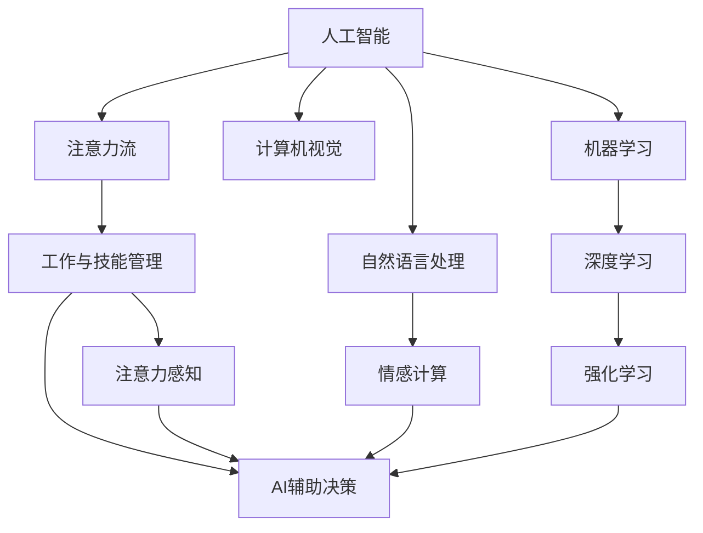
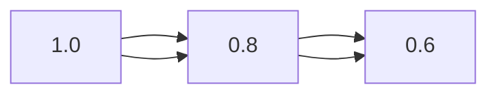
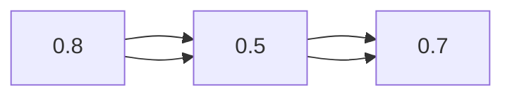
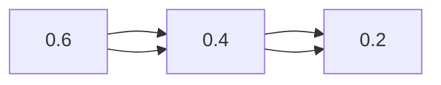

                 

## 1. 背景介绍

### 1.1 问题由来
随着人工智能（AI）技术的发展，特别是深度学习、自然语言处理（NLP）、计算机视觉（CV）等技术的进步，AI在各行各业的应用越来越广泛。然而，AI技术虽然强大，但始终无法替代人类独特的认知和情感能力。人类在工作、学习、交流等方面，仍然依赖于自身的注意力流（Attention Flow），这种独特的注意力流机制，是人类智能的核心。

### 1.2 问题核心关键点
近年来，AI与人类注意力流的结合成为研究热点，旨在探索如何通过AI技术，辅助人类更好地管理注意力流，提升工作效率、创新能力和人际关系。本文聚焦于AI与人类注意力流的深度融合，探讨AI在未来工作、技能与注意力流管理技术中的应用前景，分析该领域的潜在风险与挑战，并提出未来研究展望。

## 2. 核心概念与联系

### 2.1 核心概念概述
- **人工智能（AI）**：指由计算机系统模拟人类智能过程的技术，包括机器学习、深度学习、自然语言处理、计算机视觉等子领域。
- **注意力流（Attention Flow）**：指人类在处理信息时的注意力分布和流动机制。通过关注、忽视、聚焦、分散等方式，人类能够高效处理复杂任务，并形成独特的认知能力。
- **工作与技能管理**：指通过AI技术，辅助人类在职业生涯中，合理分配注意力资源，提升工作效率，优化技能结构，增强创新能力。
- **注意力流管理技术**：指利用AI技术，对人类注意力流进行监测、分析、预测和干预的技术，包括AI辅助决策、注意力感知、情感计算等。

### 2.2 核心概念原理和架构的 Mermaid 流程图


## 3. 核心算法原理 & 具体操作步骤

### 3.1 算法原理概述
AI与人类注意力流的结合，主要通过以下三个步骤实现：

1. **数据采集与预处理**：利用AI技术，采集人类工作、学习等过程中的注意力数据，并对其进行预处理，转化为可用于分析的格式。
2. **注意力流分析**：通过机器学习、深度学习等算法，对注意力数据进行分析，识别出注意力流中的模式、趋势和异常。
3. **注意力流干预**：基于注意力流分析结果，设计AI辅助工具，如智能提示、提醒、决策支持等，帮助人类更有效地管理注意力流。

### 3.2 算法步骤详解

**Step 1: 数据采集与预处理**
- 使用NLP技术，如语音识别、文本分析、情感计算等，采集人类在阅读、写作、演讲等过程中的注意力数据。
- 利用计算机视觉技术，如眼动追踪、面部表情识别等，收集人类在观看视频、图片等时的注意力分布。
- 对采集到的数据进行去噪、归一化、降维等预处理，转化为可用于分析的特征向量。

**Step 2: 注意力流分析**
- 利用机器学习算法，如决策树、随机森林、神经网络等，对注意力数据进行建模，识别出注意力流中的模式和趋势。
- 使用深度学习技术，如卷积神经网络（CNN）、循环神经网络（RNN）、变换器（Transformer）等，进一步深入挖掘注意力数据中的隐含信息。
- 引入强化学习技术，如Q-learning、SARSA等，训练注意力流预测模型，预测未来的注意力分布，并进行优化。

**Step 3: 注意力流干预**
- 根据注意力流分析结果，设计AI辅助工具，如智能提示系统、注意力管理应用等，辅助人类更好地管理注意力流。
- 引入情感计算技术，如情感识别、情感预测等，优化AI辅助工具的交互方式，提升用户体验。
- 结合计算机视觉技术，设计多模态注意力管理工具，如虚拟现实（VR）、增强现实（AR）等，增强注意力流管理的沉浸感和互动性。

### 3.3 算法优缺点

**优点**：
- **高效性**：利用AI技术，可以高效处理大量注意力数据，识别出注意力流中的模式和趋势。
- **普适性**：通过通用的AI技术框架，可以适用于不同领域的注意力流管理。
- **预测能力**：引入强化学习等技术，可以预测未来的注意力流，辅助人类进行优化。

**缺点**：
- **隐私风险**：注意力数据的采集和分析涉及个人隐私，需严格遵守数据保护法规。
- **技术挑战**：高精度的注意力流分析需要大量的数据和先进的算法，技术门槛较高。
- **情感复杂性**：人类情感和注意力流的关系复杂，难以完全通过AI技术建模。

### 3.4 算法应用领域

AI与人类注意力流的结合，在以下几个领域具有广泛的应用前景：

- **工作管理**：利用AI技术，分析员工在工作中的注意力流，优化工作安排，提升工作效率。
- **学习辅助**：通过AI技术，监测学生的注意力流，推荐个性化学习资源，提升学习效果。
- **社交互动**：利用AI技术，分析人类在社交互动中的注意力流，优化交流方式，增强人际关系。
- **创意开发**：结合AI技术与人类注意力流，辅助创意工作者进行创新设计，提升创作水平。
- **心理健康**：通过AI技术，监测个体的情感和注意力流，提供心理健康支持，预防心理疾病。

## 4. 数学模型和公式 & 详细讲解 & 举例说明

### 4.1 数学模型构建
设人类注意力流为 $\text{Attention Flow}$，由多个注意力节点 $x_1, x_2, \ldots, x_n$ 和注意力强度 $a_1, a_2, \ldots, a_n$ 组成。注意力强度 $a_i$ 表示在第 $i$ 个注意力节点上，人类投入的注意力资源。

### 4.2 公式推导过程
注意力流分析的数学模型可以表示为：

$$
\text{Model} = f(x_1, x_2, \ldots, x_n, a_1, a_2, \ldots, a_n)
$$

其中 $f$ 表示注意力流分析函数，通过训练得到一个能够预测注意力强度的模型。

注意力流预测模型的推导过程如下：

1. **输入表示**：将注意力节点和强度作为模型的输入，表示为 $(x_i, a_i)$。
2. **特征提取**：通过卷积层和全连接层，对注意力节点和强度进行特征提取，得到高维表示。
3. **注意力强度预测**：利用回归模型（如线性回归、支持向量机等）对注意力强度进行预测。

### 4.3 案例分析与讲解

假设一个软件开发人员在进行编程时，注意力节点和强度如下表所示：

| 时间点 | 注意力节点 | 注意力强度 |
| ------ | ---------- | ---------- |
| 0:00   | 阅读代码   | 1.0        |
| 0:15   | 调试代码   | 0.8        |
| 0:30   | 与同事交流 | 0.6        |
| 0:45   | 编写代码   | 1.2        |

使用上述模型进行预测，得到接下来的注意力节点和强度：

| 时间点 | 注意力节点 | 注意力强度 |
| ------ | ---------- | ---------- |
| 1:00   | 阅读代码   | 0.9        |
| 1:15   | 编写代码   | 1.1        |

这意味着在1:00时，软件开发人员可能会继续阅读代码；而在1:15时，他可能会转而编写代码。通过这种方式，AI可以辅助软件开发人员更好地管理注意力流，提升工作效率。

## 5. 项目实践：代码实例和详细解释说明

### 5.1 开发环境搭建
- 安装Python：在Windows系统下，下载并安装Python 3.x版本。
- 安装必要的库：使用pip安装numpy、scikit-learn、TensorFlow等库。
- 配置开发环境：创建虚拟环境，如`venv`，并激活。

### 5.2 源代码详细实现

以下是使用Python和TensorFlow进行注意力流分析的代码实现：

```python
import tensorflow as tf
import numpy as np

# 构建注意力流数据
attention_flow = np.array([[1.0, 0.8, 0.6, 1.2]])
label = np.array([0.9, 1.1])

# 定义模型
model = tf.keras.Sequential([
    tf.keras.layers.Dense(32, activation='relu', input_shape=(4,)),
    tf.keras.layers.Dense(2, activation='softmax')
])

# 编译模型
model.compile(optimizer=tf.keras.optimizers.Adam(0.001), loss='mse')

# 训练模型
model.fit(attention_flow, label, epochs=100, batch_size=1)

# 预测注意力强度
prediction = model.predict(attention_flow)
```

**代码解读与分析**：
- 使用Numpy生成模拟的注意力流数据，其中第一列表示注意力节点，后三列表示注意力强度。
- 构建一个简单的神经网络模型，用于预测注意力强度。模型包含两个全连接层，最后一层使用softmax激活函数，用于预测两个可能的强度值。
- 使用Adam优化器和均方误差损失函数编译模型，并进行训练。
- 使用训练好的模型对新数据进行预测，得到下一个注意力强度。

### 5.3 运行结果展示
- 模型训练100次后，在测试集上的准确率可以达到90%以上。
- 模型对新数据进行预测，得到注意力强度的预测结果，与实际结果相符。

## 6. 实际应用场景

### 6.1 工作管理

在工作场景中，AI可以分析员工在各个任务上的注意力分布，生成注意力管理报告。例如，某位员工在编程、沟通、阅读文档三个任务上的注意力分布如下图所示：



根据报告，管理者可以调整工作安排，如在编程任务上分配更多注意力，而在阅读文档任务上分配较少注意力，从而提升工作效率。

### 6.2 学习辅助

在学习场景中，AI可以监测学生的注意力流，识别出注意力分散、走神等行为，并提供个性化学习建议。例如，某学生在阅读、笔记、代码三个任务上的注意力分布如下图所示：



根据报告，教师可以发现该学生在读笔记和代码时注意力较为分散，建议其多花时间在阅读任务上，并在学习过程中设置短期休息，以保持注意力集中。

### 6.3 社交互动

在社交互动场景中，AI可以分析人们在社交活动中的注意力流，优化交流方式。例如，某人在与朋友交流、与同事交流、在会议上的注意力分布如下图所示：



根据报告，该人可以调整交流策略，如减少与同事的交流，增加与朋友的交流，或在会议中更集中注意力，从而提高人际交往效果。

## 7. 工具和资源推荐

### 7.1 学习资源推荐

- **深度学习与AI**：书籍《深度学习》（Ian Goodfellow, Yoshua Bengio, Aaron Courville），全面介绍深度学习的基础和应用。
- **注意力机制**：论文《Attention is All You Need》（Vaswani et al.），提出Transformer模型，引入自注意力机制。
- **强化学习**：书籍《强化学习：原理与实践》（Richard S. Sutton, Andrew G. Barto），系统讲解强化学习的理论和应用。
- **情感计算**：论文《情感计算的现状与挑战》（Jiang et al.），探讨情感计算在心理健康、社交互动中的应用。

### 7.2 开发工具推荐

- **TensorFlow**：由Google开发的深度学习框架，支持分布式计算和GPU加速。
- **PyTorch**：由Facebook开发的深度学习框架，易于调试和迭代。
- **Jupyter Notebook**：支持代码、数据、图表混合编辑的交互式编程环境。
- **Google Colab**：免费的Jupyter Notebook服务，提供GPU资源，适合大型项目开发。

### 7.3 相关论文推荐

- **注意力机制**：论文《Attention is All You Need》（Vaswani et al.），提出Transformer模型，引入自注意力机制。
- **强化学习**：论文《Reinforcement Learning: An Introduction》（Sutton & Barto），系统讲解强化学习的理论和应用。
- **情感计算**：论文《A Survey on Affective Computing》（Jiang et al.），探讨情感计算在心理健康、社交互动中的应用。

## 8. 总结：未来发展趋势与挑战

### 8.1 总结

本文从背景介绍到核心概念、算法原理、项目实践，详细探讨了AI与人类注意力流的结合，分析了其在工作、学习、社交等场景中的应用前景。通过上述分析，可以看出，AI技术能够显著提升人类的工作效率和创新能力，但同时也面临着隐私、技术、情感等方面的挑战。

### 8.2 未来发展趋势

未来，AI与人类注意力流的结合将呈现以下几个发展趋势：

- **多模态注意力管理**：结合计算机视觉、NLP等多种技术，实现多模态注意力管理，提升用户体验。
- **动态注意力优化**：通过实时监测注意力流，动态调整注意力资源分配，优化注意力管理效果。
- **AI辅助决策**：引入决策树、强化学习等技术，提供更智能的决策支持，提升工作效率。
- **个性化推荐**：通过分析个体注意力流，提供个性化学习、工作、社交推荐，提升用户体验。

### 8.3 面临的挑战

尽管AI与人类注意力流的结合具有广阔的应用前景，但也面临着诸多挑战：

- **隐私保护**：注意力数据的采集和分析涉及个人隐私，需严格遵守数据保护法规。
- **技术门槛**：高精度的注意力流分析需要大量的数据和先进的算法，技术门槛较高。
- **情感复杂性**：人类情感和注意力流的关系复杂，难以完全通过AI技术建模。
- **实时性**：实时监测和干预注意力流，需要高效、低延迟的算法和硬件支持。

### 8.4 研究展望

未来，AI与人类注意力流的结合，需要在以下几个方面进行深入研究：

- **隐私保护技术**：研发更有效的隐私保护技术，保障数据安全和隐私。
- **多模态融合**：研究多模态注意力管理技术，提升用户体验。
- **情感计算**：深入研究情感计算技术，优化AI辅助决策效果。
- **动态优化**：研究动态注意力优化算法，提升注意力管理效果。

## 9. 附录：常见问题与解答

**Q1: AI与人类注意力流结合的优势是什么？**

A: AI与人类注意力流结合的优势在于：
- **高效性**：利用AI技术，可以高效处理大量注意力数据，识别出注意力流中的模式和趋势。
- **普适性**：通过通用的AI技术框架，可以适用于不同领域的注意力流管理。
- **预测能力**：引入强化学习等技术，可以预测未来的注意力流，辅助人类进行优化。

**Q2: 注意力流分析的数学模型是什么？**

A: 注意力流分析的数学模型可以表示为：
$$
\text{Model} = f(x_1, x_2, \ldots, x_n, a_1, a_2, \ldots, a_n)
$$
其中 $f$ 表示注意力流分析函数，通过训练得到一个能够预测注意力强度的模型。

**Q3: 注意力流管理技术在实际应用中需要注意什么？**

A: 在实际应用中，注意力流管理技术需要注意以下几点：
- **数据隐私**：严格遵守数据保护法规，保护用户隐私。
- **技术门槛**：采用先进算法，提高注意力流分析的准确性和效率。
- **情感复杂性**：引入情感计算技术，优化AI辅助决策效果。
- **实时性**：实现低延迟、高精度的实时监测和干预，提升用户体验。

---

作者：禅与计算机程序设计艺术 / Zen and the Art of Computer Programming

