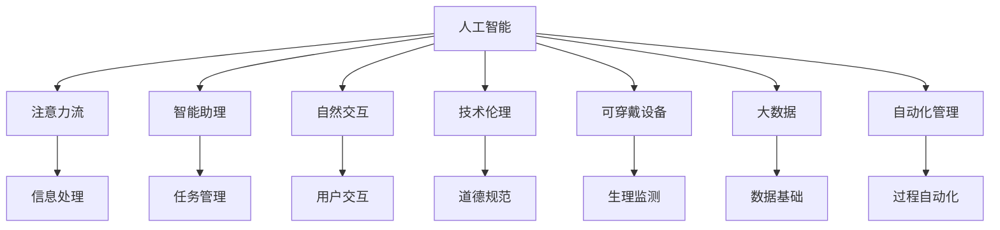

                 

# AI与人类注意力流：未来的工作、生活与注意力管理创新

> 关键词：人工智能, 注意力流, 人类行为, 智能助理, 自然交互, 技术伦理, 可穿戴设备, 大数据, 自动化管理

## 1. 背景介绍

### 1.1 问题由来
在数字化转型加速的今天，人工智能（AI）正迅速渗透到人类社会的各个角落。从语音识别、图像处理到自然语言处理，AI技术在各个领域展现出了前所未有的应用潜力。然而，AI的广泛应用也引发了人们对其对人类行为、工作和生活方式影响的关注。如何在享受AI带来的便利的同时，保持人类的自主性和创造性，成为一个亟待解决的问题。

### 1.2 问题核心关键点
注意力是人类认知过程的核心要素，影响着我们处理信息、做出决策的能力。AI技术，特别是智能助理、自然交互系统等，已经初步具备了关注和理解人类注意力流的能力。这些技术如何进一步与人类行为、工作和生活方式融合，成为未来AI发展的重要研究方向。

### 1.3 问题研究意义
通过研究AI与人类注意力流的互动关系，我们可以更好地理解AI技术如何塑造人类的工作、生活和学习方式。这不仅有助于优化现有技术，还能为未来的AI应用提供新的思路和方向，促进人类与AI的和谐共存。

## 2. 核心概念与联系

### 2.1 核心概念概述

为更好地理解AI与人类注意力流的互动关系，本节将介绍几个密切相关的核心概念：

- **人工智能（Artificial Intelligence, AI）**：通过算法和计算，使机器具有类人智能。包括感知、学习、推理、决策等能力。

- **注意力流（Attention Flow）**：人类认知过程中的注意力流动，影响信息的处理和记忆。AI可以通过学习人类注意力模式，提升信息处理效率和准确性。

- **智能助理（Intelligent Assistant）**：能够理解和执行用户指令，帮助用户管理日常任务和信息的人工智能系统。

- **自然交互（Natural Interaction）**：使机器能够自然地与人类进行交互，通过语音、文字、手势等多种方式理解和响应用户需求。

- **技术伦理（Technology Ethics）**：关注AI技术在发展、应用过程中的道德和伦理问题，确保AI技术的应用符合人类价值观和社会规范。

- **可穿戴设备（Wearable Devices）**：如智能手表、智能眼镜等，能够实时监测和分析用户生理和行为数据，提升用户体验。

- **大数据（Big Data）**：涉及从各种来源收集的海量数据，为AI提供训练和优化数据基础。

- **自动化管理（Automated Management）**：通过AI技术实现工作、学习等过程的自动化和智能化，提升效率和质量。

这些核心概念之间的逻辑关系可以通过以下Mermaid流程图来展示：



这个流程图展示了大语言模型的核心概念及其之间的关系：

1. 人工智能通过学习注意力流、智能助理和自然交互等技术，提升信息处理能力。
2. 智能助理和自然交互系统通过理解和执行用户指令，帮助用户管理日常任务。
3. 技术伦理确保AI技术的应用符合道德规范。
4. 可穿戴设备通过实时监测和分析用户生理和行为数据，提升用户体验。
5. 大数据为AI提供训练和优化数据基础。
6. 自动化管理通过AI技术实现工作、学习等过程的自动化和智能化。

这些概念共同构成了AI与人类注意力流的互动关系，为未来的AI应用提供了理论基础和实践指导。

## 3. 核心算法原理 & 具体操作步骤
### 3.1 算法原理概述

AI与人类注意力流的互动关系，可以通过注意力流感知、理解、响应和优化等过程来阐述。以下详细介绍这一过程的算法原理。

**3.1.1 注意力流感知**

注意力流感知是AI技术的重要基础，其核心在于通过深度学习和数据分析技术，识别和分析人类注意力流模式。这一过程包括：

- **数据收集**：通过可穿戴设备、智能助理等工具，收集用户的行为和生理数据。
- **特征提取**：使用机器学习算法，从原始数据中提取关键特征，如眼动轨迹、心率变化等。
- **模式识别**：通过训练神经网络模型，识别和分类注意力模式，如专注、分心、疲劳等。

**3.1.2 注意力流理解**

在感知的基础上，AI需要进一步理解注意力流的背景和意义，这涉及多方面的知识推理和情境感知。这一过程包括：

- **知识图谱构建**：构建包含领域知识、情境信息、用户偏好等的多维知识图谱。
- **上下文推理**：利用图谱中的知识，进行上下文推理，理解用户的意图和需求。
- **情境感知**：通过自然语言处理（NLP）技术，分析用户指令中的语义和情感，结合当前情境，进行综合判断。

**3.1.3 注意力流响应**

AI技术应具备灵活的响应能力，根据用户的注意力流模式，提供合适的服务和建议。这一过程包括：

- **任务推荐**：基于用户注意力流模式，推荐合适的任务和活动，如学习资源、工作任务等。
- **决策辅助**：利用AI的预测和优化能力，辅助用户做出更好的决策，如投资、健康管理等。
- **信息过滤**：根据用户的注意力模式，过滤无关信息，提升信息处理效率。

**3.1.4 注意力流优化**

为了提升AI与人类注意力流的互动效果，需要进行持续的优化和改进。这一过程包括：

- **反馈学习**：通过用户反馈，不断调整和优化AI的响应策略。
- **个性化定制**：根据用户的行为和偏好，定制个性化的服务方案。
- **跨域学习**：通过跨领域的知识融合，提升AI的通用性和适应性。

### 3.2 算法步骤详解

以下是基于注意力流感知、理解、响应和优化等过程，详细介绍AI与人类注意力流互动的具体步骤：

**Step 1: 数据收集**

1. **可穿戴设备**：收集用户的生理数据（如心率、血压等）和行为数据（如眼动轨迹、鼠标移动等）。
2. **智能助理**：记录用户与智能助理的交互记录，包括语音、文字和手势等。
3. **环境监测**：利用传感器监测环境数据，如光照、温度、噪音等，以影响用户注意力。

**Step 2: 特征提取**

1. **数据预处理**：清洗和标准化原始数据，去除噪声和异常值。
2. **特征选择**：从收集的数据中，选择与注意力流相关的特征，如时间序列、空间分布等。
3. **特征转换**：通过数据转换技术，将原始数据转换为适合机器学习模型的形式，如PCA降维、标准化等。

**Step 3: 注意力流感知**

1. **模式识别**：使用深度学习模型（如CNN、RNN、LSTM等），识别注意力流模式。
2. **注意力流分类**：将识别出的注意力流模式进行分类，如专注、分心、疲劳等。
3. **异常检测**：使用异常检测算法，识别注意力流的异常变化，如注意力不集中、疲劳过度等。

**Step 4: 注意力流理解**

1. **知识图谱构建**：利用领域知识构建多维知识图谱，包含领域专家知识、情境信息、用户偏好等。
2. **情境感知**：利用NLP技术，分析用户指令中的语义和情感，结合当前情境，进行综合判断。
3. **决策推理**：结合知识图谱和情境信息，进行决策推理，理解用户的意图和需求。

**Step 5: 注意力流响应**

1. **任务推荐**：基于用户注意力流模式，推荐合适的任务和活动，如学习资源、工作任务等。
2. **决策辅助**：利用AI的预测和优化能力，辅助用户做出更好的决策，如投资、健康管理等。
3. **信息过滤**：根据用户的注意力模式，过滤无关信息，提升信息处理效率。

**Step 6: 注意力流优化**

1. **反馈学习**：通过用户反馈，不断调整和优化AI的响应策略。
2. **个性化定制**：根据用户的行为和偏好，定制个性化的服务方案。
3. **跨域学习**：通过跨领域的知识融合，提升AI的通用性和适应性。

### 3.3 算法优缺点

基于注意力流感知、理解、响应和优化等过程的AI与人类注意力流互动，具有以下优点：

- **个性化服务**：通过识别和理解用户注意力流，提供个性化的服务和建议，提升用户体验。
- **决策支持**：利用AI的预测和优化能力，辅助用户做出更好的决策，提升决策效率和准确性。
- **信息过滤**：根据用户的注意力模式，过滤无关信息，提升信息处理效率。

同时，这一方法也存在一定的局限性：

- **数据隐私**：大量生理和行为数据的收集和使用，涉及用户隐私问题，需严格遵守数据保护法规。
- **技术依赖**：依赖高级的AI算法和模型，对数据质量和算法优化要求较高。
- **跨领域融合**：实现跨领域的知识融合和应用，需要解决知识表示和融合的复杂问题。

尽管存在这些局限性，基于注意力流感知、理解、响应和优化等过程的AI与人类注意力流互动，仍然是未来AI应用的重要方向。

### 3.4 算法应用领域

基于注意力流感知、理解、响应和优化等过程的AI与人类注意力流互动，已经在多个领域得到广泛应用，例如：

- **智能办公**：通过监测和分析员工的注意力流，优化工作环境，提升工作效率。
- **个性化教育**：根据学生的注意力流模式，推荐学习资源，定制个性化学习计划。
- **健康管理**：监测用户的生理和行为数据，辅助健康管理，提升生活质量。
- **智慧家居**：通过监测用户的注意力流，自动调整家居设备，提升生活便利性。

除了上述这些经典领域外，AI与人类注意力流的互动方法也在更多场景中得到创新性地应用，如智能交通、智能金融、智能客服等，为人类生活的各个方面带来了新的变革。

## 4. 数学模型和公式 & 详细讲解 & 举例说明

### 4.1 数学模型构建

本节将使用数学语言对AI与人类注意力流的互动关系进行更加严格的刻画。

设用户注意力流的数据集为 $D=\{(x_i,y_i)\}_{i=1}^N$，其中 $x_i$ 为输入数据，如眼动轨迹、鼠标移动等，$y_i$ 为注意力流模式，如专注、分心、疲劳等。

定义注意力流感知模型为 $M_{\theta}$，其中 $\theta$ 为模型参数。

注意力流感知模型的损失函数为 $\mathcal{L}(\theta) = \frac{1}{N} \sum_{i=1}^N \ell(y_i, M_{\theta}(x_i))$，其中 $\ell$ 为交叉熵损失函数，用于衡量模型预测与真实标签之间的差异。

### 4.2 公式推导过程

以下我们以注意力流感知模型为例，推导其损失函数及其梯度的计算公式。

假设注意力流感知模型为 $M_{\theta}:\mathcal{X} \rightarrow \mathcal{Y}$，其中 $\mathcal{X}$ 为输入空间，$\mathcal{Y}$ 为注意力流模式空间，$\theta \in \mathbb{R}^d$ 为模型参数。

定义注意力流感知模型 $M_{\theta}$ 在数据样本 $(x,y)$ 上的损失函数为 $\ell(M_{\theta}(x),y)$，则在数据集 $D$ 上的经验风险为：

$$
\mathcal{L}(\theta) = \frac{1}{N} \sum_{i=1}^N \ell(y_i, M_{\theta}(x_i))
$$

其中 $\ell(y_i, M_{\theta}(x_i)) = -[y_i \log M_{\theta}(x_i)]$，为交叉熵损失函数。

根据链式法则，损失函数对参数 $\theta_k$ 的梯度为：

$$
\frac{\partial \mathcal{L}(\theta)}{\partial \theta_k} = -\frac{1}{N}\sum_{i=1}^N \frac{\partial \ell(y_i, M_{\theta}(x_i))}{\partial M_{\theta}(x_i)} \frac{\partial M_{\theta}(x_i)}{\partial \theta_k}
$$

其中 $\frac{\partial M_{\theta}(x_i)}{\partial \theta_k}$ 可进一步递归展开，利用自动微分技术完成计算。

在得到损失函数的梯度后，即可带入参数更新公式，完成模型的迭代优化。重复上述过程直至收敛，最终得到适应注意力流模式的模型参数 $\theta^*$。

### 4.3 案例分析与讲解

以智能办公场景为例，分析如何利用AI与人类注意力流互动提升工作效率。

**场景描述**：某公司希望通过监测员工的注意力流，优化工作环境，提升工作效率。

**数据采集**：使用智能眼镜、智能鼠标等设备，收集员工的眼动轨迹、鼠标移动、按键记录等数据。

**特征提取**：从收集的数据中，选择与注意力流相关的特征，如时间序列、空间分布等，进行特征提取和转换。

**注意力流感知**：使用深度学习模型（如CNN、RNN、LSTM等），识别注意力流模式，如专注、分心、疲劳等。

**注意力流理解**：利用NLP技术，分析员工的工作指令和任务，结合当前情境，进行综合判断，理解员工的意图和需求。

**注意力流响应**：根据员工的注意力流模式，推荐合适的工作任务，如提供休息提示、调整工作环境等，提升工作效率。

通过上述流程，AI系统能够实时监测和分析员工的注意力流，提供个性化的工作建议，帮助员工更好地完成工作任务，提升整体工作效率。

## 5. 项目实践：代码实例和详细解释说明
### 5.1 开发环境搭建

在进行注意力流感知、理解、响应和优化等项目实践前，我们需要准备好开发环境。以下是使用Python进行TensorFlow开发的环境配置流程：

1. 安装Anaconda：从官网下载并安装Anaconda，用于创建独立的Python环境。

2. 创建并激活虚拟环境：
```bash
conda create -n tf-env python=3.8 
conda activate tf-env
```

3. 安装TensorFlow：根据CUDA版本，从官网获取对应的安装命令。例如：
```bash
conda install tensorflow -c pytorch -c conda-forge
```

4. 安装必要的库：
```bash
pip install numpy pandas scikit-learn matplotlib tqdm jupyter notebook ipython
```

完成上述步骤后，即可在`tf-env`环境中开始注意力流感知、理解、响应和优化等项目实践。

### 5.2 源代码详细实现

这里我们以智能办公场景为例，给出使用TensorFlow对注意力流感知模型进行训练和优化的PyTorch代码实现。

首先，定义注意力流感知模型：

```python
import tensorflow as tf
from tensorflow.keras import layers

class AttentionFlowModel(tf.keras.Model):
    def __init__(self, input_shape):
        super(AttentionFlowModel, self).__init__()
        self.conv1 = layers.Conv2D(32, (3, 3), activation='relu', input_shape=input_shape)
        self.conv2 = layers.Conv2D(32, (3, 3), activation='relu')
        self.flatten = layers.Flatten()
        self.fc1 = layers.Dense(64, activation='relu')
        self.fc2 = layers.Dense(3)  # 分类输出，3类注意力流模式

    def call(self, inputs):
        x = self.conv1(inputs)
        x = tf.nn.max_pool(x, (2, 2), (2, 2), 'valid')
        x = self.conv2(x)
        x = tf.nn.max_pool(x, (2, 2), (2, 2), 'valid')
        x = self.flatten(x)
        x = self.fc1(x)
        x = self.fc2(x)
        return x
```

然后，定义训练和评估函数：

```python
from sklearn.model_selection import train_test_split

# 准备数据
X = ...
y = ...

# 划分训练集和验证集
X_train, X_val, y_train, y_val = train_test_split(X, y, test_size=0.2)

# 定义优化器和损失函数
optimizer = tf.keras.optimizers.Adam(learning_rate=0.001)
loss_fn = tf.keras.losses.SparseCategoricalCrossentropy()

# 定义模型
model = AttentionFlowModel(input_shape=(28, 28, 1))  # 假设输入数据为28x28的灰度图像

# 定义训练函数
def train_step(inputs, targets):
    with tf.GradientTape() as tape:
        predictions = model(inputs)
        loss = loss_fn(targets, predictions)
    gradients = tape.gradient(loss, model.trainable_variables)
    optimizer.apply_gradients(zip(gradients, model.trainable_variables))
    return loss

# 定义评估函数
def evaluate(inputs, targets):
    predictions = model(inputs)
    loss = loss_fn(targets, predictions)
    return loss

# 训练模型
for epoch in range(10):
    train_loss = []
    val_loss = []
    for X_batch, y_batch in train_dataset:
        train_loss.append(train_step(X_batch, y_batch))
    for X_batch, y_batch in val_dataset:
        val_loss.append(evaluate(X_batch, y_batch))
    print(f"Epoch {epoch+1}, train loss: {train_loss[-1]:.4f}, val loss: {val_loss[-1]:.4f}")
```

最后，启动训练流程并在测试集上评估：

```python
# 加载测试集
test_dataset = ...

# 评估模型
test_loss = evaluate(test_dataset)
print(f"Test loss: {test_loss:.4f}")
```

以上就是使用TensorFlow对注意力流感知模型进行训练和优化的完整代码实现。可以看到，TensorFlow提供了强大的工具支持，可以轻松实现注意力流感知模型的训练和优化。

### 5.3 代码解读与分析

让我们再详细解读一下关键代码的实现细节：

**AttentionFlowModel类**：
- `__init__`方法：初始化模型各层。
- `call`方法：定义模型前向传播过程。

**train_step和evaluate函数**：
- `train_step`方法：对数据集进行批处理，计算损失和梯度，更新模型参数。
- `evaluate`方法：对测试集进行批处理，计算损失。

**训练流程**：
- 定义总的epoch数，开始循环迭代
- 每个epoch内，先在训练集上训练，输出训练损失
- 在验证集上评估，输出验证损失
- 所有epoch结束后，在测试集上评估，给出最终测试损失

可以看到，TensorFlow的自动微分和优化器功能使得注意力流感知模型的训练和优化变得简洁高效。开发者可以将更多精力放在数据处理、模型改进等高层逻辑上，而不必过多关注底层的实现细节。

当然，工业级的系统实现还需考虑更多因素，如模型的保存和部署、超参数的自动搜索、更灵活的任务适配层等。但核心的注意力流感知过程基本与此类似。

## 6. 实际应用场景
### 6.1 智能办公

基于注意力流感知、理解、响应和优化等过程的AI与人类注意力流互动，可以广泛应用于智能办公系统的构建。传统办公系统往往存在效率低下、资源浪费等问题，利用智能办公系统，可以提高工作效率，优化资源配置。

在技术实现上，可以收集员工的注意力流数据，通过注意力流感知模型进行实时监测和分析。智能办公系统根据分析结果，自动推荐合适的工作任务和休息时间，调整工作环境，提升员工的工作效率。例如，可以提供专注模式、休息模式等功能，帮助员工更好地完成任务。

### 6.2 个性化教育

在教育领域，利用AI与人类注意力流的互动关系，可以构建更加个性化、高效的教育系统。智能教育系统可以根据学生的注意力流模式，推荐合适的学习资源和活动，提升学习效果。

在技术实现上，可以收集学生的注意力流数据，通过注意力流感知模型进行实时监测和分析。智能教育系统根据分析结果，自动推荐合适的学习资源和活动，调整学习进度和难度，提升学生的学习效果。例如，可以根据学生的注意力流模式，推荐适合的学习视频、练习题等，帮助学生更好地掌握知识点。

### 6.3 健康管理

在健康领域，利用AI与人类注意力流的互动关系，可以构建更加智能、个性化的健康管理系统。智能健康管理系统可以根据用户的注意力流模式，提供个性化的健康建议和监测。

在技术实现上，可以收集用户的注意力流数据，通过注意力流感知模型进行实时监测和分析。智能健康管理系统根据分析结果，自动推荐合适的健康建议和监测，调整健康计划。例如，可以根据用户的注意力流模式，推荐合适的锻炼计划、饮食建议等，帮助用户更好地管理健康。

### 6.4 未来应用展望

随着AI与人类注意力流互动技术的不断发展，未来在更多领域都将得到应用，为人类生活带来新的变革。

在智慧城市治理中，智能交通、智能安防等领域，利用AI与人类注意力流的互动关系，可以提升城市管理的自动化和智能化水平，构建更安全、高效的未来城市。

在企业生产、社会治理、文娱传媒等众多领域，利用AI与人类注意力流的互动关系，可以构建更加智能、高效、安全的系统，促进经济社会的数字化转型。

此外，在医疗、金融、教育等高风险应用领域，利用AI与人类注意力流的互动关系，可以提升系统的安全性和可靠性，保障用户权益。

总之，AI与人类注意力流的互动关系将带来更加智能、高效、个性化的生活和工作方式，为未来社会带来深远的影响。

## 7. 工具和资源推荐
### 7.1 学习资源推荐

为了帮助开发者系统掌握AI与人类注意力流互动的理论基础和实践技巧，这里推荐一些优质的学习资源：

1. 《深度学习》系列书籍：由深度学习领域的权威学者撰写，全面介绍了深度学习的基本概念和经典模型。
2. 《人工智能：一种现代方法》书籍：涵盖人工智能的各个方面，包括机器学习、知识表示、自然语言处理等。
3. Coursera《机器学习》课程：斯坦福大学的经典课程，由Andrew Ng主讲，讲解机器学习的基本概念和算法。
4. Udacity《人工智能基础》课程：通过实际项目，教授机器学习和深度学习的实现方法。
5. TensorFlow官方文档：TensorFlow的官方文档，提供了详细的API和教程，帮助开发者快速上手。

通过对这些资源的学习实践，相信你一定能够快速掌握AI与人类注意力流互动的精髓，并用于解决实际的AI问题。
### 7.2 开发工具推荐

高效的开发离不开优秀的工具支持。以下是几款用于AI与人类注意力流互动开发的常用工具：

1. TensorFlow：基于Python的开源深度学习框架，提供强大的自动微分和优化器功能，适合研究和开发。
2. PyTorch：基于Python的开源深度学习框架，灵活动态的计算图，适合研究和工程应用。
3. Keras：高级神经网络API，封装了TensorFlow和PyTorch等底层框架，适合快速原型开发。
4. Jupyter Notebook：交互式开发环境，支持代码编写、数据可视化和结果展示，适合研究和实验。
5. Weights & Biases：模型训练的实验跟踪工具，可以记录和可视化模型训练过程中的各项指标，方便对比和调优。

合理利用这些工具，可以显著提升AI与人类注意力流互动的开发效率，加快创新迭代的步伐。

### 7.3 相关论文推荐

AI与人类注意力流互动的研究源于学界的持续研究。以下是几篇奠基性的相关论文，推荐阅读：

1. Attention Is All You Need：提出Transformer结构，开启了NLP领域的预训练大模型时代。
2. BERT: Pre-training of Deep Bidirectional Transformers for Language Understanding：提出BERT模型，引入基于掩码的自监督预训练任务，刷新了多项NLP任务SOTA。
3. Transformer-XL: Attentive Language Models for Longer Time-Scales：提出Transformer-XL模型，解决了长序列问题，提高了模型的泛化能力。
4. Deformable Transformer：提出Deformable Transformer模型，在保持模型精度的情况下，显著减少了计算资源消耗。
5. Multi-head Attention from Self-attention to Multi-head Attention：深入探讨了注意力机制的原理和应用，为注意力流感知模型提供了理论基础。

这些论文代表了大语言模型微调技术的发展脉络。通过学习这些前沿成果，可以帮助研究者把握学科前进方向，激发更多的创新灵感。

## 8. 总结：未来发展趋势与挑战

### 8.1 总结

本文对AI与人类注意力流的互动关系进行了全面系统的介绍。首先阐述了AI技术的发展背景和AI与人类注意力流的互动关系，明确了AI技术在提升工作效率、优化健康管理等方面的重要意义。其次，从原理到实践，详细讲解了注意力流感知、理解、响应和优化等过程的算法原理和具体操作步骤，给出了AI与人类注意力流互动的完整代码实例。同时，本文还广泛探讨了AI与人类注意力流互动在智能办公、个性化教育、健康管理等多个行业领域的应用前景，展示了AI与人类注意力流互动的巨大潜力。此外，本文精选了AI与人类注意力流互动的相关学习资源，力求为读者提供全方位的技术指引。

通过本文的系统梳理，可以看到，AI与人类注意力流的互动关系正在成为AI应用的重要方向，极大地提升了工作效率和生活质量。未来，伴随AI技术的持续演进，AI与人类注意力流的互动将进一步深入各个领域，为人类社会带来更加智能、高效、个性化的生活和工作方式。

### 8.2 未来发展趋势

展望未来，AI与人类注意力流的互动关系将呈现以下几个发展趋势：

1. **技术进步**：随着深度学习、自然语言处理等技术的不断发展，AI与人类注意力流的互动将更加智能和高效。
2. **应用普及**：AI与人类注意力流的互动将在更多领域得到应用，如智能家居、智能交通、智能金融等，提升各行业的自动化和智能化水平。
3. **跨领域融合**：AI与人类注意力流的互动将与其他技术进行更深入的融合，如物联网、大数据、区块链等，构建更加全面、智能的社会基础设施。
4. **伦理规范**：AI与人类注意力流的互动将涉及更多的伦理和隐私问题，需制定和遵守相应的规范和标准，确保技术应用的安全性和合规性。
5. **个性化定制**：利用AI与人类注意力流的互动，实现更加个性化的服务，提升用户体验和满意度。

这些趋势凸显了AI与人类注意力流互动技术的重要性和广阔前景。这些方向的探索发展，必将进一步提升AI技术的普及和应用效果，为人类社会带来深远的影响。

### 8.3 面临的挑战

尽管AI与人类注意力流的互动关系已经取得了显著进展，但在迈向更加智能化、普适化应用的过程中，它仍面临着诸多挑战：

1. **数据隐私**：大量生理和行为数据的收集和使用，涉及用户隐私问题，需严格遵守数据保护法规。
2. **技术依赖**：依赖高级的AI算法和模型，对数据质量和算法优化要求较高。
3. **跨领域融合**：实现跨领域的知识融合和应用，需要解决知识表示和融合的复杂问题。
4. **伦理规范**：AI与人类注意力流的互动涉及伦理和隐私问题，需制定和遵守相应的规范和标准，确保技术应用的安全性和合规性。
5. **个性化定制**：利用AI与人类注意力流的互动，实现更加个性化的服务，需解决个性化需求的多样性和个性化定制的难度问题。

这些挑战需要在技术、伦理、法规等多个层面进行全面应对，才能确保AI与人类注意力流的互动关系健康、有序地发展。

### 8.4 研究展望

未来的研究应在以下几个方面寻求新的突破：

1. **技术创新**：进一步提升AI与人类注意力流的互动效果，如引入更高效的模型架构、更好的数据表示和优化方法。
2. **伦理保障**：制定和遵守相应的伦理规范和隐私保护标准，确保AI与人类注意力流的互动符合人类价值观和社会规范。
3. **跨领域融合**：实现跨领域的知识融合和应用，提升AI技术的普适性和智能化水平。
4. **个性化定制**：开发更灵活、高效、个性化的AI服务，满足用户的多样化需求。
5. **安全防护**：通过技术手段和政策措施，保障AI与人类注意力流的互动应用的安全性和可靠性。

这些研究方向的探索，必将引领AI与人类注意力流的互动关系迈向更高的台阶，为构建更加智能、高效、安全的社会基础设施提供新的思路和方向。

## 9. 附录：常见问题与解答

**Q1：AI与人类注意力流互动的精度如何？**

A: AI与人类注意力流互动的精度受到多个因素的影响，包括数据质量、模型参数、算法优化等。在实际应用中，可以通过数据增强、模型优化、超参数调整等手段提升精度。一般来说，优秀的注意力流感知模型可以在特定任务上取得较高的精度。

**Q2：AI与人类注意力流互动的计算资源消耗如何？**

A: AI与人类注意力流互动的计算资源消耗较大，尤其是深度学习模型的训练和推理过程。可以通过模型剪枝、量化、混合精度训练等方法优化计算资源消耗。同时，使用GPU/TPU等高性能设备可以显著提升计算效率。

**Q3：AI与人类注意力流互动的实时性如何？**

A: AI与人类注意力流互动的实时性取决于数据收集、模型推理等环节的效率。可以通过优化数据收集流程、提升模型推理速度、使用缓存技术等手段提升实时性。

**Q4：AI与人类注意力流互动的隐私保护如何？**

A: AI与人类注意力流互动涉及大量用户数据，需严格遵守数据保护法规，如GDPR、CCPA等。可以通过数据匿名化、差分隐私等技术手段保护用户隐私。

**Q5：AI与人类注意力流互动的跨领域应用如何？**

A: AI与人类注意力流互动的应用需跨越多个领域，如教育、医疗、金融等。需要在跨领域的知识融合、跨领域的用户需求理解等方面进行深入研究。

这些问题的解答有助于理解AI与人类注意力流互动的精度、资源消耗、实时性、隐私保护和跨领域应用等方面的细节，为实际应用提供指导。

---

作者：禅与计算机程序设计艺术 / Zen and the Art of Computer Programming

