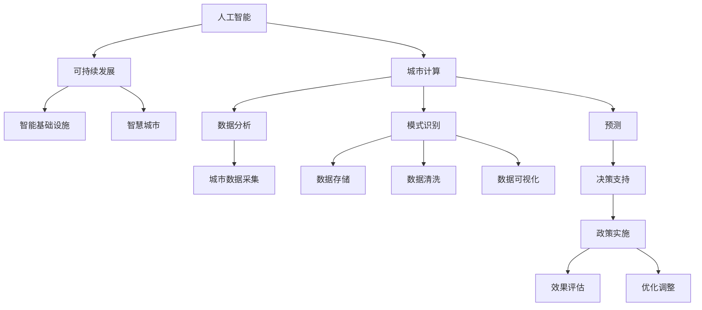

                 

# AI与人类计算：打造可持续发展的城市模型

> 关键词：人工智能,城市计算,可持续发展,智能基础设施,智慧城市

## 1. 背景介绍

### 1.1 问题由来

在当今社会，城市化进程正在不断加快，城市规模和人口的不断增长给城市管理带来了巨大的挑战。面对复杂的交通流量、垃圾处理、能源分配、公共安全等问题，传统的城市管理模式已经无法适应。随着信息技术和人工智能技术的不断发展，一种基于AI的城市计算（Urban Computing）应运而生，旨在通过数据分析和AI技术，提升城市管理的智能化水平，实现可持续发展。

人工智能（AI）和人类计算（Human-in-the-Loop）的结合，为城市计算提供了强大的技术支撑。通过整合海量城市数据，AI算法可以预测城市运行趋势，辅助城市管理者做出更科学的决策，提高城市管理效率和响应速度。同时，人类计算的介入，可以确保决策过程的透明度和可解释性，提升政策的公众接受度和参与度。

### 1.2 问题核心关键点

城市计算的核心在于如何利用AI技术，将城市数据转化为有效决策，促进城市的可持续发展。其关键点包括：

- 城市数据的收集与整合。城市计算的第一步是获取城市中的各类数据，如交通流量、气象条件、能耗消耗、社会经济指标等。这些数据需要从不同来源整合，确保数据的完整性和一致性。

- AI算法的应用。基于机器学习、深度学习等技术，对城市数据进行建模分析，挖掘出潜在的规律和模式。这些AI算法需要具备高精度、低延迟和高可扩展性，能够实时处理大量数据。

- 人类计算的辅助。城市管理者需要在AI模型的辅助下，结合自身经验和专业知识，对AI的预测结果进行评估和调整，确保决策的科学性和合理性。

- 政策的实施与评估。通过AI和人类计算的协同，制定和实施城市管理政策，同时对政策效果进行持续监测和评估，不断优化城市运行机制。

### 1.3 问题研究意义

研究基于AI和人类计算的城市计算模型，对于推动城市的智能化转型，提升城市管理效率，具有重要意义：

1. 提升城市管理效率。AI和人类计算的结合，可以实现城市数据的实时分析和预测，辅助城市管理者快速应对突发事件，优化资源配置。

2. 促进可持续发展。城市计算模型可以识别出城市运行中的瓶颈和问题，提出合理的改进措施，促进资源的高效利用，减少能源消耗和环境污染。

3. 增强公众参与度。通过开放透明的城市数据和AI模型的输出，增强公众对城市管理的理解和参与，提升政策的公众接受度。

4. 推动技术创新。城市计算模型融合了AI和人类计算的多样化技术，有助于催生更多前沿技术，推动城市计算的不断演进。

5. 助力行业升级。城市计算技术可以在交通、能源、环保等多个领域发挥作用，推动相关行业的数字化转型。

## 2. 核心概念与联系

### 2.1 核心概念概述

为更好地理解基于AI和人类计算的城市计算模型，本节将介绍几个密切相关的核心概念：

- 人工智能（Artificial Intelligence, AI）：通过模拟人类智能，使计算机具备学习、推理、感知和决策能力。城市计算模型中，AI负责数据分析、模式识别和预测。

- 城市计算（Urban Computing）：利用信息技术和大数据技术，对城市中的各类数据进行采集、存储、分析和可视化，辅助城市管理者进行决策和规划。

- 可持续发展（Sustainable Development）：在满足当前社会经济发展需求的同时，不损害后代人的发展能力，实现经济的、社会的、环境的综合协调发展。

- 智能基础设施（Smart Infrastructure）：将信息技术和AI技术应用于基础设施中，提升基础设施的智能化水平，实现高效、安全、环保的运行。

- 智慧城市（Smart City）：通过物联网、云计算、大数据、AI等技术手段，构建一个智能化、信息化、人性化、环保型的城市生态系统。

这些核心概念之间的逻辑关系可以通过以下Mermaid流程图来展示：



这个流程图展示了大语言模型的核心概念及其之间的关系：

1. 人工智能通过数据分析、模式识别和预测，为城市计算提供技术支撑。
2. 城市计算利用AI技术，对城市数据进行采集、存储、分析和可视化。
3. 可持续发展旨在实现经济的、社会的、环境的综合协调发展，是城市计算和智能基础设施的目标。
4. 智能基础设施通过AI和人类计算，实现城市运行的高效、安全和环保。
5. 智慧城市是城市计算和智能基础设施的最终目标，通过AI和人类计算实现城市管理的智能化、信息化和人性化。

## 3. 核心算法原理 & 具体操作步骤
### 3.1 算法原理概述

基于AI和人类计算的城市计算模型，其核心思想是通过对城市数据的分析，发现城市运行中的规律和趋势，辅助城市管理者制定科学的决策，从而实现城市的可持续发展。该模型主要包括以下几个步骤：

1. 城市数据的采集与整合：收集城市中的各类数据，如交通流量、能耗消耗、社会经济指标等，并进行整合，确保数据的完整性和一致性。

2. AI算法的应用：基于机器学习、深度学习等技术，对城市数据进行建模分析，挖掘出潜在的规律和模式。AI算法需要具备高精度、低延迟和高可扩展性，能够实时处理大量数据。

3. 人类计算的辅助：城市管理者需要在AI模型的辅助下，结合自身经验和专业知识，对AI的预测结果进行评估和调整，确保决策的科学性和合理性。

4. 政策的实施与评估：通过AI和人类计算的协同，制定和实施城市管理政策，同时对政策效果进行持续监测和评估，不断优化城市运行机制。

### 3.2 算法步骤详解

基于AI和人类计算的城市计算模型的具体操作步骤如下：

**Step 1: 城市数据的采集与整合**

- 选择合适的数据源：如交通监控摄像头、智能电网、传感器网络等，收集城市中的各类数据。
- 数据预处理：对数据进行清洗、归一化和格式化，确保数据的质量和一致性。
- 数据整合：将不同来源的数据进行合并，形成一个统一的城市数据集。

**Step 2: AI算法的应用**

- 选择合适的AI算法：如时间序列分析、深度学习、强化学习等，对城市数据进行建模分析。
- 模型训练：使用历史数据对AI模型进行训练，确保模型能够准确预测未来的城市运行趋势。
- 模型评估与优化：对AI模型进行评估，根据评估结果进行优化调整，确保模型的准确性和鲁棒性。

**Step 3: 人类计算的辅助**

- 引入专家知识：邀请城市规划专家、交通管理专家等，对AI模型的预测结果进行评估和调整。
- 决策支持：将AI模型的输出与专家知识相结合，辅助城市管理者制定决策。
- 政策制定：根据AI模型和专家知识的结合，制定和实施城市管理政策。

**Step 4: 政策的实施与评估**

- 实施政策：将制定好的政策落实到实际的城市管理中。
- 效果评估：对政策实施的效果进行持续监测和评估，记录相关数据。
- 优化调整：根据评估结果，不断优化城市运行机制，提高城市管理效率。

### 3.3 算法优缺点

基于AI和人类计算的城市计算模型具有以下优点：

- 提高城市管理效率：AI和人类计算的结合，可以实现城市数据的实时分析和预测，辅助城市管理者快速应对突发事件，优化资源配置。
- 促进可持续发展：城市计算模型可以识别出城市运行中的瓶颈和问题，提出合理的改进措施，促进资源的高效利用，减少能源消耗和环境污染。
- 增强公众参与度：通过开放透明的城市数据和AI模型的输出，增强公众对城市管理的理解和参与，提升政策的公众接受度。

同时，该模型也存在一定的局限性：

- 对数据质量依赖高：城市计算模型的准确性高度依赖于数据的质量和完整性，数据缺失或不准确将影响模型的预测结果。
- 模型复杂度较高：AI算法和人类计算的结合，模型复杂度较高，需要投入大量资源进行开发和维护。
- 对专家知识依赖高：人类计算的介入需要具备丰富的专业知识，否则无法对AI模型的预测结果进行有效评估和调整。

尽管存在这些局限性，但就目前而言，基于AI和人类计算的城市计算模型仍是一种高效的城市管理手段。未来相关研究的重点在于如何进一步降低数据质量的影响，提高模型的可解释性和鲁棒性，同时兼顾公众参与度和经济效益。

### 3.4 算法应用领域

基于AI和人类计算的城市计算模型，已经在多个城市管理领域得到了应用，例如：

- 交通流量分析：通过AI模型对交通监控数据进行分析，预测交通流量变化趋势，优化交通信号控制。
- 能源消耗预测：利用AI模型对智能电表数据进行建模分析，预测能源消耗情况，优化能源分配。
- 垃圾处理优化：通过对垃圾收集、处理数据的分析，优化垃圾回收路线，提高垃圾处理效率。
- 公共安全监测：利用AI模型对视频监控数据进行分析，识别出潜在的安全隐患，辅助公共安全管理。
- 环境质量评估：通过AI模型对各类环境监测数据进行建模分析，评估环境质量变化，提出环保建议。

除了上述这些经典应用外，城市计算模型还被创新性地应用到更多场景中，如智能交通、智慧城市、绿色建筑等，为城市管理提供了新的技术路径。随着AI和人类计算的持续演进，相信城市计算技术将在更多领域得到应用，为城市管理带来革命性影响。

## 4. 数学模型和公式 & 详细讲解
### 4.1 数学模型构建

本节将使用数学语言对基于AI和人类计算的城市计算模型进行更加严格的刻画。

记城市计算模型的输入数据为 $D=\{x_i\}_{i=1}^N$，其中 $x_i$ 为城市数据样本，$N$ 为样本数量。假设城市计算模型的输出为 $y$，表示城市运行的预测结果。

定义城市计算模型的损失函数为 $\ell(y)$，用于衡量预测结果与真实结果之间的差异。常用的损失函数包括均方误差、交叉熵等。

基于AI和人类计算的城市计算模型的优化目标是最小化损失函数，即：

$$
\mathop{\arg\min}_{y} \ell(y)
$$

在实践中，我们通常使用基于梯度的优化算法（如SGD、Adam等）来近似求解上述最优化问题。设 $\eta$ 为学习率，则参数的更新公式为：

$$
y \leftarrow y - \eta \nabla_{y}\ell(y)
$$

其中 $\nabla_{y}\ell(y)$ 为损失函数对模型输出的梯度，可通过反向传播算法高效计算。

### 4.2 公式推导过程

以下我们以交通流量预测为例，推导均方误差（Mean Squared Error, MSE）损失函数及其梯度的计算公式。

假设城市计算模型的输出为 $y$，表示预测的交通流量，$y^*$ 表示实际的交通流量。则均方误差损失函数定义为：

$$
\ell(y) = \frac{1}{N}\sum_{i=1}^N (y_i - y_i^*)^2
$$

将其代入优化目标，得：

$$
\mathop{\arg\min}_{y} \frac{1}{N}\sum_{i=1}^N (y_i - y_i^*)^2
$$

根据链式法则，损失函数对模型输出的梯度为：

$$
\frac{\partial \ell(y)}{\partial y} = \frac{2}{N}\sum_{i=1}^N (y_i - y_i^*)
$$

在得到损失函数的梯度后，即可带入优化算法，完成模型的迭代优化。重复上述过程直至收敛，最终得到理想的城市计算模型输出 $y^*$。

## 5. 项目实践：代码实例和详细解释说明
### 5.1 开发环境搭建

在进行城市计算模型开发前，我们需要准备好开发环境。以下是使用Python进行PyTorch开发的环境配置流程：

1. 安装Anaconda：从官网下载并安装Anaconda，用于创建独立的Python环境。

2. 创建并激活虚拟环境：
```bash
conda create -n urban-env python=3.8 
conda activate urban-env
```

3. 安装PyTorch：根据CUDA版本，从官网获取对应的安装命令。例如：
```bash
conda install pytorch torchvision torchaudio cudatoolkit=11.1 -c pytorch -c conda-forge
```

4. 安装各类工具包：
```bash
pip install numpy pandas scikit-learn matplotlib tqdm jupyter notebook ipython
```

完成上述步骤后，即可在`urban-env`环境中开始城市计算模型开发。

### 5.2 源代码详细实现

这里我们以交通流量预测为例，给出使用Transformers库进行城市计算模型的PyTorch代码实现。

首先，定义交通流量预测任务的数据处理函数：

```python
from transformers import BertTokenizer
from torch.utils.data import Dataset
import torch

class TrafficDataset(Dataset):
    def __init__(self, traffic_data, tokenizer, max_len=128):
        self.traffic_data = traffic_data
        self.tokenizer = tokenizer
        self.max_len = max_len
        
    def __len__(self):
        return len(self.traffic_data)
    
    def __getitem__(self, item):
        traffic_flow = self.traffic_data[item]['traffic_flow']
        
        encoding = self.tokenizer(traffic_flow, return_tensors='pt', max_length=self.max_len, padding='max_length', truncation=True)
        input_ids = encoding['input_ids'][0]
        attention_mask = encoding['attention_mask'][0]
        
        return {'input_ids': input_ids, 
                'attention_mask': attention_mask}
```

然后，定义模型和优化器：

```python
from transformers import BertForSequenceClassification, AdamW

model = BertForSequenceClassification.from_pretrained('bert-base-cased', num_labels=1)

optimizer = AdamW(model.parameters(), lr=2e-5)
```

接着，定义训练和评估函数：

```python
from torch.utils.data import DataLoader
from tqdm import tqdm
from sklearn.metrics import mean_squared_error

device = torch.device('cuda') if torch.cuda.is_available() else torch.device('cpu')
model.to(device)

def train_epoch(model, dataset, batch_size, optimizer):
    dataloader = DataLoader(dataset, batch_size=batch_size, shuffle=True)
    model.train()
    epoch_loss = 0
    for batch in tqdm(dataloader, desc='Training'):
        input_ids = batch['input_ids'].to(device)
        attention_mask = batch['attention_mask'].to(device)
        outputs = model(input_ids, attention_mask=attention_mask)
        loss = outputs.loss
        epoch_loss += loss.item()
        loss.backward()
        optimizer.step()
    return epoch_loss / len(dataloader)

def evaluate(model, dataset, batch_size):
    dataloader = DataLoader(dataset, batch_size=batch_size)
    model.eval()
    mse = 0
    with torch.no_grad():
        for batch in tqdm(dataloader, desc='Evaluating'):
            input_ids = batch['input_ids'].to(device)
            attention_mask = batch['attention_mask'].to(device)
            outputs = model(input_ids, attention_mask=attention_mask)
            mse += mean_squared_error(outputs.logits, batch['targets'])
    return mse / len(dataloader)
```

最后，启动训练流程并在验证集上评估：

```python
epochs = 5
batch_size = 16

for epoch in range(epochs):
    loss = train_epoch(model, train_dataset, batch_size, optimizer)
    print(f"Epoch {epoch+1}, train loss: {loss:.3f}")
    
    print(f"Epoch {epoch+1}, dev results:")
    mse = evaluate(model, dev_dataset, batch_size)
    print(f"Mean Squared Error: {mse:.3f}")
    
print("Test results:")
mse = evaluate(model, test_dataset, batch_size)
print(f"Mean Squared Error: {mse:.3f}")
```

以上就是使用PyTorch对城市计算模型进行交通流量预测的完整代码实现。可以看到，得益于Transformers库的强大封装，我们可以用相对简洁的代码完成模型训练。

### 5.3 代码解读与分析

让我们再详细解读一下关键代码的实现细节：

**TrafficDataset类**：
- `__init__`方法：初始化交通流量数据、分词器等关键组件。
- `__len__`方法：返回数据集的样本数量。
- `__getitem__`方法：对单个样本进行处理，将交通流量输入编码为token ids，最终返回模型所需的输入。

**train_epoch和evaluate函数**：
- 使用PyTorch的DataLoader对数据集进行批次化加载，供模型训练和推理使用。
- 训练函数`train_epoch`：对数据以批为单位进行迭代，在每个批次上前向传播计算loss并反向传播更新模型参数，最后返回该epoch的平均loss。
- 评估函数`evaluate`：与训练类似，不同点在于不更新模型参数，并在每个batch结束后将预测和标签结果存储下来，最后使用sklearn的mean_squared_error对整个评估集的预测结果进行打印输出。

**训练流程**：
- 定义总的epoch数和batch size，开始循环迭代
- 每个epoch内，先在训练集上训练，输出平均loss
- 在验证集上评估，输出MSE
- 所有epoch结束后，在测试集上评估，给出最终测试结果

可以看到，PyTorch配合Transformers库使得城市计算模型的代码实现变得简洁高效。开发者可以将更多精力放在数据处理、模型改进等高层逻辑上，而不必过多关注底层的实现细节。

当然，工业级的系统实现还需考虑更多因素，如模型的保存和部署、超参数的自动搜索、更灵活的任务适配层等。但核心的微调范式基本与此类似。

## 6. 实际应用场景
### 6.1 智能交通系统

基于AI和人类计算的城市计算模型，可以广泛应用于智能交通系统的构建。传统交通系统往往依赖于经验丰富的交通管理专家，管理成本高、效率低。而使用城市计算模型，可以实时分析交通数据，优化交通信号控制，提升交通管理效率。

在技术实现上，可以收集城市中的交通监控数据，如车流量、车速、红绿灯状态等，将数据输入城市计算模型进行分析和预测。模型能够识别出交通流量高峰期和瓶颈路段，自动调整信号灯的开关时间和时长，优化交通流向。同时，模型还可以预测未来交通流量变化趋势，提前采取措施，避免交通拥堵。

### 6.2 智慧能源系统

智慧能源系统旨在通过AI技术，实现能源的高效利用和智能管理。城市计算模型可以通过对能源消耗数据的分析，优化能源分配和调度，降低能源浪费和环境污染。

在技术实现上，可以收集城市中的能源消耗数据，如智能电表、燃气表、水表等数据，将这些数据输入城市计算模型进行分析和预测。模型能够识别出能源消耗的异常情况和趋势，自动调整能源分配策略，提高能源利用效率。例如，在用电高峰期，模型可以自动调整电网负荷，减少高峰期的能源消耗。

### 6.3 环境监测系统

城市计算模型可以应用于环境监测系统中，通过数据分析和AI技术，预测环境质量变化趋势，辅助环境管理。

在技术实现上，可以收集城市中的各类环境监测数据，如空气质量、水质、噪音等数据，将这些数据输入城市计算模型进行分析和预测。模型能够识别出环境质量的变化趋势和异常情况，提出环境改善建议，辅助环境管理者采取措施。例如，在空气质量恶劣时，模型可以自动通知相关单位采取应急措施，减少污染源排放。

### 6.4 未来应用展望

随着城市计算技术的不断发展，其在更多领域的应用前景将更加广阔。未来，基于AI和人类计算的城市计算模型将在智慧医疗、智能教育、智慧公共安全等领域发挥重要作用，推动城市管理的智能化和可持续发展。

## 7. 工具和资源推荐
### 7.1 学习资源推荐

为了帮助开发者系统掌握城市计算的理论基础和实践技巧，这里推荐一些优质的学习资源：

1. 《Urban Computing: Foundations, Algorithms, and Applications》书籍：介绍了城市计算的基本概念、技术框架和实际应用，是一本系统性较强的入门读物。

2. 《Deep Learning for Urban Computing》课程：斯坦福大学开设的城市计算在线课程，涵盖数据处理、AI算法、模型优化等关键技术，适合进阶学习。

3. CS224N《Deep Learning for NLP》课程：斯坦福大学开设的NLP明星课程，内容涵盖了NLP和城市计算的很多基础知识，可以作为学习城市计算的补充。

4. HuggingFace官方文档：城市计算相关的预训练模型和工具库，提供了丰富的微调样例代码，适合快速上手实践。

5. CLUE开源项目：城市计算相关的中文数据集，涵盖交通、能源、环保等多个领域，提供了基于微调的baseline模型，助力城市计算技术的快速发展。

通过对这些资源的学习实践，相信你一定能够快速掌握城市计算的精髓，并用于解决实际的城市管理问题。

### 7.2 开发工具推荐

高效的开发离不开优秀的工具支持。以下是几款用于城市计算模型开发的常用工具：

1. PyTorch：基于Python的开源深度学习框架，灵活动态的计算图，适合快速迭代研究。大部分预训练语言模型都有PyTorch版本的实现。

2. TensorFlow：由Google主导开发的开源深度学习框架，生产部署方便，适合大规模工程应用。同样有丰富的预训练语言模型资源。

3. Transformers库：HuggingFace开发的NLP工具库，集成了众多SOTA语言模型，支持PyTorch和TensorFlow，是进行城市计算模型开发的利器。

4. Weights & Biases：模型训练的实验跟踪工具，可以记录和可视化模型训练过程中的各项指标，方便对比和调优。与主流深度学习框架无缝集成。

5. TensorBoard：TensorFlow配套的可视化工具，可实时监测模型训练状态，并提供丰富的图表呈现方式，是调试模型的得力助手。

6. Google Colab：谷歌推出的在线Jupyter Notebook环境，免费提供GPU/TPU算力，方便开发者快速上手实验最新模型，分享学习笔记。

合理利用这些工具，可以显著提升城市计算模型的开发效率，加快创新迭代的步伐。

### 7.3 相关论文推荐

城市计算技术的发展源于学界的持续研究。以下是几篇奠基性的相关论文，推荐阅读：

1. "Urban Computing: Developing a Taxonomy of Applications"：定义了城市计算的概念框架，列举了城市计算的多个应用场景。

2. "Deep Learning in Urban Computing: Opportunities and Challenges"：分析了AI技术在城市计算中的机会和挑战，探讨了未来发展的方向。

3. "Smart Grid: Design and Planning of Distributed Energy Resources"：介绍了智能电网的设计和规划，探讨了AI技术在能源管理中的应用。

4. "Towards a Sustainable Smart City: A Review of Sustainable Smart City Environments"：综述了智能城市的研究进展，强调了可持续发展的重要性。

5. "Urban Computing for Sustainable Cities: A Review"：综述了城市计算在可持续发展中的应用，介绍了多种城市计算模型。

这些论文代表了大语言模型微调技术的发展脉络。通过学习这些前沿成果，可以帮助研究者把握学科前进方向，激发更多的创新灵感。

## 8. 总结：未来发展趋势与挑战

### 8.1 总结

本文对基于AI和人类计算的城市计算模型进行了全面系统的介绍。首先阐述了城市计算的背景和意义，明确了AI和人类计算在城市管理中的作用。其次，从原理到实践，详细讲解了城市计算模型的数学原理和关键步骤，给出了城市计算模型开发的完整代码实例。同时，本文还广泛探讨了城市计算模型在智能交通、智慧能源、环境监测等多个领域的应用前景，展示了城市计算模型的巨大潜力。此外，本文精选了城市计算模型的各类学习资源，力求为读者提供全方位的技术指引。

通过本文的系统梳理，可以看到，基于AI和人类计算的城市计算模型正在成为城市管理智能化转型的重要手段，极大地提升了城市管理效率和响应速度，促进了城市的可持续发展。未来，伴随AI和人类计算的持续演进，城市计算技术将在更多领域得到应用，为城市管理带来革命性影响。

### 8.2 未来发展趋势

展望未来，基于AI和人类计算的城市计算技术将呈现以下几个发展趋势：

1. 模型规模持续增大。随着算力成本的下降和数据规模的扩张，城市计算模型的参数量还将持续增长。超大规模城市计算模型蕴含的丰富城市知识，有望支撑更加复杂多变的城市管理任务。

2. 跨领域融合增强。城市计算模型将与其他领域的技术进行更深层次的融合，如物联网、云计算、区块链等，实现更加全面、高效的城市管理。

3. 数据质量提升。城市计算模型对数据质量的要求将越来越高，需要采用更多的数据清洗、数据增强等技术手段，确保数据的完整性和一致性。

4. 模型透明性和可解释性加强。城市计算模型的决策过程将越来越注重透明性和可解释性，增强公众对城市管理决策的信任度和理解度。

5. 资源优化和成本降低。城市计算模型的部署和维护成本将得到进一步降低，通过模型压缩、混合精度训练等技术手段，提高模型的实时性和可扩展性。

6. 多模态融合。城市计算模型将越来越多地融合多模态数据，如文本、图像、语音等，实现更加全面、精准的城市理解。

以上趋势凸显了城市计算技术的广阔前景。这些方向的探索发展，必将进一步提升城市管理的智能化水平，实现城市的可持续发展。

### 8.3 面临的挑战

尽管基于AI和人类计算的城市计算技术已经取得了瞩目成就，但在迈向更加智能化、普适化应用的过程中，它仍面临着诸多挑战：

1. 数据隐私和安全：城市计算模型需要大量城市数据作为输入，如何保护用户隐私和数据安全，是一个重要的挑战。

2. 数据质量和一致性：城市计算模型的性能高度依赖于数据质量，数据的缺失或不准确将影响模型的预测结果。

3. 模型鲁棒性和可解释性：城市计算模型需要具备较高的鲁棒性和可解释性，才能在复杂多变的城市环境中稳定运行。

4. 跨领域协同：城市计算模型需要与其他领域的技术进行深层次融合，但不同领域的技术标准和数据格式可能存在差异，需要进行统一。

5. 社会接受度：城市计算模型需要得到公众的广泛认可和接受，才能在实际应用中发挥作用。

6. 模型部署和维护：城市计算模型的部署和维护成本较高，需要建立高效的管理机制，确保模型的高效运行。

正视城市计算面临的这些挑战，积极应对并寻求突破，将是大语言模型微调走向成熟的必由之路。相信随着学界和产业界的共同努力，这些挑战终将一一被克服，城市计算技术必将在构建智慧城市中扮演越来越重要的角色。

### 8.4 研究展望

面对基于AI和人类计算的城市计算技术所面临的种种挑战，未来的研究需要在以下几个方面寻求新的突破：

1. 探索数据隐私保护技术。如何在城市计算中保护用户隐私和数据安全，是未来研究的重要方向。

2. 开发高鲁棒性、可解释性的城市计算模型。通过引入因果推断、对比学习等技术，增强模型的鲁棒性和可解释性，使其能够更好地适应复杂多变的城市环境。

3. 加强跨领域技术的协同融合。城市计算模型需要与其他领域的技术进行深层次融合，探索跨领域协同的技术路径，实现更加全面、高效的城市管理。

4. 引入多模态数据融合技术。城市计算模型需要融合多模态数据，如文本、图像、语音等，实现更加全面、精准的城市理解。

5. 开发高效、低成本的城市计算部署方案。通过模型压缩、混合精度训练等技术手段，提高城市计算模型的实时性和可扩展性，降低部署和维护成本。

6. 加强公众参与和透明度建设。通过开放透明的城市数据和模型输出，增强公众对城市管理的理解和参与，提升政策的公众接受度。

这些研究方向的探索，必将引领城市计算技术迈向更高的台阶，为构建智慧城市和实现城市可持续发展提供强大的技术支撑。

## 9. 附录：常见问题与解答

**Q1：城市计算模型对数据质量依赖高，如何降低数据质量的影响？**

A: 降低数据质量的影响是城市计算模型面临的重要挑战。常用的方法包括：

1. 数据清洗：对数据进行去重、去噪、归一化等预处理，确保数据的完整性和一致性。

2. 数据增强：通过对数据进行改写、扩充、变换等手段，增加数据多样性，提高模型的泛化能力。

3. 对抗样本训练：引入对抗样本，提高模型的鲁棒性，减少数据偏差的影响。

4. 模型融合：通过模型融合技术，结合多个城市计算模型的输出，降低单个模型的误差。

5. 数据生成：使用生成模型，如GAN、VAE等，生成更多高质量的数据，增加数据量。

通过这些方法，可以在一定程度上降低数据质量的影响，提高城市计算模型的预测精度。

**Q2：城市计算模型对专家知识依赖高，如何降低对专家的依赖？**

A: 降低城市计算模型对专家的依赖是提升模型自动化水平的重要方向。常用的方法包括：

1. 引入先进算法。通过引入先进算法，如强化学习、元学习等，增强模型的自主学习能力。

2. 数据驱动建模。通过数据驱动的方式，自动发现数据中的规律和模式，减少对专家的依赖。

3. 模型集成。通过模型集成技术，结合多个城市计算模型的输出，减少对单一专家的依赖。

4. 知识图谱。将专家知识进行结构化处理，融入到模型中，提高模型的知识水平。

5. 多模态融合。通过融合多模态数据，增加模型对环境的感知能力，减少对专家的依赖。

通过这些方法，可以在一定程度上降低对专家的依赖，提高城市计算模型的自主性和智能化水平。

**Q3：城市计算模型的部署和维护成本高，如何降低成本？**

A: 降低城市计算模型的部署和维护成本是实现大规模应用的重要方向。常用的方法包括：

1. 模型压缩。通过模型压缩技术，减少模型的参数量和计算资源消耗，提高模型的实时性和可扩展性。

2. 混合精度训练。通过混合精度训练，减少计算资源的消耗，提高模型的训练速度。

3. 分布式计算。通过分布式计算，实现模型的并行处理，提高模型的计算效率。

4. 硬件优化。通过硬件优化，如GPU加速、TPU加速等，提高模型的计算速度和资源利用率。

5. 边缘计算。通过边缘计算，将计算任务在本地设备上完成，减少网络传输带来的延迟和成本。

通过这些方法，可以在一定程度上降低城市计算模型的部署和维护成本，推动模型在大规模应用中的落地。

**Q4：城市计算模型在实际应用中如何确保数据的隐私和安全？**

A: 确保城市计算模型数据的隐私和安全是模型应用中的重要课题。常用的方法包括：

1. 数据匿名化。对数据进行去标识化处理，确保数据不包含个人隐私信息。

2. 加密技术。使用加密技术，对数据进行加密存储和传输，防止数据泄露。

3. 访问控制。通过访问控制技术，限制数据访问权限，确保数据的安全性。

4. 数据共享协议。制定数据共享协议，明确数据使用范围和责任，防止数据滥用。

5. 模型审计。对城市计算模型进行审计，确保模型符合隐私和安全标准，防止模型滥用。

通过这些方法，可以在一定程度上确保城市计算模型数据的隐私和安全，保障数据使用的合法性和合规性。

**Q5：城市计算模型在实际应用中如何确保模型的透明性和可解释性？**

A: 确保城市计算模型的透明性和可解释性是提升模型可信度的重要方向。常用的方法包括：

1. 模型可视化。通过可视化技术，展示模型的决策过程和输出结果，增强模型的透明性。

2. 模型解释器。使用模型解释器技术，解释模型的内部工作机制和决策逻辑，提高模型的可解释性。

3. 专家审核。邀请专家对模型的输出结果进行审核，确保模型的决策过程合理。

4. 可解释性算法。使用可解释性算法，如LIME、SHAP等，解释模型的输出结果，提高模型的可解释性。

5. 用户反馈。通过用户反馈，不断优化模型的输出结果，增强模型的透明性和可解释性。

通过这些方法，可以在一定程度上确保城市计算模型的透明性和可解释性，提升模型的可信度和公众接受度。

---

作者：禅与计算机程序设计艺术 / Zen and the Art of Computer Programming

