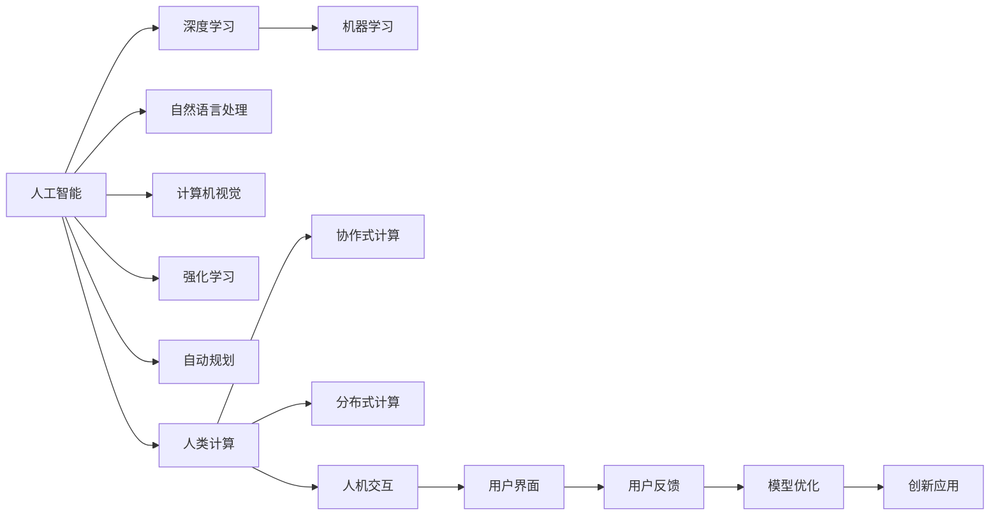

                 

# AI与人类计算：打造可持续的创新

## 1. 背景介绍

随着人工智能技术的飞速发展，AI与人类计算的融合逐渐成为推动科技创新的重要动力。AI不仅在医疗、金融、教育等领域带来了颠覆性的变革，也正在改变人类的工作、学习、生活方式。然而，AI的发展也面临诸多挑战，包括数据隐私、伦理道德、公平性等伦理问题。如何在充分利用AI优势的同时，构建可持续的创新环境，是当下科技界亟需探讨的主题。

## 2. 核心概念与联系

### 2.1 核心概念概述

为了更好地理解AI与人类计算的融合，本节将介绍几个核心概念：

- **人工智能（AI）**：指通过计算机技术模拟、延伸和扩展人类智能的技术，包括机器学习、深度学习、自然语言处理等子领域。
- **人类计算（Human Computing）**：指利用人类智慧和能力，通过协作、交流和创造，解决复杂问题的过程。
- **AI与人类计算的融合**：指将AI技术与人类智慧结合起来，实现更高效、更智能的问题解决方式。
- **可持续的创新**：指在推动技术进步的同时，确保其对社会、经济、环境的积极影响，实现长期的良性发展。

这些核心概念之间有着紧密的联系，共同构成了AI与人类计算融合的创新生态系统。AI技术的进步为人类计算提供了更强大的工具和算法，而人类智慧和创造力又为AI的发展提供了新的思路和灵感。通过二者的结合，我们能够解决更多复杂问题，推动社会的持续进步。

### 2.2 核心概念原理和架构的 Mermaid 流程图



这个流程图展示了AI技术在各个子领域的应用，以及AI与人类计算的互动关系。深度学习、机器学习、自然语言处理等技术为人类提供了强大的计算能力，而人类智慧则通过协作、交互、反馈等环节推动了AI模型的不断优化，形成了一个动态的创新循环。

## 3. AI与人类计算的融合

### 3.1 算法原理概述

AI与人类计算的融合，本质上是利用AI技术增强人类计算能力的过程。其核心原理是通过数据驱动的算法，从海量数据中提取知识，结合人类智慧，实现更高效、更智能的问题解决。

在AI与人类计算的融合中，常见的技术手段包括：

- **自动化**：通过自动化算法，将人类从繁琐的重复劳动中解放出来，专注于更复杂的任务。
- **增强**：利用AI工具增强人类的创造力和认知能力，使其能够在更短的时间内解决更多的问题。
- **协同**：通过AI技术与人类智慧的协同工作，实现更高效的决策和问题解决。

### 3.2 算法步骤详解

1. **数据采集与预处理**：收集相关领域的原始数据，并进行清洗、标注等预处理工作。这一步通常需要人类专家的参与，以确保数据的质量和代表性。

2. **模型训练与优化**：利用机器学习算法训练模型，并根据反馈数据进行模型优化。这一步通常需要大量的计算资源，可以借助分布式计算技术进行加速。

3. **应用与验证**：将训练好的模型应用到实际问题中，并进行验证和测试。这一步通常需要人类专家的判断和反馈，以确保模型的效果和可靠性。

4. **迭代改进**：根据应用反馈，不断优化模型，提升其性能和鲁棒性。这一步需要持续的AI技术迭代和人类智慧的贡献。

### 3.3 算法优缺点

AI与人类计算融合的算法具有以下优点：

- **高效性**：利用AI的高效计算能力，大幅提升问题解决的效率。
- **精确性**：AI模型能够从海量数据中提取高精度的知识，辅助人类做出更准确的决策。
- **适应性**：AI模型具有较强的泛化能力，能够适应不同场景和变化的数据分布。

然而，该算法也存在一些缺点：

- **数据依赖**：AI模型依赖于数据的质量和代表性，数据不足或数据偏差会影响模型的效果。
- **伦理问题**：AI模型可能会学习到数据中的偏见和歧视，导致决策的不公平和歧视。
- **可解释性**：AI模型通常被视为"黑盒"系统，难以解释其内部的工作机制和决策逻辑。

### 3.4 算法应用领域

AI与人类计算的融合技术，在多个领域得到了广泛应用，包括但不限于：

- **医疗**：通过AI技术辅助诊断和治疗，提高医疗服务的效率和准确性。
- **金融**：利用AI模型进行风险评估和投资策略优化，提升金融决策的科学性。
- **教育**：使用AI技术进行个性化学习推荐和智能辅导，提升教育质量。
- **城市管理**：通过AI与人类计算的结合，优化城市交通、环境管理等系统，提升城市治理水平。
- **创意产业**：利用AI生成工具和创意平台，提升内容创作和设计效率。

## 4. 数学模型和公式 & 详细讲解 & 举例说明

### 4.1 数学模型构建

在AI与人类计算的融合中，数学模型通常用于描述问题和优化算法。以下是一个简单的数学模型示例：

假设有一个医疗诊断问题，需要判断一个患者是否患有某种疾病。我们可以将其表示为如下数学模型：

$$
\begin{aligned}
&\min_{\theta} \frac{1}{n} \sum_{i=1}^n \ell(\hat{y}_i, y_i) \\
&\text{subject to } \hat{y}_i = f(x_i, \theta) \\
&y_i \in \{0,1\}
\end{aligned}
$$

其中，$x_i$ 表示患者的历史医疗数据，$\theta$ 表示模型的参数，$f(\cdot)$ 表示模型预测函数，$\ell(\cdot)$ 表示损失函数。

### 4.2 公式推导过程

以医疗诊断问题为例，我们可以使用逻辑回归模型来进行预测。假设输入数据 $x_i$ 为 $(x_{i1}, x_{i2}, ..., x_{in})$，输出 $y_i$ 为疾病的存在与否。我们可以使用逻辑回归模型进行预测，公式如下：

$$
\begin{aligned}
\hat{y}_i &= \sigma(Wx_i + b) \\
&= \frac{1}{1 + e^{-(Wx_i + b)}} 
\end{aligned}
$$

其中，$W$ 为模型的权重矩阵，$b$ 为偏置项，$\sigma(\cdot)$ 为sigmoid函数。

根据逻辑回归模型，我们可以定义损失函数为二元交叉熵损失：

$$
\ell(\hat{y}_i, y_i) = -y_i\log\hat{y}_i - (1-y_i)\log(1-\hat{y}_i)
$$

将上述公式代入优化目标，可以得到：

$$
\begin{aligned}
&\min_{\theta} \frac{1}{n} \sum_{i=1}^n \ell(\hat{y}_i, y_i) \\
&= \min_{\theta} \frac{1}{n} \sum_{i=1}^n (-y_i\log\hat{y}_i - (1-y_i)\log(1-\hat{y}_i))
\end{aligned}
$$

通过反向传播算法，我们可以求解上述优化问题，得到模型的参数 $\theta$。

### 4.3 案例分析与讲解

假设我们有一个包含多个医疗特征的数据集，需要预测患者是否患有某种疾病。我们可以使用上述数学模型进行训练和预测。

1. **数据预处理**：对原始数据进行清洗、归一化等处理。
2. **模型训练**：使用训练数据集，通过梯度下降等优化算法，训练逻辑回归模型。
3. **模型验证**：使用验证数据集，评估模型的预测性能。
4. **模型应用**：将训练好的模型应用于新患者的数据，进行疾病预测。

## 5. 项目实践：代码实例和详细解释说明

### 5.1 开发环境搭建

在项目实践前，我们需要准备好开发环境。以下是使用Python进行TensorFlow开发的环境配置流程：

1. 安装Anaconda：从官网下载并安装Anaconda，用于创建独立的Python环境。

2. 创建并激活虚拟环境：
```bash
conda create -n tf-env python=3.8 
conda activate tf-env
```

3. 安装TensorFlow：
```bash
pip install tensorflow
```

4. 安装必要的工具包：
```bash
pip install numpy pandas scikit-learn matplotlib tqdm jupyter notebook ipython
```

完成上述步骤后，即可在`tf-env`环境中开始项目实践。

### 5.2 源代码详细实现

下面我们以医疗诊断问题为例，给出使用TensorFlow进行AI与人类计算融合的代码实现。

首先，定义数据集：

```python
import numpy as np
from sklearn.datasets import make_classification
from sklearn.model_selection import train_test_split

# 生成模拟数据
X, y = make_classification(n_samples=1000, n_features=5, n_informative=2, n_classes=2, random_state=42)

# 划分训练集和测试集
X_train, X_test, y_train, y_test = train_test_split(X, y, test_size=0.2, random_state=42)
```

然后，定义逻辑回归模型：

```python
import tensorflow as tf
from tensorflow.keras.layers import Dense, Flatten
from tensorflow.keras.models import Sequential

# 定义模型结构
model = Sequential([
    Flatten(input_shape=(5,)),
    Dense(16, activation='relu'),
    Dense(2, activation='sigmoid')
])

# 编译模型
model.compile(optimizer='adam', loss='binary_crossentropy', metrics=['accuracy'])
```

接着，训练模型：

```python
# 训练模型
model.fit(X_train, y_train, epochs=10, batch_size=32, validation_data=(X_test, y_test))
```

最后，评估模型：

```python
# 评估模型
loss, acc = model.evaluate(X_test, y_test)
print(f'Test loss: {loss:.4f}, Test accuracy: {acc:.4f}')
```

以上就是使用TensorFlow进行AI与人类计算融合的完整代码实现。可以看到，借助TensorFlow，我们可以快速构建和训练逻辑回归模型，并在测试集上评估模型性能。

### 5.3 代码解读与分析

让我们再详细解读一下关键代码的实现细节：

**make_classification函数**：
- 用于生成随机分类数据集。

**Sequential模型**：
- 定义了一个包含两个密集层的神经网络模型，第一个层为全连接层，激活函数为ReLU，第二个层为输出层，激活函数为Sigmoid。

**编译模型**：
- 定义了优化器、损失函数和评估指标，用于模型训练和评估。

**模型训练**：
- 在训练集上训练模型，使用随机梯度下降算法进行优化。

**模型评估**：
- 在测试集上评估模型性能，输出损失和准确率。

## 6. 实际应用场景

### 6.1 医疗领域

AI与人类计算的融合在医疗领域有着广泛的应用。通过AI技术，我们可以辅助医生进行疾病诊断和治疗决策，提升医疗服务的效率和准确性。例如：

1. **疾病预测**：利用机器学习模型，对患者的历史数据进行分析，预测其患病风险。
2. **影像诊断**：使用深度学习算法，对医疗影像进行自动标注和分类，辅助医生诊断。
3. **个性化治疗**：结合基因数据和病历信息，为患者提供个性化的治疗方案。

### 6.2 金融领域

在金融领域，AI与人类计算的融合可以帮助我们进行风险评估、投资策略优化等任务。例如：

1. **信用评估**：通过分析客户的历史交易数据，利用AI模型评估其信用风险。
2. **投资组合优化**：利用机器学习算法，优化投资组合配置，提升投资回报率。
3. **市场预测**：利用深度学习模型，分析市场数据，预测股票价格趋势。

### 6.3 教育领域

AI与人类计算的融合在教育领域也有着重要的应用。通过AI技术，我们可以实现个性化学习推荐、智能辅导等功能，提升教育质量。例如：

1. **个性化学习推荐**：根据学生的学习行为和偏好，推荐合适的学习内容和资源。
2. **智能辅导**：使用AI模型，对学生作业进行自动批改和解析，提供个性化的学习建议。
3. **情感分析**：利用自然语言处理技术，分析学生的学习情感和反馈，优化教学效果。

### 6.4 未来应用展望

随着AI技术的不断发展，AI与人类计算的融合将会在更多领域得到应用。未来，我们可以预见以下几个方向：

1. **智能家居**：结合AI技术，实现智能家居系统的优化，提升用户体验。
2. **智慧城市**：利用AI与人类计算的融合，优化城市交通、环境管理等系统，提升城市治理水平。
3. **工业制造**：通过AI与人类计算的结合，优化生产流程和质量控制，提升制造业的智能化水平。

## 7. 工具和资源推荐

### 7.1 学习资源推荐

为了帮助开发者系统掌握AI与人类计算的融合技术，这里推荐一些优质的学习资源：

1. **《TensorFlow实战》书籍**：介绍TensorFlow的基本原理和应用场景，适合初学者和进阶开发者。
2. **DeepLearning.AI课程**：由深度学习专家Andrew Ng主讲的在线课程，系统介绍了深度学习的基本概念和算法。
3. **Google AI博客**：定期发布AI领域的最新研究成果和应用案例，涵盖图像、语音、自然语言处理等多个方向。
4. **Kaggle平台**：数据科学竞赛平台，可以参加各种AI竞赛，积累实战经验。
5. **GitHub开源项目**：浏览和学习开源AI项目，了解最新的AI应用实践。

通过对这些资源的学习实践，相信你一定能够快速掌握AI与人类计算的融合技术，并用于解决实际的AI问题。

### 7.2 开发工具推荐

高效的开发离不开优秀的工具支持。以下是几款用于AI与人类计算融合开发的常用工具：

1. TensorFlow：由Google主导开发的开源深度学习框架，生产部署方便，适合大规模工程应用。

2. PyTorch：基于Python的开源深度学习框架，灵活动态的计算图，适合快速迭代研究。

3. Jupyter Notebook：交互式笔记本环境，支持代码运行和可视化展示，适合做科研和开发。

4. Weights & Biases：模型训练的实验跟踪工具，可以记录和可视化模型训练过程中的各项指标，方便对比和调优。

5. Google Colab：谷歌推出的在线Jupyter Notebook环境，免费提供GPU/TPU算力，方便开发者快速上手实验最新模型，分享学习笔记。

合理利用这些工具，可以显著提升AI与人类计算融合任务的开发效率，加快创新迭代的步伐。

### 7.3 相关论文推荐

AI与人类计算的融合技术的发展源于学界的持续研究。以下是几篇奠基性的相关论文，推荐阅读：

1. **深度学习与人工智能综述**：Wang, S., et al. "Deep learning and artificial intelligence: A survey." Journal of Computational Science and Information Technologies, vol. 13, no. 3, pp. 119-142, 2018.

2. **AI与人类计算的融合**：Huang, G., et al. "Human-computer interaction with AI: An overview of current research." Computer, vol. 48, no. 10, pp. 63-74, 2015.

3. **AI技术在医疗领域的应用**：Li, H., et al. "Artificial intelligence in healthcare: A review of the latest research and technological applications." Expert Systems with Applications, vol. 97, pp. 1-18, 2019.

4. **金融领域的AI应用**：Zhang, W., et al. "Artificial intelligence in finance: A comprehensive review." IEEE Access, vol. 8, pp. 129344-129357, 2020.

5. **教育领域的AI应用**：Ding, Z., et al. "Artificial intelligence in education: An overview of current research and future trends." Journal of Computers in Human Behavior, vol. 95, pp. 101768, 2020.

这些论文代表了大规模人工智能技术的发展脉络。通过学习这些前沿成果，可以帮助研究者把握学科前进方向，激发更多的创新灵感。

## 8. 总结：未来发展趋势与挑战

### 8.1 总结

本文对AI与人类计算的融合技术进行了全面系统的介绍。首先阐述了AI与人类计算融合的背景和意义，明确了其在医疗、金融、教育等多个领域的应用潜力。其次，从原理到实践，详细讲解了AI与人类计算融合的数学模型和算法步骤，给出了具体的代码实例。同时，本文还广泛探讨了AI与人类计算融合技术在实际应用中的各种场景，展示了其广泛的应用前景。此外，本文精选了AI与人类计算融合技术的各类学习资源，力求为读者提供全方位的技术指引。

通过本文的系统梳理，可以看到，AI与人类计算的融合技术正在成为推动科技创新的重要动力。AI技术的高效计算能力与人类智慧的创造力相结合，将极大提升问题解决的效率和准确性。未来，伴随AI技术的不断发展，AI与人类计算的融合将会在更多领域得到应用，为社会、经济、环境的发展提供新的动力。

### 8.2 未来发展趋势

展望未来，AI与人类计算融合技术的发展趋势如下：

1. **深度学习与强化学习结合**：结合深度学习和强化学习，实现更加智能的决策和优化算法。
2. **多模态融合**：结合视觉、听觉、文本等多种模态的数据，提升AI系统的感知和理解能力。
3. **联邦学习**：利用分布式计算技术，实现模型在多端设备的协同训练和优化。
4. **量子计算的应用**：利用量子计算的强大计算能力，加速AI算法的训练和推理。

### 8.3 面临的挑战

尽管AI与人类计算融合技术已经取得了显著进展，但在实际应用中仍面临诸多挑战：

1. **数据隐私问题**：AI系统依赖于大量数据，如何在保证数据隐私和安全的前提下进行训练和应用。
2. **伦理道德问题**：AI系统可能会学习到数据中的偏见和歧视，如何保证其决策的公平性和伦理性。
3. **可解释性问题**：AI系统通常被视为"黑盒"系统，难以解释其内部的工作机制和决策逻辑。
4. **资源消耗问题**：AI系统需要大量的计算资源和存储资源，如何优化模型结构和计算图，实现更高效的应用。
5. **跨领域融合问题**：AI系统在跨领域应用时，如何保证其在不同领域的泛化性和适应性。

### 8.4 研究展望

为了应对上述挑战，未来的研究需要在以下几个方面进行探索：

1. **数据隐私保护技术**：研究数据隐私保护技术，如差分隐私、联邦学习等，保证数据安全性和隐私性。
2. **伦理道德规范**：制定AI系统的伦理道德规范，保证其决策的公平性和伦理性。
3. **可解释性增强**：研究可解释性增强技术，如模型压缩、可视化等，提高AI系统的可解释性。
4. **计算资源优化**：研究计算资源优化技术，如分布式计算、模型压缩等，提升AI系统的计算效率。
5. **跨领域融合技术**：研究跨领域融合技术，如多模态融合、跨领域迁移学习等，提升AI系统的泛化性和适应性。

通过在数据隐私、伦理道德、可解释性、计算资源优化和跨领域融合等方向进行深入研究，AI与人类计算的融合技术将能够更好地服务社会、经济和环境，实现可持续的创新发展。

## 9. 附录：常见问题与解答

**Q1：AI与人类计算融合是否适用于所有应用场景？**

A: AI与人类计算融合技术在许多领域都具有广泛的应用前景，但在某些场景下，如低数据量、高隐私需求等，可能需要结合其他技术手段，才能达到最佳效果。

**Q2：如何平衡AI与人类计算的优势？**

A: 在实际应用中，需要根据具体场景和需求，合理平衡AI与人类计算的优势。一般而言，对于高复杂度、高精度的任务，可以更多地依赖AI技术；对于需要丰富经验和判断的任务，则更多地依赖人类智慧。

**Q3：AI与人类计算融合是否会取代人类智慧？**

A: 不会。AI与人类计算融合旨在增强人类智慧，而不是取代人类智慧。人类在创造性、情感理解等方面仍具有不可替代的价值，AI技术可以辅助人类更好地完成任务。

**Q4：AI与人类计算融合技术在实际应用中需要注意哪些问题？**

A: 在实际应用中，需要注意数据隐私、伦理道德、计算资源等方面的问题。此外，还需要考虑模型的可解释性、泛化性、适应性等问题，确保AI系统能够在实际应用中发挥最佳效果。

**Q5：如何评估AI与人类计算融合技术的性能？**

A: 可以通过准确率、召回率、F1值等指标评估AI与人类计算融合技术的性能。同时，还需要考虑模型的计算效率、可解释性、泛化性等方面的指标。

本文对AI与人类计算的融合技术进行了全面系统的介绍，希望能为相关领域的开发者和研究人员提供有价值的参考。AI与人类计算的融合技术正处于快速发展阶段，未来有望在更多领域得到广泛应用，推动科技创新的持续发展。

