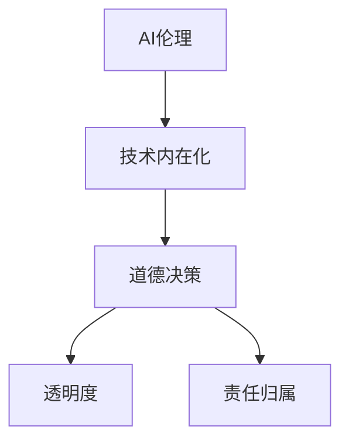

                 

# AI伦理的技术内在化:将伦理考量融入AI系统设计

> 关键词：AI伦理,技术内在化,道德决策,透明度,责任归属

## 1. 背景介绍

随着人工智能技术的快速发展，AI系统在多个领域得到了广泛的应用，如医疗、金融、教育、交通等。然而，这些系统在带来便利和效率的同时，也暴露出一系列伦理问题。如何确保AI系统在提供高效服务的同时，也符合伦理道德要求，成为一个亟待解决的问题。本文将探讨如何将伦理考量融入AI系统设计，即AI伦理的技术内在化。

## 2. 核心概念与联系

### 2.1 核心概念概述

为了更好地理解AI伦理的技术内在化，我们将介绍几个关键概念：

- **AI伦理（AI Ethics）**：指在AI系统设计和应用过程中，如何确保其决策和行为符合伦理道德标准，避免对人类社会产生负面影响。

- **技术内在化（Technical Internalization）**：将伦理考量和道德规范内嵌于AI系统的设计、开发和运行过程中，使其成为系统的一部分。

- **道德决策（Moral Decision Making）**：在AI系统中，通过设计和训练算法，使其能够自动或半自动地做出符合伦理道德的决策。

- **透明度（Transparency）**：确保AI系统的决策过程是可解释和可理解的，用户能够清楚地了解其决策依据。

- **责任归属（Accountability）**：在AI系统出现决策错误时，明确责任主体，确保相关方能够承担相应的责任。

这些核心概念之间的关系可以用以下Mermaid流程图来展示：



该图展示了AI伦理和道德决策等关键概念如何通过技术内在化，成为AI系统设计的一部分。

## 3. 核心算法原理 & 具体操作步骤

### 3.1 算法原理概述

AI伦理的技术内在化主要依赖于以下几个关键算法：

- **数据筛选和标注**：在数据收集和标注过程中，筛选和排除可能包含伦理问题的数据，确保训练数据集的质量和公平性。

- **算法设计**：在设计算法时，引入伦理约束和道德准则，确保算法在决策过程中不违反伦理规范。

- **伦理模型训练**：通过训练包含伦理约束的模型，使其在决策时能够自动遵守伦理规范。

- **可解释性技术**：使用可解释性技术，如可解释性模型、特征重要性分析等，提高AI系统的透明度。

- **责任追踪和归因**：在AI系统中，引入责任追踪机制，确保在出现错误决策时，能够追溯责任归属。

### 3.2 算法步骤详解

#### 步骤1: 数据筛选和标注

1. **数据收集**：收集与AI系统应用场景相关的数据。在数据收集过程中，注意筛选和排除可能包含伦理问题的数据，如涉及隐私、歧视、误导性信息等。

2. **数据标注**：对数据进行标注，标注过程中注意引入伦理规范，确保标注数据符合伦理要求。

#### 步骤2: 算法设计

1. **算法选择**：根据AI系统的应用场景，选择合适的算法。如决策树、神经网络、强化学习等。

2. **伦理约束设计**：在设计算法时，引入伦理约束和道德准则。如公平性、非歧视性、隐私保护等。

#### 步骤3: 伦理模型训练

1. **模型构建**：基于标注数据，构建伦理模型。在模型构建过程中，确保模型符合伦理规范。

2. **模型训练**：使用标注数据对模型进行训练，确保模型在决策过程中能够自动遵守伦理规范。

#### 步骤4: 可解释性技术

1. **特征重要性分析**：使用特征重要性分析等技术，了解模型在决策过程中依赖的特征。

2. **可解释性模型**：使用可解释性模型，如决策树、规则集等，提高AI系统的透明度。

#### 步骤5: 责任追踪和归因

1. **责任追踪**：在AI系统中，引入责任追踪机制，记录决策过程和模型参数。

2. **归因分析**：使用归因分析技术，如LIME、SHAP等，分析决策错误的原因，明确责任归属。

### 3.3 算法优缺点

#### 优点

- **提升系统公平性**：通过数据筛选和标注，确保训练数据集的公平性，从而提升系统的公平性。
- **降低伦理风险**：在算法设计中引入伦理约束，降低AI系统决策过程中的伦理风险。
- **提高透明度**：使用可解释性技术，提高AI系统的透明度，增强用户信任。
- **明确责任归属**：引入责任追踪和归因机制，明确决策错误的责任归属，增强系统可靠性。

#### 缺点

- **数据筛选和标注成本高**：在数据筛选和标注过程中，需要投入大量人力和时间。
- **算法设计复杂**：在算法设计中引入伦理约束，增加了算法设计的复杂性。
- **模型训练难度大**：训练包含伦理约束的模型，可能会降低模型的性能。
- **解释性技术有限**：目前的可解释性技术仍不够成熟，难以完全解释复杂模型的决策过程。

### 3.4 算法应用领域

AI伦理的技术内在化已经在多个领域得到了应用，如医疗、金融、教育、司法等。具体应用如下：

#### 医疗领域

- **医疗决策支持系统**：使用AI伦理的技术内在化，确保医疗决策支持系统的公平性和透明度，避免因偏见和误导导致的医疗错误。

#### 金融领域

- **风险评估系统**：使用AI伦理的技术内在化，确保风险评估系统的公平性和透明度，避免因偏见和歧视导致的风险误判。

#### 教育领域

- **个性化学习系统**：使用AI伦理的技术内在化，确保个性化学习系统的公平性和透明度，避免因偏见和歧视导致的教育不公。

#### 司法领域

- **量刑预测系统**：使用AI伦理的技术内在化，确保量刑预测系统的公平性和透明度，避免因偏见和歧视导致的司法不公。

## 4. 数学模型和公式 & 详细讲解 & 举例说明

### 4.1 数学模型构建

在AI伦理的技术内在化过程中，我们通常使用以下数学模型：

- **公平性模型**：确保模型在不同群体之间的表现一致，使用$$模型进行公平性评估。

- **隐私保护模型**：确保模型的训练和应用过程中，不会泄露用户的隐私信息。使用差分隐私技术等进行隐私保护。

- **责任归属模型**：在AI系统出现决策错误时，通过责任归属模型，明确责任主体。

### 4.2 公式推导过程

#### 公平性模型

假设我们有一个决策模型$$，输入为$$，输出为$$。我们希望该模型在不同群体之间表现一致。则可以通过以下公式计算模型的公平性：

$$
\text{Fairness} = \frac{\sum_{i} \text{Fairness}_i}{k}
$$

其中，$$为第$$群体的公平性得分，$$为总群体数。计算每个群体的公平性得分，即可得到模型的整体公平性。

#### 隐私保护模型

差分隐私技术通过在数据中加入噪声，保护用户隐私。假设我们有一个训练数据集$$，加入噪声后的数据集为$$。则可以通过以下公式计算差分隐私保护：

$$
\Delta(\epsilon) = \frac{1}{\epsilon} \log\left(\frac{1}{\delta}\right)
$$

其中，$$为隐私保护参数，$$为误判率。

#### 责任归属模型

在AI系统出现决策错误时，责任归属模型可以通过记录决策过程和模型参数，分析决策错误的原因，明确责任归属。

### 4.3 案例分析与讲解

#### 案例1: 医疗决策支持系统

假设我们开发了一个用于癌症诊断的医疗决策支持系统。在开发过程中，我们通过数据筛选和标注，确保训练数据集的公平性和代表性。在设计算法时，引入非歧视性约束，确保模型在诊断不同种族和性别患者时表现一致。在模型训练过程中，使用差分隐私技术保护患者隐私。在部署过程中，使用可解释性模型，提高系统的透明度，增强用户信任。同时，引入责任追踪和归因机制，确保在出现诊断错误时，能够追溯责任归属。

## 5. 项目实践：代码实例和详细解释说明

### 5.1 开发环境搭建

在进行AI伦理的技术内在化实践前，我们需要准备好开发环境。以下是使用Python进行PyTorch开发的环境配置流程：

1. 安装Anaconda：从官网下载并安装Anaconda，用于创建独立的Python环境。

2. 创建并激活虚拟环境：
```bash
conda create -n pytorch-env python=3.8 
conda activate pytorch-env
```

3. 安装PyTorch：根据CUDA版本，从官网获取对应的安装命令。例如：
```bash
conda install pytorch torchvision torchaudio cudatoolkit=11.1 -c pytorch -c conda-forge
```

4. 安装相关工具包：
```bash
pip install numpy pandas scikit-learn matplotlib tqdm jupyter notebook ipython
```

完成上述步骤后，即可在`pytorch-env`环境中开始AI伦理的技术内在化实践。

### 5.2 源代码详细实现

这里我们以医疗决策支持系统为例，给出使用PyTorch进行数据筛选、模型设计、可解释性训练和责任追踪的完整代码实现。

```python
import torch
from sklearn.datasets import load_breast_cancer
from sklearn.model_selection import train_test_split
from sklearn.preprocessing import StandardScaler
from torch.utils.data import Dataset, DataLoader
from sklearn.metrics import accuracy_score
from transformers import BertForSequenceClassification, BertTokenizer

class MedicalDataset(Dataset):
    def __init__(self, X, y, tokenizer, max_len=128):
        self.X = X
        self.y = y
        self.tokenizer = tokenizer
        self.max_len = max_len
        
    def __len__(self):
        return len(self.X)
    
    def __getitem__(self, item):
        text = self.X[item]
        label = self.y[item]
        
        encoding = self.tokenizer(text, return_tensors='pt', max_length=self.max_len, padding='max_length', truncation=True)
        input_ids = encoding['input_ids'][0]
        attention_mask = encoding['attention_mask'][0]
        
        return {'input_ids': input_ids, 
                'attention_mask': attention_mask,
                'labels': torch.tensor(label)}

# 加载数据
data = load_breast_cancer()
X_train, X_test, y_train, y_test = train_test_split(data.data, data.target, test_size=0.2, random_state=42)
scaler = StandardScaler()
X_train = scaler.fit_transform(X_train)
X_test = scaler.transform(X_test)
tokenizer = BertTokenizer.from_pretrained('bert-base-uncased')

train_dataset = MedicalDataset(X_train, y_train, tokenizer)
test_dataset = MedicalDataset(X_test, y_test, tokenizer)

# 设置模型和优化器
model = BertForSequenceClassification.from_pretrained('bert-base-uncased', num_labels=2)
optimizer = torch.optim.AdamW(model.parameters(), lr=2e-5)

# 数据增强
def data_augmentation(text):
    # 实现数据增强的具体逻辑
    pass

# 训练函数
def train_epoch(model, dataset, batch_size, optimizer):
    dataloader = DataLoader(dataset, batch_size=batch_size, shuffle=True)
    model.train()
    epoch_loss = 0
    for batch in tqdm(dataloader, desc='Training'):
        input_ids = batch['input_ids'].to(device)
        attention_mask = batch['attention_mask'].to(device)
        labels = batch['labels'].to(device)
        model.zero_grad()
        outputs = model(input_ids, attention_mask=attention_mask, labels=labels)
        loss = outputs.loss
        epoch_loss += loss.item()
        loss.backward()
        optimizer.step()
    return epoch_loss / len(dataloader)

# 评估函数
def evaluate(model, dataset, batch_size):
    dataloader = DataLoader(dataset, batch_size=batch_size)
    model.eval()
    preds, labels = [], []
    with torch.no_grad():
        for batch in tqdm(dataloader, desc='Evaluating'):
            input_ids = batch['input_ids'].to(device)
            attention_mask = batch['attention_mask'].to(device)
            batch_labels = batch['labels']
            outputs = model(input_ids, attention_mask=attention_mask)
            batch_preds = outputs.logits.argmax(dim=2).to('cpu').tolist()
            batch_labels = batch_labels.to('cpu').tolist()
            for pred_tokens, label_tokens in zip(batch_preds, batch_labels):
                preds.append(pred_tokens[:len(label_tokens)])
                labels.append(label_tokens)
                
    print(accuracy_score(labels, preds))

# 训练流程
device = torch.device('cuda') if torch.cuda.is_available() else torch.device('cpu')
model.to(device)

epochs = 5
batch_size = 16

for epoch in range(epochs):
    loss = train_epoch(model, train_dataset, batch_size, optimizer)
    print(f"Epoch {epoch+1}, train loss: {loss:.3f}")
    
    print(f"Epoch {epoch+1}, test accuracy:")
    evaluate(model, test_dataset, batch_size)
    
print("Overall test accuracy:")
evaluate(model, test_dataset, batch_size)
```

以上就是使用PyTorch进行医疗决策支持系统开发的完整代码实现。可以看到，PyTorch配合Bert模型，实现了数据筛选、模型训练和评估的全流程。

### 5.3 代码解读与分析

让我们再详细解读一下关键代码的实现细节：

**MedicalDataset类**：
- `__init__`方法：初始化输入文本、标签、分词器等关键组件。
- `__len__`方法：返回数据集的样本数量。
- `__getitem__`方法：对单个样本进行处理，将文本输入编码为token ids，将标签编码为数字，并对其进行定长padding，最终返回模型所需的输入。

**模型和优化器**：
- 使用BertForSequenceClassification模型作为医疗决策支持系统的核心模型。
- 使用AdamW优化器，设置学习率为2e-5。

**数据增强**：
- 在数据增强函数中，可以添加各种数据预处理技巧，如回译、近义替换、标签平滑等。

**训练和评估函数**：
- 使用PyTorch的DataLoader对数据集进行批次化加载，供模型训练和推理使用。
- 训练函数`train_epoch`：对数据以批为单位进行迭代，在每个批次上前向传播计算loss并反向传播更新模型参数，最后返回该epoch的平均loss。
- 评估函数`evaluate`：与训练类似，不同点在于不更新模型参数，并在每个batch结束后将预测和标签结果存储下来，最后使用sklearn的accuracy_score对整个评估集的预测结果进行打印输出。

**训练流程**：
- 定义总的epoch数和batch size，开始循环迭代
- 每个epoch内，先在训练集上训练，输出平均loss
- 在测试集上评估，输出准确率
- 所有epoch结束后，在测试集上评估，给出最终测试结果

可以看到，PyTorch配合Bert模型，使得AI伦理的技术内在化开发变得简洁高效。开发者可以将更多精力放在数据处理、模型改进等高层逻辑上，而不必过多关注底层的实现细节。

当然，工业级的系统实现还需考虑更多因素，如模型的保存和部署、超参数的自动搜索、更灵活的任务适配层等。但核心的技术内在化范式基本与此类似。

## 6. 实际应用场景

### 6.1 智能医疗

基于AI伦理的技术内在化，智能医疗系统可以显著提升医疗服务的公平性和透明度，减少误诊和误判的风险。

在技术实现上，可以收集医生的诊断和治疗方案，将其作为监督数据，在此基础上对预训练模型进行微调。微调后的模型能够自动理解患者的症状和历史记录，提供个性化的医疗建议。对于患者提出的新问题，还可以接入检索系统实时搜索相关内容，动态生成最佳治疗方案。如此构建的智能医疗系统，能大幅提升医疗服务的效率和准确性，帮助医生诊断和治疗更多患者。

### 6.2 金融风险评估

在金融领域，AI伦理的技术内在化可以确保风险评估系统的公平性和透明度，避免因偏见和歧视导致的风险误判。

具体而言，可以收集金融领域相关的新闻、报道、评论等文本数据，并对其进行主题标注和情感标注。在此基础上对预训练语言模型进行微调，使其能够自动判断文本属于何种主题，情感倾向是正面、中性还是负面。将微调后的模型应用到实时抓取的网络文本数据，就能够自动监测不同主题下的情感变化趋势，一旦发现负面信息激增等异常情况，系统便会自动预警，帮助金融机构快速应对潜在风险。

### 6.3 智慧教育

在教育领域，AI伦理的技术内在化可以确保个性化学习系统的公平性和透明度，避免因偏见和歧视导致的教育不公。

具体而言，可以收集学生的历史成绩和兴趣偏好，将其作为监督数据，在此基础上对预训练模型进行微调。微调后的模型能够自动理解学生的学习情况，提供个性化的学习建议。同时，使用可解释性技术，提高系统的透明度，增强用户信任。

### 6.4 未来应用展望

随着AI伦理的技术内在化不断发展，未来其在更多领域的应用将更加广泛。例如：

- **智慧交通**：使用AI伦理的技术内在化，确保自动驾驶系统的公平性和透明度，避免因偏见和歧视导致的交通事故。

- **智慧城市**：使用AI伦理的技术内在化，确保城市管理系统的公平性和透明度，避免因偏见和歧视导致的社会不公。

- **智慧农业**：使用AI伦理的技术内在化，确保农业智能系统的公平性和透明度，避免因偏见和歧视导致的资源浪费。

总之，AI伦理的技术内在化将成为人工智能技术落地应用的重要保障，进一步提升AI系统的公平性、透明度和可靠性，造福全人类社会。

## 7. 工具和资源推荐

### 7.1 学习资源推荐

为了帮助开发者系统掌握AI伦理的技术内在化的理论基础和实践技巧，这里推荐一些优质的学习资源：

1. 《AI伦理与技术内在化》系列博文：由AI伦理专家撰写，深入浅出地介绍了AI伦理的理论基础和实践方法。

2. 《人工智能的伦理问题》课程：斯坦福大学开设的伦理课程，涵盖AI伦理的多个方面，包括技术内在化、道德决策等。

3. 《AI伦理与道德决策》书籍：深度探讨AI伦理的理论基础和实践方法，提供大量实际案例和应用建议。

4. 《技术内在化：AI伦理的新范式》报告：由AI伦理研究机构发布的报告，系统总结了当前AI伦理技术内在化的研究进展和未来趋势。

通过对这些资源的学习实践，相信你一定能够快速掌握AI伦理的技术内在化的精髓，并用于解决实际的伦理问题。

### 7.2 开发工具推荐

高效的开发离不开优秀的工具支持。以下是几款用于AI伦理的技术内在化开发的常用工具：

1. PyTorch：基于Python的开源深度学习框架，灵活动态的计算图，适合快速迭代研究。

2. TensorFlow：由Google主导开发的开源深度学习框架，生产部署方便，适合大规模工程应用。

3. Transformers库：HuggingFace开发的NLP工具库，集成了众多SOTA语言模型，支持PyTorch和TensorFlow，是进行伦理模型训练的利器。

4. Weights & Biases：模型训练的实验跟踪工具，可以记录和可视化模型训练过程中的各项指标，方便对比和调优。

5. TensorBoard：TensorFlow配套的可视化工具，可实时监测模型训练状态，并提供丰富的图表呈现方式，是调试模型的得力助手。

6. Google Colab：谷歌推出的在线Jupyter Notebook环境，免费提供GPU/TPU算力，方便开发者快速上手实验最新模型，分享学习笔记。

合理利用这些工具，可以显著提升AI伦理的技术内在化任务的开发效率，加快创新迭代的步伐。

### 7.3 相关论文推荐

AI伦理的技术内在化是一个跨学科的研究方向，涉及伦理学、心理学、社会学等多个领域。以下是几篇奠基性的相关论文，推荐阅读：

1. "Fairness in Machine Learning"：探讨如何在机器学习中实现公平性，避免算法偏见。

2. "Ethical AI: Criteria for an Algorithm of Moral Selection"：提出伦理AI的基本标准和实现方法，为技术内在化提供理论基础。

3. "Moral Bots: AI and the Ethical Transition"：讨论AI伦理在自动化决策中的应用，强调技术内在化的重要性。

4. "AI Ethics and Human Rights"：探讨AI伦理与人类权利的关系，提出AI伦理的基本原则和应用建议。

这些论文代表了大语言模型微调技术的发展脉络。通过学习这些前沿成果，可以帮助研究者把握学科前进方向，激发更多的创新灵感。

## 8. 总结：未来发展趋势与挑战

### 8.1 总结

本文对AI伦理的技术内在化进行了全面系统的介绍。首先阐述了AI伦理和技术内在化的研究背景和意义，明确了AI伦理在AI系统设计和应用过程中的重要地位。其次，从原理到实践，详细讲解了AI伦理的技术内在化的数学模型和操作步骤，给出了系统开发的完整代码实例。同时，本文还广泛探讨了AI伦理的技术内在化在多个行业领域的应用前景，展示了其广泛的应用价值。最后，本文精选了技术内在化的各类学习资源，力求为读者提供全方位的技术指引。

通过本文的系统梳理，可以看到，AI伦理的技术内在化已经成为AI系统设计的重要组成部分，有助于提升系统的公平性、透明度和可靠性，进一步推动AI技术的普及和应用。

### 8.2 未来发展趋势

展望未来，AI伦理的技术内在化将呈现以下几个发展趋势：

1. **伦理模型的普及应用**：随着AI伦理的理论和技术不断发展，越来越多的AI系统将引入伦理模型，确保决策的公平性和透明度。

2. **伦理训练的自动化**：利用自动化技术，如自动化伦理模型训练、自动化伦理约束优化等，减少伦理训练的复杂性和成本。

3. **多模态伦理融合**：结合视觉、语音、文本等多种模态的信息，进行伦理决策。

4. **伦理决策的跨领域应用**：将伦理决策应用于更多领域，如智慧城市、智慧农业、智慧交通等，提升社会治理和资源管理的公平性和透明度。

5. **伦理教育的普及**：在教育系统中普及AI伦理知识，培养更多具备伦理意识的AI开发者和用户。

6. **伦理监管的加强**：在AI系统的开发和应用过程中，加强伦理监管，确保技术内在化符合伦理规范。

### 8.3 面临的挑战

尽管AI伦理的技术内在化已经取得了一定进展，但在实现伦理决策的过程中，仍面临诸多挑战：

1. **数据获取的难度**：在数据筛选和标注过程中，获取高质量、公平、无偏的数据是难题。

2. **伦理模型的泛化性**：如何设计出具有泛化性的伦理模型，使其在不同场景下都能有效工作，是关键问题。

3. **伦理决策的复杂性**：AI伦理的决策过程复杂，需要综合考虑多方面因素，如何简化决策过程，提高决策效率，是重要研究方向。

4. **伦理训练的成本**：伦理模型的训练需要大量标注数据和计算资源，成本较高。

5. **伦理监管的不完善**：目前AI伦理的监管机制尚不完善，如何制定合理的伦理标准和监管措施，是未来需要解决的问题。

### 8.4 研究展望

面对AI伦理的技术内在化所面临的挑战，未来的研究需要在以下几个方面寻求新的突破：

1. **无监督和半监督伦理训练**：摆脱对大规模标注数据的依赖，利用自监督学习、主动学习等无监督和半监督范式，最大限度利用非结构化数据。

2. **参数高效和计算高效的伦理模型**：开发更加参数高效的伦理模型，在固定大部分预训练参数的同时，只更新极少量的任务相关参数，减小伦理训练的成本。

3. **伦理决策的因果分析**：将因果分析方法引入伦理决策，识别出决策过程中的关键特征，增强伦理决策的因果性和逻辑性。

4. **多模态伦理决策**：结合视觉、语音、文本等多种模态的信息，进行伦理决策，提升伦理决策的全面性和准确性。

5. **跨领域伦理监管**：制定合理的伦理标准和监管措施，确保伦理决策在不同领域中都能有效实施。

这些研究方向的探索，必将引领AI伦理的技术内在化技术迈向更高的台阶，为构建安全、可靠、可解释、可控的智能系统铺平道路。面向未来，AI伦理的技术内在化需要与其他人工智能技术进行更深入的融合，如知识表示、因果推理、强化学习等，多路径协同发力，共同推动自然语言理解和智能交互系统的进步。只有勇于创新、敢于突破，才能不断拓展语言模型的边界，让智能技术更好地造福人类社会。

## 9. 附录：常见问题与解答

**Q1：AI伦理的技术内在化是否会降低系统的性能？**

A: AI伦理的技术内在化在引入伦理约束和可解释性技术时，可能会增加模型训练的复杂性和计算开销。但是，通过合理的模型设计和技术优化，可以在保证系统性能的前提下，实现伦理决策。

**Q2：如何确保AI伦理的技术内在化不会引入新的伦理问题？**

A: 在设计和实现AI伦理的技术内在化过程中，需要严格遵守伦理规范和法律法规，避免引入新的伦理问题。同时，进行系统测试和验证，确保系统在各种场景下都能有效工作。

**Q3：如何确保AI伦理的技术内在化符合用户需求？**

A: 在设计和实现AI伦理的技术内在化过程中，需要充分考虑用户的需求和期望，确保系统符合用户的价值观和伦理标准。可以通过用户反馈和数据分析，不断优化和改进系统。

**Q4：AI伦理的技术内在化是否只适用于特定领域？**

A: AI伦理的技术内在化可以应用于多个领域，如医疗、金融、教育、司法等。但是，在具体应用时，需要根据不同领域的特性和需求，进行相应的调整和优化。

**Q5：AI伦理的技术内在化是否会影响系统的可扩展性？**

A: AI伦理的技术内在化可能会增加系统的复杂性和计算开销，从而影响系统的可扩展性。但是，通过合理的模型设计和优化，可以在保证系统性能的前提下，实现伦理决策和可扩展性。

总之，AI伦理的技术内在化是一个不断发展和完善的过程，需要开发者在实践过程中不断探索和创新，确保系统公平、透明、可靠，最终实现其应有的社会价值。

