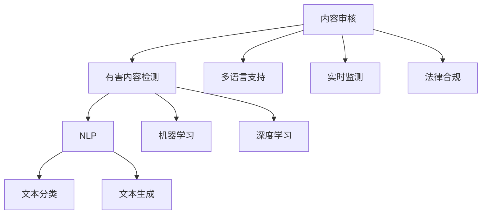

                 

# AI内容审核：保护用户免受有害内容影响

> 关键词：内容审核, AI, 有害内容检测, 自然语言处理(NLP), 机器学习, 深度学习, 文本分类, 文本生成

## 1. 背景介绍

### 1.1 问题由来
在数字化时代，互联网成为人们获取信息、交流思想的重要平台。然而，随着信息量的爆炸式增长，有害内容的传播也变得日益严重。网络上的虚假信息、暴力内容、仇恨言论、网络欺诈等不良信息不仅损害用户身心健康，还可能引发社会动荡，威胁国家安全。

为了保护用户免受有害内容的影响，内容审核技术成为互联网平台不可或缺的环节。内容审核系统需要高效准确地识别和过滤出有害信息，保障网民的言论自由和信息安全。

### 1.2 问题核心关键点
内容审核的核心是检测和过滤有害内容，保证用户获取的信息健康、安全、合法。主要的挑战包括：

- 内容多样性：有害内容多种多样，既有文本形式，也有图片、视频等多种形式。
- 情感复杂性：部分有害内容情感隐蔽，需要深度理解文本背后的情感倾向。
- 信息时效性：网络信息快速传播，有害内容会实时变化，需要实时监测。
- 多语言支持：不同国家和地区的语言习惯不同，需要支持多种语言的审核。
- 法律合规：不同地区有不同的法律法规，需要确保内容审核符合当地法规。

这些问题构成了内容审核技术的核心挑战，要求系统具备高度的自动化和智能化。

## 2. 核心概念与联系

### 2.1 核心概念概述

为更好地理解内容审核技术，本节将介绍几个密切相关的核心概念：

- **内容审核(Content Moderation)**：指利用技术手段识别和过滤互联网上的有害信息，保障网民的言论自由和信息安全。
- **有害内容检测(Harmful Content Detection)**：内容审核的核心任务，检测有害内容的类型，如仇恨言论、暴力内容、虚假信息等。
- **自然语言处理(Natural Language Processing, NLP)**：涉及文本的预处理、分类、生成等任务，是内容审核中的重要技术手段。
- **机器学习(Machine Learning, ML)**：利用训练数据，通过算法自动提取文本特征，进行分类、聚类等任务。
- **深度学习(Deep Learning, DL)**：机器学习的一种，通过神经网络模型深度学习文本特征，提升分类准确率。
- **文本分类(Text Classification)**：根据文本内容将其分类为某一类别，是内容审核中的重要技术。
- **文本生成(Text Generation)**：利用深度学习生成与输入文本相似的文本，可以用于生成检测样本。

这些核心概念之间的逻辑关系可以通过以下Mermaid流程图来展示：



这个流程图展示内容审核的关键概念及其之间的关系：

1. 内容审核是系统的整体任务。
2. 有害内容检测是核心技术，用于自动识别有害内容。
3. 自然语言处理和机器学习是技术手段，用于文本处理和特征提取。
4. 深度学习是机器学习的一种高级形式，用于提升模型性能。
5. 文本分类是任务目标，将文本分为不同类别。
6. 文本生成可以用于生成检测样本，提升模型鲁棒性。
7. 多语言支持和实时监测是系统需求，保障内容审核符合不同地区法规和快速响应。

## 3. 核心算法原理 & 具体操作步骤

### 3.1 算法原理概述

内容审核系统基于监督学习或无监督学习模型，对文本进行分类和过滤。监督学习模型需要标注数据训练，无监督学习模型则通过自身特征提取和聚类来检测有害内容。以下重点介绍监督学习模型的原理：

假设有一批文本数据 $D = \{(x_i, y_i)\}_{i=1}^N$，其中 $x_i$ 为文本，$y_i$ 为文本标签，如“正常”或“有害”。目标是训练一个分类器 $f$，将新的文本 $x$ 分类为某一类别 $y$。常用的分类模型包括朴素贝叶斯、决策树、支持向量机、神经网络等。

训练过程包括：
1. **特征提取**：将文本转换为模型可以理解的特征向量。
2. **模型训练**：利用标注数据训练分类器，使其能够预测新文本的类别。
3. **模型评估**：使用测试数据集评估模型性能。
4. **模型部署**：将训练好的模型部署到生产环境，实时检测新文本。

### 3.2 算法步骤详解

基于监督学习的有害内容检测算法一般包括以下几个关键步骤：

**Step 1: 准备标注数据和模型**

1. 收集标注数据集，数据集需包含大量的正常文本和有害文本。
2. 选择合适的模型作为初始化参数，如朴素贝叶斯、SVM、深度学习模型等。

**Step 2: 特征提取**

1. 使用词袋模型、TF-IDF、word2vec、BERT等方法提取文本特征。
2. 选择适合模型的高维特征，以提升分类性能。

**Step 3: 模型训练**

1. 使用交叉验证、网格搜索等方法调参，选择最优的模型参数。
2. 使用标注数据训练模型，迭代更新模型参数，最小化损失函数。
3. 使用Early Stopping等方法防止过拟合。

**Step 4: 模型评估**

1. 使用测试集评估模型性能，常用指标包括准确率、召回率、F1值等。
2. 对模型进行调优，提高性能。

**Step 5: 模型部署**

1. 将训练好的模型部署到生产环境，实时检测新文本。
2. 对检测到的有害内容进行过滤和标记。

### 3.3 算法优缺点

基于监督学习的有害内容检测算法具有以下优点：

1. 高准确性：通过大量标注数据训练，模型的分类准确率较高。
2. 高效性：利用现有技术，可以在较短时间内完成模型训练和部署。
3. 可解释性：模型参数可解释，有助于理解其决策过程。

同时，该算法也存在一定的局限性：

1. 依赖标注数据：需要大量高质量的标注数据，成本较高。
2. 数据偏差：标注数据可能存在偏差，影响模型泛化性能。
3. 新类型识别困难：无法识别标注数据中未出现的新类型有害内容。

### 3.4 算法应用领域

基于监督学习的有害内容检测算法广泛应用于各种互联网平台，如社交媒体、论坛、视频网站等。在技术实现上，常见的应用场景包括：

- 社交媒体平台：检测用户发布的内容，防止仇恨言论、暴力内容、虚假信息等传播。
- 视频网站：检测视频中的有害内容，如暴力场景、淫秽内容等。
- 论坛和博客：检测用户评论和文章，防止低俗内容、违法信息等传播。
- 电子商务平台：检测商品描述和评论，防止虚假广告和欺诈行为。

## 4. 数学模型和公式 & 详细讲解 & 举例说明

### 4.1 数学模型构建

基于监督学习的有害内容检测算法，一般使用分类模型 $f(x; \theta)$，其中 $\theta$ 为模型参数。假设有一批文本数据 $D = \{(x_i, y_i)\}_{i=1}^N$，其中 $x_i$ 为文本，$y_i \in \{0,1\}$ 为文本标签。

定义模型 $f(x; \theta)$ 在文本 $x$ 上的预测标签为 $\hat{y} = f(x; \theta)$。模型的训练目标是最小化损失函数：

$$
\mathcal{L}(\theta) = -\frac{1}{N}\sum_{i=1}^N \log(f(x_i; \theta))y_i
$$

其中 $\log(f(x_i; \theta))$ 为模型的预测概率，$y_i$ 为实际标签。

### 4.2 公式推导过程

以朴素贝叶斯分类器为例，推导文本分类的概率模型。

设文本 $x$ 由 $n$ 个词语组成，每个词语 $w_j$ 的权重为 $w_j$，则文本的向量表示为：

$$
x = \{w_1, w_2, \ldots, w_n\}
$$

假设共有 $C$ 个类别，文本 $x$ 属于类别 $c$ 的概率为：

$$
P(c|x) = \frac{P(x|c)P(c)}{P(x)}
$$

其中 $P(x)$ 为文本 $x$ 出现的先验概率，$P(x|c)$ 为文本 $x$ 在类别 $c$ 下出现的条件概率，$P(c)$ 为类别 $c$ 出现的先验概率。

假设每个词语 $w_j$ 在类别 $c$ 下出现的概率为 $p_{j,c}$，则文本 $x$ 在类别 $c$ 下的条件概率为：

$$
P(x|c) = \prod_{j=1}^n p_{j,c}
$$

文本 $x$ 在类别 $c$ 下出现的概率为：

$$
P(c|x) = \frac{\prod_{j=1}^n p_{j,c}}{\sum_{k=1}^C \prod_{j=1}^n p_{j,k}}
$$

在训练过程中，我们通过最大似然估计方法求解模型参数 $p_{j,c}$：

$$
p_{j,c} = \frac{\sum_{i=1}^N I(x_i=c) w_j}{\sum_{i=1}^N I(x_i=c)}
$$

其中 $I(x_i=c)$ 为示性函数，$I(x_i=c)=1$ 表示文本 $x_i$ 属于类别 $c$，否则为0。

### 4.3 案例分析与讲解

以BERT模型为例，讲解深度学习在文本分类中的应用。

BERT模型通过预训练学习丰富的语言表示，将其用于文本分类任务可以显著提升模型性能。BERT模型的输入文本 $x$ 表示为：

$$
x = [CLS] x_1 \ldots x_n [SEP]
$$

其中 $[CLS]$ 和 $[SEP]$ 为特殊的分类和分隔符号，$x_1 \ldots x_n$ 为文本中的词语。

BERT模型的输出为：

$$
\hat{y} = \text{Softmax}(f(x; \theta))
$$

其中 $f(x; \theta)$ 为BERT模型的输出层，$\text{Softmax}$ 函数将模型输出转换为概率分布。

使用BERT模型进行文本分类时，将文本作为模型输入，模型输出为每个类别的概率分布，选择概率最大的类别作为预测结果。

## 5. 项目实践：代码实例和详细解释说明

### 5.1 开发环境搭建

在进行内容审核系统开发前，我们需要准备好开发环境。以下是使用Python进行TensorFlow开发的开发环境配置流程：

1. 安装Anaconda：从官网下载并安装Anaconda，用于创建独立的Python环境。

2. 创建并激活虚拟环境：
```bash
conda create -n tf-env python=3.8 
conda activate tf-env
```

3. 安装TensorFlow：根据CUDA版本，从官网获取对应的安装命令。例如：
```bash
pip install tensorflow==2.6
```

4. 安装TensorBoard：
```bash
pip install tensorboard
```

5. 安装各类工具包：
```bash
pip install numpy pandas scikit-learn matplotlib tqdm jupyter notebook ipython
```

完成上述步骤后，即可在`tf-env`环境中开始内容审核系统的开发。

### 5.2 源代码详细实现

下面以BERT模型为例，给出使用TensorFlow进行有害内容检测的代码实现。

首先，定义数据处理函数：

```python
import tensorflow as tf
from tensorflow.keras.preprocessing.text import Tokenizer
from tensorflow.keras.preprocessing.sequence import pad_sequences

def prepare_data(texts, labels, tokenizer, max_len=128):
    tokenizer.fit_on_texts(texts)
    sequences = tokenizer.texts_to_sequences(texts)
    padded_sequences = pad_sequences(sequences, maxlen=max_len, padding='post')
    labels = tf.keras.utils.to_categorical(labels)
    return padded_sequences, labels
```

然后，定义模型：

```python
from tensorflow.keras.models import Sequential
from tensorflow.keras.layers import Embedding, LSTM, Dense, Dropout

model = Sequential([
    Embedding(vocab_size, embedding_dim, input_length=max_len),
    LSTM(128, dropout=0.2, recurrent_dropout=0.2),
    Dense(64, activation='relu'),
    Dropout(0.5),
    Dense(2, activation='softmax')
])
model.compile(loss='categorical_crossentropy', optimizer='adam', metrics=['accuracy'])
```

接着，定义训练和评估函数：

```python
def train_model(model, train_data, epochs=10, batch_size=32):
    model.fit(train_data[0], train_data[1], epochs=epochs, batch_size=batch_size, validation_split=0.2)

def evaluate_model(model, test_data):
    test_loss, test_acc = model.evaluate(test_data[0], test_data[1])
    print(f'Test accuracy: {test_acc:.2f}')
```

最后，启动训练流程并在测试集上评估：

```python
train_data = prepare_data(train_texts, train_labels, tokenizer, max_len)
test_data = prepare_data(test_texts, test_labels, tokenizer, max_len)

train_model(model, train_data)
evaluate_model(model, test_data)
```

以上就是使用TensorFlow进行有害内容检测的完整代码实现。可以看到，TensorFlow提供了丰富的机器学习工具，使得内容审核系统的开发变得简便高效。

### 5.3 代码解读与分析

让我们再详细解读一下关键代码的实现细节：

**prepare_data函数**：
- 使用TensorFlow的Tokenizer类对文本进行分词和编码，转换为模型可接受的整数序列。
- 对序列进行填充，保证序列长度一致。
- 将标签进行one-hot编码，转换为模型可接受的格式。

**定义模型**：
- 使用Sequential模型定义多层网络结构，包括嵌入层、LSTM层、全连接层等。
- 添加Dropout层防止过拟合，提高模型泛化能力。

**train_model函数**：
- 使用fit方法对模型进行训练，迭代epochs次，每次batch_size个样本。
- 使用validation_split参数将数据集分为训练集和验证集。

**evaluate_model函数**：
- 使用evaluate方法对模型进行评估，返回损失和精度。
- 打印测试集上的精度。

**训练流程**：
- 准备训练和测试数据。
- 定义模型并进行训练。
- 在测试集上评估模型性能。

可以看到，TensorFlow提供了强大的机器学习工具，可以很方便地实现有害内容检测系统的开发。

## 6. 实际应用场景

### 6.1 社交媒体平台

社交媒体平台面临大量用户发布的内容，其中不乏仇恨言论、暴力内容、虚假信息等有害内容。内容审核系统可以在用户发布前对内容进行预检，防止有害内容传播。

例如，使用BERT模型对用户评论进行文本分类，检测是否存在仇恨言论。将评论作为模型输入，预测其类别，如果预测为“有害”，则标记并过滤该评论。

### 6.2 视频网站

视频网站上的视频内容也需要进行内容审核。对于视频中的文字字幕、视频描述等文本信息，可以使用类似的方法进行检测。

例如，在视频加载时，使用BERT模型对视频描述和字幕进行文本分类，检测是否存在有害内容。如果检测到有害内容，则可以自动屏蔽或删除该视频。

### 6.3 论坛和博客

论坛和博客上的用户评论和文章也需要进行内容审核。使用类似的方法，对用户评论和文章进行文本分类，检测是否存在有害内容。

例如，在用户发表评论或文章时，使用BERT模型进行文本分类，检测是否存在仇恨言论、暴力内容等。如果检测到有害内容，则可以标记并过滤该评论或文章。

## 7. 工具和资源推荐

### 7.1 学习资源推荐

为了帮助开发者系统掌握内容审核技术的理论基础和实践技巧，这里推荐一些优质的学习资源：

1. 《深度学习》系列书籍：由深度学习领域的专家编写，全面介绍了深度学习的基本概念和算法。
2. 《TensorFlow官方文档》：TensorFlow的官方文档，提供了丰富的教程和样例代码，是学习TensorFlow的重要资料。
3. 《自然语言处理》课程：斯坦福大学开设的NLP明星课程，涵盖NLP的各个方面，包括文本分类、情感分析等。
4. 《机器学习实战》书籍：通过实战案例，详细讲解了机器学习的各个步骤和算法。
5. 《自然语言处理与深度学习》书籍：由自然语言处理和深度学习领域的专家编写，介绍了NLP和DL的最新进展。

通过对这些资源的学习实践，相信你一定能够快速掌握内容审核技术的精髓，并用于解决实际的NLP问题。

### 7.2 开发工具推荐

高效的开发离不开优秀的工具支持。以下是几款用于内容审核开发的常用工具：

1. TensorFlow：由Google主导开发的深度学习框架，生产部署方便，适合大规模工程应用。
2. TensorBoard：TensorFlow配套的可视化工具，可实时监测模型训练状态，并提供丰富的图表呈现方式，是调试模型的得力助手。
3. PyTorch：基于Python的开源深度学习框架，灵活动态的计算图，适合快速迭代研究。
4. Keras：高层API，可以快速构建深度学习模型，适合初学者和快速原型开发。
5. Weights & Biases：模型训练的实验跟踪工具，可以记录和可视化模型训练过程中的各项指标，方便对比和调优。

合理利用这些工具，可以显著提升内容审核系统的开发效率，加快创新迭代的步伐。

### 7.3 相关论文推荐

内容审核技术的发展源于学界的持续研究。以下是几篇奠基性的相关论文，推荐阅读：

1. Deep Text: Semantic Analysis with Bag of Words：提出使用词袋模型进行文本分类，开启了NLP领域的文本分类工作。
2. Long Short-Term Memory：提出LSTM模型，有效解决了序列建模问题，广泛应用于NLP中的文本分类和机器翻译。
3. Attention is All You Need：提出Transformer模型，开启了NLP领域的预训练大模型时代。
4. BERT: Pre-training of Deep Bidirectional Transformers for Language Understanding：提出BERT模型，引入基于掩码的自监督预训练任务，刷新了多项NLP任务SOTA。
5. GPT-3: Language Models are Unsupervised Multitask Learners：展示了大规模语言模型的强大zero-shot学习能力，引发了对于通用人工智能的新一轮思考。

这些论文代表了大语言模型和内容审核技术的发展脉络。通过学习这些前沿成果，可以帮助研究者把握学科前进方向，激发更多的创新灵感。

## 8. 总结：未来发展趋势与挑战

### 8.1 总结

本文对基于监督学习的有害内容检测方法进行了全面系统的介绍。首先阐述了内容审核技术的研究背景和意义，明确了有害内容检测在保护用户免受有害内容影响中的重要价值。其次，从原理到实践，详细讲解了有害内容检测的数学原理和关键步骤，给出了内容审核任务开发的完整代码实例。同时，本文还广泛探讨了内容审核技术在社交媒体、视频网站、论坛等场景中的应用前景，展示了内容审核范式的巨大潜力。此外，本文精选了内容审核技术的各类学习资源，力求为读者提供全方位的技术指引。

通过本文的系统梳理，可以看到，基于监督学习的有害内容检测技术正在成为内容审核领域的重要范式，极大地拓展了内容审核技术的应用边界，催生了更多的落地场景。受益于大规模语料的预训练，检测模型的精度和鲁棒性显著提升，内容审核技术在各个平台落地应用，显著提高了平台的用户体验和信息安全。未来，伴随预训练语言模型和深度学习技术的持续演进，内容审核技术还将进一步提升模型性能，保障用户的言论自由和信息安全。

### 8.2 未来发展趋势

展望未来，内容审核技术将呈现以下几个发展趋势：

1. 模型规模持续增大。随着算力成本的下降和数据规模的扩张，预训练语言模型的参数量还将持续增长。超大模型蕴含的丰富语言知识，有望支撑更加复杂多变的有害内容检测任务。
2. 多模态内容检测兴起。除了文本内容，图片、视频、语音等多种形式的内容也需要检测。多模态内容的融合，将显著提升内容审核系统的性能和鲁棒性。
3. 实时内容审核成为常态。网络内容实时传播，有害内容实时出现，实时检测和过滤成为内容审核系统的核心需求。
4. 知识图谱引入。将知识图谱与自然语言处理技术结合，构建更加全面和精确的知识图谱驱动的检测系统。
5. 跨语言检测能力增强。不同语言的内容审核需求逐渐增多，跨语言内容检测能力将成为重要研究方向。
6. 深度学习技术融合。与深度学习、强化学习等技术深度融合，提升内容审核系统的智能化和自动化水平。

以上趋势凸显了内容审核技术的广阔前景。这些方向的探索发展，必将进一步提升内容审核系统的性能和应用范围，为构建安全、可靠、智能化的内容审核系统铺平道路。

### 8.3 面临的挑战

尽管内容审核技术已经取得了显著进展，但在迈向更加智能化、普适化应用的过程中，仍面临诸多挑战：

1. 数据获取难度大。高质量的标注数据和真实世界数据获取成本较高，部分有害内容难以标注。
2. 模型复杂性高。超大模型的训练和推理计算量巨大，资源需求高。
3. 泛化性能差。模型在标注数据外的新类型有害内容识别能力较弱。
4. 法规合规复杂。不同地区法律法规不同，需要模型符合各地法规。
5. 隐私保护要求高。用户隐私保护和数据安全成为重要研究方向。

这些挑战需要在技术、法规、隐私保护等多个维度进行综合解决，才能确保内容审核系统的广泛应用和长期稳定发展。

### 8.4 研究展望

面对内容审核技术所面临的种种挑战，未来的研究需要在以下几个方面寻求新的突破：

1. 探索无监督和半监督检测方法。摆脱对大规模标注数据的依赖，利用自监督学习、主动学习等无监督和半监督范式，最大限度利用非结构化数据，实现更加灵活高效的有害内容检测。
2. 研究多模态检测方法。融合文本、图片、视频、语音等多种形式的内容，构建多模态内容审核系统。
3. 引入知识图谱和常识推理。将知识图谱与自然语言处理技术结合，构建更加全面和精确的检测系统。
4. 开发跨语言检测技术。跨语言内容审核技术将成为重要研究方向，帮助解决多语言平台的有害内容检测问题。
5. 融合深度学习、强化学习等技术。与深度学习、强化学习等技术深度融合，提升内容审核系统的智能化和自动化水平。
6. 加强隐私保护和数据安全。内容审核系统需要严格遵守隐私保护和数据安全法规，防止用户隐私泄露。

这些研究方向的探索，必将引领内容审核技术迈向更高的台阶，为构建安全、可靠、智能化的内容审核系统铺平道路。面向未来，内容审核技术还需要与其他人工智能技术进行更深入的融合，如知识表示、因果推理、强化学习等，多路径协同发力，共同推动自然语言理解和智能交互系统的进步。只有勇于创新、敢于突破，才能不断拓展语言模型的边界，让智能技术更好地造福人类社会。

## 9. 附录：常见问题与解答

**Q1: 内容审核系统如何处理文本中的歧义性信息？**

A: 文本中的歧义性信息是内容审核的一大挑战。处理歧义性信息需要结合上下文语境，综合考虑多方面因素。

一种常用的方法是使用上下文感知模型，如BERT、GPT-3等。这些模型通过预训练学习到丰富的语言表示，可以更好地理解文本的语义和上下文关系，从而更准确地识别出有害内容。

此外，结合常识推理和知识图谱，可以进一步提升模型的鲁棒性和泛化能力。例如，在检测含有隐喻、比喻等复杂表达的文本时，可以使用知识图谱中的关系和属性，结合常识推理能力，更准确地识别出有害内容。

**Q2: 内容审核系统如何处理海量文本数据？**

A: 内容审核系统需要处理海量文本数据，高效的文本处理技术至关重要。

一种方法是使用分布式计算框架，如Hadoop、Spark等，进行并行处理。这些框架可以高效地处理大规模数据，满足内容审核系统的需求。

此外，可以考虑使用GPU加速计算，特别是在使用深度学习模型时，GPU的计算能力可以显著提升模型的训练和推理速度，满足实时检测的需求。

**Q3: 内容审核系统如何处理多媒体内容？**

A: 多媒体内容审核需要结合文本、图片、视频等多种形式的内容，进行综合检测。

对于图片内容，可以使用图像识别技术，检测图片中的暴力场景、淫秽内容等。常用的图像识别算法包括CNN、YOLO等。

对于视频内容，可以使用帧图像提取技术，将视频转化为单帧图像，使用类似的方法进行检测。此外，还可以使用音视频同步技术，结合语音识别技术，检测视频中的有害言论。

**Q4: 内容审核系统如何处理跨语言内容？**

A: 跨语言内容审核是重要研究方向，不同语言的内容审核需求逐渐增多。

一种方法是使用多语言模型，对文本进行跨语言处理。多语言模型可以同时处理多种语言，提升内容审核系统的通用性。

此外，可以结合机器翻译技术，将不同语言的内容转换为统一的格式，再进行检测。常用的机器翻译工具包括Google Translate、Microsoft Translator等。

**Q5: 内容审核系统如何处理动态变化的有害内容？**

A: 动态变化的有害内容是内容审核的一大挑战，需要实时监测和过滤。

一种方法是使用实时流数据处理技术，如Apache Kafka、Apache Flink等，进行实时数据流处理。这些技术可以高效地处理实时数据，满足动态内容审核的需求。

此外，可以考虑使用增量学习技术，对模型进行在线更新，提升模型的实时性。增量学习可以基于新的数据，不断更新模型参数，避免模型过时，提升模型的泛化能力。

---

作者：禅与计算机程序设计艺术 / Zen and the Art of Computer Programming

