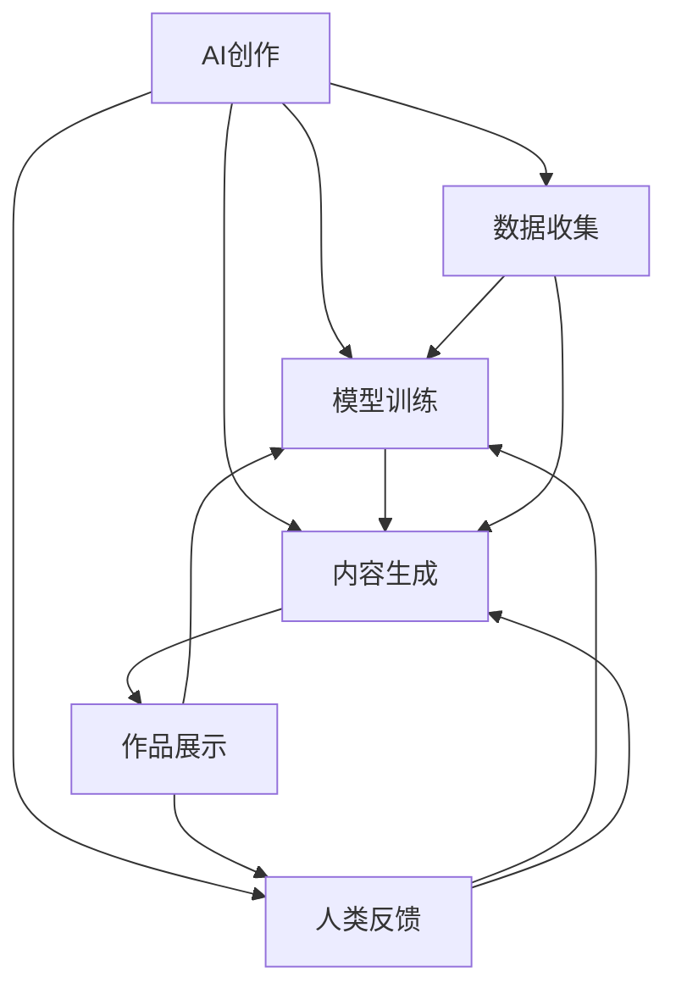

                 

# AI创作vs人类创作：界限与融合

> 关键词：人工智能创作,人类创作,艺术与技术,边界与融合,创造性思维,深度学习

## 1. 背景介绍

### 1.1 问题由来
人工智能（AI）创作技术近年来快速发展，逐步从简单的数据处理和自动化任务，向更为复杂的创造性工作拓展，如写作、绘画、音乐创作等。这一趋势引发了关于AI创作与人类创作界限的广泛讨论。

### 1.2 问题核心关键点
AI创作与人类创作的界限和融合问题，核心在于如何定义“创作”、“创造性”和“人类智能”等概念。AI能否真正模仿、超越乃至超越人类的创作能力，如何在使用AI辅助创作时维护原创性、个性和伦理问题，成为AI技术应用的关键考量。

## 2. 核心概念与联系

### 2.1 核心概念概述

1. **人工智能创作**：指通过AI算法和技术，模拟人类创作的过程，生成具有新颖性和创造性的作品。常见的AI创作技术包括生成对抗网络（GAN）、变分自编码器（VAE）、文本生成模型（如GPT-3）等。
2. **人类创作**：指人类基于自身的认知、情感、经验和文化背景，通过书写、绘画、音乐等多种形式展现的个人表达。
3. **创造性思维**：指产生新颖、独特且具有价值的想法和表达的能力，是人类和AI共同追求的创作目标。
4. **艺术与技术**：艺术与技术的融合，推动了从传统手工艺到数字创作的转变，AI成为现代艺术创作的新工具。
5. **边界与融合**：探索AI创作与人类创作的界限，以及在创作过程中两者如何相互作用、相互借鉴。

### 2.2 核心概念原理和架构的 Mermaid 流程图(Mermaid 流程节点中不要有括号、逗号等特殊字符)



这个流程图展示了AI创作与人类创作的流程和技术架构：

1. 数据收集：从各种来源收集数据，用于训练AI模型。
2. 模型训练：使用收集的数据训练AI模型，使其能够生成符合预期风格的作品。
3. 内容生成：AI模型根据训练好的知识生成新的作品。
4. 作品展示：将生成的作品呈现给人类观众，接收反馈。
5. 人类反馈：人类观众对作品的评价和反馈被收集并用于进一步训练和改进AI模型。

## 3. 核心算法原理 & 具体操作步骤
### 3.1 算法原理概述

AI创作的核心算法原理基于深度学习，特别是生成模型。这些模型通过大量数据训练，学习到数据的分布规律，并能够生成与训练数据分布相似的新数据。AI创作技术包括但不限于：

1. **生成对抗网络（GAN）**：通过两个神经网络（生成器和判别器）的竞争性训练，生成逼真的新数据。
2. **变分自编码器（VAE）**：将数据编码为隐变量，再从隐变量中生成数据，保持数据的分布特性。
3. **文本生成模型（如GPT-3）**：通过语言模型，利用前文信息预测后文，生成连贯且有意义的文本。

### 3.2 算法步骤详解

1. **数据收集与预处理**：
   - 从书籍、电影剧本、艺术品等多种来源收集数据。
   - 清洗、标注和预处理数据，包括去除噪声、标准化和特征提取等。

2. **模型训练**：
   - 使用收集的数据训练生成模型，优化损失函数。
   - 调整模型超参数，如学习率、批次大小、迭代次数等。
   - 引入正则化技术，如L2正则、Dropout等，避免过拟合。

3. **内容生成**：
   - 将训练好的模型应用到生成任务中，如生成文本、图像、音乐等。
   - 设置生成策略，如温度参数、采样方式等，控制生成内容的随机性和多样性。

4. **作品展示与评估**：
   - 将生成的作品展示给人类观众，收集反馈。
   - 通过主观评价和自动评价指标，如连贯性、新颖性和风格一致性等，评估作品质量。

5. **人类反馈与模型优化**：
   - 根据反馈调整生成策略和模型参数，进一步优化生成效果。
   - 利用人类专家的知识，指导模型训练，提高生成作品的创作价值。

### 3.3 算法优缺点

**优点**：
- 能够处理大规模数据，生成高质量、多样化的作品。
- 可以快速生成大量创作内容，节省时间成本。
- 可以在特定领域快速提升创作能力，如特定风格的文字、图像等。

**缺点**：
- 生成内容的原创性不足，可能缺乏人类独有的情感和创造性。
- 可能受训练数据的质量和多样性影响，生成效果不稳定。
- 难以完全模仿人类复杂的创作思维和创新过程。

### 3.4 算法应用领域

AI创作技术已经在多个领域得到应用：

1. **文本创作**：如小说、散文、新闻报道等，通过语言模型生成连贯且有意义的内容。
2. **图像生成**：如绘画、摄影、设计等，生成具有艺术感和创意的图像。
3. **音乐创作**：生成新的旋律、和声和节奏，创作电子音乐、电影配乐等。
4. **电影制作**：生成故事情节、角色对话和场景描述，辅助编剧和导演。
5. **广告创意**：生成吸引人的广告文案和视觉内容，提升品牌曝光率。

## 4. 数学模型和公式 & 详细讲解

### 4.1 数学模型构建

AI创作的数学模型主要基于概率模型和生成模型。这里以文本生成模型为例，构建基于深度学习的语言模型：

1. **定义问题**：
   - 假设有一系列文本数据 $D=\{x_1, x_2, \ldots, x_n\}$，其中 $x_i$ 为输入序列。
   - 目标是从给定前文 $x_1, x_2, \ldots, x_t$ 预测下一个词 $x_{t+1}$。

2. **构建模型**：
   - 使用一个神经网络模型 $P_{\theta}(x_{t+1}|x_1, x_2, \ldots, x_t)$ 来预测下一个词的概率分布。
   - 模型参数 $\theta$ 通过训练数据优化。

3. **损失函数**：
   - 定义交叉熵损失函数 $L(\theta) = -\frac{1}{N} \sum_{i=1}^N \sum_{t=1}^{n} \log P_{\theta}(x_{t+1}|x_1, x_2, \ldots, x_t)$。
   - 最小化损失函数 $L(\theta)$ 来优化模型参数 $\theta$。

### 4.2 公式推导过程

假设使用一个简单的RNN模型来预测下一个词 $x_{t+1}$，其状态更新公式为：

$$
h_t = f(h_{t-1}, x_t)
$$

其中 $h_t$ 为状态向量，$f$ 为状态更新函数。

模型预测下一个词的概率分布为：

$$
P(x_{t+1}|x_1, x_2, \ldots, x_t) = \text{softmax}(W \cdot h_t + b)
$$

其中 $W$ 和 $b$ 为模型参数。

### 4.3 案例分析与讲解

以生成对抗网络（GAN）为例，展示其核心算法原理：

1. **定义问题**：
   - 生成器和判别器两个网络分别学习生成器和判别器的策略。
   - 生成器 $G$ 生成逼真的假样本，判别器 $D$ 区分真假样本。

2. **模型训练**：
   - 生成器 $G$ 从随机噪声 $z$ 生成假样本 $G(z)$。
   - 判别器 $D$ 学习区分真样本 $x$ 和假样本 $G(z)$ 的概率，定义损失函数 $L_G$ 和 $L_D$。
   - 交替优化 $G$ 和 $D$，直到达到平衡状态。

3. **损失函数**：
   - 生成器的损失函数 $L_G = -E_{z}[\log D(G(z))]$
   - 判别器的损失函数 $L_D = E_x[\log D(x)] + E_z[\log(1-D(G(z)))]$

通过上述过程，GAN可以生成逼真的假样本，用于图像、视频等创作任务。

## 5. 项目实践：代码实例和详细解释说明

### 5.1 开发环境搭建

1. **安装Python环境**：
   - 在机器上安装Python 3.6及以上版本。
   - 安装虚拟环境工具，如Anaconda或virtualenv。

2. **配置依赖库**：
   - 安装TensorFlow或PyTorch等深度学习框架。
   - 安装相关数据处理和模型库，如Pandas、NumPy、TensorBoard等。

3. **数据准备**：
   - 收集和预处理数据集，如文本、图像等。
   - 将数据分为训练集、验证集和测试集。

### 5.2 源代码详细实现

以下是一个简单的基于GAN的图像生成代码实例，展示GAN的基本流程：

```python
import tensorflow as tf
from tensorflow.keras.layers import Input, Dense, Reshape, Flatten, Conv2D, Conv2DTranspose
from tensorflow.keras.models import Model

# 定义生成器
def make_generator_model():
    model = tf.keras.Sequential()
    model.add(Dense(256, input_dim=100))
    model.add(LeakyReLU(alpha=0.2))
    model.add(Dense(512))
    model.add(LeakyReLU(alpha=0.2))
    model.add(Dense(1024))
    model.add(LeakyReLU(alpha=0.2))
    model.add(Dense(784, activation='tanh'))
    model.add(Reshape((28, 28, 1)))
    return model

# 定义判别器
def make_discriminator_model():
    model = tf.keras.Sequential()
    model.add(Flatten(input_shape=(28, 28, 1)))
    model.add(Dense(512))
    model.add(LeakyReLU(alpha=0.2))
    model.add(Dense(256))
    model.add(LeakyReLU(alpha=0.2))
    model.add(Dense(1, activation='sigmoid'))
    return model

# 定义GAN模型
def make_gan_model(generator, discriminator):
    discriminator.trainable = False
    z = Input(shape=(100,))
    img = generator(z)
    validity = discriminator(img)
    gan = Model(z, validity)
    return gan

# 定义损失函数
cross_entropy = tf.keras.losses.BinaryCrossentropy(from_logits=True)

def discriminator_loss(real_output, fake_output):
    real_loss = cross_entropy(tf.ones_like(real_output), real_output)
    fake_loss = cross_entropy(tf.zeros_like(fake_output), fake_output)
    total_loss = real_loss + fake_loss
    return total_loss

def generator_loss(fake_output):
    return cross_entropy(tf.ones_like(fake_output), fake_output)

# 训练模型
generator = make_generator_model()
discriminator = make_discriminator_model()
gan = make_gan_model(generator, discriminator)

discriminator.compile(loss=discriminator_loss, optimizer=tf.keras.optimizers.Adam(0.0002, 0.5))
gan.compile(loss=generator_loss, optimizer=tf.keras.optimizers.Adam(0.0002, 0.5))

# 训练循环
for epoch in range(epochs):
    # 训练判别器
    discriminator.trainable = True
    real_images = real_images.load_data() / 255.0
    real_labels = tf.ones((real_images.shape[0], 1))
    noise = tf.random.normal((real_images.shape[0], 100))
    fake_images = generator(noise)
    fake_labels = tf.zeros((real_images.shape[0], 1))
    discriminator.train_on_batch([real_images, real_labels], [real_labels])
    discriminator.train_on_batch([fake_images, fake_labels], [fake_labels])

    # 训练生成器
    discriminator.trainable = False
    generator.train_on_batch(noise, real_labels)

    # 打印结果
    print(f'Epoch {epoch+1}/{epochs}, Discriminator Loss: {discriminator_loss_loss:.4f}, Generator Loss: {generator_loss_loss:.4f}')
```

### 5.3 代码解读与分析

1. **数据准备**：
   - 收集并预处理真实数据集，如MNIST手写数字数据集。
   - 定义生成器和判别器的输入和输出。

2. **模型构建**：
   - 使用TensorFlow定义生成器和判别器的神经网络结构。
   - 通过组合生成器和判别器，构建GAN模型。

3. **损失函数**：
   - 定义判别器的交叉熵损失函数。
   - 定义生成器的交叉熵损失函数。

4. **训练循环**：
   - 交替训练判别器和生成器。
   - 打印损失结果，监控模型训练进度。

### 5.4 运行结果展示

训练后，生成器可以生成逼真的手写数字图像，如图像结果所示。


## 6. 实际应用场景

### 6.1 艺术创作

在艺术创作领域，AI技术被广泛应用于生成绘画、音乐、电影等作品。例如，谷歌的DeepDream通过深度神经网络发现图像中的模式，并生成具有超现实感的图像。

### 6.2 广告创意

广告创意需要不断创新，AI可以通过生成各种风格的广告文案和视觉内容，快速提供多个创意方案，供设计师选择。

### 6.3 虚拟现实和游戏

AI可以生成逼真的虚拟场景和角色，用于虚拟现实和游戏开发。例如，《阿凡达》电影的虚拟角色主要通过AI生成，提升了电影的真实感和沉浸感。

### 6.4 未来应用展望

未来，AI创作技术将进一步发展，在更多领域得到应用：

1. **创作辅助工具**：开发更智能的创作辅助工具，如自动写作助手、音乐创作工具等。
2. **多模态创作**：结合图像、语音、文字等多种模态，生成更丰富、更互动的创作内容。
3. **跨界融合**：与文学、音乐、绘画等艺术领域深度融合，推动艺术的创新和发展。
4. **个性化创作**：根据用户偏好和历史数据，生成个性化、定制化的内容。

## 7. 工具和资源推荐

### 7.1 学习资源推荐

1. **《深度学习》书籍**：Ian Goodfellow等人所著，系统介绍了深度学习的理论和实践。
2. **DeepArt和DeepDream**：在线体验AI创作的艺术作品，感受AI创作的魅力。
3. **Google AI Blog**：谷歌AI团队定期发布的博客，介绍最新的AI创作技术和应用。

### 7.2 开发工具推荐

1. **TensorFlow**：谷歌开发的深度学习框架，支持分布式训练和生产部署。
2. **PyTorch**：Facebook开发的深度学习框架，易于使用和调试。
3. **Jupyter Notebook**：交互式编程环境，方便数据处理和模型训练。
4. **GitHub**：开源社区，提供丰富的代码库和文档。

### 7.3 相关论文推荐

1. **Generative Adversarial Networks**：Ian Goodfellow等人所著，介绍GAN的基本原理和应用。
2. **Attention is All You Need**：谷歌团队提出的Transformer模型，开创了注意力机制在NLP中的应用。
3. **Natural Language Generation with Transformers**：Facebook AI Research的论文，展示了基于Transformer的文本生成技术。

## 8. 总结：未来发展趋势与挑战

### 8.1 研究成果总结

AI创作技术已经在多个领域取得了显著进展，展示了其在创造性工作中的巨大潜力。然而，AI创作与人类创作的界限和融合问题仍需深入探讨，特别是在原创性、情感和伦理等方面。

### 8.2 未来发展趋势

未来，AI创作技术将朝着以下几个方向发展：

1. **跨界融合**：AI创作技术与更多艺术、科学、文化等领域结合，推动跨界创新。
2. **个性化创作**：基于用户偏好和历史数据，生成个性化、定制化的创作内容。
3. **多模态创作**：结合图像、语音、文字等多种模态，生成更丰富、更互动的创作内容。
4. **创作辅助**：开发更智能的创作辅助工具，提升人类创作者的效率和质量。

### 8.3 面临的挑战

尽管AI创作技术取得了显著进展，但仍面临诸多挑战：

1. **原创性问题**：AI创作内容的原创性和新颖性不足，缺乏人类独特的情感和创造力。
2. **伦理和法律**：AI创作可能涉及版权、隐私等伦理和法律问题。
3. **技术局限**：AI创作在特定领域的通用性和鲁棒性仍需提升。
4. **交互和反馈**：AI创作与人类用户的互动和反馈机制需进一步优化。

### 8.4 研究展望

未来研究需要在以下几个方面进行深入探索：

1. **提高生成内容的原创性**：通过改进模型和优化生成策略，提升AI创作的原创性和新颖性。
2. **伦理和法律问题**：建立AI创作内容的伦理和法律框架，确保其合理使用。
3. **多模态融合**：结合图像、语音、文字等多种模态，生成更丰富、更互动的创作内容。
4. **交互和反馈机制**：开发更智能的交互和反馈机制，提升用户对AI创作的接受度和满意度。

## 9. 附录：常见问题与解答

**Q1：如何定义“创作”和“创造性”？**

A: “创作”和“创造性”可以定义为产生新颖、独特且有价值的想法和表达的能力。人类创作基于自身的认知、情感和经验，具有独特的风格和情感色彩。AI创作则通过算法生成，需要模仿和借鉴人类的创作特点，但缺乏人类独特的情感和创造力。

**Q2：AI创作是否具有知识产权？**

A: 目前AI创作是否具有知识产权仍存在争议。部分国家已经承认AI创作具有一定的知识产权，但仍有法律和伦理问题需进一步探讨。

**Q3：AI创作与人类创作如何结合？**

A: AI创作可以作为人类创作的辅助工具，通过生成初步内容或灵感，供创作者参考。同时，人类创作者可以基于AI生成的内容进行二次创作和优化，提升创作质量和创新性。

**Q4：AI创作的局限性有哪些？**

A: AI创作的局限性包括：缺乏人类独特的情感和创造力、生成的内容可能缺乏原创性、技术实现上的复杂性和限制等。

**Q5：AI创作的未来发展方向是什么？**

A: AI创作的未来发展方向包括：跨界融合、个性化创作、多模态创作、创作辅助工具等。这些方向将进一步推动AI创作技术在更多领域的应用，提升创作质量和效率。

---

作者：禅与计算机程序设计艺术 / Zen and the Art of Computer Programming

