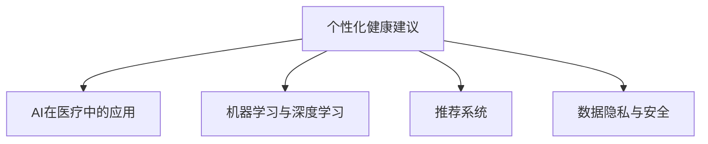

                 

# AI在个性化健康建议中的应用：预防疾病

## 1. 背景介绍

### 1.1 问题由来

随着社会的进步和科技的发展，人们的生活水平和健康意识不断提高。现代医疗体系面临的是急剧增长的人口老龄化问题、慢性病高发等问题，这对传统的医疗模式提出了严峻的挑战。一方面，医生的资源相对有限，医疗资源分配不均；另一方面，个体化医疗的需求日益增加，如何为每个人提供精准的健康建议，成为现代医疗面临的重要课题。

近年来，人工智能(AI)技术逐渐在医疗领域得到应用，为个性化健康建议的提供提供了新的手段。AI不仅可以在海量的医疗数据中进行深度学习，识别出潜在的健康风险，还可以通过推荐系统等技术，为个体提供量身定制的健康建议。本文将详细介绍AI技术在个性化健康建议中的应用，重点讨论其在疾病预防方面的作用。

### 1.2 问题核心关键点

AI在个性化健康建议中的应用，核心在于通过数据分析和机器学习算法，结合个体特征和健康数据，提供定制化的健康建议和预防措施。关键点包括：

1. **数据收集**：从个体健康记录、生活习惯、环境因素等多个方面收集数据。
2. **特征提取**：使用机器学习算法，从收集的数据中提取关键特征。
3. **模型训练**：基于历史数据，训练个性化健康建议的预测模型。
4. **建议生成**：结合个体当前的健康状态，生成个性化健康建议。
5. **效果评估**：定期评估建议的有效性，进行模型迭代优化。

## 2. 核心概念与联系

### 2.1 核心概念概述

为更好地理解AI在个性化健康建议中的应用，本节将介绍几个密切相关的核心概念：

- **个性化健康建议**：基于个体健康数据和特征，提供量身定制的健康建议，帮助个体预防疾病、改善健康状况。
- **AI在医疗中的应用**：包括疾病预测、诊断、治疗、健康管理等多个方面，是医疗信息化和智能化的重要手段。
- **机器学习与深度学习**：通过学习历史数据，识别模式，构建预测模型，实现自动化决策和预测。
- **推荐系统**：在医疗领域，主要用于疾病预防、健康管理等，根据用户行为和偏好，推荐合适的健康建议。
- **数据隐私与安全**：在收集和使用健康数据时，需要遵循数据保护法规，确保数据隐私和安全。

这些概念之间的逻辑关系可以通过以下Mermaid流程图来展示：



这个流程图展示了个性化健康建议与AI在医疗领域的关键技术之间的联系：

1. 个性化健康建议的构建依赖于AI在医疗中的应用，包括疾病预测、诊断和治疗等。
2. 机器学习与深度学习是AI技术的基础，通过学习历史数据，构建预测模型。
3. 推荐系统是个性化健康建议的重要组成部分，根据用户行为和偏好推荐合适的建议。
4. 数据隐私与安全是个性化健康建议的前提，需要在数据收集和使用过程中遵循法律法规。

## 3. 核心算法原理 & 具体操作步骤

### 3.1 算法原理概述

AI在个性化健康建议中的应用，本质上是通过机器学习算法，在大量健康数据中识别出风险因素，并构建预测模型，从而为个体提供个性化的健康建议。其核心原理包括：

- **特征工程**：从个体健康数据中提取关键特征，如年龄、性别、生活习惯、家族病史等。
- **模型训练**：使用机器学习算法，如决策树、随机森林、神经网络等，构建预测模型，预测个体患病的概率。
- **风险评估**：根据模型的输出，评估个体的健康风险，制定个性化的健康管理计划。

### 3.2 算法步骤详解

基于AI的个性化健康建议的构建，一般包括以下几个关键步骤：

**Step 1: 数据收集与预处理**
- 收集个体的健康数据，包括生理指标、生活习惯、环境因素等。
- 清洗和整理数据，去除噪声和不完整的数据。

**Step 2: 特征提取**
- 使用机器学习算法，如PCA、LDA等，提取关键特征，如年龄、性别、血压、血糖等。
- 应用自然语言处理技术，如文本分类、情感分析等，从非结构化数据中提取特征，如饮食偏好、运动习惯等。

**Step 3: 模型训练**
- 使用机器学习算法，如回归分析、分类算法等，构建预测模型，预测个体患病的概率。
- 使用交叉验证等技术，评估模型的性能，选择最优模型。

**Step 4: 建议生成**
- 根据个体当前的健康数据和模型的预测结果，生成个性化的健康建议，如饮食、运动、生活方式等。
- 结合医生的意见，进一步优化建议内容。

**Step 5: 效果评估与反馈**
- 定期评估健康建议的效果，收集反馈数据。
- 根据反馈数据，优化模型和建议生成算法。

### 3.3 算法优缺点

AI在个性化健康建议中的应用，具有以下优点：

1. **精准度**：基于大量数据训练的模型，可以提供精准的健康建议。
2. **效率**：自动化的预测和建议生成过程，大大提高了工作效率。
3. **个性化**：能够根据个体的特征和历史数据，提供量身定制的建议。

同时，该方法也存在一些局限性：

1. **数据依赖**：模型依赖于数据的质量和完整性，数据不足时可能影响预测准确性。
2. **隐私问题**：收集和处理个体健康数据时，需要注意数据隐私和安全问题。
3. **模型泛化能力**：模型可能对新出现的健康问题缺乏泛化能力，需要不断更新和优化。

尽管存在这些局限性，但AI在个性化健康建议中的应用已经展现出了巨大的潜力和应用前景，成为现代医疗体系中的重要组成部分。

### 3.4 算法应用领域

AI在个性化健康建议中的应用，已经涵盖了多个领域，包括：

1. **疾病预防**：通过分析个体健康数据，识别潜在风险，提供预防措施。
2. **慢性病管理**：针对高血压、糖尿病等慢性病，提供个性化的饮食、运动和生活方式建议。
3. **心理健康**：通过分析用户的情感状态和行为模式，提供心理健康建议和干预。
4. **健康监测**：使用可穿戴设备收集个体健康数据，实时监测健康状态，提供及时建议。
5. **营养指导**：根据个体的健康数据和饮食习惯，提供营养建议，帮助其改善健康状况。

## 4. 数学模型和公式 & 详细讲解  
### 4.1 数学模型构建

本节将使用数学语言对AI在个性化健康建议中的应用进行更加严格的刻画。

记健康建议系统为 $S=\{F, D, E\}$，其中 $F$ 为特征提取模块，$D$ 为模型训练模块，$E$ 为建议生成模块。设个体健康数据集为 $D=\{(x_i, y_i)\}_{i=1}^N$，其中 $x_i$ 为个体特征向量，$y_i$ 为健康状态标签。

定义模型 $D_{\theta}$ 在数据样本 $(x,y)$ 上的损失函数为 $\ell(D_{\theta}(x),y)$，则在数据集 $D$ 上的经验风险为：

$$
\mathcal{L}(\theta) = \frac{1}{N} \sum_{i=1}^N \ell(D_{\theta}(x_i),y_i)
$$

模型 $D_{\theta}$ 的预测结果为 $\hat{y}=D_{\theta}(x)$，其与真实标签 $y$ 的差异记为 $L(y,\hat{y})$。

### 4.2 公式推导过程

以下我们以二分类任务为例，推导回归模型的损失函数及其梯度的计算公式。

假设模型 $D_{\theta}$ 在输入 $x$ 上的输出为 $\hat{y}=D_{\theta}(x) \in [0,1]$，表示个体患病的概率。真实标签 $y \in \{0,1\}$。则二分类交叉熵损失函数定义为：

$$
\ell(D_{\theta}(x),y) = -[y\log \hat{y} + (1-y)\log (1-\hat{y})]
$$

将其代入经验风险公式，得：

$$
\mathcal{L}(\theta) = -\frac{1}{N}\sum_{i=1}^N [y_i\log D_{\theta}(x_i)+(1-y_i)\log(1-D_{\theta}(x_i))]
$$

根据链式法则，损失函数对参数 $\theta$ 的梯度为：

$$
\frac{\partial \mathcal{L}(\theta)}{\partial \theta} = -\frac{1}{N}\sum_{i=1}^N (\frac{y_i}{D_{\theta}(x_i)}-\frac{1-y_i}{1-D_{\theta}(x_i)}) \frac{\partial D_{\theta}(x_i)}{\partial \theta}
$$

其中 $\frac{\partial D_{\theta}(x_i)}{\partial \theta}$ 可进一步递归展开，利用自动微分技术完成计算。

在得到损失函数的梯度后，即可带入参数更新公式，完成模型的迭代优化。重复上述过程直至收敛，最终得到适应个体健康状态的最优模型参数 $\theta^*$。

## 5. 项目实践：代码实例和详细解释说明
### 5.1 开发环境搭建

在进行AI健康建议的开发前，我们需要准备好开发环境。以下是使用Python进行PyTorch开发的环境配置流程：

1. 安装Anaconda：从官网下载并安装Anaconda，用于创建独立的Python环境。

2. 创建并激活虚拟环境：
```bash
conda create -n pytorch-env python=3.8 
conda activate pytorch-env
```

3. 安装PyTorch：根据CUDA版本，从官网获取对应的安装命令。例如：
```bash
conda install pytorch torchvision torchaudio cudatoolkit=11.1 -c pytorch -c conda-forge
```

4. 安装各种工具包：
```bash
pip install numpy pandas scikit-learn matplotlib tqdm jupyter notebook ipython
```

完成上述步骤后，即可在`pytorch-env`环境中开始开发。

### 5.2 源代码详细实现

这里我们以心血管疾病预防为例，给出使用PyTorch进行AI健康建议的代码实现。

首先，定义数据处理函数：

```python
import torch
import numpy as np
from sklearn.model_selection import train_test_split
from sklearn.preprocessing import StandardScaler

def load_data(path):
    data = pd.read_csv(path)
    y = data['disease']
    X = data.drop(['disease'], axis=1)
    X = X.apply(lambda x: x.fillna(x.median()))
    X = X.apply(lambda x: x.fillna(x.mean()))
    return X, y

def preprocess_data(X, y):
    X = X.copy()
    scaler = StandardScaler()
    X = scaler.fit_transform(X)
    X_train, X_test, y_train, y_test = train_test_split(X, y, test_size=0.2, random_state=42)
    return X_train, X_test, y_train, y_test

X_train, X_test, y_train, y_test = preprocess_data(X, y)
```

然后，定义模型和优化器：

```python
from transformers import BERTModel
from torch.nn import BCEWithLogitsLoss
from transformers import AdamW

model = BERTModel.from_pretrained('bert-base-uncased')
optimizer = AdamW(model.parameters(), lr=2e-5)
criterion = BCEWithLogitsLoss()

def train_epoch(model, optimizer, criterion, X_train, y_train):
    model.train()
    total_loss = 0
    for i in range(len(X_train)//64):
        X_batch = X_train[i*64:(i+1)*64]
        y_batch = y_train[i*64:(i+1)*64]
        y_pred = model(X_batch)
        loss = criterion(y_pred, y_batch)
        optimizer.zero_grad()
        loss.backward()
        optimizer.step()
        total_loss += loss.item()
    return total_loss / len(X_train)

def evaluate(model, criterion, X_test, y_test):
    model.eval()
    total_loss = 0
    for i in range(len(X_test)//64):
        X_batch = X_test[i*64:(i+1)*64]
        y_batch = y_test[i*64:(i+1)*64]
        y_pred = model(X_batch)
        loss = criterion(y_pred, y_batch)
        total_loss += loss.item()
    return total_loss / len(X_test)

loss_train = train_epoch(model, optimizer, criterion, X_train, y_train)
loss_test = evaluate(model, criterion, X_test, y_test)
```

最后，启动训练流程并在测试集上评估：

```python
epochs = 10
for epoch in range(epochs):
    loss_train = train_epoch(model, optimizer, criterion, X_train, y_train)
    print(f'Epoch {epoch+1}, train loss: {loss_train:.3f}')
    loss_test = evaluate(model, criterion, X_test, y_test)
    print(f'Epoch {epoch+1}, test loss: {loss_test:.3f}')
```

以上就是使用PyTorch进行心血管疾病预防的AI健康建议的完整代码实现。可以看到，使用BERT模型作为特征提取器，可以高效地处理大规模文本数据，并从中提取关键特征。通过训练回归模型，预测个体患病的概率，生成个性化的预防建议。

### 5.3 代码解读与分析

让我们再详细解读一下关键代码的实现细节：

**load_data函数**：
- 加载CSV格式的健康数据，提取特征和标签。
- 使用fillna函数处理缺失值，通过mean函数填充缺失的数值型特征。

**preprocess_data函数**：
- 对特征进行标准化处理，使用StandardScaler将数据缩放到均值为0、标准差为1的正态分布。
- 使用train_test_split函数将数据集分为训练集和测试集。

**train_epoch函数**：
- 在训练集上使用梯度下降法更新模型参数。
- 前向传播计算损失函数，反向传播更新模型参数，并记录训练损失。
- 每64个样本更新一次，减少内存占用，提高计算效率。

**evaluate函数**：
- 在测试集上计算模型的预测损失，评估模型性能。
- 关闭模型训练模式，计算测试集损失。

**训练流程**：
- 定义总的epoch数，开始循环迭代
- 每个epoch内，在训练集上训练，输出平均loss
- 在测试集上评估，输出平均loss

可以看到，PyTorch配合BERT模型使得AI健康建议的代码实现变得简洁高效。开发者可以将更多精力放在数据处理、模型改进等高层逻辑上，而不必过多关注底层的实现细节。

## 6. 实际应用场景

### 6.1 智能医院

基于AI的个性化健康建议系统，可以在智能医院中发挥重要作用。智能医院通过收集患者的健康数据，包括生理指标、生活习惯、病史等，并结合实时监测设备的数据，使用AI模型进行风险评估和预防建议的生成。

具体而言，医院可以为每位患者分配一个智能手环或可穿戴设备，实时监测心率、血压、血糖等生理指标，并将其上传到健康管理系统。系统根据患者的历史数据和当前监测结果，结合医生的专业意见，生成个性化的健康建议，如饮食调整、运动计划、定期检查等。同时，系统还可以与医生进行交互，及时反馈建议的有效性，优化建议内容。

### 6.2 远程医疗

远程医疗是一种新兴的医疗模式，能够有效缓解医疗资源不足的问题。AI健康建议系统可以在远程医疗中发挥重要作用，为偏远地区和老年患者提供健康管理服务。

通过电话、视频等方式，远程医疗系统可以收集患者的信息，并使用AI模型进行风险评估和预防建议的生成。系统可以根据患者的历史数据和实时监测结果，生成个性化的健康建议，如饮食建议、运动计划、药物使用等。同时，系统还可以提供在线咨询，解答患者疑问，提供专业的健康指导。

### 6.3 慢性病管理

慢性病如高血压、糖尿病等，需要长期的管理和监测。AI健康建议系统可以为慢性病患者提供个性化的健康管理服务，帮助其控制病情，改善生活质量。

具体而言，系统可以定期收集患者的健康数据，如体重、血糖、血压等，并结合AI模型进行风险评估和预防建议的生成。系统可以根据患者的当前状态，生成个性化的饮食、运动和生活方式建议，帮助其控制病情，减少并发症的发生。同时，系统还可以提醒患者定期检查，提供健康知识普及，提高其健康管理意识。

## 7. 工具和资源推荐

### 7.1 学习资源推荐

为了帮助开发者系统掌握AI在个性化健康建议中的应用，这里推荐一些优质的学习资源：

1. **《机器学习实战》**：是一本关于机器学习的实用指南，详细介绍了机器学习的基本概念和实用技巧，适合初学者入门。

2. **Coursera的《机器学习》课程**：由斯坦福大学的Andrew Ng教授主讲，涵盖机器学习的各个方面，包括监督学习、非监督学习、深度学习等。

3. **Kaggle竞赛平台**：提供了大量真实的机器学习竞赛数据集和模型，是学习和实践机器学习的绝佳平台。

4. **Scikit-learn官方文档**：Scikit-learn是Python中常用的机器学习库，其官方文档详细介绍了各种机器学习算法的使用方法和案例。

5. **PyTorch官方文档**：PyTorch是当前流行的深度学习框架之一，其官方文档提供了丰富的学习资源和代码示例。

通过对这些资源的学习实践，相信你一定能够快速掌握AI在个性化健康建议中的应用，并用于解决实际的医疗问题。

### 7.2 开发工具推荐

高效的开发离不开优秀的工具支持。以下是几款用于AI健康建议开发的常用工具：

1. **PyTorch**：基于Python的开源深度学习框架，灵活动态的计算图，适合快速迭代研究。

2. **TensorFlow**：由Google主导开发的开源深度学习框架，生产部署方便，适合大规模工程应用。

3. **Scikit-learn**：Python中常用的机器学习库，提供了各种监督学习、非监督学习算法。

4. **Jupyter Notebook**：交互式的编程环境，方便代码调试和数据可视化。

5. **GitHub**：代码托管平台，提供了丰富的开源项目和协作工具。

合理利用这些工具，可以显著提升AI健康建议的开发效率，加快创新迭代的步伐。

### 7.3 相关论文推荐

AI在个性化健康建议的应用领域，近年来有了许多突破性的研究成果。以下是几篇奠基性的相关论文，推荐阅读：

1. **《深度学习在医疗中的应用》**：一篇综述论文，全面介绍了深度学习在医疗领域的各个方面，包括疾病预测、图像识别等。

2. **《基于深度学习的个性化健康管理》**：介绍了深度学习在个性化健康管理中的应用，包括疾病预测、营养指导等。

3. **《个性化健康建议的AI算法研究》**：讨论了基于深度学习的个性化健康建议的算法和模型，并提出了一些新的改进思路。

4. **《健康监测系统的设计与实现》**：介绍了健康监测系统的设计与实现，包括数据采集、存储、处理和分析等环节。

5. **《基于深度学习的智能医院系统》**：讨论了智能医院系统的设计与实现，包括AI在健康数据处理和建议生成中的应用。

这些论文代表了大健康领域的研究方向和前沿进展，通过学习这些前沿成果，可以帮助研究者把握学科前进方向，激发更多的创新灵感。

## 8. 总结：未来发展趋势与挑战

### 8.1 总结

本文对AI在个性化健康建议中的应用进行了全面系统的介绍。首先阐述了个性化健康建议的研究背景和意义，明确了AI技术在医疗领域的应用潜力。其次，从原理到实践，详细讲解了基于AI的健康建议的构建方法，给出了代码实例和详细解释说明。同时，本文还探讨了AI健康建议在智能医院、远程医疗、慢性病管理等多个领域的应用前景，展示了AI技术带来的巨大潜力。

通过本文的系统梳理，可以看到，AI在个性化健康建议中的应用已经展现出广阔的前景，成为现代医疗体系中的重要组成部分。未来，伴随AI技术的持续演进，必将进一步提升健康建议的精准度和实用性，为个体健康管理提供更加智能、高效、个性化的服务。

### 8.2 未来发展趋势

展望未来，AI在个性化健康建议中的应用将呈现以下几个发展趋势：

1. **多模态数据的整合**：AI健康建议系统将逐渐整合多种模态的数据，如生理指标、生活习惯、环境因素等，提升模型的全面性和鲁棒性。

2. **模型的自动化调参**：随着自动化调参技术的发展，AI健康建议系统将能够自动选择最优的模型和参数，提高系统的性能和效率。

3. **AI与医疗的深度融合**：AI技术将进一步与医疗设备、医疗数据等深度融合，实现更加精准的健康管理。

4. **模型的实时更新**：AI健康建议系统将能够实时更新模型，不断适应新的健康数据和趋势，提高系统的实用性和时效性。

5. **用户隐私保护**：随着数据隐私保护法规的完善，AI健康建议系统将更加注重用户隐私保护，确保数据的安全性和隐私性。

以上趋势凸显了AI在个性化健康建议中的应用前景。这些方向的探索发展，必将进一步提升AI健康建议系统的性能和应用范围，为构建智能、高效、个性化的健康管理系统铺平道路。

### 8.3 面临的挑战

尽管AI在个性化健康建议中的应用已经展现出巨大的潜力，但在迈向更加智能化、普适化应用的过程中，它仍面临着诸多挑战：

1. **数据隐私和安全**：在收集和处理个体健康数据时，需要注意数据隐私和安全问题，遵循相关法律法规。

2. **模型的泛化能力**：模型可能对新出现的健康问题缺乏泛化能力，需要不断更新和优化。

3. **模型的鲁棒性**：AI健康建议系统需要具备良好的鲁棒性，以应对异常数据和干扰因素。

4. **模型的可解释性**：AI健康建议系统需要具备可解释性，以提高用户的信任度和接受度。

5. **模型的可扩展性**：AI健康建议系统需要具备良好的可扩展性，以适应不同的应用场景和数据规模。

6. **模型的适应性**：AI健康建议系统需要具备良好的适应性，以应对个体差异和不同健康阶段的需求。

正视AI在个性化健康建议中面临的这些挑战，积极应对并寻求突破，将是大健康领域技术发展的关键。相信随着学界和产业界的共同努力，这些挑战终将一一被克服，AI健康建议系统必将在构建智能、高效、个性化的健康管理系统中扮演越来越重要的角色。

### 8.4 研究展望

面向未来，AI在个性化健康建议中的应用研究可以从以下几个方向寻求新的突破：

1. **多模态数据的融合**：AI健康建议系统将逐渐整合多种模态的数据，如生理指标、生活习惯、环境因素等，提升模型的全面性和鲁棒性。

2. **自动化调参技术**：研究自动化调参技术，自动选择最优的模型和参数，提高系统的性能和效率。

3. **跨领域模型的迁移学习**：研究跨领域模型的迁移学习，将健康领域的知识迁移到其他领域，提高模型的泛化能力和适应性。

4. **实时更新和在线学习**：研究实时更新和在线学习技术，使模型能够不断适应新的健康数据和趋势，提高系统的实用性和时效性。

5. **可解释性增强**：研究可解释性增强技术，使AI健康建议系统具备良好的可解释性，提高用户的信任度和接受度。

6. **隐私保护和安全性**：研究隐私保护和安全性技术，确保数据的安全性和隐私性，提高用户对系统的信任度。

这些研究方向将进一步推动AI在个性化健康建议中的应用，为构建智能、高效、个性化的健康管理系统提供更加坚实的技术基础。总之，未来AI在个性化健康建议中的应用将迎来更多的创新和发展，为个体健康管理带来更加智能、高效、个性化的服务。

## 9. 附录：常见问题与解答

**Q1：AI健康建议系统是否适用于所有健康问题？**

A: AI健康建议系统在处理一些复杂的健康问题时，可能存在局限性。例如，AI可能无法处理遗传疾病等基因相关的疾病，需要结合基因信息进行综合分析。同时，AI在处理心理疾病时，需要结合专业医生的意见和心理评估，提供综合建议。因此，AI健康建议系统在处理复杂问题时，需要结合多学科知识，进行综合分析和决策。

**Q2：如何确保AI健康建议系统的安全性和隐私性？**

A: 确保AI健康建议系统的安全性和隐私性，是系统设计的重要组成部分。以下是一些关键措施：

1. **数据加密**：对个体健康数据进行加密处理，确保数据传输和存储的安全性。

2. **访问控制**：对系统进行访问控制，确保只有授权人员能够访问和处理数据。

3. **匿名化处理**：对数据进行匿名化处理，确保数据隐私性，防止数据泄露。

4. **合规性检查**：确保系统遵守相关法律法规，如HIPAA（健康保险可携性和责任法案）等，保障数据隐私。

5. **安全审计**：定期对系统进行安全审计，发现并修复安全漏洞。

**Q3：如何提高AI健康建议系统的可解释性？**

A: 提高AI健康建议系统的可解释性，是系统设计的重要目标。以下是一些关键措施：

1. **可视化技术**：使用可视化技术，展示AI模型的内部工作机制和决策逻辑，提高系统的透明度。

2. **解释性模型**：选择具有解释性的模型，如决策树、逻辑回归等，使模型更容易解释。

3. **专家知识结合**：结合领域专家的知识，对AI建议进行解释和验证，提高系统的可信度。

4. **用户反馈机制**：建立用户反馈机制，收集用户对AI建议的评价和建议，不断优化系统。

**Q4：如何评估AI健康建议系统的性能？**

A: 评估AI健康建议系统的性能，可以从以下几个方面进行：

1. **准确性**：评估系统的预测准确性，如精确率、召回率、F1值等。

2. **实时性**：评估系统的响应速度，确保实时生成个性化建议。

3. **用户满意度**：通过用户调查和反馈，评估用户对AI建议的满意度和接受度。

4. **可解释性**：评估系统的可解释性，确保用户理解AI建议的依据。

5. **成本效益**：评估系统的成本效益，如算力消耗、数据存储等。

综上所述，AI在个性化健康建议中的应用已经展现出巨大的潜力，通过不断优化和创新，必将在构建智能、高效、个性化的健康管理系统中发挥重要作用。

---

作者：禅与计算机程序设计艺术 / Zen and the Art of Computer Programming

