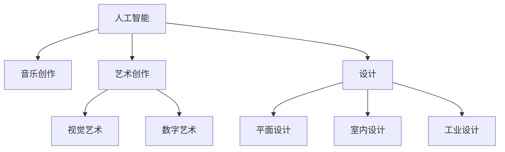

                 

# AI在创意产业中的应用：音乐、艺术与设计

> 关键词：AI艺术,音乐创作,设计,创意产业,艺术生成

## 1. 背景介绍

### 1.1 问题由来

随着人工智能技术的迅猛发展，AI已经深入到创意产业的各个角落。音乐创作、艺术创作、设计等传统领域开始迎来AI技术的改造和革新。AI不仅能够辅助艺术家完成创作，还能够生成全新的艺术作品，为创意产业带来了前所未有的可能性。

AI在音乐创作中，能够根据旋律、歌词、节奏等元素，生成风格独特的音乐作品。在艺术创作中，AI能够通过对大量艺术作品的学习，生成具有独特风格和创意的艺术作品。在设计和图形领域，AI可以快速生成具有创意的设计和图形。AI技术的运用，使得这些领域从过去的手工劳动，逐渐转变为基于智能算法和数据的自动化创作。

### 1.2 问题核心关键点

AI在创意产业中的应用主要集中在以下几个方面：

- **音乐创作**：AI能够根据输入的旋律、歌词或风格，自动生成符合用户期望的音乐作品。
- **艺术创作**：AI通过学习历史和当代艺术作品，生成新颖独特的艺术作品，如绘画、雕塑、摄影等。
- **设计**：AI能够生成具有创意的设计作品，如平面设计、室内设计、工业设计等。

这些应用不仅提高了创作效率，还为艺术家提供了更多的灵感来源，使创意产业实现了前所未有的飞跃。然而，这些技术应用也带来了一些挑战，如版权问题、作品原创性、伦理道德等。

## 2. 核心概念与联系

### 2.1 核心概念概述

为了更好地理解AI在创意产业中的应用，本节将介绍几个关键概念：

- **人工智能(AI)**：利用计算机算法和数据，使机器能够模拟人类智能行为的技术。
- **音乐创作**：基于声音、旋律、节奏等元素，创作音乐作品的过程。
- **艺术创作**：利用视觉、听觉、文本等元素，创作艺术作品的过程。
- **设计**：通过合理的规划和设计，满足用户需求的过程。
- **创意产业**：以创意和艺术为核心，提供创意产品和服务，如电影、音乐、艺术、设计等产业。

这些概念之间的关系可以通过以下Mermaid流程图来展示：



这个流程图展示了AI在创意产业中各个领域的应用情况，以及它们之间的关系。

## 3. 核心算法原理 & 具体操作步骤

### 3.1 算法原理概述

AI在创意产业中的应用主要基于机器学习和深度学习的技术。通过大量数据的训练，AI模型能够自动发现数据中的模式和规律，进而进行创作或生成。这一过程通常包括以下几个步骤：

1. **数据收集**：收集与创意产业相关的数据，如音乐数据、艺术数据、设计数据等。
2. **数据预处理**：对收集到的数据进行清洗、归一化等处理，以便于后续的模型训练。
3. **模型训练**：使用机器学习或深度学习算法，训练出适合于特定任务的模型。
4. **模型评估**：对训练好的模型进行评估，确保其满足实际应用需求。
5. **作品生成**：使用训练好的模型，根据用户输入生成新的作品。

### 3.2 算法步骤详解

以下是AI在创意产业中应用的详细操作步骤：

**Step 1: 数据收集**

数据收集是AI应用的基础。对于音乐创作，需要收集各种风格的音乐，对于艺术创作，需要收集不同风格、不同年代的绘画、雕塑等作品，对于设计，需要收集各种风格的平面设计、室内设计等作品。

**Step 2: 数据预处理**

数据预处理包括数据清洗、归一化、特征提取等步骤。对于音乐数据，需要进行节奏、旋律、歌词等特征提取；对于艺术数据，需要进行色彩、形状、纹理等特征提取；对于设计数据，需要进行形状、颜色、布局等特征提取。

**Step 3: 模型训练**

模型训练是AI应用的核心。对于音乐创作，可以使用生成对抗网络(GAN)等模型进行音乐生成；对于艺术创作，可以使用GAN、变分自编码器(VAE)等模型进行艺术生成；对于设计，可以使用生成式对抗网络(GAN)、风格迁移等模型进行设计生成。

**Step 4: 模型评估**

模型评估是确保AI应用效果的关键步骤。对于音乐创作，可以通过听众调查、专家评估等方式进行评估；对于艺术创作，可以通过专家评审、公众投票等方式进行评估；对于设计，可以通过用户反馈、市场反应等方式进行评估。

**Step 5: 作品生成**

作品生成是AI应用的具体体现。对于音乐创作，可以根据用户输入的旋律、歌词等生成音乐；对于艺术创作，可以根据用户输入的风格、主题等生成艺术作品；对于设计，可以根据用户输入的需求生成设计方案。

### 3.3 算法优缺点

AI在创意产业中的应用具有以下优点：

1. **效率提升**：AI能够自动进行数据分析和创作，大大提高了创作效率。
2. **创新性**：AI能够生成具有独特风格和创意的作品，为创意产业带来新的灵感。
3. **成本降低**：AI减少了人力成本，使创作变得更加低成本、高效率。

同时，AI在创意产业中也有一些缺点：

1. **原创性争议**：AI生成的作品是否具有原创性，是否侵犯版权，是一个备受争议的问题。
2. **伦理道德问题**：AI在生成艺术作品时，可能涉及到伦理道德问题，如是否尊重历史和当代艺术家的创作成果。
3. **技术局限**：目前的AI技术仍有一定的技术局限，生成的作品可能不够完美，仍需要人工进行优化。

### 3.4 算法应用领域

AI在创意产业中的应用涵盖了多个领域，包括：

- **音乐创作**：AI能够自动生成音乐作品，如MuseScore等音乐创作平台已经利用AI生成音乐作品。
- **艺术创作**：AI能够生成绘画、雕塑、摄影等艺术作品，如DeepArt等应用已经可以让用户通过图片生成艺术作品。
- **设计**：AI能够生成平面设计、室内设计、工业设计等设计方案，如DeepDesign等应用已经可以自动生成设计图。

这些应用不仅提升了创作效率，还为艺术家提供了更多的灵感来源，使得创意产业实现了前所未有的飞跃。

## 4. 数学模型和公式 & 详细讲解 & 举例说明

### 4.1 数学模型构建

AI在创意产业中的应用主要基于机器学习和深度学习的数学模型。这些模型通常包括以下几种：

- **生成对抗网络(GAN)**：由生成器和判别器两个部分组成，通过对抗学习生成新作品。
- **变分自编码器(VAE)**：通过编码器将输入数据压缩到低维空间，通过解码器将低维数据生成新作品。
- **神经网络**：通过多层神经网络，学习输入数据的特征，生成新作品。

### 4.2 公式推导过程

以GAN为例，其基本原理可以通过以下数学公式来描述：

$$
G_{\theta_G}(z) \rightarrow x
$$

$$
D_{\theta_D}(x) \rightarrow y \in \{0,1\}
$$

其中，$G_{\theta_G}$和$D_{\theta_D}$分别是生成器和判别器，$z$是随机噪声向量，$x$是生成器输出的新作品，$y$是判别器对$x$的判别结果。GAN的目标是让生成器$G_{\theta_G}$生成的作品尽可能接近真实作品，让判别器$D_{\theta_D}$尽可能准确地判断作品的真伪。

### 4.3 案例分析与讲解

以下是GAN在音乐创作中的应用案例：

- **音乐生成**：通过输入一段旋律，GAN能够自动生成一段新的音乐作品。例如，DeepMusic使用GAN模型，根据用户输入的旋律生成新的音乐片段。
- **音乐风格转换**：通过输入一段音乐作品，GAN能够将其转换为其他风格。例如，Music Transformer使用GAN模型，将古典音乐转换为流行音乐。

## 5. 项目实践：代码实例和详细解释说明

### 5.1 开发环境搭建

在进行AI在创意产业中的应用实践前，我们需要准备好开发环境。以下是使用Python进行TensorFlow开发的环境配置流程：

1. 安装Anaconda：从官网下载并安装Anaconda，用于创建独立的Python环境。

2. 创建并激活虚拟环境：
```bash
conda create -n tf-env python=3.8 
conda activate tf-env
```

3. 安装TensorFlow：根据CUDA版本，从官网获取对应的安装命令。例如：
```bash
conda install tensorflow -c conda-forge -c pytorch
```

4. 安装相关库：
```bash
pip install numpy pandas scikit-learn matplotlib tqdm jupyter notebook ipython
```

完成上述步骤后，即可在`tf-env`环境中开始AI在创意产业中的应用实践。

### 5.2 源代码详细实现

这里我们以GAN在音乐创作中的应用为例，给出使用TensorFlow进行GAN模型训练的Python代码实现。

首先，定义GAN的生成器和判别器：

```python
import tensorflow as tf
from tensorflow.keras import layers

# 生成器
def generator_model():
    model = tf.keras.Sequential()
    model.add(layers.Dense(256, input_shape=(100,)))
    model.add(layers.BatchNormalization())
    model.add(layers.LeakyReLU())
    model.add(layers.Dense(512))
    model.add(layers.BatchNormalization())
    model.add(layers.LeakyReLU())
    model.add(layers.Dense(1024))
    model.add(layers.BatchNormalization())
    model.add(layers.LeakyReLU())
    model.add(layers.Dense(784, activation='tanh'))
    return model

# 判别器
def discriminator_model():
    model = tf.keras.Sequential()
    model.add(layers.Dense(1024, input_shape=(784,)))
    model.add(layers.LeakyReLU())
    model.add(layers.Dropout(0.2))
    model.add(layers.Dense(512))
    model.add(layers.LeakyReLU())
    model.add(layers.Dropout(0.2))
    model.add(layers.Dense(256))
    model.add(layers.LeakyReLU())
    model.add(layers.Dropout(0.2))
    model.add(layers.Dense(1, activation='sigmoid'))
    return model
```

然后，定义GAN的训练函数：

```python
@tf.function
def train_step(images):
    noise = tf.random.normal([BATCH_SIZE, 100])

    with tf.GradientTape() as gen_tape, tf.GradientTape() as disc_tape:
        generated_images = gen_model(noise)

        real_output = disc_model(images)
        fake_output = disc_model(generated_images)

        gen_loss = gen_loss_object(gen_output, real_output)
        disc_loss = disc_loss_object(fake_output, real_output)

    gradients_of_generator = gen_tape.gradient(gen_loss, gen_model.trainable_variables)
    gradients_of_discriminator = disc_tape.gradient(disc_loss, disc_model.trainable_variables)

    gen_optimizer.apply_gradients(zip(gradients_of_generator, gen_model.trainable_variables))
    disc_optimizer.apply_gradients(zip(gradients_of_discriminator, disc_model.trainable_variables))

# 训练函数
def train_gan():
    for epoch in range(EPOCHS):
        for image_batch in train_dataset:
            train_step(image_batch)
```

最后，启动GAN模型训练流程：

```python
BATCH_SIZE = 256
EPOCHS = 100

gen_model = generator_model()
disc_model = discriminator_model()

gen_optimizer = tf.keras.optimizers.Adam(1e-4)
disc_optimizer = tf.keras.optimizers.Adam(1e-4)

train_dataset = ... # 数据集加载

train_gan()
```

以上就是使用TensorFlow进行GAN模型训练的完整代码实现。可以看到，利用TensorFlow的高阶API，可以非常方便地实现GAN模型的构建和训练。

### 5.3 代码解读与分析

让我们再详细解读一下关键代码的实现细节：

**定义生成器和判别器模型**：
- 生成器模型由多个全连接层、批归一化、LeakyReLU激活函数等组成，能够将随机噪声向量转换为音乐作品。
- 判别器模型由多个全连接层、LeakyReLU激活函数、Dropout等组成，能够判断输入的音乐作品是真实作品还是生成作品。

**定义训练函数**：
- 在每个训练步中，首先生成随机噪声向量，然后通过生成器生成音乐作品。
- 分别计算生成器输出和真实作品的判别器输出，以及生成器输出和生成作品（即噪声通过生成器生成的音乐作品）的判别器输出。
- 根据生成器和判别器的输出计算损失函数，并使用Adam优化器更新模型参数。

**启动训练流程**：
- 定义训练数据集，加载音乐作品。
- 循环进行多轮训练，每轮训练中，在训练数据集上依次遍历每个数据批次，进行一次训练步。

可以看到，TensorFlow提供的高级API使得模型的构建和训练变得非常简单，开发者可以将更多精力放在问题建模和算法优化上，而不必过多关注底层实现细节。

## 6. 实际应用场景

### 6.1 音乐创作

GAN在音乐创作中的应用非常广泛。通过训练基于音乐的GAN模型，可以自动生成新的音乐作品。例如，DeepMusic使用GAN模型，根据用户输入的旋律生成新的音乐片段，并能够进行风格转换。

### 6.2 艺术创作

GAN在艺术创作中的应用也非常广泛。通过训练基于艺术作品的GAN模型，可以自动生成新的绘画、雕塑等艺术作品。例如，DeepArt使用GAN模型，将用户上传的图片转换为不同的艺术风格。

### 6.3 设计

GAN在设计中的应用也越来越受到关注。通过训练基于设计的GAN模型，可以自动生成新的平面设计、室内设计等设计方案。例如，DeepDesign使用GAN模型，自动生成平面设计图。

### 6.4 未来应用展望

随着AI技术的不断进步，基于GAN等模型在创意产业中的应用前景将更加广阔。以下是一些未来的应用展望：

1. **音乐和艺术的深度融合**：未来，音乐和艺术创作将更加深度融合，AI将能够在不同创作形式间进行无缝切换，创作出更加独特和创新的作品。
2. **个性化创作**：基于用户偏好和历史数据，AI将能够生成个性化的音乐、艺术和设计作品，满足用户的独特需求。
3. **跨模态创作**：AI将能够在不同模态间进行跨模态创作，如音乐与视觉艺术的结合，创造出全新的艺术形式。
4. **创意协同**：AI将能够与人类艺术家进行协同创作，提供更多灵感和创意，提升创作效率和质量。
5. **实时创作**：AI将能够实现实时创作，如在线音乐创作平台，实时生成音乐作品，增强用户体验。

这些应用场景将进一步推动创意产业的发展，为AI技术带来更多的应用场景和创新机会。

## 7. 工具和资源推荐

### 7.1 学习资源推荐

为了帮助开发者系统掌握AI在创意产业中的应用，这里推荐一些优质的学习资源：

1. Coursera《深度学习》课程：由斯坦福大学Andrew Ng教授开设，全面介绍深度学习的理论和实践，适合初学者和进阶学习者。
2. Udacity《深度学习基础》纳米学位：Udacity提供的深度学习基础课程，从理论到实践，覆盖深度学习的基础知识和应用场景。
3. TensorFlow官方文档：TensorFlow提供的详细文档，涵盖模型的构建、训练、部署等全流程，适合深入学习。
4. PyTorch官方文档：PyTorch提供的详细文档，涵盖模型的构建、训练、部署等全流程，适合深入学习。
5. GitHub上的相关项目：GitHub上丰富的开源项目和代码，如DeepMusic、DeepArt、DeepDesign等，可以学习和参考。

通过对这些资源的学习实践，相信你一定能够快速掌握AI在创意产业中的应用精髓，并用于解决实际的创意问题。

### 7.2 开发工具推荐

高效的开发离不开优秀的工具支持。以下是几款用于AI在创意产业中应用的常用工具：

1. TensorFlow：由Google主导开发的开源深度学习框架，生产部署方便，适合大规模工程应用。
2. PyTorch：基于Python的开源深度学习框架，灵活易用，适合快速迭代研究。
3. Jupyter Notebook：交互式的笔记本环境，便于开发者进行代码实验和协作。
4. GitHub：代码托管平台，便于开发者共享代码和交流。
5. Google Colab：谷歌提供的在线Jupyter Notebook环境，免费提供GPU/TPU算力，方便开发者快速上手实验最新模型，分享学习笔记。

合理利用这些工具，可以显著提升AI在创意产业中的应用开发效率，加快创新迭代的步伐。

### 7.3 相关论文推荐

AI在创意产业中的应用源于学界的持续研究。以下是几篇奠基性的相关论文，推荐阅读：

1. Progressive Growing of GANs for Improved Quality, Stability, and Variation：提出渐进式GAN方法，逐步提升模型质量。
2. StyleGAN：提出风格生成对抗网络，生成具有特定风格的艺术作品。
3. Music Transformer：提出基于音乐数据的GAN模型，生成不同风格的音乐作品。
4. DeepArt：提出基于艺术数据的GAN模型，生成不同风格的绘画作品。
5. DeepDesign：提出基于设计数据的GAN模型，生成不同风格的设计方案。

这些论文代表了大规模深度学习模型在创意产业中的应用方向，通过学习这些前沿成果，可以帮助研究者把握学科前进方向，激发更多的创新灵感。

## 8. 总结：未来发展趋势与挑战

### 8.1 总结

本文对AI在创意产业中的应用进行了全面系统的介绍。首先阐述了AI在创意产业中的作用和应用领域，明确了AI在音乐创作、艺术创作、设计等领域的应用价值。其次，从原理到实践，详细讲解了GAN模型的构建和训练过程，给出了AI在创意产业中的应用代码实例。同时，本文还广泛探讨了AI在创意产业中的应用前景，展示了AI技术在创意产业中的巨大潜力。

通过本文的系统梳理，可以看到，AI在创意产业中的应用已经取得了显著进展，为创意产业带来了前所未有的变革。未来，随着AI技术的不断进步，基于GAN等模型的创意应用将更加广泛和深入，推动创意产业迈向新的高度。

### 8.2 未来发展趋势

展望未来，AI在创意产业中的应用将呈现以下几个发展趋势：

1. **深度融合**：AI将与其他创意工具和技术进行深度融合，实现更加无缝的创作过程。
2. **个性化创作**：基于用户偏好和历史数据，AI将能够生成个性化的创意作品，满足用户的独特需求。
3. **跨模态创作**：AI将能够在不同模态间进行跨模态创作，如音乐与视觉艺术的结合，创造出全新的艺术形式。
4. **实时创作**：AI将能够实现实时创作，如在线音乐创作平台，实时生成音乐作品，增强用户体验。
5. **创意协同**：AI将能够与人类艺术家进行协同创作，提供更多灵感和创意，提升创作效率和质量。

这些趋势凸显了AI在创意产业中的重要地位，展示了AI技术在创意产业中的广阔前景。

### 8.3 面临的挑战

尽管AI在创意产业中的应用已经取得了显著进展，但在迈向更加智能化、普适化应用的过程中，仍面临着诸多挑战：

1. **版权问题**：AI生成的作品是否具有原创性，是否侵犯版权，是一个备受争议的问题。
2. **伦理道德问题**：AI在生成艺术作品时，可能涉及到伦理道德问题，如是否尊重历史和当代艺术家的创作成果。
3. **技术局限**：当前的AI技术仍有一定的技术局限，生成的作品可能不够完美，仍需要人工进行优化。
4. **实时性问题**：AI在实时创作过程中，可能面临计算资源和实时性能的限制。
5. **数据隐私**：在用户数据收集和处理过程中，如何保护用户隐私，是一个重要的挑战。

这些挑战需要学界和产业界共同努力，寻找解决方案，确保AI在创意产业中的应用能够健康、可持续地发展。

### 8.4 研究展望

面对AI在创意产业中面临的挑战，未来的研究需要在以下几个方面寻求新的突破：

1. **生成模型的优化**：开发更加高效、准确的生成模型，提高创意作品的品质和原创性。
2. **跨模态创作技术的突破**：在音乐、艺术、设计等领域进行跨模态创作，实现多模态数据的深度融合。
3. **伦理道德问题的解决**：建立伦理道德规范，确保AI在创意产业中的应用符合人类价值观和伦理道德。
4. **隐私保护技术的提升**：采用隐私保护技术，确保用户数据的隐私和安全。
5. **跨学科研究的融合**：跨学科研究结合AI、艺术、设计等领域，促进创新和突破。

这些研究方向的探索，必将引领AI在创意产业中的应用迈向更高的台阶，为构建安全、可靠、可解释、可控的智能系统铺平道路。面向未来，AI在创意产业中的应用将更加广泛和深入，推动创意产业迈向新的高度。

## 9. 附录：常见问题与解答

**Q1: 如何评估AI生成的作品的原创性？**

A: 评估AI生成的作品的原创性是一个复杂的问题。目前主要通过以下几个方面进行评估：
1. **特征相似度**：计算生成作品与已有作品的特征相似度，如果相似度过高，则可能存在抄袭行为。
2. **专家评审**：邀请艺术领域专家对生成作品进行评审，判断其是否具有原创性。
3. **版权保护**：为生成作品申请版权保护，确保其知识产权。

**Q2: AI在生成艺术作品时，是否需要考虑伦理道德问题？**

A: AI在生成艺术作品时，需要考虑伦理道德问题。主要包括以下几个方面：
1. **尊重历史和当代艺术家的创作成果**：在生成作品时，需要尊重历史和当代艺术家的创作成果，避免对他们的知识产权造成侵犯。
2. **避免有害内容的生成**：AI生成的作品不能包含有害内容，如暴力、色情等，以免对社会造成负面影响。
3. **确保版权保护**：生成作品需要申请版权保护，确保其知识产权不被侵犯。

**Q3: 如何确保AI生成的作品的质量？**

A: 确保AI生成的作品的质量需要从以下几个方面进行：
1. **高数据质量**：收集高质量的数据，确保AI模型能够学习到丰富的知识和规律。
2. **先进的算法**：使用先进的深度学习算法，确保生成的作品具有高质量和创意性。
3. **人工审核**：在生成作品后，进行人工审核，确保其符合人类的审美标准和伦理道德。
4. **持续优化**：通过不断优化模型和算法，提升生成作品的质量。

**Q4: AI在实时创作过程中，如何平衡计算资源和实时性能？**

A: 在实时创作过程中，AI需要平衡计算资源和实时性能，主要包括以下几个方面：
1. **模型压缩**：采用模型压缩技术，减小模型尺寸，提高推理速度。
2. **硬件优化**：使用高性能硬件，如GPU/TPU等，提高计算效率。
3. **算法优化**：优化算法，减少计算量，提高实时性能。
4. **分步计算**：将创作过程分解为多个步骤，逐步计算，减少单次计算量。

**Q5: AI在创意产业中的应用前景如何？**

A: AI在创意产业中的应用前景非常广阔，主要包括以下几个方面：
1. **创作效率提升**：AI能够自动进行数据分析和创作，大大提高了创作效率。
2. **创意创新**：AI能够生成具有独特风格和创意的作品，为创意产业带来新的灵感。
3. **用户体验优化**：AI能够实现实时创作，如在线音乐创作平台，实时生成音乐作品，增强用户体验。
4. **跨学科融合**：AI能够与其他学科和技术进行深度融合，实现更加无缝的创作过程。

---

作者：禅与计算机程序设计艺术 / Zen and the Art of Computer Programming

