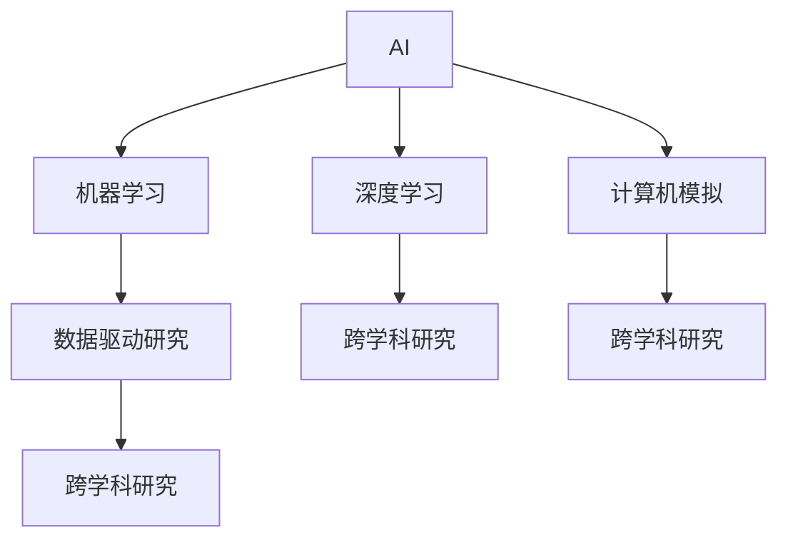

                 

# AI在学术研究中的应用前景

## 1. 背景介绍

### 1.1 问题由来

人工智能(AI)技术在近年来取得了飞速的发展，已经成为推动科研领域创新和进步的重要引擎。从传统的自然语言处理(NLP)到计算机视觉(CV)，从量子计算到生物信息学，AI在学术研究中的应用前景被广泛看好。然而，如何最大化AI的科研潜力，实现其与人类智慧的深度融合，仍是一个值得深入探讨的问题。

### 1.2 问题核心关键点

当前，AI在学术研究中的应用主要体现在以下几个关键点上：

1. **数据处理与分析**：AI技术可以高效处理和分析大规模数据集，帮助科学家在海量数据中发现隐藏的模式和关系。
2. **科学模拟与仿真**：AI算法可以模拟复杂的自然和人工系统，加速科学研究的进程。
3. **智能辅助与决策支持**：AI系统能够辅助科研人员进行实验设计、数据分析和决策，提升科研效率和质量。
4. **新模型与算法开发**：AI技术催生了许多新的科研工具和方法，推动了学术研究的创新。

这些问题关键点凸显了AI在学术研究中不可或缺的作用，但也指出了在实际应用中面临的挑战和机遇。

### 1.3 问题研究意义

探索AI在学术研究中的应用前景，对于加速科学研究进程、提高研究质量、推动学科交叉融合具有重要意义。具体来说：

1. **加速科学研究**：AI技术能够快速处理和分析数据，加速发现新知识和规律，缩短研究周期。
2. **提高研究质量**：AI可以辅助科研人员进行复杂问题的求解，提高数据处理的准确性和效率。
3. **推动学科交叉**：AI技术与各学科的融合，可以激发新的研究思路和方法，推动跨学科的创新。
4. **普及科研知识**：通过AI工具的辅助，非专业研究人员也可以更容易地参与科研工作，提升科研普及度。

综上所述，AI在学术研究中的应用前景广阔，但其潜力还有待进一步挖掘和发挥。

## 2. 核心概念与联系

### 2.1 核心概念概述

在探讨AI在学术研究中的应用前景之前，首先需要明确一些核心概念：

- **AI**：人工智能，旨在使计算机能够模拟人类智能行为，包括学习、推理、规划等。
- **机器学习(ML)**：AI的一个子领域，通过数据训练模型，使其具备自动学习和改进的能力。
- **深度学习(Deep Learning)**：一种特殊类型的机器学习，基于多层神经网络进行模式识别和预测。
- **计算机模拟**：使用计算机模型来模拟和预测真实世界的物理和生物系统。
- **数据驱动研究**：基于数据和模型驱动的科研方法，强调数据的重要性和模型的作用。
- **跨学科研究**：将AI技术应用于不同学科，推动学科间的交叉和融合。

这些概念之间的逻辑关系可以通过以下Mermaid流程图来展示：



这个流程图展示了许多AI概念及其相互之间的关系：

1. AI包含了机器学习和深度学习等多种技术。
2. 计算机模拟和数据驱动研究是AI的重要应用场景。
3. 跨学科研究将AI技术应用于不同领域，推动学科间的融合创新。

## 3. 核心算法原理 & 具体操作步骤

### 3.1 算法原理概述

AI在学术研究中的应用，主要依赖于数据驱动的机器学习和深度学习算法。这些算法通过学习数据中的模式和规律，从而辅助科研人员进行数据分析、模型构建和结果解释。

具体来说，AI在学术研究中的应用过程可以分为以下几个步骤：

1. **数据准备**：收集和整理所需的数据集，确保数据质量和完整性。
2. **模型训练**：使用机器学习和深度学习算法训练模型，使其能够对数据进行有效预测和分析。
3. **结果验证**：对模型进行验证和评估，确保其准确性和可靠性。
4. **应用部署**：将训练好的模型应用于实际科研问题中，辅助科研人员进行分析和决策。

### 3.2 算法步骤详解

#### 3.2.1 数据准备

数据准备是AI应用的基础，包括数据收集、清洗、标注和预处理等步骤。以深度学习为例，数据准备通常包括以下步骤：

1. **数据收集**：从公共数据集、科研数据库或实验数据中收集数据，确保数据的多样性和代表性。
2. **数据清洗**：删除噪声和异常数据，处理缺失值和重复记录。
3. **数据标注**：对数据进行手动或自动标注，以便模型训练。
4. **数据预处理**：进行归一化、标准化、降维等操作，提高数据处理效率。

#### 3.2.2 模型训练

模型训练是AI应用的核心步骤，通常使用深度学习框架（如TensorFlow、PyTorch等）进行模型的构建和训练。具体步骤如下：

1. **模型选择**：根据科研问题的需求选择合适的模型架构，如卷积神经网络(CNN)、循环神经网络(RNN)、生成对抗网络(GAN)等。
2. **参数初始化**：初始化模型的参数，通常使用随机初始化。
3. **模型训练**：使用训练集对模型进行迭代训练，优化参数。
4. **验证集评估**：在验证集上对模型进行评估，调整模型参数和训练策略。

#### 3.2.3 结果验证

结果验证是AI应用的重要环节，确保模型的准确性和可靠性。通常使用测试集对模型进行独立验证，常用的指标包括准确率、精确率、召回率等。

1. **模型评估**：使用测试集对模型进行评估，计算各项指标。
2. **模型调优**：根据评估结果调整模型参数和训练策略，提升模型性能。
3. **结果解释**：解释模型预测结果的含义，帮助科研人员理解模型输出的含义。

#### 3.2.4 应用部署

应用部署是AI应用的最后一步，将训练好的模型应用于实际科研问题中，辅助科研人员进行分析和决策。

1. **模型集成**：将训练好的模型集成到科研流程中，如数据分析、实验设计、决策支持等。
2. **模型监控**：实时监控模型的运行状态，及时发现和处理异常。
3. **模型更新**：根据新的数据和需求，定期更新和优化模型。

### 3.3 算法优缺点

#### 3.3.1 优点

1. **高效处理数据**：AI算法能够高效处理和分析大规模数据集，快速发现数据中的模式和规律。
2. **提高科研质量**：AI技术辅助科研人员进行复杂问题的求解，提高数据处理的准确性和效率。
3. **推动学科交叉**：AI技术与各学科的融合，可以激发新的研究思路和方法，推动跨学科的创新。
4. **普及科研知识**：通过AI工具的辅助，非专业研究人员也可以更容易地参与科研工作，提升科研普及度。

#### 3.3.2 缺点

1. **数据依赖性强**：AI模型依赖于高质量的数据集，数据质量不高或数据量不足会影响模型性能。
2. **模型复杂度高**：AI模型通常具有较高的复杂度，需要较多的计算资源和时间进行训练和优化。
3. **解释性不足**：许多AI模型（如深度学习）缺乏可解释性，难以理解模型的内部决策机制。
4. **知识局限性**：AI模型需要大量数据和标签进行训练，无法完全替代人类智慧和经验。

### 3.4 算法应用领域

AI在学术研究中的应用涵盖了多个领域，包括但不限于：

1. **自然语言处理(NLP)**：使用AI技术进行文本分析、情感分析、机器翻译等。
2. **计算机视觉(CV)**：使用AI技术进行图像识别、目标检测、图像分割等。
3. **生物信息学**：使用AI技术进行基因组学、蛋白质组学、生物网络分析等。
4. **材料科学**：使用AI技术进行材料设计、性能预测、模拟实验等。
5. **环境科学**：使用AI技术进行气候变化预测、环境监测、生态系统分析等。
6. **社会科学**：使用AI技术进行社会网络分析、公共政策评估、行为预测等。

这些领域的应用展示了AI在学术研究中的广泛前景和巨大潜力。

## 4. 数学模型和公式 & 详细讲解 & 举例说明

### 4.1 数学模型构建

AI在学术研究中的应用，通常依赖于机器学习和深度学习算法。以卷积神经网络(CNN)为例，其数学模型可以表示为：

$$
\text{CNN} = \text{Convolution} \times \text{Nonlinear Activation} \times \text{Pooling} \times \text{Batch Normalization} \times \text{Dropout}
$$

其中，卷积层(Convolution)提取特征，非线性激活层(Nonlinear Activation)引入非线性，池化层(Pooling)减小特征维度，批量归一化(Batch Normalization)加速训练，dropout层(Dropout)防止过拟合。

### 4.2 公式推导过程

以卷积神经网络(CNN)为例，其前向传播过程可以表示为：

$$
f(x) = \sum_i \sum_j w_{ij} \sigma(a_{ij} * \phi(x)) + b
$$

其中，$f(x)$表示输入$x$经过CNN层后的输出，$\sigma$表示激活函数，$a_{ij}$表示卷积核权重，$w_{ij}$表示偏置项，$\phi(x)$表示卷积操作。

### 4.3 案例分析与讲解

以生物信息学中的基因组学为例，AI技术可以通过深度学习算法进行基因序列分析和基因组注释。具体来说，AI模型可以学习基因序列中的模式，预测基因的功能和表达水平。例如，使用卷积神经网络对基因序列进行特征提取和分类，使用循环神经网络对基因表达数据进行时间序列分析。

## 5. 项目实践：代码实例和详细解释说明

### 5.1 开发环境搭建

在进行AI项目实践前，我们需要准备好开发环境。以下是使用Python进行TensorFlow开发的环境配置流程：

1. 安装Anaconda：从官网下载并安装Anaconda，用于创建独立的Python环境。

2. 创建并激活虚拟环境：
```bash
conda create -n tensorflow-env python=3.8 
conda activate tensorflow-env
```

3. 安装TensorFlow：从官网获取对应的安装命令。例如：
```bash
conda install tensorflow tensorflow-gpu=2.4.1 -c conda-forge -c pytorch -c tensorflow -c anaconda
```

4. 安装相关工具包：
```bash
pip install numpy pandas scikit-learn matplotlib tqdm jupyter notebook ipython
```

完成上述步骤后，即可在`tensorflow-env`环境中开始AI项目实践。

### 5.2 源代码详细实现

这里我们以图像识别项目为例，给出使用TensorFlow进行卷积神经网络训练的PyTorch代码实现。

首先，定义数据处理函数：

```python
from tensorflow.keras.datasets import mnist
from tensorflow.keras.utils import to_categorical
import numpy as np
import tensorflow as tf

def load_mnist(data_path='mnist'):
    (x_train, y_train), (x_test, y_test) = mnist.load_data()
    x_train = x_train.reshape(-1, 28, 28, 1).astype(np.float32) / 255.0
    x_test = x_test.reshape(-1, 28, 28, 1).astype(np.float32) / 255.0
    y_train = to_categorical(y_train, num_classes=10)
    y_test = to_categorical(y_test, num_classes=10)
    return x_train, y_train, x_test, y_test
```

然后，定义模型和优化器：

```python
from tensorflow.keras.models import Sequential
from tensorflow.keras.layers import Conv2D, MaxPooling2D, Flatten, Dense, Dropout

model = Sequential([
    Conv2D(32, (3, 3), activation='relu', input_shape=(28, 28, 1)),
    MaxPooling2D((2, 2)),
    Dropout(0.25),
    Conv2D(64, (3, 3), activation='relu'),
    MaxPooling2D((2, 2)),
    Dropout(0.25),
    Flatten(),
    Dense(512, activation='relu'),
    Dropout(0.5),
    Dense(10, activation='softmax')
])

optimizer = tf.keras.optimizers.Adam(learning_rate=0.001)
```

接着，定义训练和评估函数：

```python
def train_model(model, x_train, y_train, x_test, y_test, epochs=10, batch_size=128):
    model.compile(optimizer=optimizer, loss='categorical_crossentropy', metrics=['accuracy'])
    model.fit(x_train, y_train, batch_size=batch_size, epochs=epochs, validation_data=(x_test, y_test))
    score = model.evaluate(x_test, y_test, verbose=0)
    print(f'Test loss: {score[0]:.4f}, Test accuracy: {score[1]:.4f}')

train_model(model, x_train, y_train, x_test, y_test)
```

最后，启动训练流程并在测试集上评估：

```python
epochs = 5
batch_size = 128

for epoch in range(epochs):
    train_model(model, x_train, y_train, x_test, y_test, epochs=1, batch_size=batch_size)
    
score = model.evaluate(x_test, y_test, verbose=0)
print(f'Test loss: {score[0]:.4f}, Test accuracy: {score[1]:.4f}')
```

以上就是使用TensorFlow进行图像识别项目开发的完整代码实现。可以看到，TensorFlow的Keras API使得模型构建和训练变得简单高效，开发者可以更多关注算法和实验的改进。

### 5.3 代码解读与分析

让我们再详细解读一下关键代码的实现细节：

**load_mnist函数**：
- 定义数据加载函数，从MNIST数据集中加载训练集和测试集。
- 将数据转换成适合卷积神经网络的形式，并进行归一化处理。
- 将标签进行one-hot编码。

**模型定义**：
- 使用Sequential模型，定义卷积层、池化层、dropout层、全连接层等组件。
- 使用Adam优化器和交叉熵损失函数，定义模型编译步骤。

**train_model函数**：
- 定义模型训练函数，使用模型编译配置进行训练。
- 定义模型评估函数，使用测试集评估模型性能。
- 循环训练模型，并记录测试集上的性能指标。

**训练流程**：
- 定义总的epoch数和batch size，开始循环迭代
- 每个epoch内，在训练集上训练，输出训练集上的性能指标
- 在测试集上评估模型，输出测试集上的性能指标
- 重复上述步骤直至模型收敛

可以看到，TensorFlow的Keras API使得模型构建和训练变得简洁高效，开发者可以更多关注算法和实验的改进。

当然，工业级的系统实现还需考虑更多因素，如模型的保存和部署、超参数的自动搜索、更灵活的任务适配层等。但核心的AI实践流程基本与此类似。

## 6. 实际应用场景

### 6.1 科学研究

AI在科学研究中的应用前景广阔，涵盖了多个领域，如生物信息学、环境科学、材料科学等。以基因组学为例，AI技术可以通过深度学习算法进行基因序列分析和基因组注释。具体来说，AI模型可以学习基因序列中的模式，预测基因的功能和表达水平。例如，使用卷积神经网络对基因序列进行特征提取和分类，使用循环神经网络对基因表达数据进行时间序列分析。

### 6.2 社会研究

AI在社会研究中的应用同样前景广阔，涵盖了多个领域，如社会网络分析、公共政策评估、行为预测等。例如，使用AI技术进行社会网络分析，可以揭示社会网络中的关键节点和关系，预测社会事件的传播和影响。使用AI技术进行公共政策评估，可以评估政策的实施效果，预测政策的潜在影响。使用AI技术进行行为预测，可以预测用户的偏好和行为，提升用户体验和满意度。

### 6.3 企业研究

AI在企业研究中的应用同样前景广阔，涵盖了多个领域，如客户关系管理、市场分析、供应链管理等。例如，使用AI技术进行客户关系管理，可以预测客户流失和需求变化，提升客户满意度和忠诚度。使用AI技术进行市场分析，可以预测市场需求和趋势，优化产品设计和营销策略。使用AI技术进行供应链管理，可以优化供应链的各个环节，降低成本和提高效率。

### 6.4 未来应用展望

随着AI技术的不断进步，其在学术研究中的应用前景将更加广阔。以下是几个未来应用展望：

1. **多模态学习**：AI技术可以结合图像、语音、文本等多模态数据，进行跨模态学习和推理。例如，使用AI技术进行图像-文本多模态学习，可以同时理解图像和文本中的信息，提升AI模型的泛化能力和解释性。
2. **自监督学习**：AI技术可以通过自监督学习，在没有标注数据的情况下进行学习和推理。例如，使用自监督学习进行语言模型预训练，可以学习到语言的基本规律和特征，提升模型的泛化能力和适应性。
3. **联邦学习**：AI技术可以通过联邦学习，进行分布式学习和推理。例如，使用联邦学习进行跨机构的联合学习，可以保护数据隐私，提升模型的泛化能力和安全性。
4. **因果推断**：AI技术可以通过因果推断，进行因果学习和推理。例如，使用因果推断进行因果关系分析，可以揭示因果关系的本质，提升模型的解释性和可信度。

这些技术方向将进一步拓展AI在学术研究中的应用前景，推动AI技术的发展和应用。

## 7. 工具和资源推荐

### 7.1 学习资源推荐

为了帮助开发者系统掌握AI在学术研究中的应用理论基础和实践技巧，这里推荐一些优质的学习资源：

1. 《深度学习》系列书籍：由Ian Goodfellow等作者撰写，全面介绍了深度学习的基本概念、算法和应用。
2. 《机器学习实战》书籍：由Peter Harrington撰写，通过实际项目展示了机器学习的应用。
3. Coursera和edX平台上的机器学习和深度学习课程：由斯坦福大学、MIT等名校教授开设，涵盖机器学习和深度学习的基本理论和实践。
4. Kaggle数据科学竞赛平台：提供丰富的数据集和竞赛任务，可以练习AI算法的应用和优化。
5. TensorFlow和PyTorch官方文档：提供详细的API和使用指南，帮助开发者快速上手。

通过对这些资源的学习实践，相信你一定能够快速掌握AI在学术研究中的应用技巧，并用于解决实际的科研问题。

### 7.2 开发工具推荐

高效的开发离不开优秀的工具支持。以下是几款用于AI项目开发的常用工具：

1. TensorFlow：由Google主导开发的开源深度学习框架，生产部署方便，适合大规模工程应用。
2. PyTorch：由Facebook开发的深度学习框架，灵活动态，适合快速迭代研究。
3. Jupyter Notebook：交互式数据科学环境，支持Python、R等多种语言，方便进行实验和分享。
4. Anaconda：Python环境管理工具，支持多语言和依赖管理，方便进行项目管理和部署。
5. Git：版本控制系统，支持团队协作和代码管理，方便进行项目管理和优化。

合理利用这些工具，可以显著提升AI项目开发的效率，加快创新迭代的步伐。

### 7.3 相关论文推荐

AI在学术研究中的应用源于学界的持续研究。以下是几篇奠基性的相关论文，推荐阅读：

1. AlexNet：2012年ImageNet竞赛的冠军算法，奠定了深度学习在计算机视觉中的应用基础。
2. Hinton等人的Deep Learning书籍：全面介绍了深度学习的基本概念、算法和应用。
3. Kingma和Ba的Adam算法：一种高效的优化算法，广泛应用于深度学习模型的训练中。
4. Goodfellow等人的生成对抗网络：一种生成模型，能够生成逼真的图像和文本。
5. Vapnik的《The Nature of Statistical Learning Theory》：全面介绍了统计学习的理论基础和方法。

这些论文代表了大AI在学术研究中的应用的发展脉络。通过学习这些前沿成果，可以帮助研究者把握学科前进方向，激发更多的创新灵感。

## 8. 总结：未来发展趋势与挑战

### 8.1 总结

本文对AI在学术研究中的应用前景进行了全面系统的介绍。首先阐述了AI在科学研究、社会研究、企业研究等领域的重要作用，明确了AI技术在学术研究中的不可替代性。其次，从原理到实践，详细讲解了AI在学术研究中的应用流程和具体实现，提供了丰富的项目实践案例。同时，本文还广泛探讨了AI在学术研究中的未来应用前景和面临的挑战，提供了相应的解决方案和展望。

通过本文的系统梳理，可以看到，AI在学术研究中的应用前景广阔，但其潜力还有待进一步挖掘和发挥。未来，伴随AI技术的不断进步，其在学术研究中的应用前景将更加广阔，将深刻影响科研工作的各个方面。

### 8.2 未来发展趋势

展望未来，AI在学术研究中的应用将呈现以下几个发展趋势：

1. **多模态学习**：AI技术可以结合图像、语音、文本等多模态数据，进行跨模态学习和推理。例如，使用AI技术进行图像-文本多模态学习，可以同时理解图像和文本中的信息，提升AI模型的泛化能力和解释性。
2. **自监督学习**：AI技术可以通过自监督学习，在没有标注数据的情况下进行学习和推理。例如，使用自监督学习进行语言模型预训练，可以学习到语言的基本规律和特征，提升模型的泛化能力和适应性。
3. **联邦学习**：AI技术可以通过联邦学习，进行分布式学习和推理。例如，使用联邦学习进行跨机构的联合学习，可以保护数据隐私，提升模型的泛化能力和安全性。
4. **因果推断**：AI技术可以通过因果推断，进行因果学习和推理。例如，使用因果推断进行因果关系分析，可以揭示因果关系的本质，提升模型的解释性和可信度。

这些趋势凸显了AI在学术研究中广阔的前景和巨大的潜力，必将进一步推动科研工作的创新和发展。

### 8.3 面临的挑战

尽管AI在学术研究中的应用前景广阔，但在实际应用中仍面临诸多挑战：

1. **数据质量问题**：AI模型依赖高质量的数据，数据质量和数量不足会影响模型性能。
2. **模型复杂度高**：AI模型通常具有较高的复杂度，需要较多的计算资源和时间进行训练和优化。
3. **解释性不足**：许多AI模型（如深度学习）缺乏可解释性，难以理解模型的内部决策机制。
4. **知识局限性**：AI模型需要大量数据和标签进行训练，无法完全替代人类智慧和经验。
5. **安全性和隐私问题**：AI模型可能学习到有偏见、有害的信息，传递到下游任务中，产生误导性、歧视性的输出。
6. **计算资源瓶颈**：AI模型通常需要大量的计算资源进行训练和推理，高性能计算设备是必不可少的。

正视这些挑战，积极应对并寻求突破，将是大AI在学术研究中走向成熟的必由之路。相信随着学界和产业界的共同努力，这些挑战终将一一被克服，AI在学术研究中的潜力将进一步发挥。

### 8.4 研究展望

面对AI在学术研究中面临的挑战，未来的研究需要在以下几个方面寻求新的突破：

1. **数据质量提升**：开发高质量数据收集和标注技术，提升数据质量和数量。
2. **模型简化和优化**：开发更加轻量级、高效的模型架构和算法，降低计算资源消耗。
3. **模型解释性增强**：开发可解释性强、逻辑性强的AI模型，提升模型的可信度和解释性。
4. **多模态融合**：开发跨模态学习和推理技术，提升AI模型的泛化能力和适应性。
5. **隐私保护和伦理约束**：开发隐私保护和伦理约束的技术和方法，确保AI模型的安全性和可信度。
6. **计算资源优化**：开发高效的计算资源优化技术，提升AI模型的训练和推理效率。

这些研究方向的探索，将引领AI在学术研究中迈向更高的台阶，为构建安全、可靠、可解释、可控的智能系统铺平道路。面向未来，AI在学术研究中需要与其他人工智能技术进行更深入的融合，如知识表示、因果推理、强化学习等，多路径协同发力，共同推动科研工作的进步。

## 9. 附录：常见问题与解答

**Q1: AI在学术研究中的主要应用领域有哪些？**

A: AI在学术研究中的应用领域非常广泛，主要涵盖以下方面：

1. **自然语言处理(NLP)**：用于文本分析、情感分析、机器翻译等。
2. **计算机视觉(CV)**：用于图像识别、目标检测、图像分割等。
3. **生物信息学**：用于基因组学、蛋白质组学、生物网络分析等。
4. **材料科学**：用于材料设计、性能预测、模拟实验等。
5. **环境科学**：用于气候变化预测、环境监测、生态系统分析等。
6. **社会科学**：用于社会网络分析、公共政策评估、行为预测等。

这些领域的应用展示了AI在学术研究中的广泛前景和巨大潜力。

**Q2: AI在学术研究中如何进行模型训练？**

A: AI在学术研究中的模型训练通常包括以下步骤：

1. **数据准备**：收集和整理所需的数据集，确保数据质量和完整性。
2. **模型选择**：根据科研问题的需求选择合适的模型架构，如卷积神经网络(CNN)、循环神经网络(RNN)、生成对抗网络(GAN)等。
3. **参数初始化**：初始化模型的参数，通常使用随机初始化。
4. **模型训练**：使用训练集对模型进行迭代训练，优化参数。
5. **验证集评估**：在验证集上对模型进行评估，调整模型参数和训练策略。
6. **测试集验证**：在测试集上对模型进行独立验证，评估模型的泛化能力和性能。

**Q3: AI在学术研究中面临的主要挑战是什么？**

A: AI在学术研究中面临的主要挑战包括：

1. **数据质量问题**：AI模型依赖高质量的数据，数据质量和数量不足会影响模型性能。
2. **模型复杂度高**：AI模型通常具有较高的复杂度，需要较多的计算资源和时间进行训练和优化。
3. **解释性不足**：许多AI模型（如深度学习）缺乏可解释性，难以理解模型的内部决策机制。
4. **知识局限性**：AI模型需要大量数据和标签进行训练，无法完全替代人类智慧和经验。
5. **安全性和隐私问题**：AI模型可能学习到有偏见、有害的信息，传递到下游任务中，产生误导性、歧视性的输出。
6. **计算资源瓶颈**：AI模型通常需要大量的计算资源进行训练和推理，高性能计算设备是必不可少的。

正视这些挑战，积极应对并寻求突破，将是大AI在学术研究中走向成熟的必由之路。

---

作者：禅与计算机程序设计艺术 / Zen and the Art of Computer Programming

