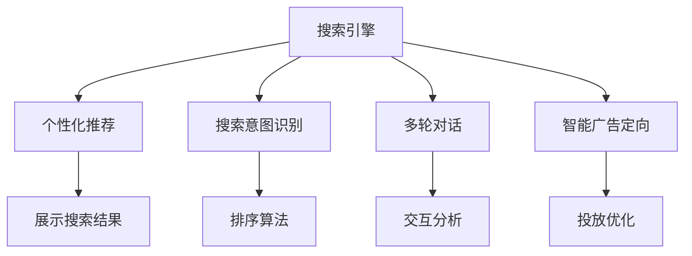

                 

## 1. 背景介绍

在数字时代，搜索引擎已成为人们获取信息的重要入口。然而，由于信息爆炸和用户需求的多样性，传统的“一刀切”式搜索结果已难以满足用户个性化需求。如何实现搜索结果的个性化展示，提升用户体验，成为搜索引擎技术发展的一个重要方向。人工智能技术，尤其是深度学习和大语言模型的引入，使得搜索引擎在个性化方面得以实现质的飞跃。本文将全面介绍AI在搜索引擎个性化方面的应用，包括个性化推荐、搜索意图识别、多轮对话、智能广告定向等诸多场景。

## 2. 核心概念与联系

为了更好地理解AI在搜索引擎个性化方面的应用，本节将介绍几个密切相关的核心概念：

- 搜索引擎(Search Engine)：利用索引技术，从海量的数据源中快速匹配用户查询请求，并返回相关信息的系统。
- 个性化推荐系统(Personalization Recommendation System)：根据用户的历史行为、兴趣偏好等数据，为用户推荐最相关的搜索结果，提升用户体验。
- 搜索意图识别(Search Intent Recognition)：识别用户查询的意图，判断是信息查询、任务执行还是导航请求，以便进行更精准的搜索结果排序。
- 多轮对话系统(Conversational System)：能够与用户进行多轮自然语言交互，理解用户上下文，提供更智能的查询建议和答案。
- 智能广告定向(Smart Ad Targeting)：利用AI技术进行用户画像分析，实现精准投放，提高广告转化率。

这些核心概念之间的关系可以通过以下Mermaid流程图来展示：



这个流程图展示了几者之间的逻辑关系：

1. 搜索引擎通过索引技术，将搜索结果推荐给用户。
2. 个性化推荐系统根据用户历史行为，优化搜索结果展示。
3. 搜索意图识别模块判断用户查询意图，优化搜索结果排序。
4. 多轮对话系统理解用户上下文，提供个性化查询建议。
5. 智能广告定向模块通过用户画像分析，实现精准投放。

这些模块相互协作，共同提升搜索引擎的个性化水平。

## 3. 核心算法原理 & 具体操作步骤

### 3.1 算法原理概述

搜索引擎的个性化推荐系统主要依赖以下算法和原理：

- 协同过滤(Collaborative Filtering)：根据用户和项目的相似性，推荐相似项目。基于用户的评分数据或行为数据，计算用户对项目的兴趣程度，从而进行推荐。
- 基于内容的推荐(Content-Based Recommendation)：根据项目的内容特征，推荐相似内容。通过分析项目特征，计算用户对项目内容的匹配程度，从而推荐相似项目。
- 矩阵分解(Matrix Factorization)：通过分解用户行为矩阵，发现用户兴趣和项目特征。矩阵分解可以将用户行为数据转化为低维特征，从而进行推荐。
- 深度学习(Depending Learning)：通过构建深度神经网络，学习用户兴趣和项目特征的复杂非线性关系。深度学习能够更好地处理高维数据，具有强大的表达能力。
- 自然语言处理(Natural Language Processing, NLP)：利用语言模型、词嵌入等技术，理解用户查询意图和分析搜索结果内容。NLP技术能够更好地处理文本数据，实现语义理解和推荐。

### 3.2 算法步骤详解

基于深度学习的搜索引擎个性化推荐系统主要包括以下几个步骤：

**Step 1: 数据收集与预处理**
- 收集用户的历史行为数据，包括点击、浏览、收藏、评分等。
- 对用户行为数据进行去噪、归一化等预处理操作。
- 提取用户行为特征，如浏览时间、频率、地域等。

**Step 2: 模型训练**
- 设计深度学习模型架构，如神经网络、循环神经网络(RNN)、Transformer等。
- 使用用户行为数据进行模型训练，优化模型参数。
- 应用正则化技术，如Dropout、L2正则化等，防止过拟合。

**Step 3: 推荐生成**
- 将用户输入的查询和上下文信息作为输入，输入到训练好的模型中。
- 模型输出用户对各个项目的相关性分数。
- 根据排序算法，将相关性分数排序，返回推荐结果。

**Step 4: 效果评估与迭代优化**
- 收集用户对推荐结果的反馈数据，如点击率、满意度等。
- 使用A/B测试等方法，评估不同推荐策略的效果。
- 根据反馈数据，迭代优化模型参数，提高推荐精度。

### 3.3 算法优缺点

基于深度学习的搜索引擎个性化推荐系统具有以下优点：

- 具有强大的表达能力，能够处理高维数据，适应复杂的推荐场景。
- 能够学习用户兴趣的动态变化，进行实时推荐。
- 能够处理文本数据，适用于多模态推荐场景。
- 通过机器学习算法，能够不断优化推荐策略，提高推荐效果。

但同时，也存在以下缺点：

- 数据需求量大，需要收集大量的用户行为数据，隐私风险高。
- 模型复杂，训练和推理成本高。
- 容易受到恶意行为的影响，如刷点击、恶意点击等。
- 推荐结果的解释性不足，难以解释推荐逻辑。

### 3.4 算法应用领域

基于深度学习的搜索引擎个性化推荐系统在以下领域有广泛应用：

- 电商推荐：根据用户浏览记录和评分数据，推荐商品。
- 音乐推荐：根据用户听歌记录和评分数据，推荐音乐。
- 视频推荐：根据用户观看记录和评分数据，推荐视频。
- 新闻推荐：根据用户阅读记录和点击数据，推荐新闻。
- 游戏推荐：根据用户游戏行为数据，推荐游戏。

这些应用场景中，推荐系统通过深度学习模型，深度理解用户兴趣，从而生成个性化的推荐结果。

## 4. 数学模型和公式 & 详细讲解 & 举例说明

### 4.1 数学模型构建

基于深度学习的推荐系统通常使用神经网络模型，包括：

- 用户-项目评分矩阵：记为 $U \in \mathbb{R}^{N \times M}$，其中 $N$ 为项目数量，$M$ 为用户数量。$U_{ij}$ 表示用户 $i$ 对项目 $j$ 的评分或兴趣度。
- 用户特征向量：记为 $u_i \in \mathbb{R}^d$，其中 $d$ 为特征维度。$u_i$ 表示用户 $i$ 的兴趣特征向量。
- 项目特征向量：记为 $v_j \in \mathbb{R}^d$，其中 $d$ 为特征维度。$v_j$ 表示项目 $j$ 的特征向量。

基于这些基础数据，推荐系统通常使用以下模型进行训练：

- 矩阵分解模型：
$$
\min_{U,V} \frac{1}{2} || Y - UV^T ||_F^2 + \lambda ||U||_F^2 + \mu ||V||_F^2
$$
其中 $Y \in \mathbb{R}^{N \times M}$ 为用户-项目评分矩阵，$U$ 和 $V$ 为用户和项目特征矩阵，$\lambda$ 和 $\mu$ 为正则化系数。

- 深度神经网络模型：
$$
\min_{\theta} \mathcal{L}(\theta, U, V)
$$
其中 $\theta$ 为神经网络模型参数，$\mathcal{L}$ 为损失函数。

### 4.2 公式推导过程

以矩阵分解模型为例，公式的推导过程如下：

首先，假设用户 $i$ 对项目 $j$ 的评分 $Y_{ij}$ 等于用户 $i$ 对项目 $j$ 的兴趣度 $U_{ij}$ 乘以项目 $j$ 的吸引力 $V_j$：
$$
Y_{ij} = U_{ij} V_j
$$

将 $U$ 和 $V$ 分解为低秩矩阵，即：
$$
U = US, V = SV^T
$$
其中 $S$ 为低秩矩阵，$U$ 和 $V$ 为低秩矩阵分解后的特征矩阵。

代入 $U$ 和 $V$ 的表达式，得到：
$$
Y = USSV^T
$$

进一步简化，得到矩阵分解模型的优化目标：
$$
\min_{US, SV^T} ||Y - USSV^T||_F^2
$$

该目标函数的求解可以通过奇异值分解(SVD)或最小二乘法等方法实现。

### 4.3 案例分析与讲解

**案例：电商推荐系统**

电商推荐系统通常使用协同过滤和基于内容的推荐方法进行推荐。以协同过滤为例，假设用户 $i$ 对项目 $j$ 的评分矩阵为 $Y$，将其矩阵分解为用户特征矩阵 $U$ 和项目特征矩阵 $V$，则推荐模型可以表示为：
$$
\min_{U,V} \frac{1}{2} || Y - UV^T ||_F^2 + \lambda ||U||_F^2 + \mu ||V||_F^2
$$

使用梯度下降等优化算法，求解上述优化问题，得到用户 $i$ 对项目 $j$ 的兴趣度 $U_{ij}$ 和项目 $j$ 的吸引力 $V_j$，从而进行推荐。

**案例：音乐推荐系统**

音乐推荐系统通常使用深度神经网络模型进行推荐。假设音乐数据集包含歌曲和用户的评分矩阵 $Y$，则推荐模型可以表示为：
$$
\min_{\theta} \mathcal{L}(\theta, Y)
$$

其中 $\theta$ 为神经网络模型参数，$\mathcal{L}$ 为损失函数。使用交叉熵损失函数，即：
$$
\mathcal{L}(\theta, Y) = -\frac{1}{N} \sum_{i,j} (Y_{ij} \log \hat{Y}_{ij} + (1-Y_{ij}) \log (1-\hat{Y}_{ij}))
$$

其中 $\hat{Y}_{ij}$ 为模型预测的评分。通过反向传播算法，训练模型参数 $\theta$，得到音乐推荐结果。

## 5. 项目实践：代码实例和详细解释说明

### 5.1 开发环境搭建

在进行搜索引擎个性化推荐系统的开发前，我们需要准备好开发环境。以下是使用Python进行TensorFlow开发的环境配置流程：

1. 安装Anaconda：从官网下载并安装Anaconda，用于创建独立的Python环境。

2. 创建并激活虚拟环境：
```bash
conda create -n tf-env python=3.8 
conda activate tf-env
```

3. 安装TensorFlow：根据CUDA版本，从官网获取对应的安装命令。例如：
```bash
conda install tensorflow tensorflow-gpu=2.7 -c tf -c conda-forge
```

4. 安装Keras：
```bash
pip install keras
```

5. 安装各类工具包：
```bash
pip install numpy pandas scikit-learn matplotlib tqdm jupyter notebook ipython
```

完成上述步骤后，即可在`tf-env`环境中开始推荐系统开发。

### 5.2 源代码详细实现

这里我们以电商推荐系统为例，给出使用TensorFlow和Keras进行深度学习模型开发的PyTorch代码实现。

首先，定义电商推荐系统的数据处理函数：

```python
import numpy as np
from tensorflow.keras.layers import Input, Embedding, Dot, Dense, Model
from tensorflow.keras.models import Sequential
from tensorflow.keras.optimizers import Adam

def create_model(input_dim, hidden_dim, output_dim):
    input1 = Input(shape=(input_dim,))
    embedding1 = Embedding(input_dim, hidden_dim, input_length=input_dim)(input1)
    input2 = Input(shape=(input_dim,))
    embedding2 = Embedding(input_dim, hidden_dim, input_length=input_dim)(input2)
    dot_product = Dot(axes=1)([embedding1, embedding2])
    output = Dense(output_dim, activation='sigmoid')(dot_product)
    model = Model(inputs=[input1, input2], outputs=output)
    return model
```

然后，定义电商推荐系统的训练函数：

```python
def train_model(model, train_data, train_labels, epochs=10, batch_size=32, verbose=0):
    model.compile(optimizer=Adam(lr=0.001), loss='binary_crossentropy', metrics=['accuracy'])
    model.fit([train_data[0], train_data[1]], train_labels, epochs=epochs, batch_size=batch_size, validation_split=0.2, verbose=verbose)
    return model
```

最后，启动训练流程并在测试集上评估：

```python
from sklearn.model_selection import train_test_split
from sklearn.preprocessing import MinMaxScaler

# 加载电商推荐数据集
data = pd.read_csv('data.csv')

# 数据预处理
scaler = MinMaxScaler()
data_scaled = scaler.fit_transform(data)

# 划分训练集和测试集
train_data, test_data, train_labels, test_labels = train_test_split(data_scaled[:, :-1], data_scaled[:, -1], test_size=0.2, random_state=42)

# 创建并训练模型
model = create_model(input_dim=100, hidden_dim=50, output_dim=1)
model = train_model(model, (train_data, train_labels), epochs=10)

# 在测试集上评估
test_loss, test_acc = model.evaluate([test_data, test_labels], test_labels, verbose=0)
print(f'Test loss: {test_loss:.4f}, Test accuracy: {test_acc:.4f}')
```

以上就是使用TensorFlow和Keras进行电商推荐系统开发的完整代码实现。可以看到，利用TensorFlow和Keras，电商推荐系统的实现变得非常简洁高效。

### 5.3 代码解读与分析

让我们再详细解读一下关键代码的实现细节：

**create_model函数**：
- 定义了一个包含两个嵌入层和一对点积层(Dot Layer)的神经网络模型，用于计算用户和项目之间的相似度。
- 使用Dense层将相似度转换为预测结果，采用二分类交叉熵损失函数，进行模型训练。
- 模型架构可以通过调整嵌入层和全连接层的维度等超参数进行优化。

**train_model函数**：
- 使用Adam优化器，二分类交叉熵损失函数进行模型训练。
- 采用随机梯度下降(Stochastic Gradient Descent)算法，进行多轮迭代训练。
- 验证集用于模型性能的监控，避免过拟合。

**电商推荐系统训练流程**：
- 加载电商推荐数据集。
- 对数据进行归一化处理，标准化数据范围。
- 划分训练集和测试集，防止过拟合。
- 创建并训练模型。
- 在测试集上评估模型性能。

可以看到，电商推荐系统的实现非常简洁，通过调整模型架构和训练参数，能够实现较好的推荐效果。

## 6. 实际应用场景

### 6.1 电商推荐

电商推荐系统是搜索引擎个性化推荐的核心应用场景之一。通过收集用户的历史购物数据，利用深度学习模型进行个性化推荐，能够极大提升用户的购物体验和电商平台的转化率。

在技术实现上，电商推荐系统通常使用协同过滤、基于内容的推荐和深度学习等方法进行推荐。具体流程如下：

**1. 数据收集**
- 收集用户的历史购物数据，包括浏览记录、购买记录、评分数据等。
- 对用户行为数据进行预处理，如去噪、归一化、特征提取等操作。

**2. 模型训练**
- 设计深度学习模型架构，如神经网络、循环神经网络(RNN)、Transformer等。
- 使用用户行为数据进行模型训练，优化模型参数。
- 应用正则化技术，如Dropout、L2正则化等，防止过拟合。

**3. 推荐生成**
- 将用户输入的查询和上下文信息作为输入，输入到训练好的模型中。
- 模型输出用户对各个商品的相关性分数。
- 根据排序算法，将相关性分数排序，返回推荐结果。

**4. 效果评估与迭代优化**
- 收集用户对推荐结果的反馈数据，如点击率、满意度等。
- 使用A/B测试等方法，评估不同推荐策略的效果。
- 根据反馈数据，迭代优化模型参数，提高推荐精度。

电商推荐系统的成功实施需要依赖大量的用户数据和精细化的模型设计。通过深度学习技术，电商推荐系统能够根据用户的历史行为，预测其对商品的兴趣，进行个性化推荐，从而提升用户体验和电商平台的用户粘性。

### 6.2 音乐推荐

音乐推荐系统是搜索引擎个性化的另一个重要应用场景。通过收集用户的听歌记录和评分数据，利用深度学习模型进行个性化推荐，能够极大地提升用户的听歌体验和音乐平台的黏性。

在技术实现上，音乐推荐系统通常使用协同过滤、基于内容的推荐和深度学习等方法进行推荐。具体流程如下：

**1. 数据收集**
- 收集用户的历史听歌记录和评分数据。
- 对用户行为数据进行预处理，如去噪、归一化、特征提取等操作。

**2. 模型训练**
- 设计深度学习模型架构，如神经网络、循环神经网络(RNN)、Transformer等。
- 使用用户行为数据进行模型训练，优化模型参数。
- 应用正则化技术，如Dropout、L2正则化等，防止过拟合。

**3. 推荐生成**
- 将用户输入的查询和上下文信息作为输入，输入到训练好的模型中。
- 模型输出用户对各个歌曲的相关性分数。
- 根据排序算法，将相关性分数排序，返回推荐结果。

**4. 效果评估与迭代优化**
- 收集用户对推荐结果的反馈数据，如点击率、满意度等。
- 使用A/B测试等方法，评估不同推荐策略的效果。
- 根据反馈数据，迭代优化模型参数，提高推荐精度。

音乐推荐系统的成功实施需要依赖大量的用户数据和精细化的模型设计。通过深度学习技术，音乐推荐系统能够根据用户的历史听歌记录，预测其对歌曲的兴趣，进行个性化推荐，从而提升用户体验和音乐平台的黏性。

### 6.3 视频推荐

视频推荐系统是搜索引擎个性化的另一个重要应用场景。通过收集用户的观看记录和评分数据，利用深度学习模型进行个性化推荐，能够极大地提升用户的观看体验和视频平台的黏性。

在技术实现上，视频推荐系统通常使用协同过滤、基于内容的推荐和深度学习等方法进行推荐。具体流程如下：

**1. 数据收集**
- 收集用户的历史观看记录和评分数据。
- 对用户行为数据进行预处理，如去噪、归一化、特征提取等操作。

**2. 模型训练**
- 设计深度学习模型架构，如神经网络、循环神经网络(RNN)、Transformer等。
- 使用用户行为数据进行模型训练，优化模型参数。
- 应用正则化技术，如Dropout、L2正则化等，防止过拟合。

**3. 推荐生成**
- 将用户输入的查询和上下文信息作为输入，输入到训练好的模型中。
- 模型输出用户对各个视频的相关性分数。
- 根据排序算法，将相关性分数排序，返回推荐结果。

**4. 效果评估与迭代优化**
- 收集用户对推荐结果的反馈数据，如点击率、满意度等。
- 使用A/B测试等方法，评估不同推荐策略的效果。
- 根据反馈数据，迭代优化模型参数，提高推荐精度。

视频推荐系统的成功实施需要依赖大量的用户数据和精细化的模型设计。通过深度学习技术，视频推荐系统能够根据用户的历史观看记录，预测其对视频内容的兴趣，进行个性化推荐，从而提升用户体验和视频平台的黏性。

## 7. 工具和资源推荐

### 7.1 学习资源推荐

为了帮助开发者系统掌握搜索引擎个性化推荐系统的理论基础和实践技巧，这里推荐一些优质的学习资源：

1. 《推荐系统实践》系列博文：由大模型技术专家撰写，深入浅出地介绍了推荐系统的原理、算法、实现等关键内容。

2. CS231n《计算机视觉：深度学习与视觉认知》课程：斯坦福大学开设的视觉认知课程，涵盖了深度学习在图像处理、视觉识别等领域的应用。

3. 《深度学习理论与实践》书籍：清华大学出版社出版的深度学习教材，系统介绍了深度学习理论、算法和实践，适合入门和进阶读者。

4. TensorFlow官方文档：TensorFlow官方提供的详细文档，包括模型构建、训练、部署等各方面的教程，是学习TensorFlow的重要参考。

5. PyTorch官方文档：PyTorch官方提供的详细文档，包括模型构建、训练、部署等各方面的教程，是学习PyTorch的重要参考。

通过对这些资源的学习实践，相信你一定能够快速掌握搜索引擎个性化推荐系统的精髓，并用于解决实际的推荐问题。

### 7.2 开发工具推荐

高效的开发离不开优秀的工具支持。以下是几款用于搜索引擎个性化推荐系统开发的常用工具：

1. TensorFlow：由Google主导开发的开源深度学习框架，生产部署方便，适合大规模工程应用。同样有丰富的预训练语言模型资源。

2. PyTorch：基于Python的开源深度学习框架，灵活动态的计算图，适合快速迭代研究。大部分预训练语言模型都有PyTorch版本的实现。

3. Keras：基于TensorFlow和Theano的高级神经网络API，提供简单易用的接口，适合快速原型开发。

4. Weights & Biases：模型训练的实验跟踪工具，可以记录和可视化模型训练过程中的各项指标，方便对比和调优。与主流深度学习框架无缝集成。

5. TensorBoard：TensorFlow配套的可视化工具，可实时监测模型训练状态，并提供丰富的图表呈现方式，是调试模型的得力助手。

6. Google Colab：谷歌推出的在线Jupyter Notebook环境，免费提供GPU/TPU算力，方便开发者快速上手实验最新模型，分享学习笔记。

合理利用这些工具，可以显著提升搜索引擎个性化推荐系统的开发效率，加快创新迭代的步伐。

### 7.3 相关论文推荐

搜索引擎个性化推荐系统的发展源于学界的持续研究。以下是几篇奠基性的相关论文，推荐阅读：

1. Matrix Factorization Techniques for Recommender Systems：提出矩阵分解方法，通过分解用户行为矩阵，发现用户兴趣和项目特征。

2. The BellKor 2009 Challenge on Industrial Strength Collaborative Filtering：提出协同过滤算法，通过用户和项目的相似性，推荐相似项目。

3. Deep Rank：提出深度学习算法，利用神经网络模型，学习用户兴趣和项目特征的复杂非线性关系。

4. Pathway LSTM：提出多模态学习算法，将文本、图像、音频等不同模态的数据融合，实现综合推荐。

5. Sequence to Sequence Learning with Neural Networks：提出Seq2Seq模型，利用神经网络模型，实现文本生成和翻译等自然语言处理任务。

这些论文代表了大语言模型微调技术的发展脉络。通过学习这些前沿成果，可以帮助研究者把握学科前进方向，激发更多的创新灵感。

## 8. 总结：未来发展趋势与挑战

### 8.1 总结

本文对基于深度学习的搜索引擎个性化推荐系统进行了全面系统的介绍。首先阐述了搜索引擎个性化的背景和意义，明确了推荐系统在提升用户体验、优化广告投放、提高平台黏性等方面的重要作用。其次，从原理到实践，详细讲解了深度学习推荐系统的主要算法和步骤，给出了推荐系统开发的完整代码实例。同时，本文还广泛探讨了推荐系统在电商、音乐、视频等多个领域的应用场景，展示了推荐技术的广阔前景。最后，本文精选了推荐系统的各类学习资源，力求为读者提供全方位的技术指引。

通过本文的系统梳理，可以看到，深度学习推荐系统已经在搜索引擎个性化方面取得了显著效果。未来，伴随预训练语言模型和深度学习技术的进一步演进，推荐系统的性能和应用范围还将进一步提升，为搜索引擎的智能化、人性化应用带来新的突破。

### 8.2 未来发展趋势

展望未来，搜索引擎个性化推荐技术将呈现以下几个发展趋势：

1. 更加复杂、精细的推荐模型：随着预训练语言模型和深度学习技术的不断进步，推荐模型将能够更加精细地刻画用户兴趣和项目特征，提供更加精准的推荐结果。

2. 多模态推荐：推荐系统将能够处理视频、音频、图像等多种模态数据，实现更加全面的推荐效果。

3. 动态实时推荐：通过实时学习用户行为，推荐系统能够动态更新推荐结果，提供更加个性化、实时的服务。

4. 个性化定向广告：推荐系统将能够更加精准地识别用户画像，实现定向广告投放，提高广告转化率。

5. 个性化信息流：推荐系统将能够更加智能地筛选和排序信息流内容，提升用户的浏览体验。

6. 跨域推荐：推荐系统将能够处理不同领域的数据，实现跨域推荐，拓展推荐系统的应用边界。

以上趋势凸显了搜索引擎个性化推荐技术的广阔前景。这些方向的探索发展，必将进一步提升推荐系统的性能和应用范围，为搜索引擎的智能化、人性化应用带来新的突破。

### 8.3 面临的挑战

尽管搜索引擎个性化推荐技术已经取得了瞩目成就，但在迈向更加智能化、普适化应用的过程中，它仍面临着诸多挑战：

1. 数据需求量大：推荐系统需要收集大量的用户数据，隐私风险高，如何保护用户隐私、降低数据获取成本是重要的研究课题。

2. 模型复杂度高：推荐系统使用复杂的深度学习模型，训练和推理成本高，如何提高模型的实时性、降低计算资源消耗是重要的研究课题。

3. 推荐结果的可解释性不足：推荐系统往往是"黑盒"系统，难以解释推荐逻辑，如何提高推荐结果的可解释性是重要的研究课题。

4. 推荐系统的公平性问题：推荐系统可能存在数据偏见，导致推荐结果的不公平，如何消除偏见、保证推荐公平性是重要的研究课题。

5. 模型的鲁棒性问题：推荐系统容易受到恶意行为的影响，如刷点击、恶意点击等，如何提高模型的鲁棒性是重要的研究课题。

6. 跨领域推荐：推荐系统跨领域的适应性有限，不同领域的数据和特征差异较大，如何实现跨领域的推荐是重要的研究课题。

这些挑战需要研究者不断探索和优化，才能实现搜索引擎推荐系统的全面普及和应用。相信随着学界和产业界的共同努力，这些问题终将一一被克服，推荐系统必将在搜索引擎的智能化、人性化应用中扮演越来越重要的角色。

### 8.4 研究展望

面向未来，搜索引擎推荐系统的研究需要在以下几个方面寻求新的突破：

1. 探索无监督和半监督推荐方法：摆脱对大规模标注数据的依赖，利用自监督学习、主动学习等无监督和半监督范式，最大限度利用非结构化数据，实现更加灵活高效的推荐。

2. 研究参数高效和计算高效的推荐范式：开发更加参数高效的推荐方法，在固定大部分预训练参数的同时，只更新极少量的任务相关参数。同时优化推荐模型的计算图，减少前向传播和反向传播的资源消耗，实现更加轻量级、实时性的部署。

3. 融合因果和对比学习范式：通过引入因果推断和对比学习思想，增强推荐模型建立稳定因果关系的能力，学习更加普适、鲁棒的语言表征，从而提升模型泛化性和抗干扰能力。

4. 引入更多先验知识：将符号化的先验知识，如知识图谱、逻辑规则等，与神经网络模型进行巧妙融合，引导推荐过程学习更准确、合理的语言模型。同时加强不同模态数据的整合，实现视觉、语音等多模态信息与文本信息的协同建模。

5. 结合因果分析和博弈论工具：将因果分析方法引入推荐模型，识别出推荐决策的关键特征，增强推荐结果的因果性和逻辑性。借助博弈论工具刻画人机交互过程，主动探索并规避推荐模型的脆弱点，提高系统稳定性。

6. 纳入伦理道德约束：在推荐目标中引入伦理导向的评估指标，过滤和惩罚有偏见、有害的输出倾向。同时加强人工干预和审核，建立推荐行为的监管机制，确保推荐结果的公平性和安全性。

这些研究方向的探索，必将引领搜索引擎推荐系统技术迈向更高的台阶，为搜索引擎的智能化、人性化应用带来新的突破。

## 9. 附录：常见问题与解答

**Q1：推荐系统需要多少用户数据？**

A: 推荐系统需要收集大量的用户数据，具体数量取决于推荐系统的复杂度和推荐精度的要求。通常，推荐系统需要收集至少数千个用户的行为数据，才能获得较好的推荐效果。在用户数据充足的情况下，推荐系统的性能和效果会有显著提升。

**Q2：如何平衡推荐模型的泛化能力和个性化推荐？**

A: 推荐模型的泛化能力和个性化推荐之间存在一定的权衡。通常情况下，使用较复杂的模型可以提高推荐精度，但模型的泛化能力会受到限制。为了平衡二者，可以通过以下方法：

1. 使用少量用户行为数据进行训练，保留模型的泛化能力。
2. 使用正则化技术，如Dropout、L2正则化等，防止模型过拟合。
3. 使用模型集成技术，如Bagging、Boosting等，提升模型的泛化能力。

**Q3：推荐系统如何处理冷启动问题？**

A: 冷启动问题指的是新用户的推荐系统难以进行推荐。为解决冷启动问题，推荐系统可以采用以下方法：

1. 利用用户基本信息和社交关系进行推荐，如用户的兴趣标签、好友推荐等。
2. 引入用户画像，通过用户属性和行为数据进行推荐，如用户的地理位置、时间等。
3. 使用协同过滤算法，利用相似用户的行为数据进行推荐。
4. 利用内容推荐算法，根据项目内容特征进行推荐。

这些方法可以结合使用，提升推荐系统对新用户的推荐效果。

**Q4：推荐系统的可解释性问题如何解决？**

A: 推荐系统的可解释性问题可以通过以下方法解决：

1. 引入特征解释工具，如SHAP、LIME等，对推荐结果进行解释。
2. 使用模型可视化工具，如TensorBoard、Weights & Biases等，对推荐过程进行可视化。
3. 引入规则引擎，对推荐过程进行人工干预和解释。
4. 使用透明化的推荐算法，提升推荐结果的可解释性。

这些方法可以结合使用，提高推荐系统的可解释性和透明度。

---

作者：禅与计算机程序设计艺术 / Zen and the Art of Computer Programming

