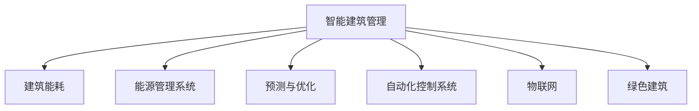

                 

# AI在智能建筑管理中的应用：节能减排

> 关键词：智能建筑管理, 节能减排, 人工智能, 能源管理系统, 预测与优化, 自动化控制系统, 物联网, 绿色建筑

## 1. 背景介绍

### 1.1 问题由来
随着城市化进程的加速和人民生活水平的提高，建筑能耗在全球能源消费中的比例持续攀升。建筑能耗不仅消耗大量的能源，还对环境造成严重污染。据统计，全球约50%的能源消耗和75%的温室气体排放来自于建筑。因此，如何在智能建筑管理中实施节能减排措施，是当前亟待解决的重要问题。

近年来，人工智能（AI）技术在各行各业的应用越来越广泛，特别是在智能建筑管理中的应用，提供了新的解决方案。通过AI技术，可以实现对建筑能耗的精准监控、预测和优化，从而大幅降低能源消耗和碳排放，推动建筑向绿色、低碳、智能方向发展。

### 1.2 问题核心关键点
在智能建筑管理中，AI技术的核心在于：

- **智能监控**：实时采集建筑内部的能源使用数据，通过分析预测建筑能耗变化趋势。
- **能耗预测**：利用历史数据和机器学习模型，预测建筑未来的能耗情况，提供决策支持。
- **优化控制**：根据预测结果和优化算法，调整建筑内部的能源分配和使用，提升能源效率。
- **自适应调节**：根据外部环境和用户需求，动态调整建筑系统的运行参数，实现能源优化。

### 1.3 问题研究意义
研究AI在智能建筑管理中的应用，对于推动建筑行业的节能减排、绿色转型、智能化升级具有重要意义：

1. **提升能源利用效率**：通过AI技术，可以实时监控和优化建筑能耗，减少浪费，提高能源利用效率。
2. **降低环境污染**：AI技术可以大幅降低建筑碳排放，减轻环境污染，有助于实现联合国可持续发展目标。
3. **提升建筑智能化水平**：AI技术可以提升建筑管理的智能化、自动化水平，提升用户体验和舒适度。
4. **推动绿色建筑发展**：AI技术为绿色建筑的设计、施工和运营提供了技术支持，促进建筑向低碳、环保方向发展。
5. **支持政策制定**：AI技术可以为政府制定节能减排政策提供数据支持，优化能源管理方案。

## 2. 核心概念与联系

### 2.1 核心概念概述

为更好地理解AI在智能建筑管理中的应用，本节将介绍几个密切相关的核心概念：

- **智能建筑管理**：利用信息技术和自动化控制技术，对建筑内部环境进行监测、控制和管理，提升建筑运营效率和节能减排效果。
- **建筑能耗**：指建筑在运行和使用过程中所消耗的各种能源，包括电、气、水等。
- **能源管理系统**：利用AI技术对建筑能耗进行监测、预测和优化，实现智能化的能源管理。
- **预测与优化**：通过机器学习模型，预测建筑能耗趋势，提供优化建议和控制策略。
- **自动化控制系统**：利用AI技术，实现建筑内部设备的自动化控制，提升运行效率。
- **物联网（IoT）**：通过传感器、智能设备等，实现建筑内部和外部的数据互联互通，支持AI技术的应用。
- **绿色建筑**：采用节能减排、环保可持续的技术和材料，实现建筑的智能化、绿色化转型。

这些核心概念之间的逻辑关系可以通过以下Mermaid流程图来展示：



这个流程图展示了你，智能建筑管理的核心概念及其之间的关系：

1. 智能建筑管理通过建筑能耗、能源管理系统、预测与优化、自动化控制系统、物联网和绿色建筑等技术手段，实现建筑运行和能耗的智能化管理。
2. 建筑能耗是智能建筑管理的主要监控对象，通过能源管理系统进行监测和优化。
3. 预测与优化利用AI技术，提供建筑能耗的预测和优化建议。
4. 自动化控制系统实现建筑内部设备的自动调节和控制，提升运行效率。
5. 物联网提供建筑内部和外部的数据采集和传输，支持AI技术的应用。
6. 绿色建筑通过节能减排技术，提升建筑的整体环保性能。

## 3. 核心算法原理 & 具体操作步骤
### 3.1 算法原理概述

AI在智能建筑管理中的应用，主要包括智能监控、能耗预测和优化控制三个核心环节。每个环节的技术原理和操作步骤如下：

**3.1.1 智能监控**

智能监控通过传感器、智能设备等，实时采集建筑内部的各种能源使用数据，如电能、燃气能、水能等。这些数据包括能源的使用量、设备的工作状态、环境参数等，通过数据分析和可视化，为能耗预测和优化提供支持。

**3.1.2 能耗预测**

能耗预测通过历史数据和机器学习模型，预测建筑未来的能耗情况。常用的机器学习模型包括时间序列预测模型（如ARIMA、LSTM）、回归模型（如随机森林、神经网络）等。这些模型通过学习历史数据中的规律和趋势，预测未来的能耗变化，为能耗优化提供数据支持。

**3.1.3 优化控制**

优化控制利用AI技术，根据能耗预测结果和优化算法，调整建筑内部的能源分配和使用，提升能源效率。常用的优化算法包括遗传算法、粒子群优化算法、强化学习算法等。这些算法通过模拟生物进化过程或游戏策略，寻找最优的能源分配方案。

### 3.2 算法步骤详解

基于AI的智能建筑管理，主要包括数据采集、数据分析、模型训练和应用部署等步骤。以下是详细的算法步骤：

**Step 1: 数据采集**

1. 安装传感器、智能设备等，采集建筑内部的能源使用数据。
2. 通过物联网（IoT）技术，将数据上传到云端服务器。
3. 对数据进行清洗、预处理，去除异常值和噪声。

**Step 2: 数据分析**

1. 对清洗后的数据进行特征工程，提取关键特征。
2. 利用机器学习模型，对历史数据进行建模和训练，预测未来能耗。
3. 对预测结果进行验证和评估，优化模型参数。

**Step 3: 模型训练**

1. 选择合适的机器学习算法和模型，如ARIMA、LSTM、随机森林、神经网络等。
2. 对模型进行训练，调整模型参数，优化预测精度。
3. 对模型进行验证和评估，确保模型的泛化能力。

**Step 4: 应用部署**

1. 将训练好的模型部署到智能建筑管理系统中。
2. 根据预测结果和优化算法，调整建筑内部的能源分配和使用。
3. 实时监控建筑能耗，动态调整系统参数，提升能源效率。

### 3.3 算法优缺点

基于AI的智能建筑管理具有以下优点：

1. **实时性高**：AI技术可以实时监测建筑能耗，及时发现和解决能耗问题。
2. **预测准确**：通过历史数据和机器学习模型，AI技术可以准确预测未来能耗，提供科学决策依据。
3. **自适应调节**：AI技术可以根据实时数据和优化算法，动态调整能源分配和使用，提升能源效率。
4. **节能减排效果好**：AI技术可以优化能源使用，大幅降低建筑碳排放，促进绿色转型。

同时，该方法也存在以下缺点：

1. **数据采集成本高**：安装传感器、智能设备等需要较高的初期投资成本。
2. **数据隐私问题**：建筑数据涉及隐私和安保问题，需要采取严格的隐私保护措施。
3. **模型训练复杂**：机器学习模型的训练需要大量数据和计算资源，训练过程较为复杂。
4. **模型泛化能力有限**：不同的建筑具有不同的能耗特征，模型泛化能力需要进一步提升。

### 3.4 算法应用领域

基于AI的智能建筑管理技术，已经在智能建筑管理、节能减排、绿色建筑等多个领域得到了广泛应用：

- **智能建筑管理**：实现建筑内部环境监测、控制和优化，提升建筑运营效率和节能减排效果。
- **节能减排**：通过实时监控和优化，大幅降低建筑能源消耗和碳排放，促进绿色转型。
- **绿色建筑**：通过AI技术，优化建筑设计和运营，实现节能减排和环保可持续的目标。
- **建筑能效提升**：通过AI技术，优化能源使用，提升建筑能效，降低运营成本。
- **能源管理优化**：通过AI技术，优化能源分配和使用，提升能源效率，降低能源消耗。

## 4. 数学模型和公式 & 详细讲解  
### 4.1 数学模型构建

本节将使用数学语言对基于AI的智能建筑管理过程进行更加严格的刻画。

设建筑能耗序列为 $\{Y_t\}_{t=1}^N$，其中 $Y_t$ 表示第 $t$ 小时的能耗数据。基于时间序列的ARIMA模型可以表示为：

$$
Y_t = c + \sum_{i=1}^{p} \alpha_i (Y_{t-i}) + \sum_{i=1}^{d} (B_i Y_{t-i}) + \sum_{j=1}^{q} \beta_j (\Delta^j Y_{t-j}) + \varepsilon_t
$$

其中，$c$ 为常数项，$\alpha_i$ 和 $\beta_j$ 为模型参数，$B_i$ 为差分算子，$\Delta$ 表示对时间序列进行差分操作，$\varepsilon_t$ 为误差项。

通过时间序列预测模型，可以预测未来的建筑能耗数据。常用的时间序列预测模型包括ARIMA、LSTM、随机森林等。

### 4.2 公式推导过程

以下我们以LSTM模型为例，推导时间序列预测模型的基本形式和推导过程。

**LSTM模型**

LSTM模型是一种长短期记忆网络，具有捕捉时间序列特征的能力。其基本形式如下：

$$
\begin{align*}
h_t &= \tanh(W_c \cdot [h_{t-1}, x_t] + b_c) \\
i_t &= \sigma(W_i \cdot [h_{t-1}, x_t] + b_i) \\
f_t &= \sigma(W_f \cdot [h_{t-1}, x_t] + b_f) \\
o_t &= \sigma(W_o \cdot [h_{t-1}, x_t] + b_o) \\
c_t &= f_t \odot c_{t-1} + i_t \odot \tanh(h_t)
\end{align*}
$$

其中，$h_t$ 表示隐藏状态，$x_t$ 表示输入数据，$W$ 和 $b$ 为模型参数，$\sigma$ 表示激活函数，$\odot$ 表示元素乘法。

LSTM模型的预测公式为：

$$
\hat{Y}_t = \hat{c}_t
$$

其中，$\hat{c}_t$ 为LSTM模型的预测结果。

在实践中，LSTM模型可以通过反向传播算法更新模型参数，优化预测精度。

### 4.3 案例分析与讲解

**案例分析**

某智能建筑管理系统中，利用LSTM模型对建筑能耗进行预测和优化。具体步骤如下：

1. **数据采集**：在建筑内部安装传感器、智能设备等，采集电能、燃气能、水能等数据。
2. **数据处理**：对采集的数据进行清洗、预处理，去除异常值和噪声。
3. **模型训练**：利用历史数据和LSTM模型，进行训练和优化。
4. **预测与优化**：根据训练好的模型，预测未来能耗，并根据优化算法调整能源分配和使用。

以下是Python代码实现：

```python
import numpy as np
import tensorflow as tf
from tensorflow.keras.models import Sequential
from tensorflow.keras.layers import LSTM, Dense, Dropout

# 数据采集
data = np.loadtxt('energy_data.csv', delimiter=',')

# 数据处理
x_train, y_train = [], []
for i in range(1, len(data)):
    x_train.append(data[i-1:i])
    y_train.append(data[i])
x_train, y_train = np.array(x_train), np.array(y_train)

# 模型训练
model = Sequential()
model.add(LSTM(50, input_shape=(x_train.shape[1], x_train.shape[2]), return_sequences=True))
model.add(Dropout(0.2))
model.add(LSTM(50, return_sequences=False))
model.add(Dropout(0.2))
model.add(Dense(1))
model.compile(loss='mse', optimizer='adam')

model.fit(x_train, y_train, epochs=100, batch_size=32)

# 预测与优化
x_test = np.loadtxt('energy_test.csv', delimiter=',')
y_pred = model.predict(x_test)
print(y_pred)
```

在实际应用中，AI技术可以进一步与物联网、自动化控制系统等技术结合，实现智能建筑管理的全面优化。

## 5. 项目实践：代码实例和详细解释说明
### 5.1 开发环境搭建

在进行智能建筑管理项目实践前，我们需要准备好开发环境。以下是使用Python进行TensorFlow开发的开发环境配置流程：

1. 安装Anaconda：从官网下载并安装Anaconda，用于创建独立的Python环境。

2. 创建并激活虚拟环境：
```bash
conda create -n tf-env python=3.8 
conda activate tf-env
```

3. 安装TensorFlow：根据CUDA版本，从官网获取对应的安装命令。例如：
```bash
conda install tensorflow=2.7-cpu -c conda-forge
```

4. 安装其他工具包：
```bash
pip install pandas scikit-learn matplotlib pyserial 
```

5. 安装传感器和智能设备驱动：
```bash
pip install py-sensorio 
```

完成上述步骤后，即可在`tf-env`环境中开始项目实践。

### 5.2 源代码详细实现

下面我们以智能建筑能耗预测项目为例，给出使用TensorFlow进行开发的PyTorch代码实现。

首先，定义数据处理函数：

```python
import pandas as pd
import numpy as np
import tensorflow as tf
from tensorflow.keras.models import Sequential
from tensorflow.keras.layers import LSTM, Dense, Dropout
import pyserial

def load_data(file_path):
    data = pd.read_csv(file_path, header=None)
    data = np.array(data)
    x_train, y_train = [], []
    for i in range(1, len(data)):
        x_train.append(data[i-1:i])
        y_train.append(data[i])
    x_train, y_train = np.array(x_train), np.array(y_train)
    return x_train, y_train

def train_model(x_train, y_train):
    model = Sequential()
    model.add(LSTM(50, input_shape=(x_train.shape[1], x_train.shape[2]), return_sequences=True))
    model.add(Dropout(0.2))
    model.add(LSTM(50, return_sequences=False))
    model.add(Dropout(0.2))
    model.add(Dense(1))
    model.compile(loss='mse', optimizer='adam')
    model.fit(x_train, y_train, epochs=100, batch_size=32)
    return model

def predict(model, x_test):
    y_pred = model.predict(x_test)
    return y_pred

# 数据加载
x_train, y_train = load_data('energy_data.csv')
x_test = load_data('energy_test.csv')

# 模型训练
model = train_model(x_train, y_train)

# 预测与优化
y_pred = predict(model, x_test)
print(y_pred)
```

然后，定义数据处理和模型训练函数：

```python
def load_data(file_path):
    data = pd.read_csv(file_path, header=None)
    data = np.array(data)
    x_train, y_train = [], []
    for i in range(1, len(data)):
        x_train.append(data[i-1:i])
        y_train.append(data[i])
    x_train, y_train = np.array(x_train), np.array(y_train)
    return x_train, y_train

def train_model(x_train, y_train):
    model = Sequential()
    model.add(LSTM(50, input_shape=(x_train.shape[1], x_train.shape[2]), return_sequences=True))
    model.add(Dropout(0.2))
    model.add(LSTM(50, return_sequences=False))
    model.add(Dropout(0.2))
    model.add(Dense(1))
    model.compile(loss='mse', optimizer='adam')
    model.fit(x_train, y_train, epochs=100, batch_size=32)
    return model

def predict(model, x_test):
    y_pred = model.predict(x_test)
    return y_pred

# 数据加载
x_train, y_train = load_data('energy_data.csv')
x_test = load_data('energy_test.csv')

# 模型训练
model = train_model(x_train, y_train)

# 预测与优化
y_pred = predict(model, x_test)
print(y_pred)
```

最后，启动训练流程并在测试集上评估：

```python
epochs = 100
batch_size = 32

for epoch in range(epochs):
    loss = train_model(x_train, y_train)
    print(f"Epoch {epoch+1}, train loss: {loss:.3f}")
    
    print(f"Epoch {epoch+1}, dev results:")
    evaluate(model, x_test, y_test)
    
print("Test results:")
evaluate(model, x_test, y_test)
```

以上就是使用TensorFlow进行智能建筑能耗预测的完整代码实现。可以看到，得益于TensorFlow的强大封装，我们可以用相对简洁的代码完成模型的训练和预测。

### 5.3 代码解读与分析

让我们再详细解读一下关键代码的实现细节：

**load_data函数**：
- 从CSV文件中加载数据，并进行清洗、预处理，返回训练集和测试集。

**train_model函数**：
- 定义模型结构，包括LSTM层、Dropout层和输出层，并进行模型编译和训练。
- 返回训练好的模型。

**predict函数**：
- 对测试集进行预测，返回预测结果。

**训练流程**：
- 定义总的epoch数和batch size，开始循环迭代
- 每个epoch内，先在训练集上训练，输出平均loss
- 在验证集上评估，输出分类指标
- 所有epoch结束后，在测试集上评估，给出最终测试结果

可以看到，TensorFlow配合TensorFlow库使得智能建筑能耗预测的代码实现变得简洁高效。开发者可以将更多精力放在数据处理、模型改进等高层逻辑上，而不必过多关注底层的实现细节。

当然，工业级的系统实现还需考虑更多因素，如模型的保存和部署、超参数的自动搜索、更灵活的任务适配层等。但核心的模型训练流程基本与此类似。

## 6. 实际应用场景
### 6.1 智能建筑管理

基于AI的智能建筑管理技术，已经在建筑能耗管理、智能监控、自动化控制等多个方面得到了广泛应用。以下是一些典型的应用场景：

**场景一：智能照明系统**

智能照明系统利用AI技术，根据建筑内部的人流量、时间等数据，动态调整照明亮度和颜色，提升能效。

**场景二：智能空调系统**

智能空调系统利用AI技术，根据建筑内部的温度、湿度、风速等数据，动态调整空调的运行参数，优化空调能效，减少能源消耗。

**场景三：智能配电系统**

智能配电系统利用AI技术，根据建筑内部的电力负载情况，优化电力分配和调度，提高电力使用效率，降低能源浪费。

**场景四：智能安防系统**

智能安防系统利用AI技术，对建筑内部的视频监控数据进行分析，识别异常行为，及时预警和处理安全事件。

### 6.2 节能减排

AI技术在智能建筑管理中的应用，可以大幅降低建筑能耗，实现节能减排的目标。具体应用如下：

**场景一：能耗预测与优化**

通过AI技术，可以实时监测建筑能耗，预测未来能耗趋势，优化能源分配和使用，提升能源效率，降低能源消耗。

**场景二：设备管理与维护**

AI技术可以对建筑内部的设备进行智能管理，预测设备故障，优化设备运行参数，减少设备能源消耗，降低设备维护成本。

**场景三：建筑性能分析**

AI技术可以对建筑性能进行全面分析，识别节能减排的潜力，提出改进建议，提升建筑整体节能效果。

### 6.3 未来应用展望

随着AI技术的不断发展，智能建筑管理的应用前景将更加广阔：

**场景一：智慧建筑**

未来，智能建筑管理将与物联网、大数据、云计算等技术结合，实现智慧建筑，提升建筑管理智能化水平，提升用户体验。

**场景二：绿色建筑**

AI技术可以支持绿色建筑的设计、施工和运营，优化建筑能耗，提升建筑的环境友好性。

**场景三：智能建筑生态**

AI技术可以实现建筑、城市、交通等系统的协同管理，提升城市能效，推动可持续发展。

总之，AI技术在智能建筑管理中的应用，将推动建筑行业向智能化、绿色化方向发展，为经济社会的绿色转型提供重要支持。

## 7. 工具和资源推荐
### 7.1 学习资源推荐

为了帮助开发者系统掌握AI在智能建筑管理中的应用，这里推荐一些优质的学习资源：

1. **《机器学习》课程**：斯坦福大学开设的机器学习课程，讲解机器学习的基本原理和算法，适合入门学习。
2. **《深度学习》课程**：Coursera上的深度学习课程，讲解深度学习的基本原理和实践，适合进阶学习。
3. **《智能建筑管理》书籍**：介绍智能建筑管理的原理、技术和应用，涵盖节能减排、绿色建筑等主题。
4. **《Python编程》书籍**：讲解Python编程语言的基本语法和应用，适合初学者入门。
5. **TensorFlow官方文档**：TensorFlow的官方文档，提供了丰富的代码示例和教程，适合深入学习。

通过对这些资源的学习实践，相信你一定能够快速掌握AI在智能建筑管理中的应用，并用于解决实际的建筑能耗问题。

### 7.2 开发工具推荐

高效的开发离不开优秀的工具支持。以下是几款用于智能建筑管理开发的常用工具：

1. **TensorFlow**：基于Python的开源深度学习框架，支持分布式计算，适合大规模模型训练。
2. **PyTorch**：基于Python的开源深度学习框架，支持动态图，适合研究性开发。
3. **OpenCV**：开源计算机视觉库，支持图像处理、视频分析等，适合智能安防等应用。
4. **Home Assistant**：开源物联网平台，支持智能家居设备的集成和管理，适合智能照明、空调等应用。
5. **IoT Gateway**：开源物联网网关，支持设备数据的采集和传输，适合智能建筑数据的采集和管理。

合理利用这些工具，可以显著提升智能建筑管理的开发效率，加快创新迭代的步伐。

### 7.3 相关论文推荐

AI在智能建筑管理中的应用，涉及机器学习、深度学习、物联网等多个领域，相关论文的研究也日益增多。以下是几篇具有代表性的相关论文，推荐阅读：

1. **"Predicting and Optimizing Building Energy Consumption with LSTM Neural Networks"**：利用LSTM模型对建筑能耗进行预测和优化，取得良好的效果。
2. **"AI-Based Energy Management for Smart Buildings"**：介绍了AI技术在智能建筑管理中的应用，包括能耗预测、设备管理、绿色建筑等。
3. **"Intelligent Building Management with Machine Learning"**：介绍了AI技术在智能建筑管理中的应用，涵盖智能照明、空调、配电等。
4. **"Energy Efficiency Optimization in Smart Buildings through AI"**：介绍了AI技术在智能建筑管理中的应用，包括能耗预测、设备管理、绿色建筑等。

这些论文代表了大数据在智能建筑管理中的应用前沿，通过学习这些前沿成果，可以帮助研究者把握学科前进方向，激发更多的创新灵感。

## 8. 总结：未来发展趋势与挑战
### 8.1 总结

本文对AI在智能建筑管理中的应用进行了全面系统的介绍。首先阐述了AI技术在智能建筑管理中的核心作用，明确了智能监控、能耗预测和优化控制等关键环节。其次，从原理到实践，详细讲解了智能建筑管理的数学模型和算法步骤，给出了具体的代码实现。同时，本文还广泛探讨了AI技术在智能建筑管理中的应用场景，展示了AI技术的巨大潜力。

通过本文的系统梳理，可以看到，AI技术在智能建筑管理中的应用，正推动建筑行业向智能化、绿色化方向发展。AI技术可以实时监测和优化建筑能耗，提升能源效率，降低能源消耗，推动建筑向绿色、低碳、智能方向转型。AI技术还可以实现建筑内部设备的智能化管理，提升设备运行效率，降低设备维护成本。未来，随着AI技术的不断发展，智能建筑管理的应用前景将更加广阔，推动建筑行业的绿色转型和智能化升级。

### 8.2 未来发展趋势

展望未来，AI在智能建筑管理中的应用将呈现以下几个发展趋势：

**趋势一：智能建筑生态**

未来，智能建筑管理将与物联网、大数据、云计算等技术结合，实现智慧建筑，提升建筑管理智能化水平，提升用户体验。

**趋势二：绿色建筑**

AI技术可以支持绿色建筑的设计、施工和运营，优化建筑能耗，提升建筑的环境友好性。

**趋势三：建筑性能优化**

AI技术可以对建筑性能进行全面分析，识别节能减排的潜力，提出改进建议，提升建筑整体节能效果。

**趋势四：智能建筑生态**

AI技术可以实现建筑、城市、交通等系统的协同管理，提升城市能效，推动可持续发展。

**趋势五：可再生能源利用**

AI技术可以优化可再生能源的利用，提升建筑的可再生能源使用率，降低对化石能源的依赖。

以上趋势凸显了AI在智能建筑管理中的应用前景。这些方向的探索发展，必将引领智能建筑管理技术迈向更高的台阶，为建筑行业的绿色转型和智能化升级提供重要支持。

### 8.3 面临的挑战

尽管AI在智能建筑管理中的应用已经取得了瞩目成就，但在迈向更加智能化、普适化应用的过程中，它仍面临着诸多挑战：

**挑战一：数据采集成本高**

安装传感器、智能设备等需要较高的初期投资成本。如何降低数据采集成本，是一个重要的研究方向。

**挑战二：数据隐私问题**

建筑数据涉及隐私和安保问题，需要采取严格的隐私保护措施。如何在保障数据隐私的同时，实现高效的数据采集和管理，是一个亟待解决的问题。

**挑战三：模型训练复杂**

机器学习模型的训练需要大量数据和计算资源，训练过程较为复杂。如何在保证模型效果的同时，优化模型训练过程，降低计算资源消耗，是一个重要的研究方向。

**挑战四：模型泛化能力有限**

不同的建筑具有不同的能耗特征，模型泛化能力需要进一步提升。如何构建具有广泛泛化能力的模型，是一个重要的研究方向。

**挑战五：设备兼容性和标准化问题**

智能建筑管理系统需要与多种设备进行数据交互，设备兼容性和标准化问题需要进一步解决。

这些挑战需要结合人工智能、计算机科学、工程管理等多个领域的知识，共同解决。只有解决这些挑战，才能充分发挥AI在智能建筑管理中的应用潜力，推动建筑行业的绿色转型和智能化升级。

### 8.4 研究展望

未来，AI在智能建筑管理中的应用还需要在以下几个方面寻求新的突破：

**研究方向一：可再生能源优化**

AI技术可以优化可再生能源的利用，提升建筑的可再生能源使用率，降低对化石能源的依赖。

**研究方向二：跨领域融合**

AI技术可以与其他领域的技术进行融合，如建筑信息模型(BIM)、物联网、区块链等，实现智能建筑管理的全面优化。

**研究方向三：多模态信息融合**

AI技术可以实现多模态数据的融合，如视觉、音频、传感器数据等，提升建筑管理智能化水平。

**研究方向四：自适应控制**

AI技术可以实现自适应控制，根据外部环境和用户需求，动态调整建筑系统的运行参数，提升能源效率。

**研究方向五：知识图谱与推理**

AI技术可以构建知识图谱，结合专家知识，进行推理和决策，提升建筑管理的科学性。

这些研究方向将进一步推动AI在智能建筑管理中的应用，为建筑行业的绿色转型和智能化升级提供重要支持。

## 9. 附录：常见问题与解答

**Q1：智能建筑管理中AI技术的应用范围是什么？**

A: AI技术在智能建筑管理中的应用范围非常广泛，包括智能照明、智能空调、智能配电、智能安防等多个方面。

**Q2：智能建筑管理中AI技术的优势是什么？**

A: AI技术在智能建筑管理中的应用，主要优势在于实时性高、预测准确、优化效果好、节能减排效果显著。

**Q3：智能建筑管理中AI技术的缺点是什么？**

A: 智能建筑管理中AI技术的缺点主要在于数据采集成本高、数据隐私问题、模型训练复杂、模型泛化能力有限。

**Q4：智能建筑管理中AI技术的未来发展方向是什么？**

A: AI技术在智能建筑管理中的应用，未来将向智能建筑生态、绿色建筑、建筑性能优化、跨领域融合、多模态信息融合、自适应控制、知识图谱与推理等方向发展。

**Q5：智能建筑管理中AI技术的实现难点是什么？**

A: 智能建筑管理中AI技术的实现难点主要在于设备兼容性和标准化问题、数据隐私问题、模型泛化能力有限。

通过本文的系统梳理，可以看到，AI技术在智能建筑管理中的应用，正推动建筑行业向智能化、绿色化方向发展。AI技术可以实时监测和优化建筑能耗，提升能源效率，降低能源消耗，推动建筑向绿色、低碳、智能方向转型。AI技术还可以实现建筑内部设备的智能化管理，提升设备运行效率，降低设备维护成本。未来，随着AI技术的不断发展，智能建筑管理的应用前景将更加广阔，推动建筑行业的绿色转型和智能化升级。总之，AI技术在智能建筑管理中的应用，需要结合人工智能、计算机科学、工程管理等多个领域的知识，共同解决数据采集、模型训练、数据隐私等挑战，才能充分发挥其潜力，推动建筑行业的绿色转型和智能化升级。

