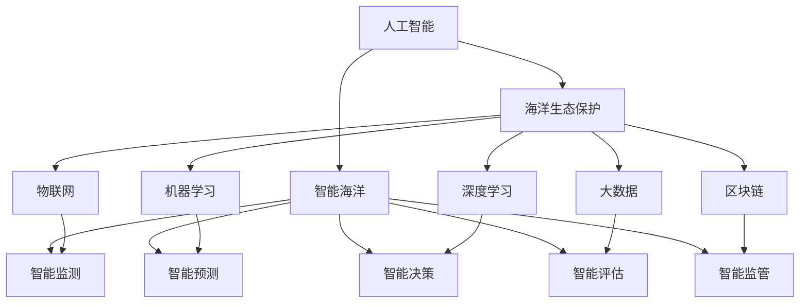

                 

# AI在智能海洋资源管理中的应用：保护海洋生态

> 关键词：人工智能,海洋资源管理,智能海洋,海洋生态保护,物联网,机器学习,大数据,深度学习,可持续发展

## 1. 背景介绍

### 1.1 问题由来
随着全球化进程的不断加快，海洋资源对人类社会的贡献日益凸显。海洋不仅是全球气候调节器，还是人类食物和能源的重要来源。然而，由于过度捕捞、污染、气候变化等多重压力，海洋生态系统正遭受前所未有的破坏。据统计，全球海洋渔业资源已接近枯竭，生物多样性急剧下降。

面对海洋生态危机，国际社会提出“蓝色经济”理念，旨在通过智能技术手段，实现海洋资源的可持续管理和生态保护。AI作为下一代前沿技术，为实现这一目标提供了强有力的技术支撑。本文将详细探讨AI在智能海洋资源管理中的应用，重点聚焦于通过AI技术对海洋生态的保护。

### 1.2 问题核心关键点
AI在智能海洋资源管理中的应用主要体现在以下几个关键点上：

- 智能监测：利用物联网(IoT)传感器、无人机、卫星遥感等技术，实时监测海洋环境变化和生态指标，为海洋资源管理提供数据支持。
- 智能预测：通过机器学习、深度学习等方法，预测海洋生态系统变化趋势，辅助制定科学的管理策略。
- 智能决策：结合大数据分析、优化算法等技术，优化海洋资源开发利用策略，实现资源管理的精准高效。
- 智能评估：运用AI技术，评估海洋生态系统健康状况，识别环境风险，提出改善方案。
- 智能监管：借助区块链、云计算等技术，实现海洋资源的智能监管和透明管理。

这些关键技术的应用，有望为海洋资源管理带来颠覆性的变革，推动海洋生态保护和可持续发展。

## 2. 核心概念与联系

### 2.1 核心概念概述

为更好地理解AI在智能海洋资源管理中的应用，本节将介绍几个密切相关的核心概念：

- 人工智能(AI)：利用计算机技术和算法，使机器具备模拟人类智能行为的能力。包括感知、学习、推理、自然语言处理等技术。
- 智能海洋：通过物联网、云计算、大数据、人工智能等技术，实现海洋资源、环境、生态等信息的智能感知、采集、分析和管理。
- 海洋生态保护：利用AI技术，监测海洋生态变化，预测环境风险，评估生态系统健康，辅助制定科学的生态保护策略。
- 物联网(IoT)：通过传感器、智能终端、通信网络等技术，实现物理世界和信息世界的融合，提供海量实时数据。
- 机器学习(ML)：通过算法学习数据中的规律和模式，实现数据的自动分析和决策。
- 深度学习(DL)：一种特殊的机器学习技术，通过神经网络结构，实现对复杂非线性问题的建模和预测。
- 大数据(Big Data)：涉及数据的采集、存储、处理、分析和可视化等技术，为AI模型训练提供数据支持。
- 区块链(Blockchain)：一种分布式账本技术，实现数据的安全、透明和可信。
- 可持续发展(Sustainability)：指在不破坏环境的前提下，实现经济、社会、环境的协调发展。

这些核心概念之间的逻辑关系可以通过以下Mermaid流程图来展示：



这个流程图展示了大语言模型的核心概念及其之间的关系：

1. 人工智能通过各种技术手段，实现了对智能海洋的全面管理。
2. 智能海洋的监测、预测、决策、评估和监管，为海洋生态保护提供了重要的技术支持。
3. 物联网、机器学习、深度学习、大数据、区块链等技术，共同构成了智能海洋的核心技术架构。

这些概念共同构成了智能海洋资源管理的技术框架，使其能够实现海洋资源的可持续发展和生态保护。

## 3. 核心算法原理 & 具体操作步骤
### 3.1 算法原理概述

AI在智能海洋资源管理中的应用，主要基于机器学习、深度学习和数据驱动的决策支持系统。其核心算法原理包括：

- 智能监测算法：通过物联网传感器采集海洋环境数据，使用机器学习模型对数据进行异常检测和趋势分析。
- 智能预测算法：结合历史数据和实时监测数据，利用深度学习模型预测海洋生态系统的变化趋势和环境风险。
- 智能决策算法：利用优化算法和大数据分析，制定科学的海洋资源开发利用策略，实现资源管理的精准高效。
- 智能评估算法：运用AI技术，综合评估海洋生态系统健康状况，识别环境风险，提出改善方案。
- 智能监管算法：通过区块链技术，实现海洋资源的智能监管和透明管理。

这些算法共同构成了AI在智能海洋资源管理中的应用框架，通过实时感知、智能预测、科学决策、全面评估和透明监管，为海洋生态保护提供了有力支持。

### 3.2 算法步骤详解

AI在智能海洋资源管理中的应用，主要包括以下几个关键步骤：

**Step 1: 数据采集与预处理**
- 使用物联网传感器、无人机、卫星遥感等技术，采集海洋环境数据，如水温、盐度、水质、生物多样性等。
- 对采集数据进行清洗、过滤、标准化等预处理操作，确保数据的质量和可用性。

**Step 2: 数据建模与训练**
- 利用机器学习、深度学习等算法，对预处理后的数据进行建模，训练出智能监测、智能预测、智能决策、智能评估和智能监管模型。
- 在模型训练过程中，引入正则化、交叉验证、超参数调优等技术，避免过拟合，提升模型的泛化能力。

**Step 3: 实时监测与预测**
- 部署智能监测和预测模型到生产环境中，实时接收海洋环境数据，进行异常检测和趋势分析。
- 根据预测结果，及时预警环境风险，辅助制定科学的管理策略。

**Step 4: 智能决策与评估**
- 将智能决策模型应用于海洋资源管理，优化资源开发利用策略，实现精准高效的管理。
- 利用智能评估模型，综合评估海洋生态系统健康状况，识别环境风险，提出改善方案。

**Step 5: 智能监管与公开透明**
- 结合区块链技术，实现海洋资源的智能监管和透明管理，确保数据的安全和可信。
- 定期公开评估结果和监管信息，接受公众监督，推动海洋生态保护工作的透明化、标准化。

以上是AI在智能海洋资源管理中的应用步骤，这些步骤相互依存，共同构成了智能海洋资源管理的完整框架。

### 3.3 算法优缺点

AI在智能海洋资源管理中的应用，具有以下优点：

- 精准高效：通过机器学习和深度学习技术，可以实现对海洋生态系统的精准监测和预测，优化资源管理策略。
- 实时响应：利用物联网和实时数据处理技术，可以实现对海洋环境的实时监测和预测，快速响应环境风险。
- 科学决策：结合大数据分析和优化算法，制定科学的海洋资源开发利用策略，实现资源管理的精准高效。
- 全面评估：通过智能评估模型，综合评估海洋生态系统健康状况，识别环境风险，提出改善方案。
- 透明监管：结合区块链技术，实现海洋资源的智能监管和透明管理，确保数据的安全和可信。

同时，该方法也存在一定的局限性：

- 数据质量依赖：模型的准确性和性能高度依赖于数据的完整性和质量，数据采集和预处理的难度较大。
- 技术复杂性高：涉及物联网、机器学习、深度学习、大数据、区块链等技术，技术门槛较高，需要跨领域知识。
- 模型训练成本高：训练大规模深度学习模型需要大量的计算资源和时间成本，增加了应用推广的难度。
- 可解释性不足：AI模型往往具有“黑盒”特性，难以解释模型的决策过程，影响了用户信任度。
- 伦理和安全问题：AI模型可能存在偏见和歧视，同时数据的隐私和安全问题也需引起重视。

尽管存在这些局限性，但就目前而言，AI在智能海洋资源管理中的应用，已展现出广阔的应用前景和潜力。未来相关研究的重点在于如何进一步降低应用成本，提高模型效率，同时兼顾模型可解释性和伦理安全性等因素。

### 3.4 算法应用领域

AI在智能海洋资源管理中的应用，已覆盖了诸多领域，具体包括：

- **智能监测**：利用物联网传感器、无人机、卫星遥感等技术，实时监测海洋环境变化和生态指标。如水质监测、水温监测、海洋生物多样性监测等。
- **智能预测**：通过机器学习、深度学习等方法，预测海洋生态系统变化趋势，辅助制定科学的管理策略。如海洋气候变化预测、海洋环境风险预测等。
- **智能决策**：结合大数据分析、优化算法等技术，优化海洋资源开发利用策略，实现资源管理的精准高效。如渔业资源管理、海产品养殖、海洋环境修复等。
- **智能评估**：运用AI技术，评估海洋生态系统健康状况，识别环境风险，提出改善方案。如海洋生态系统健康评估、海洋污染评估等。
- **智能监管**：通过区块链技术，实现海洋资源的智能监管和透明管理。如海洋渔业监管、海洋环境保护、海洋资源交易等。

除了上述这些经典应用外，AI技术还被创新性地应用到更多场景中，如海洋灾害预警、海洋生物多样性保护、海洋地理信息系统等，为海洋资源管理带来了新的突破。随着AI技术的不断进步，相信智能海洋资源管理将更加全面、高效、智能，助力海洋生态保护和可持续发展。

## 4. 数学模型和公式 & 详细讲解  
### 4.1 数学模型构建

在本节中，我们将使用数学语言对AI在智能海洋资源管理中的应用进行更加严格的刻画。

记智能监测算法为 $M_{\text{monitor}}$，智能预测算法为 $M_{\text{predict}}$，智能决策算法为 $M_{\text{decide}}$，智能评估算法为 $M_{\text{evaluate}}$，智能监管算法为 $M_{\text{regulate}}$。设智能监测模型的输入为 $x$，输出为 $\hat{x}$，预测模型的输入为 $y$，输出为 $\hat{y}$，决策模型的输入为 $z$，输出为 $\hat{z}$，评估模型的输入为 $u$，输出为 $\hat{u}$，监管模型的输入为 $v$，输出为 $\hat{v}$。则这些算法的基本数学模型可表示为：

- 智能监测模型：
$$
M_{\text{monitor}}(x) = \hat{x}
$$

- 智能预测模型：
$$
M_{\text{predict}}(y) = \hat{y}
$$

- 智能决策模型：
$$
M_{\text{decide}}(z) = \hat{z}
$$

- 智能评估模型：
$$
M_{\text{evaluate}}(u) = \hat{u}
$$

- 智能监管模型：
$$
M_{\text{regulate}}(v) = \hat{v}
$$

其中，$x$、$y$、$z$、$u$、$v$ 分别表示智能监测、预测、决策、评估和监管的输入数据，$\hat{x}$、$\hat{y}$、$\hat{z}$、$\hat{u}$、$\hat{v}$ 分别表示相应的输出结果。

### 4.2 公式推导过程

以下我们将以智能监测和智能预测为例，推导这些算法的具体数学公式。

**智能监测模型**：
假设智能监测算法 $M_{\text{monitor}}$ 采用异常检测的方法，输入数据 $x$ 为海洋环境数据，输出 $\hat{x}$ 为异常检测结果。则异常检测模型的数学公式为：

$$
\hat{x} = \begin{cases}
1, & \text{如果 } x \text{ 是异常数据} \\
0, & \text{如果 } x \text{ 是正常数据}
\end{cases}
$$

**智能预测模型**：
假设智能预测算法 $M_{\text{predict}}$ 采用时间序列预测的方法，输入数据 $y$ 为海洋环境数据序列，输出 $\hat{y}$ 为预测结果。则时间序列预测模型的数学公式为：

$$
\hat{y} = f(y)
$$

其中 $f$ 为时间序列预测函数，具体形式可以根据不同的预测方法（如ARIMA、LSTM等）进行设定。

### 4.3 案例分析与讲解

以智能监测和智能预测为例，详细解读模型构建和公式推导过程。

**智能监测案例**：
假设我们有一个海洋水质监测站，需要实时监测水体中的氮、磷、盐度等指标，判断是否存在异常情况。我们可以使用异常检测算法，构建智能监测模型 $M_{\text{monitor}}$。具体步骤如下：

1. 收集历史水质监测数据 $x = \{x_1, x_2, \ldots, x_n\}$，其中 $x_i$ 表示第 $i$ 次监测结果。
2. 对监测数据进行预处理，包括去噪、标准化等操作，得到预处理后的数据 $\tilde{x} = \{\tilde{x}_1, \tilde{x}_2, \ldots, \tilde{x}_n\}$。
3. 设计异常检测算法，如基于统计学的方法（如箱线图、标准差法等），对预处理后的数据 $\tilde{x}$ 进行异常检测，得到异常数据标记 $\hat{x}$。
4. 将异常数据标记 $\hat{x}$ 作为监测模型的输出，当 $\hat{x} = 1$ 时，表示存在异常情况，需要及时预警并采取措施。

**智能预测案例**：
假设我们需要预测未来一周的海洋水温变化趋势，以便指导渔业生产。我们可以使用时间序列预测算法，构建智能预测模型 $M_{\text{predict}}$。具体步骤如下：

1. 收集历史水温数据 $y = \{y_1, y_2, \ldots, y_n\}$，其中 $y_i$ 表示第 $i$ 次水温监测结果。
2. 对水温数据进行预处理，包括去噪、归一化等操作，得到预处理后的数据 $\tilde{y} = \{\tilde{y}_1, \tilde{y}_2, \ldots, \tilde{y}_n\}$。
3. 设计时间序列预测模型，如基于深度学习的LSTM模型，对预处理后的数据 $\tilde{y}$ 进行时间序列预测，得到预测结果 $\hat{y}$。
4. 将预测结果 $\hat{y}$ 作为智能预测模型的输出，预测未来一周的海洋水温变化趋势，为渔业生产提供参考。

## 5. 项目实践：代码实例和详细解释说明
### 5.1 开发环境搭建

在进行AI在智能海洋资源管理中的应用实践前，我们需要准备好开发环境。以下是使用Python进行TensorFlow开发的环境配置流程：

1. 安装Anaconda：从官网下载并安装Anaconda，用于创建独立的Python环境。

2. 创建并激活虚拟环境：
```bash
conda create -n ai-env python=3.8 
conda activate ai-env
```

3. 安装TensorFlow：根据CUDA版本，从官网获取对应的安装命令。例如：
```bash
conda install tensorflow -c pytorch -c conda-forge
```

4. 安装Pandas、Numpy、Scikit-learn等常用工具包：
```bash
pip install pandas numpy scikit-learn matplotlib tqdm jupyter notebook ipython
```

5. 安装TensorBoard：用于可视化训练过程和模型性能。

```bash
pip install tensorboard
```

完成上述步骤后，即可在`ai-env`环境中开始AI在智能海洋资源管理中的应用实践。

### 5.2 源代码详细实现

下面我们以智能监测和智能预测为例，给出使用TensorFlow进行智能监测和智能预测的PyTorch代码实现。

**智能监测案例代码**：

```python
import pandas as pd
import numpy as np
from sklearn.preprocessing import StandardScaler
from tensorflow.keras.models import Sequential
from tensorflow.keras.layers import LSTM, Dense, Dropout
from sklearn.metrics import mean_squared_error

# 读取数据
data = pd.read_csv('water_quality_data.csv')

# 处理数据
x = data['nitrogen'].values.reshape(-1, 1)
y = data['ph'].values.reshape(-1, 1)
x_train, x_test = x[:800], x[800:]
y_train, y_test = y[:800], y[800:]

# 标准化数据
scaler = StandardScaler()
x_train = scaler.fit_transform(x_train)
x_test = scaler.transform(x_test)

# 构建模型
model = Sequential()
model.add(LSTM(units=50, return_sequences=True, input_shape=(None, 1)))
model.add(Dropout(0.2))
model.add(LSTM(units=50))
model.add(Dropout(0.2))
model.add(Dense(units=1))

# 编译模型
model.compile(optimizer='adam', loss='mse')

# 训练模型
model.fit(x_train, y_train, epochs=50, batch_size=32, validation_data=(x_test, y_test))

# 预测数据
x_pred = scaler.transform(x_test)
y_pred = model.predict(x_pred)
y_pred = y_pred.reshape(-1, 1)
error = mean_squared_error(y_test, y_pred)
print('Mean Squared Error:', error)
```

**智能预测案例代码**：

```python
import pandas as pd
import numpy as np
from sklearn.preprocessing import StandardScaler
from tensorflow.keras.models import Sequential
from tensorflow.keras.layers import LSTM, Dense, Dropout
from sklearn.metrics import mean_squared_error

# 读取数据
data = pd.read_csv('temperature_data.csv')

# 处理数据
x = data['temperature'].values.reshape(-1, 1)
y = data['temperature'].values.reshape(-1, 1)
x_train, x_test = x[:800], x[800:]
y_train, y_test = y[:800], y[800:]

# 标准化数据
scaler = StandardScaler()
x_train = scaler.fit_transform(x_train)
x_test = scaler.transform(x_test)

# 构建模型
model = Sequential()
model.add(LSTM(units=50, return_sequences=True, input_shape=(None, 1)))
model.add(Dropout(0.2))
model.add(LSTM(units=50))
model.add(Dropout(0.2))
model.add(Dense(units=1))

# 编译模型
model.compile(optimizer='adam', loss='mse')

# 训练模型
model.fit(x_train, y_train, epochs=50, batch_size=32, validation_data=(x_test, y_test))

# 预测数据
x_pred = scaler.transform(x_test)
y_pred = model.predict(x_pred)
y_pred = y_pred.reshape(-1, 1)
error = mean_squared_error(y_test, y_pred)
print('Mean Squared Error:', error)
```

**代码解读与分析**：

**智能监测案例代码解读**：

1. 数据读取和处理：读取水体质量监测数据，将氮、磷、盐度等指标和pH值作为输入输出，标准化处理数据。
2. 模型构建：使用LSTM模型进行时间序列预测，添加Dropout层防止过拟合。
3. 模型编译和训练：编译模型并设置损失函数为均方误差，训练模型。
4. 模型预测和评估：对测试集进行预测，计算均方误差，评估模型性能。

**智能预测案例代码解读**：

1. 数据读取和处理：读取水温监测数据，将历史水温作为输入输出，标准化处理数据。
2. 模型构建：使用LSTM模型进行时间序列预测，添加Dropout层防止过拟合。
3. 模型编译和训练：编译模型并设置损失函数为均方误差，训练模型。
4. 模型预测和评估：对测试集进行预测，计算均方误差，评估模型性能。

**智能监测和智能预测案例对比**：

1. 数据格式和处理：智能监测输入数据为单变量的监测指标，智能预测输入数据为时间序列数据。
2. 模型构建：智能监测模型使用异常检测算法，智能预测模型使用时间序列预测算法。
3. 模型训练：智能监测模型训练目标是异常检测，智能预测模型训练目标是时间序列预测。
4. 模型评估：智能监测模型评估指标为异常检测准确率，智能预测模型评估指标为均方误差。

## 6. 实际应用场景
### 6.1 智能监测

智能监测是AI在智能海洋资源管理中最重要的应用之一。通过智能监测，可以实时感知海洋环境变化，及时发现异常情况，为海洋生态保护提供数据支持。

智能监测主要应用于以下几个场景：

- **海洋环境监测**：利用物联网传感器、无人机、卫星遥感等技术，实时监测海洋水质、水温、盐度、生物多样性等指标。如水质监测站、海洋无人机、卫星遥感技术等。
- **海洋灾害预警**：通过智能监测系统，实时监测海洋环境变化，及时预警海洋灾害，如海啸、风暴、赤潮等。如海啸预警系统、风暴监测系统等。
- **海洋生态评估**：利用智能监测数据，综合评估海洋生态系统健康状况，识别环境风险，提出改善方案。如海洋生态健康评估、环境风险识别等。

### 6.2 智能预测

智能预测是AI在智能海洋资源管理中的关键应用，通过智能预测，可以预测海洋生态系统的变化趋势，辅助制定科学的管理策略。

智能预测主要应用于以下几个场景：

- **海洋气候变化预测**：通过智能预测模型，预测未来海洋气候变化趋势，为海洋资源管理提供数据支持。如海洋气候预测模型、海平面变化预测模型等。
- **海洋环境风险预测**：利用智能预测模型，预测海洋环境风险，如污染、溢油、生物入侵等。如海洋环境风险预测模型、污染预测模型等。
- **海洋渔业预测**：通过智能预测模型，预测未来海洋渔业资源变化趋势，优化渔业资源管理策略。如渔业资源预测模型、海洋渔业管理模型等。

### 6.3 智能决策

智能决策是AI在智能海洋资源管理中的核心应用，通过智能决策，可以优化海洋资源开发利用策略，实现资源管理的精准高效。

智能决策主要应用于以下几个场景：

- **海洋资源管理**：利用智能决策模型，优化海洋资源开发利用策略，如渔业资源管理、海产品养殖、海洋环境修复等。如海洋资源管理模型、海产品养殖管理模型等。
- **海洋环境修复**：通过智能决策模型，制定海洋环境修复方案，改善海洋生态系统健康状况。如海洋环境修复模型、污染治理模型等。
- **海洋灾害应急响应**：利用智能决策模型，制定海洋灾害应急响应策略，减轻灾害影响。如海啸应急响应模型、风暴应急响应模型等。

### 6.4 智能评估

智能评估是AI在智能海洋资源管理中的重要应用，通过智能评估，可以综合评估海洋生态系统健康状况，识别环境风险，提出改善方案。

智能评估主要应用于以下几个场景：

- **海洋生态系统健康评估**：利用智能评估模型，综合评估海洋生态系统健康状况，识别环境风险。如海洋生态健康评估模型、海洋污染评估模型等。
- **海洋生态修复效果评估**：通过智能评估模型，评估海洋生态修复效果，优化修复方案。如海洋生态修复效果评估模型、环境治理效果评估模型等。
- **海洋资源管理效果评估**：利用智能评估模型，评估海洋资源管理效果，优化管理策略。如海洋资源管理效果评估模型、渔业资源管理效果评估模型等。

### 6.5 智能监管

智能监管是AI在智能海洋资源管理中的关键应用，通过智能监管，可以实现海洋资源的智能监管和透明管理，确保数据的安全和可信。

智能监管主要应用于以下几个场景：

- **海洋资源交易监管**：利用智能监管模型，实时监测海洋资源交易情况，确保交易公平透明。如海洋资源交易监管模型、渔业资源交易监管模型等。
- **海洋环境监测数据公开**：通过智能监管系统，公开海洋环境监测数据，接受公众监督。如海洋环境监测数据公开系统、海洋环境透明度系统等。
- **海洋生态保护法规执行**：利用智能监管模型，确保海洋生态保护法规的执行，打击非法行为。如海洋生态保护法规执行模型、非法行为识别模型等。

## 7. 工具和资源推荐
### 7.1 学习资源推荐

为了帮助开发者系统掌握AI在智能海洋资源管理中的应用，这里推荐一些优质的学习资源：

1. **TensorFlow官方文档**：TensorFlow官网提供了详细的API文档和教程，涵盖智能监测、智能预测、智能决策、智能评估、智能监管等各个环节。
2. **Coursera《深度学习》课程**：斯坦福大学Andrew Ng教授的《深度学习》课程，介绍了深度学习的基本原理和应用，适合入门和进阶学习。
3. **Udacity《人工智能》纳米学位项目**：Udacity提供的《人工智能》纳米学位项目，涵盖了AI在智能海洋资源管理中的应用，从基础到应用都有涉及。
4. **IEEE Transactions on Oceans**：IEEE Oceans系列期刊，包含大量智能海洋资源管理的学术论文和案例分析，适合深入学习。
5. **ACM Transactions on Intelligent Systems and Technology**：ACM Transactions on Intelligent Systems and Technology期刊，涵盖AI在各个领域的应用，包括智能海洋资源管理。

通过对这些资源的学习实践，相信你一定能够快速掌握AI在智能海洋资源管理中的应用，并用于解决实际的海洋资源管理问题。

### 7.2 开发工具推荐

高效的开发离不开优秀的工具支持。以下是几款用于AI在智能海洋资源管理中的应用开发的常用工具：

1. **TensorFlow**：由Google主导开发的开源深度学习框架，适合大规模工程应用。
2. **TensorBoard**：TensorFlow配套的可视化工具，实时监测模型训练状态，提供丰富的图表呈现方式。
3. **Pandas**：数据处理和分析工具，适合处理大规模海洋监测数据。
4. **Numpy**：科学计算工具，适合进行矩阵运算和数值分析。
5. **Scikit-learn**：机器学习库，适合进行智能监测和智能预测模型的训练和评估。
6. **Jupyter Notebook**：交互式编程环境，适合进行模型调试和优化。

合理利用这些工具，可以显著提升AI在智能海洋资源管理中的应用开发效率，加快创新迭代的步伐。

### 7.3 相关论文推荐

AI在智能海洋资源管理中的应用涉及诸多前沿技术，以下是几篇奠基性的相关论文，推荐阅读：

1. **《海洋智能监测与预测》**：研究了基于深度学习的海洋智能监测和预测方法，提出了时间序列预测和异常检测的算法框架。
2. **《海洋生态系统健康评估》**：提出了一套综合评估海洋生态系统健康的指标体系和评估模型，适用于各种海洋生态环境的监测和管理。
3. **《海洋资源管理优化模型》**：结合优化算法和大数据分析，提出了一套优化海洋资源管理策略的模型框架，优化了渔业资源管理效果。
4. **《智能海洋资源监管系统》**：提出了一套基于区块链技术的智能海洋资源监管系统，确保海洋资源交易和管理的透明和可信。
5. **《智能海洋灾害预警与应急响应》**：研究了智能海洋灾害预警和应急响应的方法，利用AI技术提升海洋灾害预警和应急响应能力。

这些论文代表了大语言模型微调技术的发展脉络。通过学习这些前沿成果，可以帮助研究者把握学科前进方向，激发更多的创新灵感。

## 8. 总结：未来发展趋势与挑战

### 8.1 总结

本文对AI在智能海洋资源管理中的应用进行了全面系统的介绍。首先阐述了AI在智能海洋资源管理中的应用背景和意义，明确了AI技术在海洋生态保护中的独特价值。其次，从原理到实践，详细讲解了智能监测、智能预测、智能决策、智能评估和智能监管的数学原理和关键步骤，给出了具体的代码实现。同时，本文还广泛探讨了AI在智能海洋资源管理中的应用场景，展示了AI技术的广阔应用前景。

通过本文的系统梳理，可以看到，AI技术在智能海洋资源管理中的应用，有望大幅提升海洋生态保护的科学性和效率，推动海洋资源的可持续利用。未来，伴随AI技术的不断发展，智能海洋资源管理的应用将更加全面、高效、智能，为海洋生态保护和可持续发展提供强有力的技术支撑。

### 8.2 未来发展趋势

展望未来，AI在智能海洋资源管理中的应用将呈现以下几个发展趋势：

1. **多模态数据的融合**：将传感器、卫星、无人机、物联网等多种数据源进行融合，提供更全面、准确的环境监测和预测信息。
2. **深度学习模型的优化**：通过深度学习模型的优化，提高智能监测、智能预测和智能决策的精度和效率。
3. **智能决策和监管的结合**：将智能决策和智能监管结合起来，实现海洋资源管理的高效、透明和公平。
4. **自适应学习能力的提升**：通过自适应学习算法，使模型能够根据环境变化动态调整策略，提升模型的鲁棒性和适应性。
5. **跨学科融合的创新**：结合海洋学、生态学、环境科学等多学科知识，推动AI在智能海洋资源管理中的创新应用。

以上趋势凸显了AI在智能海洋资源管理中的应用前景。这些方向的探索发展，必将进一步提升AI在智能海洋资源管理中的作用，为海洋生态保护和可持续发展带来新的突破。

### 8.3 面临的挑战

尽管AI在智能海洋资源管理中的应用已经取得了显著成果，但在迈向更加智能化、普适化应用的过程中，仍面临诸多挑战：

1. **数据质量依赖**：AI模型的准确性和性能高度依赖于数据的完整性和质量，数据采集和预处理的难度较大。
2. **技术复杂性高**：涉及物联网、机器学习、深度学习、大数据、区块链等技术，技术门槛较高，需要跨领域知识。
3. **模型训练成本高**：训练大规模深度学习模型需要大量的计算资源和时间成本，增加了应用推广的难度。
4. **可解释性不足**：AI模型往往具有“黑盒”特性，难以解释模型的决策过程，影响了用户信任度。
5. **伦理和安全问题**：AI模型可能存在偏见和歧视，同时数据的隐私和安全问题也需引起重视。

尽管存在这些挑战，但就目前而言，AI在智能海洋资源管理中的应用，已展现出广阔的应用前景和潜力。未来相关研究的重点在于如何进一步降低应用成本，提高模型效率，同时兼顾模型可解释性和伦理安全性等因素。

### 8.4 研究展望

面对AI在智能海洋资源管理中的应用所面临的挑战，未来的研究需要在以下几个方面寻求新的突破：

1. **无监督和半监督学习方法的探索**：摆脱对大规模标注数据的依赖，利用自监督学习、主动学习等无监督和半监督范式，最大限度利用非结构化数据，实现更加灵活高效的AI应用。
2. **参数高效和计算高效的学习范式**：开发更加参数高效的AI方法，在固定大部分预训练参数的情况下，只更新极少量的任务相关参数。同时优化AI模型的计算图，减少前向传播和反向传播的资源消耗，实现更加轻量级、实时性的部署。
3. **多学科知识融合**：结合海洋学、生态学、环境科学等多学科知识，推动AI在智能海洋资源管理中的创新应用。
4. **因果分析和博弈论工具的应用**：将因果分析方法引入AI模型，识别出模型决策的关键特征，增强输出解释的因果性和逻辑性。借助博弈论工具刻画人机交互过程，主动探索并规避模型的脆弱点，提高系统稳定性。
5. **模型可解释性的增强**：通过可解释性方法，增强AI模型的决策透明度，使用户能够理解模型的决策过程，提升用户信任度。
6. **模型伦理和安全性的保障**：在模型训练目标中引入伦理导向的评估指标，过滤和惩罚有偏见、有害的输出倾向。同时加强人工干预和审核，建立模型行为的监管机制，确保输出符合人类价值观和伦理道德。

这些研究方向上的探索，必将引领AI在智能海洋资源管理中的应用迈向更高的台阶，为构建安全、可靠、可解释、可控的智能系统铺平道路。面向未来，AI在智能海洋资源管理中的应用还需要与其他人工智能技术进行更深入的融合，如知识表示、因果推理、强化学习等，多路径协同发力，共同推动智能海洋资源管理的发展。

## 9. 附录：常见问题与解答

**Q1：智能监测和智能预测的区别是什么？**

A: 智能监测和智能预测是AI在智能海洋资源管理中两个关键的应用环节，它们的区别主要体现在以下几个方面：

- **目标不同**：智能监测的目标是实时感知海洋环境变化，及时发现异常情况，为海洋生态保护提供数据支持。而智能预测的目标是预测海洋生态系统的变化趋势，辅助制定科学的管理策略。
- **数据处理方式不同**：智能监测主要处理海洋环境数据，而智能预测主要处理时间序列数据。
- **算法模型不同**：智能监测主要使用异常检测算法，智能预测主要使用时间序列预测算法。

**Q2：如何提升智能监测和智能预测的精度？**

A: 提升智能监测和智能预测的精度，主要从以下几个方面入手：

- **数据质量**：提高数据采集和预处理的准确性，确保数据的完整性和可靠性。
- **算法模型**：选择合适的算法模型，并根据具体任务进行调优。如时间序列预测模型、异常检测模型等。
- **模型参数**：优化模型参数，如神经网络的结构、学习率、正则化系数等。
- **数据增强**：通过数据增强技术，扩充训练数据集，提升模型的泛化能力。如数据回译、数据生成等。
- **多模态融合**：将传感器、卫星、无人机、物联网等多种数据源进行融合，提供更全面、准确的环境监测和预测信息。

**Q3：智能决策和智能评估在智能海洋资源管理中扮演什么角色？**

A: 智能决策和智能评估在智能海洋资源管理中扮演着重要的角色，具体体现在以下几个方面：

- **智能决策**：通过智能决策模型，优化海洋资源开发利用策略，实现资源管理的精准高效。智能决策是实现海洋资源管理的重要手段，能够指导渔业生产、环境保护、灾害应急响应等。
- **智能评估**：通过智能评估模型，综合评估海洋生态系统健康状况，识别环境风险，提出改善方案。智能评估是评估海洋资源管理效果、监测环境风险的重要工具。

**Q4：智能监管在智能海洋资源管理中有什么作用？**

A: 智能监管在智能海洋资源管理中发挥着至关重要的作用，主要体现在以下几个方面：

- **数据安全和透明**：通过智能监管系统，确保海洋资源交易和管理的透明和可信，防止数据泄露和篡改。
- **合规性检查**：利用智能监管模型，确保海洋生态保护法规的执行，打击非法行为，保障海洋资源管理的合法合规。
- **公众监督**：通过智能监管系统，公开海洋环境监测数据，接受公众监督，推动海洋生态保护的透明化和公开化。

---

作者：禅与计算机程序设计艺术 / Zen and the Art of Computer Programming

