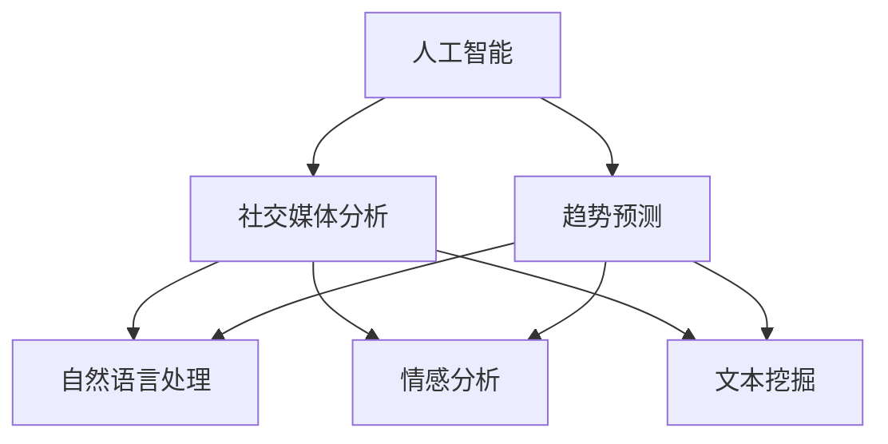

                 

# AI在社交媒体分析中的应用：趋势预测

> 关键词：人工智能, 社交媒体分析, 趋势预测, 自然语言处理, 机器学习, 大数据, 情感分析, 模型优化

## 1. 背景介绍

### 1.1 问题由来
随着社交媒体平台的普及，大量用户生成内容(UGCs)产生，形成了规模庞大的在线数据集。社交媒体数据不仅包含丰富的生活细节和社交动态，还能反映出社会现象和趋势。例如，热门话题、品牌声誉、用户情绪等，都是极具研究价值的要素。如何从海量社交媒体数据中提取有价值的信息，成为当下数据科学和人工智能(AI)研究的前沿课题。

通过对社交媒体数据的深度分析和挖掘，AI技术可以揭示出各种趋势，包括但不限于以下几类：
- **热门话题分析**：实时跟踪并分析热点话题，帮助企业及时调整市场策略，抢占市场先机。
- **品牌声誉监测**：通过情感分析技术，实时监控品牌在社交媒体上的声誉变化，及时发现和解决问题。
- **用户情绪分析**：准确识别用户情绪变化，帮助企业更好地理解市场情绪，做出针对性决策。
- **事件预测**：通过对社交媒体内容的分析，预测重大事件的潜在影响和趋势。

本文将重点探讨如何使用AI技术进行社交媒体数据的趋势预测，涵盖数据收集、预处理、模型构建、结果分析和应用部署等关键环节。

### 1.2 问题核心关键点
社交媒体趋势预测的核心在于，如何高效、准确地从海量的无结构化数据中提取出有用信息，并对未来趋势进行预测。核心问题包括：

- **数据处理**：如何高效地从不同社交媒体平台收集和清洗数据，使其符合模型训练和预测的要求。
- **模型选择**：选择哪种机器学习模型（如SVM、随机森林、深度神经网络等）来预测趋势。
- **特征工程**：从原始数据中提取何种特征（如文本内容、用户行为、时间特征等），能更好地提升模型性能。
- **模型优化**：如何优化模型参数、选择合适的超参数，以获得更好的预测效果。
- **结果验证**：通过何种方式评估模型预测结果的准确性和可靠性，不断迭代优化。

本文将系统介绍如何通过人工智能技术实现社交媒体趋势预测，并对上述核心问题进行详细阐述。

## 2. 核心概念与联系

### 2.1 核心概念概述

为更好地理解AI在社交媒体趋势预测中的应用，本节将介绍几个密切相关的核心概念：

- **人工智能**：通过机器学习、深度学习等技术，使计算机系统具有人类智能行为的能力。
- **社交媒体分析**：利用自然语言处理(NLP)、情感分析、文本挖掘等技术，分析社交媒体数据中的信息。
- **趋势预测**：通过统计学、机器学习等方法，预测未来的趋势和变化。
- **自然语言处理**：使用算法处理和分析人类语言数据，包括文本清洗、特征提取、文本分类、实体识别等。
- **机器学习**：通过算法和模型，使计算机系统能够从数据中学习并做出预测。
- **大数据技术**：处理和分析海量数据的技术，包括分布式存储、流式计算、数据挖掘等。

这些核心概念之间的逻辑关系可以通过以下Mermaid流程图来展示：



这个流程图展示了大语言模型的核心概念及其之间的关系：

1. 人工智能技术通过机器学习、深度学习等算法实现从数据中提取有用信息。
2. 社交媒体分析利用自然语言处理、情感分析、文本挖掘等技术，分析社交媒体数据中的信息。
3. 趋势预测通过统计学、机器学习等方法，预测未来的趋势和变化。
4. 自然语言处理是人工智能处理人类语言数据的关键技术，包括文本清洗、特征提取、文本分类、实体识别等。
5. 情感分析是自然语言处理的重要应用之一，用于识别文本中的情感倾向，如正面、负面、中性等。
6. 文本挖掘从社交媒体数据中挖掘有价值的信息，如热点话题、品牌声誉、用户情绪等。

这些核心概念共同构成了社交媒体趋势预测的理论基础，使得利用AI技术从社交媒体数据中提取有用信息并预测未来趋势成为可能。

## 3. 核心算法原理 & 具体操作步骤
### 3.1 算法原理概述

社交媒体趋势预测的本质是一种监督学习问题，旨在利用历史数据训练模型，以对未来的趋势进行预测。其核心思想是：

- **数据准备**：收集和清洗社交媒体数据，提取特征。
- **模型训练**：选择适合的机器学习模型，并在标注数据上进行训练。
- **模型评估**：使用验证集评估模型性能，优化模型参数。
- **模型应用**：将训练好的模型应用于新的数据，预测未来趋势。

形式化地，假设我们有历史社交媒体数据集 $D=\{(x_i, y_i)\}_{i=1}^N$，其中 $x_i$ 表示社交媒体内容，$y_i$ 表示对应的标签或趋势指标。模型的目标是学习一个映射函数 $f: \mathcal{X} \rightarrow \mathcal{Y}$，其中 $\mathcal{X}$ 是输入空间，$\mathcal{Y}$ 是输出空间。最终目标是通过训练数据 $D$ 拟合出模型 $f$，并用于对新数据 $x$ 进行趋势预测。

### 3.2 算法步骤详解

社交媒体趋势预测一般包括以下几个关键步骤：

**Step 1: 数据收集与预处理**
- **数据收集**：从不同社交媒体平台（如微博、Twitter、Facebook等）收集数据，包括文本、图片、视频等。
- **数据清洗**：去重、过滤垃圾信息、处理数据格式等，确保数据质量。
- **特征提取**：从原始数据中提取有意义的特征，如文本内容、用户行为、时间特征等。

**Step 2: 模型选择与训练**
- **模型选择**：根据任务特点选择合适的模型，如线性回归、逻辑回归、支持向量机(SVM)、随机森林、深度神经网络等。
- **数据划分**：将数据集划分为训练集、验证集和测试集。
- **模型训练**：在训练集上使用优化算法训练模型，如梯度下降、随机梯度下降等。
- **超参数调优**：根据验证集评估模型性能，调整模型超参数，如学习率、正则化参数等。

**Step 3: 模型评估与优化**
- **评估指标**：选择适合的评估指标，如准确率、召回率、F1分数、ROC曲线等。
- **模型优化**：在验证集上评估模型性能，不断优化模型结构和参数。
- **结果分析**：分析模型在不同特征下的表现，提取最优特征组合。

**Step 4: 模型部署与应用**
- **模型保存**：将训练好的模型保存，便于后续应用。
- **部署应用**：将模型集成到实际应用系统中，进行实时趋势预测。
- **效果监控**：监控模型在实际应用中的性能，及时调整模型参数。

以上是社交媒体趋势预测的一般流程。在实际应用中，还需要针对具体任务的特点，对各个环节进行优化设计，如改进特征提取方法、引入深度学习模型、优化超参数搜索等，以进一步提升模型性能。

### 3.3 算法优缺点

社交媒体趋势预测的监督学习范式具有以下优点：
1. 可以充分利用社交媒体的丰富数据资源，提取有用信息。
2. 模型训练过程明确，可以针对具体问题进行调整优化。
3. 适合多种趋势预测任务，如热点话题、品牌声誉、用户情绪等。

同时，该方法也存在一定的局限性：
1. 依赖标注数据，获取高质量标注数据成本较高。
2. 模型对数据噪声敏感，较难处理噪声数据。
3. 模型结果可解释性不足，难以解释预测逻辑。
4. 对模型参数和超参数调优依赖较大，需要较多人工干预。

尽管存在这些局限性，但就目前而言，监督学习的趋势预测方法仍是社交媒体分析领域的主流范式。未来相关研究的重点在于如何进一步降低对标注数据的依赖，提高模型的鲁棒性和可解释性，同时兼顾预测效率。

### 3.4 算法应用领域

社交媒体趋势预测的监督学习范式，已经在多个领域得到了广泛的应用，例如：

- **品牌舆情监测**：实时监测品牌在社交媒体上的声誉变化，分析舆情变化趋势，为品牌营销策略提供决策依据。
- **热门话题分析**：实时跟踪并分析热门话题，预测未来的热门趋势，帮助企业抢占市场先机。
- **用户情绪分析**：准确识别用户情绪变化，分析市场情绪，帮助企业做出针对性决策。
- **事件预测**：通过对社交媒体内容的分析，预测重大事件的潜在影响和趋势，如突发灾害、政治事件等。

除了上述这些经典应用外，社交媒体趋势预测还被创新性地应用于更多场景中，如舆情预警、热点事件追踪、用户行为预测等，为社交媒体分析技术带来了新的突破。随着深度学习和大数据技术的不断发展，相信社交媒体趋势预测将在更多领域得到应用，为数据科学和商业决策提供新的支撑。

## 4. 数学模型和公式 & 详细讲解  
### 4.1 数学模型构建

本节将使用数学语言对社交媒体趋势预测过程进行更加严格的刻画。

假设我们有历史社交媒体数据集 $D=\{(x_i, y_i)\}_{i=1}^N$，其中 $x_i$ 表示社交媒体内容，$y_i$ 表示对应的标签或趋势指标。

定义模型 $M$ 在输入 $x$ 上的输出为 $y$，则社交媒体趋势预测的数学模型可以表示为：

$$
\min_{\theta} \sum_{i=1}^N \mathcal{L}(y_i, M(x_i))
$$

其中，$\mathcal{L}$ 为损失函数，$M$ 为模型参数，$\theta$ 为模型的权重和偏置。

常见的损失函数包括均方误差损失、交叉熵损失等。例如，假设我们使用的是线性回归模型，则损失函数可以表示为：

$$
\mathcal{L}(y_i, M(x_i)) = \frac{1}{2}(y_i - M(x_i))^2
$$

在得到损失函数后，我们可以使用梯度下降等优化算法进行模型的训练。模型的训练过程如下：

1. 随机初始化模型参数 $\theta$。
2. 对于每个训练样本 $(x_i, y_i)$，计算预测值 $M(x_i)$。
3. 计算损失函数 $\mathcal{L}(y_i, M(x_i))$。
4. 计算梯度 $\nabla_{\theta}\mathcal{L}(y_i, M(x_i))$。
5. 使用梯度下降算法更新模型参数：

$$
\theta \leftarrow \theta - \eta \nabla_{\theta}\mathcal{L}(y_i, M(x_i))
$$

其中，$\eta$ 为学习率。

### 4.2 公式推导过程

以下我们以线性回归模型为例，推导其训练过程中的具体公式。

假设我们使用的是线性回归模型，模型参数 $\theta = [w, b]$，其中 $w$ 为权重向量，$b$ 为偏置项。输入 $x$ 的特征为 $[x_1, x_2, ..., x_n]$，则模型的输出可以表示为：

$$
M(x) = w \cdot x + b
$$

损失函数为均方误差损失，则损失函数可以表示为：

$$
\mathcal{L}(y_i, M(x_i)) = \frac{1}{2}(y_i - M(x_i))^2
$$

根据链式法则，损失函数对模型参数 $\theta$ 的梯度可以表示为：

$$
\nabla_{\theta}\mathcal{L}(y_i, M(x_i)) = [x_1, x_2, ..., x_n]^T \cdot (y_i - M(x_i))^T
$$

其中 $(x_i, y_i)$ 是训练集中的一个样本。

在得到梯度后，我们可以使用梯度下降算法更新模型参数：

$$
\theta \leftarrow \theta - \eta \nabla_{\theta}\mathcal{L}(y_i, M(x_i))
$$

其中 $\eta$ 为学习率，$\eta$ 的值需要根据具体问题进行调优，以保证模型收敛速度和准确性。

### 4.3 案例分析与讲解

假设我们有一个社交媒体舆情监测任务，需要预测品牌声誉的变化。我们可以使用线性回归模型，以每天的社交媒体提及次数作为输入 $x$，以品牌声誉评分作为输出 $y$。在训练过程中，我们可以将历史数据 $D=\{(x_i, y_i)\}_{i=1}^N$ 划分为训练集 $D_{train}$ 和验证集 $D_{valid}$，使用训练集 $D_{train}$ 训练模型，并在验证集 $D_{valid}$ 上评估模型性能。

具体来说，我们首先随机初始化模型参数 $\theta$，然后对每个训练样本 $(x_i, y_i)$，计算预测值 $M(x_i)$ 和损失函数 $\mathcal{L}(y_i, M(x_i))$。接着，计算梯度 $\nabla_{\theta}\mathcal{L}(y_i, M(x_i))$，并使用梯度下降算法更新模型参数。重复上述过程直到模型收敛或达到预设迭代次数。

在模型训练完成后，我们可以在测试集 $D_{test}$ 上评估模型性能，使用准确率、召回率、F1分数等指标来评估模型预测结果的可靠性。如果模型预测效果不理想，我们可以调整模型参数或超参数，重新训练模型。

## 5. 项目实践：代码实例和详细解释说明
### 5.1 开发环境搭建

在进行社交媒体趋势预测实践前，我们需要准备好开发环境。以下是使用Python进行Scikit-learn开发的环境配置流程：

1. 安装Anaconda：从官网下载并安装Anaconda，用于创建独立的Python环境。

2. 创建并激活虚拟环境：
```bash
conda create -n sklearn-env python=3.8 
conda activate sklearn-env
```

3. 安装Scikit-learn：
```bash
conda install scikit-learn
```

4. 安装各类工具包：
```bash
pip install numpy pandas scikit-learn matplotlib tqdm jupyter notebook ipython
```

完成上述步骤后，即可在`sklearn-env`环境中开始预测实践。

### 5.2 源代码详细实现

这里我们以情感分析任务为例，给出使用Scikit-learn进行社交媒体舆情监测的Python代码实现。

首先，定义数据处理函数：

```python
import pandas as pd
import numpy as np
from sklearn.model_selection import train_test_split
from sklearn.feature_extraction.text import CountVectorizer, TfidfTransformer

def load_data(file_path):
    data = pd.read_csv(file_path, encoding='utf-8')
    return data['tweet'], data['sentiment']

def preprocess_data(tweet, sentiment):
    tweet_clean = [t.split(' ') for t in tweet]
    tweet_clean = [' '.join(t) for t in tweet_clean]
    return tweet_clean, sentiment
```

然后，定义模型和优化器：

```python
from sklearn.linear_model import LinearRegression
from sklearn.metrics import mean_squared_error, mean_absolute_error, r2_score

# 加载数据
tweet, sentiment = load_data('data.csv')

# 数据预处理
tweet_clean, sentiment_clean = preprocess_data(tweet, sentiment)

# 划分数据集
X_train, X_test, y_train, y_test = train_test_split(tweet_clean, sentiment_clean, test_size=0.2, random_state=42)

# 特征提取
vectorizer = CountVectorizer(stop_words='english')
X_train = vectorizer.fit_transform(X_train)
X_test = vectorizer.transform(X_test)

# 模型训练
model = LinearRegression()
model.fit(X_train, y_train)

# 模型评估
y_pred = model.predict(X_test)
mse = mean_squared_error(y_test, y_pred)
mae = mean_absolute_error(y_test, y_pred)
r2 = r2_score(y_test, y_pred)
print('MSE:', mse)
print('MAE:', mae)
print('R2:', r2)
```

接下来，在测试集上评估模型性能：

```python
# 模型预测
y_pred = model.predict(X_test)

# 评估指标
mse = mean_squared_error(y_test, y_pred)
mae = mean_absolute_error(y_test, y_pred)
r2 = r2_score(y_test, y_pred)
print('MSE:', mse)
print('MAE:', mae)
print('R2:', r2)
```

以上就是使用Scikit-learn对社交媒体舆情监测任务进行预测的完整代码实现。可以看到，得益于Scikit-learn的强大封装，我们可以用相对简洁的代码完成情感分析模型的训练和评估。

### 5.3 代码解读与分析

让我们再详细解读一下关键代码的实现细节：

**load_data函数**：
- 从CSV文件中读取社交媒体数据，返回文本内容和情感标签。

**preprocess_data函数**：
- 对原始文本进行清洗，去除停用词、标点符号等，并将句子转换为小写。

**train_test_split函数**：
- 将数据集划分为训练集和测试集，比例为8:2。

**CountVectorizer类**：
- 对文本数据进行分词，生成词频矩阵。

**LinearRegression模型**：
- 使用线性回归模型，训练数据集。

**mean_squared_error函数**：
- 计算预测值与真实值之间的均方误差。

**mean_absolute_error函数**：
- 计算预测值与真实值之间的绝对误差。

**r2_score函数**：
- 计算决定系数，衡量模型的预测能力。

**train_test_split函数**：
- 将数据集划分为训练集和测试集，比例为8:2。

在代码实现中，我们可以看到，Scikit-learn提供了丰富的机器学习模型和工具，使得模型训练和评估变得相对容易。开发者可以将更多精力放在数据处理、特征提取等高层逻辑上，而不必过多关注底层的实现细节。

## 6. 实际应用场景
### 6.1 品牌舆情监测

社交媒体舆情监测在品牌管理中具有重要应用。通过实时监控品牌在社交媒体上的提及情况，可以及时发现品牌声誉的变化趋势，为品牌策略提供决策依据。

在技术实现上，可以收集品牌的社交媒体提及数据，构建情感分析模型，实时预测品牌声誉的情感倾向。对于情绪波动较大的情况，可以触发预警机制，通知品牌方及时应对。例如，某知名品牌在社交媒体上突然被大量负面提及，模型可以预测到这种变化趋势，及时预警品牌方采取措施。

### 6.2 热门话题分析

社交媒体平台是热点话题的重要来源，通过对社交媒体数据的分析，可以预测未来的热门话题。这种技术可以应用于内容推荐、新闻编辑等多个领域。

在实践中，可以收集社交媒体平台上的热门话题标签数据，构建时间序列模型，预测未来的热门话题变化。例如，通过对近期的热门标签进行统计分析，模型可以预测下一个可能的热点话题。这种技术可以用于内容推荐系统，帮助用户发现新趋势，增加平台粘性。

### 6.3 用户情绪分析

社交媒体平台上的用户评论可以反映出用户情绪变化，利用这种技术可以进行用户情绪分析。这种技术可以应用于市场舆情监测、品牌营销等多个领域。

在实践中，可以收集用户评论数据，构建情感分析模型，实时预测用户情绪变化。例如，对于某款新产品发布后的用户评论，模型可以预测用户的情绪倾向，帮助品牌方及时调整营销策略。

### 6.4 未来应用展望

随着社交媒体数据的不断增加，社交媒体趋势预测将有更广泛的应用前景。未来，社交媒体趋势预测将进一步拓展到更多场景中，如舆情预警、热点事件追踪、用户行为预测等，为社交媒体分析技术带来新的突破。

在智慧城市治理中，社交媒体趋势预测可以用于实时监控城市事件，预测潜在风险，提高城市管理的安全性和效率。在金融舆情监测中，社交媒体趋势预测可以用于预测市场波动，帮助投资者做出更准确的决策。在医疗领域，社交媒体趋势预测可以用于分析患者情绪变化，提高医疗服务的质量。

未来，随着深度学习和大数据技术的不断发展，社交媒体趋势预测将呈现以下发展趋势：

1. 模型规模持续增大。随着算力成本的下降和数据规模的扩张，社交媒体趋势预测模型将不断增大，学习更多的语言知识和趋势规律。
2. 模型鲁棒性提高。通过引入对抗训练、正则化等技术，提高模型的鲁棒性和泛化能力，降低数据噪声对模型的影响。
3. 可解释性增强。通过引入可解释性技术，提高模型的透明性和可解释性，帮助用户理解模型决策过程。
4. 实时化趋势。通过引入流式计算和实时数据处理技术，实现社交媒体数据的实时分析和预测，提高模型的实时性和响应速度。
5. 多模态融合。通过融合文本、图像、语音等多模态数据，提高模型的综合分析能力，更好地理解用户行为和市场变化。

## 7. 工具和资源推荐
### 7.1 学习资源推荐

为了帮助开发者系统掌握社交媒体趋势预测的理论基础和实践技巧，这里推荐一些优质的学习资源：

1. 《机器学习实战》系列博文：由机器学习专家撰写，深入浅出地介绍了机器学习的基本概念和实践技巧。

2. CS229《机器学习》课程：斯坦福大学开设的机器学习经典课程，有Lecture视频和配套作业，是入门机器学习的必备资料。

3. 《Python机器学习》书籍：由机器学习专家撰写，全面介绍了使用Python进行机器学习开发，包括模型选择、特征工程、模型优化等。

4. Kaggle机器学习竞赛：Kaggle平台提供了丰富的机器学习竞赛数据集，可以帮助开发者实践和提升机器学习技能。

5. Scikit-learn官方文档：Scikit-learn官方文档，提供了海量机器学习模型和工具的详细文档，是上手实践的必备资料。

通过对这些资源的学习实践，相信你一定能够快速掌握社交媒体趋势预测的精髓，并用于解决实际的社交媒体问题。
###  7.2 开发工具推荐

高效的开发离不开优秀的工具支持。以下是几款用于社交媒体趋势预测开发的常用工具：

1. Scikit-learn：Python的机器学习库，提供了丰富的模型和工具，适合快速迭代研究。

2. TensorFlow：由Google主导开发的深度学习框架，生产部署方便，适合大规模工程应用。

3. PyTorch：基于Python的深度学习框架，灵活动态的计算图，适合快速迭代研究。

4. Weights & Biases：模型训练的实验跟踪工具，可以记录和可视化模型训练过程中的各项指标，方便对比和调优。

5. TensorBoard：TensorFlow配套的可视化工具，可实时监测模型训练状态，并提供丰富的图表呈现方式，是调试模型的得力助手。

6. Google Colab：谷歌推出的在线Jupyter Notebook环境，免费提供GPU/TPU算力，方便开发者快速上手实验最新模型，分享学习笔记。

合理利用这些工具，可以显著提升社交媒体趋势预测的开发效率，加快创新迭代的步伐。

### 7.3 相关论文推荐

社交媒体趋势预测的研究源于学界的持续研究。以下是几篇奠基性的相关论文，推荐阅读：

1. The Adaptive Boosting Algorithm (AdaBoost)：提出了一种基于决策树的集成学习方法，广泛应用于机器学习领域。

2. Support Vector Machines (SVM)：提出了一种基于间隔最大化的分类器，具有高准确率和鲁棒性。

3. Random Forests：提出了一种基于决策树的集成学习方法，具有较高的准确率和鲁棒性。

4. Convolutional Neural Networks (CNNs)：提出了一种卷积神经网络，广泛应用于图像处理和自然语言处理等领域。

5. Deep Neural Networks (DNNs)：提出了一种深度神经网络，具有强大的拟合能力和泛化能力。

这些论文代表了大数据技术和机器学习算法的最新进展，通过学习这些前沿成果，可以帮助研究者把握学科前进方向，激发更多的创新灵感。

## 8. 总结：未来发展趋势与挑战

### 8.1 总结

本文对社交媒体趋势预测的应用进行全面系统的介绍。首先阐述了社交媒体数据的广泛应用和价值，明确了趋势预测的重要性和挑战。其次，从原理到实践，详细讲解了监督学习范式的核心算法和操作步骤，给出了预测任务的完整代码实现。同时，本文还广泛探讨了趋势预测在品牌舆情监测、热门话题分析、用户情绪分析等多个领域的应用前景，展示了趋势预测范式的巨大潜力。此外，本文精选了相关学习资源，力求为读者提供全方位的技术指引。

通过本文的系统梳理，可以看到，社交媒体趋势预测是大数据技术和机器学习算法的有力应用，已经在多个领域得到了广泛的应用。未来，随着技术的不断发展，社交媒体趋势预测将拓展到更多领域，为数据科学和商业决策提供新的支撑。

### 8.2 未来发展趋势

展望未来，社交媒体趋势预测将呈现以下几个发展趋势：

1. 模型规模持续增大。随着算力成本的下降和数据规模的扩张，社交媒体趋势预测模型将不断增大，学习更多的语言知识和趋势规律。

2. 模型鲁棒性提高。通过引入对抗训练、正则化等技术，提高模型的鲁棒性和泛化能力，降低数据噪声对模型的影响。

3. 可解释性增强。通过引入可解释性技术，提高模型的透明性和可解释性，帮助用户理解模型决策过程。

4. 实时化趋势。通过引入流式计算和实时数据处理技术，实现社交媒体数据的实时分析和预测，提高模型的实时性和响应速度。

5. 多模态融合。通过融合文本、图像、语音等多模态数据，提高模型的综合分析能力，更好地理解用户行为和市场变化。

以上趋势凸显了社交媒体趋势预测技术的广阔前景。这些方向的探索发展，必将进一步提升社交媒体分析的性能和应用范围，为数据科学和商业决策提供新的支撑。

### 8.3 面临的挑战

尽管社交媒体趋势预测技术已经取得了显著进展，但在迈向更加智能化、普适化应用的过程中，它仍面临着诸多挑战：

1. 数据质量瓶颈。尽管社交媒体平台上的数据丰富多样，但数据质量参差不齐，噪音和偏见较多。如何高效清洗和处理数据，提取有用信息，仍是一个重要问题。

2. 模型泛化能力不足。尽管大型模型具有较强的拟合能力，但泛化能力有限，面对新领域和新数据，模型表现往往不稳定。

3. 实时预测技术待提升。尽管模型训练时间较短，但在实时数据处理和预测方面，技术仍需进一步优化，以支持更高的实时性和响应速度。

4. 可解释性不足。模型通常被视为"黑盒"，难以解释其内部工作机制和决策逻辑。

5. 数据隐私和安全问题。社交媒体数据涉及用户隐私，如何保护用户数据安全，防止数据滥用，仍需进一步探讨。

6. 跨平台兼容性问题。不同社交媒体平台的数据格式和接口各异，如何实现跨平台数据融合，仍需进一步优化。

正视社交媒体趋势预测面临的这些挑战，积极应对并寻求突破，将使该技术不断成熟，更好地服务于数据科学和商业决策。

### 8.4 研究展望

面对社交媒体趋势预测所面临的诸多挑战，未来的研究需要在以下几个方面寻求新的突破：

1. 探索半监督和无监督学习范式。摆脱对大规模标注数据的依赖，利用自监督学习、主动学习等技术，最大限度利用非结构化数据，实现更加灵活高效的趋势预测。

2. 研究深度学习和迁移学习范式。引入深度学习模型，提高模型的拟合能力和泛化能力，通过迁移学习技术，实现模型在不同领域的迁移应用。

3. 引入因果推断和可解释性技术。通过引入因果分析方法，增强模型的稳定性和可解释性，增加用户对模型决策的理解和信任。

4. 开发实时化预测技术。通过引入流式计算和实时数据处理技术，实现社交媒体数据的实时分析和预测，提高模型的实时性和响应速度。

5. 保护数据隐私和安全。通过引入隐私保护技术，如差分隐私、联邦学习等，保护用户数据安全，防止数据滥用。

6. 优化跨平台数据融合技术。通过引入统一的数据接口和标准化工具，实现跨平台数据融合和共享。

这些研究方向的探索，必将引领社交媒体趋势预测技术迈向更高的台阶，为数据科学和商业决策提供新的支撑。面向未来，社交媒体趋势预测技术还需要与其他人工智能技术进行更深入的融合，如知识表示、因果推理、强化学习等，多路径协同发力，共同推动数据科学和商业决策的发展。

## 9. 附录：常见问题与解答

**Q1：社交媒体趋势预测的准确性如何保障？**

A: 社交媒体趋势预测的准确性主要依赖于数据的丰富性和质量，以及模型的拟合能力。为了保障预测的准确性，可以采取以下措施：
1. 数据清洗和预处理：去除噪音和无关信息，提取有用特征，确保数据质量。
2. 模型选择和调优：选择适合的机器学习模型，并通过超参数调优和模型集成，提高模型的预测能力。
3. 模型验证和优化：在验证集上评估模型性能，不断优化模型参数和超参数，提高模型的泛化能力。
4. 实时数据处理：通过流式计算和实时数据处理技术，实现社交媒体数据的实时分析和预测，提高模型的实时性和响应速度。

**Q2：如何选择适合的机器学习模型？**

A: 选择适合的机器学习模型需要考虑任务特点和数据特征。对于社交媒体趋势预测，通常选择如下模型：
1. 线性回归：适用于预测连续数值型数据，如用户情绪评分。
2. 逻辑回归：适用于二分类任务，如品牌声誉分类。
3. 支持向量机(SVM)：适用于高维数据和复杂分类任务。
4. 随机森林：适用于处理多特征数据和分类任务。
5. 深度神经网络：适用于处理复杂数据和非线性任务。

在选择模型时，还需要考虑模型的可解释性、泛化能力和计算效率。通常需要通过模型比较和实验验证，选择最适合的模型。

**Q3：如何进行模型优化和调优？**

A: 模型优化和调优是提高模型预测准确性的关键步骤。以下是一些常用的方法：
1. 超参数调优：通过网格搜索、随机搜索等方法，在验证集上评估模型性能，优化模型超参数。
2. 模型集成：通过模型组合和集成，提高模型的泛化能力和预测准确性。
3. 数据增强：通过对数据进行扩充和增强，提高模型的泛化能力。
4. 正则化技术：通过L2正则、Dropout等方法，防止模型过拟合。

**Q4：如何保护用户数据隐私？**

A: 在社交媒体趋势预测中，保护用户数据隐私至关重要。以下是一些常用的方法：
1. 数据匿名化：通过去标识化等方法，保护用户隐私。
2. 差分隐私：通过添加噪声和扰动，保护用户隐私，防止数据滥用。
3. 联邦学习：通过分布式训练，保护用户数据隐私，防止数据泄露。

通过这些措施，可以保护用户数据隐私，防止数据滥用，提高社交媒体趋势预测的安全性和可靠性。

**Q5：社交媒体趋势预测的实时性如何提升？**

A: 社交媒体趋势预测的实时性需要依赖于数据处理和模型推理的技术。以下是一些常用的方法：
1. 流式计算：通过实时数据处理和流式计算，实现社交媒体数据的实时分析和预测。
2. 轻量化模型：通过模型压缩和优化，减少模型计算量和内存占用，提高模型推理速度。
3. 硬件加速：通过GPU/TPU等硬件设备，加速模型推理，提高实时性。

通过这些技术手段，可以实现社交媒体趋势预测的实时性，满足实际应用的需求。

---

作者：禅与计算机程序设计艺术 / Zen and the Art of Computer Programming

