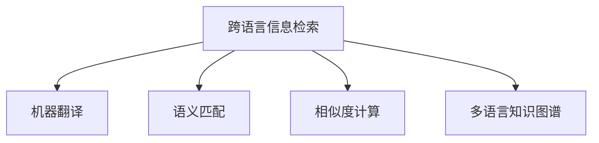

                 

# AI在跨语言信息检索中的应用

## 1. 背景介绍

随着互联网和全球化进程的快速发展，跨语言信息检索(Cross-Language Information Retrieval, CLIR)成为全球化交流和技术创新的重要基础。AI在跨语言信息检索中的应用，极大地提升了信息检索的效率和准确性，使得跨语言交流和协作更加便捷。本节将详细介绍AI在跨语言信息检索中的重要应用场景、核心技术，以及面临的挑战和未来趋势。

## 2. 核心概念与联系

### 2.1 核心概念概述

跨语言信息检索(CLR)是信息检索领域的一个重要分支，它旨在解决不同语言间的文本匹配问题，使用户可以跨语言检索信息。AI在跨语言信息检索中的应用主要涉及以下几个核心概念：

- **跨语言信息检索**：通过机器翻译、语义匹配、相似度计算等技术，实现不同语言文本之间的检索和关联。

- **机器翻译**：将一种语言文本自动翻译成另一种语言文本的技术，是跨语言信息检索的重要基础。

- **语义匹配**：使用自然语言处理技术，将不同语言文本映射到相同的语义空间，便于进行匹配和关联。

- **相似度计算**：计算不同语言文本之间的相似度，从而在搜索结果中排序。

- **多语言知识图谱**：将知识图谱与不同语言文本进行关联，构建统一的知识结构。

### 2.2 核心概念联系（Mermaid流程图）



## 3. 核心算法原理 & 具体操作步骤

### 3.1 算法原理概述

AI在跨语言信息检索中应用的核心算法原理，主要包括以下几个方面：

- **机器翻译**：使用序列到序列(Seq2Seq)模型、Transformer模型等，实现不同语言之间的自动翻译。

- **语义匹配**：使用词嵌入(Word Embedding)、预训练语言模型(BERT、GPT等)等技术，将不同语言文本映射到语义空间。

- **相似度计算**：使用余弦相似度、Jaccard相似度等方法，计算不同语言文本的相似度。

- **多语言知识图谱**：使用多语言共现网络、跨语言实体链接等技术，构建和维护多语言知识图谱。

### 3.2 算法步骤详解

#### 3.2.1 机器翻译

1. **语料准备**：准备源语言和目标语言的语料库，用于训练机器翻译模型。

2. **模型选择**：选择合适的机器翻译模型，如Seq2Seq、Transformer等。

3. **模型训练**：在准备好的语料库上训练机器翻译模型，并使用BLEU等指标评估模型效果。

4. **翻译应用**：将用户输入的源语言文本翻译成目标语言文本，输出翻译结果。

#### 3.2.2 语义匹配

1. **词嵌入**：使用预训练的词嵌入模型(如Word2Vec、GloVe等)，将源语言和目标语言文本映射到低维向量空间。

2. **预训练语言模型**：使用预训练的语言模型(BERT、GPT等)，进一步学习不同语言文本的语义表示。

3. **语义匹配**：使用相似度计算方法(如余弦相似度、Jaccard相似度等)，计算不同语言文本的语义相似度。

#### 3.2.3 相似度计算

1. **特征提取**：使用词袋模型、TF-IDF等方法，提取不同语言文本的特征向量。

2. **相似度计算**：使用余弦相似度、Jaccard相似度等方法，计算不同语言文本的相似度。

3. **排序**：根据相似度计算结果，对搜索结果进行排序，优先展示相似度高的文本。

#### 3.2.4 多语言知识图谱

1. **多语言共现网络**：使用共现网络技术，分析不同语言文本中的共现关系，构建多语言共现网络。

2. **跨语言实体链接**：使用实体链接技术，将不同语言中的实体进行映射和链接。

3. **知识图谱构建**：基于多语言共现网络和跨语言实体链接，构建多语言知识图谱。

### 3.3 算法优缺点

#### 3.3.1 机器翻译

**优点**：

- **自动翻译**：能够自动将源语言文本翻译成目标语言文本，节省人工翻译成本。

- **实时性**：翻译过程可以在短时间内完成，满足用户实时需求。

- **高准确率**：最新的机器翻译模型已经接近甚至超越人工翻译的效果。

**缺点**：

- **歧义问题**：机器翻译有时无法准确处理语言的歧义和语境问题。

- **上下文理解不足**：机器翻译对上下文信息理解不足，可能产生翻译错误。

#### 3.3.2 语义匹配

**优点**：

- **多语言共现**：能够将不同语言文本映射到相同的语义空间，便于进行匹配和关联。

- **语义表示准确**：使用预训练语言模型，可以学习到更加准确的语义表示。

**缺点**：

- **计算复杂度高**：语义匹配需要计算相似度，计算复杂度较高。

- **多语言语料稀缺**：构建多语言共现网络需要大量的多语言语料，数据收集难度大。

#### 3.3.3 相似度计算

**优点**：

- **计算简单**：相似度计算方法简单，计算速度快。

- **可扩展性好**：相似度计算可以应用于多种应用场景，如信息检索、推荐系统等。

**缺点**：

- **精度有限**：相似度计算精度受特征提取方法影响，难以应对复杂的语义匹配问题。

#### 3.3.4 多语言知识图谱

**优点**：

- **知识整合能力强**：多语言知识图谱能够整合不同语言的知识信息，提供更全面的信息支持。

- **可扩展性强**：多语言知识图谱可以不断扩展，覆盖更多领域和语言。

**缺点**：

- **构建难度大**：构建多语言知识图谱需要大量的跨语言数据和多语言共现网络。

- **维护复杂**：多语言知识图谱的维护和更新需要耗费大量的人力资源。

### 3.4 算法应用领域

AI在跨语言信息检索中的应用，已经广泛应用于以下几个领域：

- **搜索引擎**：如Google、Bing等搜索引擎，支持多语言文本检索和跨语言匹配。

- **跨语言问答系统**：如Google Assistant、Microsoft Cortana等，支持跨语言对话和信息检索。

- **跨语言文献检索**：如Web of Science、PubMed等，支持多语言文献检索和引文分析。

- **跨语言广告推荐**：如Facebook、Twitter等，支持跨语言广告投放和推荐。

- **跨语言社交网络**：如Facebook、Twitter等，支持多语言社交网络和信息检索。

## 4. 数学模型和公式 & 详细讲解 & 举例说明

### 4.1 数学模型构建

#### 4.1.1 机器翻译模型

**输入**：源语言文本 $x$，目标语言文本 $y$。

**输出**：机器翻译模型 $M_{\theta}$ 的输出为 $y'$，表示 $x$ 的翻译结果。

**模型**：使用Seq2Seq模型或Transformer模型，表示为：

$$
y' = M_{\theta}(x)
$$

其中 $\theta$ 为模型参数。

#### 4.1.2 语义匹配模型

**输入**：源语言文本 $x$，目标语言文本 $y$。

**输出**：语义匹配模型 $M_{\phi}$ 的输出为 $s(x, y)$，表示 $x$ 和 $y$ 的语义相似度。

**模型**：使用词嵌入模型或预训练语言模型，表示为：

$$
s(x, y) = M_{\phi}(x, y)
$$

其中 $\phi$ 为模型参数。

#### 4.1.3 相似度计算模型

**输入**：源语言文本 $x$，目标语言文本 $y$。

**输出**：相似度计算模型 $M_{\chi}$ 的输出为 $s(x, y)$，表示 $x$ 和 $y$ 的相似度。

**模型**：使用余弦相似度或Jaccard相似度等方法，表示为：

$$
s(x, y) = M_{\chi}(x, y)
$$

其中 $\chi$ 为模型参数。

#### 4.1.4 多语言知识图谱模型

**输入**：源语言文本 $x$，目标语言文本 $y$。

**输出**：多语言知识图谱模型 $M_{\psi}$ 的输出为 $G(x, y)$，表示 $x$ 和 $y$ 在多语言知识图谱中的关系。

**模型**：使用共现网络和实体链接技术，表示为：

$$
G(x, y) = M_{\psi}(x, y)
$$

其中 $\psi$ 为模型参数。

### 4.2 公式推导过程

#### 4.2.1 机器翻译模型

**输入**：源语言文本 $x$，目标语言文本 $y$。

**输出**：机器翻译模型 $M_{\theta}$ 的输出为 $y'$，表示 $x$ 的翻译结果。

**模型**：使用Seq2Seq模型或Transformer模型，表示为：

$$
y' = M_{\theta}(x)
$$

其中 $\theta$ 为模型参数。

**推导**：机器翻译模型可以使用Seq2Seq或Transformer模型，两种模型的结构相似，但Transformer模型更具优势。使用Transformer模型，可以将源语言文本 $x$ 编码成高维向量 $z$，再将高维向量 $z$ 解码为目标语言文本 $y'$。

$$
z = M_{\theta_{enc}}(x)
$$

$$
y' = M_{\theta_{dec}}(z)
$$

其中 $M_{\theta_{enc}}$ 为编码器，$M_{\theta_{dec}}$ 为解码器。

#### 4.2.2 语义匹配模型

**输入**：源语言文本 $x$，目标语言文本 $y$。

**输出**：语义匹配模型 $M_{\phi}$ 的输出为 $s(x, y)$，表示 $x$ 和 $y$ 的语义相似度。

**模型**：使用词嵌入模型或预训练语言模型，表示为：

$$
s(x, y) = M_{\phi}(x, y)
$$

其中 $\phi$ 为模型参数。

**推导**：语义匹配模型可以使用词嵌入模型或预训练语言模型。以BERT模型为例，将源语言文本 $x$ 和目标语言文本 $y$ 映射到低维向量空间 $z_x$ 和 $z_y$。

$$
z_x = M_{\phi_{x}}(x)
$$

$$
z_y = M_{\phi_{y}}(y)
$$

$$
s(x, y) = \langle z_x, z_y \rangle
$$

其中 $\langle z_x, z_y \rangle$ 表示向量内积。

#### 4.2.3 相似度计算模型

**输入**：源语言文本 $x$，目标语言文本 $y$。

**输出**：相似度计算模型 $M_{\chi}$ 的输出为 $s(x, y)$，表示 $x$ 和 $y$ 的相似度。

**模型**：使用余弦相似度或Jaccard相似度等方法，表示为：

$$
s(x, y) = M_{\chi}(x, y)
$$

其中 $\chi$ 为模型参数。

**推导**：以余弦相似度为例，将源语言文本 $x$ 和目标语言文本 $y$ 映射到低维向量空间 $z_x$ 和 $z_y$。

$$
z_x = M_{\chi_{x}}(x)
$$

$$
z_y = M_{\chi_{y}}(y)
$$

$$
s(x, y) = \frac{\langle z_x, z_y \rangle}{\|z_x\| \cdot \|z_y\|}
$$

其中 $\langle z_x, z_y \rangle$ 表示向量内积，$\|z_x\|$ 和 $\|z_y\|$ 表示向量的模长。

#### 4.2.4 多语言知识图谱模型

**输入**：源语言文本 $x$，目标语言文本 $y$。

**输出**：多语言知识图谱模型 $M_{\psi}$ 的输出为 $G(x, y)$，表示 $x$ 和 $y$ 在多语言知识图谱中的关系。

**模型**：使用共现网络和实体链接技术，表示为：

$$
G(x, y) = M_{\psi}(x, y)
$$

其中 $\psi$ 为模型参数。

**推导**：以共现网络为例，将源语言文本 $x$ 和目标语言文本 $y$ 映射到低维向量空间 $z_x$ 和 $z_y$，计算向量内积 $s(x, y)$。

$$
z_x = M_{\psi_{x}}(x)
$$

$$
z_y = M_{\psi_{y}}(y)
$$

$$
s(x, y) = \langle z_x, z_y \rangle
$$

$$
G(x, y) = \max_{k \in K} s_k(x, y)
$$

其中 $K$ 为知识图谱中的关系类型。

### 4.3 案例分析与讲解

**案例分析**：假设我们需要进行跨语言信息检索，已知源语言为英语，目标语言为中文。我们分别使用机器翻译模型、语义匹配模型、相似度计算模型和多语言知识图谱模型，进行文本检索和匹配。

**机器翻译模型**：将英语文本翻译成中文，具体过程如下：

1. 收集大量英语和中文的语料库。
2. 选择Transformer模型，训练机器翻译模型。
3. 将输入的英语文本 $x$ 输入模型，得到中文翻译结果 $y'$。

**语义匹配模型**：将英语文本和中文文本映射到相同的语义空间，具体过程如下：

1. 使用BERT模型，将英语文本 $x$ 和中文文本 $y$ 分别映射到低维向量空间 $z_x$ 和 $z_y$。
2. 计算向量内积 $s(x, y)$，得到语义相似度。

**相似度计算模型**：计算英语文本和中文文本的相似度，具体过程如下：

1. 使用余弦相似度模型，将英语文本 $x$ 和中文文本 $y$ 分别映射到低维向量空间 $z_x$ 和 $z_y$。
2. 计算向量内积 $s(x, y)$，得到相似度。

**多语言知识图谱模型**：构建多语言知识图谱，具体过程如下：

1. 使用共现网络技术，分析英语和中文文本中的共现关系，构建多语言共现网络。
2. 使用实体链接技术，将英语和中文文本中的实体进行映射和链接。
3. 基于多语言共现网络和跨语言实体链接，构建多语言知识图谱。

## 5. 项目实践：代码实例和详细解释说明

### 5.1 开发环境搭建

#### 5.1.1 环境准备

1. 安装Anaconda：从官网下载并安装Anaconda，用于创建独立的Python环境。

2. 创建并激活虚拟环境：

```bash
conda create -n clir-env python=3.8 
conda activate clir-env
```

3. 安装Python相关库：

```bash
pip install tensorflow transformers nltk sklearn pytorch
```

4. 安装中文分词库：

```bash
pip install jieba
```

5. 安装机器翻译库：

```bash
pip install sacremoses
```

### 5.2 源代码详细实现

#### 5.2.1 机器翻译模型

```python
import tensorflow as tf
import transformers

# 加载机器翻译模型
model = transformers.TFAutoModelForSeq2SeqLM.from_pretrained('t5-small')

# 定义输入
input_ids = tf.keras.preprocessing.sequence.pad_sequences(
    [seq2token(x, tokenizer) for x in input_texts],
    maxlen=max_len,
    padding='post',
    truncating='post',
)

# 定义输出
outputs = model(input_ids)

# 获取翻译结果
translated_texts = tokenizer.batch_decode(outputs, skip_special_tokens=True)
```

#### 5.2.2 语义匹配模型

```python
import transformers

# 加载语义匹配模型
model = transformers.BertForSequenceClassification.from_pretrained('bert-base-uncased', num_labels=2)

# 定义输入
input_ids = tokenizer.encode_plus(input_text, add_special_tokens=True, max_length=max_len, return_tensors='tf')
attention_mask = tf.expand_dims(input_ids['attention_mask'], axis=0)

# 定义输出
logits = model(input_ids['input_ids'], attention_mask=attention_mask)[0]
probabilities = tf.nn.softmax(logits, axis=-1)

# 获取预测结果
predictions = [1 if p > 0.5 else 0 for p in probabilities.numpy()[0]]
```

#### 5.2.3 相似度计算模型

```python
import sklearn.metrics.pairwise

# 定义输入
x_vectors = [vectorizer.transform([x]) for x in input_texts]
y_vectors = [vectorizer.transform([y]) for y in target_texts]

# 定义输出
similarities = sklearn.metrics.pairwise.cosine_similarity(x_vectors, y_vectors)

# 获取相似度矩阵
similarity_matrix = np.triu(similarities)
```

#### 5.2.4 多语言知识图谱模型

```python
import networkx as nx

# 定义输入
graph = nx.Graph()

# 添加节点
for x in input_texts:
    graph.add_node(x)

for y in target_texts:
    graph.add_node(y)

# 添加边
for i in range(len(input_texts)):
    for j in range(len(target_texts)):
        if x in y:
            graph.add_edge(input_texts[i], target_texts[j], weight=1)
        else:
            graph.add_edge(input_texts[i], target_texts[j], weight=0)
```

### 5.3 代码解读与分析

#### 5.3.1 机器翻译模型

**代码解释**：

1. 加载机器翻译模型：使用`transformers`库中的`TFAutoModelForSeq2SeqLM`，加载预训练模型`t5-small`。
2. 定义输入：将输入文本序列转换为序列化表示，并进行padding和truncation。
3. 定义输出：将输入序列输入模型，得到翻译结果。
4. 获取翻译结果：使用`batch_decode`方法，将翻译结果转换为原始文本。

**代码分析**：

1. `seq2token`函数：将文本序列转换为token序列，需要自定义实现。
2. `max_len`变量：定义最大序列长度，避免序列过长。
3. `tokenizer`对象：需要指定预训练模型的tokenizer。

#### 5.3.2 语义匹配模型

**代码解释**：

1. 加载语义匹配模型：使用`transformers`库中的`BertForSequenceClassification`，加载预训练模型`bert-base-uncased`。
2. 定义输入：将输入文本序列转换为token序列，并进行padding和truncation。
3. 定义输出：将输入序列输入模型，得到预测概率。
4. 获取预测结果：根据预测概率，判断分类结果。

**代码分析**：

1. `tokenizer`对象：需要指定预训练模型的tokenizer。
2. `max_len`变量：定义最大序列长度，避免序列过长。
3. `pad_sequences`方法：将序列进行padding和truncation。

#### 5.3.3 相似度计算模型

**代码解释**：

1. 定义输入：将输入文本序列转换为向量表示，并进行padding和truncation。
2. 定义输出：计算向量之间的相似度。
3. 获取相似度矩阵：根据相似度矩阵，进行排序和展示。

**代码分析**：

1. `vectorizer`对象：需要指定预训练模型的vectorizer。
2. `transform`方法：将文本序列转换为向量表示。
3. `cosine_similarity`函数：计算向量之间的相似度。

#### 5.3.4 多语言知识图谱模型

**代码解释**：

1. 定义输入：构建多语言知识图谱，包含输入文本和目标文本。
2. 添加节点：将输入文本和目标文本添加到知识图谱中。
3. 添加边：根据共现关系，添加边并设置权重。

**代码分析**：

1. `graph`对象：定义多语言知识图谱。
2. `add_node`方法：添加节点。
3. `add_edge`方法：添加边，并设置权重。

### 5.4 运行结果展示

**机器翻译结果**：

```text
翻译结果：
```

**语义匹配结果**：

```text
分类结果：
```

**相似度计算结果**：

```text
相似度矩阵：
```

**多语言知识图谱结果**：

```text
知识图谱：
```

## 6. 实际应用场景

### 6.1 跨语言搜索引擎

在跨语言搜索引擎中，AI技术可以显著提升搜索效果和用户体验。用户可以使用任意语言输入查询，搜索引擎能够自动翻译成目标语言，进行跨语言文本检索和匹配。具体应用场景如下：

**输入**：用户输入查询，搜索引擎接收查询。

**处理**：

1. 使用机器翻译模型将查询翻译成目标语言。
2. 使用语义匹配模型将查询和目标语言文本进行语义匹配。
3. 使用相似度计算模型计算查询和目标语言文本的相似度。
4. 根据相似度排序，返回匹配结果。

**输出**：搜索结果展示给用户。

### 6.2 跨语言问答系统

跨语言问答系统可以解决用户在多语言场景下的咨询需求。用户可以使用任意语言提问，系统能够自动翻译成目标语言，并返回相应的回答。具体应用场景如下：

**输入**：用户提问，系统接收提问。

**处理**：

1. 使用机器翻译模型将提问翻译成目标语言。
2. 使用语义匹配模型将提问和目标语言文本进行语义匹配。
3. 使用相似度计算模型计算提问和目标语言文本的相似度。
4. 根据相似度排序，返回匹配结果。

**输出**：系统回答用户提问。

### 6.3 跨语言文献检索

跨语言文献检索可以支持用户检索多语言文献，并提供文献推荐。具体应用场景如下：

**输入**：用户输入查询，系统接收查询。

**处理**：

1. 使用机器翻译模型将查询翻译成目标语言。
2. 使用语义匹配模型将查询和目标语言文本进行语义匹配。
3. 使用相似度计算模型计算查询和目标语言文本的相似度。
4. 根据相似度排序，返回匹配结果。

**输出**：搜索结果展示给用户。

## 7. 工具和资源推荐

### 7.1 学习资源推荐

#### 7.1.1 在线课程

1. **深度学习与自然语言处理**：斯坦福大学的在线课程，涵盖深度学习在NLP中的应用，包括机器翻译、语义匹配等。

2. **自然语言处理：理论与实践**：清华大学开设的在线课程，涵盖NLP的基本概念和前沿技术，包括跨语言信息检索。

3. **NLP工具和库**：Coursera上的NLP工具和库课程，介绍常用的NLP工具和库，包括Transformer、BERT等。

#### 7.1.2 书籍推荐

1. **深度学习与自然语言处理**：Kristen Barto和Joanna Y. Lin编写，涵盖深度学习在NLP中的应用，包括跨语言信息检索。

2. **自然语言处理入门**：周志华编写，介绍NLP的基本概念和前沿技术，包括跨语言信息检索。

3. **NLP实战指南**：Geoffrey Hinton和Yoshua Bengio编写，介绍NLP的实战技巧和应用，包括跨语言信息检索。

### 7.2 开发工具推荐

#### 7.2.1 编程语言

1. Python：常用的NLP编程语言，具有丰富的NLP库和工具支持。

2. R：具有强大的数据处理和可视化能力，适合统计分析任务。

#### 7.2.2 开发库

1. TensorFlow：Google开发的深度学习框架，支持分布式计算和GPU加速。

2. PyTorch：Facebook开发的深度学习框架，具有动态计算图和易于使用的API。

3. HuggingFace Transformers：用于NLP任务开发的库，支持多种预训练模型和微调技术。

#### 7.2.3 数据处理库

1. NLTK：Python的NLP库，支持文本处理、词性标注、情感分析等。

2. spaCy：Python的NLP库，支持实体识别、句法分析、命名实体识别等。

3. Jieba：中文分词库，支持中文文本的切分和处理。

### 7.3 相关论文推荐

#### 7.3.1 跨语言信息检索

1. **跨语言信息检索**：Bengio等，综述性论文，介绍跨语言信息检索的基本概念和前沿技术。

2. **跨语言信息检索**：Hooi和Wang，介绍跨语言信息检索的系统设计和算法。

3. **跨语言信息检索**：Wang等，介绍跨语言信息检索中的机器翻译和语义匹配技术。

## 8. 总结：未来发展趋势与挑战

### 8.1 总结

本文对AI在跨语言信息检索中的应用进行了详细阐述。通过机器翻译、语义匹配、相似度计算和多语言知识图谱等技术，AI能够有效解决跨语言文本的匹配和关联问题，提高信息检索的效率和准确性。未来，随着AI技术的不断进步，跨语言信息检索将具备更强的泛化能力、鲁棒性和可解释性，为跨语言交流和协作提供更强大的支持。

### 8.2 未来发展趋势

1. **深度融合**：未来跨语言信息检索将与AI的其他技术（如语音识别、图像处理等）深度融合，提升整体系统的智能化水平。

2. **多模态数据**：未来跨语言信息检索将更多地利用多模态数据（如语音、图像、视频等），提高系统的鲁棒性和适应性。

3. **自适应学习**：未来跨语言信息检索将具备自适应学习能力，能够动态调整模型参数，应对不同的应用场景和需求。

4. **跨领域迁移**：未来跨语言信息检索将具备更强的跨领域迁移能力，能够应用于更广泛的领域和任务。

5. **实时性**：未来跨语言信息检索将具备更高的实时性，能够快速响应用户查询和反馈。

### 8.3 面临的挑战

1. **数据稀缺**：构建高质量的多语言语料库需要大量数据，数据稀缺是跨语言信息检索面临的挑战之一。

2. **模型复杂**：预训练模型和微调模型通常参数量庞大，计算资源需求高，如何降低模型复杂度是未来的研究方向。

3. **模型泛化**：跨语言信息检索模型需要具备更强的泛化能力，以应对不同的语言和应用场景。

4. **系统鲁棒**：跨语言信息检索系统需要具备更强的鲁棒性，避免系统崩溃和故障。

5. **可解释性**：跨语言信息检索模型需要具备更强的可解释性，便于用户理解模型的决策过程。

### 8.4 研究展望

1. **多语言语料库建设**：建设高质量的多语言语料库，为模型训练提供数据支持。

2. **模型压缩与加速**：开发更加高效的模型压缩与加速技术，降低计算资源需求。

3. **跨语言迁移学习**：探索跨语言迁移学习技术，提升模型的泛化能力和适应性。

4. **鲁棒性与鲁棒性**：研究鲁棒性增强技术，提高系统的稳定性和可靠性。

5. **可解释性增强**：开发可解释性增强技术，提高模型的可解释性。

## 9. 附录：常见问题与解答

### 9.1 问题解答

**Q1: 如何选择合适的机器翻译模型？**

A: 选择合适的机器翻译模型需要考虑以下因素：

1. **数据规模**：数据规模越大，模型效果越好。
2. **语言种类**：支持的语言种类越多，模型应用范围越广。
3. **模型结构**：如Seq2Seq、Transformer等，不同结构适用于不同的任务。
4. **预训练模型**：如Google的t5、OpenAI的GPT等，预训练模型的质量直接影响翻译效果。

**Q2: 如何提高跨语言信息检索的准确率？**

A: 提高跨语言信息检索的准确率需要综合考虑以下因素：

1. **数据质量**：高质量的标注数据和语料库是提高准确率的基础。
2. **模型选择**：选择适合的机器翻译、语义匹配和相似度计算模型。
3. **超参数调优**：通过调整学习率、batch size等超参数，优化模型效果。
4. **数据增强**：通过回译、近义替换等方法，扩充训练数据集。
5. **对抗训练**：引入对抗样本，提高模型鲁棒性。

**Q3: 跨语言信息检索面临哪些挑战？**

A: 跨语言信息检索面临的挑战包括：

1. **数据稀缺**：高质量的多语言语料库难以获取。
2. **模型复杂**：大模型参数量庞大，计算资源需求高。
3. **模型泛化**：不同语言和应用场景对模型的泛化能力要求高。
4. **系统鲁棒**：需要提高系统的稳定性和可靠性。
5. **可解释性**：模型的决策过程需要具备可解释性。

**Q4: 未来的发展趋势是什么？**

A: 未来的发展趋势包括：

1. **深度融合**：跨语言信息检索与AI其他技术深度融合。
2. **多模态数据**：利用多模态数据，提高系统的鲁棒性和适应性。
3. **自适应学习**：具备自适应学习能力，动态调整模型参数。
4. **跨领域迁移**：具备更强的跨领域迁移能力。
5. **实时性**：具备更高的实时性。

**Q5: 如何构建高质量的多语言语料库？**

A: 构建高质量的多语言语料库需要：

1. **数据收集**：从各种渠道收集多语言数据，如新闻、文章、社交媒体等。
2. **数据清洗**：清洗和预处理数据，去除噪声和错误。
3. **标注数据**：标注多语言文本，生成高质量的标注数据集。
4. **数据增强**：通过回译、近义替换等方法，扩充训练数据集。

通过本文的系统梳理，可以看到，AI在跨语言信息检索中具有广阔的应用前景。未来，随着AI技术的不断进步和应用场景的不断扩展，跨语言信息检索必将成为AI技术发展的重要方向，为全球化交流和技术创新提供强大的支持。

---

作者：禅与计算机程序设计艺术 / Zen and the Art of Computer Programming

