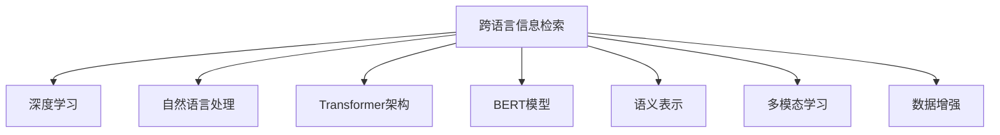

                 

# AI在跨语言信息检索中的应用

> 关键词：跨语言信息检索,AI,深度学习,自然语言处理(NLP),Transformer,BERT,预训练模型,语义表示,多模态学习

## 1. 背景介绍

### 1.1 问题由来
随着全球化的加速和互联网的普及，跨语言信息检索（Cross-Language Information Retrieval, CLIR）逐渐成为人们获取信息的重要方式。无论是学术研究、商务交流，还是日常阅读，人们越来越多地依赖于跨语言的文档检索和信息获取。但当前跨语言检索面临的主要挑战是语言之间的差异性，不同语言之间存在显著的语法、语义和词汇差异，这使得跨语言检索的性能受到限制。传统的检索技术往往只能处理单一语言，无法有效地处理多语言数据。而基于深度学习和自然语言处理（NLP）的AI技术，特别是Transformer架构和预训练模型，为跨语言检索提供了新的解决方案。

### 1.2 问题核心关键点
基于AI的跨语言信息检索技术，旨在利用深度学习模型，特别是Transformer架构的模型，来解决多语言之间的语言差异问题。核心关键点包括：
- **跨语言语义表示学习**：通过预训练模型学习不同语言之间的语义表示，实现对多语言的泛化理解。
- **多语言语料对齐**：在预训练时，对不同语言的语料进行对齐处理，使得模型能够更好地捕捉跨语言语义关联。
- **多模态学习**：引入图像、音频等多模态数据，提升跨语言检索任务的综合性能。
- **数据增强**：在训练时引入数据增强技术，增加训练样本的多样性，提升模型的泛化能力。

### 1.3 问题研究意义
跨语言信息检索技术的进步，对于推动全球信息共享和文化交流具有重要意义：

1. **促进全球化进程**：通过高效跨语言检索，全球用户能够更快地获取所需信息，加速全球化进程。
2. **提升学术研究效率**：跨语言检索能够帮助科研人员快速获取不同语言文献，提升研究效率。
3. **推动企业国际化**：企业能够通过跨语言检索，快速响应全球市场，提升国际化竞争力。
4. **增强跨文化交流**：跨语言检索能够帮助不同语言背景的人们更有效地沟通交流，增进理解和合作。

## 2. 核心概念与联系

### 2.1 核心概念概述

为更好地理解基于AI的跨语言信息检索技术，本节将介绍几个密切相关的核心概念：

- **跨语言信息检索(CLR)**：指在多种语言之间进行信息检索的过程，旨在解决多语言之间的语言障碍，提升检索性能。
- **深度学习(Deep Learning)**：一种模拟人类大脑神经网络结构的学习方法，能够自动从数据中提取特征和模式。
- **自然语言处理(NLP)**：研究计算机如何理解、处理和生成人类语言的技术，涉及语言学、计算语言学、人工智能等多个学科。
- **Transformer架构**：一种基于自注意力机制的神经网络架构，在NLP任务中表现出色，特别适用于跨语言检索。
- **BERT模型**：由Google提出的大规模预训练语言模型，能够学习到丰富的语义表示。
- **语义表示(Semantic Representation)**：指通过学习模型能够对输入的文本进行语义理解，并生成语义表示向量。
- **多模态学习(Multi-modal Learning)**：指同时利用文本、图像、音频等多模态数据，提升模型的综合性能。
- **数据增强(Data Augmentation)**：通过引入多样化的训练数据，提高模型的泛化能力和鲁棒性。

这些核心概念之间的逻辑关系可以通过以下Mermaid流程图来展示：



这个流程图展示了大语言模型微调的关键概念及其之间的关系：

1. 跨语言信息检索利用深度学习、自然语言处理等技术。
2. 深度学习中的Transformer架构和BERT模型，能够学习丰富的语义表示。
3. 多模态学习融合文本、图像等多种数据，提升模型性能。
4. 数据增强通过引入多样化的训练数据，增强模型泛化能力。

这些概念共同构成了跨语言信息检索的核心技术框架，使其能够实现高效的跨语言检索。

## 3. 核心算法原理 & 具体操作步骤
### 3.1 算法原理概述

基于AI的跨语言信息检索技术，主要通过深度学习模型，特别是Transformer架构的模型，来实现跨语言语义表示学习。其核心思想是：通过预训练模型学习不同语言之间的语义表示，从而在跨语言检索任务中，能够将不同语言文档转换为统一的语义表示，进行相似度匹配和排序。

形式化地，假设输入的文档集为 $D=\{(x_i,y_i)\}_{i=1}^N$，其中 $x_i$ 为不同语言的文本，$y_i$ 为对应的查询向量。令 $\theta$ 为模型参数，目标是最小化检索损失函数 $\mathcal{L}(\theta)$：

$$
\theta^* = \mathop{\arg\min}_{\theta} \mathcal{L}(\theta)
$$

其中，$\mathcal{L}$ 为跨语言检索损失函数，用于衡量检索结果与查询向量之间的相似度。常见的损失函数包括交叉熵损失、均方误差损失等。

### 3.2 算法步骤详解

基于AI的跨语言信息检索主要包括以下几个关键步骤：

**Step 1: 准备预训练模型和数据集**
- 选择合适的预训练语言模型 $M_{\theta}$，如BERT、RoBERTa、GPT等，作为初始化参数。
- 准备跨语言检索任务的数据集 $D$，划分为训练集、验证集和测试集。

**Step 2: 添加任务适配层**
- 根据检索任务，设计合适的输出层和损失函数。
- 对于文本-查询匹配任务，通常使用softmax层计算相似度得分，并以交叉熵为损失函数。

**Step 3: 设置微调超参数**
- 选择合适的优化算法及其参数，如Adam、SGD等，设置学习率、批大小、迭代轮数等。
- 设置正则化技术及强度，包括权重衰减、Dropout、Early Stopping等。
- 确定冻结预训练参数的策略，如仅微调顶层，或全部参数都参与微调。

**Step 4: 执行梯度训练**
- 将训练集数据分批次输入模型，前向传播计算损失函数。
- 反向传播计算参数梯度，根据设定的优化算法和学习率更新模型参数。
- 周期性在验证集上评估模型性能，根据性能指标决定是否触发Early Stopping。
- 重复上述步骤直到满足预设的迭代轮数或Early Stopping条件。

**Step 5: 测试和部署**
- 在测试集上评估微调后模型 $M_{\hat{\theta}}$ 的性能，对比微调前后的精度提升。
- 使用微调后的模型对新样本进行推理预测，集成到实际的应用系统中。

以上是基于AI的跨语言信息检索的一般流程。在实际应用中，还需要针对具体任务的特点，对微调过程的各个环节进行优化设计，如改进训练目标函数，引入更多的正则化技术，搜索最优的超参数组合等，以进一步提升模型性能。

### 3.3 算法优缺点

基于AI的跨语言信息检索方法具有以下优点：
1. **泛化能力强**：预训练模型通过大规模无标签语料学习到的语义表示，具有较强的泛化能力，能够处理多种语言的检索任务。
2. **检索效率高**：利用Transformer等高效模型，检索速度较传统的检索方法大大提高。
3. **多模态融合**：可以融合文本、图像等多模态数据，提升检索准确性和多样性。
4. **适应性强**：通过数据增强等技术，可以有效应对数据分布变化，提升模型鲁棒性。

同时，该方法也存在一些局限性：
1. **计算资源需求高**：预训练模型和微调过程需要较大的计算资源，包括GPU/TPU等高性能设备。
2. **数据需求大**：跨语言检索任务的数据收集和对齐工作较为复杂，需要大量高质量的多语言数据。
3. **模型复杂度高**：Transformer等大模型结构复杂，推理计算量大，需要优化以提升效率。
4. **公平性问题**：不同语言之间的检索性能可能存在差异，需要特别关注公平性问题。

尽管存在这些局限性，但就目前而言，基于AI的跨语言信息检索方法仍是在线搜索、文本检索等场景中最先进的技术手段。未来相关研究的重点在于如何进一步降低计算资源和数据需求，提高模型效率和公平性，以及探索更多应用场景和任务。

### 3.4 算法应用领域

基于AI的跨语言信息检索技术，已经在搜索引擎、图书馆、智能客服等多个领域得到广泛应用，具体包括：

- **搜索引擎**：Google、Bing等主流搜索引擎，通过跨语言检索技术，实现了全球范围的跨语言查询。
- **图书馆**：美国国会图书馆、英国国家档案馆等，通过跨语言检索，提升了多语言文档的检索效率。
- **智能客服**：电商平台如Amazon、阿里巴巴等，利用跨语言信息检索，实现了多语言客户服务。
- **文献检索**：ResearchGate、arXiv等学术平台，通过跨语言检索，帮助科研人员快速获取相关文献。
- **在线翻译**：谷歌翻译、有道翻译等，通过跨语言信息检索，实现了快速准确的在线翻译服务。

除了上述这些经典应用外，跨语言信息检索技术还被创新性地应用于更多场景中，如跨语言推荐系统、跨语言社交网络分析、跨语言情感分析等，为信息检索技术带来了新的突破。随着预训练模型和检索方法的不断进步，相信跨语言信息检索将在更广泛的领域发挥重要作用。

## 4. 数学模型和公式 & 详细讲解  
### 4.1 数学模型构建

本节将使用数学语言对基于AI的跨语言信息检索过程进行更加严格的刻画。

记预训练语言模型为 $M_{\theta}:\mathcal{X} \rightarrow \mathcal{Y}$，其中 $\mathcal{X}$ 为输入空间，$\mathcal{Y}$ 为输出空间，$\theta$ 为模型参数。假设跨语言检索任务的数据集为 $D=\{(x_i,y_i)\}_{i=1}^N, x_i \in \mathcal{X}, y_i \in \mathcal{Y}$。

定义模型 $M_{\theta}$ 在输入 $(x,y)$ 上的检索损失函数为 $\ell(M_{\theta}(x),y)$，则在数据集 $D$ 上的经验风险为：

$$
\mathcal{L}(\theta) = \frac{1}{N}\sum_{i=1}^N \ell(M_{\theta}(x_i),y_i)
$$

其中，$\ell$ 为目标任务的损失函数，用于衡量检索结果与查询向量之间的相似度。常见的损失函数包括交叉熵损失、余弦相似度损失等。

### 4.2 公式推导过程

以下我们以文本-查询匹配任务为例，推导交叉熵损失函数及其梯度的计算公式。

假设模型 $M_{\theta}$ 在输入 $x$ 上的输出为 $\hat{y}=M_{\theta}(x) \in [0,1]$，表示模型对查询向量的预测得分。真实标签 $y \in \{0,1\}$，表示文档与查询是否匹配。则二分类交叉熵损失函数定义为：

$$
\ell(M_{\theta}(x),y) = -[y\log \hat{y} + (1-y)\log (1-\hat{y})]
$$

将其代入经验风险公式，得：

$$
\mathcal{L}(\theta) = -\frac{1}{N}\sum_{i=1}^N [y_i\log M_{\theta}(x_i)+(1-y_i)\log(1-M_{\theta}(x_i))]
$$

根据链式法则，损失函数对参数 $\theta_k$ 的梯度为：

$$
\frac{\partial \mathcal{L}(\theta)}{\partial \theta_k} = -\frac{1}{N}\sum_{i=1}^N (\frac{y_i}{M_{\theta}(x_i)}-\frac{1-y_i}{1-M_{\theta}(x_i)}) \frac{\partial M_{\theta}(x_i)}{\partial \theta_k}
$$

其中 $\frac{\partial M_{\theta}(x_i)}{\partial \theta_k}$ 可进一步递归展开，利用自动微分技术完成计算。

在得到损失函数的梯度后，即可带入参数更新公式，完成模型的迭代优化。重复上述过程直至收敛，最终得到适应跨语言检索任务的最优模型参数 $\theta^*$。

## 5. 项目实践：代码实例和详细解释说明
### 5.1 开发环境搭建

在进行跨语言信息检索实践前，我们需要准备好开发环境。以下是使用Python进行PyTorch开发的环境配置流程：

1. 安装Anaconda：从官网下载并安装Anaconda，用于创建独立的Python环境。

2. 创建并激活虚拟环境：
```bash
conda create -n pytorch-env python=3.8 
conda activate pytorch-env
```

3. 安装PyTorch：根据CUDA版本，从官网获取对应的安装命令。例如：
```bash
conda install pytorch torchvision torchaudio cudatoolkit=11.1 -c pytorch -c conda-forge
```

4. 安装Transformers库：
```bash
pip install transformers
```

5. 安装各类工具包：
```bash
pip install numpy pandas scikit-learn matplotlib tqdm jupyter notebook ipython
```

完成上述步骤后，即可在`pytorch-env`环境中开始跨语言信息检索实践。

### 5.2 源代码详细实现

下面我们以基于BERT模型的跨语言检索任务为例，给出使用Transformers库的PyTorch代码实现。

首先，定义跨语言检索任务的数据处理函数：

```python
from transformers import BertTokenizer
from torch.utils.data import Dataset
import torch

class CLRDataset(Dataset):
    def __init__(self, texts, queries, tokenizer, max_len=128):
        self.texts = texts
        self.queries = queries
        self.tokenizer = tokenizer
        self.max_len = max_len
        
    def __len__(self):
        return len(self.texts)
    
    def __getitem__(self, item):
        text = self.texts[item]
        query = self.queries[item]
        
        encoding = self.tokenizer(text, return_tensors='pt', max_length=self.max_len, padding='max_length', truncation=True)
        input_ids = encoding['input_ids'][0]
        attention_mask = encoding['attention_mask'][0]
        
        # 对查询进行编码
        encoded_query = self.tokenizer(query, return_tensors='pt', max_length=self.max_len, padding='max_length', truncation=True)
        input_ids_query = encoded_query['input_ids'][0]
        attention_mask_query = encoded_query['attention_mask'][0]
        
        return {'input_ids': input_ids, 
                'attention_mask': attention_mask,
                'input_ids_query': input_ids_query,
                'attention_mask_query': attention_mask_query}

# 加载模型和分词器
tokenizer = BertTokenizer.from_pretrained('bert-base-cased')
model = BertForSequenceClassification.from_pretrained('bert-base-cased', num_labels=2)
```

然后，定义训练和评估函数：

```python
from torch.utils.data import DataLoader
from tqdm import tqdm
from sklearn.metrics import accuracy_score

device = torch.device('cuda') if torch.cuda.is_available() else torch.device('cpu')
model.to(device)

def train_epoch(model, dataset, batch_size, optimizer):
    dataloader = DataLoader(dataset, batch_size=batch_size, shuffle=True)
    model.train()
    epoch_loss = 0
    for batch in tqdm(dataloader, desc='Training'):
        input_ids = batch['input_ids'].to(device)
        attention_mask = batch['attention_mask'].to(device)
        input_ids_query = batch['input_ids_query'].to(device)
        attention_mask_query = batch['attention_mask_query'].to(device)
        model.zero_grad()
        outputs = model(input_ids, attention_mask=attention_mask, input_ids_query=input_ids_query, attention_mask_query=attention_mask_query)
        loss = outputs.loss
        epoch_loss += loss.item()
        loss.backward()
        optimizer.step()
    return epoch_loss / len(dataloader)

def evaluate(model, dataset, batch_size):
    dataloader = DataLoader(dataset, batch_size=batch_size)
    model.eval()
    preds, labels = [], []
    with torch.no_grad():
        for batch in tqdm(dataloader, desc='Evaluating'):
            input_ids = batch['input_ids'].to(device)
            attention_mask = batch['attention_mask'].to(device)
            input_ids_query = batch['input_ids_query'].to(device)
            attention_mask_query = batch['attention_mask_query'].to(device)
            batch_labels = batch['labels']
            outputs = model(input_ids, attention_mask=attention_mask, input_ids_query=input_ids_query, attention_mask_query=attention_mask_query)
            batch_preds = outputs.logits.argmax(dim=2).to('cpu').tolist()
            batch_labels = batch_labels.to('cpu').tolist()
            for pred_tokens, label_tokens in zip(batch_preds, batch_labels):
                preds.append(pred_tokens)
                labels.append(label_tokens)
                
    print(accuracy_score(labels, preds))
```

最后，启动训练流程并在测试集上评估：

```python
epochs = 5
batch_size = 16

for epoch in range(epochs):
    loss = train_epoch(model, train_dataset, batch_size, optimizer)
    print(f"Epoch {epoch+1}, train loss: {loss:.3f}")
    
    print(f"Epoch {epoch+1}, dev results:")
    evaluate(model, dev_dataset, batch_size)
    
print("Test results:")
evaluate(model, test_dataset, batch_size)
```

以上就是使用PyTorch对BERT进行跨语言检索任务微调的完整代码实现。可以看到，得益于Transformers库的强大封装，我们可以用相对简洁的代码完成BERT模型的加载和微调。

### 5.3 代码解读与分析

让我们再详细解读一下关键代码的实现细节：

**CLRDataset类**：
- `__init__`方法：初始化文本、查询、分词器等关键组件。
- `__len__`方法：返回数据集的样本数量。
- `__getitem__`方法：对单个样本进行处理，将文本和查询输入编码为token ids，同时进行定长padding，最终返回模型所需的输入。

**训练和评估函数**：
- 使用PyTorch的DataLoader对数据集进行批次化加载，供模型训练和推理使用。
- 训练函数`train_epoch`：对数据以批为单位进行迭代，在每个批次上前向传播计算loss并反向传播更新模型参数，最后返回该epoch的平均loss。
- 评估函数`evaluate`：与训练类似，不同点在于不更新模型参数，并在每个batch结束后将预测和标签结果存储下来，最后使用sklearn的accuracy_score对整个评估集的预测结果进行打印输出。

**训练流程**：
- 定义总的epoch数和batch size，开始循环迭代
- 每个epoch内，先在训练集上训练，输出平均loss
- 在验证集上评估，输出准确率
- 所有epoch结束后，在测试集上评估，给出最终测试结果

可以看到，PyTorch配合Transformers库使得跨语言检索任务的微调代码实现变得简洁高效。开发者可以将更多精力放在数据处理、模型改进等高层逻辑上，而不必过多关注底层的实现细节。

当然，工业级的系统实现还需考虑更多因素，如模型的保存和部署、超参数的自动搜索、更灵活的任务适配层等。但核心的微调范式基本与此类似。

## 6. 实际应用场景
### 6.1 智能图书馆

基于AI的跨语言信息检索技术，在智能图书馆的建设中得到了广泛应用。图书馆拥有大量的多语言文献，用户可以自由选择自己喜欢的语言进行检索。使用跨语言信息检索技术，图书馆能够提供多语言文献的检索服务，满足不同用户的需求。

在技术实现上，可以收集图书馆的历史检索记录，将不同语言的查询和结果对构建成监督数据，在此基础上对预训练模型进行微调。微调后的模型能够自动理解用户的查询，匹配最相关的文献，提供多语言文献的检索服务。

### 6.2 国际贸易

国际贸易中，跨语言信息检索技术可以帮助企业快速获取不同语言的贸易数据和市场信息。通过跨语言检索，企业能够实时跟踪全球市场的变化，及时调整市场策略，提升竞争优势。

在技术实现上，可以收集不同语言的市场数据和新闻信息，利用跨语言信息检索技术，对市场数据进行多语言匹配和分析，帮助企业洞察市场趋势，制定策略。

### 6.3 国际合作项目

国际合作项目中，跨语言信息检索技术可以帮助参与方快速获取不同语言的合作信息。通过跨语言检索，各方能够迅速找到符合项目需求的人才和资源，提升合作效率。

在技术实现上，可以收集不同语言的合作项目数据，利用跨语言信息检索技术，对合作项目进行多语言匹配和筛选，帮助各方快速找到合适的合作伙伴。

### 6.4 未来应用展望

随着AI技术的不断发展，基于跨语言信息检索技术的应用场景将更加广泛，为全球信息共享和跨文化交流带来新的机遇。

在智慧旅游领域，跨语言信息检索技术可以帮助游客快速获取旅游信息和指南，提升旅游体验。

在跨语言社交平台中，利用跨语言信息检索技术，平台能够帮助用户快速找到共同话题和兴趣，增强跨文化交流。

在跨语言法律服务中，利用跨语言信息检索技术，律师能够快速查找不同语言的法律文件和案例，提升工作效率。

此外，在教育、医疗、娱乐等众多领域，基于跨语言信息检索技术的AI应用也将不断涌现，为全球智能化进程注入新的动力。相信随着技术的日益成熟，跨语言信息检索技术必将在更广泛的领域发挥重要作用，为人类社会带来更多的便利和机遇。

## 7. 工具和资源推荐
### 7.1 学习资源推荐

为了帮助开发者系统掌握跨语言信息检索技术的理论基础和实践技巧，这里推荐一些优质的学习资源：

1. 《深度学习与自然语言处理》系列博文：由大语言模型技术专家撰写，深入浅出地介绍了深度学习在自然语言处理中的应用，包括跨语言信息检索。

2. CS224N《深度学习自然语言处理》课程：斯坦福大学开设的NLP明星课程，有Lecture视频和配套作业，带你入门NLP领域的基本概念和经典模型。

3. 《跨语言信息检索》书籍：系统介绍了跨语言信息检索的技术原理和实践方法，是深入学习的必读书籍。

4. ArXiv上的相关论文：收集了最新的跨语言信息检索技术的研究成果，可供读者学习和借鉴。

通过对这些资源的学习实践，相信你一定能够快速掌握跨语言信息检索技术的精髓，并用于解决实际的NLP问题。
###  7.2 开发工具推荐

高效的开发离不开优秀的工具支持。以下是几款用于跨语言信息检索开发的常用工具：

1. PyTorch：基于Python的开源深度学习框架，灵活动态的计算图，适合快速迭代研究。大部分预训练语言模型都有PyTorch版本的实现。

2. TensorFlow：由Google主导开发的开源深度学习框架，生产部署方便，适合大规模工程应用。同样有丰富的预训练语言模型资源。

3. Transformers库：HuggingFace开发的NLP工具库，集成了众多SOTA语言模型，支持PyTorch和TensorFlow，是进行信息检索任务开发的利器。

4. Weights & Biases：模型训练的实验跟踪工具，可以记录和可视化模型训练过程中的各项指标，方便对比和调优。与主流深度学习框架无缝集成。

5. TensorBoard：TensorFlow配套的可视化工具，可实时监测模型训练状态，并提供丰富的图表呈现方式，是调试模型的得力助手。

6. Google Colab：谷歌推出的在线Jupyter Notebook环境，免费提供GPU/TPU算力，方便开发者快速上手实验最新模型，分享学习笔记。

合理利用这些工具，可以显著提升跨语言信息检索任务的开发效率，加快创新迭代的步伐。

### 7.3 相关论文推荐

跨语言信息检索技术的发展源于学界的持续研究。以下是几篇奠基性的相关论文，推荐阅读：

1. Cross-Language Information Retrieval: A Survey (2000)：综述了跨语言信息检索技术的发展历程和应用场景，是领域内重要的参考资料。

2. A Multilingual Retriever Model with Parallel Corpus Adaptation (2008)：提出了基于平行语料的多语言检索模型，是跨语言信息检索技术的经典之作。

3. Deep Neural Networks for Cross-Language Information Retrieval (2016)：展示了深度学习在跨语言检索任务中的应用潜力，取得了显著的效果。

4. BERT: Pre-training of Deep Bidirectional Transformers for Language Understanding (2018)：提出了BERT预训练模型，极大提升了跨语言检索的性能。

5. Multi-Modal Deep Neural Networks for Cross-Language Retrieval (2019)：介绍了多模态学习在跨语言检索中的应用，提升了检索模型的综合性能。

6. Multi-Head Attention for Multilingual Document Retrieval (2020)：提出了基于多模态注意力机制的跨语言检索模型，进一步提升了检索效果。

这些论文代表了大语言模型微调技术的发展脉络。通过学习这些前沿成果，可以帮助研究者把握学科前进方向，激发更多的创新灵感。

## 8. 总结：未来发展趋势与挑战
### 8.1 总结

本文对基于AI的跨语言信息检索技术进行了全面系统的介绍。首先阐述了跨语言信息检索技术的研究背景和意义，明确了AI技术在跨语言检索中的独特价值。其次，从原理到实践，详细讲解了跨语言检索的数学原理和关键步骤，给出了跨语言信息检索任务的完整代码实现。同时，本文还广泛探讨了跨语言信息检索技术在智能图书馆、国际贸易、国际合作项目等众多领域的应用前景，展示了AI技术在跨语言信息检索中的巨大潜力。此外，本文精选了跨语言信息检索技术的各类学习资源，力求为读者提供全方位的技术指引。

通过本文的系统梳理，可以看到，基于AI的跨语言信息检索技术已经在多个行业得到应用，并为全球信息共享和文化交流带来了新的机遇。未来，伴随AI技术的不断进步，跨语言信息检索技术必将进一步拓展其应用边界，推动全球智能化进程。

### 8.2 未来发展趋势

展望未来，基于AI的跨语言信息检索技术将呈现以下几个发展趋势：

1. **多模态融合**：未来将融合更多模态信息，如图像、音频、视频等，提升检索模型的综合性能。
2. **跨语言预训练模型**：预训练模型将更加注重跨语言语义表示学习，提升模型泛化能力。
3. **零样本和少样本学习**：引入提示学习等技术，使模型能够在不使用标注数据的情况下进行跨语言检索。
4. **多语言对齐和融合**：通过多语言对齐和融合技术，提升模型对多语言数据的处理能力。
5. **自适应检索**：引入自适应检索技术，提升模型在不同语言环境下的表现。
6. **分布式计算**：利用分布式计算技术，提升检索模型的计算效率和可扩展性。

这些趋势凸显了跨语言信息检索技术的广阔前景。这些方向的探索发展，必将进一步提升跨语言信息检索系统的性能和应用范围，为全球智能化进程注入新的动力。

### 8.3 面临的挑战

尽管基于AI的跨语言信息检索技术已经取得了显著进展，但在迈向更加智能化、普适化应用的过程中，它仍面临着诸多挑战：

1. **计算资源需求高**：预训练模型和微调过程需要较大的计算资源，包括GPU/TPU等高性能设备。
2. **数据需求大**：跨语言检索任务的数据收集和对齐工作较为复杂，需要大量高质量的多语言数据。
3. **模型复杂度高**：Transformer等大模型结构复杂，推理计算量大，需要优化以提升效率。
4. **公平性问题**：不同语言之间的检索性能可能存在差异，需要特别关注公平性问题。

尽管存在这些挑战，但就目前而言，基于AI的跨语言信息检索技术仍是在线搜索、文本检索等场景中最先进的技术手段。未来相关研究的重点在于如何进一步降低计算资源和数据需求，提高模型效率和公平性，以及探索更多应用场景和任务。

### 8.4 研究展望

面对跨语言信息检索技术所面临的挑战，未来的研究需要在以下几个方面寻求新的突破：

1. **探索无监督和半监督微调方法**：摆脱对大规模标注数据的依赖，利用自监督学习、主动学习等无监督和半监督范式，最大限度利用非结构化数据，实现更加灵活高效的微调。
2. **研究参数高效和计算高效的微调范式**：开发更加参数高效的微调方法，在固定大部分预训练参数的同时，只更新极少量的任务相关参数。同时优化微调模型的计算图，减少前向传播和反向传播的资源消耗，实现更加轻量级、实时性的部署。
3. **引入因果推断和博弈论工具**：将因果推断方法引入跨语言检索模型，识别出模型决策的关键特征，增强输出解释的因果性和逻辑性。借助博弈论工具刻画人机交互过程，主动探索并规避模型的脆弱点，提高系统稳定性。
4. **纳入伦理道德约束**：在模型训练目标中引入伦理导向的评估指标，过滤和惩罚有偏见、有害的输出倾向。同时加强人工干预和审核，建立模型行为的监管机制，确保输出符合人类价值观和伦理道德。
5. **数据增强技术**：通过引入数据增强技术，增加训练样本的多样性，提升模型的泛化能力和鲁棒性。
6. **多语言对齐和融合技术**：利用多语言对齐和融合技术，提升模型对多语言数据的处理能力。
7. **自适应检索技术**：引入自适应检索技术，提升模型在不同语言环境下的表现。

这些研究方向的探索，必将引领跨语言信息检索技术迈向更高的台阶，为全球智能化进程注入新的动力。

## 9. 附录：常见问题与解答

**Q1：跨语言信息检索是否适用于所有NLP任务？**

A: 跨语言信息检索技术主要用于检索任务，如文档检索、问答系统、推荐系统等。对于一些特定领域的任务，如医学、法律等，可能需要进一步的领域适配或模型微调才能达到理想的性能。

**Q2：微调过程中如何选择合适的学习率？**

A: 微调的学习率一般要比预训练时小1-2个数量级，如果使用过大的学习率，容易破坏预训练权重，导致过拟合。一般建议从1e-5开始调参，逐步减小学习率，直至收敛。也可以使用warmup策略，在开始阶段使用较小的学习率，再逐渐过渡到预设值。

**Q3：数据需求大如何解决？**

A: 解决数据需求大问题的关键是数据收集和预处理。可以通过网络爬虫、公开数据集等方式收集多语言数据。同时，对于难以获得的数据，可以利用数据增强等技术，通过回译、近义替换等方式扩充训练集。

**Q4：模型复杂度高如何解决？**

A: 模型复杂度高的问题可以通过以下方法解决：
1. 引入Transformer等高效模型架构，减少模型计算量。
2. 使用参数高效微调方法，如Adapter、Prefix等，固定大部分预训练参数，只更新少量的任务相关参数。
3. 使用多GPU、多节点等分布式计算技术，加速模型训练和推理。

**Q5：公平性问题如何解决？**

A: 公平性问题可以通过以下方法解决：
1. 引入公平性评估指标，如不同的语言性能比率等，评估模型的公平性。
2. 在模型训练过程中，引入公平性约束，如对不同语言的数据进行加权处理。
3. 对模型输出进行后处理，如调整输出概率分布，减少偏见。

这些方法可以帮助模型在不同语言环境下保持公平性，提升用户满意度。

---

作者：禅与计算机程序设计艺术 / Zen and the Art of Computer Programming

