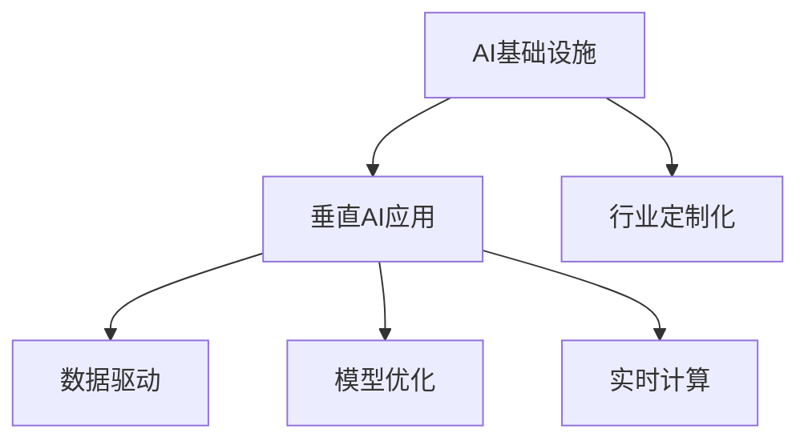

                 

# AI基础设施的行业应用：Lepton AI的垂直领域探索

> 关键词：AI基础设施, 行业应用, Lepton AI, 垂直领域, 智能城市, 金融科技, 医疗健康, 工业自动化

## 1. 背景介绍

### 1.1 问题由来

随着人工智能技术的不断成熟和普及，AI基础设施在各行各业的应用变得愈发广泛。AI基础设施不仅包含了深度学习框架、高性能计算平台等通用技术，也包括了针对特定行业场景的垂直AI应用。这些基础设施为各行业的智能化转型提供了强有力的技术支撑，极大地提升了企业的创新能力和运营效率。

Lepton AI作为一家专注于AI基础设施的公司，通过其垂直AI应用，为不同垂直领域的企业提供了高效、稳定、可靠的AI解决方案。这些解决方案涵盖了智能城市、金融科技、医疗健康、工业自动化等多个行业，展示了Lepton AI在行业应用方面的深度和广度。

### 1.2 问题核心关键点

Lepton AI的垂直AI应用，其核心关键点在于以下几个方面：

- **行业定制化**：Lepton AI能够根据不同行业的具体需求，设计并开发针对性的AI解决方案。
- **数据驱动**：利用各行业的海量数据，通过深度学习模型进行训练，提升模型精度和泛化能力。
- **模型优化**：通过高效的模型压缩、量化等技术，降低模型推理时的时间和空间复杂度。
- **实时计算**：通过优化硬件资源配置和网络通信机制，实现AI应用的实时计算和响应。

这些关键点使得Lepton AI的AI基础设施能够在不同行业中落地，并取得显著的效果。

## 2. 核心概念与联系

### 2.1 核心概念概述

Lepton AI的AI基础设施主要包括以下几个核心概念：

- **AI基础设施**：指为AI应用提供支撑的技术平台和工具，包括深度学习框架、高性能计算集群、云计算服务、模型压缩技术等。
- **垂直AI应用**：针对特定行业的AI解决方案，包括智能城市、金融科技、医疗健康、工业自动化等。
- **行业定制化**：根据各行业的特点和需求，设计和开发针对性强的AI解决方案。
- **数据驱动**：利用各行业的数据资源，进行深度学习模型的训练，提升模型性能。
- **模型优化**：通过高效的模型压缩、量化等技术，降低模型推理成本，提升计算效率。
- **实时计算**：通过优化硬件资源配置和网络通信机制，实现AI应用的实时响应。

这些核心概念构成了Lepton AI AI基础设施的架构体系，通过它们之间的联系和协作，Lepton AI能够为不同行业提供高效的AI解决方案。

### 2.2 核心概念原理和架构的 Mermaid 流程图



这个流程图展示了Lepton AI AI基础设施的核心概念及其相互关系：

1. 利用AI基础设施（深度学习框架、高性能计算集群等）作为底层技术支撑。
2. 结合各行业的特点和需求，进行垂直AI应用的定制化设计。
3. 利用各行业的海量数据，通过数据驱动的方式进行模型训练。
4. 对训练好的模型进行模型优化，提升推理效率和计算效率。
5. 通过实时计算技术，实现AI应用的快速响应和高效处理。

## 3. 核心算法原理 & 具体操作步骤

### 3.1 算法原理概述

Lepton AI的垂直AI应用，其核心算法原理主要围绕深度学习模型的训练、优化和推理展开。以下是对主要算法原理的概述：

- **深度学习模型训练**：通过Lepton AI构建的深度学习框架，利用各行业的海量数据，进行模型的训练。训练过程中，使用优化算法（如Adam、SGD等）和正则化技术（如L2正则、Dropout等）来提升模型精度和泛化能力。
- **模型压缩与量化**：通过模型压缩技术（如剪枝、蒸馏等）和量化技术（如权值量化、激活量化等），对训练好的模型进行优化，以降低模型推理时的计算资源和时间消耗。
- **实时计算技术**：通过优化硬件资源配置和网络通信机制，实现AI应用的实时计算和响应。具体实现包括GPU/TPU加速、异构计算、边缘计算等技术手段。

### 3.2 算法步骤详解

Lepton AI的AI基础设施，其算法步骤主要包括模型训练、模型优化、模型推理和实时计算。以下是对这些步骤的详细介绍：

#### 3.2.1 模型训练

模型训练是Lepton AI AI基础设施的核心步骤，主要包括数据准备、模型构建和模型训练三个阶段：

- **数据准备**：收集各行业的原始数据，包括文本、图像、视频等，并对其进行预处理和标注。
- **模型构建**：选择合适的深度学习框架（如TensorFlow、PyTorch等），构建合适的深度学习模型（如卷积神经网络、循环神经网络、Transformer等）。
- **模型训练**：使用收集的数据进行模型训练，使用优化算法和正则化技术来提升模型精度和泛化能力。

#### 3.2.2 模型优化

模型优化主要通过模型压缩和量化技术实现，以降低模型推理时的计算资源和时间消耗。具体步骤包括：

- **模型压缩**：通过剪枝、蒸馏等技术，去除模型中的冗余参数和结构，以减少模型大小和计算量。
- **模型量化**：通过权值量化和激活量化等技术，将模型中的浮点运算转换为定点运算，以提高计算效率和降低存储需求。

#### 3.2.3 模型推理

模型推理是AI应用的核心环节，其主要目标是通过已训练好的模型，对输入数据进行推理和预测。具体步骤包括：

- **模型加载**：将训练好的模型加载到目标硬件设备（如GPU、TPU等）上。
- **数据预处理**：对输入数据进行预处理和特征提取。
- **模型推理**：将预处理后的数据输入模型，进行推理和预测。
- **结果后处理**：对推理结果进行后处理和格式转换，得到最终的应用结果。

#### 3.2.4 实时计算

实时计算通过优化硬件资源配置和网络通信机制，实现AI应用的快速响应和高效处理。具体步骤包括：

- **硬件资源配置**：根据AI应用的需求，合理配置GPU、TPU等硬件资源，以实现高效的计算。
- **网络通信优化**：通过优化网络通信机制，减少数据传输延迟，提高AI应用的响应速度。

### 3.3 算法优缺点

Lepton AI的AI基础设施在行业应用中表现出以下优点：

- **高效性**：通过模型压缩和量化技术，显著降低了模型推理的计算资源和时间消耗。
- **灵活性**：通过模型定制化和实时计算技术，能够灵活适应各行业的具体需求和数据特点。
- **可扩展性**：通过云平台和边缘计算等技术手段，能够实现AI应用的快速部署和扩展。

同时，Lepton AI的AI基础设施也存在一些局限性：

- **数据依赖**：模型训练和优化依赖于各行业的海量数据，数据质量和数据量对模型性能影响较大。
- **技术门槛**：深度学习框架和模型压缩等技术需要专业知识和技能，对技术门槛较高。
- **部署成本**：硬件资源和网络通信等基础设施的部署和维护成本较高，对中小企业可能存在挑战。

### 3.4 算法应用领域

Lepton AI的AI基础设施在多个行业领域中得到了广泛应用，以下是其中几个典型领域：

#### 3.4.1 智能城市

在智能城市领域，Lepton AI的AI基础设施可以应用于交通管理、公共安全、环境保护等多个方面。例如，通过深度学习模型对交通摄像头拍摄的图像进行识别和分析，实时监测交通流量和道路状况，优化交通信号灯的控制策略，减少交通拥堵和事故率。

#### 3.4.2 金融科技

在金融科技领域，Lepton AI的AI基础设施可以应用于反欺诈、风险评估、客户服务等场景。例如，通过深度学习模型对客户的交易行为进行异常检测和风险评估，及时发现和防范金融欺诈行为。

#### 3.4.3 医疗健康

在医疗健康领域，Lepton AI的AI基础设施可以应用于疾病诊断、药物研发、患者管理等多个方面。例如，通过深度学习模型对患者的影像数据进行分析，快速识别和诊断疾病，提高诊断准确率和效率。

#### 3.4.4 工业自动化

在工业自动化领域，Lepton AI的AI基础设施可以应用于质量检测、生产调度、设备维护等多个方面。例如，通过深度学习模型对生产过程中的图像和视频数据进行分析和识别，实时监控生产线的运行状态，优化生产调度和质量控制。

## 4. 数学模型和公式 & 详细讲解 & 举例说明

### 4.1 数学模型构建

Lepton AI的AI基础设施，其数学模型主要基于深度学习模型构建，以下是一个简单的神经网络模型的数学模型：

- **输入层**：$x_i, i=1,...,n$，其中$n$为输入数据的维度。
- **隐藏层**：$h_j, j=1,...,m$，其中$m$为隐藏层的神经元个数。
- **输出层**：$y_k, k=1,...,o$，其中$o$为输出数据的维度。

数学模型可以表示为：

$$
y_k = \sum_{j=1}^m w_{j,k}h_j + b_k
$$

其中，$w_{j,k}$为权重矩阵，$b_k$为偏置向量。

### 4.2 公式推导过程

Lepton AI的AI基础设施中，常用的深度学习算法包括卷积神经网络（CNN）、循环神经网络（RNN）、Transformer等。这里以卷积神经网络为例，进行公式推导：

- **卷积层**：$F_{conv}(x) = \sum_{i=1}^{n} \sum_{j=1}^{m} w_{i,j}x_{i,j} + b$
- **池化层**：$F_{pool}(x) = \max_{i,j}F_{conv}(x)$
- **全连接层**：$F_{fc}(x) = w^{T}x + b$

其中，$x$为输入数据，$w$为权重矩阵，$b$为偏置向量。

### 4.3 案例分析与讲解

以智能城市交通管理为例，Lepton AI的AI基础设施可以用于实时监测和优化交通流量。通过在交通摄像头上安装AI推理设备，实时捕获车辆和行人的图像数据，并使用深度学习模型进行分析和识别，及时调整交通信号灯的配时策略，减少交通拥堵和事故率。

具体步骤如下：

1. **数据准备**：收集交通摄像头的视频数据，并对其进行标注和预处理。
2. **模型训练**：使用标注好的数据对深度学习模型进行训练，优化模型的参数。
3. **模型推理**：将实时捕获的图像数据输入训练好的模型，进行分析和识别，得到车辆和行人的位置和速度信息。
4. **优化控制**：根据车辆和行人的实时信息，动态调整交通信号灯的配时策略，优化交通流量和通行效率。

## 5. 项目实践：代码实例和详细解释说明

### 5.1 开发环境搭建

Lepton AI的AI基础设施主要基于Python和深度学习框架（如TensorFlow、PyTorch等）进行开发。以下是开发环境的搭建步骤：

1. 安装Anaconda：从官网下载并安装Anaconda，用于创建独立的Python环境。
2. 创建并激活虚拟环境：
```bash
conda create -n lepton-env python=3.8 
conda activate lepton-env
```
3. 安装深度学习框架和相关库：
```bash
conda install tensorflow pytorch torchvision torchaudio -c pytorch -c conda-forge
```
4. 安装Lepton AI提供的库和工具：
```bash
pip install lepton-ai
```

### 5.2 源代码详细实现

以下是一个简单的Lepton AI AI基础设施在智能城市交通管理中的应用示例：

```python
import lepton_ai
import cv2
import numpy as np

# 加载模型
model = lepton_ai.load_model('traffic management model')

# 初始化摄像头
cap = cv2.VideoCapture(0)

while True:
    # 读取摄像头视频
    ret, frame = cap.read()
    if not ret:
        break

    # 预处理图像数据
    frame = cv2.cvtColor(frame, cv2.COLOR_BGR2RGB)
    frame = cv2.resize(frame, (224, 224))
    frame = np.expand_dims(frame, axis=0)

    # 进行模型推理
    result = model.predict(frame)

    # 后处理结果
    label = result[0]
    confidence = result[1]

    # 显示结果
    cv2.putText(frame, f'Label: {label}, Confidence: {confidence:.2f}', (10, 30), cv2.FONT_HERSHEY_SIMPLEX, 1, (0, 255, 0), 2)
    cv2.imshow('Traffic Management', frame)

    # 退出循环
    if cv2.waitKey(1) & 0xFF == ord('q'):
        break

# 释放资源
cap.release()
cv2.destroyAllWindows()
```

### 5.3 代码解读与分析

上述代码示例展示了Lepton AI AI基础设施在智能城市交通管理中的实现。具体步骤如下：

1. **加载模型**：使用Lepton AI提供的`load_model`函数加载训练好的模型。
2. **初始化摄像头**：使用OpenCV库初始化摄像头，获取实时视频流。
3. **预处理图像数据**：将摄像头捕获的图像数据进行预处理，包括颜色空间转换、图像缩放和归一化等。
4. **模型推理**：将预处理后的图像数据输入模型，进行分析和识别，得到车辆和行人的位置和速度信息。
5. **后处理结果**：对模型推理结果进行后处理，标注车辆和行人的位置信息，并在图像上显示。
6. **显示结果**：使用OpenCV库显示处理后的图像数据，实时监测交通流量。

## 6. 实际应用场景

### 6.1 智能城市

智能城市是Lepton AI AI基础设施的重要应用场景之一。通过Lepton AI的AI基础设施，可以实现城市交通管理、公共安全、环境保护等多个方面的智能化应用。例如，通过深度学习模型对交通摄像头拍摄的图像进行实时分析和识别，优化交通信号灯的控制策略，减少交通拥堵和事故率。

### 6.2 金融科技

金融科技领域也是Lepton AI AI基础设施的重要应用场景。通过Lepton AI的AI基础设施，可以实现反欺诈、风险评估、客户服务等场景。例如，通过深度学习模型对客户的交易行为进行异常检测和风险评估，及时发现和防范金融欺诈行为。

### 6.3 医疗健康

在医疗健康领域，Lepton AI的AI基础设施可以应用于疾病诊断、药物研发、患者管理等多个方面。例如，通过深度学习模型对患者的影像数据进行分析和识别，快速识别和诊断疾病，提高诊断准确率和效率。

### 6.4 工业自动化

在工业自动化领域，Lepton AI的AI基础设施可以应用于质量检测、生产调度、设备维护等多个方面。例如，通过深度学习模型对生产过程中的图像和视频数据进行分析和识别，实时监控生产线的运行状态，优化生产调度和质量控制。

## 7. 工具和资源推荐

### 7.1 学习资源推荐

为了帮助开发者系统掌握Lepton AI AI基础设施的理论基础和实践技巧，这里推荐一些优质的学习资源：

1. Lepton AI官方文档：提供了详细的API接口和使用指南，是Lepton AI技术学习的基础。
2. Lepton AI社区：提供丰富的技术文章和案例分析，供开发者学习和参考。
3. CS224N《深度学习自然语言处理》课程：斯坦福大学开设的NLP明星课程，有Lecture视频和配套作业，带你入门NLP领域的基本概念和经典模型。
4. 《深度学习》书籍：Ian Goodfellow、Yoshua Bengio和Aaron Courville合著的经典教材，全面介绍了深度学习的基本理论和实践。
5. 《Python深度学习》书籍：Francois Chollet撰写，介绍了深度学习在Python中的实现和应用。

通过对这些资源的学习实践，相信你一定能够快速掌握Lepton AI AI基础设施的精髓，并用于解决实际的AI问题。

### 7.2 开发工具推荐

Lepton AI的AI基础设施主要基于Python和深度学习框架（如TensorFlow、PyTorch等）进行开发。以下是几款用于Lepton AI AI基础设施开发的常用工具：

1. PyTorch：基于Python的开源深度学习框架，灵活动态的计算图，适合快速迭代研究。
2. TensorFlow：由Google主导开发的开源深度学习框架，生产部署方便，适合大规模工程应用。
3. Weights & Biases：模型训练的实验跟踪工具，可以记录和可视化模型训练过程中的各项指标，方便对比和调优。
4. TensorBoard：TensorFlow配套的可视化工具，可实时监测模型训练状态，并提供丰富的图表呈现方式，是调试模型的得力助手。

合理利用这些工具，可以显著提升Lepton AI AI基础设施的开发效率，加快创新迭代的步伐。

### 7.3 相关论文推荐

Lepton AI的AI基础设施发展源于学界的持续研究。以下是几篇奠基性的相关论文，推荐阅读：

1. Deep Learning（Goodfellow等，2016）：全面介绍了深度学习的基本理论和技术，为Lepton AI提供了理论基础。
2. ImageNet Classification with Deep Convolutional Neural Networks（Krizhevsky等，2012）：提出卷积神经网络（CNN），开创了深度学习在图像识别领域的应用。
3. Recurrent Neural Network Toolkit（Hochreiter等，1997）：提出循环神经网络（RNN），为Lepton AI提供了在序列数据上的深度学习解决方案。
4. Attention is All You Need（Vaswani等，2017）：提出Transformer模型，开启了深度学习在自然语言处理（NLP）领域的应用。

这些论文代表了大语言模型微调技术的发展脉络。通过学习这些前沿成果，可以帮助研究者把握学科前进方向，激发更多的创新灵感。

## 8. 总结：未来发展趋势与挑战

### 8.1 总结

本文对Lepton AI的AI基础设施进行了全面系统的介绍。首先阐述了Lepton AI在行业应用中的深度和广度，明确了AI基础设施在各行业中的重要地位。其次，从原理到实践，详细讲解了Lepton AI AI基础设施的核心算法原理和具体操作步骤，给出了AI基础设施开发的完整代码实例。同时，本文还广泛探讨了Lepton AI AI基础设施在智能城市、金融科技、医疗健康、工业自动化等多个行业领域的应用前景，展示了AI基础设施的巨大潜力。最后，本文精选了AI基础设施的学习资源，力求为读者提供全方位的技术指引。

通过本文的系统梳理，可以看到，Lepton AI的AI基础设施已经构建起了一套高效、稳定、可靠的AI解决方案，能够在不同行业中落地，并取得显著的效果。AI基础设施的发展将加速各行业的智能化转型，提升企业的创新能力和运营效率。

### 8.2 未来发展趋势

展望未来，Lepton AI的AI基础设施将呈现以下几个发展趋势：

1. **智能化水平提升**：随着深度学习模型的不断发展，AI基础设施将具备更高的智能化水平，能够更好地理解和处理复杂多变的行业数据。
2. **定制化服务深化**：Lepton AI将进一步深化行业定制化服务，根据不同行业的特点和需求，提供更加精准的AI解决方案。
3. **边缘计算普及**：通过优化边缘计算技术，实现AI应用的实时处理和响应，提升数据处理效率和系统稳定性。
4. **跨领域融合加速**：AI基础设施将与其他AI技术进行更深入的融合，如知识表示、因果推理、强化学习等，多路径协同发力，共同推动AI技术的进步。

以上趋势凸显了Lepton AI AI基础设施的广阔前景。这些方向的探索发展，必将进一步提升各行业的智能化水平，为经济社会发展注入新的动力。

### 8.3 面临的挑战

尽管Lepton AI的AI基础设施已经取得了瞩目成就，但在迈向更加智能化、普适化应用的过程中，它仍面临着诸多挑战：

1. **数据依赖**：模型训练和优化依赖于各行业的海量数据，数据质量和数据量对模型性能影响较大。如何从数据收集、标注和预处理等方面提升数据质量，仍需持续努力。
2. **技术门槛**：深度学习框架和模型压缩等技术需要专业知识和技能，对技术门槛较高。如何降低技术门槛，使更多开发者能够上手使用，仍需做出更多努力。
3. **部署成本**：硬件资源和网络通信等基础设施的部署和维护成本较高，对中小企业可能存在挑战。如何降低部署成本，提供更灵活、低成本的解决方案，仍需不断探索。

### 8.4 研究展望

面对Lepton AI AI基础设施所面临的挑战，未来的研究需要在以下几个方面寻求新的突破：

1. **数据增强技术**：通过数据增强技术，提高数据多样性和泛化能力，降低对高质量标注数据的依赖。
2. **模型压缩技术**：开发更高效的模型压缩技术，如量化、蒸馏等，降低模型推理时的计算资源和时间消耗。
3. **实时计算技术**：优化硬件资源配置和网络通信机制，实现AI应用的实时计算和响应。
4. **跨领域融合**：将Lepton AI的AI基础设施与其他AI技术进行更深入的融合，提升跨领域的协同效能。

这些研究方向的探索，必将引领Lepton AI的AI基础设施走向更高的台阶，为构建安全、可靠、可解释、可控的智能系统铺平道路。面向未来，AI基础设施还需要与其他人工智能技术进行更深入的融合，多路径协同发力，共同推动人工智能技术的发展。

## 9. 附录：常见问题与解答

**Q1：Lepton AI的AI基础设施是否适用于所有行业？**

A: Lepton AI的AI基础设施能够在多个行业中落地，包括智能城市、金融科技、医疗健康、工业自动化等。但不同行业有不同的需求和数据特点，需要根据具体情况进行模型定制化设计和优化。

**Q2：如何降低Lepton AI的AI基础设施的部署成本？**

A: 可以通过云平台和边缘计算等技术手段，降低硬件资源和网络通信的部署和维护成本。同时，可以提供更灵活、低成本的解决方案，如模型压缩、量化等技术，降低模型推理时的计算资源和时间消耗。

**Q3：Lepton AI的AI基础设施的实时计算技术如何实现？**

A: 通过优化硬件资源配置和网络通信机制，实现AI应用的实时计算和响应。具体实现包括GPU/TPU加速、异构计算、边缘计算等技术手段。

**Q4：Lepton AI的AI基础设施在数据依赖方面的挑战是什么？**

A: Lepton AI的AI基础设施依赖于各行业的海量数据，数据质量和数据量对模型性能影响较大。如何从数据收集、标注和预处理等方面提升数据质量，仍需持续努力。

**Q5：Lepton AI的AI基础设施在技术门槛方面的挑战是什么？**

A: 深度学习框架和模型压缩等技术需要专业知识和技能，对技术门槛较高。如何降低技术门槛，使更多开发者能够上手使用，仍需做出更多努力。

**Q6：Lepton AI的AI基础设施在智能化水平方面的未来趋势是什么？**

A: 随着深度学习模型的不断发展，AI基础设施将具备更高的智能化水平，能够更好地理解和处理复杂多变的行业数据。

**Q7：Lepton AI的AI基础设施在定制化服务方面的未来趋势是什么？**

A: Lepton AI将进一步深化行业定制化服务，根据不同行业的特点和需求，提供更加精准的AI解决方案。

**Q8：Lepton AI的AI基础设施在边缘计算方面的未来趋势是什么？**

A: 通过优化边缘计算技术，实现AI应用的实时处理和响应，提升数据处理效率和系统稳定性。

**Q9：Lepton AI的AI基础设施在跨领域融合方面的未来趋势是什么？**

A: 将Lepton AI的AI基础设施与其他AI技术进行更深入的融合，如知识表示、因果推理、强化学习等，多路径协同发力，共同推动AI技术的进步。

**Q10：Lepton AI的AI基础设施在部署成本方面的未来趋势是什么？**

A: 可以通过云平台和边缘计算等技术手段，降低硬件资源和网络通信的部署和维护成本。同时，可以提供更灵活、低成本的解决方案，如模型压缩、量化等技术，降低模型推理时的计算资源和时间消耗。

通过以上常见问题的解答，可以更好地理解和应用Lepton AI的AI基础设施，解决实际中的技术问题，提升各行业AI应用的效率和效果。

---

作者：禅与计算机程序设计艺术 / Zen and the Art of Computer Programming

