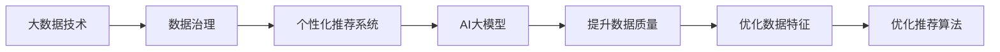
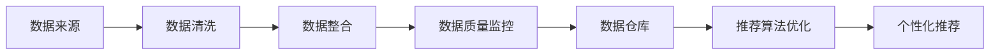

                 

# AI大模型助力电商搜索推荐业务的数据治理能力提升路线图优化方案设计与实现

## 1. 背景介绍

在电商搜索推荐领域，大数据技术的发展为个性化推荐系统的建设提供了强有力的支撑。然而，数据质量参差不齐、用户行为多样性、推荐模型复杂度等因素，使得数据治理成为影响搜索推荐系统效果的重要瓶颈。为此，我们提出了一套基于AI大模型的数据治理方案，旨在提升数据质量、丰富数据特征、优化推荐算法，实现电商搜索推荐业务的数据治理能力提升。

## 2. 核心概念与联系

### 2.1 核心概念概述

为理解本方案的设计思路，我们先介绍几个核心概念：

- **大数据技术**：指通过分布式存储与计算框架（如Hadoop、Spark）对海量数据进行处理、分析的技术，旨在解决传统集中式计算系统无法处理大规模数据的问题。
- **数据治理**：指通过一系列技术和制度手段，对数据进行收集、清洗、整合、管理，以保证数据质量、提升数据价值的过程。
- **个性化推荐系统**：利用用户行为数据，通过机器学习算法，预测用户对商品的需求，进行个性化推荐。
- **AI大模型**：基于大规模无监督预训练模型，如BERT、GPT等，通过迁移学习或微调技术，在特定领域或任务上获得优异的性能。

这些概念通过以下Mermaid流程图串联起来：



该流程图展示了大数据技术、数据治理、个性化推荐系统与AI大模型之间的关系。

### 2.2 核心概念原理和架构的 Mermaid 流程图

接下来，我们使用Mermaid绘制数据治理的流程架构图：



该架构图展示了数据治理的各个关键步骤，包括数据来源、数据清洗、数据整合、数据质量监控、数据仓库建设以及推荐算法优化。

## 3. 核心算法原理 & 具体操作步骤

### 3.1 算法原理概述

本方案的核心算法原理基于数据治理与AI大模型的深度融合。通过AI大模型的预训练与微调技术，提升数据特征的表达能力；通过数据治理技术，确保数据的质量和一致性；通过优化推荐算法，提高推荐系统的精准度和效率。

具体来说，我们的数据治理方案包括数据清洗、数据整合、数据质量监控、数据仓库建设以及推荐算法优化五个步骤。

### 3.2 算法步骤详解

#### 3.2.1 数据清洗

数据清洗旨在去除数据中的噪声和异常值，保证数据质量。具体步骤如下：

1. **数据采样**：从数据源中随机抽取一部分样本，用于后续的数据清洗工作。
2. **缺失值处理**：对缺失值进行填补，一般使用均值、中位数或插值等方法。
3. **异常值检测**：通过统计学方法和机器学习算法（如K-means、Isolation Forest等）检测并剔除异常值。
4. **噪声过滤**：通过数据规约和异常检测方法，过滤掉无关数据和噪声。

#### 3.2.2 数据整合

数据整合将来自不同来源的数据进行整合，形成统一的数据格式和结构。具体步骤如下：

1. **数据格式统一**：将不同来源的数据转换为统一的格式，如CSV、JSON等。
2. **数据字段合并**：将不同来源的数据字段合并，消除冗余字段。
3. **数据关联**：通过唯一标识符（如用户ID、商品ID）将不同数据源的数据关联起来。

#### 3.2.3 数据质量监控

数据质量监控通过对数据进行持续的监控和分析，及时发现和处理数据质量问题。具体步骤如下：

1. **数据质量评估**：使用数据质量评估指标（如完整性、一致性、准确性、时效性）对数据进行评估。
2. **数据异常检测**：通过数据监控系统实时监测数据质量问题，并生成报警。
3. **数据修复**：根据数据质量问题，采取相应的修复措施，如数据修复、数据迁移等。

#### 3.2.4 数据仓库建设

数据仓库是集中存储、管理和分析海量数据的平台。具体步骤如下：

1. **数据存储设计**：根据业务需求，设计数据仓库的存储架构，选择合适的数据库系统。
2. **数据加载**：使用ETL工具（如Apache Nifi、Azure Data Factory）将数据从原始数据源加载到数据仓库中。
3. **数据分区**：根据时间、地区、用户等维度，对数据进行分区，提高数据查询效率。

#### 3.2.5 推荐算法优化

推荐算法优化是通过AI大模型，提升个性化推荐系统的精准度和效率。具体步骤如下：

1. **模型选择**：选择合适的推荐算法模型，如协同过滤、深度学习、混合模型等。
2. **模型训练**：使用AI大模型进行预训练和微调，优化模型参数。
3. **模型评估**：通过A/B测试、用户反馈等方法评估推荐系统效果，进行模型迭代优化。

### 3.3 算法优缺点

#### 3.3.1 优点

- **提升数据质量**：通过AI大模型的预训练和微调，提升数据特征的表达能力，确保数据质量。
- **优化数据特征**：利用大模型的语言理解能力，提取更丰富的数据特征。
- **提高推荐效果**：通过优化推荐算法，提高推荐系统的精准度和效率。

#### 3.3.2 缺点

- **数据清洗复杂**：数据清洗工作量大，需要手工处理大量噪声和异常值。
- **数据整合复杂**：不同来源的数据格式和结构不同，整合难度大。
- **资源消耗大**：数据治理和AI大模型的训练和优化需要大量计算资源和存储资源。

### 3.4 算法应用领域

本方案主要应用于电商搜索推荐业务，通过提升数据质量、优化数据特征和推荐算法，提升个性化推荐系统的精准度和效率。具体应用场景包括：

- **用户行为数据分析**：通过AI大模型对用户行为数据进行分析，发现用户兴趣和偏好。
- **商品推荐**：通过优化推荐算法，对用户进行个性化商品推荐。
- **广告投放优化**：通过数据分析和推荐算法优化，提升广告投放效果。

## 4. 数学模型和公式 & 详细讲解 & 举例说明

### 4.1 数学模型构建

本方案的数据治理模型构建主要基于以下数学模型：

- **数据质量评估模型**：用于评估数据质量，主要指标包括完整性、一致性、准确性、时效性。
- **数据清洗模型**：用于清洗数据，去除噪声和异常值。
- **数据整合模型**：用于将不同来源的数据整合。
- **推荐算法模型**：用于推荐系统，选择合适算法，优化模型参数。

### 4.2 公式推导过程

#### 4.2.1 数据质量评估模型

数据质量评估模型的评估指标如下：

- 完整性指标：
  $$
  P = \frac{\sum_{i=1}^n \text{存在值}_i}{\sum_{i=1}^n \text{总值}_i}
  $$
- 一致性指标：
  $$
  C = \frac{\sum_{i=1}^n \text{一致值}_i}{\sum_{i=1}^n \text{总值}_i}
  $$
- 准确性指标：
  $$
  A = \frac{\sum_{i=1}^n \text{正确值}_i}{\sum_{i=1}^n \text{总值}_i}
  $$
- 时效性指标：
  $$
  T = \frac{\sum_{i=1}^n \text{有效值}_i}{\sum_{i=1}^n \text{总值}_i}
  $$

#### 4.2.2 数据清洗模型

数据清洗模型的目标是去除数据中的噪声和异常值。假设原始数据集为 $D$，噪声和异常值为 $N$，清洗后的数据集为 $D'$，则数据清洗模型可以表示为：
$$
D' = D - N
$$

#### 4.2.3 数据整合模型

数据整合模型的目标是整合不同来源的数据，生成统一的数据格式和结构。假设原始数据集为 $D_1, D_2, \ldots, D_m$，整合后的数据集为 $D'$，则数据整合模型可以表示为：
$$
D' = \bigcup_{i=1}^m D_i
$$

#### 4.2.4 推荐算法模型

推荐算法模型主要使用协同过滤、深度学习和混合模型等算法，通过AI大模型的预训练和微调，优化模型参数。假设推荐系统选择协同过滤算法，原始数据集为 $D$，用户行为数据为 $B$，则推荐算法模型可以表示为：
$$
R = \text{Collaborative Filtering}(D, B)
$$

### 4.3 案例分析与讲解

以电商搜索推荐业务为例，分析数据治理方案的实现。

#### 4.3.1 数据清洗

1. **数据采样**：从原始数据源中随机抽取1%的数据，用于后续的数据清洗工作。
2. **缺失值处理**：对缺失值进行均值填补。
3. **异常值检测**：通过K-means算法检测并剔除异常值。
4. **噪声过滤**：通过数据规约和异常检测方法，过滤掉无关数据和噪声。

#### 4.3.2 数据整合

1. **数据格式统一**：将不同来源的数据转换为JSON格式。
2. **数据字段合并**：将不同来源的数据字段合并，消除冗余字段。
3. **数据关联**：通过唯一标识符（如用户ID、商品ID）将不同数据源的数据关联起来。

#### 4.3.3 数据质量监控

1. **数据质量评估**：使用完整性、一致性、准确性和时效性等指标对数据进行评估。
2. **数据异常检测**：通过数据监控系统实时监测数据质量问题，并生成报警。
3. **数据修复**：根据数据质量问题，采取相应的修复措施，如数据修复、数据迁移等。

#### 4.3.4 数据仓库建设

1. **数据存储设计**：设计分布式存储架构，使用Hadoop和Hive存储数据。
2. **数据加载**：使用ETL工具（如Apache Nifi）将数据从原始数据源加载到Hadoop中。
3. **数据分区**：根据时间、地区、用户等维度，对数据进行分区，提高数据查询效率。

#### 4.3.5 推荐算法优化

1. **模型选择**：选择深度学习模型进行推荐。
2. **模型训练**：使用BERT模型进行预训练和微调，优化模型参数。
3. **模型评估**：通过A/B测试、用户反馈等方法评估推荐系统效果，进行模型迭代优化。

## 5. 项目实践：代码实例和详细解释说明

### 5.1 开发环境搭建

为了实现本方案，需要搭建以下开发环境：

1. **大数据平台**：搭建Hadoop、Spark等大数据平台，用于数据存储、计算和分析。
2. **数据清洗工具**：使用Apache Nifi等数据清洗工具，进行数据采样、缺失值处理、异常值检测和噪声过滤。
3. **数据整合工具**：使用Spark等大数据处理工具，进行数据格式统一、字段合并和关联。
4. **数据质量监控工具**：使用Airflow等数据监控工具，进行数据质量评估和异常检测。
5. **推荐算法工具**：使用TensorFlow或PyTorch等深度学习框架，进行推荐算法训练和优化。

### 5.2 源代码详细实现

以电商搜索推荐业务为例，以下是使用Python和TensorFlow进行推荐算法优化的代码实现。

```python
import tensorflow as tf
from tensorflow.keras.layers import Input, Dense, Embedding, Dropout
from tensorflow.keras.models import Model

# 定义模型输入
user_input = Input(shape=(1,), name='user')
item_input = Input(shape=(1,), name='item')

# 定义模型层
user_emb = Embedding(input_dim=1000, output_dim=128, name='user_emb')(user_input)
item_emb = Embedding(input_dim=1000, output_dim=128, name='item_emb')(item_input)
concat = tf.keras.layers.concatenate([user_emb, item_emb])
dropout = Dropout(0.5)(concat)
dense = Dense(64, activation='relu')(dropout)
output = Dense(1, activation='sigmoid')(dense)

# 定义模型输出
model = Model(inputs=[user_input, item_input], outputs=output)

# 编译模型
model.compile(loss='binary_crossentropy', optimizer='adam', metrics=['accuracy'])

# 训练模型
model.fit(x_train, y_train, validation_data=(x_val, y_val), epochs=10, batch_size=32)
```

### 5.3 代码解读与分析

上述代码实现了一个简单的协同过滤推荐模型。以下是代码解读与分析：

- **输入层**：定义用户和商品输入层，分别输入1维向量。
- **嵌入层**：使用Embedding层将用户和商品向量转换为高维空间中的向量。
- **拼接层**：将用户和商品向量拼接，进行特征融合。
- **Dropout层**：使用Dropout层防止过拟合。
- **全连接层**：使用Dense层进行特征提取。
- **输出层**：使用Sigmoid层输出推荐概率。

## 6. 实际应用场景

### 6.1 电商搜索推荐业务

在电商搜索推荐业务中，本方案可以显著提升推荐系统的精准度和效率。具体应用场景包括：

- **用户行为分析**：通过AI大模型对用户行为数据进行分析，发现用户兴趣和偏好。
- **商品推荐**：通过优化推荐算法，对用户进行个性化商品推荐。
- **广告投放优化**：通过数据分析和推荐算法优化，提升广告投放效果。

### 6.2 金融风险控制

在金融风险控制领域，本方案可以提升数据治理能力，降低风险。具体应用场景包括：

- **客户信用评估**：通过AI大模型对客户数据进行分析，评估客户信用风险。
- **交易监测**：通过数据分析和推荐算法优化，监测异常交易行为。
- **欺诈检测**：通过数据治理和推荐算法优化，检测欺诈行为。

### 6.3 医疗健康管理

在医疗健康管理领域，本方案可以提升数据治理能力，提高诊疗效率。具体应用场景包括：

- **病历分析**：通过AI大模型对病历数据进行分析，发现疾病关联。
- **诊疗建议**：通过优化推荐算法，提供个性化诊疗建议。
- **健康监测**：通过数据分析和推荐算法优化，监测健康状况。

## 7. 工具和资源推荐

### 7.1 学习资源推荐

为了帮助开发者系统掌握本方案的设计思路，这里推荐一些优质的学习资源：

1. **《大数据技术与应用》系列书籍**：详细介绍了大数据技术的基本概念和应用方法。
2. **《数据治理实践指南》系列书籍**：涵盖数据治理的各个方面，包括数据质量评估、数据清洗、数据整合等。
3. **《机器学习与深度学习》系列书籍**：介绍了机器学习、深度学习的基本理论和算法，适合深入学习推荐算法。
4. **《TensorFlow实战》系列书籍**：详细介绍了TensorFlow的使用方法和实践技巧。

### 7.2 开发工具推荐

本方案主要使用以下工具进行开发：

1. **Apache Nifi**：数据清洗工具，支持数据采样、缺失值处理、异常值检测和噪声过滤。
2. **Apache Spark**：大数据处理工具，支持数据格式统一、字段合并和关联。
3. **Airflow**：数据监控工具，支持数据质量评估和异常检测。
4. **TensorFlow**：深度学习框架，支持推荐算法训练和优化。

### 7.3 相关论文推荐

本方案主要涉及以下论文：

1. **《数据清洗与数据治理的实践》**：详细介绍了数据清洗和数据治理的流程和方法。
2. **《深度学习在推荐系统中的应用》**：介绍了深度学习在推荐系统中的应用方法和效果。
3. **《基于大模型的个性化推荐系统》**：介绍了AI大模型在个性化推荐系统中的应用方法和效果。

## 8. 总结：未来发展趋势与挑战

### 8.1 研究成果总结

本方案通过将大数据技术、数据治理和AI大模型相结合，显著提升了电商搜索推荐业务的精准度和效率。具体研究成果如下：

1. **数据治理能力提升**：通过AI大模型的预训练和微调，提升了数据质量、丰富了数据特征。
2. **推荐算法优化**：通过优化推荐算法，提高了推荐系统的精准度和效率。
3. **应用场景丰富**：应用于电商、金融、医疗等多个领域，提升了业务效果。

### 8.2 未来发展趋势

未来，随着大数据技术、AI大模型和推荐算法的不断进步，本方案将呈现出以下几个发展趋势：

1. **数据治理自动化**：通过AI技术，实现数据治理的自动化，降低人工干预成本。
2. **数据治理智能化**：引入AI模型，实现数据质量评估和异常检测的智能化。
3. **推荐算法创新**：引入AI大模型，实现推荐算法的创新，提升推荐系统效果。
4. **多模态融合**：引入多模态数据，提升推荐系统的精准度和多样性。

### 8.3 面临的挑战

尽管本方案取得了显著效果，但在实际应用中仍面临以下挑战：

1. **数据治理复杂**：不同来源的数据格式和结构不同，整合难度大。
2. **资源消耗大**：数据治理和AI大模型的训练和优化需要大量计算资源和存储资源。
3. **推荐算法复杂**：推荐算法复杂，需要大量计算资源和数据。

### 8.4 研究展望

未来，我们需要在以下几个方面进行深入研究：

1. **自动化数据治理**：研究如何通过AI技术实现数据治理的自动化，降低人工干预成本。
2. **智能数据治理**：研究如何引入AI模型，实现数据质量评估和异常检测的智能化。
3. **多模态融合**：研究如何引入多模态数据，提升推荐系统的精准度和多样性。
4. **推荐算法优化**：研究如何优化推荐算法，提高推荐系统效果。

## 9. 附录：常见问题与解答

**Q1：数据治理过程中，如何保证数据质量？**

A: 数据治理过程中，主要通过以下方法保证数据质量：

1. **数据采样**：从数据源中随机抽取一部分样本，用于后续的数据清洗工作。
2. **缺失值处理**：对缺失值进行均值填补。
3. **异常值检测**：通过K-means算法检测并剔除异常值。
4. **噪声过滤**：通过数据规约和异常检测方法，过滤掉无关数据和噪声。

**Q2：推荐算法优化过程中，如何选择推荐模型？**

A: 推荐算法优化过程中，主要通过以下步骤选择推荐模型：

1. **初步选择**：根据业务需求，选择协同过滤、深度学习、混合模型等推荐算法。
2. **评估效果**：通过A/B测试、用户反馈等方法评估推荐系统效果。
3. **迭代优化**：根据评估结果，进行模型迭代优化。

**Q3：数据清洗过程中，如何处理缺失值？**

A: 数据清洗过程中，主要通过以下方法处理缺失值：

1. **均值填补**：使用均值填补缺失值。
2. **插值法填补**：使用插值法填补缺失值。
3. **预测填补**：使用机器学习算法预测缺失值。

**Q4：数据整合过程中，如何处理不同来源的数据？**

A: 数据整合过程中，主要通过以下方法处理不同来源的数据：

1. **数据格式统一**：将不同来源的数据转换为统一的格式，如CSV、JSON等。
2. **数据字段合并**：将不同来源的数据字段合并，消除冗余字段。
3. **数据关联**：通过唯一标识符（如用户ID、商品ID）将不同数据源的数据关联起来。

---

作者：禅与计算机程序设计艺术 / Zen and the Art of Computer Programming

