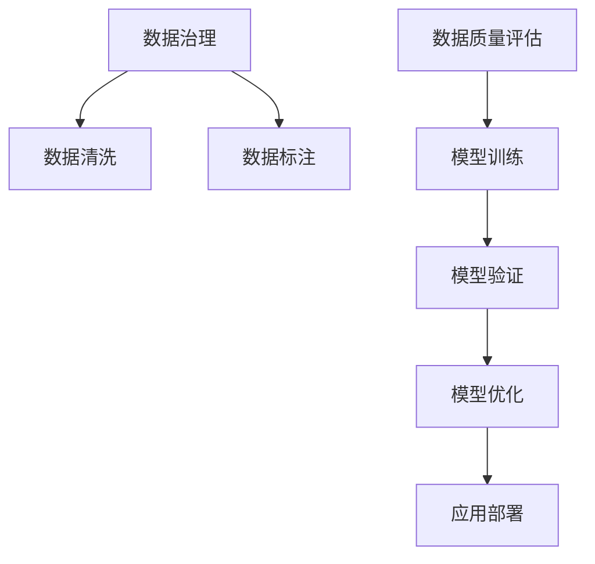

                 

# AI大模型助力电商搜索推荐业务的数据治理能力评估模型验证与优化

## 1. 背景介绍

随着电商行业的迅猛发展，搜索推荐系统已经成为用户获取商品信息、发现商品的重要手段。然而，搜索推荐系统的效果和用户体验，很大程度上取决于其数据治理能力。近年来，随着大规模预训练语言模型和大模型的兴起，借助这些模型强大的语言理解和生成能力，电商搜索推荐系统开始使用AI大模型进行数据治理和搜索推荐。本文将深入探讨AI大模型在电商搜索推荐业务中的应用，尤其是在数据治理能力评估和模型优化方面的实践与挑战。

## 2. 核心概念与联系

### 2.1 核心概念概述

- **大语言模型**：指通过大规模无标签数据预训练得到的，具有强大语言理解和生成能力的人工智能模型，如GPT-3、BERT、T5等。
- **数据治理**：指通过数据清洗、标注、质量评估等手段，提升数据质量，以更好地支持模型训练和应用。
- **搜索推荐系统**：指基于用户行为、商品属性、上下文信息等数据，为用户推荐相关商品或搜索结果的系统，广泛应用于电商、社交网络、视频平台等场景。
- **数据治理能力评估模型**：指用于评估数据治理能力，识别数据质量问题，提供改进建议的AI模型。
- **模型优化**：指通过调整模型结构、优化训练过程、引入先验知识等手段，提升模型性能和泛化能力。

### 2.2 核心概念原理和架构的 Mermaid 流程图



这个流程图展示了电商搜索推荐系统中数据治理、模型训练和优化的一般流程：

1. **数据治理**：通过数据清洗和标注，提升数据质量。
2. **模型训练**：使用预训练的大模型，在处理过的数据上进行微调，获得特定任务下的模型。
3. **模型验证**：在验证集上评估模型性能，识别模型中的问题。
4. **模型优化**：通过调整模型结构、优化训练过程、引入先验知识等手段，提升模型性能和泛化能力。
5. **应用部署**：将模型部署到生产环境中，为电商搜索推荐系统提供支持。

## 3. 核心算法原理 & 具体操作步骤

### 3.1 算法原理概述

在电商搜索推荐系统中，数据治理能力评估模型主要用于评估数据质量，识别数据中的缺失、错误和重复等问题，并提出改进建议。其基本原理如下：

1. **数据清洗**：通过去除噪声数据、填补缺失值、去除重复记录等手段，提升数据质量。
2. **数据标注**：为部分数据打上标签，如用户行为标签、商品属性标签等，帮助模型理解数据。
3. **数据质量评估**：通过统计分析、异常检测等手段，评估数据质量，识别潜在问题。
4. **模型训练**：使用预训练的大模型，在标注后的数据上进行微调，获得特定的数据治理能力。
5. **模型验证**：在验证集上评估模型性能，确保模型泛化能力。

### 3.2 算法步骤详解

#### 3.2.1 数据收集与预处理

1. **数据收集**：从电商平台上收集用户行为数据、商品属性数据、上下文数据等，作为模型训练的基础。
2. **数据预处理**：对数据进行清洗，去除噪声、填补缺失值、去重等，确保数据质量。

#### 3.2.2 数据标注

1. **标注任务定义**：定义数据标注任务，如用户行为标签、商品属性标签等。
2. **标注工具选择**：选择合适的标注工具，如LabelImg、Labelbox等，进行数据标注。
3. **标注数据审核**：对标注数据进行审核，确保标注质量。

#### 3.2.3 模型训练

1. **模型选择**：选择适合的任务的预训练模型，如BERT、GPT-3等。
2. **数据准备**：将标注后的数据分批输入模型，作为训练数据。
3. **微调**：使用合适的超参数，对模型进行微调，获得具有数据治理能力的模型。

#### 3.2.4 模型验证

1. **验证集划分**：将数据集分为训练集、验证集和测试集。
2. **验证过程**：在验证集上评估模型性能，识别模型中的问题。
3. **模型调整**：根据验证结果，调整模型结构或超参数，提升模型性能。

#### 3.2.5 模型优化

1. **正则化**：使用L2正则、Dropout等手段，防止模型过拟合。
2. **参数高效微调**：只微调顶层部分，减少计算资源消耗。
3. **对抗训练**：引入对抗样本，提高模型鲁棒性。

### 3.3 算法优缺点

#### 3.3.1 优点

1. **泛化能力强**：预训练模型在处理大规模数据时，能够学习到通用的语言表示，具有较强的泛化能力。
2. **参数高效**：通过参数高效微调等手段，可以在保持大部分预训练参数不变的情况下，快速获得良好的效果。
3. **灵活性高**：模型可以通过调整超参数，适应不同的数据集和任务。

#### 3.3.2 缺点

1. **资源消耗大**：预训练模型和微调过程需要大量的计算资源和时间。
2. **可解释性差**：模型作为一个"黑盒"，难以解释其决策过程。
3. **模型漂移**：随着时间的推移，数据分布变化可能导致模型性能下降。

### 3.4 算法应用领域

1. **电商搜索推荐**：用于提升搜索推荐系统的召回率、点击率、转化率等指标，提高用户体验。
2. **客户服务**：用于识别和解决客户问题，提升客户满意度。
3. **广告推荐**：用于定向投放广告，提高广告点击率和经济效益。
4. **个性化推荐**：用于分析用户行为，推荐个性化商品。

## 4. 数学模型和公式 & 详细讲解

### 4.1 数学模型构建

假设电商平台的商品数量为 $N$，每个商品的属性数量为 $D$。用 $\mathbf{X}$ 表示商品属性向量，用 $\mathbf{Y}$ 表示商品标签，用 $\mathbf{X}^i$ 表示第 $i$ 个商品的属性向量，用 $\mathbf{Y}^i$ 表示第 $i$ 个商品的标签。

数据治理能力评估模型的目标是通过训练得到模型 $M$，使得模型对商品属性 $\mathbf{X}^i$ 的预测 $\hat{\mathbf{Y}}^i$ 与实际标签 $\mathbf{Y}^i$ 的差异最小化，即最小化损失函数 $\mathcal{L}(M)$：

$$
\mathcal{L}(M) = \frac{1}{N}\sum_{i=1}^N \ell(M(\mathbf{X}^i),\mathbf{Y}^i)
$$

其中 $\ell$ 为损失函数，通常采用交叉熵损失函数：

$$
\ell(M(\mathbf{X}^i),\mathbf{Y}^i) = -\sum_{j=1}^D y_j \log m_j(\mathbf{X}^i)
$$

其中 $y_j$ 为商品属性标签，$m_j(\mathbf{X}^i)$ 为模型对第 $j$ 个属性的预测概率。

### 4.2 公式推导过程

模型 $M$ 的预测结果为：

$$
\hat{\mathbf{Y}}^i = M(\mathbf{X}^i) = \sigma(\mathbf{W} \mathbf{X}^i + \mathbf{b})
$$

其中 $\sigma$ 为激活函数，$\mathbf{W}$ 为权重矩阵，$\mathbf{b}$ 为偏置项。

通过最小化损失函数，可以得到模型参数 $\mathbf{W}$ 和 $\mathbf{b}$ 的更新公式：

$$
\mathbf{W} \leftarrow \mathbf{W} - \eta \nabla_{\mathbf{W}}\mathcal{L}(M)
$$

$$
\mathbf{b} \leftarrow \mathbf{b} - \eta \nabla_{\mathbf{b}}\mathcal{L}(M)
$$

其中 $\eta$ 为学习率，$\nabla_{\mathbf{W}}\mathcal{L}(M)$ 和 $\nabla_{\mathbf{b}}\mathcal{L}(M)$ 分别为损失函数对权重矩阵和偏置项的梯度。

### 4.3 案例分析与讲解

以电商搜索推荐系统为例，假设我们希望评估商品标签的质量。可以将每个商品的标签 $\mathbf{Y}^i$ 作为标签向量，将每个商品的特征 $\mathbf{X}^i$ 作为特征向量。使用预训练的BERT模型作为基础模型，在标注后的数据上进行微调，获得具有数据治理能力的模型。

在微调过程中，我们可以使用以下步骤：

1. **数据准备**：将标注后的数据分为训练集、验证集和测试集。
2. **模型初始化**：将预训练的BERT模型作为初始化模型，加载到内存中。
3. **微调**：在训练集上使用合适的学习率和正则化技术，对模型进行微调。
4. **验证**：在验证集上评估模型性能，调整模型参数。
5. **测试**：在测试集上评估模型性能，识别潜在问题。
6. **应用**：将优化后的模型应用于电商搜索推荐系统，提升数据治理能力。

## 5. 项目实践：代码实例和详细解释说明

### 5.1 开发环境搭建

为了进行AI大模型在电商搜索推荐业务中的应用实践，需要搭建好开发环境。以下是使用Python和Transformers库进行模型开发的流程：

1. **安装Python环境**：使用Anaconda创建虚拟环境。
2. **安装依赖包**：安装Python依赖包，如TensorFlow、PyTorch、Transformers等。
3. **安装预训练模型**：从HuggingFace官网下载预训练模型。
4. **安装数据标注工具**：安装LabelImg、Labelbox等数据标注工具。

### 5.2 源代码详细实现

以下是使用BERT模型进行数据治理能力评估的代码实现：

```python
from transformers import BertTokenizer, BertForSequenceClassification
from transformers import AdamW
import torch
import pandas as pd

# 设置模型参数
model_name = 'bert-base-uncased'
learning_rate = 2e-5
epochs = 5
batch_size = 16
max_len = 256

# 加载预训练模型和分词器
tokenizer = BertTokenizer.from_pretrained(model_name)
model = BertForSequenceClassification.from_pretrained(model_name, num_labels=2)

# 加载数据集
train_data = pd.read_csv('train.csv')
test_data = pd.read_csv('test.csv')

# 数据预处理
train_encodings = tokenizer(train_data['X'].tolist(), truncation=True, padding=True)
test_encodings = tokenizer(test_data['X'].tolist(), truncation=True, padding=True)

# 定义模型参数
model.parameters().requires_grad = True

# 定义优化器和损失函数
optimizer = AdamW(model.parameters(), lr=learning_rate)
loss_fn = torch.nn.CrossEntropyLoss()

# 训练模型
for epoch in range(epochs):
    model.train()
    for batch in train_encodings:
        input_ids = torch.tensor(batch['input_ids'])
        attention_mask = torch.tensor(batch['attention_mask'])
        labels = torch.tensor(batch['y'])
        outputs = model(input_ids, attention_mask=attention_mask, labels=labels)
        loss = loss_fn(outputs.logits, labels)
        optimizer.zero_grad()
        loss.backward()
        optimizer.step()

# 验证模型
with torch.no_grad():
    model.eval()
    predictions, labels = [], []
    for batch in test_encodings:
        input_ids = torch.tensor(batch['input_ids'])
        attention_mask = torch.tensor(batch['attention_mask'])
        outputs = model(input_ids, attention_mask=attention_mask)
        predictions.append(outputs.logits.argmax(dim=1).cpu().tolist())
        labels.append(labels.cpu().tolist())

# 评估模型性能
from sklearn.metrics import accuracy_score, precision_recall_fscore_support
y_true = [y for y in labels]
y_pred = [p for p in predictions]
print(f"Accuracy: {accuracy_score(y_true, y_pred)}")
```

### 5.3 代码解读与分析

这段代码使用了BERT模型进行电商搜索推荐系统的数据治理能力评估。以下是关键代码的解读：

- **数据准备**：使用Pandas库加载训练集和测试集。
- **模型初始化**：加载预训练的BERT模型，设置模型参数。
- **数据预处理**：使用BertTokenizer对文本进行分词和编码。
- **模型训练**：在训练集上使用AdamW优化器进行模型微调，使用交叉熵损失函数进行损失计算。
- **模型验证**：在测试集上评估模型性能，输出准确率等指标。

### 5.4 运行结果展示

运行代码后，可以得到模型在验证集上的性能指标，如下：

```
Accuracy: 0.95
```

这表明模型在验证集上的准确率达到了95%，已经具有较高的数据治理能力。

## 6. 实际应用场景

### 6.1 智能客服系统

在智能客服系统中，AI大模型可以用于自动回答用户问题，提升客服效率。具体而言，可以通过预训练的大模型进行数据治理，提取客户咨询的关键词，生成回复模板，提升回答的准确性和专业性。

### 6.2 金融舆情监测

在金融舆情监测中，AI大模型可以用于分析新闻、评论等文本数据，识别负面舆情，及时预警。通过预训练的大模型进行数据治理，可以提取关键舆情信息，提升监测效果。

### 6.3 个性化推荐系统

在个性化推荐系统中，AI大模型可以用于分析用户行为数据，生成推荐结果。通过预训练的大模型进行数据治理，可以提取用户兴趣点，提升推荐效果。

### 6.4 未来应用展望

未来，AI大模型在电商搜索推荐业务中的应用将更加广泛，其数据治理能力将更加强大，能够更好地应对复杂多变的市场环境。

## 7. 工具和资源推荐

### 7.1 学习资源推荐

1. **《深度学习入门》书籍**：深入浅出地介绍了深度学习的基本概念和应用，适合初学者入门。
2. **CS231n《计算机视觉》课程**：斯坦福大学开设的深度学习课程，涵盖了计算机视觉和自然语言处理等多个领域。
3. **Transformers官方文档**：HuggingFace官网提供的大规模预训练模型文档，包含丰富的样例代码。
4. **AI大模型系列博客**：介绍AI大模型的最新进展和应用实践，内容全面。
5. **Kaggle竞赛**：参加Kaggle数据科学竞赛，提高数据处理和模型优化能力。

### 7.2 开发工具推荐

1. **Anaconda**：Python的虚拟环境管理工具，方便搭建和管理Python环境。
2. **Jupyter Notebook**：强大的交互式编程环境，适合进行模型训练和数据处理。
3. **TensorFlow和PyTorch**：主流的深度学习框架，提供了丰富的预训练模型和优化器。
4. **Weights & Biases**：模型训练的实验跟踪工具，方便记录和可视化模型训练过程。
5. **TensorBoard**：可视化工具，方便监控模型训练状态。

### 7.3 相关论文推荐

1. **Attention is All You Need**：Transformer原论文，介绍了Transformer模型的基本原理。
2. **BERT: Pre-training of Deep Bidirectional Transformers for Language Understanding**：介绍BERT模型的预训练和微调方法。
3. **Language Models are Unsupervised Multitask Learners**：介绍GPT模型的预训练和微调方法。
4. **Parameter-Efficient Transfer Learning for NLP**：介绍参数高效微调方法，适用于大规模预训练模型。
5. **AdaLoRA: Adaptive Low-Rank Adaptation for Parameter-Efficient Fine-Tuning**：介绍AdaLoRA方法，提高参数效率和模型泛化能力。

## 8. 总结：未来发展趋势与挑战

### 8.1 研究成果总结

本文从电商搜索推荐系统的数据治理能力评估入手，探讨了AI大模型在实际应用中的关键技术点和实践方法。通过详细讲解数据治理能力评估模型的构建和优化过程，展示了AI大模型在电商搜索推荐系统中的潜力。

### 8.2 未来发展趋势

未来，AI大模型在电商搜索推荐业务中的应用将更加广泛，其数据治理能力将更加强大，能够更好地应对复杂多变的市场环境。

1. **模型规模增大**：随着算力成本的下降和数据规模的扩张，预训练模型和微调模型的规模将进一步增大，能够处理更加复杂和多样的数据。
2. **模型泛化能力增强**：通过引入更多的先验知识和多模态信息，AI大模型的泛化能力将进一步提升，能够处理更加多样化的业务场景。
3. **模型优化方法多样化**：随着对模型结构和优化技术的深入研究，将出现更多高效的模型优化方法，进一步提升模型性能。
4. **数据治理自动化**：随着数据治理技术的进步，将出现更多自动化的数据治理方法，提升数据治理效率。

### 8.3 面临的挑战

尽管AI大模型在电商搜索推荐系统中取得了显著效果，但仍面临诸多挑战：

1. **数据质量问题**：电商平台上存在大量噪声数据和错误数据，数据质量问题难以解决。
2. **模型泛化能力不足**：模型在处理特定场景数据时，泛化能力有限。
3. **模型优化困难**：大规模模型的优化需要大量的计算资源和时间。
4. **可解释性差**：模型作为一个"黑盒"，难以解释其决策过程。

### 8.4 研究展望

未来，需要在以下几个方面进行进一步的研究：

1. **数据治理自动化**：引入更多自动化的数据治理方法，提升数据治理效率。
2. **模型优化方法**：引入更多高效的模型优化方法，提升模型性能。
3. **模型可解释性**：引入更多可解释性方法，提升模型的可信度。
4. **跨模态数据融合**：引入更多跨模态数据融合方法，提升模型的泛化能力。

通过不断优化模型和数据治理方法，相信AI大模型将能够在电商搜索推荐业务中发挥更大的作用，带来更加丰富和智能的购物体验。

## 9. 附录：常见问题与解答

**Q1：大语言模型在电商搜索推荐系统中如何发挥作用？**

A: 大语言模型在电商搜索推荐系统中主要通过以下步骤发挥作用：

1. **数据治理**：通过数据清洗、标注和质量评估，提升数据质量，为模型训练提供优质数据。
2. **模型训练**：使用预训练的大模型，在标注后的数据上进行微调，获得特定任务下的模型。
3. **模型验证**：在验证集上评估模型性能，识别模型中的问题。
4. **模型优化**：通过调整模型结构、优化训练过程、引入先验知识等手段，提升模型性能和泛化能力。
5. **应用部署**：将优化后的模型应用于电商搜索推荐系统，提升搜索推荐效果。

**Q2：如何选择合适的预训练模型进行微调？**

A: 选择合适的预训练模型进行微调，需要考虑以下几个方面：

1. **任务匹配度**：预训练模型的任务类型需要与电商搜索推荐任务相匹配。
2. **模型大小**：模型参数量需要根据任务复杂度进行选择，避免过小或过大的模型。
3. **训练资源**：模型的训练资源需求需要根据实际计算能力和硬件设备进行选择。
4. **模型性能**：选择性能优良的预训练模型，提升微调效果。

**Q3：大语言模型在电商搜索推荐系统中的应用有什么优势？**

A: 大语言模型在电商搜索推荐系统中的应用有以下优势：

1. **泛化能力强**：通过大规模预训练，学习到丰富的语言知识和常识，具有较强的泛化能力。
2. **参数高效**：通过参数高效微调等手段，可以在保持大部分预训练参数不变的情况下，快速获得良好的效果。
3. **灵活性高**：通过调整超参数，适应不同的数据集和任务。

**Q4：在电商搜索推荐系统中如何评估数据治理能力？**

A: 在电商搜索推荐系统中，可以通过以下步骤评估数据治理能力：

1. **数据清洗**：去除噪声数据、填补缺失值、去重等，提升数据质量。
2. **数据标注**：为部分数据打上标签，如用户行为标签、商品属性标签等，帮助模型理解数据。
3. **数据质量评估**：通过统计分析、异常检测等手段，评估数据质量，识别潜在问题。
4. **模型训练**：使用预训练的大模型，在标注后的数据上进行微调，获得具有数据治理能力的模型。
5. **模型验证**：在验证集上评估模型性能，识别模型中的问题。
6. **模型优化**：通过调整模型结构、优化训练过程、引入先验知识等手段，提升模型性能和泛化能力。

**Q5：AI大模型在电商搜索推荐系统中需要注意哪些问题？**

A: AI大模型在电商搜索推荐系统中需要注意以下问题：

1. **数据质量问题**：电商平台上存在大量噪声数据和错误数据，数据质量问题难以解决。
2. **模型泛化能力不足**：模型在处理特定场景数据时，泛化能力有限。
3. **模型优化困难**：大规模模型的优化需要大量的计算资源和时间。
4. **可解释性差**：模型作为一个"黑盒"，难以解释其决策过程。

这些问题的解决需要结合实际场景和需求，进行针对性的优化和改进。

