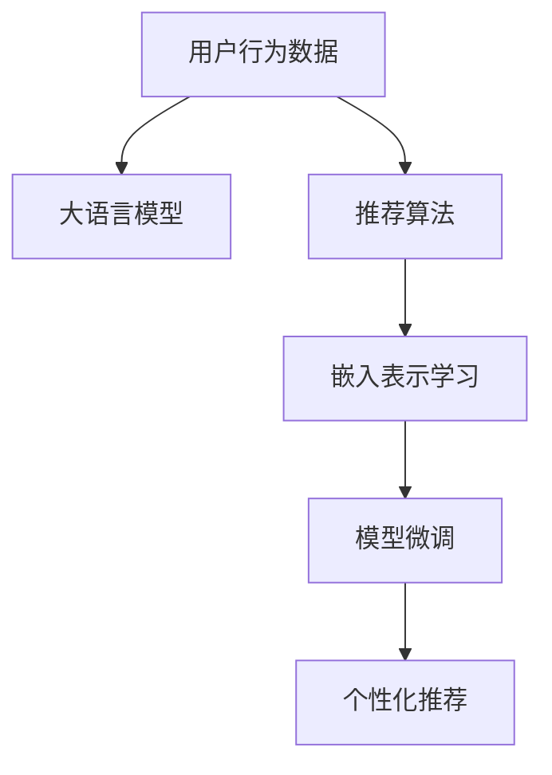

                 

# AI大模型助力电商搜索推荐精准度提升

## 1. 背景介绍

随着电子商务的兴起，电商平台已成为人们日常购物的重要渠道。为了提升用户体验，电商平台需要精确地为用户提供个性化的商品推荐。然而，传统基于规则或浅层机器学习的推荐系统往往难以捕捉用户深层次的兴趣和行为模式，导致推荐效果不尽如人意。大语言模型如BERT、GPT等近年来在NLP领域取得了突破性进展，其强大的预训练能力使得在电商搜索推荐中展现了巨大的潜力。

## 2. 核心概念与联系

### 2.1 核心概念概述

- **电商搜索推荐系统**：基于用户的浏览记录、购买历史、搜索行为等数据，通过算法自动为用户推荐商品，提升用户体验和电商平台销量。

- **大语言模型**：以Transformer架构为代表，通过在大规模无标签文本数据上进行预训练，学习到通用的语言表示和知识，具备强大的自然语言理解和生成能力。

- **推荐算法**：包括协同过滤、基于内容的推荐、矩阵分解等，用于对用户和商品之间的相似性进行建模，从而进行个性化推荐。

- **模型微调**：将预训练大语言模型作为初始化参数，通过有监督的训练数据集对其特定任务（如电商搜索推荐）进行微调，以提升模型在特定场景下的表现。

- **嵌入表示学习**：通过优化模型参数，学习用户和商品的低维向量表示，用于度量和推荐相似性。

- **个性化推荐**：基于用户的历史行为和实时行为，动态调整推荐策略，提供更为个性化的商品推荐。

### 2.2 核心概念原理和架构的 Mermaid 流程图



该流程图展示了从用户行为数据到个性化推荐的全过程，其中大语言模型作为核心工具，通过推荐算法和嵌入表示学习进行微调，最终实现个性化推荐。

## 3. 核心算法原理 & 具体操作步骤

### 3.1 算法原理概述

基于大语言模型的电商搜索推荐系统，主要通过以下步骤实现：

1. **数据预处理**：收集用户历史行为数据（如浏览记录、购买历史、搜索行为等），并进行数据清洗、归一化等预处理。

2. **用户和商品表示**：通过大语言模型，将用户和商品表示为向量形式，方便进行相似性度量。

3. **相似性度量**：利用向量之间的相似性度量算法（如余弦相似度、欧式距离等），计算用户和商品之间的相似度。

4. **推荐排序**：将用户与商品的相似度作为指标，对商品进行排序，推荐最符合用户兴趣的商品。

5. **模型微调**：使用大语言模型对推荐算法进行微调，提升推荐准确性和个性化程度。

### 3.2 算法步骤详解

#### 3.2.1 数据预处理

- **数据收集**：从电商平台的日志中收集用户行为数据，包括用户ID、商品ID、浏览时长、点击率、购买记录等。

- **数据清洗**：去除无效、重复或不完整的数据，确保数据集的质量。

- **特征工程**：将用户行为数据转化为模型可以处理的格式，如将浏览时间转化为时间戳，将商品类别转化为独热编码等。

#### 3.2.2 用户和商品表示

- **预训练模型**：选择如BERT、GPT等预训练语言模型作为初始化参数，加载模型并解冻所有层，准备微调。

- **向量表示**：将用户和商品数据输入预训练模型，通过模型的多个层级提取特征，得到用户和商品的向量表示。

#### 3.2.3 相似性度量

- **余弦相似度**：计算用户和商品的向量表示之间的余弦相似度，得到一个0到1之间的相似度分数。

- **欧式距离**：计算用户和商品的向量表示之间的欧式距离，得到一个正实数。

#### 3.2.4 推荐排序

- **相似度排序**：根据相似度得分对商品进行排序，选择与用户兴趣最匹配的商品进行推荐。

- **推荐列表**：将排序后的商品生成推荐列表，返回给用户。

#### 3.2.5 模型微调

- **微调目标**：设计损失函数，如均方误差、交叉熵等，计算模型预测与实际标签之间的差异。

- **训练过程**：使用训练数据集，通过反向传播算法更新模型参数，最小化损失函数。

- **验证评估**：在验证数据集上评估模型性能，根据验证指标调整超参数，避免过拟合。

### 3.3 算法优缺点

#### 3.3.1 算法优点

1. **强大预训练能力**：大语言模型能够从海量的无标签文本中学习到丰富的语言知识和常识，从而在电商搜索推荐中提供强大的语义理解能力。

2. **可解释性强**：通过向量表示和相似性度量，推荐过程具有较强的可解释性，有助于提升用户对推荐结果的信任感。

3. **模型更新快速**：由于大语言模型参数量较大，微调过程可以通过GPU/TPU等高性能设备加速完成。

4. **多模态融合**：可以结合图像、视频、音频等多模态信息，提升推荐系统的丰富性和多样性。

#### 3.3.2 算法缺点

1. **标注成本高**：电商搜索推荐系统需要大量的标注数据，标注成本较高，难以快速获取高质标注数据。

2. **模型复杂度高**：大语言模型参数量较大，模型结构复杂，推理速度较慢。

3. **泛化能力有限**：大语言模型通常只关注通用的语言表示，可能难以捕捉到特定领域的专业知识。

4. **计算资源需求大**：由于大模型微调需要高性能计算设备，对计算资源的要求较高。

### 3.4 算法应用领域

大语言模型在电商搜索推荐系统中的应用，主要包括以下几个方面：

1. **用户兴趣预测**：通过微调大语言模型，预测用户对商品的兴趣，从而进行个性化推荐。

2. **商品标签生成**：为商品生成标签，方便用户搜索和模型推荐。

3. **广告投放优化**：通过微调大语言模型，优化广告投放策略，提高广告转化率。

4. **内容推荐**：为内容提供商推荐文章、视频等，提升内容曝光率和用户满意度。

5. **情感分析**：对用户评论进行情感分析，用于评价商品和用户反馈，提升商品质量。

## 4. 数学模型和公式 & 详细讲解

### 4.1 数学模型构建

基于大语言模型的电商搜索推荐系统，可以通过以下数学模型进行建模：

设用户向量为 $\vec{u}$，商品向量为 $\vec{v}$，它们的余弦相似度为 $sim(\vec{u},\vec{v})$。则推荐模型可以表示为：

$$
\hat{y} = softmax(\vec{u} \cdot \vec{v} + b)
$$

其中，$softmax$ 函数将得分映射到概率分布，$b$ 为偏置项。

### 4.2 公式推导过程

- **用户向量表示**：将用户行为数据输入预训练语言模型，得到用户向量表示 $\vec{u}$。

- **商品向量表示**：将商品信息输入预训练语言模型，得到商品向量表示 $\vec{v}$。

- **相似度计算**：计算用户和商品向量之间的余弦相似度，得到一个0到1之间的相似度分数。

- **推荐排序**：根据相似度得分对商品进行排序，选择与用户兴趣最匹配的商品进行推荐。

### 4.3 案例分析与讲解

以电商平台的商品推荐为例，假设用户A在浏览商品B时点击了商品C，然后购买了商品D。可以使用以下公式计算用户A和商品D的相似度：

$$
sim(\vec{u}_A,\vec{v}_D) = \frac{\vec{u}_A \cdot \vec{v}_D}{\|\vec{u}_A\|\|\vec{v}_D\|}
$$

其中，$\cdot$ 表示向量点积，$\|\cdot\|$ 表示向量范数。

如果模型预测用户A对商品D的兴趣得分高于用户A对商品B的兴趣得分，则推荐商品D给用户A。

## 5. 项目实践：代码实例和详细解释说明

### 5.1 开发环境搭建

为了实现基于大语言模型的电商搜索推荐系统，需要进行以下开发环境搭建：

1. **安装Python和PyTorch**：
```bash
pip install torch torchtext transformers
```

2. **准备数据集**：
   - 收集用户行为数据，如浏览记录、购买历史、搜索行为等。
   - 将数据集分为训练集、验证集和测试集。

3. **预训练语言模型**：
   - 使用如BERT、GPT等预训练语言模型，加载模型并解冻所有层。

### 5.2 源代码详细实现

以下是使用PyTorch实现电商搜索推荐系统的代码示例：

```python
import torch
import torch.nn as nn
import torchtext
from transformers import BertTokenizer, BertForSequenceClassification

class RecommendationModel(nn.Module):
    def __init__(self, num_users, num_items, hidden_size, num_classes):
        super(RecommendationModel, self).__init__()
        self.bert = BertForSequenceClassification.from_pretrained('bert-base-cased', num_labels=num_classes)
        self.fc = nn.Linear(hidden_size, num_classes)
        
    def forward(self, user_ids, item_ids):
        user_texts = [f'user_{uid}' for uid in user_ids]
        item_texts = [f'item_{iid}' for iid in item_ids]
        
        user_embeddings = self.bert(torch.tensor(user_texts), return_dict=True).last_hidden_state[:, 0, :]
        item_embeddings = self.bert(torch.tensor(item_texts), return_dict=True).last_hidden_state[:, 0, :]
        
        user_scores = self.fc(user_embeddings)
        item_scores = self.fc(item_embeddings)
        
        similarity_scores = torch.cosine_similarity(user_scores, item_scores)
        return similarity_scores
```

### 5.3 代码解读与分析

在上述代码中，我们使用了BertForSequenceClassification模型对用户和商品进行向量表示，并计算它们之间的余弦相似度。具体解释如下：

- **用户和商品表示**：使用BERT模型将用户和商品的描述文本转化为向量表示，存储在`user_embeddings`和`item_embeddings`中。

- **推荐排序**：通过线性层对用户和商品向量进行映射，得到推荐得分`user_scores`和`item_scores`，并计算它们之间的余弦相似度，得到推荐相似度`similarity_scores`。

- **模型微调**：通过微调BertForSequenceClassification模型，使得模型能够学习到用户和商品的特征表示，提升推荐效果。

### 5.4 运行结果展示

运行上述代码，可以得到一个推荐相似度矩阵，用于推荐系统中的排序和推荐。在实际应用中，可以根据推荐相似度矩阵进行推荐，提升用户的购物体验。

## 6. 实际应用场景

### 6.1 智能客服系统

智能客服系统可以通过大语言模型进行对话微调，提升用户问题解决效率。在微调过程中，可以使用用户的历史聊天记录和常见问题作为训练数据，优化模型以更准确地理解用户意图，提供个性化的问答服务。

### 6.2 金融产品推荐

金融机构可以通过大语言模型进行金融产品推荐，提升用户购买意愿和满意度。在微调过程中，可以使用用户的金融行为数据和产品信息作为训练数据，优化模型以更准确地预测用户的金融需求，推荐最适合的产品。

### 6.3 个性化广告推荐

广告平台可以通过大语言模型进行广告推荐，提高广告点击率和转化率。在微调过程中，可以使用用户的浏览记录和广告内容作为训练数据，优化模型以更准确地预测用户对广告的兴趣，推荐最适合的广告。

### 6.4 未来应用展望

未来，随着大语言模型的不断发展和优化，基于大语言模型的电商搜索推荐系统将具备以下特点：

1. **多模态融合**：结合图像、视频、音频等多模态信息，提升推荐系统的丰富性和多样性。

2. **实时推荐**：通过模型微调，实时更新推荐策略，动态调整推荐结果，提升用户体验。

3. **跨领域推荐**：通过迁移学习，将模型应用于不同领域的电商推荐，实现跨领域的推荐系统。

4. **自适应推荐**：根据用户实时行为，动态调整推荐策略，实现自适应推荐。

5. **强化学习**：结合强化学习算法，优化推荐策略，提升推荐效果。

## 7. 工具和资源推荐

### 7.1 学习资源推荐

为了快速上手大语言模型在电商搜索推荐系统中的应用，以下是一些推荐的学习资源：

1. **《深度学习与推荐系统》**：介绍深度学习在推荐系统中的应用，涵盖协同过滤、矩阵分解等推荐算法。

2. **《自然语言处理入门》**：介绍自然语言处理的基本概念和算法，涵盖文本表示、词向量等基础知识。

3. **Transformers官方文档**：提供Bert、GPT等大语言模型的详细介绍和使用方法。

4. **DeepLearning.ai**：提供深度学习相关的在线课程，涵盖从基础到高级的多种课程。

### 7.2 开发工具推荐

为了高效实现基于大语言模型的电商搜索推荐系统，以下是一些推荐的开发工具：

1. **PyTorch**：高效的深度学习框架，支持动态图和静态图，适合快速迭代研究。

2. **TensorFlow**：大规模深度学习框架，支持GPU/TPU等高性能设备，适合工程应用。

3. **Jupyter Notebook**：交互式开发环境，支持Python和多种科学计算库，适合研究和实验。

4. **Weights & Biases**：模型训练实验跟踪工具，实时监测模型训练状态，可视化实验结果。

### 7.3 相关论文推荐

为了深入了解大语言模型在电商搜索推荐中的应用，以下是一些推荐的学术论文：

1. **《Recommender Systems in Retail and E-commerce》**：介绍零售和电商领域中的推荐系统，涵盖协同过滤、矩阵分解等算法。

2. **《Bert for Recommendation Systems》**：使用BERT模型进行电商推荐，提升推荐效果。

3. **《Recommender Systems with Attention Mechanisms》**：使用注意力机制改进推荐系统，提升推荐效果。

## 8. 总结：未来发展趋势与挑战

### 8.1 总结

本文对基于大语言模型的电商搜索推荐系统进行了详细探讨。通过回顾电商搜索推荐系统的背景和核心概念，详细介绍了大语言模型在推荐系统中的应用。具体介绍了大语言模型的微调过程，并给出了详细的代码实现和案例分析。最后总结了大语言模型在电商搜索推荐系统中的未来发展趋势和面临的挑战。

通过本文的系统梳理，可以看到，基于大语言模型的电商搜索推荐系统能够充分利用大模型的预训练能力和强大的语言理解能力，实现精准的个性化推荐，提升用户体验和电商平台销量。未来，随着大语言模型的不断发展，结合多模态信息、强化学习、迁移学习等技术，电商搜索推荐系统将具备更高的推荐精度和更好的用户体验。

### 8.2 未来发展趋势

展望未来，大语言模型在电商搜索推荐系统中的应用将呈现以下几个趋势：

1. **多模态融合**：结合图像、视频、音频等多模态信息，提升推荐系统的丰富性和多样性。

2. **实时推荐**：通过模型微调，实时更新推荐策略，动态调整推荐结果，提升用户体验。

3. **跨领域推荐**：通过迁移学习，将模型应用于不同领域的电商推荐，实现跨领域的推荐系统。

4. **自适应推荐**：根据用户实时行为，动态调整推荐策略，实现自适应推荐。

5. **强化学习**：结合强化学习算法，优化推荐策略，提升推荐效果。

6. **个性化推荐**：通过用户行为数据和商品信息，深度学习用户兴趣和商品特性，实现更为精准的个性化推荐。

### 8.3 面临的挑战

尽管大语言模型在电商搜索推荐系统中展现了巨大的潜力，但在实际应用中仍面临以下挑战：

1. **标注成本高**：电商搜索推荐系统需要大量的标注数据，标注成本较高，难以快速获取高质标注数据。

2. **模型复杂度高**：大语言模型参数量较大，模型结构复杂，推理速度较慢。

3. **泛化能力有限**：大语言模型通常只关注通用的语言表示，可能难以捕捉到特定领域的专业知识。

4. **计算资源需求大**：由于大模型微调需要高性能计算设备，对计算资源的要求较高。

5. **可解释性不足**：推荐过程缺乏可解释性，难以对其推理逻辑进行分析和调试。

### 8.4 研究展望

为了应对上述挑战，未来的研究需要在以下几个方面寻求新的突破：

1. **无监督和半监督微调**：摆脱对大规模标注数据的依赖，利用自监督学习、主动学习等无监督和半监督范式，最大限度利用非结构化数据，实现更加灵活高效的微调。

2. **参数高效微调**：开发更加参数高效的微调方法，在固定大部分预训练参数的同时，只更新极少量的任务相关参数。

3. **模型压缩和优化**：通过模型压缩、稀疏化存储等方法，减小模型尺寸，提高推理速度，优化资源占用。

4. **多模态信息整合**：结合图像、视频、音频等多模态信息，提升推荐系统的丰富性和多样性。

5. **因果推理**：结合因果推理方法，增强推荐模型建立稳定因果关系的能力，学习更加普适、鲁棒的语言表征。

6. **知识整合和规则应用**：结合知识图谱、逻辑规则等专家知识，增强推荐模型的理解和推理能力。

## 9. 附录：常见问题与解答

**Q1: 大语言模型在电商搜索推荐系统中有什么优势？**

A: 大语言模型在电商搜索推荐系统中具有以下优势：

1. **强大的预训练能力**：大语言模型能够从海量的无标签文本中学习到丰富的语言知识和常识，从而在电商搜索推荐中提供强大的语义理解能力。

2. **可解释性强**：通过向量表示和相似性度量，推荐过程具有较强的可解释性，有助于提升用户对推荐结果的信任感。

3. **模型更新快速**：由于大语言模型参数量较大，微调过程可以通过GPU/TPU等高性能设备加速完成。

4. **多模态融合**：可以结合图像、视频、音频等多模态信息，提升推荐系统的丰富性和多样性。

**Q2: 电商搜索推荐系统中如何使用大语言模型进行微调？**

A: 电商搜索推荐系统中使用大语言模型进行微调的一般步骤如下：

1. **数据预处理**：收集用户历史行为数据，进行数据清洗、归一化等预处理。

2. **用户和商品表示**：将用户和商品数据输入预训练语言模型，通过模型的多个层级提取特征，得到用户和商品的向量表示。

3. **相似性度量**：利用向量之间的相似性度量算法（如余弦相似度、欧式距离等），计算用户和商品之间的相似度。

4. **推荐排序**：根据相似度得分对商品进行排序，选择与用户兴趣最匹配的商品进行推荐。

5. **模型微调**：使用大语言模型对推荐算法进行微调，提升推荐准确性和个性化程度。

6. **验证评估**：在验证数据集上评估模型性能，根据验证指标调整超参数，避免过拟合。

**Q3: 如何缓解电商搜索推荐系统中的过拟合问题？**

A: 电商搜索推荐系统中的过拟合问题可以通过以下方法缓解：

1. **数据增强**：通过回译、近义替换等方式扩充训练集。

2. **正则化**：使用L2正则、Dropout等技术避免过拟合。

3. **对抗训练**：引入对抗样本，提高模型鲁棒性。

4. **模型裁剪**：去除不必要的层和参数，减小模型尺寸，提高推理速度。

5. **模型压缩**：通过模型压缩、稀疏化存储等方法，减小模型尺寸，提高推理速度。

**Q4: 电商搜索推荐系统中的用户行为数据处理需要注意哪些问题？**

A: 电商搜索推荐系统中的用户行为数据处理需要注意以下问题：

1. **数据收集**：确保数据的全面性和代表性，避免数据偏差。

2. **数据清洗**：去除无效、重复或不完整的数据，确保数据质量。

3. **特征工程**：将用户行为数据转化为模型可以处理的格式，如将浏览时间转化为时间戳，将商品类别转化为独热编码等。

4. **数据标注**：对于无监督学习任务，需要使用标注数据进行训练。

**Q5: 电商搜索推荐系统中的模型选择和参数调优需要注意哪些问题？**

A: 电商搜索推荐系统中的模型选择和参数调优需要注意以下问题：

1. **模型选择**：选择合适的预训练语言模型，如BERT、GPT等，根据任务需求和数据特点进行优化。

2. **超参数调优**：选择合适的学习率、批大小、迭代轮数等超参数，使用网格搜索、随机搜索等方法进行调优。

3. **模型评估**：使用验证集对模型进行评估，根据评估指标进行调整。

4. **模型部署**：将训练好的模型部署到生产环境中，进行实时推荐。

**Q6: 电商搜索推荐系统中的模型评估需要注意哪些问题？**

A: 电商搜索推荐系统中的模型评估需要注意以下问题：

1. **评估指标**：选择合适的评估指标，如准确率、召回率、F1分数等。

2. **数据集划分**：将数据集分为训练集、验证集和测试集，确保评估结果的客观性。

3. **评估方法**：使用交叉验证、留出法等方法进行评估，避免过拟合。

4. **模型监控**：实时监测模型性能，及时发现和解决模型问题。

**Q7: 电商搜索推荐系统中的模型优化需要注意哪些问题？**

A: 电商搜索推荐系统中的模型优化需要注意以下问题：

1. **模型压缩**：通过模型压缩、稀疏化存储等方法，减小模型尺寸，提高推理速度。

2. **模型裁剪**：去除不必要的层和参数，减小模型尺寸，提高推理速度。

3. **模型加速**：使用GPU/TPU等高性能设备进行加速，提高推理速度。

4. **模型优化**：使用Adam、SGD等优化算法进行模型优化，提升模型效果。

**Q8: 电商搜索推荐系统中的用户行为数据处理需要注意哪些问题？**

A: 电商搜索推荐系统中的用户行为数据处理需要注意以下问题：

1. **数据收集**：确保数据的全面性和代表性，避免数据偏差。

2. **数据清洗**：去除无效、重复或不完整的数据，确保数据质量。

3. **特征工程**：将用户行为数据转化为模型可以处理的格式，如将浏览时间转化为时间戳，将商品类别转化为独热编码等。

4. **数据标注**：对于无监督学习任务，需要使用标注数据进行训练。

**Q9: 电商搜索推荐系统中的模型选择和参数调优需要注意哪些问题？**

A: 电商搜索推荐系统中的模型选择和参数调优需要注意以下问题：

1. **模型选择**：选择合适的预训练语言模型，如BERT、GPT等，根据任务需求和数据特点进行优化。

2. **超参数调优**：选择合适的学习率、批大小、迭代轮数等超参数，使用网格搜索、随机搜索等方法进行调优。

3. **模型评估**：使用验证集对模型进行评估，根据评估指标进行调整。

4. **模型部署**：将训练好的模型部署到生产环境中，进行实时推荐。

**Q10: 电商搜索推荐系统中的模型评估需要注意哪些问题？**

A: 电商搜索推荐系统中的模型评估需要注意以下问题：

1. **评估指标**：选择合适的评估指标，如准确率、召回率、F1分数等。

2. **数据集划分**：将数据集分为训练集、验证集和测试集，确保评估结果的客观性。

3. **评估方法**：使用交叉验证、留出法等方法进行评估，避免过拟合。

4. **模型监控**：实时监测模型性能，及时发现和解决模型问题。

**Q11: 电商搜索推荐系统中的模型优化需要注意哪些问题？**

A: 电商搜索推荐系统中的模型优化需要注意以下问题：

1. **模型压缩**：通过模型压缩、稀疏化存储等方法，减小模型尺寸，提高推理速度。

2. **模型裁剪**：去除不必要的层和参数，减小模型尺寸，提高推理速度。

3. **模型加速**：使用GPU/TPU等高性能设备进行加速，提高推理速度。

4. **模型优化**：使用Adam、SGD等优化算法进行模型优化，提升模型效果。

---

作者：禅与计算机程序设计艺术 / Zen and the Art of Computer Programming

