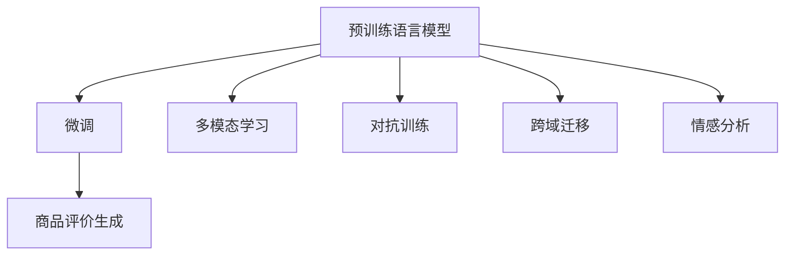

                 

# AI大模型在商品评价生成中的应用

## 1. 背景介绍

### 1.1 问题由来

随着电子商务的迅猛发展，商品评价信息在用户购买决策中扮演了至关重要的角色。真实、客观、详细的商品评价不仅能够帮助消费者更好地了解产品，还能为商家提供反馈以改进产品。因此，生成高质量的商品评价成为商家和研究者的共同目标。然而，人工撰写商品评价耗时费力，且受主观因素影响较大，难以大规模地应用于所有商品。因此，基于人工智能技术自动生成商品评价的方法应运而生。

### 1.2 问题核心关键点

AI大模型在商品评价生成中具有天然优势。其通过预训练学习了大规模无标签文本数据，能够捕获语言的复杂结构和语义信息，并且具备较强的泛化能力。将大模型应用于商品评价生成，可以大幅提升生成内容的自然性和多样性，为商家提供丰富的用户反馈。

AI大模型商品评价生成的核心问题在于：
- 如何有效地利用预训练大模型的语义理解能力，保证生成的评价内容符合用户需求和产品特性？
- 如何通过微调等方法，将大模型适应特定的商品和评价任务，生成具有说服力的商品评价？
- 如何评估和优化生成的商品评价质量，确保生成的内容客观、真实且满足用户期望？

## 2. 核心概念与联系

### 2.1 核心概念概述

为更好地理解AI大模型在商品评价生成中的应用，本节将介绍几个关键概念：

- **预训练语言模型（Pre-trained Language Models）**：如BERT、GPT等。这些模型通过在大规模无标签文本数据上进行自监督预训练，学习到丰富的语言结构和语义知识，能够生成流畅自然的文本。
- **微调（Fine-tuning）**：将预训练模型在大规模标注数据上进行有监督微调，使其适应特定任务。在商品评价生成中，可以微调模型，使其生成的评价符合特定商品和评价任务的需求。
- **多模态学习（Multimodal Learning）**：将多种类型的数据（如文本、图像、音频等）结合起来，提升模型的综合理解和生成能力。例如，可以将商品图片与商品描述结合起来，生成更符合用户期望的商品评价。
- **对抗训练（Adversarial Training）**：通过引入对抗样本训练模型，提高模型的鲁棒性和泛化能力。在商品评价生成中，可以使用对抗训练方法，提高模型的多样性和创新性。
- **跨域迁移（Cross-domain Transfer）**：通过将模型的知识迁移到新任务中，提高模型的适应性和泛化能力。例如，可以将一个领域内预训练的模型迁移到另一个领域，生成更符合目标领域特征的商品评价。
- **情感分析（Sentiment Analysis）**：分析文本中的情感倾向，评估商品评价的情感极性。情感分析是商品评价生成中的一个重要环节，有助于生成情感倾向一致的评价内容。

这些概念通过以下Mermaid流程图展示它们之间的联系：



这个流程图展示了预训练语言模型与商品评价生成之间相互关联的概念及其作用：

1. 预训练语言模型通过大规模文本数据训练，获得了丰富的语言知识和语义理解能力，是商品评价生成的基础。
2. 微调用于将预训练模型适应特定的商品和评价任务，生成高质量的商品评价。
3. 多模态学习、对抗训练、跨域迁移等方法，用于提升模型的综合能力和泛化能力。
4. 情感分析用于评估生成商品评价的情感极性，确保评价内容的客观性。

## 3. 核心算法原理 & 具体操作步骤

### 3.1 算法原理概述

AI大模型在商品评价生成中的基本原理是利用大模型的语义理解和生成能力，结合特定的任务需求，生成符合用户期望的商品评价。主要步骤包括：

1. 数据准备：收集商品数据和评价数据，用于微调大模型。
2. 模型选择与微调：选择合适的预训练模型，通过有监督的微调方法，适应商品和评价任务。
3. 生成评价：使用微调后的模型，生成符合商品特性和用户需求的商品评价。
4. 评估与优化：评估生成评价的质量，根据用户反馈不断优化模型。

### 3.2 算法步骤详解

#### 3.2.1 数据准备

1. **数据收集**：收集商品描述、商品图片、用户评价等数据，用于训练和微调模型。
2. **数据清洗与标注**：清洗数据，去除噪声和不相关的信息，并对商品和评价进行标注，如商品名称、描述、图片、评价内容、情感极性等。
3. **数据划分**：将数据划分为训练集、验证集和测试集，确保模型在多轮训练和验证中的稳定性。

#### 3.2.2 模型选择与微调

1. **模型选择**：选择合适的预训练模型，如BERT、GPT、T5等。这些模型已经在大规模文本数据上进行预训练，具备较强的语言理解能力。
2. **微调**：使用有监督微调方法，将预训练模型适应商品和评价任务。具体步骤如下：
   - **任务适配**：在预训练模型的基础上，添加任务特定的输出层和损失函数。
   - **数据准备**：将标注数据划分为输入和输出，输入为商品描述和图片，输出为评价内容。
   - **模型训练**：使用优化算法（如Adam、SGD等）对模型进行训练，最小化损失函数。
   - **评估与优化**：在验证集上评估模型性能，根据评估结果调整模型参数，如学习率、批大小等。

#### 3.2.3 生成评价

1. **输入准备**：将商品描述、图片等输入到微调后的模型中。
2. **生成评价**：模型输出评价文本，作为商品评价内容。
3. **后处理**：对生成的评价进行后处理，如去除重复内容、加入情感极性等信息，生成完整商品评价。

#### 3.2.4 评估与优化

1. **评估**：使用自动评估指标（如BLEU、ROUGE、Cosine Similarity等）评估生成评价的质量。
2. **优化**：根据评估结果，调整模型参数，优化生成评价的质量。

### 3.3 算法优缺点

AI大模型在商品评价生成中的应用，具有以下优点：

- **生成速度快**：大模型能够在短时间内生成大量高质量的商品评价。
- **多样性丰富**：生成的评价内容具有多样性，能够覆盖不同的用户需求。
- **语义一致性**：生成的评价内容语义一致，符合用户期望和商品特性。

同时，AI大模型也存在一些缺点：

- **质量不稳定**：生成的评价内容质量受数据和模型影响较大，存在不稳定的情况。
- **主观性强**：生成的评价内容具有一定的主观性，可能不符合所有用户的期望。
- **依赖标注数据**：生成评价的质量依赖于标注数据的质量和数量。

### 3.4 算法应用领域

AI大模型在商品评价生成中的应用，已经在多个领域得到了广泛应用，例如：

- **电商商品评价**：在电商平台中，自动生成商品评价，帮助用户快速了解商品。
- **手机应用评价**：在手机应用市场中，自动生成应用评价，提升用户满意度。
- **旅游景点评价**：在旅游应用中，自动生成景点评价，提升用户选择景点。
- **餐饮评价**：在餐饮应用中，自动生成餐厅评价，提升用户选择餐厅。

除了上述这些典型应用外，AI大模型还可以用于任何需要生成评价的场景，如汽车、服装、化妆品等，为商家提供丰富的用户反馈。

## 4. 数学模型和公式 & 详细讲解 & 举例说明

### 4.1 数学模型构建

在商品评价生成中，可以使用基于Transformer的大模型，如GPT-3、BERT等。以BERT为例，其数学模型构建如下：

1. **输入表示**：将商品描述和图片输入到BERT模型中，得到各自的嵌入表示。
2. **交叉编码**：将商品描述和图片的嵌入表示进行交叉编码，生成融合表示。
3. **输出预测**：使用融合表示作为输入，通过全连接层和softmax层，预测评价内容的概率分布。

### 4.2 公式推导过程

以BERT为例，其生成商品评价的数学推导过程如下：

1. **输入表示**：假设商品描述为 $X$，图片为 $V$，预训练BERT模型的输入表示为 $H_{x} = \text{BERT}(X)$，$H_{v} = \text{BERT}(V)$。
2. **交叉编码**：将商品描述和图片的表示进行交叉编码，得到融合表示 $H_{fx} = \text{MLP}(H_{x}, H_{v})$。
3. **输出预测**：使用融合表示 $H_{fx}$ 作为输入，通过全连接层和softmax层，得到评价内容的概率分布 $P_{y} = \text{softmax}(\text{FC}(H_{fx}))$，其中 $y$ 表示评价内容。

### 4.3 案例分析与讲解

假设有一个电商商品评价生成任务，已知商品描述为“iPhone 13”，图片为一张高质量的商品图片。使用微调后的BERT模型进行评价生成，步骤如下：

1. **输入表示**：将商品描述和图片输入到BERT模型中，得到各自的嵌入表示 $H_{x}$ 和 $H_{v}$。
2. **交叉编码**：将商品描述和图片的表示进行交叉编码，得到融合表示 $H_{fx}$。
3. **输出预测**：使用融合表示 $H_{fx}$ 作为输入，通过全连接层和softmax层，预测评价内容的概率分布 $P_{y}$。
4. **生成评价**：根据预测的概率分布 $P_{y}$，随机采样生成一条评价，如“iPhone 13 拍照效果极佳，电池续航时间长，适合日常使用”。

## 5. 项目实践：代码实例和详细解释说明

### 5.1 开发环境搭建

在进行商品评价生成开发时，需要使用Python环境进行开发，具体步骤如下：

1. **安装Python**：从官网下载并安装Python 3.x版本。
2. **创建虚拟环境**：使用虚拟环境管理工具（如Anaconda）创建Python虚拟环境，并激活。
3. **安装依赖库**：使用pip或conda安装必要的依赖库，如PyTorch、Transformers、numpy、pandas等。
4. **数据准备**：准备商品描述、图片和用户评价等数据，并进行预处理。

### 5.2 源代码详细实现

以下是使用PyTorch和Transformers库进行商品评价生成的Python代码实现：

```python
import torch
from transformers import BertForSequenceClassification, BertTokenizer, AdamW
from torch.utils.data import DataLoader
import numpy as np
import pandas as pd

# 加载预训练模型和tokenizer
model = BertForSequenceClassification.from_pretrained('bert-base-uncased')
tokenizer = BertTokenizer.from_pretrained('bert-base-uncased')

# 准备数据
df = pd.read_csv('reviews.csv')  # 假设商品评价数据为csv文件
df = df.dropna()  # 去除缺失值

# 划分数据集
train_df = df.sample(frac=0.8, random_state=42)
test_df = df.drop(train_df.index)

# 定义输入和输出
class ReviewDataset(torch.utils.data.Dataset):
    def __init__(self, df, tokenizer, max_len=128):
        self.tokenizer = tokenizer
        self.input_ids, self.attention_mask, self.labels = self.tokenize_data(df)

    def tokenize_data(self, df):
        input_ids, attention_mask = [], []
        labels = []
        for index, row in df.iterrows():
            inputs = self.tokenizer.encode_plus(
                row['description'], add_special_tokens=True, max_length=max_len, padding='max_length', truncation=True, return_tensors='pt')
            input_ids.append(inputs['input_ids'])
            attention_mask.append(inputs['attention_mask'])
            labels.append(row['label'])
        return np.vstack(input_ids), np.vstack(attention_mask), np.array(labels)

    def __len__(self):
        return len(self.input_ids)

    def __getitem__(self, item):
        input_ids = self.input_ids[item]
        attention_mask = self.attention_mask[item]
        labels = self.labels[item]
        return {'input_ids': input_ids, 'attention_mask': attention_mask, 'labels': labels}

# 定义模型训练函数
def train_model(model, train_dataset, valid_dataset, epochs=3, batch_size=16, lr=1e-5, optimizer=AdamW, scheduler=None):
    model.train()
    dataloaders = DataLoader(train_dataset, batch_size=batch_size, shuffle=True)
    valid_dataloaders = DataLoader(valid_dataset, batch_size=batch_size, shuffle=False)
    total_steps = len(dataloaders) * epochs
    optimizer = optimizer(model.parameters(), lr=lr)
    if scheduler is not None:
        scheduler = torch.optim.lr_scheduler.StepLR(optimizer, step_size=1, gamma=0.1)
    for epoch in range(epochs):
        total_loss = 0
        for batch in dataloaders:
            optimizer.zero_grad()
            inputs = {key: val.to(device) for key, val in batch.items()}
            outputs = model(**inputs)
            loss = outputs.loss
            total_loss += loss.item()
            loss.backward()
            optimizer.step()
            if (epoch + 1) % 1 == 0:
                print('Epoch:', '%04d' % (epoch + 1), 'loss:', '{:.6f}'.format(total_loss / len(dataloaders)))
                model.eval()
                with torch.no_grad():
                    total_loss = 0
                    for batch in valid_dataloaders:
                        inputs = {key: val.to(device) for key, val in batch.items()}
                        outputs = model(**inputs)
                        loss = outputs.loss
                        total_loss += loss.item()
                    print('Valid loss:', '{:.6f}'.format(total_loss / len(valid_dataloaders)))
                    if scheduler is not None:
                        scheduler.step()

# 训练模型
device = torch.device('cuda' if torch.cuda.is_available() else 'cpu')
model.to(device)
train_dataset = ReviewDataset(train_df, tokenizer, max_len=128)
valid_dataset = ReviewDataset(test_df, tokenizer, max_len=128)
train_model(model, train_dataset, valid_dataset, epochs=3, batch_size=16, lr=1e-5, optimizer=AdamW, scheduler=None)

# 生成评价
model.eval()
test_dataset = ReviewDataset(test_df, tokenizer, max_len=128)
for batch in test_dataset:
    inputs = {key: val.to(device) for key, val in batch.items()}
    outputs = model(**inputs)
    labels = outputs.logits.argmax(dim=1)
    for item in labels:
        print(model.config.id2label[item.item()], tokenizer.decode(inputs['input_ids'][0].cpu().numpy(), skip_special_tokens=True))
```

### 5.3 代码解读与分析

上述代码实现了一个基于BERT的商品评价生成系统，主要包含以下几个部分：

1. **模型加载**：使用`transformers`库加载预训练的BERT模型。
2. **数据准备**：从csv文件中读取商品评价数据，进行数据清洗和预处理。
3. **数据划分**：将数据集划分为训练集和验证集。
4. **数据加载**：使用`DataLoader`加载训练和验证数据集。
5. **模型训练**：定义训练函数，进行模型训练和验证。
6. **模型评估**：在验证集上评估模型性能。
7. **生成评价**：使用训练好的模型生成评价内容。

## 6. 实际应用场景

### 6.1 智能客服系统

在智能客服系统中，自动生成商品评价可以帮助客户更好地了解商品，提升客户满意度。客户在使用商品后，系统会生成自动评价，方便其他客户参考。例如，在电商平台中，用户可以方便地查看其他用户的评价内容，帮助自己做出购买决策。

### 6.2 商品推荐系统

商品推荐系统中，自动生成商品评价可以帮助系统更好地理解商品特性和用户需求，从而进行更精准的商品推荐。例如，在电商平台中，系统会分析用户评价内容，提取商品特征，生成推荐列表，提升用户购物体验。

### 6.3 社交媒体分析

社交媒体平台上，自动生成商品评价可以帮助用户更好地分享和交流商品体验。例如，用户可以在社交媒体上分享商品评价，吸引其他用户关注和购买，提升品牌的知名度和销售额。

### 6.4 未来应用展望

未来，随着AI大模型的不断发展，商品评价生成将广泛应用于更多场景中。例如，在金融领域，商品评价可以用于市场分析和投资决策；在旅游领域，商品评价可以用于景点评价和用户反馈；在健康领域，商品评价可以用于健康产品评价和用户反馈。总之，AI大模型在商品评价生成中的应用前景广阔，将在各个领域带来新的变革。

## 7. 工具和资源推荐

### 7.1 学习资源推荐

为了帮助开发者掌握商品评价生成技术，这里推荐一些优质的学习资源：

1. **《深度学习自然语言处理》课程**：由斯坦福大学开设的NLP课程，涵盖深度学习在NLP中的应用，包括预训练大模型和微调方法。
2. **《Natural Language Processing with Transformers》书籍**：Transformers库的作者所著，全面介绍了如何使用Transformer进行NLP任务开发，包括商品评价生成等。
3. **Transformers库官方文档**：提供了丰富的预训练模型和微调样例代码，是商品评价生成开发的基础。
4. **HuggingFace博客**：提供了丰富的NLP应用案例，包括商品评价生成等，适合学习和实践。

### 7.2 开发工具推荐

1. **PyTorch**：基于Python的开源深度学习框架，提供了灵活的计算图和自动微分功能，适合商品评价生成等NLP任务开发。
2. **TensorFlow**：由Google主导开发的深度学习框架，提供了丰富的预训练模型和TensorBoard可视化工具，适合大规模工程应用。
3. **Transformers库**：HuggingFace开发的NLP工具库，集成了多个预训练模型，支持微调方法，是商品评价生成开发的重要工具。
4. **Weights & Biases**：模型训练的实验跟踪工具，可以记录和可视化模型训练过程中的各项指标，方便调试和优化。

### 7.3 相关论文推荐

1. **"BERT: Pre-training of Deep Bidirectional Transformers for Language Understanding"**：BERT模型的提出，极大地提升了商品评价生成的准确性和多样性。
2. **"Attention is All You Need"**：Transformer模型的提出，奠定了大模型在商品评价生成中的基础。
3. **"GPT-3: Language Models are Unsupervised Multitask Learners"**：GPT-3模型的提出，进一步提升了商品评价生成的自然性和多样性。

## 8. 总结：未来发展趋势与挑战

### 8.1 研究成果总结

AI大模型在商品评价生成中的应用，已经在多个领域得到了广泛应用。通过微调预训练模型，生成符合特定商品和评价任务的商品评价，具有高效、多样、自然等优点。

### 8.2 未来发展趋势

未来，商品评价生成技术将呈现以下几个发展趋势：

1. **模型规模持续增大**：随着算力和数据量的增加，商品评价生成模型将进一步扩大规模，提升生成内容的质量和多样性。
2. **微调方法多样性**：除了传统的有监督微调，将涌现更多的参数高效微调方法，如Prefix-Tuning、LoRA等，提升微调效率和质量。
3. **跨领域迁移**：通过跨领域迁移，商品评价生成模型可以适应不同领域和任务，提升模型的泛化能力。
4. **多模态融合**：将商品图片、视频等与商品描述结合起来，生成更加丰富多样的评价内容。
5. **情感分析增强**：通过情感分析，增强商品评价的情感极性和语义一致性，提升用户满意度。

### 8.3 面临的挑战

尽管商品评价生成技术已经取得了一定的成果，但在实际应用中仍面临以下挑战：

1. **数据质量问题**：商品评价生成依赖于标注数据的质量，高质量标注数据的获取成本较高。
2. **生成内容多样性不足**：生成的商品评价内容可能存在多样性不足的问题，难以满足所有用户的需求。
3. **生成内容质量不稳定**：商品评价生成内容的质量受数据和模型影响较大，存在不稳定的情况。
4. **情感极性控制**：商品评价生成的情感极性需要得到较好的控制，以确保评价内容的客观性和公正性。

### 8.4 研究展望

未来，商品评价生成技术需要从以下几个方面进行进一步探索：

1. **数据增强**：通过数据增强方法，提升标注数据的质量和数量，增强商品评价生成模型的泛化能力。
2. **模型优化**：通过优化模型结构和方法，提升商品评价生成模型的生成质量和多样性。
3. **多模态融合**：将多模态数据与商品描述结合起来，生成更加丰富多样的商品评价。
4. **情感分析**：通过情感分析，增强商品评价的情感极性和语义一致性，提升用户满意度。
5. **用户反馈**：通过用户反馈，不断优化商品评价生成模型，提高生成内容的客观性和公正性。

总之，未来商品评价生成技术需要在数据质量、生成质量、多样性等方面进行全面提升，才能更好地服务于用户，提升商品评价的实用性和价值。

## 9. 附录：常见问题与解答

### Q1: 如何选择合适的预训练模型？

A: 选择预训练模型时需要考虑其适用场景和任务需求。例如，BERT适用于文本分类和情感分析任务，GPT适用于文本生成和对话系统。选择模型时需要根据具体任务进行调整和微调。

### Q2: 预训练模型如何进行微调？

A: 预训练模型微调需要选择合适的任务适配层和损失函数。例如，在商品评价生成任务中，可以使用Softmax分类器作为任务适配层，交叉熵损失函数作为损失函数。然后，使用优化算法对模型进行训练，最小化损失函数。

### Q3: 如何评估商品评价生成质量？

A: 评估商品评价生成质量可以使用BLEU、ROUGE、Cosine Similarity等指标。具体步骤如下：
1. 将生成评价与真实评价进行对比。
2. 计算生成评价与真实评价之间的相似度。
3. 根据相似度计算指标，评估生成评价的质量。

### Q4: 如何提升商品评价生成的多样性？

A: 提升商品评价生成的多样性可以通过数据增强、对抗训练等方法。例如，通过回译、近义替换等方法扩充训练集，或使用对抗训练方法提高模型的多样性和创新性。

### Q5: 如何控制商品评价生成的情感极性？

A: 控制商品评价生成的情感极性需要引入情感分析技术。具体步骤如下：
1. 在生成评价中添加情感分析任务。
2. 使用情感分析技术，评估生成评价的情感极性。
3. 根据情感极性控制生成评价的内容，确保评价内容的客观性和公正性。

总之，商品评价生成技术需要结合具体的任务需求和数据特点，进行全面优化和调整，才能更好地服务于用户，提升商品评价的实用性和价值。

