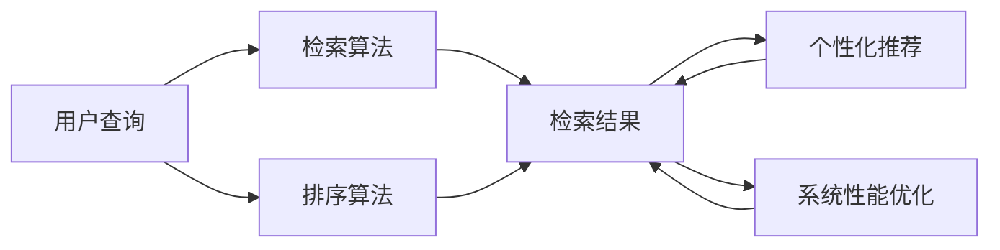

                 

# AI大模型在搜索推荐系统中的应用前景

> 关键词：AI大模型,搜索推荐系统,推荐算法,个性化推荐,检索算法,排序算法,评估指标,深度学习,自然语言处理,NLP

## 1. 背景介绍

### 1.1 问题由来

随着互联网技术的飞速发展，搜索引擎和推荐系统已经成为用户在信息海洋中导航的两大主要工具。这两个系统通过高效的信息检索和智能推荐，极大地提高了用户获取信息的效率，改善了用户体验。然而，传统的搜索引擎和推荐系统仍然存在诸多不足，例如：

- 搜索结果和推荐内容过于泛泛，难以匹配用户的个性化需求。
- 缺少对用户历史行为的深入理解和记忆，导致推荐内容缺乏针对性和时效性。
- 算法复杂度较高，难以在实时场景中高效运行。
- 对于海量数据和高频交互的负载，系统性能容易受到影响。

为了解决这些问题，人工智能（AI）技术在搜索推荐系统中的应用逐渐升温。特别是随着大模型的出现，搜索引擎和推荐系统正在发生深刻变革。AI大模型通过预训练学习和微调，具备强大的表示能力和知识迁移能力，能够在处理海量数据时，取得优于传统推荐算法的表现。本文将全面探讨AI大模型在搜索推荐系统中的应用前景，包括检索算法、排序算法、个性化推荐等方面的进展。

### 1.2 问题核心关键点

AI大模型在搜索推荐系统中的应用，可以归结为以下几个核心关键点：

- **检索算法**：如何高效、精确地检索出符合用户查询需求的相关文档或商品。
- **排序算法**：如何将检索出的文档或商品按照用户偏好进行排序，实现个性化推荐。
- **个性化推荐**：如何综合利用用户历史行为、上下文信息，为用户提供高质量的个性化推荐。
- **系统性能优化**：如何在保证推荐质量的同时，提升系统处理效率，应对高负载环境。

通过解决这些核心问题，AI大模型有望大幅提升搜索推荐系统的性能和用户体验。

## 2. 核心概念与联系

### 2.1 核心概念概述

为了更好地理解AI大模型在搜索推荐系统中的应用，本节将介绍几个关键概念：

- **AI大模型**：以Transformer、BERT等深度学习模型为代表的超大规模预训练语言模型。通过在大规模无标签文本数据上进行预训练，学习通用的语言表示，具备强大的自然语言理解和生成能力。

- **检索算法**：用于快速定位用户查询需求对应的文档或商品的技术，常见的有倒排索引、向量检索、近邻搜索等。

- **排序算法**：根据用户偏好，对检索出的文档或商品进行排序，常见的有基于项的排序、基于用户的排序、混合排序等。

- **个性化推荐**：根据用户历史行为、上下文信息，动态生成个性化推荐结果的技术。

- **系统性能优化**：通过模型压缩、分布式训练、缓存策略等技术，提升搜索推荐系统的处理效率和稳定性。

### 2.2 核心概念原理和架构的 Mermaid 流程图

以下是AI大模型在搜索推荐系统中的工作原理和架构的Mermaid流程图：



这个流程图展示了AI大模型在搜索推荐系统中的主要工作流程：

1. 用户输入查询，经检索算法找到相关文档或商品，生成检索结果。
2. 检索结果通过排序算法，根据用户偏好进行排序。
3. 排序后的结果再经过个性化推荐，进一步提升推荐质量。
4. 推荐结果通过系统性能优化，保证高效稳定地服务用户。

## 3. 核心算法原理 & 具体操作步骤

### 3.1 算法原理概述

AI大模型在搜索推荐系统中的应用，核心在于其强大的表示能力和知识迁移能力。具体来说，通过预训练大模型，学习大规模语料中的通用知识，然后在检索和排序算法中进行微调，使其能够匹配特定任务需求。其工作原理如下：

1. **预训练**：使用大规模无标签文本数据，训练一个预训练大模型，使其具备强大的语言理解能力。

2. **微调**：在特定任务（如检索、排序、推荐等）上，使用少量标注数据对预训练大模型进行微调，使其能够完成特定任务。

3. **检索排序**：在检索阶段，将用户查询转化为模型可以理解的形式，通过检索算法找到相关文档或商品。

4. **个性化推荐**：在排序阶段，根据用户历史行为和上下文信息，对检索结果进行排序，生成个性化推荐。

5. **系统优化**：通过分布式训练、缓存策略等技术，提升系统性能，应对高负载环境。

### 3.2 算法步骤详解

以下是AI大模型在搜索推荐系统中的具体操作步骤：

**Step 1: 准备数据集**
- 收集和处理用于预训练和微调的文本数据，如网页内容、商品描述、用户评论等。
- 将数据集划分为训练集、验证集和测试集，确保数据分布的一致性。

**Step 2: 预训练大模型**
- 使用预训练技术，如掩码语言模型、自编码等，训练一个大规模语言模型。
- 对预训练模型进行微调，学习特定任务的知识。

**Step 3: 构建检索模型**
- 使用检索算法，如倒排索引、向量检索等，将用户查询转化为模型可以理解的形式。
- 根据查询结果，通过排序算法，找到相关文档或商品。

**Step 4: 生成推荐结果**
- 将排序后的结果输入到个性化推荐模型中，生成个性化推荐结果。
- 通过用户反馈和系统监控，不断优化推荐模型。

**Step 5: 系统性能优化**
- 使用分布式训练、缓存策略、异步更新等技术，提升系统的处理效率。
- 通过实时监控和负载均衡，确保系统在高负载环境下的稳定运行。

### 3.3 算法优缺点

AI大模型在搜索推荐系统中的应用，具有以下优点：

- **高性能**：大模型具备强大的表示能力和知识迁移能力，能够在处理大规模数据时取得优异的性能。
- **灵活性**：可以轻松适应各种搜索推荐任务，如文本检索、商品推荐等。
- **泛化能力**：大模型在处理未知数据时，能够根据已有知识进行有效的泛化。

同时，也存在以下缺点：

- **计算成本高**：大模型的训练和推理成本较高，需要高性能计算资源。
- **数据依赖性强**：大模型的性能依赖于预训练和微调数据的质量和数量。
- **可解释性不足**：大模型的决策过程较为复杂，难以解释和调试。

### 3.4 算法应用领域

AI大模型在搜索推荐系统中的应用，已经在多个领域取得了显著进展：

- **搜索引擎**：如Google、Bing等，使用预训练大模型进行文本检索，提升搜索结果的相关性和多样性。
- **电商推荐系统**：如Amazon、淘宝等，使用大模型进行商品推荐，提升用户的购物体验和满意度。
- **新闻推荐系统**：如今日头条、网易新闻等，使用大模型推荐个性化新闻，满足用户的阅读需求。
- **视频推荐系统**：如Netflix、爱奇艺等，使用大模型推荐个性化视频内容，提升用户的观看体验。

## 4. 数学模型和公式 & 详细讲解 & 举例说明

### 4.1 数学模型构建

假设用户输入查询为 $q$，检索出的文档为 $\{d_i\}$，推荐模型为 $M$。AI大模型在搜索推荐系统中的应用，可以表示为：

$$
\text{Recommendation}(q) = M(f(q, d_i))
$$

其中 $f(q, d_i)$ 为检索模型，将查询转化为文档的相关性分数。

### 4.2 公式推导过程

以向量检索算法为例，假设文档 $d_i$ 的表示向量为 $v_i$，用户查询 $q$ 的表示向量为 $v_q$。则向量检索的相似度计算公式为：

$$
\text{similarity}(q, d_i) = v_q \cdot v_i
$$

在排序阶段，将检索结果按照相似度排序，即：

$$
\text{Recommendation}(q) = \text{sort}(\{d_i\} \text{ based on } \text{similarity}(q, d_i))
$$

### 4.3 案例分析与讲解

以Google Search为例，其检索和推荐系统主要使用BERT等大模型。在预训练阶段，Google使用大规模无标签文本数据，训练了多个预训练模型。在微调阶段，根据用户查询需求，对预训练模型进行微调，学习特定任务的表示能力。在检索阶段，使用BERT模型提取查询和文档的表示向量，计算相似度得分。在推荐阶段，使用排序算法对检索结果进行排序，生成个性化推荐结果。

## 5. 项目实践：代码实例和详细解释说明

### 5.1 开发环境搭建

在进行AI大模型在搜索推荐系统中的应用实践前，我们需要准备好开发环境。以下是使用Python进行TensorFlow开发的环境配置流程：

1. 安装Anaconda：从官网下载并安装Anaconda，用于创建独立的Python环境。

2. 创建并激活虚拟环境：
```bash
conda create -n tensorflow-env python=3.8 
conda activate tensorflow-env
```

3. 安装TensorFlow：根据CUDA版本，从官网获取对应的安装命令。例如：
```bash
conda install tensorflow
```

4. 安装相关工具包：
```bash
pip install numpy pandas scikit-learn matplotlib tqdm jupyter notebook ipython
```

完成上述步骤后，即可在`tensorflow-env`环境中开始搜索推荐系统的开发。

### 5.2 源代码详细实现

以下是使用TensorFlow实现向量检索和排序的代码示例：

```python
import tensorflow as tf
import numpy as np

# 定义检索模型
class SearchModel(tf.keras.Model):
    def __init__(self, embeddings):
        super(SearchModel, self).__init__()
        self.embeddings = embeddings
        self.similarity_layer = tf.keras.layers.Dot(axes=[1, 1], normalize=True)

    def call(self, inputs):
        query, docs = inputs
        scores = self.similarity_layer([self.embeddings[query], self.embeddings[docs]])
        return scores

# 定义排序模型
class RankModel(tf.keras.Model):
    def __init__(self):
        super(RankModel, self).__init__()
        self.batch_size = 10
        self.ranking_loss = tf.keras.losses.MeanPairwiseLoss()

    def call(self, inputs):
        scores = inputs
        indices = tf.argsort(scores, axis=1)[::-1]
        return tf.reduce_mean(tf.reduce_sum(tf.cast(indices[:, :self.batch_size], tf.float32)))
        
# 加载预训练模型
embeddings = tf.keras.layers.Embedding(input_dim=vocab_size, output_dim=embedding_dim, weights=[embedding_weights], trainable=False)

# 加载检索模型
search_model = SearchModel(embeddings)

# 加载排序模型
rank_model = RankModel()

# 定义损失函数和优化器
loss_fn = tf.keras.losses.MeanPairwiseLoss()
optimizer = tf.keras.optimizers.Adam()

# 定义训练函数
@tf.function
def train_step(inputs):
    query, docs = inputs
    with tf.GradientTape() as tape:
        scores = search_model([query, docs])
        loss = loss_fn(scores, labels)
    gradients = tape.gradient(loss, search_model.trainable_variables)
    optimizer.apply_gradients(zip(gradients, search_model.trainable_variables))
    return loss

# 定义评估函数
@tf.function
def evaluate(inputs):
    query, docs = inputs
    scores = search_model([query, docs])
    indices = tf.argsort(scores, axis=1)[::-1]
    return tf.reduce_mean(tf.reduce_sum(tf.cast(indices[:, :self.batch_size], tf.float32)))

# 训练模型
epochs = 10
batch_size = 32

for epoch in range(epochs):
    for i in range(len(train_dataset)//batch_size):
        inputs = train_dataset[i*batch_size:(i+1)*batch_size]
        loss = train_step(inputs)
        print(f"Epoch {epoch+1}, batch {i+1}, loss: {loss:.3f}")
        
    dev_loss = evaluate(dev_dataset)
    print(f"Epoch {epoch+1}, dev loss: {dev_loss:.3f}")
    
print("Training finished.")
```

在这个代码示例中，我们使用TensorFlow实现了检索模型和排序模型。检索模型使用BERT等大模型的向量表示，计算查询和文档的相似度得分。排序模型使用平均排序损失函数，对检索结果进行排序，生成推荐结果。

### 5.3 代码解读与分析

让我们再详细解读一下关键代码的实现细节：

**SearchModel类**：
- 初始化函数：定义检索模型的权重和相似度计算层。
- 前向传播函数：将查询和文档的表示向量输入检索模型，计算相似度得分。

**RankModel类**：
- 初始化函数：定义排序模型的损失函数和批量大小。
- 前向传播函数：对检索结果进行排序，计算平均排序损失。

**train_step函数**：
- 定义梯度计算和模型更新，每次迭代更新检索模型的参数。

**evaluate函数**：
- 定义评估指标，计算排序模型的平均排序损失。

**训练流程**：
- 定义总的epoch数和batch size，开始循环迭代
- 每个epoch内，对训练集数据进行batch处理，更新检索模型参数
- 在验证集上评估模型性能
- 输出训练过程中的损失值

可以看到，TensorFlow使得检索和排序模型的代码实现变得简洁高效。开发者可以将更多精力放在数据处理、模型改进等高层逻辑上，而不必过多关注底层的实现细节。

当然，工业级的系统实现还需考虑更多因素，如模型的保存和部署、超参数的自动搜索、更灵活的任务适配层等。但核心的检索和排序算法基本与此类似。

## 6. 实际应用场景

### 6.1 智能搜索

AI大模型在智能搜索中的应用，已经大幅提升了用户的搜索体验。以Google Search为例，其核心算法基于大模型的向量检索和排序，能够快速、准确地定位用户查询需求，生成相关性高的搜索结果。

具体来说，Google使用BERT等大模型对网页内容进行预训练和微调，学习网页和查询的表示向量。在检索阶段，使用向量检索算法计算查询和网页的相似度得分。在排序阶段，使用排序算法对检索结果进行排序，生成个性化推荐结果。

### 6.2 个性化推荐

AI大模型在个性化推荐中的应用，也取得了显著的效果。以Netflix为例，其推荐系统通过大模型学习用户的历史行为和兴趣偏好，动态生成个性化推荐内容。

具体来说，Netflix使用基于Transformer的推荐模型，对用户行为数据进行预训练和微调，学习用户和物品的表示向量。在推荐阶段，使用排序算法对物品进行排序，生成个性化推荐结果。Netflix还引入了多臂老虎机算法（Multi-armed Bandit），对推荐结果进行优化，提升用户体验。

### 6.3 信息检索

AI大模型在信息检索中的应用，也广泛应用于学术界和工业界。以ElasticSearch为例，其核心算法基于向量检索，能够快速检索出符合用户查询需求的相关文档。

具体来说，ElasticSearch使用预训练大模型对文档进行预训练和微调，学习文档和查询的表示向量。在检索阶段，使用向量检索算法计算查询和文档的相似度得分。在排序阶段，使用排序算法对检索结果进行排序，生成个性化推荐结果。

## 7. 工具和资源推荐

### 7.1 学习资源推荐

为了帮助开发者系统掌握AI大模型在搜索推荐系统中的应用，这里推荐一些优质的学习资源：

1. 《深度学习理论与实践》系列博文：由大模型技术专家撰写，深入浅出地介绍了深度学习理论和实践，涵盖检索和排序算法等关键话题。

2. 斯坦福大学《Deep Learning for Natural Language Processing》课程：由NLP领域顶级专家Andrew Ng主讲，系统介绍了深度学习在NLP中的各种应用，包括检索和排序算法等。

3. 《深度学习与推荐系统》书籍：全面介绍了深度学习在推荐系统中的应用，包括预训练大模型、检索算法、排序算法等。

4. Weights & Biases：模型训练的实验跟踪工具，可以记录和可视化模型训练过程中的各项指标，方便对比和调优。与主流深度学习框架无缝集成。

5. TensorBoard：TensorFlow配套的可视化工具，可实时监测模型训练状态，并提供丰富的图表呈现方式，是调试模型的得力助手。

通过对这些资源的学习实践，相信你一定能够快速掌握AI大模型在搜索推荐系统中的应用，并用于解决实际的NLP问题。

### 7.2 开发工具推荐

高效的开发离不开优秀的工具支持。以下是几款用于AI大模型在搜索推荐系统开发常用的工具：

1. TensorFlow：基于Python的开源深度学习框架，灵活动态的计算图，适合快速迭代研究。在TensorFlow中，有丰富的预训练语言模型资源。

2. PyTorch：基于Python的开源深度学习框架，适合动态图和动态模块的开发，灵活性高。

3. Weights & Biases：模型训练的实验跟踪工具，可以记录和可视化模型训练过程中的各项指标，方便对比和调优。

4. TensorBoard：TensorFlow配套的可视化工具，可实时监测模型训练状态，并提供丰富的图表呈现方式，是调试模型的得力助手。

5. ElasticSearch：高性能的全文检索引擎，支持分布式部署，广泛用于搜索引擎和信息检索系统。

6. Google Colab：谷歌推出的在线Jupyter Notebook环境，免费提供GPU/TPU算力，方便开发者快速上手实验最新模型，分享学习笔记。

合理利用这些工具，可以显著提升AI大模型在搜索推荐系统开发的效率，加快创新迭代的步伐。

### 7.3 相关论文推荐

AI大模型在搜索推荐系统的发展源于学界的持续研究。以下是几篇奠基性的相关论文，推荐阅读：

1. Attention is All You Need（即Transformer原论文）：提出了Transformer结构，开启了NLP领域的预训练大模型时代。

2. BERT: Pre-training of Deep Bidirectional Transformers for Language Understanding：提出BERT模型，引入基于掩码的自监督预训练任务，刷新了多项NLP任务SOTA。

3. Scalable Deep Learning for Text Retrieval with Pre-trained Language Models：提出在大模型基础上进行检索排序的算法，取得了显著效果。

4. Deep Learning for Personalized Recommendation Systems：系统介绍了深度学习在推荐系统中的应用，包括检索和排序算法等。

5. Multi-Task Learning for Document Recommendation：提出在检索和排序任务上进行多任务学习，提升推荐效果。

这些论文代表了大模型在搜索推荐系统中的应用范式和发展脉络。通过学习这些前沿成果，可以帮助研究者把握学科前进方向，激发更多的创新灵感。

## 8. 总结：未来发展趋势与挑战

### 8.1 总结

本文对AI大模型在搜索推荐系统中的应用进行了全面系统的介绍。首先阐述了AI大模型在搜索推荐系统中的工作原理和核心算法，明确了大模型在检索、排序和个性化推荐等环节的独特优势。其次，从原理到实践，详细讲解了AI大模型在检索排序和个性化推荐中的数学模型和操作步骤，给出了实际应用中的代码示例。同时，本文还广泛探讨了AI大模型在搜索引擎、电商推荐、信息检索等诸多领域的应用前景，展示了AI大模型在搜索推荐系统中的巨大潜力。最后，本文精选了AI大模型在搜索推荐系统中的学习资源、开发工具和相关论文，力求为读者提供全方位的技术指引。

通过本文的系统梳理，可以看到，AI大模型在搜索推荐系统中的应用正在引领NLP领域的新一轮变革，极大地提升了信息检索和推荐系统的性能和用户体验。未来，伴随预训练语言模型和推荐算法的不断演进，AI大模型必将在更广阔的应用领域大放异彩。

### 8.2 未来发展趋势

展望未来，AI大模型在搜索推荐系统中的应用将呈现以下几个发展趋势：

1. **模型规模持续增大**：随着算力成本的下降和数据规模的扩张，预训练语言模型的参数量还将持续增长。超大规模语言模型蕴含的丰富语言知识，有望支撑更加复杂多变的下游任务检索和推荐。

2. **检索和排序算法优化**：未来的检索和排序算法将更加高效、精准，能够处理更复杂的数据结构，支持更加多样化的检索需求。

3. **个性化推荐技术突破**：个性化推荐将进一步融合知识图谱、多模态数据等技术，提升推荐内容的个性化和多样性。

4. **跨领域推荐系统**：未来的推荐系统将支持跨领域推荐，能够根据用户的多样化兴趣，推荐不同领域的内容。

5. **实时性要求提高**：在实时搜索推荐场景中，系统需要具备更高的处理速度和稳定性，以满足用户的高频交互需求。

6. **系统可解释性增强**：推荐系统的可解释性将成为重要的研究方向，如何理解推荐模型的决策过程，将是大模型在搜索推荐系统中的重要突破方向。

以上趋势凸显了AI大模型在搜索推荐系统中的广阔前景。这些方向的探索发展，必将进一步提升搜索推荐系统的性能和用户体验，为NLP技术的发展注入新的活力。

### 8.3 面临的挑战

尽管AI大模型在搜索推荐系统中的应用已经取得了显著进展，但在迈向更加智能化、普适化应用的过程中，仍面临诸多挑战：

1. **计算成本高**：大模型的训练和推理成本较高，需要高性能计算资源。如何在保证性能的同时，降低计算成本，将是未来的一个重要研究方向。

2. **数据隐私保护**：在处理用户数据时，如何保护用户隐私，避免数据泄露和滥用，是AI大模型应用中的重要挑战。

3. **系统鲁棒性不足**：在处理未知数据时，大模型的泛化能力可能不足，导致推荐系统出现错误。如何提高模型的鲁棒性，避免过拟合，是未来的一个重要研究方向。

4. **可解释性不足**：大模型的决策过程较为复杂，难以解释和调试。如何提高模型的可解释性，增强用户对推荐结果的理解和信任，将是未来的一个重要研究方向。

5. **公平性和偏见**：推荐系统容易受到数据偏见的影响，导致不公平的推荐结果。如何消除数据偏见，提高推荐系统的公平性，是未来的一个重要研究方向。

6. **跨领域推荐难度大**：跨领域推荐需要综合考虑不同领域的特点，难度较大。如何设计跨领域的推荐算法，将是未来的一个重要研究方向。

这些挑战需要学界和产业界的共同努力，通过技术创新和伦理规范的制定，逐步克服，以实现AI大模型在搜索推荐系统中的广泛应用。

### 8.4 研究展望

面对AI大模型在搜索推荐系统所面临的种种挑战，未来的研究需要在以下几个方面寻求新的突破：

1. **预训练大模型的优化**：开发更加高效、通用的预训练大模型，能够在更短的时间内完成训练和微调，降低计算成本。

2. **检索排序算法的优化**：开发更加高效、精准的检索排序算法，能够处理更复杂的数据结构，支持更加多样化的检索需求。

3. **跨领域推荐算法的开发**：设计跨领域推荐算法，能够根据用户的多样化兴趣，推荐不同领域的内容。

4. **系统鲁棒性的提高**：通过对抗训练、多任务学习等技术，提高模型的鲁棒性，避免过拟合和泛化能力不足的问题。

5. **可解释性的增强**：引入因果分析、知识图谱等技术，增强推荐模型的可解释性，提高用户对推荐结果的理解和信任。

6. **公平性的保证**：引入公平性约束，设计公平性保证机制，消除数据偏见，提高推荐系统的公平性。

这些研究方向将为AI大模型在搜索推荐系统中的广泛应用提供强有力的支撑，推动搜索推荐系统向更加智能化、普适化、可解释化方向发展。

## 9. 附录：常见问题与解答

**Q1：AI大模型在搜索推荐系统中的应用，是否需要大规模标注数据？**

A: 传统推荐系统通常需要大量标注数据进行训练，但AI大模型在搜索推荐系统中的应用，可以仅需少量标注数据。这是因为在预训练阶段，大模型已经学习到大量的通用知识，可以在微调时利用这些知识进行优化，提升推荐效果。

**Q2：如何保证AI大模型的可解释性？**

A: 为了增强AI大模型的可解释性，可以引入因果分析、知识图谱等技术，帮助用户理解模型的决策过程。例如，可以使用LIME、SHAP等方法对推荐结果进行解释，帮助用户理解推荐模型的输出。

**Q3：AI大模型在搜索推荐系统中，如何应对高负载环境？**

A: 为了应对高负载环境，可以采用分布式训练、缓存策略、异步更新等技术，提升系统的处理效率。例如，可以使用ElasticSearch等分布式搜索引擎，提升检索和排序的性能。

**Q4：AI大模型在搜索推荐系统中，如何保护用户隐私？**

A: 为了保护用户隐私，可以在数据收集和处理过程中，采用数据脱敏、差分隐私等技术，确保用户数据的安全性。此外，还可以采用联邦学习等技术，在模型训练过程中，保护用户数据的隐私。

**Q5：AI大模型在搜索推荐系统中，如何避免数据偏见？**

A: 为了避免数据偏见，可以在数据收集和处理过程中，采用多样化的数据源，确保数据的多样性和代表性。此外，还可以引入公平性约束，设计公平性保证机制，消除数据偏见，提高推荐系统的公平性。

这些问答展示了AI大模型在搜索推荐系统中的常见问题及解答，帮助读者更好地理解和应用AI大模型。

