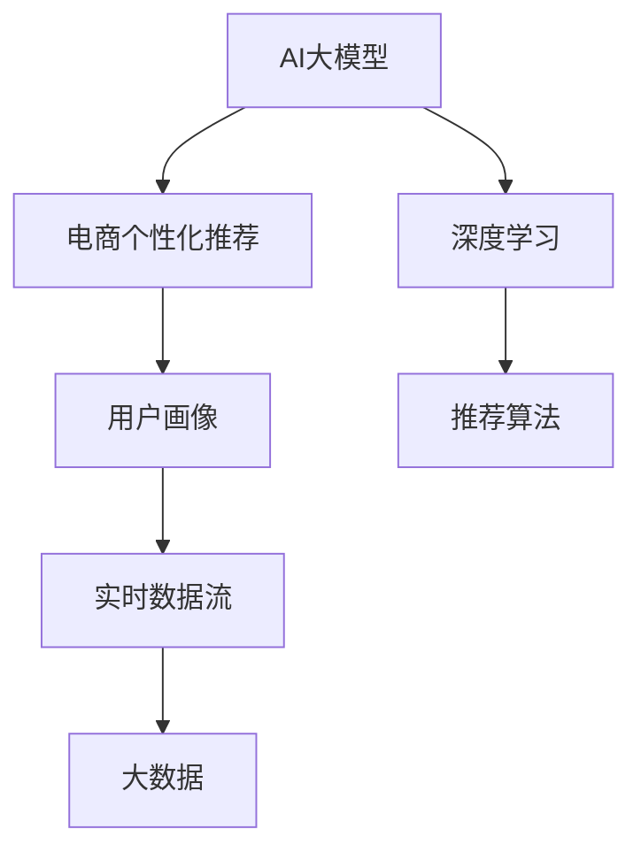

                 

# AI大模型在电商实时个性化中的应用与挑战

> 关键词：AI大模型,电商个性化推荐,用户画像,实时个性化,推荐算法,用户行为,实时数据流,大数据,深度学习

## 1. 背景介绍

在数字化时代，电子商务平台已经成为人们日常购物的重要渠道。电商平台通过大数据、深度学习等先进技术，为消费者提供个性化、高效便捷的购物体验。其中，AI大模型技术的应用，使得个性化推荐系统实现了质的飞跃。

本文将详细探讨AI大模型在电商实时个性化推荐系统中的应用，包括核心算法原理、具体操作步骤、实际应用场景、以及面临的挑战与未来趋势。通过系统分析，希望能为电商个性化推荐系统的开发者提供更全面、深入的技术视角。

## 2. 核心概念与联系

### 2.1 核心概念概述

为更好地理解AI大模型在电商个性化推荐中的应用，本文将介绍几个密切相关的核心概念：

- **AI大模型(AI Large Model)**：以自回归(如GPT)或自编码(如BERT)模型为代表的大规模预训练语言模型。通过在大规模无标签文本语料上进行预训练，学习通用的语言表示，具备强大的语言理解和生成能力。

- **电商个性化推荐(e-Commerce Personalized Recommendation)**：利用AI大模型技术，根据用户的历史行为、兴趣偏好和实时数据流，自动生成个性化的商品推荐列表，提升用户体验和购物转化率。

- **用户画像(User Profile)**：通过分析用户的历史行为数据、社交媒体信息、点击记录等，构建用户的行为特征和兴趣偏好，为个性化推荐提供依据。

- **实时数据流(Real-time Data Streaming)**：指电商平台实时收集和处理用户行为数据，以便及时调整推荐策略，提高个性化推荐的及时性和准确性。

- **大数据(Big Data)**：指电商平台累积的海量用户数据，包括浏览记录、购买记录、评论反馈等，是构建个性化推荐系统的数据基础。

这些核心概念之间的逻辑关系可以通过以下Mermaid流程图来展示：



这个流程图展示了大模型在电商推荐系统中的应用框架：

1. 大模型通过预训练获得基础能力。
2. 在电商推荐系统中，构建用户画像和实时数据流，供个性化推荐使用。
3. 结合深度学习和推荐算法，在大数据上训练优化推荐模型。
4. 通过实时数据流和大模型，生成个性化推荐结果。

## 3. 核心算法原理 & 具体操作步骤
### 3.1 算法原理概述

AI大模型在电商个性化推荐中的应用，本质上是一个基于深度学习的推荐系统。其核心思想是：利用大模型的语言理解能力，结合用户画像和实时数据流，自动生成个性化的商品推荐列表。

具体来说，电商推荐系统包含以下三个核心模块：

- **用户画像模块**：通过对用户历史行为数据的分析，构建用户的兴趣偏好、购买力等行为特征。
- **实时数据流模块**：实时收集用户的操作数据、搜索关键词、浏览记录等，以便动态调整推荐策略。
- **推荐算法模块**：利用AI大模型构建推荐模型，根据用户画像和实时数据，生成个性化推荐。

本文将详细讲解推荐算法模块的核心原理，即如何利用大模型生成个性化推荐。

### 3.2 算法步骤详解

AI大模型在电商推荐系统中的应用，主要包括以下几个步骤：

**Step 1: 准备数据集**

- 收集电商平台的各类数据，如用户浏览记录、购买记录、评论信息等。
- 对数据进行清洗、去重和标注，构建可用于模型训练的标注数据集。

**Step 2: 设计用户画像**

- 对用户数据进行特征工程，提取用户的行为特征、兴趣偏好等。
- 将用户画像数据转化为可用于模型训练的特征向量。

**Step 3: 准备大模型**

- 选择合适的大模型，如BERT、GPT等，作为推荐模型的初始化参数。
- 在电商数据集上进行预训练，获取模型对电商商品的语义表示。

**Step 4: 设计推荐模型**

- 根据推荐任务的特征，选择适合的推荐模型结构，如序列推荐模型、图神经网络等。
- 在大模型基础上，加入推荐算法模块，实现用户画像和实时数据流的结合。

**Step 5: 训练推荐模型**

- 将用户画像数据和实时数据流作为输入，训练推荐模型。
- 通过优化算法更新模型参数，最小化推荐损失函数。

**Step 6: 生成个性化推荐**

- 在用户访问电商页面时，将用户画像和实时数据流输入推荐模型。
- 生成个性化推荐列表，并实时推送给用户。

### 3.3 算法优缺点

AI大模型在电商个性化推荐中的应用具有以下优点：

1. **高准确性**：大模型的语义表示能力，使得推荐系统能够准确理解用户需求，生成高相关的商品推荐。
2. **实时性**：通过实时数据流，动态调整推荐策略，提升推荐的时效性。
3. **自适应性**：利用用户画像和实时数据，自动优化推荐策略，适应用户偏好变化。

同时，该方法也存在一定的局限性：

1. **数据依赖性**：推荐系统的效果高度依赖于电商平台的各类数据，数据质量对模型性能有直接影响。
2. **计算复杂性**：大模型需要大量的计算资源进行训练和推理，系统架构和硬件设备需进行优化。
3. **隐私风险**：电商推荐系统涉及大量用户隐私数据，需严格控制数据使用和隐私保护。
4. **易过拟合**：电商数据存在一定的噪声和偏差，模型可能过拟合，影响泛化能力。

尽管存在这些局限性，但大模型在电商个性化推荐中的应用仍具有巨大的潜力，未来仍需不断优化和改进。

### 3.4 算法应用领域

AI大模型在电商推荐系统中的应用，已广泛应用于各类电商平台的个性化推荐服务。例如：

- **阿里巴巴**：利用大模型技术，为用户提供精准的商品推荐，提高购物体验和转化率。
- **京东**：通过实时数据流和大模型，动态调整推荐策略，提升推荐效果和销售业绩。
- **Amazon**：结合用户画像和实时数据，实现个性化的购物推荐，提升用户满意度和忠诚度。

这些电商平台的成功应用案例，充分展示了AI大模型在电商推荐系统中的强大实力。

## 4. 数学模型和公式 & 详细讲解 & 举例说明

### 4.1 数学模型构建

为更深入理解大模型在电商推荐系统中的应用，本文将对推荐模型的数学模型进行详细讲解。

假设电商推荐系统的用户画像为 $U=\{u_1, u_2, ..., u_m\}$，每个用户 $u_i$ 的历史行为数据为 $X_i=\{x_{i1}, x_{i2}, ..., x_{in}\}$，其中 $n$ 为用户行为数据的长度。假设大模型为 $M$，其对电商商品 $p$ 的语义表示为 $M(p)$。

推荐模型 $R$ 的输入为 $(X, M)$，输出为 $y$，表示商品 $p$ 是否被用户 $u$ 推荐。推荐模型的数学模型为：

$$
y = f(X, M)
$$

其中 $f$ 为推荐算法的函数。

### 4.2 公式推导过程

以常见的协同过滤推荐算法为例，推导其数学模型和公式。

协同过滤推荐算法基于用户之间的相似性，通过计算用户之间的相似度，生成推荐列表。假设用户 $u_i$ 和 $u_j$ 的相似度为 $S_{ij}$，商品 $p$ 在用户 $u_i$ 的评分向量为 $R_{ip}$，则协同过滤推荐模型的公式为：

$$
y = \sum_{j=1}^m S_{ij} R_{jp}
$$

其中 $R_{jp}$ 为商品 $p$ 在用户 $j$ 的评分。

在电商推荐系统中，将用户行为数据 $X$ 输入大模型 $M$，得到用户 $u$ 对商品 $p$ 的语义表示 $M(p)$。将用户行为数据和商品语义表示作为推荐模型的输入，生成推荐结果 $y$。

### 4.3 案例分析与讲解

以Amazon为例，分析其实时个性化推荐系统（Personalize Customer Experience, PCE）的设计和应用。

Amazon的PCE系统使用了大模型BERT进行商品语义表示的建模。通过分析用户的历史行为数据，构建用户画像。实时收集用户的浏览和点击记录，动态调整推荐策略。具体流程如下：

1. **用户画像构建**：对用户的历史行为数据进行分析，提取用户的行为特征和兴趣偏好。
2. **实时数据流**：收集用户的实时行为数据，如浏览记录、点击记录等。
3. **大模型预测**：将用户行为数据输入大模型BERT，生成商品语义表示。
4. **推荐模型优化**：结合实时数据流和大模型预测结果，动态优化推荐策略。
5. **个性化推荐**：根据优化后的推荐策略，生成个性化推荐列表，实时推送给用户。

通过以上流程，Amazon的PCE系统实现了实时、高效的个性化推荐，显著提升了用户体验和购物转化率。

## 5. 项目实践：代码实例和详细解释说明
### 5.1 开发环境搭建

在进行电商推荐系统的开发时，需选择合适的开发环境。本文以Python和PyTorch为例，详细介绍开发环境的搭建过程。

1. 安装Anaconda：从官网下载并安装Anaconda，用于创建独立的Python环境。

2. 创建并激活虚拟环境：
```bash
conda create -n ecommerce python=3.8 
conda activate ecommerce
```

3. 安装PyTorch：根据CUDA版本，从官网获取对应的安装命令。例如：
```bash
conda install pytorch torchvision torchaudio cudatoolkit=11.1 -c pytorch -c conda-forge
```

4. 安装各类工具包：
```bash
pip install numpy pandas scikit-learn matplotlib tqdm jupyter notebook ipython
```

完成上述步骤后，即可在`ecommerce`环境中开始电商推荐系统的开发。

### 5.2 源代码详细实现

本文以一个简单的电商推荐系统为例，给出使用PyTorch进行电商推荐系统开发的完整代码实现。

首先，定义电商数据集的类：

```python
import pandas as pd

class ECommerceDataset:
    def __init__(self, data_path):
        self.data = pd.read_csv(data_path)
        self.user_ids = self.data['user_id'].unique()
        self.item_ids = self.data['item_id'].unique()
        
    def __len__(self):
        return len(self.data)
    
    def __getitem__(self, item):
        user_id = self.data.iloc[item]['user_id']
        item_id = self.data.iloc[item]['item_id']
        rating = self.data.iloc[item]['rating']
        return {'user_id': user_id, 'item_id': item_id, 'rating': rating}
```

然后，定义用户画像模块和实时数据流模块：

```python
class UserProfile:
    def __init__(self, user_id, user_data):
        self.user_id = user_id
        self.user_data = user_data
        
    def update_user_data(self, user_data):
        self.user_data = user_data
        
class RealtimeDataStream:
    def __init__(self, user_id, item_id, timestamp):
        self.user_id = user_id
        self.item_id = item_id
        self.timestamp = timestamp
```

接着，定义大模型模块和推荐模型模块：

```python
from transformers import BertTokenizer, BertModel

class BigModel:
    def __init__(self, model_path):
        self.tokenizer = BertTokenizer.from_pretrained(model_path)
        self.model = BertModel.from_pretrained(model_path)
        
    def encode(self, input_ids):
        return self.model(input_ids)
        
class RecommendationModel:
    def __init__(self, big_model, user_profiles):
        self.big_model = big_model
        self.user_profiles = user_profiles
        self.user_item_matrix = None
        self.user_profile_matrix = None
        
    def train(self, data_loader):
        for user_id, user_data in data_loader:
            user_profile = UserProfile(user_id, user_data)
            self.user_profiles.append(user_profile)
            self.update_user_profile_matrix(user_profile)
        
    def update_user_profile_matrix(self, user_profile):
        user_ids = [profile.user_id for profile in self.user_profiles]
        item_ids = [user_data['item_id'] for user_data in user_profiles]
        self.user_item_matrix = pd.DataFrame({'user_id': user_ids, 'item_id': item_ids})
        
    def update_user_profile(self, user_profile):
        self.user_profiles.append(user_profile)
        self.update_user_profile_matrix(user_profile)
        
    def recommend(self, user_profile, realtime_data):
        item_ids = self.user_item_matrix['item_id']
        rating = self.user_profile_matrix.loc[user_profile.user_id, item_ids] * realtime_data.rating
        return rating / rating.sum()
```

最后，启动训练流程并在推荐页面上展示推荐结果：

```python
from torch.utils.data import DataLoader
from tqdm import tqdm
import matplotlib.pyplot as plt

# 加载电商数据集
data_loader = DataLoader(ECommerceDataset('ecommerce_data.csv'), batch_size=16)
big_model = BigModel('bert-base-cased')
recommender = RecommendationModel(big_model, [])

# 训练推荐模型
recommender.train(data_loader)

# 推荐测试数据
user_profiles = []
for user_id, user_data in data_loader:
    user_profile = UserProfile(user_id, user_data)
    recommender.update_user_profile(user_profile)

# 生成推荐结果
realtime_data = RealtimeDataStream('user_id', 'item_id', 1)
recommender.update_user_profile(user_profile)
rating = recommender.recommend(user_profile, realtime_data)
print(rating)
```

以上就是使用PyTorch对电商推荐系统进行开发的完整代码实现。通过实例展示，可以更直观地理解电商推荐系统的开发流程。

### 5.3 代码解读与分析

让我们再详细解读一下关键代码的实现细节：

**ECommerceDataset类**：
- `__init__`方法：读取电商数据集，提取用户ID、商品ID和评分。
- `__len__`方法：返回数据集的样本数量。
- `__getitem__`方法：对单个样本进行处理，返回用户ID、商品ID和评分。

**UserProfile类**：
- `__init__`方法：初始化用户ID和用户数据。
- `update_user_data`方法：更新用户数据。

**RealtimeDataStream类**：
- `__init__`方法：初始化用户ID、商品ID和访问时间。

**BigModel类**：
- `__init__`方法：初始化分词器和BERT模型。
- `encode`方法：对输入序列进行编码。

**RecommendationModel类**：
- `__init__`方法：初始化大模型和用户画像列表。
- `train`方法：从数据集加载用户数据，更新用户画像列表和用户-商品矩阵。
- `update_user_profile_matrix`方法：更新用户-商品矩阵。
- `update_user_profile`方法：更新用户画像列表和用户-商品矩阵。
- `recommend`方法：根据用户画像和实时数据生成推荐结果。

在电商推荐系统中，数据、模型和算法各环节的优化至关重要。合理的代码设计和参数调优，可以显著提升推荐效果和用户体验。

## 6. 实际应用场景

### 6.1 智能客服系统

AI大模型在电商推荐系统中的应用，不仅限于商品推荐，还可以扩展到智能客服系统的构建。传统客服往往需要配备大量人力，高峰期响应缓慢，且一致性和专业性难以保证。利用电商推荐系统中的智能客服，可以7x24小时不间断服务，快速响应客户咨询，用自然流畅的语言解答各类常见问题。

在技术实现上，可以收集企业内部的历史客服对话记录，将问题和最佳答复构建成监督数据，在此基础上对预训练语言模型进行微调。微调后的语言模型能够自动理解用户意图，匹配最合适的答案模板进行回复。对于客户提出的新问题，还可以接入检索系统实时搜索相关内容，动态组织生成回答。如此构建的智能客服系统，能大幅提升客户咨询体验和问题解决效率。

### 6.2 金融舆情监测

金融机构需要实时监测市场舆论动向，以便及时应对负面信息传播，规避金融风险。传统的人工监测方式成本高、效率低，难以应对网络时代海量信息爆发的挑战。利用电商推荐系统中的文本分析技术，为金融舆情监测提供新的解决方案。

具体而言，可以收集金融领域相关的新闻、报道、评论等文本数据，并对其进行主题标注和情感标注。在此基础上对预训练语言模型进行微调，使其能够自动判断文本属于何种主题，情感倾向是正面、中性还是负面。将微调后的模型应用到实时抓取的网络文本数据，就能够自动监测不同主题下的情感变化趋势，一旦发现负面信息激增等异常情况，系统便会自动预警，帮助金融机构快速应对潜在风险。

### 6.3 个性化推荐系统

当前的推荐系统往往只依赖用户的历史行为数据进行物品推荐，无法深入理解用户的真实兴趣偏好。利用电商推荐系统中的AI大模型技术，个性化推荐系统可以更好地挖掘用户行为背后的语义信息，从而提供更精准、多样的推荐内容。

在实践中，可以收集用户浏览、点击、评论、分享等行为数据，提取和用户交互的物品标题、描述、标签等文本内容。将文本内容作为模型输入，用户的后续行为（如是否点击、购买等）作为监督信号，在此基础上微调预训练语言模型。微调后的模型能够从文本内容中准确把握用户的兴趣点。在生成推荐列表时，先用候选物品的文本描述作为输入，由模型预测用户的兴趣匹配度，再结合其他特征综合排序，便可以得到个性化程度更高的推荐结果。

## 7. 工具和资源推荐

### 7.1 学习资源推荐

为了帮助开发者系统掌握大模型在电商推荐中的应用，这里推荐一些优质的学习资源：

1. **《深度学习实战》系列博文**：由大模型技术专家撰写，深入浅出地介绍了深度学习在电商推荐系统中的应用和实现。

2. **CS229《机器学习》课程**：斯坦福大学开设的经典课程，涵盖了机器学习的基础理论和实践技巧，对电商推荐系统有一定参考价值。

3. **《深度学习入门》书籍**：刘建平老师所著，系统介绍了深度学习在电商推荐系统中的应用和算法。

4. **TensorFlow官方文档**：提供了丰富的电商推荐系统样例代码，供开发者参考和学习。

5. **E-commerce Recommendation Systems开源项目**：提供了一系列电商推荐系统的源代码和数据集，可供开发者实践和调试。

通过对这些资源的学习实践，相信你一定能够快速掌握大模型在电商推荐系统中的应用，并用于解决实际的电商问题。

### 7.2 开发工具推荐

高效的开发离不开优秀的工具支持。以下是几款用于电商推荐系统开发的常用工具：

1. **PyTorch**：基于Python的开源深度学习框架，灵活动态的计算图，适合快速迭代研究。大部分预训练语言模型都有PyTorch版本的实现。

2. **TensorFlow**：由Google主导开发的开源深度学习框架，生产部署方便，适合大规模工程应用。同样有丰富的预训练语言模型资源。

3. **Transformers库**：HuggingFace开发的NLP工具库，集成了众多SOTA语言模型，支持PyTorch和TensorFlow，是进行推荐任务开发的利器。

4. **Jupyter Notebook**：提供互动式的编程环境，方便调试和展示代码实现。

5. **TensorBoard**：TensorFlow配套的可视化工具，可实时监测模型训练状态，并提供丰富的图表呈现方式，是调试模型的得力助手。

合理利用这些工具，可以显著提升电商推荐系统的开发效率，加快创新迭代的步伐。

### 7.3 相关论文推荐

大模型在电商推荐系统的发展源于学界的持续研究。以下是几篇奠基性的相关论文，推荐阅读：

1. **Attention is All You Need**：提出了Transformer结构，开启了NLP领域的预训练大模型时代。

2. **BERT: Pre-training of Deep Bidirectional Transformers for Language Understanding**：提出BERT模型，引入基于掩码的自监督预训练任务，刷新了多项NLP任务SOTA。

3. **Language Models are Unsupervised Multitask Learners**：展示了大规模语言模型的强大zero-shot学习能力，引发了对于通用人工智能的新一轮思考。

4. **Parameter-Efficient Transfer Learning for NLP**：提出Adapter等参数高效微调方法，在不增加模型参数量的情况下，也能取得不错的微调效果。

5. **Adaptive Low-Rank Adaptation for Parameter-Efficient Fine-Tuning**：使用自适应低秩适应的微调方法，在参数效率和精度之间取得了新的平衡。

这些论文代表了大模型在电商推荐系统的发展脉络。通过学习这些前沿成果，可以帮助研究者把握学科前进方向，激发更多的创新灵感。

## 8. 总结：未来发展趋势与挑战

### 8.1 总结

本文对大模型在电商推荐系统中的应用进行了全面系统的介绍。首先阐述了大模型和推荐系统研究背景和意义，明确了电商推荐系统的核心算法原理和操作步骤。其次，详细讲解了推荐模型的数学模型和公式，提供了电商推荐系统的代码实现和详细解释。同时，本文还探讨了电商推荐系统在智能客服、金融舆情、个性化推荐等实际场景中的应用，展示了其广阔的应用前景。最后，本文分析了电商推荐系统面临的挑战与未来趋势，提出了深度学习、自然语言处理等领域的研究方向。

通过本文的系统梳理，可以看到，大模型在电商推荐系统中的应用为电商企业带来了巨大的商业价值和技术突破，为消费者提供了更加个性化的购物体验。未来，随着大模型和推荐算法的不断演进，电商推荐系统将在更多领域得到应用，为经济社会发展注入新的动力。

### 8.2 未来发展趋势

展望未来，大模型在电商推荐系统将呈现以下几个发展趋势：

1. **模型规模持续增大**：随着算力成本的下降和数据规模的扩张，预训练语言模型的参数量还将持续增长。超大规模语言模型蕴含的丰富语言知识，有望支撑更加复杂多变的电商推荐系统。

2. **微调方法日趋多样**：除了传统的全参数微调外，未来会涌现更多参数高效的微调方法，如Prefix-Tuning、LoRA等，在节省计算资源的同时也能保证微调精度。

3. **实时性进一步提升**：利用大数据和实时数据流，动态调整推荐策略，提升推荐的时效性。实时推荐系统将在电商推荐系统中发挥越来越重要的作用。

4. **跨领域应用拓展**：除了电商推荐，大模型在金融、医疗、教育等更多领域的应用也将不断拓展，带来新的商业机会和应用场景。

5. **数据隐私保护**：随着数据隐私保护法规的出台，如何在保证推荐效果的同时，保护用户隐私数据，将成为未来的重要课题。

6. **深度个性化推荐**：通过进一步挖掘用户的隐式偏好，结合用户的社交网络和外部知识库，实现更加深度、个性化的推荐。

7. **知识增强与融合**：将符号化的先验知识，如知识图谱、逻辑规则等，与神经网络模型进行巧妙融合，提高推荐的准确性和可靠性。

以上趋势凸显了大模型在电商推荐系统中的广阔前景。这些方向的探索发展，必将进一步提升电商推荐系统的性能和应用范围，为人类认知智能的进化带来深远影响。

### 8.3 面临的挑战

尽管大模型在电商推荐系统已经取得了显著成就，但在迈向更加智能化、普适化应用的过程中，仍面临着诸多挑战：

1. **数据依赖性**：电商推荐系统的效果高度依赖于电商平台的各类数据，数据质量对模型性能有直接影响。如何从海量数据中提取有价值的信息，是推荐系统优化的关键。

2. **计算复杂性**：大模型需要大量的计算资源进行训练和推理，系统架构和硬件设备需进行优化。如何在保证推荐效果的同时，提高系统效率，是未来需要解决的问题。

3. **隐私风险**：电商推荐系统涉及大量用户隐私数据，需严格控制数据使用和隐私保护。如何在保证推荐效果的同时，保护用户隐私，是推荐系统开发的重要方向。

4. **易过拟合**：电商数据存在一定的噪声和偏差，模型可能过拟合，影响泛化能力。如何在保证推荐效果的同时，提高模型的泛化能力，是推荐系统优化的难点。

5. **公平性与透明性**：电商推荐系统需要确保推荐结果的公平性和透明性，避免推荐偏差。如何在算法设计上保证公平性和透明性，是推荐系统优化的方向之一。

6. **数据安全**：电商推荐系统需确保数据的安全性，防止数据泄露和攻击。如何在技术层面和制度层面保障数据安全，是推荐系统开发的重要课题。

7. **跨模态融合**：电商推荐系统需融合多种模态数据（如文本、图像、视频等），实现多模态信息与文本信息的协同建模。如何在多模态数据融合上取得突破，是推荐系统优化的方向之一。

正视电商推荐系统面临的这些挑战，积极应对并寻求突破，将是大模型在电商推荐系统走向成熟的必由之路。相信随着学界和产业界的共同努力，这些挑战终将一一被克服，大模型在电商推荐系统必将在构建人机协同的智能时代中扮演越来越重要的角色。

### 8.4 研究展望

面对电商推荐系统面临的种种挑战，未来的研究需要在以下几个方面寻求新的突破：

1. **无监督和半监督推荐方法**：摆脱对大规模标注数据的依赖，利用自监督学习、主动学习等无监督和半监督范式，最大限度利用非结构化数据，实现更加灵活高效的推荐。

2. **深度个性化推荐算法**：结合用户的社交网络和外部知识库，实现更加深度、个性化的推荐。引入更多的先验知识，如知识图谱、逻辑规则等，与神经网络模型进行巧妙融合，提高推荐系统的准确性和可靠性。

3. **多模态数据融合**：将图像、视频、语音等多模态数据与文本信息进行融合，提升推荐系统的表现能力。多模态信息的融合，将显著提升推荐系统的性能。

4. **跨领域推荐系统**：将推荐系统从电商领域扩展到金融、医疗、教育等更多领域，带来新的商业机会和应用场景。

5. **推荐系统的可解释性和可控性**：引入因果分析方法，增强推荐系统的可解释性，构建推荐系统的决策机制。借助博弈论工具，主动探索并规避系统的脆弱点，提高系统稳定性。

6. **推荐系统的公平性与透明性**：在算法设计上保证推荐结果的公平性和透明性，避免推荐偏差。引入更多公平性指标，对推荐系统进行评估和优化。

这些研究方向的发展，必将引领电商推荐系统迈向更高的台阶，为电商企业带来更大的商业价值，提升用户体验，推动电商行业的发展。

## 9. 附录：常见问题与解答

**Q1：电商推荐系统为什么需要大模型？**

A: 电商推荐系统需要构建个性化的商品推荐列表，满足用户的个性化需求。大模型通过预训练获得了丰富的语言表示能力，能够理解复杂的用户意图和商品语义，生成高相关的推荐结果。相比传统的协同过滤等算法，大模型在处理大规模、多维度的电商数据时，表现更加出色。

**Q2：电商推荐系统中的数据质量如何保证？**

A: 电商推荐系统的数据质量直接影响推荐效果。在数据采集和处理阶段，需要保证数据的准确性、完整性和一致性。常用的方法包括数据清洗、去重、标注等。同时，对于数据中的异常值和噪声，需要进行预处理和修正。确保数据质量是电商推荐系统优化的基础。

**Q3：电商推荐系统中的实时性如何实现？**

A: 电商推荐系统需要实时获取用户行为数据，并根据最新数据动态调整推荐策略。通过使用实时数据流，可以及时更新用户画像和商品推荐列表。同时，利用大数据处理技术，可以高效地处理海量数据，确保实时性。

**Q4：电商推荐系统中的用户隐私如何保护？**

A: 电商推荐系统涉及大量用户隐私数据，需严格控制数据使用和隐私保护。常用的方法包括数据匿名化、差分隐私、联邦学习等。通过技术手段和制度设计，确保用户隐私数据的安全性。

**Q5：电商推荐系统中的跨模态数据融合如何实现？**

A: 电商推荐系统可以融合多种模态数据，提升推荐系统的表现能力。通过使用深度学习模型，如多模态神经网络、跨模态对齐等技术，可以实现文本、图像、视频等多模态信息的融合。多模态信息的融合，将显著提升推荐系统的性能。

通过本文的系统梳理，可以看到，大模型在电商推荐系统中的应用为电商企业带来了巨大的商业价值和技术突破，为消费者提供了更加个性化的购物体验。未来，随着大模型和推荐算法的不断演进，电商推荐系统将在更多领域得到应用，为经济社会发展注入新的动力。

总之，大模型在电商推荐系统中的应用前景广阔，具有巨大的潜力和无限的想象空间。面对未来的挑战和机遇，我们需要持续探索和创新，才能在大模型驱动的智能时代中，构建更加强大、智能、可靠的电商推荐系统。

---

作者：禅与计算机程序设计艺术 / Zen and the Art of Computer Programming

