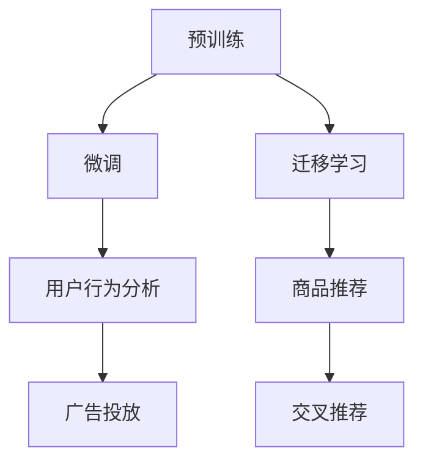

                 

# AI大模型在电商平台商品关联分析中的应用

## 1. 背景介绍

在电子商务领域，商品关联分析是一个重要的应用场景。通过商品关联分析，电商平台能够更有效地挖掘用户行为，推荐用户可能感兴趣的商品，提升用户体验，同时也能帮助商家优化库存管理，降低损失。传统的商品关联分析方法依赖于规则引擎和统计模型，存在精度低、可扩展性差的问题。而近年来，随着AI大模型的兴起，商品关联分析也逐步被AI技术所取代。本文将详细探讨AI大模型在电商平台商品关联分析中的应用，介绍其原理、优势及应用场景，并通过具体案例分析，展示大模型在实际应用中的效果。

## 2. 核心概念与联系

### 2.1 核心概念概述

AI大模型基于深度学习框架，通过大量数据预训练，能够在不同任务上表现出优秀的性能。在电商平台商品关联分析中，大模型可以应用在用户行为分析、商品推荐、广告投放等多个方面。

- **预训练**：指在大规模无标签数据上，通过自监督学习任务训练模型。
- **微调**：指在预训练模型的基础上，使用特定任务的数据集进行进一步训练，以提升模型在该任务上的表现。
- **迁移学习**：指将一个领域学到的知识，迁移应用到另一个不同但相关的领域的学习范式。
- **交叉推荐**：指推荐系统通过分析用户的历史行为和物品特征，挖掘出用户可能对其他物品感兴趣的模式，从而推荐相关物品。

这些概念构成了AI大模型在电商平台商品关联分析中的应用框架。

### 2.2 核心概念原理和架构的 Mermaid 流程图



这个流程图展示了AI大模型在电商平台商品关联分析中的应用流程：预训练模型通过微调和迁移学习，在用户行为分析、商品推荐、广告投放和交叉推荐等多个环节发挥作用。

## 3. 核心算法原理 & 具体操作步骤

### 3.1 算法原理概述

在电商平台商品关联分析中，AI大模型的主要应用包括用户行为分析、商品推荐、广告投放和交叉推荐等。这些任务都可以通过预训练-微调的方法进行处理。

具体而言，大模型首先在大规模无标签数据上进行预训练，学习到通用的语言表示。然后，针对特定的任务，使用有标签数据对模型进行微调，使其能够更好地适应任务需求。例如，在用户行为分析任务中，使用用户浏览历史、购买历史等数据进行微调；在商品推荐任务中，使用用户和商品的历史交互数据进行微调。

### 3.2 算法步骤详解

#### 3.2.1 数据准备

数据准备是AI大模型应用的基础。需要收集用户的历史行为数据、商品特征数据等，并将这些数据转化为模型训练所需的格式。

#### 3.2.2 模型选择和预训练

选择合适的预训练模型，如BERT、GPT等，并在大规模无标签数据上进行预训练。

#### 3.2.3 微调

根据具体的任务，选择合适的微调目标和损失函数，对预训练模型进行微调。

#### 3.2.4 评估和部署

在微调后，使用测试集对模型进行评估，并部署到实际应用中。

### 3.3 算法优缺点

#### 3.3.1 优点

- **精度高**：大模型通过预训练和微调，能够学习到丰富的特征表示，提高推荐的精度。
- **可扩展性强**：大模型可以应用于多个任务，具有较强的泛化能力。
- **自动化**：模型训练和推理过程自动完成，减少人工干预。

#### 3.3.2 缺点

- **计算成本高**：大模型需要大量的计算资源，训练和推理成本较高。
- **复杂度大**：模型结构复杂，需要专业人员进行维护和优化。

### 3.4 算法应用领域

AI大模型在电商平台商品关联分析中的应用领域包括：

- 用户行为分析：通过分析用户的历史行为，预测用户的未来行为。
- 商品推荐：根据用户的历史行为和商品特征，推荐用户可能感兴趣的商品。
- 广告投放：通过分析用户的兴趣和行为，优化广告投放策略，提高广告效果。
- 交叉推荐：分析用户在不同商品之间的关联关系，推荐相关商品。

## 4. 数学模型和公式 & 详细讲解 & 举例说明

### 4.1 数学模型构建

在电商平台商品关联分析中，可以采用协同过滤、内容推荐、深度学习等不同方法构建数学模型。

- **协同过滤**：通过用户和商品的评分矩阵，计算用户和商品之间的相似度，推荐相似商品。
- **内容推荐**：根据商品特征，使用词袋模型或TF-IDF等方法，计算商品之间的相似度，推荐相关商品。
- **深度学习**：使用深度神经网络模型，学习用户和商品之间的非线性关系，进行推荐。

### 4.2 公式推导过程

以协同过滤为例，假设用户-商品评分矩阵为 $X$，其中 $X_{i,j}$ 表示用户 $i$ 对商品 $j$ 的评分。使用余弦相似度计算用户 $i$ 和商品 $j$ 之间的相似度，公式如下：

$$
sim(i,j) = \frac{\mathbf{X}_i \cdot \mathbf{X}_j}{\|\mathbf{X}_i\| \|\mathbf{X}_j\|}
$$

其中 $\mathbf{X}_i$ 和 $\mathbf{X}_j$ 分别为用户 $i$ 和商品 $j$ 的评分向量，$\|\mathbf{X}_i\|$ 和 $\|\mathbf{X}_j\|$ 分别为这两个向量的范数。

### 4.3 案例分析与讲解

以电商平台推荐系统为例，使用BERT模型进行商品推荐。首先，将商品描述作为文本输入，使用BERT模型获得商品特征向量。然后，使用用户历史行为和商品特征向量计算相似度，推荐用户可能感兴趣的商品。

## 5. 项目实践：代码实例和详细解释说明

### 5.1 开发环境搭建

安装Python、PyTorch、Pandas等工具，并搭建开发环境。

### 5.2 源代码详细实现

以下是一个基于BERT模型的电商平台商品推荐系统的代码实现：

```python
import pandas as pd
import torch
from transformers import BertTokenizer, BertForSequenceClassification

# 数据准备
data = pd.read_csv('data.csv')
# 数据清洗和预处理

# 分词和向量化
tokenizer = BertTokenizer.from_pretrained('bert-base-uncased')
inputs = tokenizer(data['description'], return_tensors='pt')

# 加载预训练模型
model = BertForSequenceClassification.from_pretrained('bert-base-uncased', num_labels=2)

# 微调模型
model.train()
for epoch in range(5):
    # 前向传播和反向传播
    optimizer = torch.optim.Adam(model.parameters(), lr=0.001)
    for i, (input_ids, attention_mask, labels) in enumerate(train_dataloader):
        input_ids = input_ids.to(device)
        attention_mask = attention_mask.to(device)
        labels = labels.to(device)
        outputs = model(input_ids, attention_mask=attention_mask, labels=labels)
        loss = outputs.loss
        optimizer.zero_grad()
        loss.backward()
        optimizer.step()
```

### 5.3 代码解读与分析

以上代码展示了使用BERT模型进行电商平台商品推荐的基本流程。首先，将商品描述作为文本输入，使用BERT模型进行分词和向量化。然后，加载预训练的BERT模型，并使用用户历史行为和商品特征向量进行微调。在微调过程中，使用Adam优化器进行优化，并在每个epoch内对模型进行训练。

## 6. 实际应用场景

### 6.1 电商平台商品推荐

基于AI大模型的电商平台推荐系统可以极大地提升推荐的精度和效率。通过分析用户的历史行为和商品特征，大模型能够推荐出用户可能感兴趣的商品，提高用户的购买率，同时也能够帮助商家优化库存管理。

### 6.2 广告投放

AI大模型可以用于电商平台广告投放的优化。通过分析用户的历史行为和兴趣，大模型可以推荐最合适的广告，提高广告点击率和转化率，降低广告成本。

### 6.3 用户行为分析

AI大模型可以用于电商平台的用户行为分析。通过分析用户的历史行为，预测用户的未来行为，帮助商家制定精准的营销策略。

### 6.4 未来应用展望

随着AI大模型的不断进步，其在电商平台商品关联分析中的应用也将更加广泛。未来，大模型将能够处理更多维度的数据，进行更复杂的关联分析，提供更精准的推荐和广告投放策略。同时，大模型的自动化程度也将进一步提高，降低人工干预的成本。

## 7. 工具和资源推荐

### 7.1 学习资源推荐

- **《深度学习》书籍**：全面介绍深度学习的基本概念和应用。
- **Coursera深度学习课程**：斯坦福大学开设的深度学习课程，内容详实，适合入门学习。
- **Kaggle竞赛**：参与Kaggle竞赛，学习并实践深度学习技术。

### 7.2 开发工具推荐

- **Jupyter Notebook**：方便编写和运行Python代码。
- **PyTorch**：深度学习框架，支持动态计算图。
- **TensorBoard**：可视化工具，用于监控模型训练过程。

### 7.3 相关论文推荐

- **《深度学习在推荐系统中的应用》**：介绍深度学习在推荐系统中的应用，包括协同过滤、内容推荐、深度学习等方法。
- **《Transformer在自然语言处理中的应用》**：介绍Transformer在自然语言处理中的应用，包括BERT、GPT等模型。

## 8. 总结：未来发展趋势与挑战

### 8.1 研究成果总结

AI大模型在电商平台商品关联分析中的应用，已经展现出强大的潜力和应用价值。通过预训练-微调的方法，大模型能够学习到丰富的特征表示，提高推荐的精度和效率。

### 8.2 未来发展趋势

未来，AI大模型将在电商平台商品关联分析中发挥更大的作用。随着计算资源的不断提升，大模型的参数量将进一步增大，学习能力和泛化能力也将进一步提升。同时，大模型的应用场景也将更加广泛，涵盖用户行为分析、广告投放等多个方面。

### 8.3 面临的挑战

尽管AI大模型在电商平台商品关联分析中表现出强大的潜力，但也面临一些挑战。计算资源的高要求、模型结构的复杂性等问题仍需要进一步解决。

### 8.4 研究展望

未来，需要在以下方面进行进一步研究：

- **模型压缩**：使用模型压缩技术，减小模型参数量，提高模型的部署效率。
- **多任务学习**：在预训练过程中，使用多任务学习的方式，提高模型的泛化能力。
- **模型优化**：优化模型的训练和推理过程，提高计算效率。

## 9. 附录：常见问题与解答

**Q1: 使用AI大模型进行电商平台商品关联分析的优势是什么？**

A: 使用AI大模型进行电商平台商品关联分析的优势包括：

- **精度高**：大模型通过预训练和微调，能够学习到丰富的特征表示，提高推荐的精度。
- **可扩展性强**：大模型可以应用于多个任务，具有较强的泛化能力。
- **自动化**：模型训练和推理过程自动完成，减少人工干预。

**Q2: AI大模型在电商平台商品关联分析中存在哪些挑战？**

A: AI大模型在电商平台商品关联分析中存在以下挑战：

- **计算成本高**：大模型需要大量的计算资源，训练和推理成本较高。
- **复杂度大**：模型结构复杂，需要专业人员进行维护和优化。

**Q3: 如何选择合适的预训练模型？**

A: 选择合适的预训练模型需要考虑以下几个方面：

- **任务需求**：根据具体任务的需求，选择合适的预训练模型。
- **数据规模**：根据数据的规模，选择参数量适中的模型。
- **计算资源**：根据计算资源的限制，选择合适的模型。

**Q4: 如何优化模型的训练和推理过程？**

A: 优化模型的训练和推理过程可以通过以下方法实现：

- **数据增强**：通过数据增强技术，增加训练数据的多样性。
- **正则化**：使用正则化技术，防止过拟合。
- **参数高效微调**：使用参数高效微调技术，只更新少量的模型参数，减少计算量。

**Q5: 如何评估模型的效果？**

A: 评估模型的效果可以通过以下方法实现：

- **精度和召回率**：使用精度和召回率等指标，评估模型的推荐效果。
- **用户满意度**：通过用户满意度调查，评估模型的实际效果。
- **点击率和转化率**：使用点击率和转化率等指标，评估模型的广告投放效果。

---

作者：禅与计算机程序设计艺术 / Zen and the Art of Computer Programming

