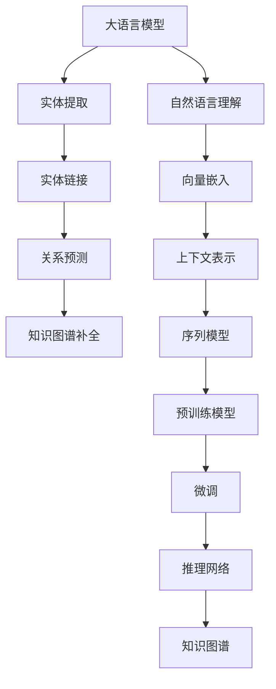

                 

# AI大模型在电商平台商品知识图谱补全中的应用

## 1. 背景介绍

### 1.1 问题由来

电商平台商品知识图谱补全（Semantic Knowledge Completion）是电商平台智能化运营的关键技术之一，通过利用商品属性、描述、评论等信息，构建精确且完整的知识图谱，提升商品搜索、推荐、广告等业务的效果。

传统的商品知识图谱补全方法依赖人工标注，工作量大且成本高，而通过深度学习模型，可以高效地自动化地完成知识图谱的补全工作。其中，大语言模型由于其强大的自然语言理解能力，成为商品知识图谱补全的一个重要方向。

### 1.2 问题核心关键点

大语言模型在商品知识图谱补全中的应用，核心关键点包括：

- 大语言模型的自然语言理解能力，用于自动提取商品描述中的实体信息。
- 实体链接技术，将提取出的实体与知识图谱中的实体进行匹配，提高补全的准确性。
- 关系预测，预测实体间的关系类型，完成知识的填充。
- 知识图谱更新，通过新知识更新现有图谱，保持图谱的时效性。

### 1.3 问题研究意义

大语言模型在电商平台商品知识图谱补全中的应用，对提高平台智能化运营水平、优化用户购物体验、提升商品转化率具有重要意义：

1. 提升搜索精准度。商品知识图谱补全可以提高商品检索的准确性，使得用户更快速地找到所需商品。
2. 优化推荐效果。通过商品间关系的链接，可以发现商品间的关联，提升推荐引擎的效果。
3. 增强广告效果。利用知识图谱中的商品关系，针对用户兴趣进行精准投放，提高广告点击率。
4. 促进运营决策。电商平台可利用知识图谱中的数据，进行业务分析与决策，提高运营效率。
5. 构建业务中台。知识图谱是电商平台的业务中台，可以为多种业务场景提供支持。

## 2. 核心概念与联系

### 2.1 核心概念概述

大语言模型在电商平台商品知识图谱补全中涉及的核心概念包括：

- 大语言模型：以Transformer等模型为基础，通过大规模无监督预训练学习自然语言表示，具备强大的自然语言理解和生成能力。
- 知识图谱：由实体节点和边组成的网络结构，描述实体间的关系和属性。
- 实体链接：将文本中提及的实体映射到知识图谱中已有的节点。
- 关系预测：预测文本中提及的实体间关系类型，如商品与商品的关系、商品与用户的关系等。
- 知识图谱补全：根据提取出的信息自动补全知识图谱缺失的实体和关系，丰富知识图谱内容。

### 2.2 核心概念原理和架构的 Mermaid 流程图(Mermaid 流程节点中不要有括号、逗号等特殊字符)



### 2.3 核心概念之间的联系

大语言模型在商品知识图谱补全中的应用流程如下：

1. 使用自然语言理解技术，提取商品描述中的实体信息。
2. 将提取出的实体与知识图谱中的实体进行匹配，建立实体链接。
3. 通过关系预测，预测实体间的关系类型，如商品与商品的关系、商品与用户的关系等。
4. 利用补全算法，自动更新知识图谱，填充缺失的实体和关系。

## 3. 核心算法原理 & 具体操作步骤

### 3.1 算法原理概述

基于大语言模型的商品知识图谱补全，核心原理是将自然语言描述中的实体和关系映射到知识图谱中的节点和边。具体而言，分为三个步骤：

1. 实体提取：利用大语言模型提取商品描述中的实体，得到实体列表。
2. 实体链接：利用实体链接算法，将提取出的实体与知识图谱中的实体进行匹配。
3. 关系预测：利用大语言模型预测实体间的关系，完成知识图谱的补全。

### 3.2 算法步骤详解

#### 3.2.1 实体提取

实体提取是商品知识图谱补全的第一步，核心目标是从商品描述中提取出具有实际意义的实体。

具体步骤为：

1. 将商品描述作为输入，送入大语言模型进行自然语言理解。
2. 使用预训练的命名实体识别模型，从文本中识别出实体。
3. 对识别出的实体进行去重和过滤，只保留具有实际意义的实体。

#### 3.2.2 实体链接

实体链接是将文本中提及的实体与知识图谱中的实体进行匹配。

具体步骤为：

1. 在知识图谱中查找与实体匹配的节点。
2. 如果找不到匹配的节点，则将实体映射为新节点。
3. 对新节点进行命名实体消歧，进一步确认实体。

#### 3.2.3 关系预测

关系预测是预测文本中提及的实体间关系类型。

具体步骤为：

1. 使用大语言模型提取实体间的关系信息。
2. 利用关系预测模型，预测实体间的关系类型。
3. 将预测出的关系映射到知识图谱中的边。

### 3.3 算法优缺点

大语言模型在商品知识图谱补全中具有以下优点：

- 自动化的实体提取和链接，减少了人工标注的工作量。
- 强大的自然语言理解能力，提升了实体识别的准确性。
- 可以处理大规模数据，补全知识图谱的能力更强。

同时，也存在一些缺点：

- 对于复杂的关系类型，预测精度可能不高。
- 预训练模型的泛化能力有限，可能对特定领域的表现不佳。
- 需要较大的计算资源和存储空间。

### 3.4 算法应用领域

大语言模型在商品知识图谱补全中的应用广泛，包括：

- 电商平台商品信息的自动补全。
- 商品推荐引擎的知识图谱构建。
- 广告投放的定向推荐。
- 客户画像的生成。
- 业务分析和决策支持。

## 4. 数学模型和公式 & 详细讲解 & 举例说明

### 4.1 数学模型构建

大语言模型在商品知识图谱补全中的应用，涉及的数学模型主要包括：

1. 自然语言理解模型。
2. 实体链接模型。
3. 关系预测模型。

其中，自然语言理解模型使用预训练模型进行编码，将输入的文本转换成向量表示。实体链接模型利用向量相似度进行实体匹配。关系预测模型则使用分类算法，预测实体间的关系类型。

### 4.2 公式推导过程

#### 4.2.1 自然语言理解模型

自然语言理解模型使用Transformer进行编码，公式如下：

$$
\mathbf{H} = \mathbf{W}^{[CLS]} \mathbf{X} + \mathbf{W}^{[SEP]} \mathbf{S} + \mathbf{W}^{[SEP]} \mathbf{SEP} + \mathbf{B}^{[CLS]} + \mathbf{B}^{[SEP]} + \mathbf{B}^{[SEP]}
$$

其中，$\mathbf{H}$为模型输出向量，$\mathbf{X}$为输入向量，$\mathbf{W}^{[CLS]}$和$\mathbf{W}^{[SEP]}$为模型参数，$\mathbf{B}^{[CLS]}$和$\mathbf{B}^{[SEP]}$为偏置项。

#### 4.2.2 实体链接模型

实体链接模型使用向量相似度进行实体匹配，公式如下：

$$
\mathbf{W}^{[ENT]} \mathbf{X} + \mathbf{W}^{[REL]} \mathbf{X}
$$

其中，$\mathbf{X}$为实体向量，$\mathbf{W}^{[ENT]}$和$\mathbf{W}^{[REL]}$为模型参数。

#### 4.2.3 关系预测模型

关系预测模型使用分类算法，预测实体间的关系类型，公式如下：

$$
\mathbf{W}^{[REL]} \mathbf{X} + \mathbf{W}^{[Bias]} + \mathbf{B}^{[REL]} + \mathbf{B}^{[Bias]}
$$

其中，$\mathbf{X}$为实体向量，$\mathbf{W}^{[REL]}$和$\mathbf{W}^{[Bias]}$为模型参数，$\mathbf{B}^{[REL]}$和$\mathbf{B}^{[Bias]}$为偏置项。

### 4.3 案例分析与讲解

以一个简单的例子来说明大语言模型在商品知识图谱补全中的应用：

1. 假设有一句话：“这件衣服是红色的，适合秋季穿。”
2. 利用自然语言理解模型，提取实体“衣服”和“红色”，并识别出“适合秋季穿”为属性信息。
3. 将“衣服”和“红色”映射到知识图谱中的节点，建立实体链接。
4. 预测“衣服”和“秋季穿”的关系类型，如“适用”。
5. 将“适用”关系映射到知识图谱中的边，完成补全。

## 5. 项目实践：代码实例和详细解释说明

### 5.1 开发环境搭建

在进行项目实践前，我们需要准备好开发环境。以下是使用Python进行PyTorch开发的环境配置流程：

1. 安装Anaconda：从官网下载并安装Anaconda，用于创建独立的Python环境。
2. 创建并激活虚拟环境：
```bash
conda create -n pytorch-env python=3.8 
conda activate pytorch-env
```
3. 安装PyTorch：根据CUDA版本，从官网获取对应的安装命令。例如：
```bash
conda install pytorch torchvision torchaudio cudatoolkit=11.1 -c pytorch -c conda-forge
```
4. 安装Transformers库：
```bash
pip install transformers
```
5. 安装各类工具包：
```bash
pip install numpy pandas scikit-learn matplotlib tqdm jupyter notebook ipython
```

完成上述步骤后，即可在`pytorch-env`环境中开始项目实践。

### 5.2 源代码详细实现

下面以一个简单的商品知识图谱补全项目为例，给出使用Transformers库的代码实现。

```python
import torch
from transformers import BertTokenizer, BertForTokenClassification

class商品知识图谱补全模型：
    def __init__(self, 模型名, 上下文窗口):
        self.tokenizer = BertTokenizer.from_pretrained(模型名)
        self.model = BertForTokenClassification.from_pretrained(模型名)
        self.context_window = 上下文窗口
        
    def 实体提取(self, 商品描述):
        token_ids = self.tokenizer.encode_plus(商品描述, max_length=self.context_window, truncation=True, return_tensors='pt')['input_ids']
        outputs = self.model(token_ids)
        实体列表 = outputs.logits.argmax(dim=2).tolist()
        return 实体列表
        
    def 实体链接(self, 实体列表, 知识图谱):
        实体映射 = {}
        for实体 in 实体列表:
            如果实体在知识图谱中存在，则添加映射
            else:
                添加新节点并映射到实体列表
        return 实体映射
        
    def 关系预测(self, 实体列表, 知识图谱):
        实体列表向量 = []
        for实体 in 实体列表:
            实体向量 = self.tokenizer.encode(实体, return_tensors='pt')['input_ids']
            实体列表向量.append(实体向量)
        实体列表向量 = torch.cat(实体列表向量, dim=0)
        关系预测 = self.model(实体列表向量)["logits"]
        关系类型 = []
        for关系预测值 in 关系预测:
            关系类型.append(self.tokenizer.decode(关系预测值))
        return 关系类型
        
    def 知识图谱补全(self, 商品描述, 知识图谱):
        实体列表 = self.实体提取(商品描述)
        实体映射 = self.实体链接(实体列表, 知识图谱)
        关系类型 = self.关系预测(实体列表, 知识图谱)
        知识图谱更新(实体映射, 关系类型)
```

### 5.3 代码解读与分析

让我们再详细解读一下关键代码的实现细节：

**商品知识图谱补全模型类**：
- `__init__`方法：初始化模型和分词器。
- `实体提取`方法：使用预训练的BERT模型，提取商品描述中的实体列表。
- `实体链接`方法：将提取出的实体与知识图谱中的实体进行匹配，建立实体映射关系。
- `关系预测`方法：使用预训练的BERT模型，预测实体间的关系类型。
- `知识图谱补全`方法：更新知识图谱，完成商品知识图谱的补全。

**实体列表提取**：
- 将商品描述编码成token ids，送入BERT模型进行编码。
- 使用模型输出向量计算最大概率的实体列表。

**实体链接**：
- 遍历实体列表，判断实体是否在知识图谱中存在。
- 如果存在，则添加实体映射关系；否则，将实体映射为新节点。

**关系预测**：
- 将实体列表转换为向量，送入BERT模型进行预测。
- 使用模型输出向量解码关系类型。

**知识图谱补全**：
- 更新知识图谱，填充缺失的实体和关系。

## 6. 实际应用场景

### 6.1 智能客服

基于大语言模型的商品知识图谱补全技术，可以应用于智能客服系统。客户在查询商品信息时，系统通过实体提取和关系预测，自动补全商品信息，提供快速准确的答案。

例如，客户询问：“有没有19寸的电视？”
- 系统自动从商品描述中提取“19寸电视”实体，查找知识图谱中相关节点。
- 预测“19寸电视”与“价格”之间的关系，补全“价格”节点，并提供答案。

### 6.2 商品推荐

商品推荐引擎可以通过商品知识图谱补全，发现商品间的关联关系，提升推荐效果。例如，推荐系统可以利用商品之间的相似度，推荐类似商品。

例如，用户浏览了“T恤”，系统会查找知识图谱中相关实体，发现“T恤”与“牛仔裤”有相似关系，从而推荐“牛仔裤”。

### 6.3 广告投放

利用知识图谱补全，可以更好地进行广告定向推荐。例如，针对用户的兴趣，推荐相关商品。

例如，用户搜索“汽车”，系统会查找知识图谱中相关实体，预测“汽车”与“汽车配件”之间的关系，从而推荐相关广告。

### 6.4 未来应用展望

随着大语言模型和知识图谱补全技术的不断发展，未来将在更多领域得到应用，为传统行业带来变革性影响：

- 智能制造：利用知识图谱补全，优化供应链管理，提升生产效率。
- 智能医疗：利用知识图谱补全，提高医疗信息的准确性，辅助医生诊断。
- 智能交通：利用知识图谱补全，优化交通路线，提高出行效率。
- 智慧城市：利用知识图谱补全，提升城市管理智能化水平，构建智慧城市。

## 7. 工具和资源推荐

### 7.1 学习资源推荐

为了帮助开发者系统掌握大语言模型在商品知识图谱补全中的应用，这里推荐一些优质的学习资源：

1. 《自然语言处理综述》系列博文：由大语言模型专家撰写，全面介绍自然语言处理领域的基本概念和前沿技术。
2. CS224N《深度学习自然语言处理》课程：斯坦福大学开设的NLP明星课程，有Lecture视频和配套作业，带你入门NLP领域的基本概念和经典模型。
3. 《深度学习自然语言处理》书籍：Tom Mitchell所著，详细介绍深度学习在NLP领域的应用，包括知识图谱补全等内容。
4. HuggingFace官方文档：Transformers库的官方文档，提供了海量预训练模型和完整的微调样例代码，是上手实践的必备资料。
5. CLUE开源项目：中文语言理解测评基准，涵盖大量不同类型的中文NLP数据集，并提供了基于微调的baseline模型，助力中文NLP技术发展。

通过对这些资源的学习实践，相信你一定能够快速掌握大语言模型在商品知识图谱补全中的应用，并用于解决实际的NLP问题。

### 7.2 开发工具推荐

高效的开发离不开优秀的工具支持。以下是几款用于商品知识图谱补全开发的常用工具：

1. PyTorch：基于Python的开源深度学习框架，灵活动态的计算图，适合快速迭代研究。大部分预训练语言模型都有PyTorch版本的实现。
2. TensorFlow：由Google主导开发的开源深度学习框架，生产部署方便，适合大规模工程应用。同样有丰富的预训练语言模型资源。
3. Transformers库：HuggingFace开发的NLP工具库，集成了众多SOTA语言模型，支持PyTorch和TensorFlow，是进行商品知识图谱补全开发的利器。
4. Weights & Biases：模型训练的实验跟踪工具，可以记录和可视化模型训练过程中的各项指标，方便对比和调优。与主流深度学习框架无缝集成。
5. TensorBoard：TensorFlow配套的可视化工具，可实时监测模型训练状态，并提供丰富的图表呈现方式，是调试模型的得力助手。

合理利用这些工具，可以显著提升商品知识图谱补全任务的开发效率，加快创新迭代的步伐。

### 7.3 相关论文推荐

大语言模型和知识图谱补全技术的发展源于学界的持续研究。以下是几篇奠基性的相关论文，推荐阅读：

1. Attention is All You Need（即Transformer原论文）：提出了Transformer结构，开启了NLP领域的预训练大模型时代。
2. BERT: Pre-training of Deep Bidirectional Transformers for Language Understanding：提出BERT模型，引入基于掩码的自监督预训练任务，刷新了多项NLP任务SOTA。
3. Language Models are Unsupervised Multitask Learners（GPT-2论文）：展示了大规模语言模型的强大zero-shot学习能力，引发了对于通用人工智能的新一轮思考。
4. Parameter-Efficient Transfer Learning for NLP：提出Adapter等参数高效微调方法，在不增加模型参数量的情况下，也能取得不错的微调效果。
5. Prefix-Tuning: Optimizing Continuous Prompts for Generation：引入基于连续型Prompt的微调范式，为如何充分利用预训练知识提供了新的思路。
6. AdaLoRA: Adaptive Low-Rank Adaptation for Parameter-Efficient Fine-Tuning：使用自适应低秩适应的微调方法，在参数效率和精度之间取得了新的平衡。

这些论文代表了大语言模型在商品知识图谱补全领域的发展脉络。通过学习这些前沿成果，可以帮助研究者把握学科前进方向，激发更多的创新灵感。

## 8. 总结：未来发展趋势与挑战

### 8.1 总结

本文对基于大语言模型的商品知识图谱补全方法进行了全面系统的介绍。首先阐述了商品知识图谱补全的研究背景和意义，明确了大语言模型在此任务中的核心作用。其次，从原理到实践，详细讲解了大语言模型在实体提取、实体链接和关系预测中的应用，给出了商品知识图谱补全的完整代码实现。同时，本文还广泛探讨了大语言模型在智能客服、商品推荐、广告投放等多个行业领域的应用前景，展示了其巨大的潜力。最后，本文精选了大语言模型在商品知识图谱补全中的学习资源、开发工具和相关论文，力求为读者提供全方位的技术指引。

通过本文的系统梳理，可以看到，基于大语言模型的商品知识图谱补全技术正在成为商品智能化运营的重要方向，极大地提升了电商平台的智能化水平，优化了用户体验，带来了显著的经济效益。未来，伴随大语言模型和知识图谱补全技术的不断发展，相信其在更多领域的应用将得到广泛推广，为社会带来深远影响。

### 8.2 未来发展趋势

展望未来，商品知识图谱补全技术将呈现以下几个发展趋势：

1. 模型规模持续增大。随着算力成本的下降和数据规模的扩张，预训练语言模型的参数量还将持续增长。超大规模语言模型蕴含的丰富语言知识，有望支撑更加复杂多变的商品知识图谱补全任务。
2. 微调方法日趋多样。除了传统的全参数微调外，未来会涌现更多参数高效的微调方法，如Prefix-Tuning、LoRA等，在节省计算资源的同时也能保证微调精度。
3. 持续学习成为常态。随着数据分布的不断变化，微调模型也需要持续学习新知识以保持性能。如何在不遗忘原有知识的同时，高效吸收新样本信息，将成为重要的研究课题。
4. 标注样本需求降低。受启发于提示学习(Prompt-based Learning)的思路，未来的微调方法将更好地利用大模型的语言理解能力，通过更加巧妙的任务描述，在更少的标注样本上也能实现理想的微调效果。
5. 多模态微调崛起。当前的微调主要聚焦于纯文本数据，未来会进一步拓展到图像、视频、语音等多模态数据微调。多模态信息的融合，将显著提升语言模型对现实世界的理解和建模能力。
6. 模型通用性增强。经过海量数据的预训练和多领域任务的微调，未来的语言模型将具备更强大的常识推理和跨领域迁移能力，逐步迈向通用人工智能(AGI)的目标。

以上趋势凸显了大语言模型在商品知识图谱补全技术中的广阔前景。这些方向的探索发展，必将进一步提升商品知识图谱补全的性能和应用范围，为电商平台智能化运营带来新的突破。

### 8.3 面临的挑战

尽管大语言模型在商品知识图谱补全中已经取得了瞩目成就，但在迈向更加智能化、普适化应用的过程中，它仍面临着诸多挑战：

1. 标注成本瓶颈。虽然微调大大降低了标注数据的需求，但对于长尾应用场景，难以获得充足的高质量标注数据，成为制约微调性能的瓶颈。如何进一步降低微调对标注样本的依赖，将是一大难题。
2. 模型鲁棒性不足。当前微调模型面对域外数据时，泛化性能往往大打折扣。对于测试样本的微小扰动，微调模型的预测也容易发生波动。如何提高微调模型的鲁棒性，避免灾难性遗忘，还需要更多理论和实践的积累。
3. 推理效率有待提高。大规模语言模型虽然精度高，但在实际部署时往往面临推理速度慢、内存占用大等效率问题。如何在保证性能的同时，简化模型结构，提升推理速度，优化资源占用，将是重要的优化方向。
4. 可解释性亟需加强。当前微调模型更像是"黑盒"系统，难以解释其内部工作机制和决策逻辑。对于医疗、金融等高风险应用，算法的可解释性和可审计性尤为重要。如何赋予微调模型更强的可解释性，将是亟待攻克的难题。
5. 安全性有待保障。预训练语言模型难免会学习到有偏见、有害的信息，通过微调传递到下游任务，产生误导性、歧视性的输出，给实际应用带来安全隐患。如何从数据和算法层面消除模型偏见，避免恶意用途，确保输出的安全性，也将是重要的研究课题。
6. 知识整合能力不足。现有的微调模型往往局限于任务内数据，难以灵活吸收和运用更广泛的先验知识。如何让微调过程更好地与外部知识库、规则库等专家知识结合，形成更加全面、准确的信息整合能力，还有很大的想象空间。

正视微调面临的这些挑战，积极应对并寻求突破，将是大语言模型在商品知识图谱补全中走向成熟的必由之路。相信随着学界和产业界的共同努力，这些挑战终将一一被克服，大语言模型在商品知识图谱补全中将发挥更大的作用。

### 8.4 研究展望

面向未来，大语言模型在商品知识图谱补全技术中需要从以下几个方面进行深入研究：

1. 探索无监督和半监督微调方法。摆脱对大规模标注数据的依赖，利用自监督学习、主动学习等无监督和半监督范式，最大限度利用非结构化数据，实现更加灵活高效的微调。
2. 研究参数高效和计算高效的微调范式。开发更加参数高效的微调方法，在固定大部分预训练参数的同时，只更新极少量的任务相关参数。同时优化微调模型的计算图，减少前向传播和反向传播的资源消耗，实现更加轻量级、实时性的部署。
3. 融合因果和对比学习范式。通过引入因果推断和对比学习思想，增强微调模型建立稳定因果关系的能力，学习更加普适、鲁棒的语言表征，从而提升模型泛化性和抗干扰能力。
4. 引入更多先验知识。将符号化的先验知识，如知识图谱、逻辑规则等，与神经网络模型进行巧妙融合，引导微调过程学习更准确、合理的语言模型。同时加强不同模态数据的整合，实现视觉、语音等多模态信息与文本信息的协同建模。
5. 结合因果分析和博弈论工具。将因果分析方法引入微调模型，识别出模型决策的关键特征，增强输出解释的因果性和逻辑性。借助博弈论工具刻画人机交互过程，主动探索并规避模型的脆弱点，提高系统稳定性。
6. 纳入伦理道德约束。在模型训练目标中引入伦理导向的评估指标，过滤和惩罚有偏见、有害的输出倾向。同时加强人工干预和审核，建立模型行为的监管机制，确保输出符合人类价值观和伦理道德。

这些研究方向的探索，必将引领大语言模型在商品知识图谱补全技术中迈向更高的台阶，为构建安全、可靠、可解释、可控的智能系统铺平道路。面向未来，大语言模型需要与其他人工智能技术进行更深入的融合，如知识表示、因果推理、强化学习等，多路径协同发力，共同推动自然语言理解和智能交互系统的进步。只有勇于创新、敢于突破，才能不断拓展语言模型的边界，让智能技术更好地造福人类社会。

## 9. 附录：常见问题与解答

**Q1：商品知识图谱补全技术是否适用于所有电商平台？**

A: 商品知识图谱补全技术在大多数电商平台中都有广泛的应用，但对于一些特定领域或场景，可能需要针对性地进行优化。例如，针对不同类型的商品，实体链接和关系预测的模型可能需要不同的设计和训练方法。

**Q2：如何选择合适的微调模型？**

A: 选择合适的微调模型需要考虑多个因素，如商品描述的复杂度、知识图谱的规模、计算资源的大小等。通常情况下，使用预训练的BERT或GPT等大语言模型作为微调模型，可以获得较好的效果。

**Q3：在商品知识图谱补全中，如何处理实体链接和关系预测的误差？**

A: 实体链接和关系预测的误差是不可避免的，通常采用以下方法进行处理：

1. 提高模型的训练精度。增加训练数据量，优化模型结构，提高训练精度。
2. 引入更多的领域知识。在知识图谱中引入更多的领域知识，提高模型的泛化能力。
3. 采用模型融合技术。使用多个模型进行预测，取平均结果，提高预测的准确性。
4. 增加标注数据的来源。增加标注数据的来源，增加知识图谱的覆盖范围。

**Q4：商品知识图谱补全对平台的业务影响有多大？**

A: 商品知识图谱补全技术在电商平台的业务中具有重要的影响，可以提升平台的智能化水平，优化用户体验，提高平台的竞争力和盈利能力。例如，在商品推荐、广告投放、智能客服等场景中，商品知识图谱补全技术可以带来显著的业务提升。

**Q5：如何提高商品知识图谱补全的效率？**

A: 提高商品知识图谱补全的效率可以从以下几个方面入手：

1. 优化模型结构。简化模型结构，减少计算量和内存占用。
2. 并行化处理。采用多GPU或分布式训练，提高计算效率。
3. 引入缓存机制。在查询知识图谱时，引入缓存机制，减少重复查询。
4. 数据预处理。对输入数据进行预处理，减少不必要的计算。

---

作者：禅与计算机程序设计艺术 / Zen and the Art of Computer Programming

