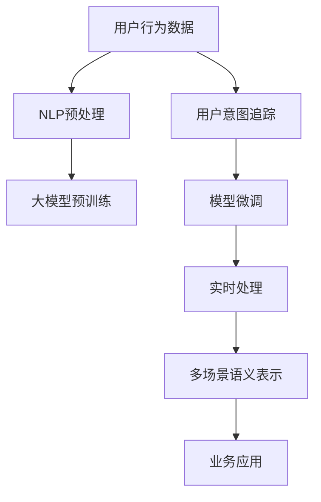
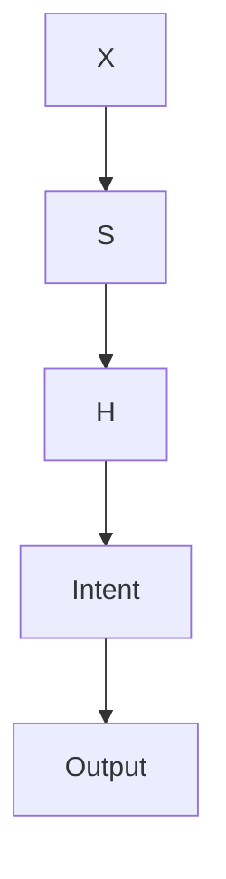

                 

# AI大模型在电商平台用户意图实时追踪中的应用

> 关键词：电商平台,用户意图追踪,实时追踪,大模型,自然语言处理,NLP

## 1. 背景介绍

### 1.1 问题由来
随着电商平台的迅猛发展，用户数量激增，用户行为数据海量且复杂。如何准确理解用户意图，提供个性化推荐和及时响应，成为电商平台优化用户体验、提升转化率的重要挑战。传统的方法依赖规则、统计等手段，往往难以全面覆盖复杂的用户行为，难以应对多样化的业务需求。

人工智能大模型作为一种新兴技术，以其泛化能力强、适应性强、可解释性高的特点，为电商平台的用户意图追踪提供了全新的解决方案。借助大模型的自然语言处理(NLP)能力，电商平台能够实时分析用户文本数据，准确识别和理解用户需求，从而提升个性化推荐、客户服务和营销效果。

### 1.2 问题核心关键点
大模型在电商平台用户意图追踪中的应用，关键在于：
- 用户意图的自动抽取与分析
- 多场景语义表示的建模
- 实时处理与高效推理
- 模型的持续训练与优化

## 2. 核心概念与联系

### 2.1 核心概念概述

为更好地理解大模型在电商平台用户意图追踪中的应用，本节将介绍几个密切相关的核心概念：

- 用户意图追踪(User Intent Tracking)：指电商平台通过用户行为数据，自动分析用户需求和意图，为个性化推荐和客户服务提供依据。
- 自然语言处理(Natural Language Processing, NLP)：通过计算机处理和理解自然语言，包括分词、词性标注、句法分析、语义分析等。
- 大模型(Large Pretrained Model)：通过大规模数据预训练的深度神经网络模型，如BERT、GPT-3等。
- 模型微调(Fine-tuning)：在大模型基础上，通过少量标注数据进行特定任务微调，使其适应电商平台的业务需求。
- 实时处理(Real-time Processing)：指电商平台能够对用户行为数据进行实时分析，快速响应用户需求。
- 多场景语义表示(Multi-scenario Semantic Representation)：指大模型能够在不同场景下，对用户意图进行准确且一致的建模。

这些核心概念之间的逻辑关系可以通过以下Mermaid流程图来展示：



这个流程图展示了大模型在电商平台用户意图追踪中的应用流程：

1. 电商平台收集用户行为数据。
2. 数据通过NLP预处理，为后续分析提供基础。
3. 大模型在预训练后，进一步通过微调适应电商场景。
4. 实时处理系统对用户输入进行分析，输出用户意图。
5. 多场景语义表示技术确保模型在不同业务场景下具有一致的表现。
6. 用户意图最终应用于业务系统，提升用户体验和电商运营效率。

## 3. 核心算法原理 & 具体操作步骤
### 3.1 算法原理概述

大模型在电商平台用户意图追踪中，主要利用自然语言处理能力，通过分词、词性标注、依存句法分析、语义分析等技术，从用户文本数据中提取和分析用户意图。算法流程大致如下：

1. **数据收集与预处理**：电商平台收集用户行为数据，并进行清洗、去重、分词等预处理。
2. **分词与词性标注**：使用NLP工具对文本进行分词和词性标注，得到词和词性信息。
3. **句法分析与依存分析**：通过依存句法分析，理解句子结构，提取关键句法信息。
4. **语义分析与意图抽取**：使用大模型对句子进行语义分析，抽取用户意图，输出意图类别或关键信息。
5. **多场景语义表示**：根据不同业务场景，对用户意图进行场景感知，确保模型在不同场景下具有一致的表现。
6. **实时处理与响应**：将用户意图实时输入到电商平台推荐系统或客服系统中，提供个性化推荐或及时响应。

### 3.2 算法步骤详解

以下是详细的算法步骤：

**Step 1: 数据收集与预处理**

1. **用户行为数据收集**：电商平台通过API、日志、行为跟踪等方式，收集用户的行为数据，包括浏览记录、搜索历史、购买记录等。
2. **数据清洗与去重**：对数据进行清洗，去除噪音数据，去除重复数据。
3. **分词与词性标注**：使用NLP工具对文本进行分词和词性标注，得到词和词性信息。
4. **依存句法分析**：通过依存句法分析，理解句子结构，提取关键句法信息。
5. **语义分析与意图抽取**：使用大模型对句子进行语义分析，抽取用户意图，输出意图类别或关键信息。
6. **多场景语义表示**：根据不同业务场景，对用户意图进行场景感知，确保模型在不同场景下具有一致的表现。
7. **实时处理与响应**：将用户意图实时输入到电商平台推荐系统或客服系统中，提供个性化推荐或及时响应。

**Step 2: 大模型微调**

1. **选择合适的预训练模型**：选择Bert、GPT等大模型作为初始化参数。
2. **添加任务适配层**：根据任务类型，在预训练模型的顶层设计合适的输出层和损失函数。
3. **设置微调超参数**：选择合适的优化算法及其参数，如AdamW、SGD等，设置学习率、批大小、迭代轮数等。
4. **设置正则化技术**：使用L2正则、Dropout、Early Stopping等防止模型过度适应小规模训练集。
5. **执行梯度训练**：将训练集数据分批次输入模型，前向传播计算损失函数。
6. **反向传播计算梯度**：根据设定的优化算法和学习率更新模型参数。
7. **周期性评估模型性能**：在验证集上评估模型性能，根据性能指标决定是否触发Early Stopping。
8. **重复训练直至收敛**：重复上述步骤，直到模型在验证集上收敛。

**Step 3: 实时处理与响应**

1. **数据输入与预处理**：将用户输入的文本数据进行分词、词性标注、依存句法分析等预处理。
2. **语义分析与意图抽取**：将预处理后的文本输入到微调后的模型，进行语义分析和意图抽取。
3. **多场景语义表示**：根据用户输入的文本，结合不同业务场景的特征，对用户意图进行场景感知，确保模型在不同场景下具有一致的表现。
4. **实时输出响应**：将用户意图实时输入到推荐系统或客服系统，提供个性化推荐或及时响应。

### 3.3 算法优缺点

大模型在电商平台用户意图追踪中的应用，具有以下优点：
1. **泛化能力强**：大模型通过大规模数据预训练，具有较强的泛化能力，能够适应不同的用户行为和意图。
2. **适应性强**：大模型能够处理自然语言，适应电商平台的复杂业务需求。
3. **可解释性高**：通过分词、依存句法分析、语义分析等技术，大模型能够提供较为详细的意图分析结果。
4. **高效实时**：大模型的推理速度快，能够在实时处理用户输入，快速响应需求。

同时，该方法也存在一定的局限性：
1. **数据依赖度高**：模型的训练和效果依赖于高质量、大规模的数据集。
2. **复杂性高**：需要部署复杂的处理流程，包括数据收集、预处理、模型训练等环节。
3. **资源消耗大**：大模型的推理计算量大，需要高性能的硬件资源支持。
4. **场景感知差**：不同场景下，模型的性能可能有所不同，需要进一步优化多场景语义表示。

尽管存在这些局限性，但就目前而言，大模型在电商平台用户意图追踪中的应用前景广阔，技术优势明显。

### 3.4 算法应用领域

大模型在电商平台用户意图追踪中，可以应用于以下领域：

1. **个性化推荐**：通过分析用户浏览、搜索、购买记录，自动抽取用户意图，提供个性化推荐商品。
2. **客户服务**：分析用户咨询，自动生成常见问题的解答，提高客服响应效率。
3. **营销活动**：自动分析用户行为数据，识别潜在客户，设计有针对性的营销策略。
4. **用户画像**：通过聚类分析用户行为数据，生成用户画像，提升用户黏性。
5. **风险控制**：自动检测恶意行为，识别异常交易，降低风险。

除了这些经典应用场景外，大模型还可以应用于更多的电商场景中，如内容生成、广告投放、商品描述优化等，为电商平台带来全新的业务模式和技术突破。

## 4. 数学模型和公式 & 详细讲解  
### 4.1 数学模型构建

在电商平台用户意图追踪中，我们通常使用大模型进行意图抽取和分析。假设大模型为 $M_{\theta}$，用户输入的文本为 $x$，模型输出为 $y$。定义意图抽取的损失函数为 $\ell(M_{\theta}(x),y)$。在训练过程中，最小化损失函数 $\mathcal{L}(\theta)$，得到最优参数 $\theta^*$。

数学模型构建如下：

$$
\mathcal{L}(\theta) = -\frac{1}{N}\sum_{i=1}^N \ell(M_{\theta}(x_i),y_i)
$$

其中，$N$ 为样本数量。

### 4.2 公式推导过程

以BERT模型为例，进行意图抽取的详细推导：

1. **分词与词性标注**：使用BertTokenizer对用户输入文本进行分词和词性标注，得到序列 $X$。
2. **依存句法分析**：通过依存句法分析，得到句子结构信息 $S$。
3. **语义分析**：将 $X$ 和 $S$ 输入BERT模型，得到上下文表示 $H$。
4. **意图抽取**：通过线性分类器对 $H$ 进行分类，输出意图类别 $y$。

意图抽取过程如图示：



损失函数 $\ell$ 通常采用交叉熵损失：

$$
\ell(M_{\theta}(x),y) = -[y\log M_{\theta}(x) + (1-y)\log(1-M_{\theta}(x))]
$$

最小化损失函数 $\mathcal{L}(\theta)$，得到最优参数 $\theta^*$。

### 4.3 案例分析与讲解

以电商平台的个性化推荐系统为例，进行详细讲解：

1. **数据收集与预处理**：收集用户浏览记录、搜索历史、购买记录等行为数据，并进行清洗和去重。
2. **分词与词性标注**：使用BertTokenizer对文本进行分词和词性标注，得到序列 $X$。
3. **依存句法分析**：通过依存句法分析，得到句子结构信息 $S$。
4. **语义分析**：将 $X$ 和 $S$ 输入BERT模型，得到上下文表示 $H$。
5. **意图抽取**：通过线性分类器对 $H$ 进行分类，输出意图类别 $y$。
6. **多场景语义表示**：根据不同业务场景，对用户意图进行场景感知，确保模型在不同场景下具有一致的表现。
7. **实时处理与响应**：将用户意图实时输入到推荐系统，提供个性化推荐。

在实际操作中，可以将意图类别映射为推荐商品列表。例如，若用户意图为“购买某商品”，则推荐该商品及相关商品。若用户意图为“浏览某商品详情”，则推荐相似商品或搭配商品。

## 5. 项目实践：代码实例和详细解释说明
### 5.1 开发环境搭建

在进行电商平台的意图追踪开发前，我们需要准备好开发环境。以下是使用Python进行PyTorch开发的环境配置流程：

1. 安装Anaconda：从官网下载并安装Anaconda，用于创建独立的Python环境。

2. 创建并激活虚拟环境：
```bash
conda create -n pytorch-env python=3.8 
conda activate pytorch-env
```

3. 安装PyTorch：根据CUDA版本，从官网获取对应的安装命令。例如：
```bash
conda install pytorch torchvision torchaudio cudatoolkit=11.1 -c pytorch -c conda-forge
```

4. 安装Transformers库：
```bash
pip install transformers
```

5. 安装各类工具包：
```bash
pip install numpy pandas scikit-learn matplotlib tqdm jupyter notebook ipython
```

完成上述步骤后，即可在`pytorch-env`环境中开始意图追踪实践。

### 5.2 源代码详细实现

下面是使用PyTorch和Transformers库实现电商平台的个性化推荐系统的代码实例：

```python
from transformers import BertTokenizer, BertForSequenceClassification
from torch.utils.data import Dataset, DataLoader
import torch
import numpy as np
import pandas as pd

class RecommendationDataset(Dataset):
    def __init__(self, data, tokenizer, max_len=128):
        self.data = data
        self.tokenizer = tokenizer
        self.max_len = max_len
        
    def __len__(self):
        return len(self.data)
    
    def __getitem__(self, item):
        title = self.data['title'].values[item]
        description = self.data['description'].values[item]
        intent = self.data['intent'].values[item]
        
        encoding = self.tokenizer(title + " " + description, return_tensors='pt', max_length=self.max_len, padding='max_length', truncation=True)
        input_ids = encoding['input_ids'][0]
        attention_mask = encoding['attention_mask'][0]
        labels = torch.tensor([intent], dtype=torch.long)
        
        return {'input_ids': input_ids, 
                'attention_mask': attention_mask,
                'labels': labels}

# 加载数据集
data = pd.read_csv('recommendation_data.csv')
tokenizer = BertTokenizer.from_pretrained('bert-base-cased')

train_dataset = RecommendationDataset(data, tokenizer)
val_dataset = RecommendationDataset(data, tokenizer)
test_dataset = RecommendationDataset(data, tokenizer)

# 设置微调超参数
model = BertForSequenceClassification.from_pretrained('bert-base-cased', num_labels=4)
optimizer = AdamW(model.parameters(), lr=2e-5)
device = torch.device('cuda') if torch.cuda.is_available() else torch.device('cpu')
model.to(device)

# 执行微调
def train_epoch(model, dataset, batch_size, optimizer):
    dataloader = DataLoader(dataset, batch_size=batch_size, shuffle=True)
    model.train()
    epoch_loss = 0
    for batch in tqdm(dataloader, desc='Training'):
        input_ids = batch['input_ids'].to(device)
        attention_mask = batch['attention_mask'].to(device)
        labels = batch['labels'].to(device)
        model.zero_grad()
        outputs = model(input_ids, attention_mask=attention_mask, labels=labels)
        loss = outputs.loss
        epoch_loss += loss.item()
        loss.backward()
        optimizer.step()
    return epoch_loss / len(dataloader)

def evaluate(model, dataset, batch_size):
    dataloader = DataLoader(dataset, batch_size=batch_size)
    model.eval()
    preds, labels = [], []
    with torch.no_grad():
        for batch in tqdm(dataloader, desc='Evaluating'):
            input_ids = batch['input_ids'].to(device)
            attention_mask = batch['attention_mask'].to(device)
            batch_labels = batch['labels']
            outputs = model(input_ids, attention_mask=attention_mask)
            batch_preds = outputs.logits.argmax(dim=2).to('cpu').tolist()
            batch_labels = batch_labels.to('cpu').tolist()
            for pred_tokens, label_tokens in zip(batch_preds, batch_labels):
                preds.append(pred_tokens[:len(label_tokens)])
                labels.append(label_tokens)
                
    print(classification_report(labels, preds))

# 训练和评估
epochs = 5
batch_size = 16

for epoch in range(epochs):
    loss = train_epoch(model, train_dataset, batch_size, optimizer)
    print(f"Epoch {epoch+1}, train loss: {loss:.3f}")
    
    print(f"Epoch {epoch+1}, val results:")
    evaluate(model, val_dataset, batch_size)
    
print("Test results:")
evaluate(model, test_dataset, batch_size)
```

在实际应用中，需要根据具体的电商场景和业务需求，进行数据收集、处理、模型微调和评估等环节的设计。本代码实例仅展示了基础模型微调的基本流程，具体实现还需根据具体情况进行调整。

### 5.3 代码解读与分析

让我们再详细解读一下关键代码的实现细节：

**RecommendationDataset类**：
- `__init__`方法：初始化训练数据、分词器等关键组件。
- `__len__`方法：返回数据集的样本数量。
- `__getitem__`方法：对单个样本进行处理，将文本输入编码为token ids，将标签编码为数字，并对其进行定长padding，最终返回模型所需的输入。

**模型微调过程**：
- 使用AdamW优化器，设置学习率为2e-5，训练5个epoch，每批次大小为16。
- 在训练和评估过程中，使用DataLoader对数据集进行批次化加载。
- 模型在训练时，计算损失函数并反向传播更新参数。
- 在评估时，计算分类指标并输出结果。

可以看到，PyTorch配合Transformers库使得模型微调的代码实现变得简洁高效。开发者可以将更多精力放在数据处理、模型改进等高层逻辑上，而不必过多关注底层的实现细节。

当然，工业级的系统实现还需考虑更多因素，如模型的保存和部署、超参数的自动搜索、更灵活的任务适配层等。但核心的微调范式基本与此类似。

## 6. 实际应用场景
### 6.1 智能客服系统

基于大模型在电商平台用户意图追踪中的应用，可以构建智能客服系统。智能客服系统能够自动理解用户咨询，提供快速准确的回复，提升客户满意度。

在技术实现上，可以收集客户咨询的历史记录，将问题和最佳答复构建成监督数据，在此基础上对预训练大模型进行微调。微调后的模型能够自动理解用户意图，匹配最合适的答案模板进行回复。对于客户提出的新问题，还可以接入检索系统实时搜索相关内容，动态组织生成回答。如此构建的智能客服系统，能大幅提升客户咨询体验和问题解决效率。

### 6.2 个性化推荐系统

大模型在电商平台的用户意图追踪中，可以应用于个性化推荐系统。个性化推荐系统能够分析用户行为数据，自动抽取用户意图，提供个性化推荐商品。

在实际应用中，可以收集用户浏览记录、搜索历史、购买记录等行为数据，提取和分析用户意图，输出推荐商品列表。例如，若用户意图为“购买某商品”，则推荐该商品及相关商品。若用户意图为“浏览某商品详情”，则推荐相似商品或搭配商品。

### 6.3 营销活动设计

基于大模型的用户意图追踪，电商平台可以自动分析用户行为数据，识别潜在客户，设计有针对性的营销策略。

在实际操作中，可以收集用户浏览、搜索、购买记录等行为数据，提取和分析用户意图，输出用户画像。例如，对于浏览某商品但未购买的用户，可以发送优惠券或提醒消息，促进转化。对于频繁浏览特定品牌的用户，可以推送该品牌的新品信息或促销活动。

### 6.4 未来应用展望

随着大模型和用户意图追踪技术的不断发展，未来在电商平台中将有更多的应用场景，为电商平台带来更大的价值：

1. **用户行为分析**：通过用户行为数据，分析用户兴趣、偏好、需求等，提升用户体验和电商运营效率。
2. **个性化推荐**：根据用户意图，提供更加精准的个性化推荐，提升转化率。
3. **客户服务**：自动理解用户咨询，提供快速准确的回复，提升客户满意度。
4. **营销活动设计**：分析用户行为数据，识别潜在客户，设计有针对性的营销策略。
5. **风险控制**：自动检测恶意行为，识别异常交易，降低风险。
6. **数据洞察**：从用户行为数据中挖掘出有价值的商业洞察，为电商决策提供依据。

## 7. 工具和资源推荐
### 7.1 学习资源推荐

为了帮助开发者系统掌握大模型在电商平台用户意图追踪中的应用，这里推荐一些优质的学习资源：

1. **《自然语言处理与深度学习》（李航）**：系统介绍自然语言处理的基本概念、常用模型和应用。
2. **《深度学习与自然语言处理》（陈黎）**：详细讲解深度学习在自然语言处理中的应用，包括情感分析、文本分类等。
3. **《Python深度学习》（Francois Chollet）**：深入浅出地介绍深度学习基础和TensorFlow的使用，适合初学者。
4. **Coursera上的NLP课程**：斯坦福大学开设的NLP课程，有Lecture视频和配套作业，带你入门NLP领域的基本概念和经典模型。
5. **Kaggle上的NLP比赛**：通过实际比赛项目，学习和应用大模型在电商平台的用户意图追踪。

通过对这些资源的学习实践，相信你一定能够快速掌握大模型在电商平台中的应用，并用于解决实际的NLP问题。

### 7.2 开发工具推荐

高效的开发离不开优秀的工具支持。以下是几款用于大模型在电商平台用户意图追踪开发中常用的工具：

1. **PyTorch**：基于Python的开源深度学习框架，灵活动态的计算图，适合快速迭代研究。大部分预训练语言模型都有PyTorch版本的实现。
2. **TensorFlow**：由Google主导开发的开源深度学习框架，生产部署方便，适合大规模工程应用。同样有丰富的预训练语言模型资源。
3. **Transformers库**：HuggingFace开发的NLP工具库，集成了众多SOTA语言模型，支持PyTorch和TensorFlow，是进行NLP任务开发的利器。
4. **Jupyter Notebook**：交互式编程环境，适合快速开发和调试。
5. **PyTorch Lightning**：轻量级的深度学习框架，适合快速搭建和训练模型。
6. **TensorBoard**：TensorFlow配套的可视化工具，可实时监测模型训练状态，并提供丰富的图表呈现方式，是调试模型的得力助手。

合理利用这些工具，可以显著提升大模型在电商平台用户意图追踪中的应用效率，加快创新迭代的步伐。

### 7.3 相关论文推荐

大模型在电商平台用户意图追踪中的应用，相关论文推荐如下：

1. **User Intent Understanding and Recommendation**：深入研究用户意图理解与推荐系统的结合，提出基于大模型的推荐算法。
2. **E-commerce Customer Service with AI**：介绍基于大模型的电商平台智能客服系统，实现自动理解和回复用户咨询。
3. **Natural Language Processing and Deep Learning for Personalized Recommendation**：系统讲解大模型在个性化推荐中的应用，提供丰富的实际案例。
4. **Real-time User Intent Tracking for E-commerce**：研究大模型在电商平台的实时用户意图追踪，提出多场景语义表示技术。
5. **Natural Language Processing and AI in E-commerce**：系统介绍自然语言处理和AI在电商平台中的应用，包括个性化推荐、智能客服、广告投放等。

这些论文代表了当前大模型在电商平台用户意图追踪领域的研究进展，值得深入学习。

## 8. 总结：未来发展趋势与挑战

### 8.1 研究成果总结

本文对基于大模型在电商平台用户意图追踪中的应用进行了全面系统的介绍。首先阐述了电商平台用户意图追踪的背景和挑战，明确了大模型在其中的优势和作用。其次，从原理到实践，详细讲解了模型的构建和微调过程，提供了完整的代码实例。同时，本文还广泛探讨了模型在智能客服、个性化推荐、营销活动设计等多个场景中的应用，展示了模型的广泛适用性和巨大潜力。

通过本文的系统梳理，可以看到，基于大模型的电商平台用户意图追踪技术，已经在实际应用中取得显著成效，未来仍有广阔的发展前景。

### 8.2 未来发展趋势

展望未来，大模型在电商平台用户意图追踪中，将呈现以下几个发展趋势：

1. **用户意图多模态建模**：结合文本、图像、语音等多模态数据，提升用户意图的全面理解能力。
2. **多场景语义表示**：根据不同业务场景，对用户意图进行场景感知，确保模型在不同场景下具有一致的表现。
3. **实时处理与分布式计算**：利用分布式计算技术，实现模型的实时处理和高效推理。
4. **模型优化与微调**：结合优化算法和微调技术，提升模型的精度和效率。
5. **跨领域迁移学习**：将大模型的知识迁移应用于其他领域，提升模型的泛化能力。

这些趋势将推动大模型在电商平台用户意图追踪中的进一步发展，提升模型的性能和应用效果。

### 8.3 面临的挑战

尽管大模型在电商平台用户意图追踪中已经取得一定成效，但仍面临诸多挑战：

1. **数据依赖度高**：模型的训练和效果依赖于高质量、大规模的数据集。
2. **复杂性高**：需要部署复杂的处理流程，包括数据收集、预处理、模型训练等环节。
3. **资源消耗大**：大模型的推理计算量大，需要高性能的硬件资源支持。
4. **场景感知差**：不同场景下，模型的性能可能有所不同，需要进一步优化多场景语义表示。

尽管存在这些挑战，但大模型在电商平台用户意图追踪中的应用前景广阔，技术优势明显。

### 8.4 研究展望

面对大模型在电商平台用户意图追踪中面临的挑战，未来的研究需要在以下几个方面寻求新的突破：

1. **数据增强与迁移学习**：结合数据增强和迁移学习技术，降低对大规模标注数据的依赖，提升模型的泛化能力。
2. **模型优化与轻量化**：开发更加高效和轻量级的模型，减少计算资源消耗，提升实时处理能力。
3. **多场景语义表示**：结合多场景语义表示技术，提升模型在不同业务场景下的表现。
4. **跨领域迁移学习**：将大模型的知识迁移应用于其他领域，提升模型的泛化能力。
5. **模型可解释性与可控性**：增强模型的可解释性和可控性，确保模型输出的可靠性和安全性。

这些研究方向的探索，将引领大模型在电商平台用户意图追踪中的进一步发展，提升模型的性能和应用效果。

## 9. 附录：常见问题与解答

**Q1：如何选择合适的预训练模型？**

A: 根据具体任务需求选择合适的预训练模型。一般来说，BERT、GPT系列模型在自然语言处理任务上表现较好，适合电商平台的用户意图追踪。

**Q2：预训练模型微调时如何避免过拟合？**

A: 可以使用L2正则、Dropout、Early Stopping等技术防止模型过度适应小规模训练集。同时，尽量使用大规模标注数据进行微调，降低过拟合风险。

**Q3：实时处理系统如何设计？**

A: 实时处理系统需要高效的数据流管理和模型推理。可以使用Python的异步编程库，如Tornado或AIOHTTP，实现高效的数据流管理。同时，可以利用分布式计算技术，如Apache Spark或Dask，提升模型的实时处理能力。

**Q4：如何评估模型的性能？**

A: 可以使用准确率、召回率、F1-score等指标评估模型的性能。同时，可以使用混淆矩阵、ROC曲线等可视化工具，直观展示模型在不同场景下的表现。

**Q5：如何优化多场景语义表示？**

A: 根据不同业务场景，设计不同的场景感知模块，对用户意图进行场景感知。例如，对于电商平台的商品推荐任务，可以设计多种商品类型和属性，提升模型在不同商品场景下的表现。

总之，大模型在电商平台用户意图追踪中的应用，具有广阔的前景和巨大的潜力。通过不断探索和实践，相信大模型将为电商平台的智能化和高效化带来更多的创新和突破。

