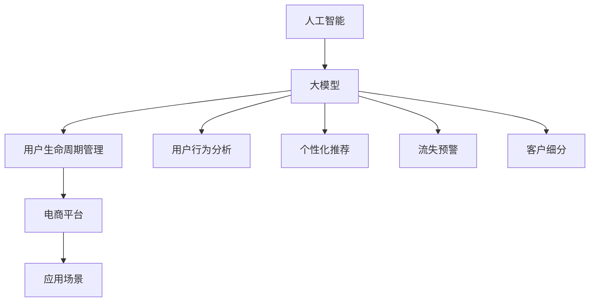

                 

# AI大模型在电商平台用户生命周期管理中的作用

> 关键词：人工智能,大模型,用户生命周期管理,电商平台,应用场景

## 1. 背景介绍

随着电商平台的迅猛发展，用户生命周期管理（User Lifecycle Management, ULGM）已成为电商平台提升用户留存、提高用户价值的关键。通过精准识别和细分用户，电商平台可以制定更有效的营销策略，实现个性化服务，提升用户体验和转化率。然而，传统的数据驱动方法依赖于人工标注和手动干预，成本高、效率低，难以应对海量数据的处理需求。近年来，随着AI大模型的出现，电商平台开始探索将大模型应用于用户生命周期管理，以期大幅提升管理效果。

### 1.1 问题由来

电商平台的生命周期管理主要包括以下几个阶段：

- **获取阶段**：吸引新用户注册并完成首次购买。
- **成长阶段**：引导用户增加购买频率和金额，提升用户活跃度和忠诚度。
- **成熟阶段**：提供差异化服务，实现用户的价值最大化。
- **衰退阶段**：及时识别并干预，减少用户流失，实现用户价值再生。

传统方法在各个阶段都存在数据处理和模型训练的挑战：

- **数据获取**：用户行为数据通常通过用户在平台上的行为记录获得，但这些数据量大且冗杂，提取有价值的特征困难。
- **模型训练**：需构建和训练多个模型，每个模型聚焦特定阶段或细分用户群体，且难以共享中间特征，计算资源消耗大。
- **模型评估**：需要实时监控模型的性能变化，并对不同阶段的用户行为进行持续分析。

这些问题催生了对一种能够高效处理用户行为数据、识别用户行为变化，并提供个性化服务的AI解决方案的需求。

## 2. 核心概念与联系

### 2.1 核心概念概述

为更好地理解AI大模型在电商平台用户生命周期管理中的应用，本节将介绍几个关键概念：

- **人工智能（AI）**：通过模拟人类智能行为和思维过程，使计算机系统具备学习、推理、决策等能力的技术。
- **大模型（Large Model）**：指具有亿级参数量级的深度神经网络模型，如BERT、GPT-3等。大模型具有强大的泛化能力和学习能力，能够处理复杂的自然语言处理（NLP）任务。
- **用户生命周期管理（ULGM）**：通过精准识别和细分用户，针对不同阶段用户制定差异化的营销策略，实现用户价值的最大化。
- **电商平台**：基于互联网的在线零售平台，通过提供商品和服务，实现用户价值最大化和业务增长。
- **应用场景**：在电商平台中，AI大模型用于用户行为分析、个性化推荐、流失预警、客户细分等场景，提升用户生命周期管理的效率和效果。

这些概念之间的关系可以通过以下Mermaid流程图来展示：



这个流程图展示了从人工智能技术到具体应用场景的过程：

1. 人工智能是基础，通过深度学习模型和大模型提供强大的数据处理和分析能力。
2. 大模型作为核心技术，通过预训练和微调等手段，具备处理复杂NLP任务的能力。
3. 用户生命周期管理是目标，通过精准的用户细分和差异化策略，提升用户价值。
4. 电商平台是应用场景，通过具体的应用实例，如个性化推荐和流失预警，实现ULGM目标。

## 3. 核心算法原理 & 具体操作步骤
### 3.1 算法原理概述

AI大模型在电商平台ULGM中的应用，本质上是一个基于深度学习的用户行为预测和细分问题。其核心思想是通过大模型学习用户行为序列和行为特征，实现对用户生命周期各阶段的识别和细分。具体流程如下：

1. **数据收集**：收集用户在电商平台上的行为数据，包括浏览、点击、购买、评价等行为记录。
2. **特征提取**：通过大模型学习用户行为序列，提取有价值的特征，如用户的购买历史、浏览偏好、访问时长等。
3. **用户细分**：通过大模型对用户行为进行聚类和分类，识别出不同生命周期阶段的用户，如新用户、忠实用户、流失用户等。
4. **个性化服务**：针对不同细分用户，制定差异化的营销策略，实现个性化推荐和服务。

### 3.2 算法步骤详解

以下是基于大模型的电商平台ULGM应用的详细步骤：

**Step 1: 数据收集与预处理**

1. **行为数据收集**：收集用户在电商平台上的各类行为数据，如浏览行为、购买行为、评价行为等。
2. **数据清洗**：去除不完整、重复或异常的数据，确保数据的准确性和完整性。
3. **数据归一化**：对不同类型的数据进行归一化处理，如将时间戳转化为时间序列数据，对数值型数据进行标准化处理。

**Step 2: 特征提取与建模**

1. **行为序列编码**：将用户行为数据转化为行为序列，如点击序列、购买序列等。
2. **用户行为特征提取**：利用大模型学习用户行为序列，提取特征。
3. **模型选择**：选择合适的深度学习模型，如LSTM、GRU、Transformer等，进行行为预测和分类。

**Step 3: 用户细分与策略制定**

1. **用户行为聚类**：通过聚类算法对用户行为进行分类，识别不同生命周期阶段的用户。
2. **细分用户特征提取**：提取每个细分用户的核心特征，如购买频率、消费金额、访问时长等。
3. **策略制定**：根据用户细分结果，制定差异化的营销策略，如新用户欢迎包、忠诚用户专享优惠、流失用户召回方案等。

**Step 4: 模型评估与优化**

1. **模型评估**：利用A/B测试、对比实验等方法，评估不同策略的效果，选择最优策略。
2. **模型优化**：根据模型评估结果，优化模型参数和超参数，提升模型性能。

### 3.3 算法优缺点

基于大模型的电商平台ULGM方法具有以下优点：

1. **自动化程度高**：大模型能够自动处理海量用户行为数据，自动识别用户生命周期阶段，减少人工干预。
2. **泛化能力强**：大模型具备强大的泛化能力，能够处理复杂的NLP任务，适用于多种电商场景。
3. **效率高**：利用大模型进行特征提取和行为预测，大幅提高计算效率，减少计算资源消耗。
4. **灵活性高**：大模型可以动态更新和优化，适用于不同电商平台和用户群体。

同时，该方法也存在一些局限性：

1. **数据质量要求高**：需要高质量、完整、准确的用户行为数据，对数据处理和清洗要求高。
2. **模型复杂度高**：大模型参数量庞大，计算资源消耗大，需要高性能计算设备支持。
3. **解释性差**：大模型作为"黑盒"系统，难以解释内部决策逻辑，对模型信任度低。
4. **隐私风险**：用户行为数据涉及隐私保护，数据处理和存储需遵守相关法律法规。

尽管存在这些局限性，但大模型在电商平台的ULGM中仍具有显著优势，能够大幅提升电商平台的运营效率和用户价值。

### 3.4 算法应用领域

AI大模型在电商平台ULGM中的应用已广泛应用于多个领域，如：

- **个性化推荐**：通过大模型学习用户行为序列，实现个性化推荐，提升用户购买率和满意度。
- **流失预警**：利用大模型预测用户流失概率，及时采取干预措施，减少用户流失率。
- **客户细分**：通过聚类算法对用户行为进行分类，识别不同细分用户群体，实现差异化营销。
- **智能客服**：利用大模型构建智能客服系统，实时回答用户咨询，提升用户服务体验。
- **内容推荐**：通过大模型学习用户兴趣和偏好，实现内容推荐，提升内容价值和用户粘性。

这些应用场景展示了AI大模型在电商平台中的广泛应用和显著效果。

## 4. 数学模型和公式 & 详细讲解 & 举例说明

### 4.1 数学模型构建

以用户行为序列预测为例，构建基于大模型的行为预测模型。

假设用户行为序列为 $\{x_t\}_{t=1}^T$，其中 $x_t$ 表示用户在第 $t$ 个时间点的行为，如浏览、点击、购买等。模型目标为预测用户行为序列中的下一个行为 $x_{t+1}$。

### 4.2 公式推导过程

利用Transformer模型进行用户行为序列预测，模型的输入序列为 $x=\{x_t\}_{t=1}^T$，输出序列为 $\hat{x}=\{x_{t+1}\}_{t=1}^T$。模型的预测公式如下：

$$
\hat{x}_{t+1} = M_\theta(x_t, x_{t-1}, ..., x_1)
$$

其中，$M_\theta$ 为Transformer模型，$\theta$ 为模型参数。Transformer模型由多个自注意力层和全连接层组成，能够有效处理序列数据。

### 4.3 案例分析与讲解

以Amazon为例，分析其使用大模型进行用户行为预测和分类的案例：

1. **数据收集**：收集用户在Amazon上的浏览、购买、评价等行为数据，构建用户行为序列。
2. **特征提取**：利用BERT模型学习用户行为序列，提取特征。
3. **行为预测**：使用Transformer模型预测用户下一种行为，如购买行为。
4. **用户分类**：通过聚类算法对用户行为进行分类，识别新用户、忠诚用户、流失用户等。
5. **策略制定**：针对不同用户群体，制定个性化推荐策略和流失干预方案。

通过上述案例，我们可以看到，大模型在电商平台ULGM中具有显著的效果和应用价值。

## 5. 项目实践：代码实例和详细解释说明
### 5.1 开发环境搭建

在进行AI大模型在电商平台ULGM中的实践前，我们需要准备好开发环境。以下是使用Python进行TensorFlow开发的环境配置流程：

1. 安装Anaconda：从官网下载并安装Anaconda，用于创建独立的Python环境。

2. 创建并激活虚拟环境：
```bash
conda create -n tf-env python=3.8 
conda activate tf-env
```

3. 安装TensorFlow：根据CUDA版本，从官网获取对应的安装命令。例如：
```bash
conda install tensorflow -c tensorflow -c conda-forge
```

4. 安装各类工具包：
```bash
pip install numpy pandas scikit-learn matplotlib tqdm jupyter notebook ipython
```

完成上述步骤后，即可在`tf-env`环境中开始实践。

### 5.2 源代码详细实现

下面以基于LSTM模型进行用户行为预测为例，给出使用TensorFlow进行用户行为预测的代码实现。

首先，定义行为数据处理函数：

```python
import tensorflow as tf
from tensorflow.keras.layers import Input, LSTM, Dense, Embedding
from tensorflow.keras.models import Model

def process_data(data):
    input_data = tf.stack(data, axis=1)
    return input_data
```

然后，定义模型架构：

```python
def build_model(input_shape, output_shape):
    input = Input(shape=input_shape, name='input')
    embedding = Embedding(input_dim=1000, output_dim=256, name='embedding')(input)
    lstm = LSTM(128, return_sequences=True, name='lstm')(embedding)
    output = Dense(output_shape, activation='softmax', name='output')(lstm)
    model = Model(inputs=input, outputs=output)
    return model
```

接着，编译和训练模型：

```python
def train_model(model, input_data, output_data, batch_size, epochs):
    model.compile(optimizer='adam', loss='categorical_crossentropy', metrics=['accuracy'])
    model.fit(input_data, output_data, batch_size=batch_size, epochs=epochs, validation_split=0.2)
```

最后，测试模型并进行预测：

```python
def test_model(model, input_data, output_data):
    test_loss, test_accuracy = model.evaluate(input_data, output_data)
    print(f'Test loss: {test_loss:.4f}')
    print(f'Test accuracy: {test_accuracy:.4f}')

def predict(model, input_data):
    output_data = model.predict(input_data)
    return output_data.argmax(axis=1)
```

以上就是使用TensorFlow对用户行为序列进行预测的完整代码实现。可以看到，通过TensorFlow的高级API，构建和训练模型变得非常便捷。

### 5.3 代码解读与分析

让我们再详细解读一下关键代码的实现细节：

**process_data函数**：
- 定义行为数据处理函数，将行为序列转化为模型输入，并进行归一化处理。

**build_model函数**：
- 定义模型架构，包括嵌入层、LSTM层和全连接层，利用LSTM处理序列数据，输出层进行行为预测。

**train_model函数**：
- 编译模型，设置优化器、损失函数和评价指标。
- 训练模型，设置批次大小和训练轮数，利用验证集评估模型性能。

**test_model函数**：
- 在测试集上评估模型性能，输出模型精度和损失。

**predict函数**：
- 利用训练好的模型对新行为序列进行预测，输出预测结果。

可以看出，TensorFlow提供的高阶API大大简化了模型构建和训练过程，使开发者能够快速上手实现电商平台的ULGM。

## 6. 实际应用场景
### 6.1 智能推荐系统

智能推荐系统是电商平台的重要组成部分，通过推荐用户可能感兴趣的商品，提升用户购买率和满意度。传统推荐系统基于协同过滤或基于内容的推荐方法，难以处理冷启动用户和长尾商品。

利用大模型进行推荐，可以解决这些痛点：

1. **处理冷启动用户**：通过分析用户行为序列，提取用户兴趣特征，实现对新用户的有效推荐。
2. **处理长尾商品**：通过聚类和分类算法，识别出用户偏好商品类别，实现长尾商品的精准推荐。

通过基于大模型的推荐系统，电商平台能够更高效地提升用户体验和用户粘性。

### 6.2 用户流失预警

用户流失是电商平台面临的主要挑战之一，流失用户不仅会减少收入，还会影响品牌声誉。利用大模型进行用户流失预警，可以帮助电商平台提前识别流失风险，采取有效的挽留措施。

具体流程如下：

1. **数据收集**：收集用户行为数据，包括购买频率、消费金额、访问时长等。
2. **特征提取**：利用大模型学习用户行为序列，提取关键特征。
3. **流失预测**：通过分类算法预测用户流失概率，及时采取干预措施。

通过基于大模型的流失预警系统，电商平台能够有效减少用户流失，提升用户价值。

### 6.3 客户细分与个性化营销

客户细分是电商平台的另一个重要任务，通过精准细分客户群体，制定差异化的营销策略，实现个性化服务和提升用户忠诚度。

利用大模型进行客户细分，可以：

1. **用户行为聚类**：通过聚类算法对用户行为进行分类，识别不同细分用户群体。
2. **细分用户特征提取**：提取每个细分用户的核心特征，如购买频率、消费金额、访问时长等。
3. **策略制定**：根据用户细分结果，制定差异化的营销策略，如新用户欢迎包、忠诚用户专享优惠、流失用户召回方案等。

通过基于大模型的客户细分系统，电商平台能够更精准地服务用户，提升用户价值和满意度。

## 7. 工具和资源推荐
### 7.1 学习资源推荐

为了帮助开发者系统掌握AI大模型在电商平台ULGM中的应用，这里推荐一些优质的学习资源：

1. **《深度学习理论与实践》**：介绍深度学习理论和实践的基础知识，涵盖TensorFlow、PyTorch等主流框架。
2. **《Python深度学习》**：适合初学者的入门书籍，介绍深度学习模型的构建和训练。
3. **《自然语言处理入门》**：介绍自然语言处理的基本概念和技术，涵盖语言模型、序列建模等。
4. **HuggingFace官方文档**：介绍Transformer模型和HuggingFace库的使用，提供丰富的预训练模型和微调样例。
5. **Kaggle竞赛**：参与Kaggle机器学习竞赛，实践AI大模型在电商平台的ULGM中的应用。

通过对这些资源的学习实践，相信你一定能够快速掌握AI大模型在电商平台ULGM中的应用。

### 7.2 开发工具推荐

高效的开发离不开优秀的工具支持。以下是几款用于AI大模型在电商平台ULGM中实践的常用工具：

1. TensorFlow：由Google主导开发的开源深度学习框架，生产部署方便，适合大规模工程应用。
2. PyTorch：基于Python的开源深度学习框架，灵活动态的计算图，适合快速迭代研究。
3. HuggingFace库：自然语言处理工具库，集成了众多SOTA模型，支持TensorFlow和PyTorch，是进行模型微调的重要工具。
4. Weights & Biases：模型训练的实验跟踪工具，可以记录和可视化模型训练过程中的各项指标，方便对比和调优。
5. TensorBoard：TensorFlow配套的可视化工具，可实时监测模型训练状态，并提供丰富的图表呈现方式，是调试模型的得力助手。

合理利用这些工具，可以显著提升AI大模型在电商平台ULGM中实践的开发效率，加快创新迭代的步伐。

### 7.3 相关论文推荐

AI大模型在电商平台ULGM中的应用源于学界的持续研究。以下是几篇奠基性的相关论文，推荐阅读：

1. Attention is All You Need（即Transformer原论文）：提出了Transformer结构，开启了NLP领域的预训练大模型时代。
2. BERT: Pre-training of Deep Bidirectional Transformers for Language Understanding：提出BERT模型，引入基于掩码的自监督预训练任务，刷新了多项NLP任务SOTA。
3. Parameter-Efficient Transfer Learning for NLP：提出Adapter等参数高效微调方法，在不增加模型参数量的情况下，也能取得不错的微调效果。
4. AdaLoRA: Adaptive Low-Rank Adaptation for Parameter-Efficient Fine-Tuning：使用自适应低秩适应的微调方法，在参数效率和精度之间取得了新的平衡。
5. FlowAI: Flow-aware Continuous Prompt Tuning for Multitask Pre-training：引入基于连续型Prompt的微调范式，为如何充分利用预训练知识提供了新的思路。

这些论文代表了大模型在电商平台ULGM中的发展脉络。通过学习这些前沿成果，可以帮助研究者把握学科前进方向，激发更多的创新灵感。

## 8. 总结：未来发展趋势与挑战
### 8.1 总结

本文对AI大模型在电商平台ULGM中的应用进行了全面系统的介绍。首先阐述了ULGM的重要性和AI大模型的优势，明确了大模型在电商平台的ULGM中发挥的重要作用。其次，从原理到实践，详细讲解了基于大模型的电商 ULGM 的数学模型和算法步骤，给出了电商 ULGM 任务开发的完整代码实例。同时，本文还广泛探讨了基于大模型在电商平台中的应用场景，展示了其广泛的应用前景。

通过本文的系统梳理，可以看到，AI大模型在电商平台ULGM中具有显著的优势，能够大幅提升电商平台的运营效率和用户价值。

### 8.2 未来发展趋势

展望未来，AI大模型在电商平台ULGM中的应用将呈现以下几个发展趋势：

1. **模型规模持续增大**：随着算力成本的下降和数据规模的扩张，AI大模型的参数量还将持续增长。超大规模语言模型蕴含的丰富语言知识，将支撑更加复杂多变的电商场景。
2. **微调方法日趋多样**：开发更加参数高效的微调方法，在固定大部分预训练参数的同时，只更新极少量的任务相关参数。同时优化微调模型的计算图，减少前向传播和反向传播的资源消耗，实现更加轻量级、实时性的部署。
3. **因果学习和对比学习的应用**：引入因果推断和对比学习思想，增强模型建立稳定因果关系的能力，学习更加普适、鲁棒的语言表征，从而提升模型泛化性和抗干扰能力。
4. **多模态融合与跨领域迁移**：将视觉、语音等多模态信息与文本信息进行协同建模，实现多模态融合。跨领域迁移能力将使模型能够适应不同电商平台的运营需求。
5. **用户行为预测与动态调整**：利用大模型实时预测用户行为，动态调整推荐策略和营销策略，实现更加个性化的用户体验。
6. **实时分析和快速响应**：实时监测用户行为数据，快速响应用户需求变化，提升用户满意度和忠诚度。

以上趋势凸显了AI大模型在电商平台ULGM中的广阔前景。这些方向的探索发展，将进一步提升电商平台的运营效率和用户价值，推动电商行业数字化转型。

### 8.3 面临的挑战

尽管AI大模型在电商平台ULGM中取得了显著效果，但在迈向更加智能化、普适化应用的过程中，它仍面临诸多挑战：

1. **数据质量要求高**：需要高质量、完整、准确的用户行为数据，对数据处理和清洗要求高。
2. **模型复杂度高**：大模型参数量庞大，计算资源消耗大，需要高性能计算设备支持。
3. **解释性差**：大模型作为"黑盒"系统，难以解释内部决策逻辑，对模型信任度低。
4. **隐私风险**：用户行为数据涉及隐私保护，数据处理和存储需遵守相关法律法规。
5. **实时性和效率**：实时监测和响应用户行为变化，需要高效的计算和存储能力，避免系统延迟和故障。

尽管存在这些挑战，但AI大模型在电商平台ULGM中的应用前景广阔，需要学界和产业界的共同努力，不断优化模型性能，提升系统效率和可靠性。

### 8.4 研究展望

未来的研究需要在以下几个方面寻求新的突破：

1. **自监督学习与无监督学习的应用**：探索无监督和半监督学习范式，摆脱对大规模标注数据的依赖，利用自监督学习、主动学习等方法，最大限度利用非结构化数据，实现更加灵活高效的微调。
2. **参数高效与计算高效的微调方法**：开发更加参数高效的微调方法，如Prefix-Tuning、LoRA等，在固定大部分预训练参数的同时，只更新极少量的任务相关参数。同时优化微调模型的计算图，减少前向传播和反向传播的资源消耗，实现更加轻量级、实时性的部署。
3. **因果分析与博弈论工具的应用**：将因果分析方法引入微调模型，识别出模型决策的关键特征，增强输出解释的因果性和逻辑性。借助博弈论工具刻画人机交互过程，主动探索并规避模型的脆弱点，提高系统稳定性。
4. **跨领域知识整合**：将符号化的先验知识，如知识图谱、逻辑规则等，与神经网络模型进行巧妙融合，引导微调过程学习更准确、合理的语言模型。同时加强不同模态数据的整合，实现视觉、语音等多模态信息与文本信息的协同建模。
5. **伦理道德与隐私保护**：在模型训练目标中引入伦理导向的评估指标，过滤和惩罚有偏见、有害的输出倾向。同时加强人工干预和审核，建立模型行为的监管机制，确保输出符合人类价值观和伦理道德。

这些研究方向的探索，必将引领AI大模型在电商平台ULGM中的应用迈向更高的台阶，为构建安全、可靠、可解释、可控的智能系统铺平道路。面向未来，AI大模型在电商平台ULGM中需要与其他人工智能技术进行更深入的融合，如知识表示、因果推理、强化学习等，多路径协同发力，共同推动电商行业数字化转型。只有勇于创新、敢于突破，才能不断拓展电商平台的边界，让智能技术更好地造福人类社会。

## 9. 附录：常见问题与解答

**Q1：AI大模型在电商平台ULGM中如何处理用户隐私问题？**

A: 在数据处理和存储过程中，需要严格遵守相关法律法规，如GDPR、CCPA等，保护用户隐私。主要措施包括：
1. 匿名化处理：去除或模糊化用户个人信息，确保数据不可逆识别。
2. 数据加密：对用户行为数据进行加密存储和传输，防止数据泄露。
3. 访问控制：严格控制数据访问权限，确保只有授权人员可以访问敏感数据。
4. 审计和监控：定期审计和监控数据处理和存储过程，发现和修复安全漏洞。

**Q2：AI大模型在电商平台的ULGM中如何提升模型解释性？**

A: 提升模型解释性是AI大模型应用中的重要问题，主要方法包括：
1. 特征重要性分析：利用SHAP值、LIME等方法，分析模型对每个特征的依赖程度，揭示模型的决策逻辑。
2. 可解释性模型：采用可解释性模型，如LIME、LAT等，将复杂模型转化为可解释形式。
3. 用户交互设计：通过用户交互界面，提供模型的预测结果和推理过程，增强用户对模型的信任度。
4. 模型可视化：利用可视化工具，展示模型内部结构和参数变化，辅助理解模型行为。

**Q3：AI大模型在电商平台的ULGM中如何应对实时性和效率需求？**

A: 实时性和效率是电商平台的ULGM中需要重点解决的问题，主要方法包括：
1. 模型压缩和剪枝：通过模型压缩和剪枝技术，减少模型参数和计算资源消耗。
2. 模型量化和定点运算：将浮点模型转为定点模型，压缩存储空间，提高计算效率。
3. 分布式计算和并行化：利用分布式计算和并行化技术，提升模型训练和推理的计算能力。
4. 数据流优化：优化数据流处理方式，减少数据传输和存储开销，提高系统效率。

这些方法可以显著提升AI大模型在电商平台的ULGM中的实时性和效率，确保系统能够快速响应用户行为变化，提升用户满意度和忠诚度。

---

作者：禅与计算机程序设计艺术 / Zen and the Art of Computer Programming

