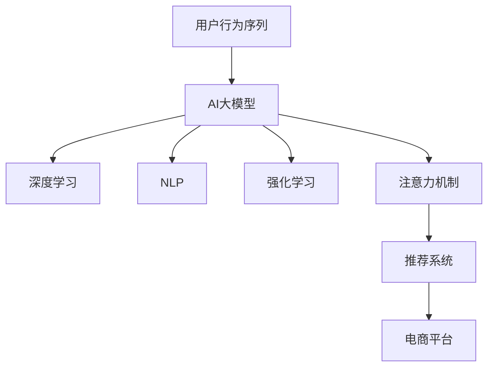

                 

# AI大模型在电商平台用户行为序列建模中的作用

> 关键词：用户行为序列建模, AI大模型, 电商平台, 深度学习, 自然语言处理(NLP), 强化学习, 注意力机制, 推荐系统

## 1. 背景介绍

### 1.1 问题由来

随着电子商务的迅速发展，电商平台的数据规模日益庞大。如何高效利用这些数据，提升用户体验和平台转化率，成为电商企业的重要挑战。传统的基于规则和特征工程的方法，在处理复杂用户行为数据时显得力不从心。而基于深度学习的用户行为序列建模方法，可以更全面、深入地理解用户需求，从而优化电商平台的运营策略。

### 1.2 问题核心关键点

本节将详细介绍基于AI大模型的用户行为序列建模方法，并分析其在电商平台中的具体应用。核心关键点包括：

- **用户行为序列建模**：通过对用户历史行为数据进行建模，捕捉用户的购物习惯、偏好和趋势。
- **AI大模型**：使用如BERT、GPT等预训练大模型，引入深度学习、自然语言处理和强化学习等前沿技术。
- **电商平台**：将用户行为序列建模技术应用于电商平台的个性化推荐、搜索排序、广告投放等环节。

## 2. 核心概念与联系

### 2.1 核心概念概述

为更好地理解基于AI大模型的用户行为序列建模方法，本节将介绍几个密切相关的核心概念：

- **用户行为序列**：指用户在电商平台上的所有行为记录，如浏览、点击、购买、评价等，通过时间序列方式组织。
- **AI大模型**：以自回归（如GPT）或自编码（如BERT）模型为代表的大规模预训练语言模型，通过在大规模无标签文本语料上进行预训练，学习到丰富的语言知识和常识。
- **深度学习**：通过神经网络结构模拟人脑神经网络处理数据，用于复杂数据模式的学习和提取。
- **自然语言处理(NLP)**：涉及计算机与人类语言之间的交互，包括文本生成、文本分类、序列标注等任务。
- **强化学习**：通过与环境的交互，模型不断调整策略以最大化某种奖励信号，应用于推荐系统优化等场景。
- **注意力机制**：用于处理序列数据的重要机制，可以动态选择重要的特征，提升模型的鲁棒性和性能。

这些核心概念之间的逻辑关系可以通过以下Mermaid流程图来展示：



这个流程图展示了大模型与深度学习、NLP、强化学习、注意力机制等核心概念之间的关系：

1. 用户行为序列数据输入大模型，通过深度学习、NLP等技术提取特征，并应用注意力机制动态选择重要特征。
2. 模型输出可用于电商平台推荐系统，通过强化学习优化推荐策略，提升用户体验和转化率。

## 3. 核心算法原理 & 具体操作步骤
### 3.1 算法原理概述

基于AI大模型的用户行为序列建模，旨在通过深度学习、NLP等技术，对用户行为数据进行建模和分析，以捕捉用户兴趣、行为趋势和购买意向。其主要原理包括以下几个方面：

- **自回归模型**：如GPT等模型通过自回归方式生成序列数据，可以自然地处理时间序列数据。
- **自编码模型**：如BERT等模型通过自编码方式学习到数据中的语义和结构信息，可用于序列标注和预测。
- **深度学习**：通过多层神经网络结构，逐层提取数据特征，逐步提升模型性能。
- **注意力机制**：动态选择序列中重要的特征，提升模型的泛化能力和预测精度。
- **强化学习**：通过与环境的交互，优化推荐策略，提升用户体验和转化率。

### 3.2 算法步骤详解

基于AI大模型的用户行为序列建模一般包括以下几个关键步骤：

**Step 1: 数据准备与预处理**

- 收集电商平台用户行为数据，包括浏览、点击、购买、评价等行为记录。
- 对数据进行清洗和去重，处理缺失值和异常值。
- 对文本数据进行分词、编码等预处理操作，确保数据格式一致。

**Step 2: 数据划分与标注**

- 将用户行为数据划分为训练集、验证集和测试集。
- 对文本数据进行标注，如用户偏好、购物意向、评价情感等。

**Step 3: 模型选择与初始化**

- 选择合适的AI大模型，如BERT、GPT等，作为初始化参数。
- 对大模型进行微调，初始化参数更新以适应特定任务。

**Step 4: 特征提取与处理**

- 使用大模型对用户行为数据进行特征提取，生成序列化表示。
- 引入深度学习、NLP等技术，提取数据中的关键特征。
- 应用注意力机制，动态选择重要的特征，提升模型性能。

**Step 5: 模型训练与优化**

- 使用训练集对模型进行训练，最小化预测误差。
- 在验证集上评估模型性能，调整超参数以防止过拟合。
- 使用测试集对模型进行最终评估，确定性能指标。

**Step 6: 模型应用与部署**

- 将训练好的模型应用于电商平台推荐系统，优化推荐策略。
- 在生产环境中部署模型，进行实时推荐和预测。
- 持续收集新数据，定期更新模型，提升模型性能。

### 3.3 算法优缺点

基于AI大模型的用户行为序列建模方法具有以下优点：

- **全面性**：通过深度学习、NLP等技术，模型可以全面理解用户行为数据，捕捉用户兴趣、偏好和趋势。
- **高效性**：AI大模型通过预训练的方式，可以快速进行微调，适应特定任务。
- **可解释性**：模型的深度结构易于解释，可以帮助业务人员理解模型决策依据。

同时，该方法也存在以下缺点：

- **数据依赖**：模型的性能高度依赖于数据质量，数据清洗和标注成本较高。
- **计算资源消耗大**：大模型需要大量的计算资源进行训练和推理，资源消耗较大。
- **泛化能力不足**：模型过于复杂，可能导致过拟合，泛化能力受限。

尽管存在这些局限性，基于AI大模型的用户行为序列建模方法在电商平台中仍具有重要应用价值。未来研究重点在于如何进一步提高模型的泛化能力，降低计算资源消耗，提升模型的实际应用效果。

### 3.4 算法应用领域

基于AI大模型的用户行为序列建模方法，在电商平台的个性化推荐、搜索排序、广告投放等多个环节中具有广泛应用：

- **个性化推荐**：通过分析用户历史行为，推荐符合用户兴趣的商品，提升用户体验和转化率。
- **搜索排序**：根据用户搜索行为，动态调整搜索结果排序，提升搜索体验和效率。
- **广告投放**：通过用户行为数据，精准定位潜在用户，优化广告投放策略，提高广告转化率。

此外，该方法还可以应用于客户细分、流失预测、品牌管理等电商运营场景中，帮助电商企业实现精细化运营和高效管理。

## 4. 数学模型和公式 & 详细讲解 & 举例说明
### 4.1 数学模型构建

本节将使用数学语言对基于AI大模型的用户行为序列建模过程进行更加严格的刻画。

假设用户行为序列为 $X=\{x_1, x_2, ..., x_t\}$，其中 $x_t$ 表示用户在时间 $t$ 的行为数据。模型 $M$ 将用户行为序列映射为一系列向量表示 $\{h_1, h_2, ..., h_t\}$，每个向量 $h_t$ 表示用户行为在时间 $t$ 的特征表示。

数学模型构建主要包括以下几个部分：

- **输入层**：将用户行为数据转化为模型可处理的向量表示。
- **编码层**：通过深度学习等技术，提取用户行为特征，生成序列化表示。
- **输出层**：通过注意力机制等技术，动态选择重要特征，生成最终预测结果。

### 4.2 公式推导过程

以下我们以一个简单的例子，演示基于AI大模型的用户行为序列建模过程。

假设用户浏览过商品 $A$ 和 $B$，并且对商品 $A$ 进行了评价 $1$，对商品 $B$ 进行了评价 $2$。我们希望通过模型预测用户下一步可能购买的商品。

1. **输入层**：将用户历史行为数据转化为向量表示，如 $x_1=[A,1]$，$x_2=[B,2]$。

2. **编码层**：使用BERT等预训练模型对用户行为数据进行编码，生成序列化表示。
   - 输入序列：$x_1=[A,1]$，$x_2=[B,2]$
   - BERT编码：$h_1=[\text{Encoder}(x_1)]$，$h_2=[\text{Encoder}(x_2)]$
   - 融合编码：$h=[h_1,h_2]$

3. **注意力机制**：引入注意力机制，动态选择重要特征。
   - 注意力权重：$\alpha=[\alpha_1, \alpha_2]$
   - 加权融合：$h'=[\alpha_1 h_1 + \alpha_2 h_2]$

4. **输出层**：通过线性回归等技术，预测用户下一步可能购买的商品。
   - 预测概率：$P=[P_A, P_B]$
   - 决策阈值：$T$
   - 最终结果：$y=\text{argmax}(P)$

通过上述过程，我们可以构建一个基于AI大模型的用户行为序列建模模型，用于预测用户下一步可能购买的商品。

### 4.3 案例分析与讲解

为了更好地理解基于AI大模型的用户行为序列建模方法，下面以一个具体的案例进行讲解：

**案例1: 电商平台个性化推荐系统**

假设某电商平台收集了用户的历史行为数据，包括浏览、点击、购买等行为记录。使用BERT模型对数据进行编码，提取用户行为特征。通过注意力机制，动态选择重要特征，生成用户兴趣表示。使用线性回归模型对用户兴趣表示进行预测，生成个性化推荐列表。

具体实现步骤如下：

1. **数据准备**：收集用户历史行为数据，包括浏览、点击、购买等行为记录。
2. **数据预处理**：对文本数据进行分词、编码等预处理操作，确保数据格式一致。
3. **模型选择**：选择BERT模型作为初始化参数，使用深度学习等技术提取用户行为特征。
4. **特征提取**：通过注意力机制，动态选择重要特征，生成用户兴趣表示。
5. **模型训练**：使用训练集对模型进行训练，最小化预测误差。
6. **模型应用**：将训练好的模型应用于电商平台推荐系统，生成个性化推荐列表。

通过上述过程，电商平台可以根据用户历史行为数据，生成个性化推荐，提升用户体验和转化率。

## 5. 项目实践：代码实例和详细解释说明
### 5.1 开发环境搭建

在进行用户行为序列建模实践前，我们需要准备好开发环境。以下是使用Python进行TensorFlow开发的环境配置流程：

1. 安装Anaconda：从官网下载并安装Anaconda，用于创建独立的Python环境。

2. 创建并激活虚拟环境：
```bash
conda create -n tf-env python=3.8 
conda activate tf-env
```

3. 安装TensorFlow：根据CUDA版本，从官网获取对应的安装命令。例如：
```bash
conda install tensorflow -c pytorch -c conda-forge
```

4. 安装相关依赖包：
```bash
pip install torch torchvision torchaudio scikit-learn pandas numpy matplotlib tqdm jupyter notebook ipython
```

5. 安装TensorBoard：
```bash
pip install tensorboard
```

完成上述步骤后，即可在`tf-env`环境中开始用户行为序列建模实践。

### 5.2 源代码详细实现

下面我们以电商平台的个性化推荐系统为例，给出使用TensorFlow进行用户行为序列建模的代码实现。

首先，定义数据处理函数：

```python
import tensorflow as tf
from tensorflow.keras.preprocessing.text import Tokenizer
from tensorflow.keras.preprocessing.sequence import pad_sequences

# 定义模型超参数
vocab_size = 10000
embedding_dim = 128
max_length = 50
trunc_type = 'post'
padding_type = 'post'
oov_tok = "<OOV>"
training_size = 10000

# 加载用户行为数据
def load_data(file_path):
    with open(file_path, 'r', encoding='utf-8') as f:
        data = f.readlines()
        data = [line.split('\t') for line in data]
    return data

# 分词并转化为序列表示
def preprocess_data(data):
    tokenizer = Tokenizer(vocab_size, oov_token=oov_tok)
    tokenizer.fit_on_texts(data)
    sequences = tokenizer.texts_to_sequences(data)
    padded_sequences = pad_sequences(sequences, maxlen=max_length, padding=padding_type, truncating=trunc_type)
    return padded_sequences, tokenizer.word_index

# 加载训练集和测试集
train_data = load_data('train.txt')
test_data = load_data('test.txt')

train_sequences, train_tokenizer = preprocess_data(train_data)
test_sequences, test_tokenizer = preprocess_data(test_data)
```

然后，定义模型架构：

```python
from tensorflow.keras.models import Sequential
from tensorflow.keras.layers import Embedding, LSTM, Dense

# 定义模型架构
model = Sequential()
model.add(Embedding(vocab_size, embedding_dim, input_length=max_length))
model.add(LSTM(128))
model.add(Dense(1, activation='sigmoid'))

# 编译模型
model.compile(loss='binary_crossentropy', optimizer='adam', metrics=['accuracy'])
```

接着，定义训练和评估函数：

```python
from tensorflow.keras.callbacks import EarlyStopping

# 定义训练函数
def train_model(model, train_data, epochs=5, batch_size=64):
    model.fit(train_data, epochs=epochs, batch_size=batch_size, validation_split=0.2, callbacks=[EarlyStopping(patience=3)])

# 定义评估函数
def evaluate_model(model, test_data):
    loss, accuracy = model.evaluate(test_data)
    print(f'Test loss: {loss:.4f}')
    print(f'Test accuracy: {accuracy:.4f}')
```

最后，启动训练流程并在测试集上评估：

```python
train_model(model, train_sequences)
evaluate_model(model, test_sequences)
```

以上就是使用TensorFlow进行电商平台个性化推荐系统的代码实现。可以看到，TensorFlow提供了丰富的深度学习组件和工具，使得构建和训练复杂模型变得相对简单。

### 5.3 代码解读与分析

让我们再详细解读一下关键代码的实现细节：

**load_data函数**：
- 从文件中加载数据，并将其按照制表符分隔，转换为列表形式。
- 加载的数据为文本形式，需要进一步处理才能用于模型训练。

**preprocess_data函数**：
- 使用Keras的Tokenizer将文本数据转换为数字序列。
- 使用pad_sequences对序列进行填充，确保所有序列长度一致。
- 返回预处理后的数字序列和Tokenizer对象，方便后续处理。

**定义模型架构**：
- 使用Sequential模型定义模型结构。
- 第一层为Embedding层，将数字序列转换为向量表示。
- 第二层为LSTM层，提取序列特征。
- 第三层为Dense层，输出二分类预测结果。
- 使用二元交叉熵作为损失函数，Adam优化器进行模型训练，准确率作为评估指标。

**train_model函数**：
- 使用fit方法对模型进行训练，指定训练集、训练轮数、批量大小等超参数。
- 使用EarlyStopping回调函数，防止模型过拟合。

**evaluate_model函数**：
- 使用evaluate方法对模型进行评估，返回损失和准确率。
- 输出评估结果，帮助业务人员了解模型性能。

通过上述过程，我们可以构建一个基于TensorFlow的电商平台个性化推荐系统，通过用户行为序列建模，提升推荐效果和用户体验。

## 6. 实际应用场景
### 6.1 智能客服系统

基于AI大模型的用户行为序列建模方法，可以应用于智能客服系统的构建。通过分析用户的查询历史和行为数据，智能客服系统能够自动理解用户需求，生成个性化的回复，提升客户满意度。

具体实现步骤如下：

1. **数据收集**：收集用户的历史查询记录和行为数据，包括点击、访问、回复等。
2. **数据预处理**：对文本数据进行分词、编码等预处理操作，确保数据格式一致。
3. **模型选择**：选择BERT等预训练模型作为初始化参数，使用深度学习等技术提取用户行为特征。
4. **特征提取**：通过注意力机制，动态选择重要特征，生成用户兴趣表示。
5. **模型训练**：使用训练集对模型进行训练，最小化预测误差。
6. **模型应用**：将训练好的模型应用于智能客服系统，生成个性化回复。

通过上述过程，智能客服系统可以根据用户历史查询数据，生成个性化的回复，提升客户满意度。

### 6.2 金融风险预警

在金融领域，预测用户行为风险是至关重要的。通过用户行为序列建模，可以分析用户的历史交易数据，预测其未来行为，及时发现异常交易，防范金融风险。

具体实现步骤如下：

1. **数据收集**：收集用户的交易记录和行为数据，包括交易时间、金额、交易类型等。
2. **数据预处理**：对文本数据进行分词、编码等预处理操作，确保数据格式一致。
3. **模型选择**：选择LSTM等模型作为初始化参数，使用深度学习等技术提取用户行为特征。
4. **特征提取**：通过注意力机制，动态选择重要特征，生成用户行为风险表示。
5. **模型训练**：使用训练集对模型进行训练，最小化预测误差。
6. **模型应用**：将训练好的模型应用于金融风险预警系统，生成风险预测结果。

通过上述过程，金融风险预警系统可以根据用户历史交易数据，预测其未来行为，及时发现异常交易，防范金融风险。

### 6.3 在线广告投放

在线广告投放是电商平台的另一个重要应用场景。通过用户行为序列建模，可以分析用户的浏览和点击行为，精准定位潜在客户，优化广告投放策略，提高广告转化率。

具体实现步骤如下：

1. **数据收集**：收集用户的浏览和点击数据，包括访问时间、浏览页面、点击广告等。
2. **数据预处理**：对文本数据进行分词、编码等预处理操作，确保数据格式一致。
3. **模型选择**：选择LSTM等模型作为初始化参数，使用深度学习等技术提取用户行为特征。
4. **特征提取**：通过注意力机制，动态选择重要特征，生成用户兴趣表示。
5. **模型训练**：使用训练集对模型进行训练，最小化预测误差。
6. **模型应用**：将训练好的模型应用于在线广告投放系统，生成个性化广告推荐。

通过上述过程，在线广告投放系统可以根据用户历史行为数据，生成个性化广告推荐，提高广告转化率。

### 6.4 未来应用展望

随着用户行为序列建模技术的发展，基于AI大模型的应用场景将更加广泛，带来更深刻的变革：

- **智能决策支持**：在医疗、金融、电商等多个领域，基于用户行为序列建模的智能决策支持系统，能够辅助决策者进行科学决策，提升决策效率和质量。
- **个性化推荐系统**：通过分析用户行为数据，推荐系统可以提供更加个性化、精准的内容推荐，提升用户体验和平台转化率。
- **行为异常检测**：基于用户行为序列建模的异常检测系统，可以实时监测用户行为，及时发现异常行为，防范金融风险、用户欺诈等潜在问题。
- **智能客服系统**：智能客服系统通过分析用户查询历史和行为数据，自动生成个性化回复，提升客户满意度，减少人工客服成本。

这些应用场景展示了用户行为序列建模技术的巨大潜力，未来随着技术的不断进步，基于AI大模型的应用将更加广泛和深入。

## 7. 工具和资源推荐
### 7.1 学习资源推荐

为了帮助开发者系统掌握基于AI大模型的用户行为序列建模技术，这里推荐一些优质的学习资源：

1. **《深度学习》(周志华)**：该书系统介绍了深度学习的基本概念和前沿技术，适合初学者入门。
2. **《自然语言处理综论》(周志华)**：该书涵盖了NLP的基本原理和实际应用，适合进一步深入学习。
3. **Coursera上的深度学习课程**：由斯坦福大学等知名高校提供的深度学习课程，涵盖深度学习的基本原理和实际应用。
4. **TensorFlow官方文档**：提供了丰富的深度学习组件和工具，适合实战学习和项目开发。
5. **Kaggle上的用户行为数据分析竞赛**：通过实际项目练习，提升数据处理和模型构建能力。

通过对这些资源的学习实践，相信你一定能够快速掌握基于AI大模型的用户行为序列建模技术，并用于解决实际的电商问题。

### 7.2 开发工具推荐

高效的开发离不开优秀的工具支持。以下是几款用于用户行为序列建模开发的常用工具：

1. **TensorFlow**：由Google主导开发的深度学习框架，生产部署方便，适合大规模工程应用。
2. **Keras**：高层次的深度学习API，提供了丰富的深度学习组件和工具，适合快速迭代研究。
3. **PyTorch**：由Facebook开发的深度学习框架，灵活动态的计算图，适合快速迭代研究。
4. **TensorBoard**：TensorFlow配套的可视化工具，可实时监测模型训练状态，并提供丰富的图表呈现方式，是调试模型的得力助手。

合理利用这些工具，可以显著提升用户行为序列建模任务的开发效率，加快创新迭代的步伐。

### 7.3 相关论文推荐

基于AI大模型的用户行为序列建模技术的发展源于学界的持续研究。以下是几篇奠基性的相关论文，推荐阅读：

1. **"Attention is All You Need"**：提出了Transformer结构，开启了NLP领域的预训练大模型时代。
2. **"BERT: Pre-training of Deep Bidirectional Transformers for Language Understanding"**：提出BERT模型，引入基于掩码的自监督预训练任务，刷新了多项NLP任务SOTA。
3. **"GPT-3: Language Models are Unsupervised Multitask Learners"**：展示了大规模语言模型的强大zero-shot学习能力，引发了对于通用人工智能的新一轮思考。
4. **"Dynamic Sequence Generation with Attention Mechanisms"**：提出注意力机制，用于处理序列数据，提升模型的鲁棒性和性能。
5. **"Recurrent Neural Network Based Recommender System"**：提出基于RNN的推荐系统，应用于电商平台的个性化推荐。

这些论文代表了大模型用户行为序列建模技术的发展脉络。通过学习这些前沿成果，可以帮助研究者把握学科前进方向，激发更多的创新灵感。

## 8. 总结：未来发展趋势与挑战

### 8.1 总结

本文对基于AI大模型的用户行为序列建模方法进行了全面系统的介绍。首先阐述了用户行为序列建模的原理和应用，明确了AI大模型在电商平台中的具体应用。其次，从原理到实践，详细讲解了用户行为序列建模的数学模型和关键步骤，给出了用户行为序列建模任务开发的完整代码实例。同时，本文还广泛探讨了用户行为序列建模方法在电商平台的实际应用场景，展示了其巨大潜力。

通过本文的系统梳理，可以看到，基于AI大模型的用户行为序列建模技术正在成为电商平台的关键技术范式，极大地提升了电商平台的运营效率和用户体验。未来随着技术的不断进步，基于AI大模型的应用将更加广泛和深入。

### 8.2 未来发展趋势

展望未来，用户行为序列建模技术将呈现以下几个发展趋势：

1. **数据多样化**：未来的用户行为数据将更加多样化，包括文本、图像、视频、音频等多种形式。如何更好地整合多模态数据，提升模型性能，将是一个重要研究方向。
2. **深度学习与强化学习的融合**：深度学习模型和强化学习模型的融合，将提升模型对复杂行为数据的建模能力，实现更精准的用户行为预测。
3. **多任务学习**：通过多任务学习，模型可以同时学习多个任务，提升模型泛化能力和性能。
4. **模型可解释性**：如何赋予模型更强的可解释性，帮助业务人员理解模型决策依据，将是未来的研究重点。
5. **实时预测**：实时预测能力的提升，将使模型能够更好地应用于需要快速响应的场景，如智能客服、金融风险预警等。

这些趋势将进一步推动用户行为序列建模技术的发展，提升模型的实际应用效果。

### 8.3 面临的挑战

尽管用户行为序列建模技术已经取得了显著进展，但在迈向更加智能化、普适化应用的过程中，它仍面临诸多挑战：

1. **数据隐私和安全**：用户行为数据涉及个人隐私，如何保护数据隐私，确保数据安全，将是未来的重要问题。
2. **模型鲁棒性不足**：模型面对域外数据时，泛化性能往往大打折扣。如何提高模型鲁棒性，避免灾难性遗忘，还需要更多理论和实践的积累。
3. **计算资源消耗大**：用户行为数据规模庞大，模型训练和推理需要大量计算资源，如何优化计算效率，降低资源消耗，将是一个重要的研究方向。
4. **可解释性亟需加强**：模型的复杂性使其难以解释，如何赋予模型更强的可解释性，帮助业务人员理解模型决策依据，将是亟待解决的问题。
5. **安全性和伦理问题**：模型可能学习到有害信息，如何避免恶意用途，确保模型安全性，将是未来的研究方向。

这些挑战需要我们在未来研究中不断探索和突破，才能使基于AI大模型的用户行为序列建模技术更加成熟和可靠。

### 8.4 研究展望

面向未来，用户行为序列建模技术的研究需要在以下几个方面寻求新的突破：

1. **无监督和半监督学习**：摆脱对大规模标注数据的依赖，利用自监督学习、主动学习等无监督和半监督范式，最大限度利用非结构化数据，实现更加灵活高效的建模。
2. **多模态学习**：将符号化的先验知识，如知识图谱、逻辑规则等，与神经网络模型进行巧妙融合，引导建模过程学习更准确、合理的语言模型。
3. **强化学习优化**：通过引入强化学习技术，优化推荐策略，提升用户体验和转化率。
4. **因果分析与博弈论工具**：将因果分析方法引入建模过程，识别出模型决策的关键特征，增强模型决策的因果性和逻辑性。

这些研究方向的探索，必将引领用户行为序列建模技术迈向更高的台阶，为构建安全、可靠、可解释、可控的智能系统铺平道路。面向未来，用户行为序列建模技术还需要与其他人工智能技术进行更深入的融合，如知识表示、因果推理、强化学习等，多路径协同发力，共同推动自然语言理解和智能交互系统的进步。只有勇于创新、敢于突破，才能不断拓展语言模型的边界，让智能技术更好地造福人类社会。

## 9. 附录：常见问题与解答

**Q1：用户行为序列建模与传统机器学习有何不同？**

A: 用户行为序列建模与传统机器学习有以下不同点：

- **模型结构**：用户行为序列建模使用深度学习、NLP等技术，构建序列化的模型结构，能够更全面地处理时间序列数据。
- **数据依赖**：用户行为序列建模高度依赖于数据质量，需要更完整、准确的数据进行训练。
- **性能提升**：用户行为序列建模能够捕捉用户行为中的动态特征，提升模型的性能和泛化能力。

**Q2：如何在电商平台上应用用户行为序列建模？**

A: 在电商平台上应用用户行为序列建模，主要包括以下几个步骤：

1. **数据收集**：收集用户的历史行为数据，包括浏览、点击、购买等行为记录。
2. **数据预处理**：对文本数据进行分词、编码等预处理操作，确保数据格式一致。
3. **模型选择**：选择BERT等预训练模型作为初始化参数，使用深度学习等技术提取用户行为特征。
4. **特征提取**：通过注意力机制，动态选择重要特征，生成用户兴趣表示。
5. **模型训练**：使用训练集对模型进行训练，最小化预测误差。
6. **模型应用**：将训练好的模型应用于电商平台推荐系统，优化推荐策略。

**Q3：用户行为序列建模面临哪些数据隐私和安全问题？**

A: 用户行为序列建模面临以下数据隐私和安全问题：

1. **数据泄露**：用户行为数据涉及个人隐私，如果数据泄露，将导致严重的隐私泄露问题。
2. **数据篡改**：用户行为数据可能被恶意篡改，导致模型预测结果错误，影响用户体验。
3. **数据归属问题**：用户行为数据归属问题复杂，不同用户可能有不同的数据使用需求，如何平衡各方利益，是未来需要解决的重要问题。

为应对这些问题，可以在数据收集和处理过程中，采取数据匿名化、数据加密等措施，保护用户隐私。同时，建立数据使用规范和协议，确保数据安全和合规使用。

通过以上问题的探讨，我们可以看到，基于AI大模型的用户行为序列建模方法在电商平台中的应用前景广阔，但同时也需要关注数据隐私和安全问题，确保技术应用的合规性和安全性。

---

作者：禅与计算机程序设计艺术 / Zen and the Art of Computer Programming

