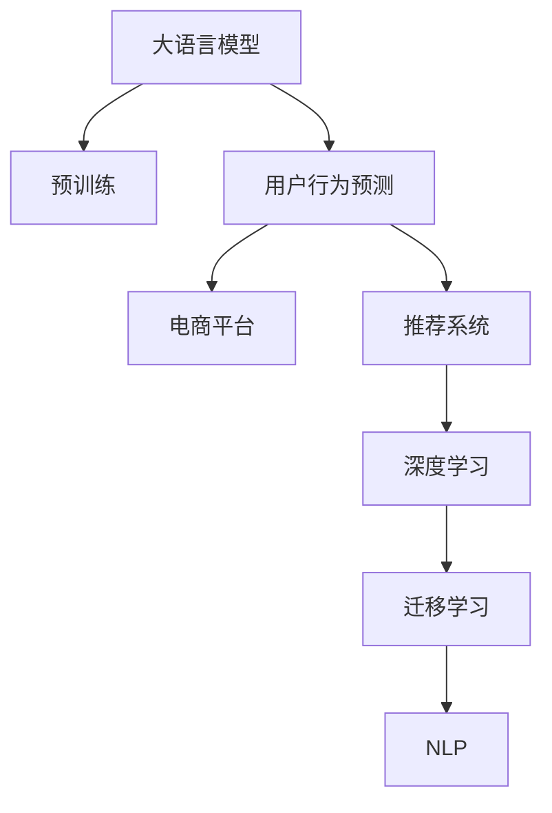

                 

# AI大模型在电商平台用户行为预测中的应用

> 关键词：AI大模型, 用户行为预测, 电商平台, 自然语言处理(NLP), 推荐系统, 深度学习, 迁移学习

## 1. 背景介绍

### 1.1 问题由来
随着电子商务的蓬勃发展，电商平台的用户行为预测成为商家提升运营效率、优化用户体验、挖掘潜在价值的关键。通过精准预测用户行为，可以优化库存管理、个性化推荐、用户留存等运营策略，提升整体业务效果。然而，用户行为预测面临诸多挑战，包括数据质量、用户多样性、场景复杂性等，单靠传统机器学习方法难以有效应对。

大语言模型（Large Language Model, LLM）如BERT、GPT等，通过预训练和微调，已经展现了强大的自然语言处理能力。在大模型基础上进行用户行为预测，能够充分利用其丰富的语言知识和语义表示能力，提升预测的准确性和泛化能力。本文章将探讨AI大模型在电商平台用户行为预测中的应用，从原理到实践，详细介绍基于大模型的用户行为预测方法和技术。

### 1.2 问题核心关键点
基于大模型的用户行为预测核心关键点包括：

- **数据获取与处理**：电商平台用户行为数据涵盖多维度，如浏览记录、购买历史、评论情感等，需要预处理和特征工程。
- **模型选择与构建**：选择合适的预训练大模型，根据任务需求设计模型架构和损失函数。
- **微调与优化**：在电商平台数据上进行微调，优化模型参数，提高预测精度。
- **结果评估与部署**：通过评估指标和模型部署，验证预测效果，集成到实际应用系统中。

通过以上步骤，可以有效构建一个基于大模型的电商平台用户行为预测系统，帮助商家实现业务目标。

### 1.3 问题研究意义
通过AI大模型进行电商平台用户行为预测，具有以下重要意义：

1. **提升运营效率**：预测用户行为，可以优化库存管理、提升商品推荐精度，减少资源浪费。
2. **个性化推荐**：根据用户历史行为和语义信息，提供精准的个性化推荐，提升用户体验和满意度。
3. **用户留存**：通过预测用户流失行为，提前采取措施，提升用户粘性和留存率。
4. **数据驱动决策**：结合预测结果，进行数据驱动的业务决策，推动业务增长。
5. **技术创新**：利用大模型的强大能力，推动推荐系统、NLP技术的发展，赋能更多创新应用。

## 2. 核心概念与联系

### 2.1 核心概念概述

为更好地理解基于大模型的用户行为预测，本节将介绍几个密切相关的核心概念：

- **大语言模型 (LLM)**：如BERT、GPT等，通过大规模无标签文本预训练，学习通用语言表示。
- **用户行为预测 (User Behavior Prediction)**：通过分析用户历史数据，预测其未来行为，如购买、评论、流失等。
- **电商平台 (E-commerce Platform)**：指在线销售商品、提供服务的商业平台，如淘宝、京东等。
- **推荐系统 (Recommendation System)**：根据用户历史行为和偏好，推荐商品或服务的技术。
- **深度学习 (Deep Learning)**：利用神经网络模型进行复杂数据分析和学习的技术。
- **迁移学习 (Transfer Learning)**：将预训练模型应用于新任务，提升模型泛化能力。
- **自然语言处理 (NLP)**：处理和分析自然语言的技术，如文本分类、情感分析、文本生成等。

这些核心概念之间的逻辑关系可以通过以下Mermaid流程图来展示：



这个流程图展示了大语言模型在用户行为预测、电商平台、推荐系统等关键领域的应用。

## 3. 核心算法原理 & 具体操作步骤
### 3.1 算法原理概述

基于大模型的用户行为预测，本质上是一个有监督学习过程。其核心思想是：通过收集用户的浏览记录、购买历史、评论情感等多维度数据，构建标签化的监督数据集，利用预训练大模型进行微调，学习用户行为与标签之间的关系，从而预测用户未来的行为。

形式化地，假设用户行为预测任务为$T$，训练集为$D=\{(x_i, y_i)\}_{i=1}^N, x_i \in \mathcal{X}, y_i \in \mathcal{Y}$，其中$\mathcal{X}$为输入特征空间，$\mathcal{Y}$为输出标签空间。微调的目标是找到新的模型参数$\theta$，使得模型$M_{\theta}$在训练集$D$上的预测结果尽可能接近真实标签$y_i$。

具体而言，微调过程包括以下几个步骤：

1. **数据准备**：收集电商平台用户的历史行为数据，进行清洗、标注和预处理，构建监督数据集$D$。
2. **模型选择**：选择适合的预训练大模型，如BERT、GPT等，并设计相应的输出层和损失函数。
3. **微调训练**：在监督数据集$D$上，使用小批量随机梯度下降（SGD）等优化算法，调整模型参数$\theta$，最小化损失函数$\mathcal{L}$。
4. **评估验证**：在验证集上评估模型性能，调整超参数，防止过拟合。
5. **部署应用**：在测试集上评估微调后模型的预测效果，集成到实际应用系统中，进行用户行为预测。

### 3.2 算法步骤详解

**Step 1: 数据准备**

收集电商平台用户的历史行为数据，包括浏览记录、购买历史、评论情感等。根据预测任务的不同，需要选择合适的特征进行标注。例如，对于购买预测，可以标注用户是否购买过某商品；对于流失预测，可以标注用户是否在某个时间段内未发生任何行为。

数据预处理包括数据清洗、归一化、特征工程等。例如，对于文本数据，可以使用分词、停用词过滤、TF-IDF等方法进行预处理。对于数值型数据，可以进行标准化处理。

**Step 2: 模型选择与构建**

选择合适的预训练大模型，如BERT、GPT等，并设计相应的输出层和损失函数。例如，对于分类任务，可以在模型顶层添加全连接层和交叉熵损失函数。对于回归任务，可以使用均方误差损失函数。

**Step 3: 微调训练**

在监督数据集$D$上，使用小批量随机梯度下降（SGD）等优化算法，调整模型参数$\theta$，最小化损失函数$\mathcal{L}$。通常，只需要调整模型顶层，保留大部分预训练参数不变。学习率需要根据任务复杂度和数据规模进行选择，一般在1e-5到1e-3之间。

**Step 4: 评估验证**

在验证集上评估模型性能，使用准确率、召回率、F1分数等指标衡量模型预测结果与真实标签的差异。根据评估结果，调整超参数，如学习率、批量大小、迭代轮数等，防止过拟合。

**Step 5: 部署应用**

在测试集上评估微调后模型的预测效果，集成到实际应用系统中，进行用户行为预测。例如，可以部署在电商平台的后端服务中，实时预测用户行为，优化个性化推荐、库存管理等运营策略。

### 3.3 算法优缺点

基于大模型的用户行为预测方法具有以下优点：

- **高效泛化能力**：利用大模型的预训练知识，可以高效泛化到新任务和新场景。
- **数据驱动决策**：通过预测用户行为，可以进行数据驱动的业务决策，提升运营效率。
- **多维度建模**：利用多维度数据，可以构建更为全面的用户画像，提升预测精度。

但该方法也存在一些缺点：

- **数据依赖性强**：预测效果高度依赖于数据质量和数量，标注成本高。
- **模型复杂度高**：大模型的参数量和计算资源消耗大，对硬件要求高。
- **解释性不足**：大模型的黑盒特性，使得其决策过程难以解释。

## 4. 数学模型和公式 & 详细讲解

### 4.1 数学模型构建

用户行为预测任务可形式化为分类问题，假设模型$M_{\theta}$在输入$x$上的输出为$\hat{y}=M_{\theta}(x) \in [0,1]$，表示用户行为发生概率。真实标签$y \in \{0,1\}$。则二分类交叉熵损失函数定义为：

$$
\ell(M_{\theta}(x),y) = -[y\log \hat{y} + (1-y)\log (1-\hat{y})]
$$

模型在训练集$D$上的经验风险为：

$$
\mathcal{L}(\theta) = \frac{1}{N} \sum_{i=1}^N \ell(M_{\theta}(x_i),y_i)
$$

微调的目标是最小化经验风险，即找到最优参数$\theta^*$：

$$
\theta^* = \mathop{\arg\min}_{\theta} \mathcal{L}(\theta)
$$

在实践中，我们通常使用基于梯度的优化算法（如SGD、Adam等）来近似求解上述最优化问题。设$\eta$为学习率，$\lambda$为正则化系数，则参数的更新公式为：

$$
\theta \leftarrow \theta - \eta \nabla_{\theta}\mathcal{L}(\theta) - \eta\lambda\theta
$$

其中$\nabla_{\theta}\mathcal{L}(\theta)$为损失函数对参数$\theta$的梯度，可通过反向传播算法高效计算。

### 4.2 公式推导过程

以下我们以二分类任务为例，推导交叉熵损失函数及其梯度的计算公式。

假设模型$M_{\theta}$在输入$x$上的输出为$\hat{y}=M_{\theta}(x) \in [0,1]$，表示用户行为发生概率。真实标签$y \in \{0,1\}$。则二分类交叉熵损失函数定义为：

$$
\ell(M_{\theta}(x),y) = -[y\log \hat{y} + (1-y)\log (1-\hat{y})]
$$

将其代入经验风险公式，得：

$$
\mathcal{L}(\theta) = -\frac{1}{N}\sum_{i=1}^N [y_i\log M_{\theta}(x_i)+(1-y_i)\log(1-M_{\theta}(x_i))]
$$

根据链式法则，损失函数对参数$\theta_k$的梯度为：

$$
\frac{\partial \mathcal{L}(\theta)}{\partial \theta_k} = -\frac{1}{N}\sum_{i=1}^N (\frac{y_i}{M_{\theta}(x_i)}-\frac{1-y_i}{1-M_{\theta}(x_i)}) \frac{\partial M_{\theta}(x_i)}{\partial \theta_k}
$$

其中$\frac{\partial M_{\theta}(x_i)}{\partial \theta_k}$可进一步递归展开，利用自动微分技术完成计算。

在得到损失函数的梯度后，即可带入参数更新公式，完成模型的迭代优化。重复上述过程直至收敛，最终得到适应电商平台用户行为预测的最优模型参数$\theta^*$。

### 4.3 案例分析与讲解

以电商平台购买预测为例，假设我们有一个包含10万条用户浏览记录的数据集，其中1万条标记为购买，9万条标记为未购买。我们可以使用BERT作为预训练模型，并添加一个线性分类器作为输出层，使用交叉熵损失函数。

模型训练步骤如下：

1. 将数据集划分为训练集和验证集，每个样本包含用户浏览记录和购买历史。
2. 加载BERT模型，并添加线性分类器。
3. 设置学习率、批量大小等超参数，定义交叉熵损失函数。
4. 在训练集上使用SGD进行模型微调，每轮迭代更新模型参数。
5. 在验证集上评估模型性能，防止过拟合。
6. 在测试集上评估最终模型，并集成到实际应用系统中。

通过上述步骤，可以构建一个基于BERT的电商平台购买预测模型，实现对用户未来购买行为的预测。

## 5. 项目实践：代码实例和详细解释说明
### 5.1 开发环境搭建

在进行用户行为预测实践前，我们需要准备好开发环境。以下是使用Python进行PyTorch开发的环境配置流程：

1. 安装Anaconda：从官网下载并安装Anaconda，用于创建独立的Python环境。

2. 创建并激活虚拟环境：
```bash
conda create -n pytorch-env python=3.8 
conda activate pytorch-env
```

3. 安装PyTorch：根据CUDA版本，从官网获取对应的安装命令。例如：
```bash
conda install pytorch torchvision torchaudio cudatoolkit=11.1 -c pytorch -c conda-forge
```

4. 安装Transformers库：
```bash
pip install transformers
```

5. 安装各类工具包：
```bash
pip install numpy pandas scikit-learn matplotlib tqdm jupyter notebook ipython
```

完成上述步骤后，即可在`pytorch-env`环境中开始用户行为预测实践。

### 5.2 源代码详细实现

下面我们以电商平台购买预测为例，给出使用Transformers库对BERT模型进行微调的PyTorch代码实现。

首先，定义数据处理函数：

```python
from transformers import BertTokenizer
from torch.utils.data import Dataset
import torch

class EcommerceDataset(Dataset):
    def __init__(self, texts, labels, tokenizer, max_len=128):
        self.texts = texts
        self.labels = labels
        self.tokenizer = tokenizer
        self.max_len = max_len
        
    def __len__(self):
        return len(self.texts)
    
    def __getitem__(self, item):
        text = self.texts[item]
        label = self.labels[item]
        
        encoding = self.tokenizer(text, return_tensors='pt', max_length=self.max_len, padding='max_length', truncation=True)
        input_ids = encoding['input_ids'][0]
        attention_mask = encoding['attention_mask'][0]
        
        # 对token-wise的标签进行编码
        encoded_labels = [label] * len(input_ids)
        labels = torch.tensor(encoded_labels, dtype=torch.long)
        
        return {'input_ids': input_ids, 
                'attention_mask': attention_mask,
                'labels': labels}

# 标签与id的映射
label2id = {'1': 1, '0': 0} # 1表示购买，0表示未购买
id2label = {1: '1', 0: '0'}

# 创建dataset
tokenizer = BertTokenizer.from_pretrained('bert-base-cased')

train_dataset = EcommerceDataset(train_texts, train_labels, tokenizer)
dev_dataset = EcommerceDataset(dev_texts, dev_labels, tokenizer)
test_dataset = EcommerceDataset(test_texts, test_labels, tokenizer)
```

然后，定义模型和优化器：

```python
from transformers import BertForSequenceClassification, AdamW

model = BertForSequenceClassification.from_pretrained('bert-base-cased', num_labels=2)

optimizer = AdamW(model.parameters(), lr=2e-5)
```

接着，定义训练和评估函数：

```python
from torch.utils.data import DataLoader
from tqdm import tqdm
from sklearn.metrics import classification_report

device = torch.device('cuda') if torch.cuda.is_available() else torch.device('cpu')
model.to(device)

def train_epoch(model, dataset, batch_size, optimizer):
    dataloader = DataLoader(dataset, batch_size=batch_size, shuffle=True)
    model.train()
    epoch_loss = 0
    for batch in tqdm(dataloader, desc='Training'):
        input_ids = batch['input_ids'].to(device)
        attention_mask = batch['attention_mask'].to(device)
        labels = batch['labels'].to(device)
        model.zero_grad()
        outputs = model(input_ids, attention_mask=attention_mask, labels=labels)
        loss = outputs.loss
        epoch_loss += loss.item()
        loss.backward()
        optimizer.step()
    return epoch_loss / len(dataloader)

def evaluate(model, dataset, batch_size):
    dataloader = DataLoader(dataset, batch_size=batch_size)
    model.eval()
    preds, labels = [], []
    with torch.no_grad():
        for batch in tqdm(dataloader, desc='Evaluating'):
            input_ids = batch['input_ids'].to(device)
            attention_mask = batch['attention_mask'].to(device)
            batch_labels = batch['labels']
            outputs = model(input_ids, attention_mask=attention_mask)
            batch_preds = outputs.logits.argmax(dim=2).to('cpu').tolist()
            batch_labels = batch_labels.to('cpu').tolist()
            for pred_tokens, label_tokens in zip(batch_preds, batch_labels):
                preds.append(pred_tokens)
                labels.append(label_tokens)
                
    print(classification_report(labels, preds))
```

最后，启动训练流程并在测试集上评估：

```python
epochs = 5
batch_size = 16

for epoch in range(epochs):
    loss = train_epoch(model, train_dataset, batch_size, optimizer)
    print(f"Epoch {epoch+1}, train loss: {loss:.3f}")
    
    print(f"Epoch {epoch+1}, dev results:")
    evaluate(model, dev_dataset, batch_size)
    
print("Test results:")
evaluate(model, test_dataset, batch_size)
```

以上就是使用PyTorch对BERT进行电商平台购买预测的完整代码实现。可以看到，得益于Transformers库的强大封装，我们可以用相对简洁的代码完成BERT模型的加载和微调。

### 5.3 代码解读与分析

让我们再详细解读一下关键代码的实现细节：

**EcommerceDataset类**：
- `__init__`方法：初始化文本、标签、分词器等关键组件。
- `__len__`方法：返回数据集的样本数量。
- `__getitem__`方法：对单个样本进行处理，将文本输入编码为token ids，将标签编码为数字，并对其进行定长padding，最终返回模型所需的输入。

**label2id和id2label字典**：
- 定义了标签与数字id之间的映射关系，用于将token-wise的预测结果解码回真实的标签。

**训练和评估函数**：
- 使用PyTorch的DataLoader对数据集进行批次化加载，供模型训练和推理使用。
- 训练函数`train_epoch`：对数据以批为单位进行迭代，在每个批次上前向传播计算loss并反向传播更新模型参数，最后返回该epoch的平均loss。
- 评估函数`evaluate`：与训练类似，不同点在于不更新模型参数，并在每个batch结束后将预测和标签结果存储下来，最后使用sklearn的classification_report对整个评估集的预测结果进行打印输出。

**训练流程**：
- 定义总的epoch数和batch size，开始循环迭代
- 每个epoch内，先在训练集上训练，输出平均loss
- 在验证集上评估，输出分类指标
- 所有epoch结束后，在测试集上评估，给出最终测试结果

可以看到，PyTorch配合Transformers库使得BERT微调的代码实现变得简洁高效。开发者可以将更多精力放在数据处理、模型改进等高层逻辑上，而不必过多关注底层的实现细节。

当然，工业级的系统实现还需考虑更多因素，如模型的保存和部署、超参数的自动搜索、更灵活的任务适配层等。但核心的微调范式基本与此类似。

## 6. 实际应用场景
### 6.1 智能客服系统

基于大语言模型微调的对话技术，可以广泛应用于智能客服系统的构建。传统客服往往需要配备大量人力，高峰期响应缓慢，且一致性和专业性难以保证。而使用微调后的对话模型，可以7x24小时不间断服务，快速响应客户咨询，用自然流畅的语言解答各类常见问题。

在技术实现上，可以收集企业内部的历史客服对话记录，将问题和最佳答复构建成监督数据，在此基础上对预训练对话模型进行微调。微调后的对话模型能够自动理解用户意图，匹配最合适的答案模板进行回复。对于客户提出的新问题，还可以接入检索系统实时搜索相关内容，动态组织生成回答。如此构建的智能客服系统，能大幅提升客户咨询体验和问题解决效率。

### 6.2 金融舆情监测

金融机构需要实时监测市场舆论动向，以便及时应对负面信息传播，规避金融风险。传统的人工监测方式成本高、效率低，难以应对网络时代海量信息爆发的挑战。基于大语言模型微调的文本分类和情感分析技术，为金融舆情监测提供了新的解决方案。

具体而言，可以收集金融领域相关的新闻、报道、评论等文本数据，并对其进行主题标注和情感标注。在此基础上对预训练语言模型进行微调，使其能够自动判断文本属于何种主题，情感倾向是正面、中性还是负面。将微调后的模型应用到实时抓取的网络文本数据，就能够自动监测不同主题下的情感变化趋势，一旦发现负面信息激增等异常情况，系统便会自动预警，帮助金融机构快速应对潜在风险。

### 6.3 个性化推荐系统

当前的推荐系统往往只依赖用户的历史行为数据进行物品推荐，无法深入理解用户的真实兴趣偏好。基于大语言模型微调技术，个性化推荐系统可以更好地挖掘用户行为背后的语义信息，从而提供更精准、多样的推荐内容。

在实践中，可以收集用户浏览、点击、评论、分享等行为数据，提取和用户交互的物品标题、描述、标签等文本内容。将文本内容作为模型输入，用户的后续行为（如是否点击、购买等）作为监督信号，在此基础上微调预训练语言模型。微调后的模型能够从文本内容中准确把握用户的兴趣点。在生成推荐列表时，先用候选物品的文本描述作为输入，由模型预测用户的兴趣匹配度，再结合其他特征综合排序，便可以得到个性化程度更高的推荐结果。

### 6.4 未来应用展望

随着大语言模型和微调方法的不断发展，基于微调范式将在更多领域得到应用，为传统行业带来变革性影响。

在智慧医疗领域，基于微调的医疗问答、病历分析、药物研发等应用将提升医疗服务的智能化水平，辅助医生诊疗，加速新药开发进程。

在智能教育领域，微调技术可应用于作业批改、学情分析、知识推荐等方面，因材施教，促进教育公平，提高教学质量。

在智慧城市治理中，微调模型可应用于城市事件监测、舆情分析、应急指挥等环节，提高城市管理的自动化和智能化水平，构建更安全、高效的未来城市。

此外，在企业生产、社会治理、文娱传媒等众多领域，基于大模型微调的人工智能应用也将不断涌现，为经济社会发展注入新的动力。相信随着技术的日益成熟，微调方法将成为人工智能落地应用的重要范式，推动人工智能技术在垂直行业的规模化落地。

## 7. 工具和资源推荐
### 7.1 学习资源推荐

为了帮助开发者系统掌握大语言模型微调的理论基础和实践技巧，这里推荐一些优质的学习资源：

1. 《Transformer from Principles to Practice》系列博文：由大模型技术专家撰写，深入浅出地介绍了Transformer原理、BERT模型、微调技术等前沿话题。

2. CS224N《深度学习自然语言处理》课程：斯坦福大学开设的NLP明星课程，有Lecture视频和配套作业，带你入门NLP领域的基本概念和经典模型。

3. 《Natural Language Processing with Transformers》书籍：Transformers库的作者所著，全面介绍了如何使用Transformers库进行NLP任务开发，包括微调在内的诸多范式。

4. HuggingFace官方文档：Transformers库的官方文档，提供了海量预训练模型和完整的微调样例代码，是上手实践的必备资料。

5. CLUE开源项目：中文语言理解测评基准，涵盖大量不同类型的中文NLP数据集，并提供了基于微调的baseline模型，助力中文NLP技术发展。

通过对这些资源的学习实践，相信你一定能够快速掌握大语言模型微调的精髓，并用于解决实际的NLP问题。
###  7.2 开发工具推荐

高效的开发离不开优秀的工具支持。以下是几款用于大语言模型微调开发的常用工具：

1. PyTorch：基于Python的开源深度学习框架，灵活动态的计算图，适合快速迭代研究。大部分预训练语言模型都有PyTorch版本的实现。

2. TensorFlow：由Google主导开发的开源深度学习框架，生产部署方便，适合大规模工程应用。同样有丰富的预训练语言模型资源。

3. Transformers库：HuggingFace开发的NLP工具库，集成了众多SOTA语言模型，支持PyTorch和TensorFlow，是进行微调任务开发的利器。

4. Weights & Biases：模型训练的实验跟踪工具，可以记录和可视化模型训练过程中的各项指标，方便对比和调优。与主流深度学习框架无缝集成。

5. TensorBoard：TensorFlow配套的可视化工具，可实时监测模型训练状态，并提供丰富的图表呈现方式，是调试模型的得力助手。

6. Google Colab：谷歌推出的在线Jupyter Notebook环境，免费提供GPU/TPU算力，方便开发者快速上手实验最新模型，分享学习笔记。

合理利用这些工具，可以显著提升大语言模型微调任务的开发效率，加快创新迭代的步伐。

### 7.3 相关论文推荐

大语言模型和微调技术的发展源于学界的持续研究。以下是几篇奠基性的相关论文，推荐阅读：

1. Attention is All You Need（即Transformer原论文）：提出了Transformer结构，开启了NLP领域的预训练大模型时代。

2. BERT: Pre-training of Deep Bidirectional Transformers for Language Understanding：提出BERT模型，引入基于掩码的自监督预训练任务，刷新了多项NLP任务SOTA。

3. Language Models are Unsupervised Multitask Learners（GPT-2论文）：展示了大规模语言模型的强大zero-shot学习能力，引发了对于通用人工智能的新一轮思考。

4. Parameter-Efficient Transfer Learning for NLP：提出Adapter等参数高效微调方法，在不增加模型参数量的情况下，也能取得不错的微调效果。

5. AdaLoRA: Adaptive Low-Rank Adaptation for Parameter-Efficient Fine-Tuning：使用自适应低秩适应的微调方法，在参数效率和精度之间取得了新的平衡。

这些论文代表了大语言模型微调技术的发展脉络。通过学习这些前沿成果，可以帮助研究者把握学科前进方向，激发更多的创新灵感。

## 8. 总结：未来发展趋势与挑战
### 8.1 总结

本文对基于大模型的用户行为预测方法进行了全面系统的介绍。首先阐述了大语言模型和用户行为预测的研究背景和意义，明确了微调在拓展预训练模型应用、提升预测精度方面的独特价值。其次，从原理到实践，详细讲解了基于大模型的用户行为预测方法和技术。具体而言，介绍了数据准备、模型选择、微调训练、评估验证和部署应用等关键步骤，并给出了完整的代码实现。通过这些步骤，可以构建一个基于大模型的用户行为预测系统，帮助电商平台实现运营优化。

通过本文的系统梳理，可以看到，基于大模型的用户行为预测方法在电商平台中的应用具有重要意义。在电商领域，利用大模型进行预测，可以优化库存管理、个性化推荐、用户留存等，提升整体业务效果。未来，伴随预训练语言模型和微调方法的持续演进，基于大模型的预测方法必将在更多领域得到应用，推动AI技术在各行各业的规模化落地。

### 8.2 未来发展趋势

展望未来，基于大模型的用户行为预测技术将呈现以下几个发展趋势：

1. **模型规模持续增大**：随着算力成本的下降和数据规模的扩张，预训练语言模型的参数量还将持续增长。超大规模语言模型蕴含的丰富语言知识，有望支撑更加复杂多变的用户行为预测。

2. **多模态数据融合**：未来的用户行为预测将不仅依赖文本数据，还将融合图像、视频、语音等多模态数据，提升预测的准确性和泛化能力。

3. **个性化推荐**：基于大模型的个性化推荐将更加精准，能够根据用户的历史行为和语义信息，提供更符合用户兴趣的推荐结果。

4. **联邦学习**：利用联邦学习技术，可以在保护用户隐私的前提下，进行多源数据的联合训练，提升预测效果。

5. **对抗样本训练**：引入对抗样本训练，增强模型的鲁棒性和泛化能力，避免对抗攻击。

6. **分布式训练**：利用分布式训练技术，可以在大规模数据集上进行高效的模型微调，提升预测精度和效率。

以上趋势凸显了大模型在用户行为预测中的广阔前景。这些方向的探索发展，必将进一步提升预测模型的性能和应用范围，为电商平台带来更高效、个性化的运营体验。

### 8.3 面临的挑战

尽管基于大模型的用户行为预测技术已经取得了瞩目成就，但在迈向更加智能化、普适化应用的过程中，它仍面临着诸多挑战：

1. **数据质量和标注成本**：预测效果高度依赖于数据质量和标注成本，如何高效获取和处理大量高质量标注数据，仍是重要难题。

2. **模型计算资源**：大模型的参数量和计算资源消耗大，对硬件要求高，如何降低计算资源消耗，实现高效的模型训练和推理，还需进一步探索。

3. **模型解释性不足**：大模型的黑盒特性，使得其决策过程难以解释，对于金融、医疗等高风险应用，如何增强模型的可解释性，也是亟待解决的问题。

4. **安全性和隐私保护**：模型训练和预测过程中可能存在数据泄露、隐私侵害等问题，如何保护用户隐私和数据安全，确保模型应用合规，也是重要挑战。

5. **鲁棒性和泛化能力**：模型面对域外数据和对抗样本时，泛化能力有限，如何提升模型的鲁棒性和泛化能力，避免过拟合，是未来需要持续优化的方向。

6. **实时性要求高**：电商平台需要实时预测用户行为，如何在保证预测精度的同时，提升模型推理速度，满足实时性要求，是技术实现的难点。

这些挑战需要通过持续的技术创新和优化，逐步克服。相信伴随学界和产业界的共同努力，基于大模型的用户行为预测技术必将不断进步，为电商平台的智能化运营提供有力支持。

### 8.4 研究展望

面对未来的大模型应用，研究者需要在以下几个方面寻求新的突破：

1. **无监督学习和少样本学习**：探索无监督学习和少样本学习方法，利用自监督学习和主动学习技术，减少对标注数据的依赖。

2. **参数高效和计算高效**：开发更加参数高效和计算高效的微调方法，如Prefix-Tuning、LoRA等，提升模型的实时性和实用性。

3. **多源数据融合**：研究多源数据的融合方法，提升模型对多模态数据的处理能力，构建更加全面、精准的用户画像。

4. **因果推理**：引入因果推理方法，提升模型对用户行为因果关系的理解，增强预测的准确性和鲁棒性。

5. **模型可解释性**：研究可解释性方法，提升模型的决策透明度和用户信任度，推动AI技术在金融、医疗等高风险应用中的广泛应用。

6. **联邦学习和分布式训练**：研究联邦学习和分布式训练技术，在保护用户隐私的前提下，进行多源数据的联合训练，提升模型泛化能力和性能。

这些研究方向的探索，必将引领基于大模型的用户行为预测技术迈向更高的台阶，为电商平台和其他垂直行业带来更多智能化的解决方案。

## 9. 附录：常见问题与解答

**Q1：大语言模型是否适用于所有用户行为预测任务？**

A: 大语言模型在大多数用户行为预测任务上都能取得不错的效果，特别是对于数据量较小的任务。但对于一些特定领域的任务，如医学、法律等，仅仅依靠通用语料预训练的模型可能难以很好地适应。此时需要在特定领域语料上进一步预训练，再进行微调，才能获得理想效果。此外，对于一些需要时效性、个性化很强的任务，如对话、推荐等，微调方法也需要针对性的改进优化。

**Q2：选择预训练大模型的原则是什么？**

A: 选择预训练大模型时，需要考虑以下几个因素：
1. 模型的通用性：选择具有广泛应用场景的通用大模型，如BERT、GPT等。
2. 模型的参数量：根据任务复杂度和计算资源选择模型参数量，一般来说，参数量越大，模型的泛化能力越强。
3. 模型的预训练任务：选择与任务需求匹配的预训练任务，如分类、匹配、生成等。

**Q3：如何缓解微调过程中的过拟合问题？**

A: 过拟合是微调面临的主要挑战，尤其是在标注数据不足的情况下。缓解过拟合的方法包括：
1. 数据增强：通过回译、近义替换等方式扩充训练集。
2. 正则化：使用L2正则、Dropout、Early Stopping等方法防止过拟合。
3. 对抗训练：引入对抗样本，提高模型鲁棒性。
4. 参数高效微调：只调整少量参数(如Adapter、Prefix等)，减小过拟合风险。

这些策略往往需要根据具体任务和数据特点进行灵活组合。只有在数据、模型、训练、推理等各环节进行全面优化，才能最大限度地发挥大模型的优势。

**Q4：在电商平台中，如何构建多维度特征向量？**

A: 在电商平台中，用户行为预测需要考虑多维度特征，如浏览记录、购买历史、评论情感等。可以采用以下方法构建多维度特征向量：
1. 特征提取：将文本、数值型数据转换为向量表示，如使用TF-IDF、Word2Vec等方法。
2. 特征组合：将不同维度的特征组合成一个综合向量，如将浏览记录和购买历史进行拼接，形成复合特征。
3. 特征编码：使用编码器将高维特征向量映射到低维空间，如使用BERT进行特征编码。

构建多维度特征向量是提升用户行为预测精度的关键步骤，需要根据具体任务和数据特点选择合适的方法。

**Q5：模型部署过程中需要注意哪些问题？**

A: 将模型部署到实际应用系统中，还需要考虑以下问题：
1. 模型裁剪：去除不必要的层和参数，减小模型尺寸，加快推理速度。
2. 量化加速：将浮点模型转为定点模型，压缩存储空间，提高计算效率。
3. 服务化封装：将模型封装为标准化服务接口，便于集成调用。
4. 弹性伸缩：根据请求流量动态调整资源配置，平衡服务质量和成本。
5. 监控告警：实时采集系统指标，设置异常告警阈值，确保服务稳定性。
6. 安全防护：采用访问鉴权、数据脱敏等措施，保障数据和模型安全。

合理利用这些技术，可以提升模型的部署效率和安全性，确保其在实际应用中的稳定性和可靠性。

---

作者：禅与计算机程序设计艺术 / Zen and the Art of Computer Programming

