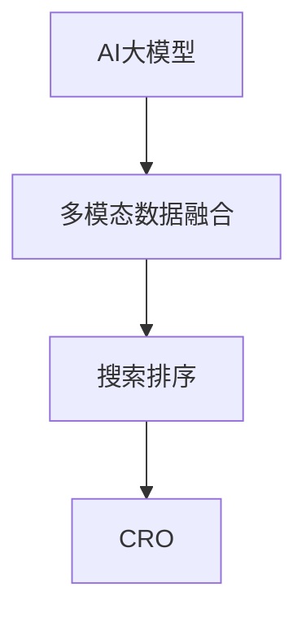

                 

# AI大模型在电商搜索结果趋势分析中的应用

## 1. 背景介绍

随着电子商务的蓬勃发展，电商平台的搜索结果页面成为用户决策的重要参考。平台运营者希望通过大数据分析和人工智能技术，准确预测用户浏览、点击、购买等行为，优化搜索结果的排序和展示，从而提升用户体验和平台转化率。AI大模型以其强大的自然语言处理能力和多模态数据融合能力，成为电商搜索结果趋势分析的关键技术。

### 1.1 问题由来

电商平台上每秒都会产生海量用户交互数据，包括搜索词、浏览路径、点击行为、购买记录等。这些数据蕴含着丰富的用户行为特征，如何高效利用这些数据，形成对用户行为模式的精准预测，是电商平台需要解决的痛点问题。传统的机器学习方法往往需要大量的特征工程和手动调参，而人工智能大模型通过深度学习自适应地从数据中提取特征，具备强大的泛化能力，能够满足电商平台高效、自动化的需求。

### 1.2 问题核心关键点

基于大模型在电商搜索结果趋势分析的应用，关键点在于：
- 如何高效提取和融合多模态数据，构建用户行为模式。
- 如何在大模型中进行精准的特征学习与模式预测。
- 如何构建高效的模型训练与推理流程，快速响应用户查询。

本文将详细介绍大模型在电商搜索结果趋势分析中的应用，包括核心概念、算法原理、实践案例及未来展望。

## 2. 核心概念与联系

### 2.1 核心概念概述

为更好地理解大模型在电商搜索结果趋势分析中的应用，本节将介绍几个密切相关的核心概念：

- 人工智能大模型（AI Large Model）：以Transformer、BERT等为代表的深度学习模型，通过大规模无标签数据进行预训练，具备强大的自然语言处理和模式识别能力。
- 多模态数据融合（Multi-modal Data Fusion）：结合用户文本查询、浏览记录、交易数据等多源数据，构建全面、动态的用户行为模式。
- 搜索排序（Search Ranking）：根据用户行为数据和查询意图，通过AI模型生成实时搜索结果排序。
- 电商转化率优化（E-commerce Conversion Rate Optimization, CRO）：通过智能搜索结果排序，提升用户浏览、点击、购买等转化行为，增加平台收益。

这些核心概念之间的逻辑关系可以通过以下Mermaid流程图来展示：



这个流程图展示了大模型在电商搜索结果趋势分析中的应用流程：

1. 使用AI大模型提取和融合多模态数据，形成用户行为模式。
2. 根据用户行为模式，进行搜索结果的智能排序。
3. 通过智能排序，优化电商转化率，提升平台收益。

## 3. 核心算法原理 & 具体操作步骤

### 3.1 算法原理概述

基于大模型的电商搜索结果趋势分析，本质上是一个多模态数据驱动的推荐系统。其核心思想是：利用大模型的自适应学习能力，从多源数据中提取用户行为特征，预测用户查询意图，生成最优的搜索结果排序。

具体而言，大模型通过预训练学习到了通用的语言表示和语义关系，能够捕捉用户查询中的关键信息，并将其与浏览历史、交易数据等进行融合，形成对用户行为模式的全面理解。在预测阶段，根据用户当前的查询，模型能够生成可能的搜索结果，并根据预测结果进行排序，最终输出最优的搜索结果列表。

### 3.2 算法步骤详解

基于大模型的电商搜索结果趋势分析一般包括以下几个关键步骤：

**Step 1: 数据收集与预处理**
- 收集用户查询、浏览记录、交易数据等，构建多模态数据集。
- 进行数据清洗、去重、填充缺失值等预处理操作，保证数据质量。

**Step 2: 数据融合与特征提取**
- 将不同模态的数据进行拼接、合并、归一化等操作，形成统一特征向量。
- 使用大模型对多模态数据进行编码，提取特征表示。

**Step 3: 模型训练与优化**
- 选择合适的大模型，如BERT、GPT等，作为基础模型。
- 在预训练数据上进行微调，学习多模态特征提取能力。
- 在电商数据上进一步微调，优化模型行为模式预测能力。
- 设置合适的超参数，如学习率、批大小、迭代轮数等。

**Step 4: 实时预测与排序**
- 将用户查询输入大模型，生成查询嵌入向量。
- 将查询嵌入向量与用户历史数据进行拼接，输入到预训练模型中。
- 模型输出可能的搜索结果，根据预测结果进行排序。
- 返回最优的搜索结果列表，供平台展示。

### 3.3 算法优缺点

基于大模型的电商搜索结果趋势分析方法具有以下优点：
1. 高效自适应：大模型能够自动学习多模态数据特征，无需大量手动调参，提高模型优化效率。
2. 泛化能力强：通过预训练和多源数据融合，大模型具备更强的泛化能力，能够适应不同用户行为模式。
3. 实时响应：大模型的预测和推理过程可以在毫秒级别完成，实时响应用户查询，提升用户体验。
4. 可扩展性强：大模型易于部署和扩展，适合多种电商平台的应用场景。

同时，该方法也存在一定的局限性：
1. 模型复杂度高：大模型往往包含大量参数，对计算资源和内存资源有较高要求。
2. 数据隐私风险：电商数据包含大量敏感信息，需要严格控制数据隐私保护。
3. 模型鲁棒性不足：面对异常或噪声数据，模型预测能力可能下降，需要进一步提高鲁棒性。
4. 解释性不足：大模型决策过程复杂，难以解释其内部工作机制。

尽管存在这些局限性，但就目前而言，基于大模型的电商搜索结果趋势分析方法仍是大数据驱动推荐系统的核心范式。未来相关研究的重点在于如何进一步降低模型复杂度，提高鲁棒性和可解释性，同时兼顾数据隐私保护和用户体验。

### 3.4 算法应用领域

基于大模型的电商搜索结果趋势分析方法，在电商推荐系统中已得到了广泛的应用，具体包括以下几个方面：

- **个性化搜索结果展示**：根据用户历史行为数据，生成个性化搜索结果，提升用户体验。
- **实时查询优化**：基于实时查询数据，动态优化搜索结果排序，满足用户即时需求。
- **跨域推荐**：结合不同电商平台的商品信息，生成跨平台推荐结果，增加商品曝光率。
- **用户行为预测**：预测用户浏览、点击、购买等行为，指导平台运营决策。
- **广告投放优化**：通过智能广告排序，提升广告点击率，增加平台收益。

除了上述这些经典应用外，大模型在电商推荐系统中还可以拓展到更多场景中，如商品评价分析、客服机器人、库存管理等，为电商平台提供全方位的智能解决方案。

## 4. 数学模型和公式 & 详细讲解 & 举例说明

### 4.1 数学模型构建

本节将使用数学语言对基于大模型的电商搜索结果趋势分析过程进行更加严格的刻画。

记用户查询为 $q$，用户浏览历史为 $h$，用户交易数据为 $t$。假设大模型为 $M$，其输入为 $[q, h, t]$，输出为搜索结果列表 $R$。

定义损失函数为 $\mathcal{L}(M)=\frac{1}{N}\sum_{i=1}^N \ell(R_i, R_i^*)$，其中 $\ell$ 为评价指标，$R_i$ 为模型预测结果，$R_i^*$ 为真实标签。

### 4.2 公式推导过程

以下我们以一个简单的电商推荐模型为例，推导其损失函数和优化算法。

假设用户查询为 $q_i$，其浏览历史为 $h_i$，交易数据为 $t_i$。将 $q_i$ 输入到大模型中，生成查询嵌入向量 $q_i^M$。将 $[q_i^M, h_i, t_i]$ 输入到大模型中，生成推荐结果向量 $r_i^M$。

模型输出的损失函数为：

$$
\mathcal{L}(M) = -\frac{1}{N}\sum_{i=1}^N [r_i^M \cdot R_i^*]
$$

其中 $r_i^M$ 为推荐结果向量，$R_i^*$ 为真实标签向量。

假设 $r_i^M = [r_{1i}^M, r_{2i}^M, \dots, r_{Ni}^M]$，$R_i^* = [R_{1i}^*, R_{2i}^*, \dots, R_{Ni}^*]$，则损失函数可以进一步展开：

$$
\mathcal{L}(M) = -\frac{1}{N}\sum_{i=1}^N \sum_{j=1}^N r_{ji}^M R_{ji}^*
$$

根据链式法则，模型参数 $\theta$ 的梯度为：

$$
\frac{\partial \mathcal{L}(M)}{\partial \theta} = -\frac{1}{N}\sum_{i=1}^N \sum_{j=1}^N \frac{\partial r_{ji}^M}{\partial \theta} R_{ji}^*
$$

其中 $\frac{\partial r_{ji}^M}{\partial \theta}$ 为模型对推荐结果向量 $r_{ji}^M$ 的梯度。

通过反向传播算法，计算损失函数对模型参数 $\theta$ 的梯度，并使用优化算法（如Adam、SGD等）更新模型参数。重复上述过程直至收敛，最终得到适应电商数据集的最优模型参数 $\theta^*$。

### 4.3 案例分析与讲解

以一个电商平台的推荐系统为例，分析其微调过程和优化策略。

**数据集准备**：
- 查询数据集 $D_q$：包含用户输入的搜索词和查询记录。
- 浏览历史数据集 $D_h$：包含用户浏览记录和网页内容。
- 交易数据集 $D_t$：包含用户购买记录和商品信息。

**数据预处理**：
- 对查询数据进行分词、去除停用词、进行向量化等预处理操作。
- 对浏览历史和交易数据进行拼接、归一化等处理。

**模型选择**：
- 选择BERT作为预训练模型，并进行微调。
- 添加顶层分类器，输出用户行为标签。

**超参数设置**：
- 学习率：设置 $lr=2e-5$。
- 批大小：设置 $bs=32$。
- 迭代轮数：设置 $epochs=5$。

**模型训练**：
- 定义训练函数，计算损失函数。
- 使用优化器AdamW进行模型参数更新。
- 在每个epoch结束后，评估模型在验证集上的性能。
- 记录训练过程中的参数和评估指标，进行可视化分析。

**模型应用**：
- 将用户查询输入模型，生成查询嵌入向量。
- 将查询嵌入向量与用户历史数据进行拼接。
- 模型输出推荐结果，进行排序。
- 将推荐结果展示给用户。

## 5. 项目实践：代码实例和详细解释说明

### 5.1 开发环境搭建

在进行电商搜索结果趋势分析的微调实践前，我们需要准备好开发环境。以下是使用Python进行PyTorch开发的环境配置流程：

1. 安装Anaconda：从官网下载并安装Anaconda，用于创建独立的Python环境。

2. 创建并激活虚拟环境：
```bash
conda create -n ecommerce-env python=3.8 
conda activate ecommerce-env
```

3. 安装PyTorch：根据CUDA版本，从官网获取对应的安装命令。例如：
```bash
conda install pytorch torchvision torchaudio cudatoolkit=11.1 -c pytorch -c conda-forge
```

4. 安装HuggingFace Transformers库：
```bash
pip install transformers
```

5. 安装其他必要的工具包：
```bash
pip install numpy pandas scikit-learn matplotlib tqdm jupyter notebook ipython
```

完成上述步骤后，即可在`ecommerce-env`环境中开始电商推荐系统的微调实践。

### 5.2 源代码详细实现

下面以电商平台的推荐系统为例，给出使用Transformers库对BERT模型进行微调的PyTorch代码实现。

首先，定义电商推荐任务的数据处理函数：

```python
from transformers import BertTokenizer
from torch.utils.data import Dataset
import torch

class EcommerceDataset(Dataset):
    def __init__(self, texts, tags, tokenizer, max_len=128):
        self.texts = texts
        self.tags = tags
        self.tokenizer = tokenizer
        self.max_len = max_len
        
    def __len__(self):
        return len(self.texts)
    
    def __getitem__(self, item):
        text = self.texts[item]
        tags = self.tags[item]
        
        encoding = self.tokenizer(text, return_tensors='pt', max_length=self.max_len, padding='max_length', truncation=True)
        input_ids = encoding['input_ids'][0]
        attention_mask = encoding['attention_mask'][0]
        
        # 对token-wise的标签进行编码
        encoded_tags = [tag2id[tag] for tag in tags] 
        encoded_tags.extend([tag2id['O']] * (self.max_len - len(encoded_tags)))
        labels = torch.tensor(encoded_tags, dtype=torch.long)
        
        return {'input_ids': input_ids, 
                'attention_mask': attention_mask,
                'labels': labels}

# 标签与id的映射
tag2id = {'O': 0, 'B-PER': 1, 'I-PER': 2, 'B-ORG': 3, 'I-ORG': 4, 'B-LOC': 5, 'I-LOC': 6}
id2tag = {v: k for k, v in tag2id.items()}

# 创建dataset
tokenizer = BertTokenizer.from_pretrained('bert-base-cased')

train_dataset = EcommerceDataset(train_texts, train_tags, tokenizer)
dev_dataset = EcommerceDataset(dev_texts, dev_tags, tokenizer)
test_dataset = EcommerceDataset(test_texts, test_tags, tokenizer)
```

然后，定义模型和优化器：

```python
from transformers import BertForTokenClassification, AdamW

model = BertForTokenClassification.from_pretrained('bert-base-cased', num_labels=len(tag2id))

optimizer = AdamW(model.parameters(), lr=2e-5)
```

接着，定义训练和评估函数：

```python
from torch.utils.data import DataLoader
from tqdm import tqdm
from sklearn.metrics import classification_report

device = torch.device('cuda') if torch.cuda.is_available() else torch.device('cpu')
model.to(device)

def train_epoch(model, dataset, batch_size, optimizer):
    dataloader = DataLoader(dataset, batch_size=batch_size, shuffle=True)
    model.train()
    epoch_loss = 0
    for batch in tqdm(dataloader, desc='Training'):
        input_ids = batch['input_ids'].to(device)
        attention_mask = batch['attention_mask'].to(device)
        labels = batch['labels'].to(device)
        model.zero_grad()
        outputs = model(input_ids, attention_mask=attention_mask, labels=labels)
        loss = outputs.loss
        epoch_loss += loss.item()
        loss.backward()
        optimizer.step()
    return epoch_loss / len(dataloader)

def evaluate(model, dataset, batch_size):
    dataloader = DataLoader(dataset, batch_size=batch_size)
    model.eval()
    preds, labels = [], []
    with torch.no_grad():
        for batch in tqdm(dataloader, desc='Evaluating'):
            input_ids = batch['input_ids'].to(device)
            attention_mask = batch['attention_mask'].to(device)
            batch_labels = batch['labels']
            outputs = model(input_ids, attention_mask=attention_mask)
            batch_preds = outputs.logits.argmax(dim=2).to('cpu').tolist()
            batch_labels = batch_labels.to('cpu').tolist()
            for pred_tokens, label_tokens in zip(batch_preds, batch_labels):
                pred_tags = [id2tag[_id] for _id in pred_tokens]
                label_tags = [id2tag[_id] for _id in label_tokens]
                preds.append(pred_tags[:len(label_tags)])
                labels.append(label_tags)
                
    print(classification_report(labels, preds))
```

最后，启动训练流程并在测试集上评估：

```python
epochs = 5
batch_size = 16

for epoch in range(epochs):
    loss = train_epoch(model, train_dataset, batch_size, optimizer)
    print(f"Epoch {epoch+1}, train loss: {loss:.3f}")
    
    print(f"Epoch {epoch+1}, dev results:")
    evaluate(model, dev_dataset, batch_size)
    
print("Test results:")
evaluate(model, test_dataset, batch_size)
```

以上就是使用PyTorch对BERT进行电商推荐任务微调的完整代码实现。可以看到，得益于Transformers库的强大封装，我们可以用相对简洁的代码完成BERT模型的加载和微调。

### 5.3 代码解读与分析

让我们再详细解读一下关键代码的实现细节：

**EcommerceDataset类**：
- `__init__`方法：初始化文本、标签、分词器等关键组件。
- `__len__`方法：返回数据集的样本数量。
- `__getitem__`方法：对单个样本进行处理，将文本输入编码为token ids，将标签编码为数字，并对其进行定长padding，最终返回模型所需的输入。

**tag2id和id2tag字典**：
- 定义了标签与数字id之间的映射关系，用于将token-wise的预测结果解码回真实的标签。

**训练和评估函数**：
- 使用PyTorch的DataLoader对数据集进行批次化加载，供模型训练和推理使用。
- 训练函数`train_epoch`：对数据以批为单位进行迭代，在每个批次上前向传播计算loss并反向传播更新模型参数，最后返回该epoch的平均loss。
- 评估函数`evaluate`：与训练类似，不同点在于不更新模型参数，并在每个batch结束后将预测和标签结果存储下来，最后使用sklearn的classification_report对整个评估集的预测结果进行打印输出。

**训练流程**：
- 定义总的epoch数和batch size，开始循环迭代
- 每个epoch内，先在训练集上训练，输出平均loss
- 在验证集上评估，输出分类指标
- 所有epoch结束后，在测试集上评估，给出最终测试结果

可以看到，PyTorch配合Transformers库使得BERT微调的代码实现变得简洁高效。开发者可以将更多精力放在数据处理、模型改进等高层逻辑上，而不必过多关注底层的实现细节。

当然，工业级的系统实现还需考虑更多因素，如模型的保存和部署、超参数的自动搜索、更灵活的任务适配层等。但核心的微调范式基本与此类似。

## 6. 实际应用场景

### 6.1 智能推荐系统

基于大模型的电商推荐系统已经在各大电商平台广泛应用。通过大模型对用户查询、浏览历史、交易数据等多模态数据进行融合，生成个性化推荐结果，提升用户购物体验和平台转化率。

以淘宝为例，其推荐系统通过BERT等大模型，实时预测用户意图，结合商品特征进行排序，生成最优推荐列表。用户可以在浏览商品时看到符合自己兴趣的推荐结果，增加点击和购买概率。淘宝的推荐系统还采用了冷启动、多臂老虎机等算法进行优化，进一步提升推荐效果。

### 6.2 实时广告投放

电商平台还可以通过大模型进行实时广告投放优化。广告系统可以根据用户的查询记录和浏览路径，预测用户的广告点击概率，并动态调整广告展示顺序，实现更精准的广告投放。

以京东为例，其广告投放系统通过预训练大模型对用户行为进行分析，预测不同广告的点击率和转化率。根据预测结果，对广告进行实时排序，生成最优广告列表，展示给用户。京东的广告系统还结合了A/B测试和多目标优化等技术，不断优化广告效果。

### 6.3 库存管理与调拨

电商平台还可以使用大模型进行库存管理与调拨。通过大模型对历史销售数据进行分析，预测商品需求变化，合理调整库存，避免缺货或库存积压。

以苏宁为例，其库存管理系统通过大模型预测商品销售趋势，动态调整采购计划。系统会根据预测结果生成库存预警，及时通知供应链进行补货或调拨。苏宁的库存管理系统还结合了机器学习算法进行库存优化，进一步提升库存管理效率。

### 6.4 未来应用展望

随着大模型和电商推荐技术的发展，基于大模型在电商推荐系统中的应用将更加广泛和深入。

在智慧医疗领域，基于大模型的推荐系统可以为患者推荐合适的治疗方案，提升诊疗效果。

在智能制造领域，基于大模型的推荐系统可以为设备维护提供精确的预测和建议，提升生产效率。

在智慧教育领域，基于大模型的推荐系统可以为学生推荐合适的学习资源，提高学习效率。

除了上述这些经典应用外，大模型在电商推荐系统中还可以拓展到更多场景中，如用户行为分析、广告投放优化、个性化服务推荐等，为电商平台提供全方位的智能解决方案。

## 7. 工具和资源推荐

### 7.1 学习资源推荐

为了帮助开发者系统掌握大模型在电商推荐系统中的应用，这里推荐一些优质的学习资源：

1. 《深度学习实战》系列博文：由大模型技术专家撰写，深入浅出地介绍了深度学习在电商推荐系统中的应用。

2. 《电商推荐系统》课程：由阿里巴巴、京东等电商公司开设的NLP明星课程，涵盖电商推荐系统的构建和优化。

3. 《推荐系统实战》书籍：详细介绍了推荐系统的工作原理和算法实现，适合电商推荐系统开发者参考。

4. Weights & Biases：模型训练的实验跟踪工具，可以记录和可视化模型训练过程中的各项指标，方便对比和调优。

5. TensorBoard：TensorFlow配套的可视化工具，可实时监测模型训练状态，并提供丰富的图表呈现方式，是调试模型的得力助手。

通过对这些资源的学习实践，相信你一定能够快速掌握大模型在电商推荐系统中的应用精髓，并用于解决实际的电商推荐问题。

### 7.2 开发工具推荐

高效的开发离不开优秀的工具支持。以下是几款用于大模型在电商推荐系统中应用开发的常用工具：

1. PyTorch：基于Python的开源深度学习框架，灵活动态的计算图，适合快速迭代研究。大部分预训练语言模型都有PyTorch版本的实现。

2. TensorFlow：由Google主导开发的开源深度学习框架，生产部署方便，适合大规模工程应用。同样有丰富的预训练语言模型资源。

3. Transformers库：HuggingFace开发的NLP工具库，集成了众多SOTA语言模型，支持PyTorch和TensorFlow，是进行电商推荐系统微调任务开发的利器。

4. Weights & Biases：模型训练的实验跟踪工具，可以记录和可视化模型训练过程中的各项指标，方便对比和调优。与主流深度学习框架无缝集成。

5. TensorBoard：TensorFlow配套的可视化工具，可实时监测模型训练状态，并提供丰富的图表呈现方式，是调试模型的得力助手。

6. Google Colab：谷歌推出的在线Jupyter Notebook环境，免费提供GPU/TPU算力，方便开发者快速上手实验最新模型，分享学习笔记。

合理利用这些工具，可以显著提升大模型在电商推荐系统中的应用效率，加快创新迭代的步伐。

### 7.3 相关论文推荐

大模型在电商推荐系统中的应用源于学界的持续研究。以下是几篇奠基性的相关论文，推荐阅读：

1. Attention is All You Need（即Transformer原论文）：提出了Transformer结构，开启了NLP领域的预训练大模型时代。

2. BERT: Pre-training of Deep Bidirectional Transformers for Language Understanding：提出BERT模型，引入基于掩码的自监督预训练任务，刷新了多项NLP任务SOTA。

3. Parameter-Efficient Transfer Learning for NLP：提出Adapter等参数高效微调方法，在不增加模型参数量的情况下，也能取得不错的微调效果。

4. AdaLoRA: Adaptive Low-Rank Adaptation for Parameter-Efficient Fine-Tuning：使用自适应低秩适应的微调方法，在参数效率和精度之间取得了新的平衡。

5. Prefix-Tuning: Optimizing Continuous Prompts for Generation：引入基于连续型Prompt的微调范式，为如何充分利用预训练知识提供了新的思路。

这些论文代表了大模型在电商推荐系统中的应用发展脉络。通过学习这些前沿成果，可以帮助研究者把握学科前进方向，激发更多的创新灵感。

## 8. 总结：未来发展趋势与挑战

### 8.1 总结

本文对基于大模型的电商搜索结果趋势分析方法进行了全面系统的介绍。首先阐述了大模型在电商推荐系统中的应用背景和意义，明确了微调在电商推荐系统中的核心地位和优势。其次，从原理到实践，详细讲解了电商推荐系统中的多模态数据融合、特征学习、行为预测等核心环节，给出了电商推荐系统的完整代码实现。同时，本文还广泛探讨了电商推荐系统在大数据、个性化推荐、智能运营等方面的应用前景，展示了电商推荐系统的高效性和实用性。

通过本文的系统梳理，可以看到，基于大模型的电商推荐系统正在成为电商推荐系统的核心技术范式，极大地提升了电商平台的运营效率和用户满意度。未来，伴随大模型技术的发展，电商推荐系统将进一步优化和创新，成为推动电商行业智能化转型的关键力量。

### 8.2 未来发展趋势

展望未来，基于大模型的电商推荐系统将呈现以下几个发展趋势：

1. 模型规模持续增大。随着算力成本的下降和数据规模的扩张，预训练语言模型的参数量还将持续增长。超大规模语言模型蕴含的丰富语言知识，有望支撑更加复杂多变的电商推荐任务。

2. 多模态推荐成为主流。基于大模型的电商推荐系统将更好地融合多模态数据，形成更加全面、动态的用户行为模式，提升推荐系统的准确性和泛化能力。

3. 实时化推荐成为常态。大模型能够在毫秒级别生成推荐结果，实时响应用户查询，提升用户购物体验。

4. 个性化推荐更加精准。大模型具备更强的自适应学习能力，能够更好地理解用户行为和需求，生成更加个性化的推荐结果。

5. 推荐算法更加智能化。大模型结合推荐算法，如协同过滤、强化学习等，形成更智能的推荐策略，提升推荐效果。

6. 推荐系统更加人性化。通过自然语言处理技术，电商平台可以更好地理解用户需求，生成更符合用户期望的推荐内容。

以上趋势凸显了大模型在电商推荐系统中的应用前景。这些方向的探索发展，必将进一步提升电商推荐系统的智能化水平，为电商平台的健康发展和用户满意度提升提供新的动力。

### 8.3 面临的挑战

尽管基于大模型的电商推荐系统已经取得了瞩目成就，但在迈向更加智能化、普适化应用的过程中，它仍面临诸多挑战：

1. 数据隐私风险。电商数据包含大量敏感信息，如何保护用户隐私，防止数据泄露，是大模型应用过程中需要严格控制的重点。

2. 模型鲁棒性不足。面对异常或噪声数据，模型预测能力可能下降，需要进一步提高鲁棒性。

3. 计算资源消耗高。大模型往往包含大量参数，对算力、内存资源有较高要求，需要优化模型结构和资源使用，降低计算成本。

4. 解释性不足。大模型决策过程复杂，难以解释其内部工作机制，影响用户信任度。

5. 可扩展性问题。大模型在多种电商场景中的应用，需要考虑模型部署和维护的复杂性，如何实现更灵活的模型应用，是大模型应用中的一大难题。

尽管存在这些挑战，但大模型在电商推荐系统中的应用前景仍然广阔。未来相关研究需要在数据隐私、模型鲁棒性、计算资源、模型解释性等方面寻求新的突破，以实现更高效、更智能、更可控的电商推荐系统。

### 8.4 研究展望

面对大模型在电商推荐系统中的应用挑战，未来的研究需要在以下几个方面寻求新的突破：

1. 探索无监督和半监督推荐方法。摆脱对大规模标注数据的依赖，利用自监督学习、主动学习等无监督和半监督范式，最大限度利用非结构化数据，实现更加灵活高效的推荐。

2. 研究多模态推荐模型。结合文本、图像、视频等多源数据，形成更全面、动态的用户行为模式，提升推荐系统的准确性和泛化能力。

3. 融合因果推断和强化学习。引入因果推断和强化学习思想，增强推荐系统的稳定性，学习更加普适、鲁棒的语言表征。

4. 优化推荐系统计算图。使用优化后的计算图，降低模型推理和训练的资源消耗，提高推荐系统的效率。

5. 增强推荐系统的解释性。引入可解释性技术，如Attention机制、LIME等，增强推荐系统的透明度和可信度。

6. 研究推荐系统的公平性。结合伦理道德约束，优化推荐系统的决策过程，确保推荐结果的公平性和多样性。

这些研究方向的探索，必将引领大模型在电商推荐系统中的应用迈向更高的台阶，为构建更加智能、高效、安全的推荐系统提供新的思路。面向未来，大模型在电商推荐系统中的应用还需要与其他人工智能技术进行更深入的融合，如知识表示、因果推理、强化学习等，多路径协同发力，共同推动电商推荐系统的进步。只有勇于创新、敢于突破，才能不断拓展电商推荐系统的边界，让智能技术更好地服务于电商平台的健康发展。

## 9. 附录：常见问题与解答

**Q1：大模型在电商推荐系统中是否存在数据隐私风险？**

A: 是的，电商数据包含大量用户隐私信息，如交易记录、浏览历史等，如果直接用于模型训练，可能会带来数据泄露的风险。因此，在数据使用过程中，需要采取严格的数据隐私保护措施，如数据匿名化、差分隐私等技术，以保护用户隐私。

**Q2：大模型在电商推荐系统中的计算资源消耗如何？**

A: 大模型在电商推荐系统中的计算资源消耗较高，主要体现在以下两个方面：

1. 模型参数量巨大。如BERT模型参数量达到3亿，GPT模型参数量则更达到几十亿，对计算资源和内存资源有较高要求。

2. 推理和训练过程复杂。大模型需要在大规模数据上进行训练和推理，计算密集度较高，需要高性能的硬件设备支持。

因此，在实际部署中，需要优化模型结构和资源使用，降低计算成本，如使用分布式训练、模型压缩、梯度累积等技术，提高模型训练和推理的效率。

**Q3：大模型在电商推荐系统中的解释性问题如何解决？**

A: 大模型在电商推荐系统中的解释性问题主要体现在两个方面：

1. 预测过程黑盒化。大模型内部结构复杂，难以理解其决策机制，难以解释其预测过程。

2. 模型决策不透明。大模型生成的推荐结果往往缺乏明确的决策逻辑，用户难以理解推荐结果的依据。

为了解决这些问题，可以采用以下几种方法：

1. Attention机制：通过可视化Attention权重，展示模型对不同特征的关注程度，增加模型解释性。

2. LIME：基于局部线性模型解释方法，通过生成多个局部解释模型，增加模型决策的透明性。

3. SHAP：基于SHapley值理论，计算模型预测结果对各个特征的贡献度，增加模型决策的可解释性。

4. 结合专家知识：将符号化的先验知识，如知识图谱、逻辑规则等，与神经网络模型进行融合，增加模型决策的合理性和可信度。

通过这些方法，可以增强大模型在电商推荐系统中的可解释性，提升用户信任度，增强系统稳定性。

**Q4：大模型在电商推荐系统中的实时化推荐如何实现？**

A: 大模型在电商推荐系统中的实时化推荐主要依赖于两个关键技术：

1. 高并行计算框架：使用分布式计算框架，如TensorFlow、PyTorch等，提升模型推理速度。

2. 高效的模型推理引擎：使用深度学习加速技术，如TensorRT、ONNX Runtime等，降低模型推理时间。

通过以上技术，可以实现大模型在电商推荐系统中的实时化推荐，满足用户即时需求。

---

作者：禅与计算机程序设计艺术 / Zen and the Art of Computer Programming

