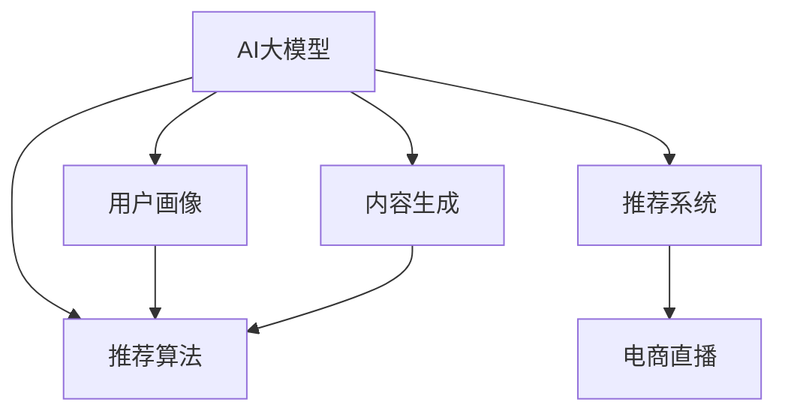

                 

# AI大模型在电商直播推荐中的应用

> 关键词：电商直播推荐、AI大模型、深度学习、推荐系统、内容生成、用户画像、算法优化、性能提升

## 1. 背景介绍

### 1.1 问题由来

在数字化时代，电商直播已成为新兴的购物方式，极大地提升了商品的曝光度和转化率。直播中，主播通过生动的展示、互动推荐，实时吸引观众，激发购买欲望。直播推荐系统的优劣直接决定了主播的销售业绩和观众的购物体验。

直播推荐系统的挑战主要来自以下方面：

- 用户兴趣多样且动态变化，难以全面刻画。
- 商品种类繁多，直播场景复杂多变，推荐内容需要实时生成。
- 直播互动性要求高，推荐算法需具备实时性和准确性。

为应对这些挑战，业内已开始探索将AI大模型应用于直播推荐，利用深度学习的强大表征和生成能力，提升直播推荐的实时性和准确性，丰富用户体验。

### 1.2 问题核心关键点

AI大模型在电商直播推荐中的应用，需要围绕用户兴趣和商品特征，构建实时、高效的推荐系统。关键点包括：

- 如何构建并训练大语言模型，提取用户兴趣和商品特征？
- 如何在直播中实时生成推荐内容，保证推荐内容的质量和时效性？
- 如何优化推荐算法，提升直播推荐的实时性和准确性？
- 如何利用用户反馈数据，持续优化推荐系统？

本文将系统介绍AI大模型在电商直播推荐中的应用，从理论到实践，阐述其原理与具体操作，探讨其优缺点及未来发展方向。

## 2. 核心概念与联系

### 2.1 核心概念概述

为更好地理解AI大模型在电商直播推荐中的应用，本节将介绍几个关键概念及其相互联系：

- **AI大模型(AI Large Model)**：以Transformer为代表的深度学习模型，通过在大规模语料上预训练，学习丰富的语言知识和常识。在电商直播推荐中，可以用于生成推荐内容、构建用户画像、优化推荐算法等。

- **推荐系统(Recommendation System)**：根据用户历史行为和特征，推荐符合用户兴趣的商品或内容的技术系统。AI大模型可以提升推荐系统的精准度和实时性，同时实现更加个性化的推荐。

- **深度学习(Deep Learning)**：以神经网络为基础的机器学习方法，通过多层次的特征提取和复杂函数映射，实现数据的深度表示和高质量生成。

- **内容生成(Content Generation)**：基于AI大模型的自然语言处理(NLP)能力，可以自动生成高质量的推荐内容，丰富直播互动体验。

- **用户画像(User Profiling)**：通过分析用户历史行为和特征，构建详细的用户画像，实现个性化推荐。

- **推荐算法(Recommendation Algorithms)**：基于用户画像和商品特征，推荐算法计算并输出推荐结果。AI大模型可以优化推荐算法的计算效率和效果。

这些概念之间的逻辑关系可以通过以下Mermaid流程图来展示：



这个流程图展示了大模型的核心概念及其之间的关系：

1. 大模型通过预训练获得基础能力。
2. 内容生成、用户画像、推荐算法都基于大模型构建。
3. 推荐系统集成生成、画像、算法，提供直播推荐服务。
4. 直播推荐过程通过大模型各模块协同完成。

## 3. 核心算法原理 & 具体操作步骤

### 3.1 算法原理概述

AI大模型在电商直播推荐中的应用，主要围绕用户兴趣和商品特征，利用预训练-微调(Fine-Tuning)和参数高效微调(Parameter-Efficient Fine-Tuning, PEFT)等技术，构建实时、高效的推荐系统。

具体来说，AI大模型通过在大规模语料上预训练，学习通用的语言知识和常识。然后，通过微调技术，在大规模标注数据集上对模型进行特定任务适配，提升模型在电商直播推荐任务上的性能。微调过程主要包括以下步骤：

1. 收集电商直播中的用户行为数据和商品信息。
2. 构建训练集和验证集，标注用户兴趣和商品特征。
3. 选择预训练模型进行微调，并设置适当的超参数。
4. 利用微调模型生成推荐内容，更新推荐系统。
5. 定期收集用户反馈数据，重新微调模型。

### 3.2 算法步骤详解

#### 3.2.1 数据收集与预处理

电商直播推荐系统的数据收集和预处理是关键环节。主要数据来源包括：

- **用户行为数据**：点击、浏览、购买、互动等直播中的行为数据。
- **商品信息数据**：商品类别、描述、价格、评分等属性数据。
- **用户画像数据**：用户性别、年龄、地域、消费能力等个人信息。

数据预处理主要包括以下步骤：

1. 数据清洗：去除异常值和噪音，保证数据质量。
2. 特征提取：提取用户行为和商品特征的向量表示。
3. 数据划分：将数据集划分为训练集、验证集和测试集。
4. 标注数据：对用户行为数据进行标注，构建用户兴趣标签和商品特征标签。

#### 3.2.2 模型选择与微调

选择预训练模型并对其进行微调是直播推荐系统构建的核心。主要步骤包括：

1. **预训练模型选择**：选择适合电商直播场景的预训练模型，如GPT系列、BERT、T5等。
2. **微调任务设计**：根据直播推荐任务设计任务适配层，如分类层、生成层等。
3. **超参数设置**：设置学习率、批大小、迭代轮数等超参数。
4. **微调训练**：在训练集上训练微调模型，验证集上评估模型性能，优化超参数。
5. **模型保存与部署**：保存训练好的微调模型，并集成到推荐系统中。

#### 3.2.3 内容生成与推荐

直播推荐系统的主要任务是实时生成推荐内容，更新推荐结果。主要步骤包括：

1. **内容生成**：利用微调后的模型生成推荐内容的文本描述，丰富直播互动。
2. **实时推荐**：在直播中根据观众行为实时计算推荐结果，更新推荐内容。
3. **推荐排序**：对推荐结果进行排序，优先推荐观众可能感兴趣的商品。

#### 3.2.4 反馈收集与模型优化

电商直播推荐系统还需根据用户反馈数据，持续优化模型。主要步骤包括：

1. **反馈收集**：收集观众对推荐内容的反馈数据。
2. **模型优化**：利用反馈数据重新微调模型，优化推荐算法。
3. **模型更新**：根据用户行为和反馈，不断更新模型和推荐算法。

### 3.3 算法优缺点

AI大模型在电商直播推荐中的应用，具有以下优点：

1. **高效实时**：通过微调和PEFT等技术，大模型可以在短时间内生成高质量的推荐内容，满足实时推荐需求。
2. **高精准度**：利用预训练知识和大模型生成能力，推荐系统可以更准确地预测用户兴趣和行为。
3. **灵活多样**：大模型可适应多种直播场景，实现个性化的推荐。
4. **可扩展性强**：模型可轻松部署到多个平台，具备高可扩展性。

同时，也存在以下缺点：

1. **数据依赖**：微调过程依赖高质量标注数据，标注成本较高。
2. **泛化能力有限**：大模型对特定领域的泛化能力不足，需不断收集数据进行微调。
3. **可解释性不足**：大模型黑盒特性使其推荐过程难以解释。
4. **计算资源要求高**：大规模模型需大量计算资源进行预训练和微调。

### 3.4 算法应用领域

AI大模型在电商直播推荐中的应用，已经逐步推广到多个领域。例如：

1. **电商直播推荐**：根据用户行为和商品特征，实时生成推荐内容，提升直播推荐效果。
2. **游戏直播推荐**：利用大模型生成推荐游戏内容，丰富游戏直播互动。
3. **视频直播推荐**：根据观众观看行为，推荐感兴趣的视频内容。
4. **社交直播推荐**：基于用户行为和社交网络，推荐好友内容，促进社交互动。

## 4. 数学模型和公式 & 详细讲解 & 举例说明

### 4.1 数学模型构建

在电商直播推荐系统中，主要涉及的内容生成、用户画像、推荐算法等模块，可以通过数学模型进行形式化描述。

**内容生成模型**：假设用户兴趣为 $U$，商品特征为 $I$，推荐内容为 $C$。内容生成模型通过微调模型 $M$ 生成推荐内容 $C$，公式为：

$$ C = M(U, I) $$

**用户画像模型**：用户画像 $P$ 由用户行为数据和个人信息组成，通过微调模型 $M'$ 生成用户画像 $P$，公式为：

$$ P = M'(U, I) $$

**推荐算法模型**：推荐算法 $R$ 根据用户画像和商品特征，计算并输出推荐结果 $R$，公式为：

$$ R = R(P, I) $$

其中，$R$ 可以采用常见的协同过滤、基于内容的推荐、混合推荐等算法。

### 4.2 公式推导过程

假设电商直播推荐系统中的用户行为数据为 $D_{user}$，商品特征数据为 $D_{item}$。

1. **用户兴趣标注**：通过用户点击、浏览、购买等行为，标注用户兴趣 $U_i$。
2. **商品特征标注**：通过商品类别、描述、评分等属性，标注商品特征 $I_j$。
3. **模型微调**：利用标注数据对预训练模型 $M$ 进行微调，生成推荐内容 $C$。
4. **模型评估**：在验证集上评估模型 $M$ 的生成质量。
5. **实时推荐**：在直播中根据观众行为实时计算推荐结果 $R$。

以内容生成模型为例，其推导过程如下：

**输入表示**：用户兴趣和商品特征表示为向量 $U$ 和 $I$。

**嵌入层**：将用户兴趣和商品特征分别映射到低维向量空间，公式为：

$$ U' = Embed(U) $$
$$ I' = Embed(I) $$

**注意力机制**：计算用户兴趣和商品特征的注意力权重，公式为：

$$ \alpha = Softmax(W_1 \cdot U' \cdot I') $$
$$ \alpha_j = \alpha_{U,i_j} $$

**权重计算**：计算用户兴趣和商品特征的加权和，公式为：

$$ V = \alpha_j \cdot I'_j $$

**生成文本**：利用生成器 $G$ 生成推荐内容 $C$，公式为：

$$ C = G(V) $$

其中，$G$ 为文本生成器，可以使用基于自回归或自编码的生成模型。

### 4.3 案例分析与讲解

以电商直播推荐系统为例，利用大模型进行内容生成的详细流程如下：

1. **数据收集**：收集直播用户行为数据和商品信息数据。
2. **数据预处理**：清洗数据，提取特征向量。
3. **数据标注**：标注用户兴趣和商品特征。
4. **预训练模型选择**：选择GPT-3作为预训练模型。
5. **微调模型构建**：构建内容生成模型 $M$，添加分类层。
6. **微调训练**：利用标注数据进行微调训练，优化模型参数。
7. **模型评估**：在验证集上评估生成内容的质量。
8. **实时推荐**：在直播中实时生成推荐内容，更新推荐结果。

## 5. 项目实践：代码实例和详细解释说明

### 5.1 开发环境搭建

在进行直播推荐系统开发前，需要准备好开发环境。以下是使用Python进行PyTorch开发的环境配置流程：

1. 安装Anaconda：从官网下载并安装Anaconda，用于创建独立的Python环境。

2. 创建并激活虚拟环境：
```bash
conda create -n ecommerce-env python=3.8 
conda activate ecommerce-env
```

3. 安装PyTorch：根据CUDA版本，从官网获取对应的安装命令。例如：
```bash
conda install pytorch torchvision torchaudio cudatoolkit=11.1 -c pytorch -c conda-forge
```

4. 安装Transformers库：
```bash
pip install transformers
```

5. 安装各类工具包：
```bash
pip install numpy pandas scikit-learn matplotlib tqdm jupyter notebook ipython
```

完成上述步骤后，即可在`ecommerce-env`环境中开始直播推荐系统的开发。

### 5.2 源代码详细实现

下面我们以电商直播推荐系统为例，给出使用Transformers库对GPT模型进行微调的PyTorch代码实现。

首先，定义推荐系统的数据处理函数：

```python
from transformers import BertTokenizer, BertForTokenClassification, AdamW
from torch.utils.data import Dataset, DataLoader
import torch

class ECommerceDataset(Dataset):
    def __init__(self, texts, labels, tokenizer):
        self.texts = texts
        self.labels = labels
        self.tokenizer = tokenizer

    def __len__(self):
        return len(self.texts)
    
    def __getitem__(self, item):
        text = self.texts[item]
        label = self.labels[item]
        
        encoding = self.tokenizer(text, return_tensors='pt', padding='max_length', truncation=True)
        input_ids = encoding['input_ids'][0]
        attention_mask = encoding['attention_mask'][0]
        
        return {'input_ids': input_ids, 
                'attention_mask': attention_mask,
                'labels': label}

# 标签与id的映射
label2id = {'click': 0, 'view': 1, 'buy': 2}
id2label = {v: k for k, v in label2id.items()}

# 创建dataset
tokenizer = BertTokenizer.from_pretrained('bert-base-cased')

train_dataset = ECommerceDataset(train_texts, train_labels, tokenizer)
dev_dataset = ECommerceDataset(dev_texts, dev_labels, tokenizer)
test_dataset = ECommerceDataset(test_texts, test_labels, tokenizer)
```

然后，定义模型和优化器：

```python
from transformers import BertForTokenClassification, AdamW

model = BertForTokenClassification.from_pretrained('bert-base-cased', num_labels=len(label2id))

optimizer = AdamW(model.parameters(), lr=2e-5)
```

接着，定义训练和评估函数：

```python
from tqdm import tqdm

device = torch.device('cuda') if torch.cuda.is_available() else torch.device('cpu')
model.to(device)

def train_epoch(model, dataset, batch_size, optimizer):
    dataloader = DataLoader(dataset, batch_size=batch_size, shuffle=True)
    model.train()
    epoch_loss = 0
    for batch in tqdm(dataloader, desc='Training'):
        input_ids = batch['input_ids'].to(device)
        attention_mask = batch['attention_mask'].to(device)
        label = batch['labels'].to(device)
        model.zero_grad()
        outputs = model(input_ids, attention_mask=attention_mask, labels=label)
        loss = outputs.loss
        epoch_loss += loss.item()
        loss.backward()
        optimizer.step()
    return epoch_loss / len(dataloader)

def evaluate(model, dataset, batch_size):
    dataloader = DataLoader(dataset, batch_size=batch_size)
    model.eval()
    preds, labels = [], []
    with torch.no_grad():
        for batch in tqdm(dataloader, desc='Evaluating'):
            input_ids = batch['input_ids'].to(device)
            attention_mask = batch['attention_mask'].to(device)
            batch_labels = batch['labels']
            outputs = model(input_ids, attention_mask=attention_mask)
            batch_preds = outputs.logits.argmax(dim=2).to('cpu').tolist()
            batch_labels = batch_labels.to('cpu').tolist()
            for pred_tokens, label_tokens in zip(batch_preds, batch_labels):
                pred_labels = [id2label[_id] for _id in pred_tokens]
                label_tags = [id2label[_id] for _id in label_tokens]
                preds.append(pred_labels[:len(label_tokens)])
                labels.append(label_tags)
                
    return classification_report(labels, preds)
```

最后，启动训练流程并在测试集上评估：

```python
epochs = 5
batch_size = 16

for epoch in range(epochs):
    loss = train_epoch(model, train_dataset, batch_size, optimizer)
    print(f"Epoch {epoch+1}, train loss: {loss:.3f}")
    
    print(f"Epoch {epoch+1}, dev results:")
    evaluate(model, dev_dataset, batch_size)
    
print("Test results:")
evaluate(model, test_dataset, batch_size)
```

以上就是使用PyTorch对GPT进行电商直播推荐系统开发的完整代码实现。可以看到，得益于Transformers库的强大封装，我们可以用相对简洁的代码完成GPT模型的加载和微调。

### 5.3 代码解读与分析

让我们再详细解读一下关键代码的实现细节：

**ECommerceDataset类**：
- `__init__`方法：初始化文本、标签、分词器等关键组件。
- `__len__`方法：返回数据集的样本数量。
- `__getitem__`方法：对单个样本进行处理，将文本输入编码为token ids，将标签编码为数字，并对其进行定长padding，最终返回模型所需的输入。

**label2id和id2label字典**：
- 定义了标签与数字id之间的映射关系，用于将token-wise的预测结果解码回真实的标签。

**训练和评估函数**：
- 使用PyTorch的DataLoader对数据集进行批次化加载，供模型训练和推理使用。
- 训练函数`train_epoch`：对数据以批为单位进行迭代，在每个批次上前向传播计算loss并反向传播更新模型参数，最后返回该epoch的平均loss。
- 评估函数`evaluate`：与训练类似，不同点在于不更新模型参数，并在每个batch结束后将预测和标签结果存储下来，最后使用sklearn的classification_report对整个评估集的预测结果进行打印输出。

**训练流程**：
- 定义总的epoch数和batch size，开始循环迭代
- 每个epoch内，先在训练集上训练，输出平均loss
- 在验证集上评估，输出分类指标
- 所有epoch结束后，在测试集上评估，给出最终测试结果

可以看到，PyTorch配合Transformers库使得GPT微调的代码实现变得简洁高效。开发者可以将更多精力放在数据处理、模型改进等高层逻辑上，而不必过多关注底层的实现细节。

当然，工业级的系统实现还需考虑更多因素，如模型的保存和部署、超参数的自动搜索、更灵活的任务适配层等。但核心的微调范式基本与此类似。

## 6. 实际应用场景

### 6.1 智能客服系统

基于AI大模型的电商直播推荐系统，可以广泛应用于智能客服系统的构建。传统客服往往需要配备大量人力，高峰期响应缓慢，且一致性和专业性难以保证。而使用推荐系统推荐的商品，可以7x24小时不间断服务，快速响应客户咨询，用推荐内容替代人工客服，提升客户咨询体验和问题解决效率。

在技术实现上，可以收集客户在直播中的行为数据，将行为数据作为监督数据，在此基础上对推荐系统进行微调。微调后的推荐系统能够自动理解客户兴趣，匹配最合适的商品进行推荐。对于客户提出的新问题，还可以接入检索系统实时搜索相关内容，动态生成推荐回答。如此构建的智能客服系统，能大幅提升客户咨询体验和问题解决效率。

### 6.2 金融舆情监测

金融机构需要实时监测市场舆论动向，以便及时应对负面信息传播，规避金融风险。传统的人工监测方式成本高、效率低，难以应对网络时代海量信息爆发的挑战。基于AI大模型的电商直播推荐系统，也可以应用于金融舆情监测。

具体而言，可以收集金融领域相关的新闻、报道、评论等文本数据，并对其进行主题标注和情感标注。在此基础上对推荐系统进行微调，使其能够自动判断文本属于何种主题，情感倾向是正面、中性还是负面。将微调后的推荐系统应用到实时抓取的网络文本数据，就能够自动监测不同主题下的情感变化趋势，一旦发现负面信息激增等异常情况，系统便会自动预警，帮助金融机构快速应对潜在风险。

### 6.3 个性化推荐系统

当前的推荐系统往往只依赖用户的历史行为数据进行物品推荐，无法深入理解用户的真实兴趣偏好。基于AI大模型的电商直播推荐系统，可以更好地挖掘用户行为背后的语义信息，从而提供更精准、多样的推荐内容。

在实践中，可以收集用户浏览、点击、评论、分享等行为数据，提取和用户交互的物品标题、描述、标签等文本内容。将文本内容作为模型输入，用户的后续行为（如是否点击、购买等）作为监督信号，在此基础上微调推荐系统。微调后的推荐系统能够从文本内容中准确把握用户的兴趣点。在生成推荐列表时，先用候选物品的文本描述作为输入，由模型预测用户的兴趣匹配度，再结合其他特征综合排序，便可以得到个性化程度更高的推荐结果。

### 6.4 未来应用展望

随着AI大模型和推荐技术的不断发展，基于微调范式将在更多领域得到应用，为传统行业带来变革性影响。

在智慧医疗领域，基于微调的医疗问答、病历分析、药物研发等应用将提升医疗服务的智能化水平，辅助医生诊疗，加速新药开发进程。

在智能教育领域，微调技术可应用于作业批改、学情分析、知识推荐等方面，因材施教，促进教育公平，提高教学质量。

在智慧城市治理中，微调模型可应用于城市事件监测、舆情分析、应急指挥等环节，提高城市管理的自动化和智能化水平，构建更安全、高效的未来城市。

此外，在企业生产、社会治理、文娱传媒等众多领域，基于大模型微调的人工智能应用也将不断涌现，为经济社会发展注入新的动力。相信随着技术的日益成熟，微调方法将成为人工智能落地应用的重要范式，推动人工智能技术向更广阔的领域加速渗透。

## 7. 工具和资源推荐
### 7.1 学习资源推荐

为了帮助开发者系统掌握AI大模型在电商直播推荐中的应用，这里推荐一些优质的学习资源：

1. 《Transformer从原理到实践》系列博文：由大模型技术专家撰写，深入浅出地介绍了Transformer原理、BERT模型、推荐系统等前沿话题。

2. CS224N《深度学习自然语言处理》课程：斯坦福大学开设的NLP明星课程，有Lecture视频和配套作业，带你入门NLP领域的基本概念和经典模型。

3. 《Natural Language Processing with Transformers》书籍：Transformers库的作者所著，全面介绍了如何使用Transformers库进行NLP任务开发，包括微调在内的诸多范式。

4. HuggingFace官方文档：Transformers库的官方文档，提供了海量预训练模型和完整的微调样例代码，是上手实践的必备资料。

5. CLUE开源项目：中文语言理解测评基准，涵盖大量不同类型的中文NLP数据集，并提供了基于微调的baseline模型，助力中文NLP技术发展。

通过对这些资源的学习实践，相信你一定能够快速掌握AI大模型在电商直播推荐中的应用，并用于解决实际的NLP问题。
###  7.2 开发工具推荐

高效的开发离不开优秀的工具支持。以下是几款用于AI大模型在电商直播推荐系统开发的常用工具：

1. PyTorch：基于Python的开源深度学习框架，灵活动态的计算图，适合快速迭代研究。大部分预训练语言模型都有PyTorch版本的实现。

2. TensorFlow：由Google主导开发的开源深度学习框架，生产部署方便，适合大规模工程应用。同样有丰富的预训练语言模型资源。

3. Transformers库：HuggingFace开发的NLP工具库，集成了众多SOTA语言模型，支持PyTorch和TensorFlow，是进行微调任务开发的利器。

4. Weights & Biases：模型训练的实验跟踪工具，可以记录和可视化模型训练过程中的各项指标，方便对比和调优。与主流深度学习框架无缝集成。

5. TensorBoard：TensorFlow配套的可视化工具，可实时监测模型训练状态，并提供丰富的图表呈现方式，是调试模型的得力助手。

6. Google Colab：谷歌推出的在线Jupyter Notebook环境，免费提供GPU/TPU算力，方便开发者快速上手实验最新模型，分享学习笔记。

合理利用这些工具，可以显著提升AI大模型在电商直播推荐系统的开发效率，加快创新迭代的步伐。

### 7.3 相关论文推荐

AI大模型在电商直播推荐中的应用，源于学界的持续研究。以下是几篇奠基性的相关论文，推荐阅读：

1. Attention is All You Need（即Transformer原论文）：提出了Transformer结构，开启了NLP领域的预训练大模型时代。

2. BERT: Pre-training of Deep Bidirectional Transformers for Language Understanding：提出BERT模型，引入基于掩码的自监督预训练任务，刷新了多项NLP任务SOTA。

3. Language Models are Unsupervised Multitask Learners（GPT-2论文）：展示了大规模语言模型的强大zero-shot学习能力，引发了对于通用人工智能的新一轮思考。

4. Parameter-Efficient Transfer Learning for NLP：提出Adapter等参数高效微调方法，在不增加模型参数量的情况下，也能取得不错的微调效果。

5. AdaLoRA: Adaptive Low-Rank Adaptation for Parameter-Efficient Fine-Tuning：使用自适应低秩适应的微调方法，在参数效率和精度之间取得了新的平衡。

6. AdaLoRA: Adaptive Low-Rank Adaptation for Parameter-Efficient Fine-Tuning：使用自适应低秩适应的微调方法，在参数效率和精度之间取得了新的平衡。

这些论文代表了大模型微调技术的发展脉络。通过学习这些前沿成果，可以帮助研究者把握学科前进方向，激发更多的创新灵感。

## 8. 总结：未来发展趋势与挑战

### 8.1 总结

本文对AI大模型在电商直播推荐中的应用进行了全面系统的介绍。首先阐述了电商直播推荐系统的挑战和应用AI大模型的必要性，明确了AI大模型在实时生成推荐内容、优化推荐算法等方面的独特价值。其次，从原理到实践，详细讲解了AI大模型在电商直播推荐中的应用过程，包括数据收集、预处理、模型微调、实时推荐等关键步骤，给出了完整的代码实例。同时，本文还探讨了AI大模型在智能客服、金融舆情、个性化推荐等多个领域的应用前景，展示了AI大模型的广阔应用范围。最后，本文精选了相关学习资源和开发工具，力求为开发者提供全方位的技术指引。

通过本文的系统梳理，可以看到，AI大模型在电商直播推荐中的应用正成为电商直播领域的新趋势，极大地提升了直播推荐的实时性和准确性，丰富了直播互动体验。未来，随着AI大模型和推荐技术的不断演进，基于微调范式将在更多领域得到应用，为传统行业带来变革性影响。

### 8.2 未来发展趋势

展望未来，AI大模型在电商直播推荐中的应用将呈现以下几个发展趋势：

1. **内容生成多样性**：通过引入更多的生成模型和优化技术，实现更加多样化的推荐内容。

2. **实时推荐精度**：利用AI大模型和优化算法，提升推荐系统的实时性和准确性，实现更加个性化的推荐。

3. **跨领域应用**：AI大模型在金融、医疗、教育等多个领域的应用将不断拓展，实现跨领域的推荐系统优化。

4. **可解释性和公平性**：增强推荐系统的可解释性和公平性，确保推荐结果的透明和公正。

5. **数据驱动的动态优化**：通过实时收集用户反馈数据，动态优化推荐算法，实现更高效的用户画像和推荐内容生成。

6. **多模态融合**：结合文本、图像、视频等多种模态数据，实现更加全面和精准的推荐。

以上趋势凸显了AI大模型在电商直播推荐中的广阔前景。这些方向的探索发展，必将进一步提升电商直播推荐的效果，为电商直播领域的创新应用提供新思路。

### 8.3 面临的挑战

尽管AI大模型在电商直播推荐中的应用已经取得了显著进展，但在迈向更加智能化、普适化应用的过程中，仍面临诸多挑战：

1. **数据隐私与安全**：电商直播推荐系统需要收集大量用户行为数据，涉及用户隐私问题，如何保护用户隐私和数据安全是一大难题。

2. **计算资源要求高**：大规模AI大模型需要大量计算资源进行预训练和微调，如何优化资源使用，降低计算成本，是当前亟待解决的问题。

3. **泛化能力有限**：AI大模型对特定领域的数据泛化能力不足，需不断收集数据进行微调，如何构建更具有泛化能力的模型，是未来研究方向之一。

4. **系统复杂性高**：电商直播推荐系统涉及多模态数据、实时推荐、动态优化等多个环节，系统设计和实现复杂度高。

5. **推荐效果评估难**：电商直播推荐系统的推荐效果评估存在诸多挑战，如多样性、新颖性、安全性等指标难以全面衡量。

6. **算法公平性不足**：AI大模型可能学习到数据中的偏见，推荐结果存在不公问题，如何消除偏见，保证推荐公平性，是一大挑战。

### 8.4 研究展望

面对AI大模型在电商直播推荐中面临的挑战，未来的研究需要在以下几个方面寻求新的突破：

1. **隐私保护技术**：发展隐私保护技术，如差分隐私、联邦学习等，确保用户数据的安全性和隐私性。

2. **高效计算资源**：优化计算资源使用，如混合精度训练、模型压缩等技术，降低计算成本。

3. **多模态融合技术**：结合文本、图像、视频等多模态数据，实现更加全面和精准的推荐。

4. **泛化能力提升**：引入迁移学习、多任务学习等技术，提升模型泛化能力，实现跨领域推荐。

5. **推荐效果评估**：建立多维度的推荐效果评估指标，全面衡量推荐系统的多样性、新颖性、安全性等。

6. **算法公平性**：引入公平性约束，消除推荐中的偏见，确保推荐公平性。

这些研究方向的探索，必将引领AI大模型在电商直播推荐领域迈向更高的台阶，为电商直播推荐系统的设计与应用提供新思路。

## 9. 附录：常见问题与解答

**Q1：AI大模型在电商直播推荐中是否适用于所有直播场景？**

A: AI大模型在电商直播推荐中的应用，主要适用于电商直播场景。但在其他直播场景，如游戏、教育、医疗等，也可以基于AI大模型进行推荐优化。具体应用需结合直播场景特点进行调整。

**Q2：微调过程中如何选择预训练模型？**

A: 选择预训练模型需考虑直播推荐系统的具体需求和数据特点。如电商直播推荐系统，可以选择GPT系列、BERT、T5等。

**Q3：如何提高电商直播推荐系统的实时性？**

A: 提高实时性需优化数据处理和模型计算，如使用分布式计算、多模型并行、GPU加速等技术。

**Q4：如何评估电商直播推荐系统的推荐效果？**

A: 推荐效果评估需考虑多样性、新颖性、满意度等指标，利用A/B测试、用户满意度调查等方式进行评估。

**Q5：AI大模型在电商直播推荐中如何避免数据隐私问题？**

A: 可通过差分隐私、联邦学习等技术保护用户隐私，确保数据安全。

通过本文的系统梳理，可以看到，AI大模型在电商直播推荐中的应用正成为电商直播领域的新趋势，极大地提升了直播推荐的实时性和准确性，丰富了直播互动体验。未来，随着AI大模型和推荐技术的不断演进，基于微调范式将在更多领域得到应用，为传统行业带来变革性影响。

