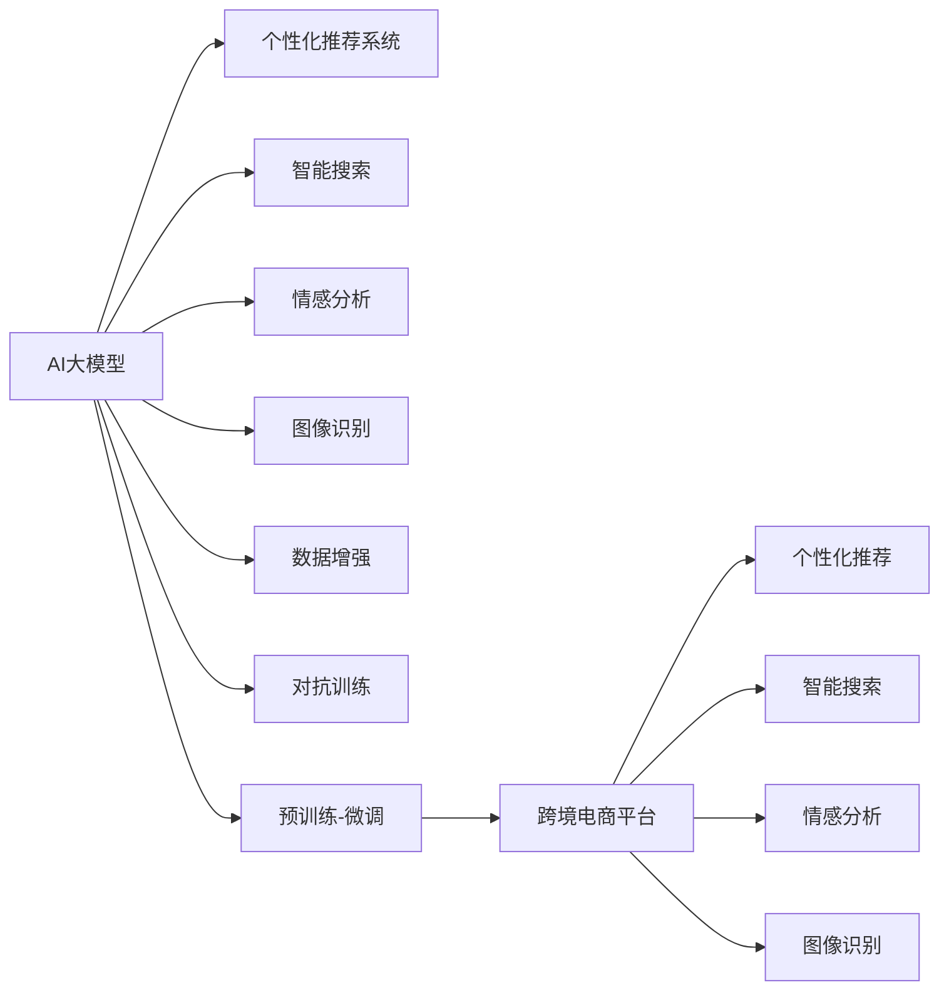

                 

# AI大模型如何优化电商平台的跨境购物体验

## 1. 背景介绍

随着全球化的加速和互联网的普及，跨境电商正在成为连接全球消费者和商家的新型贸易方式。越来越多的商家希望通过跨境电商平台进入国际市场，提供丰富多元的商品选择和便捷高效的购物体验。与此同时，消费者也更加关注商品的质量、价格、配送速度和购物体验，要求跨境电商平台能够提供与本地市场相同的高水平服务。在这种情况下，AI大模型技术成为优化电商平台跨境购物体验的关键利器。

AI大模型技术能够利用海量的数据和强大的学习能力，从多个维度对电商平台进行智能优化，提高其竞争力。本文将探讨AI大模型如何通过个性化推荐、智能搜索、情感分析、图像识别等技术，优化跨境电商平台的购物体验，使其在全球市场中脱颖而出。

## 2. 核心概念与联系

### 2.1 核心概念概述

为更好地理解AI大模型如何优化电商平台跨境购物体验，本节将介绍几个密切相关的核心概念：

- **AI大模型**：基于大规模无标签数据进行预训练的深度学习模型，能够自动学习并提取复杂的特征，广泛应用于自然语言处理、计算机视觉、语音识别等诸多领域。
- **个性化推荐系统**：根据用户的历史行为和兴趣，智能推荐可能感兴趣的物品或服务。
- **智能搜索**：利用NLP技术解析用户查询意图，提供更精准的搜索结果。
- **情感分析**：通过文本分析，判断用户情感倾向，提升用户满意度和互动体验。
- **图像识别**：利用视觉感知技术，自动识别和分类商品图片，提高商品展示和搜索效率。
- **数据增强**：通过对训练数据进行增强，提高模型的泛化能力，解决数据不足问题。
- **对抗训练**：通过加入对抗样本，提高模型的鲁棒性，防止过拟合。
- **预训练-微调**：通过在大规模数据上预训练模型，再在小规模标注数据上进行微调，提高模型的针对性。

这些核心概念之间存在密切的联系，共同构成了AI大模型优化电商平台购物体验的技术基础。通过理解这些概念及其相互作用，我们可以更好地把握大模型技术的应用方向。

### 2.2 核心概念原理和架构的 Mermaid 流程图

## 3. 核心算法原理 & 具体操作步骤

### 3.1 算法原理概述

AI大模型优化电商平台跨境购物体验的核心算法原理基于监督学习和迁移学习，通过在大规模数据上预训练模型，再在小规模标注数据上进行微调，最终应用于电商平台的具体场景中。其关键步骤如下：

1. **数据准备**：收集平台用户行为数据、商品信息、用户评论、图片等，形成结构化和非结构化数据集。
2. **预训练**：使用大规模无标签数据对AI大模型进行预训练，学习通用的语言或视觉表示。
3. **微调**：使用平台数据对预训练模型进行微调，使其能够适应电商平台的特定需求。
4. **模型部署**：将微调后的模型部署到电商平台，实现个性化推荐、智能搜索等功能。
5. **效果评估与优化**：定期评估模型性能，不断调整模型参数和策略，以提升用户体验和平台收益。

### 3.2 算法步骤详解

#### 3.2.1 数据准备

数据准备是AI大模型优化的第一步。需要收集平台用户的各类数据，包括：

- **行为数据**：用户浏览、点击、收藏、购买等行为记录。
- **商品数据**：商品名称、价格、描述、类别、图片等。
- **用户评论**：用户对商品的评价、评分、文字评论等。
- **图片数据**：商品的高清图片、不同角度的图片等。

这些数据需要经过清洗和标注，转化为适合AI大模型处理的格式。例如，对于文本数据，可以使用BERT等预训练模型进行文本表示；对于图片数据，可以使用ResNet等预训练模型进行特征提取。

#### 3.2.2 预训练

预训练是AI大模型优化的核心环节。通过在大规模无标签数据上进行预训练，AI大模型能够学习到通用的语言或视觉表示。以下是预训练的详细步骤：

1. **选择合适的预训练模型**：如BERT、GPT-3、ResNet等。
2. **数据处理**：将无标签数据转化为适合模型处理的格式，如分词、图像分割等。
3. **模型训练**：在GPU等高性能设备上训练模型，学习通用表示。
4. **模型评估**：使用验证集评估模型性能，调整超参数，防止过拟合。

#### 3.2.3 微调

微调是将预训练模型应用于电商平台的具体场景。以下是微调的详细步骤：

1. **任务适配**：根据电商平台的业务需求，设计合适的任务适配层，如推荐、搜索、分类等。
2. **损失函数设计**：选择合适的损失函数，如交叉熵损失、均方误差损失等。
3. **优化器选择**：使用Adam、SGD等优化器进行模型优化。
4. **学习率设置**：根据预训练模型的复杂度和任务需求，设置合适的学习率。
5. **超参数调优**：使用网格搜索、随机搜索等方法，调整模型超参数。

#### 3.2.4 模型部署

模型部署是将微调后的模型集成到电商平台的实际应用中。以下是部署的详细步骤：

1. **模型集成**：将微调后的模型集成到电商平台的推荐系统、搜索系统、客服系统等。
2. **数据流设计**：设计数据流，确保模型能够实时获取和处理用户行为数据和商品信息。
3. **接口设计**：设计API接口，供其他系统调用。
4. **监控与优化**：实时监控模型性能，根据反馈进行优化。

#### 3.2.5 效果评估与优化

效果评估与优化是AI大模型优化的持续环节。以下是评估与优化的详细步骤：

1. **性能评估**：使用测试集评估模型性能，如推荐准确率、召回率、点击率等。
2. **用户反馈收集**：收集用户反馈，了解用户满意度。
3. **模型优化**：根据评估结果和用户反馈，优化模型参数和策略，提升用户体验。

### 3.3 算法优缺点

AI大模型优化电商平台跨境购物体验的优点包括：

- **通用性强**：能够应用于多种电商场景，如个性化推荐、智能搜索等。
- **效果显著**：通过学习用户行为和商品信息，能够显著提升用户满意度和平台收益。
- **数据需求小**：在预训练阶段使用大规模无标签数据，在微调阶段使用小规模标注数据，降低标注成本。
- **灵活度高**：可以根据业务需求进行调整，适应不同的电商平台和市场环境。

然而，AI大模型优化电商平台的跨境购物体验也存在一些缺点：

- **计算资源需求高**：预训练和微调过程需要大量的计算资源，对硬件设备要求高。
- **模型复杂度大**：大模型参数量巨大，需要高效的存储和传输方式。
- **对抗样本敏感**：对抗样本可能导致模型输出错误，需要加强对抗训练。
- **数据隐私问题**：电商平台需要处理大量的用户数据，数据隐私问题需要特别注意。

### 3.4 算法应用领域

AI大模型优化电商平台跨境购物体验的应用领域非常广泛，包括：

- **个性化推荐**：根据用户行为和商品信息，智能推荐可能感兴趣的物品或服务。
- **智能搜索**：利用NLP技术解析用户查询意图，提供更精准的搜索结果。
- **情感分析**：通过文本分析，判断用户情感倾向，提升用户满意度和互动体验。
- **图像识别**：利用视觉感知技术，自动识别和分类商品图片，提高商品展示和搜索效率。
- **数据增强**：通过对训练数据进行增强，提高模型的泛化能力，解决数据不足问题。
- **对抗训练**：通过加入对抗样本，提高模型的鲁棒性，防止过拟合。

## 4. 数学模型和公式 & 详细讲解 & 举例说明

### 4.1 数学模型构建

以下是使用Python和TensorFlow构建个性化推荐系统的数学模型和公式：

1. **输入层**：将用户行为数据和商品信息转化为适合模型处理的格式，如将商品ID和用户行为转换为向量表示。
2. **预训练层**：使用预训练的BERT模型对用户行为和商品信息进行表示。
3. **任务适配层**：根据电商平台的业务需求，设计合适的任务适配层，如评分预测、概率分布等。
4. **输出层**：将任务适配层的输出作为模型预测结果。

#### 4.1.1 预训练模型

以BERT为例，预训练模型可以表示为：

$$
\text{BERT}(x) = \text{Embedding}(x) + \text{LayerNorm} + \text{Multi-Head Self-Attention} + \text{FeedForward} + \text{LayerNorm}
$$

其中，$x$为输入向量。

#### 4.1.2 任务适配层

假设任务适配层为线性回归模型，输出层为预测评分：

$$
\text{Output} = \text{W} \times \text{BERT}(x) + \text{b}
$$

其中，$\text{W}$和$\text{b}$为模型参数。

### 4.2 公式推导过程

以下是线性回归模型的公式推导过程：

1. **损失函数**：均方误差损失函数：

$$
\text{Loss} = \frac{1}{2} \sum_{i=1}^{N}(y_i - \hat{y}_i)^2
$$

其中，$y_i$为真实标签，$\hat{y}_i$为模型预测值。

2. **梯度计算**：通过反向传播计算梯度：

$$
\frac{\partial \text{Loss}}{\partial \theta} = \sum_{i=1}^{N}(y_i - \hat{y}_i) \frac{\partial \hat{y}_i}{\partial \theta}
$$

其中，$\theta$为模型参数。

3. **参数更新**：使用梯度下降等优化算法更新模型参数：

$$
\theta \leftarrow \theta - \eta \nabla_{\theta} \text{Loss}
$$

其中，$\eta$为学习率。

### 4.3 案例分析与讲解

以Amazon商品推荐系统为例，利用AI大模型进行个性化推荐。

1. **数据准备**：收集用户行为数据、商品信息和用户评论。
2. **预训练**：使用BERT对用户行为和商品信息进行预训练，学习通用表示。
3. **微调**：将预训练模型应用于商品评分预测任务，使用随机梯度下降进行微调。
4. **模型部署**：将微调后的模型集成到Amazon推荐系统中。
5. **效果评估**：使用测试集评估推荐系统性能，收集用户反馈进行优化。

## 5. 项目实践：代码实例和详细解释说明

### 5.1 开发环境搭建

以下是使用Python和TensorFlow搭建个性化推荐系统的开发环境：

1. **安装Python**：从官网下载并安装Python 3.7以上版本。
2. **安装TensorFlow**：使用pip安装TensorFlow 2.x版本。
3. **安装BERT预训练模型**：使用pip安装TensorFlow Hub。
4. **安装其他依赖库**：如numpy、pandas、scikit-learn等。

### 5.2 源代码详细实现

以下是使用TensorFlow搭建个性化推荐系统的源代码实现：

1. **数据准备**：将用户行为数据和商品信息导入Pandas DataFrame中。
2. **预训练模型**：使用TensorFlow Hub加载BERT预训练模型，提取用户行为和商品特征。
3. **任务适配层**：设计线性回归模型，预测商品评分。
4. **模型训练**：使用随机梯度下降进行模型训练。
5. **模型评估**：使用测试集评估模型性能。

### 5.3 代码解读与分析

以下是代码实现中的关键细节：

1. **数据预处理**：使用Pandas对用户行为数据和商品信息进行清洗和转换。
2. **特征提取**：使用TensorFlow Hub加载BERT预训练模型，提取用户行为和商品特征。
3. **模型设计**：设计线性回归模型，使用TensorFlow构建计算图。
4. **模型训练**：使用TensorFlow的优化器进行模型训练，设置学习率和批量大小。
5. **模型评估**：使用TensorFlow的评估指标计算推荐系统性能。

### 5.4 运行结果展示

以下是模型训练和评估的结果展示：

1. **训练曲线**：展示模型在训练过程中的损失函数变化。
2. **评估结果**：展示模型在测试集上的预测评分和真实评分之间的误差。
3. **用户反馈**：收集用户反馈，调整模型参数和策略。

## 6. 实际应用场景

### 6.1 智能搜索

智能搜索利用NLP技术解析用户查询意图，提供更精准的搜索结果。以下是智能搜索的应用场景：

1. **商品搜索**：用户输入关键词，智能搜索系统解析查询意图，返回最相关的商品信息。
2. **推荐搜索**：结合用户行为和商品信息，提供个性化的搜索结果。
3. **多语言搜索**：支持多语言输入和展示，满足不同语种的搜索需求。

### 6.2 情感分析

情感分析通过文本分析，判断用户情感倾向，提升用户满意度和互动体验。以下是情感分析的应用场景：

1. **评论分析**：分析用户对商品的评论，判断情感倾向。
2. **用户满意度调查**：收集用户反馈，分析情感变化趋势。
3. **客服系统**：根据用户情感分析结果，自动分配客服任务。

### 6.3 图像识别

图像识别利用视觉感知技术，自动识别和分类商品图片，提高商品展示和搜索效率。以下是图像识别的应用场景：

1. **商品分类**：自动识别商品图片，进行分类展示。
2. **相似商品推荐**：根据用户浏览和购买的商品图片，推荐相似商品。
3. **自动标注**：自动识别商品图片中的关键信息，如颜色、尺寸等。

### 6.4 未来应用展望

随着AI大模型技术的不断进步，电商平台跨境购物体验的优化将迎来新的发展方向：

1. **多模态融合**：结合文本、图像、视频等多模态数据，提供更丰富的购物体验。
2. **实时推荐**：利用实时数据流，提供动态更新的个性化推荐。
3. **情感动态分析**：实时分析用户情感变化，提供动态调整的个性化服务。
4. **智能客服**：利用NLP技术，提供自然流畅的客服对话，提升用户满意度。
5. **智能定价**：根据用户行为和市场环境，动态调整商品价格，提高用户粘性和平台收益。
6. **跨文化支持**：支持多种语言和文化，提供全球化购物体验。

## 7. 工具和资源推荐

### 7.1 学习资源推荐

为了帮助开发者系统掌握AI大模型优化电商平台跨境购物体验的理论基础和实践技巧，以下是一些优质的学习资源：

1. **自然语言处理（NLP）课程**：如斯坦福大学的CS224N课程，提供深入浅出的讲解和实验指导。
2. **深度学习框架**：如TensorFlow、PyTorch等，提供强大的计算能力和丰富的模型库。
3. **TensorFlow Hub**：提供多种预训练模型和工具，方便模型复用和集成。
4. **NLP工具库**：如HuggingFace Transformers库，提供多种NLP模型和组件，支持模型微调。
5. **数据增强工具**：如ALBERT、XLNet等，提供多种数据增强技术，提升模型泛化能力。
6. **对抗训练工具**：如Foggy、Certified Attack等，提供多种对抗训练方法，提升模型鲁棒性。

### 7.2 开发工具推荐

以下是几款用于AI大模型优化电商平台的跨境购物体验开发的常用工具：

1. **Python**：Python语言简单易用，具有丰富的科学计算和机器学习库。
2. **TensorFlow**：由Google主导开发的深度学习框架，支持大规模分布式训练和部署。
3. **PyTorch**：Facebook开发的深度学习框架，支持动态计算图和GPU加速。
4. **BERT**：Google开发的预训练语言模型，支持文本表示和特征提取。
5. **HuggingFace Transformers**：提供多种预训练模型和工具，支持模型微调。
6. **Keras**：提供简单易用的API接口，方便模型构建和训练。
7. **Jupyter Notebook**：提供交互式的编程环境，方便代码调试和模型训练。

### 7.3 相关论文推荐

以下是几篇奠基性的相关论文，推荐阅读：

1. **Attention is All You Need**：提出Transformer结构，开启大模型时代。
2. **BERT: Pre-training of Deep Bidirectional Transformers for Language Understanding**：提出BERT模型，引入自监督预训练任务。
3. **GPT-3: Language Models are Unsupervised Multitask Learners**：展示GPT-3模型的zero-shot学习能力。
4. **AdaLoRA: Adaptive Low-Rank Adaptation for Parameter-Efficient Fine-Tuning**：提出AdaLoRA方法，实现参数高效微调。
5. **Pegasus: Pre-trained Sequence-to-Sequence Models for Large-Scale Language Generation Tasks**：提出Pegasus模型，支持长文本生成。

这些论文代表了大模型优化电商平台跨境购物体验的发展脉络，通过学习这些前沿成果，可以帮助研究者把握学科前进方向，激发更多的创新灵感。

## 8. 总结：未来发展趋势与挑战

### 8.1 研究成果总结

本文对AI大模型优化电商平台跨境购物体验的方法进行了全面系统的介绍。首先，从背景介绍和核心概念入手，阐述了AI大模型在跨境电商中的重要应用。其次，从算法原理到具体操作步骤，详细讲解了个性化推荐、智能搜索、情感分析、图像识别等关键技术。最后，从项目实践到未来展望，提供了详细的代码实例和应用场景，展示了AI大模型的强大能力。

### 8.2 未来发展趋势

展望未来，AI大模型优化电商平台跨境购物体验将呈现以下几个发展趋势：

1. **多模态融合**：结合文本、图像、视频等多种数据，提供更丰富的购物体验。
2. **实时推荐**：利用实时数据流，提供动态更新的个性化推荐。
3. **情感动态分析**：实时分析用户情感变化，提供动态调整的个性化服务。
4. **智能客服**：利用NLP技术，提供自然流畅的客服对话，提升用户满意度。
5. **智能定价**：根据用户行为和市场环境，动态调整商品价格，提高用户粘性和平台收益。
6. **跨文化支持**：支持多种语言和文化，提供全球化购物体验。

### 8.3 面临的挑战

尽管AI大模型在优化电商平台跨境购物体验方面取得了显著进展，但在迈向更加智能化、普适化应用的过程中，仍面临以下挑战：

1. **计算资源需求高**：预训练和微调过程需要大量的计算资源，对硬件设备要求高。
2. **模型复杂度大**：大模型参数量巨大，需要高效的存储和传输方式。
3. **对抗样本敏感**：对抗样本可能导致模型输出错误，需要加强对抗训练。
4. **数据隐私问题**：电商平台需要处理大量的用户数据，数据隐私问题需要特别注意。
5. **跨文化差异**：不同国家和地区的文化差异可能导致模型输出不一致，需要加强本地化适配。
6. **用户接受度**：用户对AI技术的接受度仍然有待提升，需要加强用户教育和技术推广。

### 8.4 研究展望

面对AI大模型优化电商平台跨境购物体验所面临的挑战，未来的研究需要在以下几个方面寻求新的突破：

1. **多语言和多文化适配**：开发多语言和多文化适配技术，提高模型在不同国家和地区的鲁棒性。
2. **跨领域知识融合**：将知识图谱、规则库等专家知识与模型进行融合，提高模型表达能力。
3. **隐私保护技术**：开发隐私保护技术，确保用户数据的安全性和隐私性。
4. **模型压缩与优化**：开发模型压缩与优化技术，提高模型推理速度和资源利用率。
5. **人机交互界面**：设计更加友好的人机交互界面，提升用户操作体验。
6. **持续学习与动态优化**：开发持续学习与动态优化算法，提高模型自适应能力和性能。

这些研究方向的探索，必将引领AI大模型优化电商平台跨境购物体验技术迈向更高的台阶，为跨境电商平台的数字化转型提供新的技术路径。

## 9. 附录：常见问题与解答

### Q1: AI大模型如何优化电商平台跨境购物体验？

A: AI大模型通过个性化推荐、智能搜索、情感分析、图像识别等技术，优化电商平台跨境购物体验。具体来说，AI大模型在大规模数据上预训练通用表示，然后在电商平台的特定任务上微调，提取用户行为和商品信息，提供个性化的购物体验。

### Q2: 预训练和微调的区别是什么？

A: 预训练是在大规模无标签数据上训练模型，学习通用的语言或视觉表示。微调是在预训练的基础上，在小规模标注数据上对模型进行进一步优化，使其能够适应特定的电商平台任务。

### Q3: 如何进行数据增强？

A: 数据增强可以通过对训练数据进行扩充和变换，提高模型的泛化能力。例如，可以使用数据扩充技术，如随机剪裁、旋转、翻转等，生成新的训练样本。

### Q4: 对抗训练如何提升模型鲁棒性？

A: 对抗训练通过加入对抗样本，提高模型的鲁棒性，防止过拟合。具体来说，在训练过程中，使用对抗样本对模型进行扰动，让模型学会识别和应对各种扰动。

### Q5: 如何优化AI大模型性能？

A: 优化AI大模型性能可以从多个方面入手，如优化模型架构、调整超参数、使用更好的数据增强和对抗训练技术、选择合适的预训练模型等。同时，定期评估模型性能，根据反馈进行优化调整，也是非常重要的。

