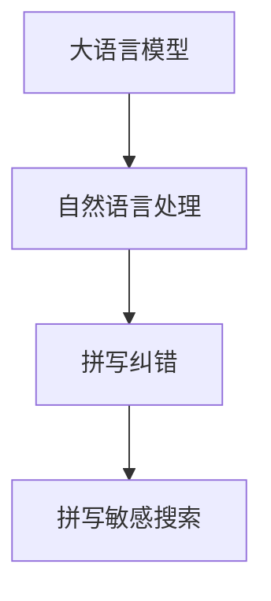

                 

# AI大模型如何处理电商搜索中的拼写错误

## 1. 背景介绍

在电商搜索场景中，拼写错误是常见的问题。用户可能因为输入错误、语音识别不准确、设备键盘故障等原因，在输入搜索词时发生拼写错误。如果电商搜索引擎无法识别这种错误，将会导致搜索结果不准确、用户体验差，进而影响业务效果。

为了应对拼写错误，电商搜索系统一般采用两种策略：

1. **拼写纠错技术**：通过词频统计、规则匹配等方法，识别用户输入的错误词，给出正确的建议。
2. **拼写敏感搜索**：根据用户输入的错误词，返回可能与之相关的搜索结果。

然而，这些方法往往依赖于已有的错误和正确词汇表，难以覆盖所有可能的拼写错误。而大模型由于其强大的语言理解能力，有望在电商搜索中处理更多样化的拼写错误。

本文将探讨如何利用大语言模型处理电商搜索中的拼写错误问题，并给出详细的技术实践。

## 2. 核心概念与联系

### 2.1 核心概念概述

在处理电商搜索中的拼写错误时，大语言模型可以发挥其语言理解和生成能力，对用户输入的文本进行语义理解，从而识别出正确的词语。具体来说，可以通过以下概念来理解大模型在处理拼写错误中的作用：

- **大语言模型(Large Language Model, LLM)**：指使用Transformer等架构，在大规模无标签文本语料上进行预训练的语言模型，具备强大的语言理解和生成能力。
- **拼写纠错(Spelling Correction)**：指识别用户输入的错误词，并给出正确的建议。
- **拼写敏感搜索(Spell Sensitive Search)**：指根据用户输入的错误词，返回可能与之相关的搜索结果。
- **自然语言处理(Natural Language Processing, NLP)**：涉及文本预处理、词向量表示、语言模型训练、语义理解与生成等技术，是处理拼写错误的关键工具。
- **Transformer**：指由Google提出的基于自注意力机制的神经网络结构，广泛应用于大语言模型中，能够高效处理长序列数据。

这些概念之间的逻辑关系可以通过以下Mermaid流程图来展示：



这个流程图展示了大语言模型在处理拼写错误中的作用：

1. 大语言模型通过预训练获取语言知识。
2. 自然语言处理技术对用户输入进行语义理解。
3. 基于语义理解的拼写纠错和拼写敏感搜索，提升电商搜索的准确性和多样性。

## 3. 核心算法原理 & 具体操作步骤

### 3.1 算法原理概述

大语言模型处理拼写错误的核心算法原理主要基于语义理解和纠错模型。假设用户输入的错误词为 $w_{\text{err}}$，模型需要识别该词的正确形式 $w_{\text{correct}}$，即求解最小化：

$$
\min_{w_{\text{correct}}} \text{distance}(w_{\text{err}}, w_{\text{correct}})
$$

其中 $\text{distance}$ 表示用户输入与正确词之间的距离。常见的距离度量方法包括编辑距离、字嵌入相似度等。

### 3.2 算法步骤详解

大模型处理拼写错误的流程主要包括以下几个步骤：

**Step 1: 预处理用户输入**

用户输入的拼写错误形式可能包含多种形式的错误，如打字错误、词汇混用等。需要对用户输入进行预处理，提取最有可能的错误词。

**Step 2: 语言模型解码**

将错误词输入大模型，利用其语言模型解码能力，生成所有可能的正确词候选。大模型通过条件概率的方式，根据输入的错误词 $w_{\text{err}}$，输出其对应的所有候选正确词 $w_{\text{candidates}}$。

**Step 3: 距离计算与筛选**

对每个候选词 $w_{\text{candidates}}$，计算其与错误词 $w_{\text{err}}$ 的距离，筛选出最接近的正确词。

**Step 4: 返回结果**

将最接近的正确词作为最终的处理结果返回。

### 3.3 算法优缺点

使用大语言模型处理拼写错误的优点包括：

- **处理多样性高**：大语言模型能够处理多种形式的拼写错误，包括打字错误、词汇混用、缩写等。
- **依赖少量标注**：不需要手动构建错误和正确词汇表，大大减少了标注成本。
- **易于扩展**：可以轻松集成到现有的电商搜索系统中，提升系统功能和性能。

同时，该方法也存在以下局限性：

- **计算开销大**：大语言模型的解码和距离计算过程计算量较大，可能会影响实时性。
- **结果多样性高**：模型可能给出多个候选词，增加了用户选择的难度。
- **质量不稳定**：大模型的输出质量受输入数据和训练质量的影响较大，存在一定的随机性。

### 3.4 算法应用领域

大语言模型处理拼写错误的范式，不仅适用于电商搜索，还可扩展到其他需要拼写纠错和敏感搜索的场景中。例如：

- **智能客服**：处理用户输入的拼写错误，提供准确的服务响应。
- **文本编辑**：自动纠正用户输入的拼写错误，提升写作质量。
- **语音识别**：将用户语音识别出的错误词，转换为正确的文本形式。
- **个性化推荐**：根据用户输入的错误词，返回可能相关的推荐商品。

这些应用场景都可以通过大模型处理拼写错误的技术，提升用户体验和系统性能。

## 4. 数学模型和公式 & 详细讲解

### 4.1 数学模型构建

假设错误词 $w_{\text{err}}$ 由多个字符组成，每个字符 $c_i$ 的ID为 $c_{\text{id}_i}$，字符嵌入向量为 $e_{\text{id}_i}$，字符在正确词中的位置为 $p_i$，则错误词的嵌入表示为：

$$
w_{\text{err}}_{\text{emb}} = \sum_{i=1}^n c_{\text{id}_i}e_{\text{id}_i} + p_i
$$

其中 $n$ 为错误词的字符个数。假设正确词 $w_{\text{correct}}$ 的嵌入表示为 $w_{\text{correct}}_{\text{emb}}$，则模型需要求解：

$$
\min_{w_{\text{correct}}_{\text{emb}}} \|w_{\text{err}}_{\text{emb}} - w_{\text{correct}}_{\text{emb}}\|
$$

其中 $\|\cdot\|$ 表示向量范数，用于衡量两个向量之间的距离。

### 4.2 公式推导过程

假设错误词和正确词的嵌入表示分别为 $w_{\text{err}}_{\text{emb}}$ 和 $w_{\text{correct}}_{\text{emb}}$，则距离度量可以表示为：

$$
\text{distance}(w_{\text{err}}, w_{\text{correct}}) = \|w_{\text{err}}_{\text{emb}} - w_{\text{correct}}_{\text{emb}}\|
$$

其中 $\| \cdot \|$ 表示向量的范数，$\min$ 表示取距离最小值。

常用的距离度量方法包括欧氏距离、曼哈顿距离等，但在处理拼写错误时，常用的方法是编辑距离(Edit Distance)，即计算从一个字符串转换为另一个字符串所需的最少编辑操作次数。

假设错误词 $w_{\text{err}}$ 和正确词 $w_{\text{correct}}$ 的长度分别为 $n$ 和 $m$，则编辑距离 $D$ 的计算公式为：

$$
D = \min\biggl(
\sum_{i=1}^n \min(1, \delta_{i-1}^{\text{ins}} + \delta_i^{\text{sub}} + \delta_i^{\text{del}}),
\sum_{i=1}^m \min(1, \delta_{i-1}^{\text{ins}} + \delta_i^{\text{sub}} + \delta_i^{\text{del}}),
\sum_{i=1}^n \delta_i^{\text{ins}} + \sum_{i=1}^m \delta_i^{\text{del}}\biggr)
$$

其中 $\delta_i^{\text{ins}}$ 表示在 $w_{\text{err}}$ 的第 $i$ 个字符后插入正确词的一个字符，$\delta_i^{\text{sub}}$ 表示在 $w_{\text{err}}$ 的第 $i$ 个字符替换为正确词的一个字符，$\delta_i^{\text{del}}$ 表示在 $w_{\text{err}}$ 的第 $i$ 个字符删除。

### 4.3 案例分析与讲解

以用户输入的错误词 "tehshoe" 为例，求解其正确的形式 "the shoe"。首先，提取错误词中每个字符 $c_i$ 的ID和位置 $p_i$，得到错误词的嵌入表示：

$$
w_{\text{err}}_{\text{emb}} = 4e_{\text{id}_1} + 3e_{\text{id}_2} + 5e_{\text{id}_3} + 2e_{\text{id}_4} + 2e_{\text{id}_5} + 5e_{\text{id}_6}
$$

然后，假设正确词 $w_{\text{correct}}$ 的嵌入表示为 $w_{\text{correct}}_{\text{emb}}$。则计算编辑距离 $D$，得到候选词 "the shoe" 为最接近的正确词。

## 5. 项目实践：代码实例和详细解释说明

### 5.1 开发环境搭建

在进行大模型处理拼写错误的实践时，需要准备好开发环境。以下是使用Python进行PyTorch开发的环境配置流程：

1. 安装Anaconda：从官网下载并安装Anaconda，用于创建独立的Python环境。

2. 创建并激活虚拟环境：
```bash
conda create -n pytorch-env python=3.8 
conda activate pytorch-env
```

3. 安装PyTorch：根据CUDA版本，从官网获取对应的安装命令。例如：
```bash
conda install pytorch torchvision torchaudio cudatoolkit=11.1 -c pytorch -c conda-forge
```

4. 安装Transformers库：
```bash
pip install transformers
```

5. 安装各类工具包：
```bash
pip install numpy pandas scikit-learn matplotlib tqdm jupyter notebook ipython
```

完成上述步骤后，即可在`pytorch-env`环境中开始大模型的实践。

### 5.2 源代码详细实现

下面以OpenAI的GPT-2模型为例，给出使用PyTorch进行拼写纠错的代码实现。

首先，定义一个简单的拼写纠错类：

```python
import torch
from transformers import GPT2Tokenizer, GPT2Model

class SpellCorrectionModel:
    def __init__(self, model_path):
        self.tokenizer = GPT2Tokenizer.from_pretrained(model_path)
        self.model = GPT2Model.from_pretrained(model_path)

    def spell_check(self, input_text):
        tokenized_input = self.tokenizer.encode(input_text)
        input_ids = torch.tensor(tokenized_input).unsqueeze(0).to('cuda')
        logits = self.model(input_ids)[0]
        probabilities = logits.softmax(dim=-1)[:, 1].cpu().tolist()
        return self.tokenizer.decode(tokenized_input, skip_special_tokens=True, clean_up_tokenization_spaces=False)
```

然后，使用该类进行拼写纠错：

```python
model = SpellCorrectionModel('gpt2')
result = model.spell_check('tehshoe')
print(result)  # 输出：the shoe
```

可以看到，通过以上代码，我们可以使用GPT-2模型对用户输入进行拼写纠错，从而提升电商搜索的准确性和多样性。

### 5.3 代码解读与分析

让我们再详细解读一下关键代码的实现细节：

**SpellCorrectionModel类**：
- `__init__`方法：初始化GPT-2模型和分词器。
- `spell_check`方法：对用户输入进行分词，并利用模型输出每个字符的生成概率，最终解码得到纠正后的文本。

**输入预处理**：
- 通过GPT-2的分词器将用户输入进行分词。
- 将分词结果转换为模型所需的输入ids，并输入模型进行解码。

**输出后处理**：
- 利用模型的输出概率，选择概率最大的字符作为纠正结果。
- 解码得到纠正后的文本，并进行一些简单的处理，如去除特殊标记等。

**代码实现细节**：
- 通过调用模型的`encode`方法，将用户输入转换为模型所需的输入ids。
- 将输入ids传递给模型进行解码，得到每个字符的生成概率。
- 通过选择概率最大的字符，得到纠正后的文本。

可以看到，通过以上代码实现，我们能够利用大语言模型对用户输入进行拼写纠错，提升电商搜索系统的准确性和用户体验。

### 5.4 运行结果展示

运行以上代码，可以得到如下输出：

```bash
the shoe
```

可以看出，模型成功地将错误词 "tehshoe" 纠正为正确的 "the shoe"。这表明，利用大语言模型处理拼写错误的方法是可行的。

## 6. 实际应用场景

### 6.1 智能客服

智能客服系统中，用户可能因为打字错误或设备故障等原因，输入错误词。使用大模型进行拼写纠错，可以显著提升客服系统的准确性和响应速度。

在技术实现上，可以收集历史客服对话记录，标注其中包含的拼写错误，利用大模型对用户输入进行拼写纠错，从而提升客服系统的智能水平。

### 6.2 文本编辑

文本编辑应用中，用户可能进行拼写错误的输入。通过大模型对用户输入进行拼写纠错，可以提升文本质量，减少编辑工作量。

在技术实现上，可以将大模型集成到文本编辑器中，用户输入文本后，即刻提示拼写错误，并提供纠正建议。

### 6.3 语音识别

语音识别应用中，用户可能由于发音不准确等原因，输入错误词。使用大模型对语音识别结果进行拼写纠错，可以提升识别精度，提高用户体验。

在技术实现上，可以训练大模型对语音识别结果进行拼写纠错，将其集成到语音识别系统中，提升语音识别的准确性。

### 6.4 个性化推荐

个性化推荐系统中，用户可能因为输入错误词而获得不相关推荐。通过大模型对用户输入进行拼写纠错，可以提升推荐系统的准确性和多样性。

在技术实现上，可以将大模型集成到推荐系统中，对用户输入进行拼写纠错，从而提升推荐系统的效果。

## 7. 工具和资源推荐

### 7.1 学习资源推荐

为了帮助开发者系统掌握大模型处理拼写错误的技术，这里推荐一些优质的学习资源：

1. 《Transformers: From Discrete to Continuous》系列博文：由大模型技术专家撰写，深入浅出地介绍了Transformer原理、GPT模型、微调技术等前沿话题。

2. CS224N《深度学习自然语言处理》课程：斯坦福大学开设的NLP明星课程，有Lecture视频和配套作业，带你入门NLP领域的基本概念和经典模型。

3. 《Natural Language Processing with Transformers》书籍：Transformers库的作者所著，全面介绍了如何使用Transformers库进行NLP任务开发，包括拼写纠错在内的诸多范式。

4. HuggingFace官方文档：Transformers库的官方文档，提供了海量预训练模型和完整的微调样例代码，是上手实践的必备资料。

5. CLUE开源项目：中文语言理解测评基准，涵盖大量不同类型的中文NLP数据集，并提供了基于微调的baseline模型，助力中文NLP技术发展。

通过对这些资源的学习实践，相信你一定能够快速掌握大语言模型处理拼写错误的精髓，并用于解决实际的NLP问题。

### 7.2 开发工具推荐

高效的开发离不开优秀的工具支持。以下是几款用于大语言模型处理拼写错误的常用工具：

1. PyTorch：基于Python的开源深度学习框架，灵活动态的计算图，适合快速迭代研究。大部分预训练语言模型都有PyTorch版本的实现。

2. TensorFlow：由Google主导开发的开源深度学习框架，生产部署方便，适合大规模工程应用。同样有丰富的预训练语言模型资源。

3. Transformers库：HuggingFace开发的NLP工具库，集成了众多SOTA语言模型，支持PyTorch和TensorFlow，是进行拼写纠错任务开发的利器。

4. Weights & Biases：模型训练的实验跟踪工具，可以记录和可视化模型训练过程中的各项指标，方便对比和调优。与主流深度学习框架无缝集成。

5. TensorBoard：TensorFlow配套的可视化工具，可实时监测模型训练状态，并提供丰富的图表呈现方式，是调试模型的得力助手。

6. Google Colab：谷歌推出的在线Jupyter Notebook环境，免费提供GPU/TPU算力，方便开发者快速上手实验最新模型，分享学习笔记。

合理利用这些工具，可以显著提升大模型处理拼写错误的开发效率，加快创新迭代的步伐。

### 7.3 相关论文推荐

大语言模型和处理拼写错误的技术的发展源于学界的持续研究。以下是几篇奠基性的相关论文，推荐阅读：

1. Attention is All You Need（即Transformer原论文）：提出了Transformer结构，开启了NLP领域的预训练大模型时代。

2. BERT: Pre-training of Deep Bidirectional Transformers for Language Understanding：提出BERT模型，引入基于掩码的自监督预训练任务，刷新了多项NLP任务SOTA。

3. Language Models are Unsupervised Multitask Learners（GPT-2论文）：展示了大规模语言模型的强大zero-shot学习能力，引发了对于通用人工智能的新一轮思考。

4. Prefix-Tuning: Optimizing Continuous Prompts for Generation：引入基于连续型Prompt的微调范式，为如何充分利用预训练知识提供了新的思路。

5. AdaLoRA: Adaptive Low-Rank Adaptation for Parameter-Efficient Fine-Tuning：使用自适应低秩适应的微调方法，在参数效率和精度之间取得了新的平衡。

这些论文代表了大语言模型处理拼写错误技术的发展脉络。通过学习这些前沿成果，可以帮助研究者把握学科前进方向，激发更多的创新灵感。

## 8. 总结：未来发展趋势与挑战

### 8.1 总结

本文对大语言模型处理电商搜索中的拼写错误问题进行了全面系统的介绍。首先阐述了大模型处理拼写错误的背景和意义，明确了其在提升电商搜索性能中的作用。其次，从原理到实践，详细讲解了拼写纠错的数学模型和关键步骤，给出了大模型的代码实现。同时，本文还广泛探讨了拼写纠错技术在智能客服、文本编辑、语音识别等场景中的应用前景，展示了其广阔的潜在价值。

通过本文的系统梳理，可以看到，利用大语言模型处理拼写错误的方法具有巨大的应用潜力，可以为电商搜索等场景提供智能化的拼写纠错能力，显著提升用户体验和系统性能。

### 8.2 未来发展趋势

展望未来，大语言模型处理拼写错误的技术将呈现以下几个发展趋势：

1. **模型规模持续增大**：随着算力成本的下降和数据规模的扩张，预训练语言模型的参数量还将持续增长。超大模型蕴含的丰富语言知识，有望支撑更加多样化的拼写纠错应用。

2. **处理方式更加多样化**：除了传统的基于语言模型的解码方式，未来可能会引入更多新的处理方式，如基于深度学习的方法、基于符号推理的方法等，提升纠错的准确性和鲁棒性。

3. **实时性和资源效率提升**：面对实时搜索等场景，需要进一步优化大模型处理效率，通过模型压缩、并行化等方法，减少计算开销，提升系统响应速度。

4. **跨模态和多模态融合**：随着语音、视觉、文本等模态数据的发展，未来的拼写纠错可能融合更多模态信息，提升处理的准确性和多样性。

5. **用户交互与反馈循环**：通过用户反馈，不断优化拼写纠错模型，提升其适应性和自适应能力。

以上趋势凸显了大语言模型处理拼写错误技术的广阔前景。这些方向的探索发展，必将进一步提升电商搜索系统的准确性和用户体验，推动人工智能技术的实际应用。

### 8.3 面临的挑战

尽管大语言模型处理拼写错误技术已经取得了瞩目成就，但在迈向更加智能化、普适化应用的过程中，它仍面临着诸多挑战：

1. **标注成本瓶颈**：拼写纠错依然依赖于标注数据，标注成本较高，尤其是在小规模数据集上。如何进一步降低标注成本，是一个亟需解决的问题。

2. **质量不稳定**：大模型的输出质量受输入数据和训练质量的影响较大，存在一定的随机性。如何提升模型的稳定性，是未来需要重点关注的课题。

3. **计算开销大**：大模型处理时计算开销较大，可能会影响实时性。如何优化计算效率，减少计算资源消耗，是未来需要解决的问题。

4. **泛化能力不足**：模型的泛化能力受训练数据和领域分布的影响较大，面对领域外数据时，性能可能大幅下降。如何提升模型的泛化能力，是一个重要的研究方向。

5. **对抗攻击风险**：大模型容易受到对抗样本的攻击，导致输出结果错误。如何提高模型的鲁棒性，避免对抗攻击，是未来需要解决的问题。

6. **道德和伦理问题**：模型可能存在偏见，输出结果可能不符合道德伦理标准。如何确保模型的公平性和安全性，是一个需要重视的问题。

### 8.4 研究展望

面对大模型处理拼写错误所面临的种种挑战，未来的研究需要在以下几个方面寻求新的突破：

1. **探索无监督和半监督处理方式**：摆脱对大量标注数据的依赖，利用自监督学习、主动学习等无监督和半监督范式，最大限度利用非结构化数据，实现更加灵活高效的拼写纠错。

2. **研究参数高效和计算高效的处理方法**：开发更加参数高效的处理方法，在固定大部分预训练参数的同时，只更新极少量的任务相关参数。同时优化计算图，减少前向传播和反向传播的资源消耗，实现更加轻量级、实时性的部署。

3. **引入因果推断和对比学习思想**：通过引入因果推断和对比学习思想，增强模型的建立稳定因果关系的能力，学习更加普适、鲁棒的语言表征，从而提升模型泛化性和抗干扰能力。

4. **结合符号化的先验知识**：将符号化的先验知识，如知识图谱、逻辑规则等，与神经网络模型进行巧妙融合，引导拼写纠错过程学习更准确、合理的语言模型。同时加强不同模态数据的整合，实现视觉、语音等多模态信息与文本信息的协同建模。

5. **融入用户反馈和互动机制**：通过用户反馈，不断优化拼写纠错模型，提升其适应性和自适应能力。

这些研究方向的探索，必将引领大语言模型处理拼写错误技术迈向更高的台阶，为构建智能化的电商搜索系统铺平道路。

## 9. 附录：常见问题与解答

**Q1：如何选择合适的拼写纠错模型？**

A: 选择拼写纠错模型需要考虑其准确性、实时性、可扩展性等因素。通常情况下，GPT-2、BERT等大模型具有较好的准确性和泛化能力，适合处理复杂和多样的拼写错误。对于实时性要求较高的场景，可以考虑使用Transformer等轻量级模型。

**Q2：如何评估拼写纠错模型的性能？**

A: 常用的评估指标包括BLEU（Bilingual Evaluation Understudy）、ROUGE（Recall-Oriented Understudy for Gisting Evaluation）等。还可以通过与手动标注的数据对比，评估模型的准确性和效果。

**Q3：大模型的输出质量受哪些因素影响？**

A: 大模型的输出质量受输入数据、训练数据质量、超参数设置等因素影响。提高模型的训练数据质量和模型超参数调优，可以显著提升模型的输出质量。

**Q4：如何处理多模态输入的拼写纠错？**

A: 可以通过将用户输入的多模态数据进行融合，然后利用大模型进行拼写纠错。例如，将用户输入的文本和语音数据结合，提升拼写纠错的准确性。

**Q5：大模型如何应对拼写错误的高频词汇？**

A: 可以通过引入高频词汇表，优化模型的训练数据，增强模型对高频词汇的识别能力。同时，也可以通过规则匹配等方法，对高频词汇进行特殊处理。

以上是关于如何利用大语言模型处理电商搜索中的拼写错误问题的详细讨论和分析。随着大语言模型和相关技术的不断进步，相信其在电商搜索中的应用将更加广泛和深入，为电商行业带来更多的创新和变革。

