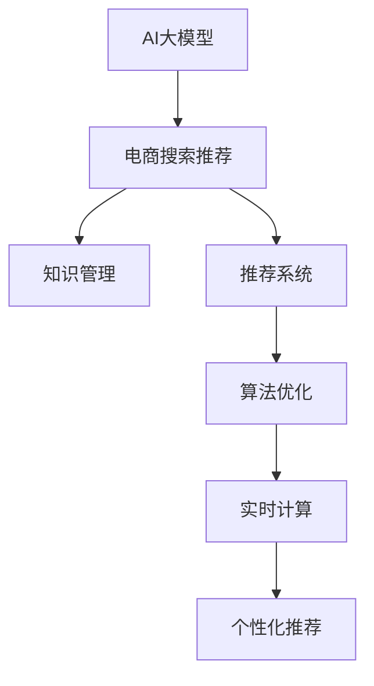

                 

# AI大模型视角下电商搜索推荐的技术创新知识管理平台

> 关键词：AI大模型, 电商搜索推荐, 技术创新, 知识管理, 推荐系统, 算法优化, 实时计算, 个性化推荐

## 1. 背景介绍

随着人工智能技术的快速发展，AI大模型在电商搜索推荐系统中扮演了越来越重要的角色。传统的电商推荐系统依赖于简单的特征工程和传统机器学习算法，难以适应海量用户数据和多样化的用户需求。而基于大模型的电商搜索推荐系统，能够通过预训练和微调的方式，利用语言模型和用户行为数据的深度结合，实现更加个性化、高效的推荐效果。

## 2. 核心概念与联系

### 2.1 核心概念概述

为更好地理解AI大模型在电商搜索推荐系统中的应用，本节将介绍几个密切相关的核心概念：

- AI大模型(AI Large Model)：以自回归(如GPT)或自编码(如BERT)模型为代表的大规模预训练语言模型。通过在大规模无标签文本语料上进行预训练，学习通用的语言表示，具备强大的语言理解和生成能力。

- 电商搜索推荐(E-commerce Search and Recommendation)：电商平台的搜索和推荐系统，通过分析用户行为数据，推荐符合用户兴趣和购买意愿的商品，提升用户购物体验。

- 知识管理(Knowledge Management)：对信息进行收集、存储、组织和共享的过程，以支持决策和协作。在推荐系统中，知识管理技术用于整合多模态数据，提升推荐效果的精准度。

- 推荐系统(Recommendation System)：通过分析用户历史行为、社交关系、商品属性等数据，预测用户可能感兴趣的物品，从而提供个性化推荐。

- 算法优化(Algorithm Optimization)：通过优化算法参数、改进模型结构等方式，提高推荐系统的性能和效率。

- 实时计算(Real-time Computation)：指在数据实时流入系统的过程中，对数据进行快速的处理和分析，以实现快速响应的推荐服务。

- 个性化推荐(Personalized Recommendation)：根据用户的历史行为、兴趣和上下文信息，推荐符合用户个性化需求的商品。

这些核心概念之间的逻辑关系可以通过以下Mermaid流程图来展示：



这个流程图展示了大模型在电商推荐系统中的应用框架：

1. 大模型通过预训练获得基础能力。
2. 电商推荐系统利用大模型的语言理解能力，处理搜索查询和用户行为数据。
3. 知识管理技术整合多模态数据，提升推荐效果。
4. 推荐系统设计算法优化策略，提高推荐效果。
5. 实时计算技术确保推荐结果能够及时更新。
6. 个性化推荐算法结合用户特征，实现精准推荐。

## 3. 核心算法原理 & 具体操作步骤
### 3.1 算法原理概述

基于AI大模型的电商搜索推荐系统，本质上是一个复杂的组合优化问题。其核心思想是：利用大模型强大的语言理解能力，处理电商搜索和用户行为数据，结合知识管理技术，整合多模态数据，最终通过推荐系统算法生成个性化推荐结果。

形式化地，假设电商搜索系统收集到用户的查询文本 $q$ 和历史行为数据 $h$，大模型通过预训练和微调获得语言表示能力，知识管理技术将多模态数据整合为语义向量 $v$，推荐系统算法设计合适的损失函数 $\mathcal{L}$，优化参数 $\theta$，使得推荐结果 $r$ 与用户兴趣 $i$ 和商品属性 $a$ 匹配：

$$
\theta^* = \mathop{\arg\min}_{\theta} \mathcal{L}(r, i, a)
$$

其中，$r$ 为推荐结果，$i$ 为用户兴趣，$a$ 为商品属性，$\theta$ 为模型参数。

通过梯度下降等优化算法，推荐系统不断更新模型参数 $\theta$，最小化损失函数 $\mathcal{L}$，使得推荐结果逼近理想的用户兴趣和商品属性匹配。

### 3.2 算法步骤详解

基于AI大模型的电商搜索推荐系统一般包括以下几个关键步骤：

**Step 1: 准备预训练模型和数据集**
- 选择合适的预训练语言模型 $M_{\theta}$ 作为初始化参数，如 BERT、GPT 等。
- 准备电商搜索和推荐相关的数据集 $D$，包括用户查询、行为记录、商品信息等。

**Step 2: 添加任务适配层**
- 根据电商推荐任务设计合适的任务适配层，包括输入特征提取和输出层。
- 输入特征提取层通常采用大模型的特征向量作为输入，包含用户查询和行为数据。
- 输出层设计合适的损失函数，如交叉熵损失、均方误差损失等。

**Step 3: 设置微调超参数**
- 选择合适的优化算法及其参数，如 AdamW、SGD 等，设置学习率、批大小、迭代轮数等。
- 设置正则化技术及强度，包括权重衰减、Dropout、Early Stopping 等。
- 确定冻结预训练参数的策略，如仅微调顶层，或全部参数都参与微调。

**Step 4: 执行梯度训练**
- 将电商搜索和推荐数据集分批次输入模型，前向传播计算损失函数。
- 反向传播计算参数梯度，根据设定的优化算法和学习率更新模型参数。
- 周期性在测试集上评估模型性能，根据性能指标决定是否触发 Early Stopping。
- 重复上述步骤直到满足预设的迭代轮数或 Early Stopping 条件。

**Step 5: 测试和部署**
- 在测试集上评估微调后模型 $M_{\hat{\theta}}$ 的性能，对比微调前后的精度提升。
- 使用微调后的模型对新商品进行推荐，集成到实际的应用系统中。
- 持续收集新的数据，定期重新微调模型，以适应数据分布的变化。

以上是基于AI大模型的电商推荐系统的一般流程。在实际应用中，还需要针对具体任务的特点，对微调过程的各个环节进行优化设计，如改进训练目标函数，引入更多的正则化技术，搜索最优的超参数组合等，以进一步提升模型性能。

### 3.3 算法优缺点

基于AI大模型的电商推荐系统具有以下优点：
1. 简单高效。只需准备少量标注数据，即可对预训练模型进行快速适配，获得较大的性能提升。
2. 通用适用。适用于各种电商推荐任务，包括商品推荐、搜索优化、个性化广告等，设计简单的任务适配层即可实现微调。
3. 参数高效。利用参数高效微调技术，在固定大部分预训练权重不变的情况下，仍可取得不错的提升。
4. 效果显著。在学术界和工业界的诸多任务上，基于微调的方法已经刷新了最先进的性能指标。

同时，该方法也存在一定的局限性：
1. 依赖标注数据。推荐系统的效果很大程度上取决于标注数据的质量和数量，获取高质量标注数据的成本较高。
2. 迁移能力有限。当目标任务与预训练数据的分布差异较大时，推荐系统的性能提升有限。
3. 负面效果传递。预训练模型的固有偏见、有害信息等，可能通过推荐系统传递到用户，造成负面影响。
4. 可解释性不足。推荐系统的决策过程通常缺乏可解释性，难以对其推理逻辑进行分析和调试。

尽管存在这些局限性，但就目前而言，基于AI大模型的推荐系统范式仍是大模型应用的最主流范式。未来相关研究的重点在于如何进一步降低推荐系统对标注数据的依赖，提高系统的少样本学习和跨领域迁移能力，同时兼顾可解释性和伦理安全性等因素。

### 3.4 算法应用领域

基于AI大模型的电商推荐系统，在电商领域已经得到了广泛的应用，覆盖了几乎所有常见任务，例如：

- 商品推荐：根据用户浏览、购买历史和搜索行为，推荐符合用户兴趣的商品。
- 搜索优化：利用自然语言处理技术，提升搜索查询的精准度和相关度。
- 个性化广告：根据用户特征和行为，推荐符合用户兴趣的广告。
- 内容生成：生成商品描述、标题等文本内容，提高电商网站的互动性和吸引力。
- 情感分析：分析用户评论和反馈，了解用户对商品和服务的满意度。
- 库存管理：通过分析用户购买行为，优化商品库存，提升销售效率。

除了上述这些经典任务外，基于AI大模型的推荐系统也被创新性地应用到更多场景中，如可控文本生成、跨平台推荐、多模态融合等，为电商技术带来了全新的突破。随着预训练模型和推荐方法的不断进步，相信电商技术将在更广阔的应用领域大放异彩。

## 4. 数学模型和公式 & 详细讲解  
### 4.1 数学模型构建

本节将使用数学语言对基于AI大模型的电商推荐过程进行更加严格的刻画。

记电商推荐系统中的预训练语言模型为 $M_{\theta}:\mathcal{X} \rightarrow \mathcal{Y}$，其中 $\mathcal{X}$ 为用户查询和行为数据，$\mathcal{Y}$ 为推荐结果，$\theta$ 为模型参数。假设推荐任务 $T$ 的训练集为 $D=\{(x_i,r_i)\}_{i=1}^N, x_i \in \mathcal{X}, r_i \in \mathcal{Y}$。

定义模型 $M_{\theta}$ 在数据样本 $(x,r)$ 上的损失函数为 $\ell(M_{\theta}(x),r)$，则在数据集 $D$ 上的经验风险为：

$$
\mathcal{L}(\theta) = \frac{1}{N} \sum_{i=1}^N \ell(M_{\theta}(x_i),r_i)
$$

其中 $\ell$ 为针对任务 $T$ 设计的损失函数，用于衡量模型预测输出与真实标签之间的差异。常见的损失函数包括交叉熵损失、均方误差损失等。

通过梯度下降等优化算法，推荐系统不断更新模型参数 $\theta$，最小化损失函数 $\mathcal{L}$，使得模型输出逼近真实标签。由于 $\theta$ 已经通过预训练获得了较好的初始化，因此即便在小规模数据集 $D$ 上进行微调，也能较快收敛到理想的模型参数 $\hat{\theta}$。

### 4.2 公式推导过程

以下我们以二分类任务为例，推导交叉熵损失函数及其梯度的计算公式。

假设模型 $M_{\theta}$ 在输入 $x$ 上的输出为 $\hat{r}=M_{\theta}(x) \in [0,1]$，表示推荐结果的预测概率。真实标签 $r \in \{0,1\}$。则二分类交叉熵损失函数定义为：

$$
\ell(M_{\theta}(x),r) = -[r\log \hat{r} + (1-r)\log (1-\hat{r})]
$$

将其代入经验风险公式，得：

$$
\mathcal{L}(\theta) = -\frac{1}{N}\sum_{i=1}^N [r_i\log M_{\theta}(x_i)+(1-r_i)\log(1-M_{\theta}(x_i))]
$$

根据链式法则，损失函数对参数 $\theta_k$ 的梯度为：

$$
\frac{\partial \mathcal{L}(\theta)}{\partial \theta_k} = -\frac{1}{N}\sum_{i=1}^N (\frac{r_i}{M_{\theta}(x_i)}-\frac{1-r_i}{1-M_{\theta}(x_i)}) \frac{\partial M_{\theta}(x_i)}{\partial \theta_k}
$$

其中 $\frac{\partial M_{\theta}(x_i)}{\partial \theta_k}$ 可进一步递归展开，利用自动微分技术完成计算。

在得到损失函数的梯度后，即可带入参数更新公式，完成模型的迭代优化。重复上述过程直至收敛，最终得到适应电商推荐任务的最优模型参数 $\theta^*$。

## 5. 项目实践：代码实例和详细解释说明
### 5.1 开发环境搭建

在进行电商推荐系统开发前，我们需要准备好开发环境。以下是使用Python进行PyTorch开发的环境配置流程：

1. 安装Anaconda：从官网下载并安装Anaconda，用于创建独立的Python环境。

2. 创建并激活虚拟环境：
```bash
conda create -n pytorch-env python=3.8 
conda activate pytorch-env
```

3. 安装PyTorch：根据CUDA版本，从官网获取对应的安装命令。例如：
```bash
conda install pytorch torchvision torchaudio cudatoolkit=11.1 -c pytorch -c conda-forge
```

4. 安装Transformers库：
```bash
pip install transformers
```

5. 安装各类工具包：
```bash
pip install numpy pandas scikit-learn matplotlib tqdm jupyter notebook ipython
```

完成上述步骤后，即可在`pytorch-env`环境中开始电商推荐系统的开发。

### 5.2 源代码详细实现

这里我们以商品推荐任务为例，给出使用Transformers库对BERT模型进行电商推荐系统微调的PyTorch代码实现。

首先，定义电商推荐系统的数据处理函数：

```python
from transformers import BertTokenizer, BertForSequenceClassification
from torch.utils.data import Dataset
import torch

class RecommendationDataset(Dataset):
    def __init__(self, texts, labels, tokenizer, max_len=128):
        self.texts = texts
        self.labels = labels
        self.tokenizer = tokenizer
        self.max_len = max_len
        
    def __len__(self):
        return len(self.texts)
    
    def __getitem__(self, item):
        text = self.texts[item]
        label = self.labels[item]
        
        encoding = self.tokenizer(text, return_tensors='pt', max_length=self.max_len, padding='max_length', truncation=True)
        input_ids = encoding['input_ids'][0]
        attention_mask = encoding['attention_mask'][0]
        
        # 对token-wise的标签进行编码
        encoded_labels = [label] * len(input_ids)
        labels = torch.tensor(encoded_labels, dtype=torch.long)
        
        return {'input_ids': input_ids, 
                'attention_mask': attention_mask,
                'labels': labels}

# 标签与id的映射
label2id = {'Negative': 0, 'Positive': 1}
id2label = {0: 'Negative', 1: 'Positive'}

# 创建dataset
tokenizer = BertTokenizer.from_pretrained('bert-base-cased')

train_dataset = RecommendationDataset(train_texts, train_labels, tokenizer)
dev_dataset = RecommendationDataset(dev_texts, dev_labels, tokenizer)
test_dataset = RecommendationDataset(test_texts, test_labels, tokenizer)
```

然后，定义模型和优化器：

```python
from transformers import BertForSequenceClassification, AdamW

model = BertForSequenceClassification.from_pretrained('bert-base-cased', num_labels=len(label2id))

optimizer = AdamW(model.parameters(), lr=2e-5)
```

接着，定义训练和评估函数：

```python
from torch.utils.data import DataLoader
from tqdm import tqdm
from sklearn.metrics import classification_report

device = torch.device('cuda') if torch.cuda.is_available() else torch.device('cpu')
model.to(device)

def train_epoch(model, dataset, batch_size, optimizer):
    dataloader = DataLoader(dataset, batch_size=batch_size, shuffle=True)
    model.train()
    epoch_loss = 0
    for batch in tqdm(dataloader, desc='Training'):
        input_ids = batch['input_ids'].to(device)
        attention_mask = batch['attention_mask'].to(device)
        labels = batch['labels'].to(device)
        model.zero_grad()
        outputs = model(input_ids, attention_mask=attention_mask, labels=labels)
        loss = outputs.loss
        epoch_loss += loss.item()
        loss.backward()
        optimizer.step()
    return epoch_loss / len(dataloader)

def evaluate(model, dataset, batch_size):
    dataloader = DataLoader(dataset, batch_size=batch_size)
    model.eval()
    preds, labels = [], []
    with torch.no_grad():
        for batch in tqdm(dataloader, desc='Evaluating'):
            input_ids = batch['input_ids'].to(device)
            attention_mask = batch['attention_mask'].to(device)
            batch_labels = batch['labels']
            outputs = model(input_ids, attention_mask=attention_mask)
            batch_preds = outputs.logits.argmax(dim=2).to('cpu').tolist()
            batch_labels = batch_labels.to('cpu').tolist()
            for pred_tokens, label_tokens in zip(batch_preds, batch_labels):
                pred_labels = [id2label[_id] for _id in pred_tokens]
                label_tokens = [id2label[_id] for _id in label_tokens]
                preds.append(pred_labels[:len(label_tokens)])
                labels.append(label_tokens)
                
    print(classification_report(labels, preds))
```

最后，启动训练流程并在测试集上评估：

```python
epochs = 5
batch_size = 16

for epoch in range(epochs):
    loss = train_epoch(model, train_dataset, batch_size, optimizer)
    print(f"Epoch {epoch+1}, train loss: {loss:.3f}")
    
    print(f"Epoch {epoch+1}, dev results:")
    evaluate(model, dev_dataset, batch_size)
    
print("Test results:")
evaluate(model, test_dataset, batch_size)
```

以上就是使用PyTorch对BERT进行商品推荐任务微调的完整代码实现。可以看到，得益于Transformers库的强大封装，我们可以用相对简洁的代码完成BERT模型的加载和微调。

### 5.3 代码解读与分析

让我们再详细解读一下关键代码的实现细节：

**RecommendationDataset类**：
- `__init__`方法：初始化文本、标签、分词器等关键组件。
- `__len__`方法：返回数据集的样本数量。
- `__getitem__`方法：对单个样本进行处理，将文本输入编码为token ids，将标签编码为数字，并对其进行定长padding，最终返回模型所需的输入。

**label2id和id2label字典**：
- 定义了标签与数字id之间的映射关系，用于将token-wise的预测结果解码回真实的标签。

**训练和评估函数**：
- 使用PyTorch的DataLoader对数据集进行批次化加载，供模型训练和推理使用。
- 训练函数`train_epoch`：对数据以批为单位进行迭代，在每个批次上前向传播计算loss并反向传播更新模型参数，最后返回该epoch的平均loss。
- 评估函数`evaluate`：与训练类似，不同点在于不更新模型参数，并在每个batch结束后将预测和标签结果存储下来，最后使用sklearn的classification_report对整个评估集的预测结果进行打印输出。

**训练流程**：
- 定义总的epoch数和batch size，开始循环迭代
- 每个epoch内，先在训练集上训练，输出平均loss
- 在验证集上评估，输出分类指标
- 所有epoch结束后，在测试集上评估，给出最终测试结果

可以看到，PyTorch配合Transformers库使得BERT微调的代码实现变得简洁高效。开发者可以将更多精力放在数据处理、模型改进等高层逻辑上，而不必过多关注底层的实现细节。

当然，工业级的系统实现还需考虑更多因素，如模型的保存和部署、超参数的自动搜索、更灵活的任务适配层等。但核心的微调范式基本与此类似。

## 6. 实际应用场景
### 6.1 智能客服系统

基于AI大模型的电商推荐系统，可以广泛应用于智能客服系统的构建。传统客服往往需要配备大量人力，高峰期响应缓慢，且一致性和专业性难以保证。而使用基于大模型的推荐系统，可以7x24小时不间断服务，快速响应客户咨询，用自然流畅的语言解答各类常见问题。

在技术实现上，可以收集企业内部的历史客服对话记录，将问题和最佳答复构建成监督数据，在此基础上对预训练推荐系统进行微调。微调后的推荐系统能够自动理解用户意图，匹配最合适的答复模板进行回复。对于客户提出的新问题，还可以接入检索系统实时搜索相关内容，动态组织生成回答。如此构建的智能客服系统，能大幅提升客户咨询体验和问题解决效率。

### 6.2 金融舆情监测

金融机构需要实时监测市场舆论动向，以便及时应对负面信息传播，规避金融风险。传统的人工监测方式成本高、效率低，难以应对网络时代海量信息爆发的挑战。基于AI大模型的推荐系统，通过分析用户对金融产品的讨论和评价，能够实时监测舆情变化，预警潜在风险。

具体而言，可以收集金融领域相关的新闻、报道、评论等文本数据，并对其进行情感标注。在此基础上对预训练推荐系统进行微调，使其能够自动识别文本情感倾向，及时发现负面舆情，避免市场恐慌。同时，通过引入金融专家的文本和图片数据，可以进一步提升推荐系统的准确性和可靠性。

### 6.3 个性化推荐系统

当前的推荐系统往往只依赖用户的历史行为数据进行物品推荐，难以深入理解用户的真实兴趣偏好。基于AI大模型的个性化推荐系统，能够更好地挖掘用户行为背后的语义信息，从而提供更精准、多样的推荐内容。

在实践中，可以收集用户浏览、点击、评论、分享等行为数据，提取和用户交互的物品标题、描述、标签等文本内容。将文本内容作为模型输入，用户的后续行为（如是否点击、购买等）作为监督信号，在此基础上微调预训练推荐系统。微调后的推荐系统能够从文本内容中准确把握用户的兴趣点。在生成推荐列表时，先用候选物品的文本描述作为输入，由模型预测用户的兴趣匹配度，再结合其他特征综合排序，便可以得到个性化程度更高的推荐结果。

### 6.4 未来应用展望

随着AI大模型和推荐方法的不断发展，基于微调范式将在更多领域得到应用，为传统行业带来变革性影响。

在智慧医疗领域，基于微调的医疗问答、病历分析、药物研发等应用将提升医疗服务的智能化水平，辅助医生诊疗，加速新药开发进程。

在智能教育领域，微调技术可应用于作业批改、学情分析、知识推荐等方面，因材施教，促进教育公平，提高教学质量。

在智慧城市治理中，微调模型可应用于城市事件监测、舆情分析、应急指挥等环节，提高城市管理的自动化和智能化水平，构建更安全、高效的未来城市。

此外，在企业生产、社会治理、文娱传媒等众多领域，基于大模型微调的人工智能应用也将不断涌现，为经济社会发展注入新的动力。相信随着技术的日益成熟，微调方法将成为人工智能落地应用的重要范式，推动人工智能技术在垂直行业的规模化落地。

## 7. 工具和资源推荐
### 7.1 学习资源推荐

为了帮助开发者系统掌握AI大模型在电商推荐系统中的应用，这里推荐一些优质的学习资源：

1. 《Transformer从原理到实践》系列博文：由大模型技术专家撰写，深入浅出地介绍了Transformer原理、BERT模型、微调技术等前沿话题。

2. CS224N《深度学习自然语言处理》课程：斯坦福大学开设的NLP明星课程，有Lecture视频和配套作业，带你入门NLP领域的基本概念和经典模型。

3. 《Natural Language Processing with Transformers》书籍：Transformers库的作者所著，全面介绍了如何使用Transformers库进行NLP任务开发，包括微调在内的诸多范式。

4. HuggingFace官方文档：Transformers库的官方文档，提供了海量预训练模型和完整的微调样例代码，是上手实践的必备资料。

5. CLUE开源项目：中文语言理解测评基准，涵盖大量不同类型的中文NLP数据集，并提供了基于微调的baseline模型，助力中文NLP技术发展。

通过对这些资源的学习实践，相信你一定能够快速掌握AI大模型在电商推荐系统中的应用，并用于解决实际的NLP问题。
###  7.2 开发工具推荐

高效的开发离不开优秀的工具支持。以下是几款用于AI大模型电商推荐系统开发的常用工具：

1. PyTorch：基于Python的开源深度学习框架，灵活动态的计算图，适合快速迭代研究。大部分预训练语言模型都有PyTorch版本的实现。

2. TensorFlow：由Google主导开发的开源深度学习框架，生产部署方便，适合大规模工程应用。同样有丰富的预训练语言模型资源。

3. Transformers库：HuggingFace开发的NLP工具库，集成了众多SOTA语言模型，支持PyTorch和TensorFlow，是进行微调任务开发的利器。

4. Weights & Biases：模型训练的实验跟踪工具，可以记录和可视化模型训练过程中的各项指标，方便对比和调优。与主流深度学习框架无缝集成。

5. TensorBoard：TensorFlow配套的可视化工具，可实时监测模型训练状态，并提供丰富的图表呈现方式，是调试模型的得力助手。

6. Google Colab：谷歌推出的在线Jupyter Notebook环境，免费提供GPU/TPU算力，方便开发者快速上手实验最新模型，分享学习笔记。

合理利用这些工具，可以显著提升AI大模型电商推荐系统的开发效率，加快创新迭代的步伐。

### 7.3 相关论文推荐

AI大模型和推荐系统的发展源于学界的持续研究。以下是几篇奠基性的相关论文，推荐阅读：

1. Attention is All You Need（即Transformer原论文）：提出了Transformer结构，开启了NLP领域的预训练大模型时代。

2. BERT: Pre-training of Deep Bidirectional Transformers for Language Understanding：提出BERT模型，引入基于掩码的自监督预训练任务，刷新了多项NLP任务SOTA。

3. Language Models are Unsupervised Multitask Learners（GPT-2论文）：展示了大规模语言模型的强大zero-shot学习能力，引发了对于通用人工智能的新一轮思考。

4. Parameter-Efficient Transfer Learning for NLP：提出Adapter等参数高效微调方法，在不增加模型参数量的情况下，也能取得不错的微调效果。

5. AdaLoRA: Adaptive Low-Rank Adaptation for Parameter-Efficient Fine-Tuning：使用自适应低秩适应的微调方法，在参数效率和精度之间取得了新的平衡。

这些论文代表了大语言模型微调技术的发展脉络。通过学习这些前沿成果，可以帮助研究者把握学科前进方向，激发更多的创新灵感。

## 8. 总结：未来发展趋势与挑战

### 8.1 总结

本文对基于AI大模型的电商推荐系统进行了全面系统的介绍。首先阐述了大模型和微调技术的研究背景和意义，明确了微调在拓展预训练模型应用、提升电商推荐性能方面的独特价值。其次，从原理到实践，详细讲解了电商推荐系统的数学原理和关键步骤，给出了电商推荐任务开发的完整代码实例。同时，本文还广泛探讨了推荐系统在智能客服、金融舆情、个性化推荐等多个电商推荐系统中的应用前景，展示了微调范式的巨大潜力。此外，本文精选了微调技术的各类学习资源，力求为读者提供全方位的技术指引。

通过本文的系统梳理，可以看到，基于AI大模型的电商推荐系统正在成为电商推荐技术的重要范式，极大地拓展了电商推荐系统的应用边界，催生了更多的落地场景。受益于大规模语料的预训练，推荐系统以更低的时间和标注成本，在小样本条件下也能取得不俗的效果，有力推动了电商技术的产业化进程。未来，伴随预训练语言模型和推荐方法的持续演进，相信电商技术将在更广阔的应用领域大放异彩。

### 8.2 未来发展趋势

展望未来，AI大模型电商推荐系统将呈现以下几个发展趋势：

1. 模型规模持续增大。随着算力成本的下降和数据规模的扩张，预训练语言模型的参数量还将持续增长。超大规模语言模型蕴含的丰富语言知识，有望支撑更加复杂多变的电商推荐任务。

2. 推荐方法日趋多样。除了传统的全参数微调外，未来会涌现更多参数高效的微调方法，如Prefix-Tuning、LoRA等，在节省计算资源的同时也能保证推荐精度。

3. 持续学习成为常态。随着数据分布的不断变化，推荐系统也需要持续学习新知识以保持性能。如何在不遗忘原有知识的同时，高效吸收新样本信息，将成为重要的研究课题。

4. 标注样本需求降低。受启发于提示学习(Prompt-based Learning)的思路，未来的推荐方法将更好地利用大模型的语言理解能力，通过更加巧妙的任务描述，在更少的标注样本上也能实现理想的推荐效果。

5. 多模态推荐崛起。当前的推荐系统往往只依赖文本数据，未来会进一步拓展到图像、视频、语音等多模态数据推荐。多模态信息的融合，将显著提升推荐系统的推荐效果和用户体验。

6. 推荐系统通用性增强。经过海量数据的预训练和多领域任务的微调，未来的推荐系统将具备更强大的跨领域迁移能力，能够适应更多样化的电商场景。

以上趋势凸显了AI大模型电商推荐系统的广阔前景。这些方向的探索发展，必将进一步提升电商推荐系统的性能和用户满意度，为电商企业带来新的业务增长点。

### 8.3 面临的挑战

尽管AI大模型电商推荐系统已经取得了瞩目成就，但在迈向更加智能化、普适化应用的过程中，它仍面临着诸多挑战：

1. 标注成本瓶颈。虽然推荐系统的效果很大程度上取决于标注数据的质量和数量，获取高质量标注数据的成本较高。如何进一步降低推荐系统对标注样本的依赖，将是一大难题。

2. 推荐效果泛化性不足。当前推荐系统面对新领域和新用户时，泛化性能往往大打折扣。如何构建具有高度泛化能力的推荐系统，是未来的一个重要研究方向。

3. 推荐系统鲁棒性不足。对于异常输入和异常行为，推荐系统容易出现波动和不稳定。如何增强系统的鲁棒性和稳定性，提高推荐的可靠性，还需要更多理论和实践的积累。

4. 用户隐私保护问题。推荐系统通常依赖用户的个人行为数据，如何保护用户隐私，避免数据泄露和滥用，将是一个重要的伦理和法律问题。

5. 推荐系统可解释性不足。推荐系统的决策过程通常缺乏可解释性，难以对其推理逻辑进行分析和调试。如何赋予推荐系统更强的可解释性，将是亟待攻克的难题。

尽管存在这些挑战，但就目前而言，基于AI大模型的推荐系统范式仍是大模型应用的最主流范式。未来相关研究的重点在于如何进一步降低推荐系统对标注数据的依赖，提高系统的少样本学习和跨领域迁移能力，同时兼顾可解释性和伦理安全性等因素。

### 8.4 未来突破

面对AI大模型电商推荐系统所面临的种种挑战，未来的研究需要在以下几个方面寻求新的突破：

1. 探索无监督和半监督推荐方法。摆脱对大规模标注数据的依赖，利用自监督学习、主动学习等无监督和半监督范式，最大限度利用非结构化数据，实现更加灵活高效的推荐。

2. 研究参数高效和计算高效的推荐范式。开发更加参数高效的推荐方法，在固定大部分预训练权重不变的情况下，只更新极少量的任务相关参数。同时优化推荐系统的计算图，减少前向传播和反向传播的资源消耗，实现更加轻量级、实时性的部署。

3. 融合因果和对比学习范式。通过引入因果推断和对比学习思想，增强推荐系统建立稳定因果关系的能力，学习更加普适、鲁棒的语言表征，从而提升推荐效果。

4. 引入更多先验知识。将符号化的先验知识，如知识图谱、逻辑规则等，与神经网络模型进行巧妙融合，引导推荐系统学习更准确、合理的推荐逻辑。同时加强不同模态数据的整合，实现视觉、语音等多模态信息与文本信息的协同建模。

5. 结合因果分析和博弈论工具。将因果分析方法引入推荐系统，识别出推荐结果的关键特征，增强推荐结果的因果性和逻辑性。借助博弈论工具刻画人机交互过程，主动探索并规避推荐系统的脆弱点，提高系统稳定性。

6. 纳入伦理道德约束。在推荐系统训练目标中引入伦理导向的评估指标，过滤和惩罚有偏见、有害的推荐结果。同时加强人工干预和审核，建立推荐行为的监管机制，确保推荐结果符合人类价值观和伦理道德。

这些研究方向的探索，必将引领AI大模型电商推荐系统迈向更高的台阶，为构建安全、可靠、可解释、可控的智能推荐系统铺平道路。面向未来，AI大模型电商推荐系统还需要与其他人工智能技术进行更深入的融合，如知识表示、因果推理、强化学习等，多路径协同发力，共同推动自然语言理解和智能交互系统的进步。只有勇于创新、敢于突破，才能不断拓展语言模型的边界，让智能技术更好地造福人类社会。

## 9. 附录：常见问题与解答

**Q1：AI大模型电商推荐系统是否适用于所有电商场景？**

A: AI大模型电商推荐系统在大多数电商场景上都能取得不错的效果，特别是对于数据量较小的任务。但对于一些特定领域的电商场景，如珠宝、奢侈品等，由于商品多样性极高，数据采集难度大，可能难以获得充分的高质量标注数据。此时需要在特定领域语料上进一步预训练，再进行微调，才能获得理想效果。此外，对于一些需要时效性、个性化很强的任务，如个性化广告、实时搜索等，微调方法也需要针对性的改进优化。

**Q2：电商推荐系统中如何降低对标注数据的依赖？**

A: 电商推荐系统中，标注数据的质量和数量对推荐效果有直接影响。为降低对标注数据的依赖，可以引入以下方法：

1. 数据增强：通过数据合成、样本扩充等方式，丰富训练集的多样性，减少过拟合风险。

2. 对抗性训练：通过引入对抗样本，提高模型对噪声和异常输入的鲁棒性，避免模型在特定输入上出现偏差。

3. 半监督学习：结合少量标注数据和大量未标注数据，利用自监督学习任务提升模型性能。

4. 无监督学习：利用无监督学习方法，如自编码器、GAN等，挖掘数据的潜在结构和规律，提升模型的泛化能力。

5. 知识融合：引入领域知识库、规则库等，通过知识图谱、逻辑推理等方式，引导模型学习更有意义的语义表示。

这些方法可以单独或结合使用，以进一步降低电商推荐系统对标注数据的依赖，提升模型的通用性和鲁棒性。

**Q3：电商推荐系统中如何增强推荐结果的鲁棒性？**

A: 电商推荐系统中的推荐结果鲁棒性不足，主要体现在以下几个方面：

1. 异常输入：对于异常输入或噪声数据，推荐系统容易出现波动和不稳定。引入对抗性训练方法，通过生成对抗样本来提升模型的鲁棒性。

2. 模型泛化：推荐系统在面对新领域和新用户时，泛化性能往往较差。通过引入多领域和多用户的数据，提升模型的泛化能力和鲁棒性。

3. 模型结构：推荐系统的模型结构对鲁棒性有直接影响。采用更加稳健的模型结构，如深度神经网络、集成学习等，可以提高模型的鲁棒性。

4. 数据分布：推荐系统的数据分布对鲁棒性有直接影响。通过数据合成、数据扩充等方法，丰富数据分布，提升模型的鲁棒性。

5. 模型更新：推荐系统需要不断更新模型参数，以适应数据分布的变化。通过定期重新微调模型，更新模型参数，可以提高模型的鲁棒性和适应性。

综上所述，电商推荐系统中增强推荐结果的鲁棒性，需要从数据、模型、算法等多个方面进行综合优化，以确保推荐结果的稳定性和可靠性。

**Q4：电商推荐系统中如何增强推荐结果的可解释性？**

A: 电商推荐系统中的推荐结果缺乏可解释性，主要体现在以下几个方面：

1. 黑盒模型：当前的推荐系统通常使用黑盒模型，难以解释推荐结果的生成逻辑。引入可解释性技术，如特征重要性分析、局部解释等，可以提升推荐结果的可解释性。

2. 透明算法：推荐系统需要设计透明的算法，使得用户可以理解模型的决策过程。通过引入透明算法，如基于规则的推荐、基于逻辑推理的推荐等，可以提升推荐结果的可解释性。

3. 用户反馈：收集用户的反馈信息，通过用户评价、满意度等指标，反馈推荐结果的合理性。通过用户反馈，不断优化推荐模型，提升推荐结果的可解释性。

4. 多模态数据：利用多模态数据，如文本、图像、音频等，提升推荐结果的可解释性。通过多模态数据的融合，可以提供更丰富的推荐信息，帮助用户理解推荐结果。

5. 知识图谱：引入知识图谱等知识库，通过知识推理等方式，提升推荐结果的可解释性。通过知识图谱的引入，可以提供更深入的推荐理由，帮助用户理解推荐结果。

综上所述，电商推荐系统中增强推荐结果的可解释性，需要从算法、数据、用户等多个方面进行综合优化，以确保推荐结果的合理性和透明性。

**Q5：电商推荐系统中如何保护用户隐私？**

A: 电商推荐系统中，保护用户隐私是至关重要的。以下是一些常用的隐私保护措施：

1. 数据匿名化：对用户数据进行匿名化处理，去除个人身份信息，保护用户隐私。

2. 差分隐私：通过加入噪声、限制查询频率等手段，保护用户隐私，避免数据泄露。

3. 联邦学习：在模型训练过程中，将数据分布式存储在不同的设备上，避免数据集中存储，保护用户隐私。

4. 数据加密：对用户数据进行加密处理，保护数据在传输和存储过程中的安全。

5. 数据访问控制：限制数据访问权限，只有经过授权的人员才能访问用户数据，保护用户隐私。

6. 用户同意：在收集用户数据前，明确告知用户数据用途和隐私保护措施，获取用户同意，保护用户隐私。

通过以上隐私保护措施，可以有效地保护用户隐私，确保用户数据的安全和隐私。

**Q6：电商推荐系统中如何提高推荐系统的可解释性？**

A: 电商推荐系统中，提高推荐系统的可解释性至关重要。以下是一些常用的方法：

1. 特征重要性分析：分析推荐模型中各个特征的重要性，帮助用户理解推荐结果的生成逻辑。

2. 局部解释：针对单个推荐结果，提供具体的解释信息，帮助用户理解推荐理由。

3. 透明算法：设计透明的推荐算法，使得用户可以理解模型的决策过程。

4. 用户反馈：收集用户的反馈信息，通过用户评价、满意度等指标，反馈推荐结果的合理性。

5. 多模态数据：利用多模态数据，如文本、图像、音频等，提升推荐结果的可解释性。通过多模态数据的融合，可以提供更丰富的推荐信息，帮助用户理解推荐结果。

6. 知识图谱：引入知识图谱等知识库，通过知识推理等方式，提升推荐结果的可解释性。通过知识图谱的引入，可以提供更深入的推荐理由，帮助用户理解推荐结果。

综上所述，电商推荐系统中提高推荐系统的可解释性，需要从算法、数据、用户等多个方面进行综合优化，以确保推荐结果的合理性和透明性。

---

作者：禅与计算机程序设计艺术 / Zen and the Art of Computer Programming

