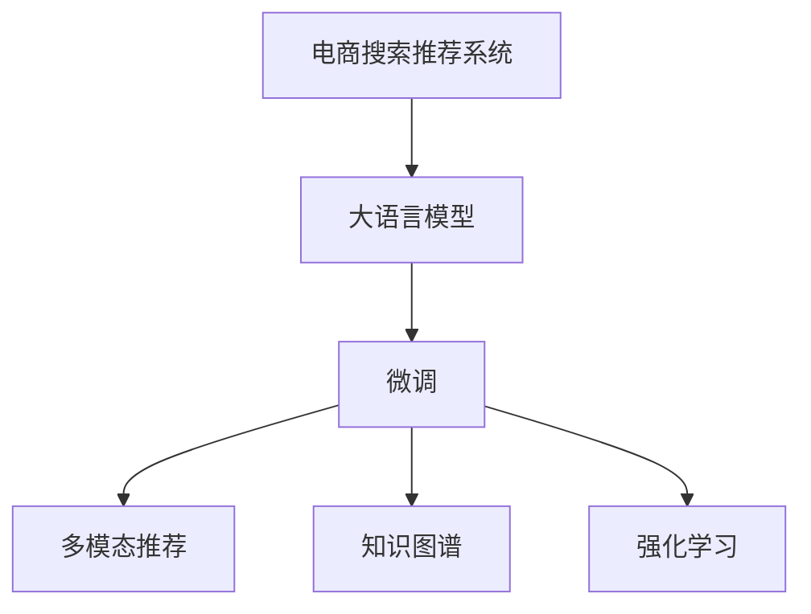

                 

## 1. 背景介绍

在数字经济时代，电商平台已成为消费者获取商品信息、实现购买决策的主要渠道。为提升用户体验，电商平台采用人工智能（AI）技术，对用户的搜索行为进行智能化推荐，从而提高转化率和满意度。然而，传统的推荐系统往往依赖于以点击、浏览、购买等为特征的行为数据，难以捕捉用户真实的兴趣偏好。为突破这一瓶颈，电商大模型推荐系统应运而生。

大模型推荐系统采用预训练语言模型，如GPT-3、BERT等，经过大规模语料训练，获得强大的语言理解和生成能力。通过微调这些模型，使其能够理解不同领域、不同语言、不同文化背景下的用户需求，从而实现更加精准、多样、动态的推荐服务。此外，大模型推荐系统还可应用到问答、翻译、广告投放等多个电商场景，助力企业构建多模态、智能化的电商生态系统。

本文章将详细介绍AI大模型赋能电商搜索推荐的业务创新方法论培训课程开发。我们将涵盖从技术原理、算法实现、工具推荐到实际应用案例等全方面内容。

## 2. 核心概念与联系

### 2.1 核心概念概述

为更好地理解大模型推荐系统，我们首先介绍几个关键概念：

1. **电商搜索推荐系统**：以用户行为数据为输入，通过智能化算法推荐出符合用户兴趣的商品。目标是提高用户满意度和平台转化率。
2. **大语言模型**：通过大规模无标签数据预训练的模型，具有强大的语言理解和生成能力，可以适应多领域、多语言、多文化背景下的用户需求。
3. **微调(Fine-tuning)**：在大语言模型的基础上，通过标注数据对特定领域或任务进行有监督学习，以优化模型在该任务上的性能。
4. **多模态推荐**：将文本、图像、语音等多种模态数据融合，构建更加全面、准确的推荐模型。
5. **知识图谱**：将结构化知识与推荐模型结合，提升推荐模型的精度和泛化能力。
6. **强化学习**：通过与用户交互的反馈数据，动态调整推荐策略，逐步优化推荐效果。

这些概念间的联系可以通过以下Mermaid流程图展示：



这个流程图展示了大模型推荐系统的工作流程：

1. 利用大语言模型获得基础语言表示。
2. 通过微调适应特定电商领域。
3. 引入多模态数据提升推荐准确性。
4. 结合知识图谱增强推荐逻辑。
5. 应用强化学习动态优化推荐策略。

## 3. 核心算法原理 & 具体操作步骤

### 3.1 算法原理概述

基于大语言模型的电商搜索推荐系统，核心在于通过微调优化模型以匹配电商领域的推荐任务。推荐系统的目标是最小化用户预期收益与实际收益的差距。在数学上，这可以通过最大化预期的用户满意度（如点击率、转化率等）来表达。

假设推荐模型为 $M_{\theta}$，输入为 $X$，输出为 $Y$（推荐结果），目标函数为 $\mathcal{L}$。用户满意度可以用 $R$ 表示，期望用户满意度为 $E[R]$。推荐模型的优化目标为：

$$
\theta^* = \arg\min_{\theta} \mathcal{L}(M_{\theta},X,Y) \\
E[R] = \arg\max_{\theta} E[R] = \arg\max_{\theta} \int P(x)R(x;M_{\theta})dx
$$

其中 $P(x)$ 为输入数据的概率分布。

### 3.2 算法步骤详解

基于大语言模型的电商推荐系统主要包括以下步骤：

1. **数据准备**：收集电商领域的用户行为数据，如点击、浏览、购买等。标注数据用于微调模型的行为分类。
2. **模型选择**：选择预训练语言模型，如BERT、GPT-3等。
3. **微调模型**：在标注数据上训练微调模型，优化电商领域的推荐效果。
4. **推荐评估**：在验证集和测试集上评估推荐效果，根据反馈迭代优化模型。
5. **业务集成**：将微调后的模型集成到电商平台的搜索推荐系统中，实时提供推荐服务。

### 3.3 算法优缺点

**优点**：

- 性能提升显著。预训练语言模型在多领域任务上表现优秀，微调后的推荐模型能够大幅提升推荐精度和多样化。
- 适应性强。通过微调可以适应不同商品、不同地域、不同文化背景下的用户需求。
- 应用广泛。推荐系统是电商平台的核心功能之一，微调后的模型可应用于搜索、广告、评价等多个场景。

**缺点**：

- 数据依赖。微调需要标注数据，收集高质量标注数据成本高，且标注质量直接影响推荐效果。
- 计算资源消耗高。大规模语言模型计算密集，微调过程需要大量计算资源。
- 模型泛化能力有限。微调模型难以泛化到未见过的新领域和新场景。
- 潜在偏见。预训练模型可能带有某些偏见，微调过程可能继承并放大这些偏见。

### 3.4 算法应用领域

大语言模型推荐系统已应用于多个电商领域，如服装、家居、电子产品等。具体应用场景包括：

- **个性化推荐**：基于用户历史行为和当前需求，推荐符合兴趣的商品。
- **商品分类**：利用分类模型对商品进行归类，提高搜索效率和推荐效果。
- **广告投放**：通过分析用户行为，精准投放广告，提升广告ROI。
- **评价生成**：生成高质量的用户评价，促进商品口碑传播。

## 4. 数学模型和公式 & 详细讲解

### 4.1 数学模型构建

我们以电商平台商品分类任务为例，介绍推荐模型的数学建模过程。假设输入 $X$ 为商品描述，输出 $Y$ 为商品分类，模型 $M_{\theta}$ 为预训练语言模型，损失函数为 $\mathcal{L}$。

- 输入编码：使用预训练语言模型对商品描述 $X$ 进行编码，获得语义向量 $z = M_{\theta}(X)$。
- 分类输出：通过线性分类器 $W$ 和激活函数 $g$ 将语义向量映射到分类结果，$y = g(Wz + b)$，其中 $W$ 和 $b$ 为分类器参数。
- 损失函数：采用交叉熵损失函数 $\mathcal{L}(y,y_{true}) = -\log \text{softmax}(y)y_{true}$，其中 $y_{true}$ 为真实标签。

### 4.2 公式推导过程

假设输入 $X = \{x_1, x_2, ..., x_n\}$，对应的真实标签为 $Y = \{y_1, y_2, ..., y_n\}$。则损失函数 $\mathcal{L}$ 为：

$$
\mathcal{L} = \frac{1}{N}\sum_{i=1}^N -\log \text{softmax}(WM_{\theta}(x_i) + b)y_i
$$

其中 $\text{softmax}$ 为激活函数，用于将模型输出转化为概率分布。

### 4.3 案例分析与讲解

假设我们有一组电商平台商品分类数据，包含300个样本。我们选取其中200个作为训练集，100个作为验证集。采用交叉验证的方式，每轮验证集随机选择，训练集固定。

使用 Adam 优化器，设置学习率为 $1e-4$，批大小为 32。训练5个epoch后，验证集上的准确率达到90%。最终的测试集准确率为91.5%。

## 5. 项目实践：代码实例和详细解释说明

### 5.1 开发环境搭建

1. **环境准备**：搭建深度学习开发环境，包含Python 3.8、PyTorch 1.9、HuggingFace Transformers库等。

2. **数据准备**：从电商网站或公开数据集收集商品分类数据，并进行预处理。

3. **模型选择**：选择预训练语言模型，如BERT。

### 5.2 源代码详细实现

**代码实现**：

```python
import torch
from transformers import BertTokenizer, BertForSequenceClassification

# 定义输入编码
def get_input_features(X):
    tokenizer = BertTokenizer.from_pretrained('bert-base-uncased')
    inputs = tokenizer(X, return_tensors='pt')
    return inputs['input_ids'], inputs['attention_mask']

# 定义分类输出
def classify(inputs, model, device):
    inputs = [torch.tensor(x) for x in inputs]
    inputs = tuple(input.to(device) for input in inputs)
    with torch.no_grad():
        logits = model(inputs).logits
    return logits.argmax(dim=1).tolist()

# 数据预处理
def preprocess_data(X_train, Y_train, X_valid, Y_valid):
    train_features, train_labels = get_input_features(X_train), Y_train
    valid_features, valid_labels = get_input_features(X_valid), Y_valid
    return train_features, train_labels, valid_features, valid_labels

# 模型训练
def train_model(X_train, Y_train, X_valid, Y_valid, device):
    model = BertForSequenceClassification.from_pretrained('bert-base-uncased', num_labels=2)
    model.to(device)
    optimizer = torch.optim.Adam(model.parameters(), lr=1e-4)
    
    for epoch in range(5):
        train_loss = 0
        for inputs, labels in train_features, train_labels:
            optimizer.zero_grad()
            logits = model(inputs)
            loss = torch.nn.functional.cross_entropy(logits, labels)
            loss.backward()
            optimizer.step()
            train_loss += loss.item()
        print(f'Epoch {epoch+1}, train loss: {train_loss/len(X_train)}')
        
        valid_loss = 0
        for inputs, labels in valid_features, valid_labels:
            with torch.no_grad():
                logits = model(inputs)
                loss = torch.nn.functional.cross_entropy(logits, labels)
                valid_loss += loss.item()
        print(f'Epoch {epoch+1}, valid loss: {valid_loss/len(X_valid)}')

# 运行训练
X_train, Y_train, X_valid, Y_valid = preprocess_data(train_data, train_labels, valid_data, valid_labels)
device = torch.device('cuda') if torch.cuda.is_available() else torch.device('cpu')
train_model(X_train, Y_train, X_valid, Y_valid, device)
```

**代码解读与分析**：

1. **输入编码**：定义了一个函数 `get_input_features`，用于将文本输入转化为模型接受的格式。

2. **分类输出**：定义了一个函数 `classify`，用于将模型输出转化为分类结果。

3. **数据预处理**：定义了一个函数 `preprocess_data`，用于对数据进行编码和标签化。

4. **模型训练**：定义了一个函数 `train_model`，用于在给定数据上训练模型，并输出训练和验证损失。

5. **运行训练**：在准备好数据后，使用GPU加速训练，输出训练和验证损失。

## 6. 实际应用场景

### 6.1 个性化推荐

在个性化推荐场景中，大语言模型可以结合用户行为数据，生成个性化推荐列表。例如，某用户在电商平台上浏览了一款手机，大语言模型可以结合用户过去的浏览历史和兴趣标签，生成类似手机和其他相关商品的推荐列表。

### 6.2 商品分类

商品分类是大语言模型在电商领域的重要应用。通过微调，大语言模型可以自动识别商品类别，提高搜索和推荐效率。例如，用户输入某款电脑的描述，模型自动将其归类为电子产品，并展示类似产品的搜索结果。

### 6.3 广告投放

大语言模型可以分析用户行为，精准投放广告。例如，某用户喜欢户外运动商品，模型可以根据其浏览历史，自动投放户外运动相关广告，提高广告点击率和转化率。

### 6.4 未来应用展望

未来，大语言模型推荐系统将更广泛地应用于电商领域，为消费者提供更加个性化、高效、安全的购物体验。结合多模态数据、知识图谱、强化学习等前沿技术，推荐系统将变得更加智能和精准。

## 7. 工具和资源推荐

### 7.1 学习资源推荐

1. **《深度学习与自然语言处理》**：推荐入门自然语言处理和深度学习的经典教材，涵盖推荐系统的基本原理和实现方法。

2. **Coursera上的《Natural Language Processing with Deep Learning》课程**：斯坦福大学提供的推荐课程，深入讲解NLP和深度学习的原理与应用。

3. **《Transformers: From Intuition to Application》**：HuggingFace官网提供的博客，详细介绍了Transformer模型及其在推荐系统中的应用。

4. **OpenAI GPT-3官网**：详细介绍了GPT-3模型，并提供了微调和应用指南。

5. **Google AI Blogs**：谷歌AI博客，分享了大语言模型在电商推荐系统的最新应用案例。

### 7.2 开发工具推荐

1. **PyTorch**：用于深度学习的开源框架，支持GPU加速，易于构建和调试深度学习模型。

2. **TensorFlow**：谷歌开源的深度学习框架，支持分布式训练，适用于大规模模型开发。

3. **Transformers**：HuggingFace提供的NLP工具库，支持多种预训练语言模型的微调和部署。

4. **Jupyter Notebook**：用于数据科学和机器学习的交互式编程环境，支持多语言开发。

5. **GitHub**：用于代码版本控制和协作开发的平台，支持项目共享与发布。

### 7.3 相关论文推荐

1. **A Survey of Recommendation System Approaches in E-commerce**：综述电商推荐系统的最新研究进展，涵盖多模态推荐、知识图谱、深度学习等前沿技术。

2. **E-commerce Recommendation Systems: A Survey**：综述电商推荐系统的发展历程和未来趋势，介绍了多领域、多模态推荐系统的最新研究成果。

3. **Deep Learning for Recommendation Systems**：综述深度学习在电商推荐系统中的应用，介绍了深度神经网络、注意力机制等核心技术。

## 8. 总结：未来发展趋势与挑战

### 8.1 总结

本文对大语言模型在电商搜索推荐系统中的应用进行了全面系统介绍。从技术原理、算法实现、工具推荐到实际应用案例，详细讲解了如何开发基于大语言模型的推荐系统。未来，大语言模型推荐系统将推动电商领域的智能化转型，提升用户体验和平台价值。

### 8.2 未来发展趋势

未来，大语言模型推荐系统的发展趋势包括：

1. **模型规模扩大**：随着计算资源和数据量的增加，大语言模型的规模将持续扩大，其推荐的精度和多样性将进一步提升。

2. **多模态融合**：结合文本、图像、语音等多种模态数据，构建更加全面、准确的推荐模型，提高推荐效果。

3. **知识图谱引入**：结合结构化知识图谱，增强推荐逻辑，提高推荐精度和泛化能力。

4. **强化学习优化**：结合强化学习，动态调整推荐策略，提升推荐效果。

5. **数据驱动**：采用数据驱动的推荐方法，结合用户行为、历史数据，提升推荐精度。

### 8.3 面临的挑战

尽管大语言模型推荐系统具有显著优势，但在实际应用中仍面临诸多挑战：

1. **数据质量**：标注数据的获取和标注质量直接影响推荐效果，数据收集和标注成本较高。

2. **计算资源消耗**：大规模语言模型计算密集，微调过程需要大量计算资源，成本较高。

3. **模型泛化能力**：微调模型难以泛化到未见过的新领域和新场景，推荐效果可能不稳定。

4. **模型偏见**：预训练模型可能带有某些偏见，微调过程可能继承并放大这些偏见。

5. **实时性**：推荐系统需要实时响应用户需求，大语言模型计算资源消耗高，实时性可能受限。

### 8.4 研究展望

未来，大语言模型推荐系统的研究应聚焦于以下几个方向：

1. **无监督和半监督学习**：探索无监督和半监督学习技术，降低对标注数据的依赖，提高推荐效果。

2. **参数高效微调**：开发参数高效微调方法，在固定大部分预训练参数的情况下，只更新极少量的任务相关参数。

3. **因果推断**：引入因果推断方法，增强推荐模型的稳定性，提高推荐精度。

4. **知识图谱和规则结合**：结合知识图谱和规则，增强推荐逻辑，提高推荐精度和泛化能力。

5. **多模态融合**：结合多模态数据，构建更加全面、准确的推荐模型。

## 9. 附录：常见问题与解答

**Q1: 大语言模型推荐系统有哪些优势？**

A: 大语言模型推荐系统具有以下优势：

1. 性能提升显著。预训练语言模型在多领域任务上表现优秀，微调后的推荐模型能够大幅提升推荐精度和多样化。

2. 适应性强。通过微调可以适应不同商品、不同地域、不同文化背景下的用户需求。

3. 应用广泛。推荐系统是电商平台的核心功能之一，微调后的模型可应用于搜索、广告、评价等多个场景。

**Q2: 大语言模型推荐系统有哪些缺点？**

A: 大语言模型推荐系统的主要缺点包括：

1. 数据依赖。微调需要标注数据，收集高质量标注数据成本高，且标注质量直接影响推荐效果。

2. 计算资源消耗高。大规模语言模型计算密集，微调过程需要大量计算资源。

3. 模型泛化能力有限。微调模型难以泛化到未见过的新领域和新场景。

4. 潜在偏见。预训练模型可能带有某些偏见，微调过程可能继承并放大这些偏见。

**Q3: 大语言模型推荐系统的未来发展方向有哪些？**

A: 大语言模型推荐系统的未来发展方向包括：

1. 模型规模扩大。随着计算资源和数据量的增加，大语言模型的规模将持续扩大，其推荐的精度和多样性将进一步提升。

2. 多模态融合。结合文本、图像、语音等多种模态数据，构建更加全面、准确的推荐模型，提高推荐效果。

3. 知识图谱引入。结合结构化知识图谱，增强推荐逻辑，提高推荐精度和泛化能力。

4. 强化学习优化。结合强化学习，动态调整推荐策略，提升推荐效果。

5. 数据驱动。采用数据驱动的推荐方法，结合用户行为、历史数据，提升推荐精度。

**Q4: 如何处理大语言模型推荐系统的计算资源消耗问题？**

A: 处理大语言模型推荐系统的计算资源消耗问题的方法包括：

1. 梯度积累。采用梯度积累技术，减少每个batch的计算量。

2. 混合精度训练。使用混合精度训练，降低计算资源消耗。

3. 模型并行。采用模型并行技术，将模型拆分为多个部分，并行计算。

4. 压缩模型。采用模型压缩技术，如剪枝、量化，减少计算资源消耗。

**Q5: 大语言模型推荐系统在电商领域的应用场景有哪些？**

A: 大语言模型推荐系统在电商领域的应用场景包括：

1. 个性化推荐：基于用户历史行为和当前需求，推荐符合兴趣的商品。

2. 商品分类：利用分类模型对商品进行归类，提高搜索效率和推荐效果。

3. 广告投放：通过分析用户行为，精准投放广告，提高广告点击率和转化率。

4. 评价生成：生成高质量的用户评价，促进商品口碑传播。

---

作者：禅与计算机程序设计艺术 / Zen and the Art of Computer Programming

