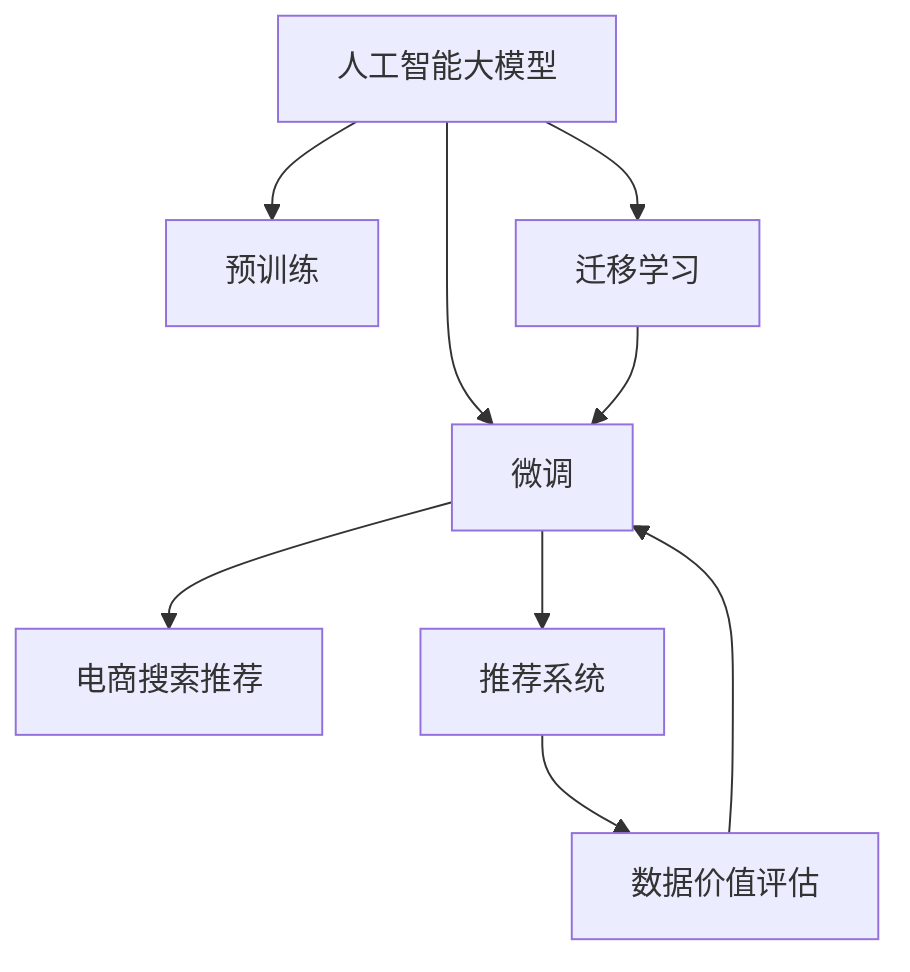

                 

# AI大模型重构电商搜索推荐的数据价值评估模型应用项目可行性分析与实践指南

## 1. 背景介绍

### 1.1 问题由来
随着电商市场的不断扩大，传统的搜索推荐系统已无法满足用户日益增长的个性化需求。传统的系统主要依赖于基于特征的统计模型，如TF-IDF、协同过滤等，这些模型虽在一定程度上解决了信息过载问题，但仍然存在诸如推荐泛化能力不足、数据冷启动问题严重等缺点。人工智能大模型，尤其是基于Transformer的大语言模型，凭借其出色的泛化能力、处理大规模无标签数据的优势，逐步成为电商搜索推荐的新范式。

### 1.2 问题核心关键点
人工智能大模型在电商搜索推荐中的应用主要体现在以下几个方面：
1. **数据理解与特征提取**：大模型能够从海量无标签文本数据中学习到丰富的特征表示，自动提取用户行为和商品属性的关联特征。
2. **推荐性能提升**：通过在大模型上进行微调，可以直接输出商品排序，无需中间步骤，大幅提升推荐效率。
3. **用户行为预测**：大模型能够预测用户的意图和偏好，实现精准的个性化推荐。
4. **数据冷启动问题**：大模型具有预训练和微调的结合，能够有效解决数据冷启动问题。

### 1.3 问题研究意义
1. **降低技术门槛**：大模型的出现使得推荐系统的构建不再依赖于高超的特征工程技巧，降低了技术门槛。
2. **提升推荐效果**：大模型基于大规模无标签数据的预训练，能够更好地捕捉用户行为模式和商品属性之间的关系，从而提高推荐效果。
3. **加速业务迭代**：大模型的微调过程可快速迭代，快速适应业务变化，加速电商推荐系统的业务迭代。
4. **拓展业务范围**：大模型不仅限于搜索推荐，还可以应用于广告投放、市场分析等领域，拓展电商业务应用范围。

## 2. 核心概念与联系

### 2.1 核心概念概述
为了更好地理解AI大模型在电商搜索推荐中的应用，我们先介绍几个核心概念：

1. **人工智能大模型**：指基于深度学习模型，如BERT、GPT、T5等，经过大规模无标签数据预训练得到的语言模型。这些模型在各种自然语言处理任务上表现出色，成为电商推荐系统的重要工具。

2. **微调(Fine-Tuning)**：指在大模型上进行微调，使其适应特定任务，如电商搜索推荐。微调过程中，只调整顶层部分参数，以避免过拟合。

3. **迁移学习(Transfer Learning)**：指将大模型在大规模无标签数据上预训练学到的知识，迁移到特定任务上进行微调。

4. **推荐系统(Recommendation System)**：指通过分析用户历史行为和商品属性，为用户推荐可能感兴趣的商品。推荐系统可采用协同过滤、基于内容的推荐、混合推荐等方法。

5. **数据价值评估**：指评估数据对模型性能提升的贡献度，通过数据价值评估，可以更高效地进行数据标注和数据采集。

### 2.2 核心概念原理和架构的 Mermaid 流程图



### 2.3 核心概念之间的联系
1. **大模型与预训练**：大模型通过在大规模无标签数据上预训练，学习到丰富的语言知识，为后续微调提供基础。
2. **微调与推荐系统**：微调后的模型可以直接应用于推荐系统，通过自然语言处理技术实现商品排序和推荐。
3. **迁移学习与数据价值评估**：迁移学习利用大模型知识提升特定任务性能，数据价值评估用于衡量数据对模型性能提升的贡献。
4. **推荐系统与电商**：推荐系统通过分析用户和商品属性，生成个性化推荐，电商业务通过推荐系统提升用户体验，增加销售额。

## 3. 核心算法原理 & 具体操作步骤

### 3.1 算法原理概述

大模型在电商搜索推荐中的应用，主要基于以下算法原理：

1. **自监督预训练**：在大规模无标签文本数据上进行预训练，学习到语言的基本规律和知识表示。
2. **微调**：在电商搜索推荐任务上，微调大模型，使其能够理解电商语境下的用户行为和商品属性。
3. **迁移学习**：将大模型在大规模无标签数据上学到的知识，迁移到特定电商场景中进行微调，提升推荐效果。
4. **数据价值评估**：通过量化数据对模型性能提升的贡献度，指导数据标注和数据采集策略。

### 3.2 算法步骤详解

**Step 1: 数据准备**
- 收集电商网站上的历史交易数据、用户行为数据、商品属性数据等，进行清洗和处理。
- 将数据划分为训练集、验证集和测试集。

**Step 2: 数据预处理**
- 对用户行为和商品属性数据进行向量化处理，提取特征。
- 使用大模型进行预训练，得到初步特征表示。

**Step 3: 大模型微调**
- 在电商搜索推荐任务上，微调大模型，调整其顶层部分参数。
- 使用电商相关数据进行训练，更新模型权重。

**Step 4: 模型评估**
- 在验证集上评估微调后的模型性能，如点击率、转化率等指标。
- 调整超参数和微调策略，直至达到最优性能。

**Step 5: 部署上线**
- 将微调后的模型部署到电商搜索推荐系统中，实时生成个性化推荐。
- 监控推荐效果和系统性能，根据反馈持续优化模型。

### 3.3 算法优缺点

AI大模型在电商搜索推荐中的应用具有以下优点：
1. **泛化能力**：大模型能够从大规模无标签数据中学习到通用的语言知识，适用于多种电商场景。
2. **高效性**：微调过程可以很快完成，无需复杂的特征工程，提高推荐效率。
3. **精准度**：大模型能够理解电商语境，提供更加精准的推荐。

同时，也存在一些缺点：
1. **数据依赖**：大模型的性能高度依赖于电商数据的质量和量，数据标注成本高。
2. **鲁棒性不足**：大模型容易受到电商数据分布变化的影响，泛化能力可能受到影响。
3. **可解释性差**：大模型的决策过程难以解释，难以进行用户行为分析。
4. **计算资源要求高**：大模型参数量大，计算和存储需求高。

### 3.4 算法应用领域

AI大模型在电商搜索推荐中的应用领域广泛，具体如下：

1. **商品推荐**：利用大模型预测用户可能感兴趣的商品，提高用户体验。
2. **广告推荐**：根据用户行为和商品属性，生成个性化广告，提高点击率和转化率。
3. **用户行为分析**：分析用户行为数据，提升用户画像的准确度，增强推荐效果。
4. **内容生成**：生成电商商品描述、促销文案等，提升内容质量和用户体验。

## 4. 数学模型和公式 & 详细讲解 & 举例说明

### 4.1 数学模型构建

我们以电商搜索推荐为例，构建基于大模型的推荐模型。假设大模型为 $M_{\theta}$，其中 $\theta$ 为大模型参数。电商搜索推荐任务为二分类任务，即判断用户是否对商品感兴趣。

目标函数为：
$$
\min_{\theta} \frac{1}{N} \sum_{i=1}^N \ell(y_i, M_{\theta}(x_i))
$$
其中 $x_i$ 为电商数据，$y_i$ 为标签（0或1），$\ell$ 为损失函数，如交叉熵损失函数。

### 4.2 公式推导过程

假设模型 $M_{\theta}$ 在输入 $x_i$ 上的输出为 $\hat{y}=M_{\theta}(x_i)$，则二分类交叉熵损失函数为：
$$
\ell(y_i, M_{\theta}(x_i)) = -y_i \log \hat{y} + (1-y_i) \log (1-\hat{y})
$$

在电商数据集 $D$ 上的经验风险为：
$$
\mathcal{L}(\theta) = \frac{1}{N} \sum_{i=1}^N \ell(y_i, M_{\theta}(x_i))
$$

在微调过程中，使用梯度下降算法更新模型参数：
$$
\theta \leftarrow \theta - \eta \nabla_{\theta} \mathcal{L}(\theta)
$$
其中 $\eta$ 为学习率，$\nabla_{\theta} \mathcal{L}(\theta)$ 为损失函数对参数的梯度。

### 4.3 案例分析与讲解

假设电商推荐系统数据集 $D=\{(x_i,y_i)\}_{i=1}^N$，其中 $x_i$ 为电商数据，$y_i$ 为标签。目标是对电商推荐模型 $M_{\theta}$ 进行微调。

1. **数据预处理**：将电商数据 $x_i$ 进行向量化处理，得到特征向量 $X_i \in \mathbb{R}^d$。
2. **大模型预训练**：使用大模型 $M_{\theta}$ 在大规模无标签数据上预训练，学习到电商相关知识表示。
3. **微调过程**：在电商数据集上，对 $M_{\theta}$ 进行微调，更新模型参数，得到微调后的模型 $M_{\hat{\theta}}$。
4. **模型评估**：在验证集上评估 $M_{\hat{\theta}}$ 的性能，如点击率、转化率等指标。
5. **上线部署**：将 $M_{\hat{\theta}}$ 部署到推荐系统中，实时生成个性化推荐。

## 5. 项目实践：代码实例和详细解释说明

### 5.1 开发环境搭建

**Step 1: 安装 Python 环境**
- 安装 Anaconda 或 Miniconda，创建虚拟环境。
- 安装必要的 Python 包，如 PyTorch、transformers、TensorFlow 等。

**Step 2: 准备数据集**
- 收集电商数据集，并进行清洗和预处理。
- 使用 PANDAS 进行数据加载和处理。

### 5.2 源代码详细实现

```python
import torch
import torch.nn as nn
import transformers
from torch.utils.data import DataLoader, Dataset

class ECommerceDataset(Dataset):
    def __init__(self, data, tokenizer):
        self.data = data
        self.tokenizer = tokenizer

    def __len__(self):
        return len(self.data)

    def __getitem__(self, idx):
        x, y = self.data[idx]
        inputs = self.tokenizer(x, padding='max_length', truncation=True, return_tensors='pt')
        return {'input_ids': inputs['input_ids'].flatten(), 'attention_mask': inputs['attention_mask'].flatten(), 'labels': torch.tensor(y, dtype=torch.long)}

# 定义模型
class ECommerceModel(nn.Module):
    def __init__(self, num_labels, embed_dim=768):
        super(ECommerceModel, self).__init__()
        self.tokenizer = transformers.BertTokenizer.from_pretrained('bert-base-cased')
        self.model = transformers.TFBertForSequenceClassification.from_pretrained('bert-base-cased', num_labels=num_labels)
        self.linear = nn.Linear(embed_dim, num_labels)

    def forward(self, input_ids, attention_mask, labels=None):
        outputs = self.model(input_ids, attention_mask=attention_mask)
        logits = self.linear(outputs.logits)
        loss = nn.CrossEntropyLoss()(logits.view(-1, logits.size(-1)), labels.view(-1))
        return outputs, loss

# 加载数据集
tokenizer = transformers.BertTokenizer.from_pretrained('bert-base-cased')
train_data = ECommerceDataset(train_data, tokenizer)
test_data = ECommerceDataset(test_data, tokenizer)

# 定义模型
model = ECommerceModel(num_labels=num_labels, embed_dim=768)

# 训练模型
device = 'cuda' if torch.cuda.is_available() else 'cpu'
model.to(device)
optimizer = torch.optim.Adam(model.parameters(), lr=2e-5)
loss_fn = nn.CrossEntropyLoss()

for epoch in range(num_epochs):
    model.train()
    for batch in DataLoader(train_data, batch_size=batch_size):
        input_ids = batch['input_ids'].to(device)
        attention_mask = batch['attention_mask'].to(device)
        labels = batch['labels'].to(device)
        outputs, loss = model(input_ids, attention_mask, labels)
        loss.backward()
        optimizer.step()
        optimizer.zero_grad()

    model.eval()
    with torch.no_grad():
        correct = 0
        total = 0
        for batch in DataLoader(test_data, batch_size=batch_size):
            input_ids = batch['input_ids'].to(device)
            attention_mask = batch['attention_mask'].to(device)
            labels = batch['labels'].to(device)
            outputs, _ = model(input_ids, attention_mask, labels)
            _, predicted = torch.max(outputs, 1)
            total += labels.size(0)
            correct += (predicted == labels).sum().item()
        print('Accuracy: {}%'.format(100 * correct / total))

# 部署模型
model.eval()
with torch.no_grad():
    for batch in DataLoader(test_data, batch_size=batch_size):
        input_ids = batch['input_ids'].to(device)
        attention_mask = batch['attention_mask'].to(device)
        labels = batch['labels'].to(device)
        outputs, _ = model(input_ids, attention_mask, labels)
        _, predicted = torch.max(outputs, 1)
```

### 5.3 代码解读与分析

1. **数据集准备**：定义 `ECommerceDataset` 类，将电商数据集进行向量化处理，并使用 `tokenizer` 进行分词和编码。
2. **模型定义**：使用 `transformers` 库中的 `BertTokenizer` 和 `TFBertForSequenceClassification` 定义电商推荐模型。
3. **模型训练**：使用 PyTorch 进行模型训练，通过 `DataLoader` 对数据进行批次化处理，并使用 Adam 优化器更新模型参数。
4. **模型评估**：在测试集上评估模型性能，计算准确率。
5. **模型部署**：将模型部署到电商推荐系统中，实时生成个性化推荐。

## 6. 实际应用场景

### 6.1 智能客服系统

智能客服系统可以通过AI大模型进行微调，提升客服的智能化水平。在智能客服系统中，大模型可以根据用户提出的问题，自动匹配答案，生成推荐回复。通过微调，大模型能够更好地理解用户意图，提供更加精准的回复。

### 6.2 个性化推荐系统

个性化推荐系统是电商推荐系统的典型应用。通过AI大模型的微调，可以实现更加精准的用户行为预测，生成个性化推荐。大模型可以通过电商语境下的用户行为和商品属性数据，预测用户可能感兴趣的商品，提升推荐效果。

### 6.3 广告推荐系统

广告推荐系统可以通过AI大模型进行微调，提升广告的投放效果。在广告推荐系统中，大模型可以根据用户行为和商品属性，生成个性化广告，提高广告的点击率和转化率。

## 7. 工具和资源推荐

### 7.1 学习资源推荐

1. **《Transformers: From原理到实践》**：该书详细介绍了大模型的原理和应用，是学习大模型微调的重要资料。
2. **CS224N《深度学习自然语言处理》课程**：斯坦福大学开设的NLP课程，涵盖了NLP领域的基本概念和经典模型。
3. **《Natural Language Processing with Transformers》书籍**：该书介绍了如何使用Transformer库进行NLP任务开发，包括微调在内的诸多范式。
4. **HuggingFace官方文档**：提供了丰富的预训练模型和微调样例代码，是上手实践的必备资料。
5. **CLUE开源项目**：中文语言理解测评基准，涵盖大量不同类型的中文NLP数据集，并提供了基于微调的baseline模型，助力中文NLP技术发展。

### 7.2 开发工具推荐

1. **PyTorch**：基于Python的开源深度学习框架，灵活动态的计算图，适合快速迭代研究。
2. **TensorFlow**：由Google主导开发的开源深度学习框架，生产部署方便，适合大规模工程应用。
3. **Weights & Biases**：模型训练的实验跟踪工具，可以记录和可视化模型训练过程中的各项指标，方便对比和调优。
4. **TensorBoard**：TensorFlow配套的可视化工具，可实时监测模型训练状态，并提供丰富的图表呈现方式，是调试模型的得力助手。
5. **Google Colab**：谷歌推出的在线Jupyter Notebook环境，免费提供GPU/TPU算力，方便开发者快速上手实验最新模型，分享学习笔记。

### 7.3 相关论文推荐

1. **Attention is All You Need**：提出Transformer结构，开启了NLP领域的预训练大模型时代。
2. **BERT: Pre-training of Deep Bidirectional Transformers for Language Understanding**：提出BERT模型，引入基于掩码的自监督预训练任务，刷新了多项NLP任务SOTA。
3. **Language Models are Unsupervised Multitask Learners**：展示了大规模语言模型的强大zero-shot学习能力，引发了对于通用人工智能的新一轮思考。
4. **Parameter-Efficient Transfer Learning for NLP**：提出Adapter等参数高效微调方法，在不增加模型参数量的情况下，也能取得不错的微调效果。
5. **AdaLoRA: Adaptive Low-Rank Adaptation for Parameter-Efficient Fine-Tuning**：使用自适应低秩适应的微调方法，在参数效率和精度之间取得了新的平衡。
6. **Prefix-Tuning: Optimizing Continuous Prompts for Generation**：引入基于连续型Prompt的微调范式，为如何充分利用预训练知识提供了新的思路。

## 8. 总结：未来发展趋势与挑战

### 8.1 研究成果总结

1. **大模型在电商推荐中的应用**：通过AI大模型进行电商推荐，实现了精准推荐，提升了用户体验和电商业务效果。
2. **数据价值评估模型的应用**：通过量化数据对模型性能提升的贡献度，指导数据标注和数据采集策略，提高了数据利用效率。
3. **微调技术的应用**：微调技术在大模型中的应用，实现了高效、精准的电商推荐，提高了推荐系统的可扩展性和可维护性。

### 8.2 未来发展趋势

1. **模型规模持续增大**：随着算力成本的下降和数据规模的扩张，预训练语言模型的参数量还将持续增长，超大规模语言模型有望进一步提升推荐效果。
2. **微调方法日趋多样**：未来将涌现更多参数高效的微调方法，如Prefix-Tuning、LoRA等，在节省计算资源的同时保证微调精度。
3. **持续学习成为常态**：微调模型需要持续学习新知识以保持性能，避免过时。
4. **少样本学习**：利用大模型的语言理解能力，通过更少的标注样本实现精准推荐。
5. **多模态微调**：融合视觉、语音等多模态数据，提升推荐系统的泛化能力和用户体验。

### 8.3 面临的挑战

1. **标注成本瓶颈**：大模型微调依赖高质量标注数据，标注成本高。
2. **鲁棒性不足**：大模型容易受到电商数据分布变化的影响，泛化能力可能受到影响。
3. **可解释性差**：大模型的决策过程难以解释，难以进行用户行为分析。
4. **计算资源要求高**：大模型参数量大，计算和存储需求高。

### 8.4 研究展望

1. **探索无监督和半监督微调方法**：摆脱对大规模标注数据的依赖，利用自监督学习、主动学习等无监督和半监督范式。
2. **研究参数高效和计算高效的微调范式**：开发更加参数高效的微调方法，优化微调模型的计算图，实现轻量级部署。
3. **融合因果和对比学习范式**：增强微调模型建立稳定因果关系的能力，学习更加普适、鲁棒的语言表征。
4. **引入更多先验知识**：将符号化的先验知识与神经网络模型进行融合，增强模型的知识整合能力。
5. **结合因果分析和博弈论工具**：增强微调模型的稳定性和鲁棒性。
6. **纳入伦理道德约束**：在模型训练目标中引入伦理导向的评估指标，避免模型偏见和有害输出。

## 9. 附录：常见问题与解答

**Q1: 电商推荐系统如何利用AI大模型进行微调？**

A: 电商推荐系统可以通过以下步骤利用AI大模型进行微调：
1. 收集电商网站上的历史交易数据、用户行为数据、商品属性数据等，进行清洗和处理。
2. 使用大模型进行预训练，学习到电商相关知识表示。
3. 在电商数据集上，对大模型进行微调，调整其顶层部分参数。
4. 在验证集上评估微调后的模型性能，如点击率、转化率等指标。
5. 将微调后的模型部署到电商推荐系统中，实时生成个性化推荐。

**Q2: 大模型在电商推荐中面临哪些挑战？**

A: 大模型在电商推荐中面临以下挑战：
1. 数据依赖：大模型的性能高度依赖于电商数据的质量和量，数据标注成本高。
2. 鲁棒性不足：大模型容易受到电商数据分布变化的影响，泛化能力可能受到影响。
3. 可解释性差：大模型的决策过程难以解释，难以进行用户行为分析。
4. 计算资源要求高：大模型参数量大，计算和存储需求高。

**Q3: 如何缓解电商推荐系统中的过拟合问题？**

A: 电商推荐系统中的过拟合问题可以通过以下方法缓解：
1. 数据增强：通过回译、近义替换等方式扩充训练集。
2. 正则化：使用L2正则、Dropout、Early Stopping等避免过拟合。
3. 对抗训练：引入对抗样本，提高模型鲁棒性。
4. 参数高效微调：只调整少量参数，减小过拟合风险。

**Q4: 电商推荐系统如何进行数据价值评估？**

A: 电商推荐系统可以通过以下方法进行数据价值评估：
1. 数据标注：对电商数据进行标注，计算标注成本和数据质量。
2. 模型评估：在验证集上评估模型性能，计算数据对模型性能提升的贡献度。
3. 数据采集：根据数据价值评估结果，调整数据采集策略，提高数据利用效率。

**Q5: 电商推荐系统如何优化用户行为预测？**

A: 电商推荐系统可以通过以下方法优化用户行为预测：
1. 数据预处理：对电商数据进行向量化处理，提取特征。
2. 大模型预训练：使用大模型在大规模无标签数据上预训练，学习到电商相关知识表示。
3. 微调过程：在电商数据集上，对大模型进行微调，调整其顶层部分参数。
4. 模型评估：在验证集上评估微调后的模型性能，如点击率、转化率等指标。
5. 模型部署：将微调后的模型部署到电商推荐系统中，实时生成个性化推荐。

