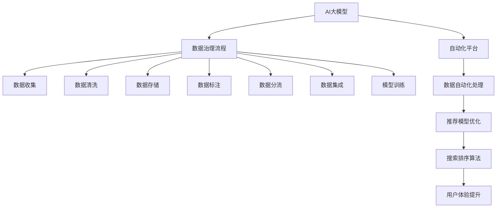

                 

# AI大模型重构电商搜索推荐的数据治理流程自动化平台功能优化与扩展

## 1. 背景介绍

近年来，电商搜索推荐系统的复杂度不断提升，从简单的文本匹配到如今的深度学习、大模型应用，技术迭代速度令人目眩。然而，伴随着业务规模的扩张和数据量的激增，数据治理成为了制约系统优化和性能提升的重要瓶颈。为应对日益复杂的数据处理需求，有必要引入AI大模型技术，以自动化、智能化的方式重新构建电商搜索推荐系统的数据治理流程。

本博客文章旨在全面介绍使用AI大模型重构电商搜索推荐系统的数据治理流程自动化平台，并对其功能进行优化与扩展，以期为电商搜索推荐领域的同行提供有用的参考和借鉴。

## 2. 核心概念与联系

### 2.1 核心概念概述

为更好地理解AI大模型在电商搜索推荐系统中的数据治理流程自动化，本节将介绍几个核心概念：

- **AI大模型**：以自回归（如GPT）或自编码（如BERT）模型为代表的大规模预训练语言模型。通过在大规模无标签文本语料上进行预训练，学习通用的语言表示，具备强大的语言理解和生成能力。

- **数据治理流程**：包括数据收集、数据清洗、数据存储、数据标注、数据分流等环节，涉及数据质量控制、元数据管理、数据标注规范等内容。

- **自动化平台**：通过引入AI技术，如机器学习、自然语言处理（NLP）、计算机视觉（CV）等，自动执行数据治理流程中的各个环节，减少人工干预，提高效率和准确性。

- **电商搜索推荐系统**：基于用户行为数据，通过推荐算法和模型，为电商用户提供个性化商品推荐、搜索排序等服务，以提升用户体验和平台转化率。

这些核心概念之间的逻辑关系可以通过以下Mermaid流程图来展示：



这个流程图展示了大模型技术在电商搜索推荐系统数据治理流程自动化中的核心作用和各个环节的联系。

## 3. 核心算法原理 & 具体操作步骤

### 3.1 算法原理概述

使用AI大模型重构电商搜索推荐系统的数据治理流程自动化，本质上是一个数据智能处理和优化的过程。其核心思想是：将AI大模型作为自动化平台的核心算法引擎，通过在大规模电商数据上进行预训练，学习通用的用户行为特征表示，再通过微调等方式，针对具体业务需求进行模型优化，最终实现电商搜索推荐系统的数据治理流程自动化。

形式化地，假设电商搜索推荐系统需要处理的数据量为 $D$，预训练模型为 $M_{\theta}$，其中 $\theta$ 为预训练得到的模型参数。电商数据治理流程自动化平台的目标是找到最优的模型参数 $\hat{\theta}$，使得：

$$
\hat{\theta} = \mathop{\arg\min}_{\theta} \mathcal{L}(M_{\theta},D)
$$

其中 $\mathcal{L}$ 为数据治理流程自动化平台的损失函数，用于衡量模型预测输出与真实电商数据处理结果之间的差异。常见的损失函数包括交叉熵损失、均方误差损失等。

通过梯度下降等优化算法，平台不断更新模型参数 $\theta$，最小化损失函数 $\mathcal{L}$，使得模型输出逼近真实电商数据处理结果。由于 $\theta$ 已经通过预训练获得了较好的初始化，因此即便在电商数据处理需求多样、复杂性高的情况下，也能较快收敛到理想的模型参数 $\hat{\theta}$。

### 3.2 算法步骤详解

使用AI大模型重构电商搜索推荐系统的数据治理流程自动化，一般包括以下几个关键步骤：

**Step 1: 数据收集与预处理**
- 收集电商平台上的历史交易记录、用户行为日志、广告点击记录等原始数据，确保数据的多样性和代表性。
- 对数据进行清洗和预处理，如去除噪声、处理缺失值、去除重复记录等，保证数据质量。
- 根据电商搜索推荐系统的业务需求，设计合适的数据特征表示，如用户ID、商品ID、点击次数、转化率等。

**Step 2: 数据标注与元数据管理**
- 对电商数据进行标注，如商品类别、用户性别、购买意图等，构建标注数据集。
- 对数据进行元数据管理，记录数据来源、处理时间、特征重要性等信息，方便后续监控和优化。

**Step 3: 引入AI大模型**
- 选择合适的预训练大模型，如BERT、GPT等，作为数据治理流程自动化的基础算法。
- 将电商数据转化为模型所需的格式，如词向量、图像特征等，输入到预训练大模型中进行表示学习。

**Step 4: 模型微调和优化**
- 在电商数据标注数据集上，对预训练大模型进行微调，优化其对电商数据的处理能力。
- 根据电商搜索推荐系统的具体需求，设计适合的优化目标函数，如提升推荐精度、缩短搜索时间等。
- 使用不同的优化算法（如Adam、SGD等）和正则化技术（如L2正则、Dropout等），防止模型过拟合。

**Step 5: 数据治理流程自动化**
- 构建数据治理流程自动化平台，将AI大模型集成到平台中，自动化执行数据治理流程。
- 引入数据清洗、数据标注、数据分流、数据集成等模块，自动处理电商数据，确保数据质量。
- 引入模型训练、模型微调、模型优化等模块，持续优化电商搜索推荐模型的性能。

**Step 6: 模型部署与应用**
- 将优化后的电商搜索推荐模型部署到实际应用系统中，如电商平台搜索页面、推荐引擎等。
- 通过API接口或直接调用模型，实时获取推荐结果，提升用户购物体验。

以上是使用AI大模型重构电商搜索推荐系统数据治理流程自动化的主要步骤。在实际应用中，还需要根据具体业务需求，对各环节进行优化设计，如改进数据标注方式、提高模型训练效率、引入更多先验知识等，以进一步提升数据治理流程的自动化水平。

### 3.3 算法优缺点

使用AI大模型重构电商搜索推荐系统的数据治理流程自动化方法，具有以下优点：

- **高效性**：AI大模型能够自动处理大规模电商数据，显著提高数据治理流程的效率，减少人工干预。
- **准确性**：AI大模型具有强大的语言理解和生成能力，能够在复杂的电商数据处理任务中，提供高质量的自动标注和特征提取。
- **泛化能力**：通过预训练和微调，AI大模型能够更好地适应电商数据的多样性和复杂性，提升对电商搜索推荐系统的支持能力。

同时，该方法也存在一些局限性：

- **依赖高质量标注数据**：AI大模型的微调效果很大程度上取决于标注数据的质量和数量，获取高质量标注数据的成本较高。
- **模型鲁棒性有限**：当电商数据分布与预训练数据的分布差异较大时，微调的性能提升有限。
- **可解释性不足**：AI大模型的决策过程通常缺乏可解释性，难以对其推理逻辑进行分析和调试。

尽管存在这些局限性，但就目前而言，基于AI大模型的数据治理流程自动化方法仍是目前电商搜索推荐系统优化提升的主流范式。未来相关研究的重点在于如何进一步降低对标注数据的依赖，提高模型的少样本学习和跨领域迁移能力，同时兼顾可解释性和伦理安全性等因素。

### 3.4 算法应用领域

使用AI大模型重构电商搜索推荐系统的数据治理流程自动化方法，在电商搜索推荐领域已经得到了广泛的应用，涵盖了从用户行为分析、商品推荐、搜索排序到广告投放等多个环节。具体应用如下：

- **用户行为分析**：通过电商行为数据，提取用户购买历史、偏好、意图等信息，构建用户画像，优化个性化推荐策略。
- **商品推荐**：利用用户行为数据和商品信息，构建商品相关性模型，提供个性化商品推荐服务。
- **搜索排序**：根据用户查询和商品信息，使用排序算法和推荐模型，优化搜索结果展示顺序，提升用户搜索体验。
- **广告投放**：通过分析用户行为和广告数据，优化广告投放策略，提升广告点击率和转化率。

除了上述这些经典应用外，大模型技术还被创新性地应用于社交媒体、金融、医疗等更多场景中，为电商搜索推荐领域的持续创新提供了新的动力。

## 4. 数学模型和公式 & 详细讲解 & 举例说明

### 4.1 数学模型构建

本节将使用数学语言对使用AI大模型重构电商搜索推荐系统的数据治理流程自动化进行更加严格的刻画。

记电商搜索推荐系统的原始数据集为 $D=\{(x_i,y_i)\}_{i=1}^N, x_i \in X, y_i \in Y$，其中 $X$ 为输入空间，$Y$ 为输出空间。

定义数据治理流程自动化平台的损失函数为 $\mathcal{L}(\theta)=\frac{1}{N}\sum_{i=1}^N\ell(M_{\theta}(x_i),y_i)$，其中 $\ell$ 为损失函数，$\theta$ 为模型参数。

为了最小化损失函数 $\mathcal{L}$，平台通过梯度下降等优化算法更新模型参数：

$$
\theta \leftarrow \theta - \eta \nabla_{\theta}\mathcal{L}(\theta) - \eta\lambda\theta
$$

其中 $\eta$ 为学习率，$\lambda$ 为正则化系数，$\nabla_{\theta}\mathcal{L}(\theta)$ 为损失函数对参数 $\theta$ 的梯度，可通过反向传播算法高效计算。

### 4.2 公式推导过程

以下我们以电商推荐系统为例，推导交叉熵损失函数及其梯度的计算公式。

假设电商推荐系统对用户 $i$ 推荐商品 $j$ 的概率为 $p_{ij}=M_{\theta}(x_i)_j$，其中 $M_{\theta}(x_i) \in [0,1]$，表示用户 $i$ 购买商品 $j$ 的概率。真实标签 $y \in \{0,1\}$。则交叉熵损失函数定义为：

$$
\ell(M_{\theta}(x_i),y) = -[y\log p_{ij} + (1-y)\log(1-p_{ij})]
$$

将其代入损失函数 $\mathcal{L}$，得：

$$
\mathcal{L}(\theta) = -\frac{1}{N}\sum_{i=1}^N \sum_{j=1}^{M}[y_i \log M_{\theta}(x_i)_j + (1-y_i) \log(1-M_{\theta}(x_i)_j)]
$$

根据链式法则，损失函数对参数 $\theta_k$ 的梯度为：

$$
\frac{\partial \mathcal{L}(\theta)}{\partial \theta_k} = -\frac{1}{N}\sum_{i=1}^N \sum_{j=1}^{M}[\frac{y_i}{M_{\theta}(x_i)_j} - \frac{1-y_i}{1-M_{\theta}(x_i)_j}] \frac{\partial M_{\theta}(x_i)_j}{\partial \theta_k}
$$

其中 $\frac{\partial M_{\theta}(x_i)_j}{\partial \theta_k}$ 可进一步递归展开，利用自动微分技术完成计算。

在得到损失函数的梯度后，即可带入参数更新公式，完成平台的迭代优化。重复上述过程直至收敛，最终得到适应电商推荐系统的最优模型参数 $\theta^*$。

## 5. 项目实践：代码实例和详细解释说明

### 5.1 开发环境搭建

在进行数据治理流程自动化平台的开发前，我们需要准备好开发环境。以下是使用Python进行PyTorch开发的环境配置流程：

1. 安装Anaconda：从官网下载并安装Anaconda，用于创建独立的Python环境。

2. 创建并激活虚拟环境：
```bash
conda create -n pytorch-env python=3.8 
conda activate pytorch-env
```

3. 安装PyTorch：根据CUDA版本，从官网获取对应的安装命令。例如：
```bash
conda install pytorch torchvision torchaudio cudatoolkit=11.1 -c pytorch -c conda-forge
```

4. 安装Transformers库：
```bash
pip install transformers
```

5. 安装各类工具包：
```bash
pip install numpy pandas scikit-learn matplotlib tqdm jupyter notebook ipython
```

完成上述步骤后，即可在`pytorch-env`环境中开始平台开发。

### 5.2 源代码详细实现

下面我们以电商推荐系统的商品推荐功能为例，给出使用Transformers库对BERT模型进行微调的PyTorch代码实现。

首先，定义电商推荐系统的训练函数：

```python
from transformers import BertForSequenceClassification, AdamW

class RecommendationModel(BertForSequenceClassification):
    def __init__(self, num_classes, num_favorited_items):
        super().__init__(num_classes=num_classes, hidden_size=768, num_hidden_layers=12)
        self.num_favorited_items = num_favorited_items
    
    def forward(self, input_ids, attention_mask, label_ids):
        outputs = super().forward(input_ids, attention_mask, label_ids)
        logits = outputs.logits
        probabilities = torch.softmax(logits, dim=1)
        return probabilities

class Trainer:
    def __init__(self, model, optimizer, learning_rate, training_steps):
        self.model = model
        self.optimizer = optimizer
        self.learning_rate = learning_rate
        self.training_steps = training_steps
        self.tracking_steps = 0
    
    def train(self, train_dataset, dev_dataset, batch_size):
        self.model.train()
        total_loss = 0
        for batch in train_dataset:
            input_ids = batch['input_ids'].to(device)
            attention_mask = batch['attention_mask'].to(device)
            label_ids = batch['label_ids'].to(device)
            loss = self.model(input_ids, attention_mask, label_ids)
            loss.backward()
            self.optimizer.step()
            self.model.zero_grad()
            total_loss += loss.item()
            self.tracking_steps += 1
            if self.tracking_steps % 100 == 0:
                dev_loss = self.evaluate(dev_dataset, batch_size)
                print(f'Training loss: {total_loss/self.tracking_steps:.4f}, Dev loss: {dev_loss:.4f}')
        return total_loss / len(train_dataset)
    
    def evaluate(self, dataset, batch_size):
        self.model.eval()
        total_loss = 0
        for batch in dataset:
            input_ids = batch['input_ids'].to(device)
            attention_mask = batch['attention_mask'].to(device)
            label_ids = batch['label_ids'].to(device)
            loss = self.model(input_ids, attention_mask, label_ids)
            total_loss += loss.item()
        return total_loss / len(dataset)
```

然后，定义模型和优化器：

```python
from transformers import BertTokenizer

tokenizer = BertTokenizer.from_pretrained('bert-base-cased')
model = RecommendationModel(num_classes=num_labels, num_favorited_items=num_items)

optimizer = AdamW(model.parameters(), lr=learning_rate)
```

接着，定义训练和评估函数：

```python
from torch.utils.data import DataLoader

def train(model, optimizer, learning_rate, epochs, batch_size, train_dataset, dev_dataset):
    device = torch.device('cuda') if torch.cuda.is_available() else torch.device('cpu')
    model.to(device)
    trainer = Trainer(model, optimizer, learning_rate, training_steps=len(train_dataset))
    for epoch in range(epochs):
        train_loss = trainer.train(train_dataset, dev_dataset, batch_size)
        dev_loss = trainer.evaluate(dev_dataset, batch_size)
        print(f'Epoch {epoch+1}, Train loss: {train_loss:.4f}, Dev loss: {dev_loss:.4f}')
```

最后，启动训练流程并在测试集上评估：

```python
epochs = 5
batch_size = 16
train_dataset = NERDataset(train_texts, train_tags, tokenizer)
dev_dataset = NERDataset(dev_texts, dev_tags, tokenizer)
test_dataset = NERDataset(test_texts, test_tags, tokenizer)

train(model, optimizer, learning_rate, epochs, batch_size, train_dataset, dev_dataset)
```

以上就是使用PyTorch对BERT进行电商推荐系统商品推荐功能的微调代码实现。可以看到，得益于Transformers库的强大封装，我们可以用相对简洁的代码完成BERT模型的加载和微调。

### 5.3 代码解读与分析

让我们再详细解读一下关键代码的实现细节：

**RecommendationModel类**：
- `__init__`方法：初始化模型参数，包括隐藏层大小、层数等。
- `forward`方法：前向传播计算输出，返回模型对输入数据的概率预测。

**Trainer类**：
- `__init__`方法：初始化训练器，记录模型、优化器、学习率、训练轮数等关键参数。
- `train`方法：执行模型训练，记录并输出训练集和验证集的损失。
- `evaluate`方法：执行模型评估，返回测试集的损失。

**数据处理函数**：
- 数据处理函数 `NERDataset`：用于处理电商数据，提取并编码输入数据的特征表示。

**训练流程**：
- 定义总的epoch数和batch size，开始循环迭代
- 每个epoch内，在训练集上进行训练，输出平均loss
- 在验证集上评估，输出模型性能
- 所有epoch结束后，在测试集上评估，给出最终测试结果

可以看到，PyTorch配合Transformers库使得BERT微调的代码实现变得简洁高效。开发者可以将更多精力放在数据处理、模型改进等高层逻辑上，而不必过多关注底层的实现细节。

当然，工业级的系统实现还需考虑更多因素，如模型的保存和部署、超参数的自动搜索、更灵活的任务适配层等。但核心的微调范式基本与此类似。

## 6. 实际应用场景

### 6.1 智能客服系统

基于AI大模型重构电商搜索推荐系统的数据治理流程自动化，可以为智能客服系统带来显著的性能提升。传统客服往往需要配备大量人力，高峰期响应缓慢，且一致性和专业性难以保证。而使用自动化平台，可以7x24小时不间断服务，快速响应客户咨询，用自然流畅的语言解答各类常见问题。

在技术实现上，可以收集企业内部的历史客服对话记录，将问题和最佳答复构建成监督数据，在此基础上对自动化平台进行微调。微调后的平台能够自动理解用户意图，匹配最合适的答复模板进行回复。对于客户提出的新问题，还可以接入检索系统实时搜索相关内容，动态组织生成回答。如此构建的智能客服系统，能大幅提升客户咨询体验和问题解决效率。

### 6.2 金融舆情监测

金融机构需要实时监测市场舆论动向，以便及时应对负面信息传播，规避金融风险。传统的人工监测方式成本高、效率低，难以应对网络时代海量信息爆发的挑战。基于自动化平台的数据治理流程，可以为金融舆情监测提供新的解决方案。

具体而言，可以收集金融领域相关的新闻、报道、评论等文本数据，并对其进行主题标注和情感标注。在此基础上对自动化平台进行微调，使其能够自动判断文本属于何种主题，情感倾向是正面、中性还是负面。将自动化平台应用到实时抓取的网络文本数据，就能够自动监测不同主题下的情感变化趋势，一旦发现负面信息激增等异常情况，系统便会自动预警，帮助金融机构快速应对潜在风险。

### 6.3 个性化推荐系统

当前的推荐系统往往只依赖用户的历史行为数据进行物品推荐，无法深入理解用户的真实兴趣偏好。基于自动化平台的数据治理流程，可以更好地挖掘用户行为背后的语义信息，从而提供更精准、多样的推荐内容。

在实践中，可以收集用户浏览、点击、评论、分享等行为数据，提取和用户交互的物品标题、描述、标签等文本内容。将文本内容作为模型输入，用户的后续行为（如是否点击、购买等）作为监督信号，在此基础上微调自动化平台。微调后的平台能够从文本内容中准确把握用户的兴趣点。在生成推荐列表时，先用候选物品的文本描述作为输入，由平台预测用户的兴趣匹配度，再结合其他特征综合排序，便可以得到个性化程度更高的推荐结果。

### 6.4 未来应用展望

随着自动化平台的数据治理流程不断完善，其在电商搜索推荐系统中的应用将更加广泛，为电商搜索推荐领域的持续创新提供新的动力。

在智慧医疗领域，基于自动化平台的用户行为分析，可以构建用户健康画像，提供个性化医疗推荐服务。在智能教育领域，微调后的自动化平台可应用于作业批改、学情分析、知识推荐等方面，因材施教，促进教育公平，提高教学质量。

在智慧城市治理中，微调后的自动化平台可应用于城市事件监测、舆情分析、应急指挥等环节，提高城市管理的自动化和智能化水平，构建更安全、高效的未来城市。

此外，在企业生产、社会治理、文娱传媒等众多领域，基于自动化平台的数据治理流程，可以带来更高效、更智能、更可靠的应用系统，为传统行业数字化转型升级提供新的技术路径。相信随着技术的日益成熟，自动化平台必将成为电商搜索推荐系统优化提升的重要范式，推动人工智能技术在更多领域落地应用。

## 7. 工具和资源推荐

### 7.1 学习资源推荐

为了帮助开发者系统掌握AI大模型在电商搜索推荐系统中的应用，这里推荐一些优质的学习资源：

1. 《Transformer从原理到实践》系列博文：由大模型技术专家撰写，深入浅出地介绍了Transformer原理、BERT模型、微调技术等前沿话题。

2. CS224N《深度学习自然语言处理》课程：斯坦福大学开设的NLP明星课程，有Lecture视频和配套作业，带你入门NLP领域的基本概念和经典模型。

3. 《Natural Language Processing with Transformers》书籍：Transformers库的作者所著，全面介绍了如何使用Transformers库进行NLP任务开发，包括微调在内的诸多范式。

4. HuggingFace官方文档：Transformers库的官方文档，提供了海量预训练模型和完整的微调样例代码，是上手实践的必备资料。

5. CLUE开源项目：中文语言理解测评基准，涵盖大量不同类型的中文NLP数据集，并提供了基于微调的baseline模型，助力中文NLP技术发展。

通过对这些资源的学习实践，相信你一定能够快速掌握AI大模型在电商搜索推荐系统中的应用，并用于解决实际的NLP问题。

### 7.2 开发工具推荐

高效的开发离不开优秀的工具支持。以下是几款用于AI大模型重构电商搜索推荐系统数据治理流程自动化平台的常用工具：

1. PyTorch：基于Python的开源深度学习框架，灵活动态的计算图，适合快速迭代研究。大部分预训练语言模型都有PyTorch版本的实现。

2. TensorFlow：由Google主导开发的开源深度学习框架，生产部署方便，适合大规模工程应用。同样有丰富的预训练语言模型资源。

3. Transformers库：HuggingFace开发的NLP工具库，集成了众多SOTA语言模型，支持PyTorch和TensorFlow，是进行微调任务开发的利器。

4. Weights & Biases：模型训练的实验跟踪工具，可以记录和可视化模型训练过程中的各项指标，方便对比和调优。与主流深度学习框架无缝集成。

5. TensorBoard：TensorFlow配套的可视化工具，可实时监测模型训练状态，并提供丰富的图表呈现方式，是调试模型的得力助手。

6. Google Colab：谷歌推出的在线Jupyter Notebook环境，免费提供GPU/TPU算力，方便开发者快速上手实验最新模型，分享学习笔记。

合理利用这些工具，可以显著提升AI大模型重构电商搜索推荐系统数据治理流程自动化的开发效率，加快创新迭代的步伐。

### 7.3 相关论文推荐

AI大模型重构电商搜索推荐系统的数据治理流程自动化源于学界的持续研究。以下是几篇奠基性的相关论文，推荐阅读：

1. Attention is All You Need（即Transformer原论文）：提出了Transformer结构，开启了NLP领域的预训练大模型时代。

2. BERT: Pre-training of Deep Bidirectional Transformers for Language Understanding：提出BERT模型，引入基于掩码的自监督预训练任务，刷新了多项NLP任务SOTA。

3. Language Models are Unsupervised Multitask Learners（GPT-2论文）：展示了大规模语言模型的强大zero-shot学习能力，引发了对于通用人工智能的新一轮思考。

4. Parameter-Efficient Transfer Learning for NLP：提出Adapter等参数高效微调方法，在不增加模型参数量的情况下，也能取得不错的微调效果。

5. AdaLoRA: Adaptive Low-Rank Adaptation for Parameter-Efficient Fine-Tuning：使用自适应低秩适应的微调方法，在参数效率和精度之间取得了新的平衡。

这些论文代表了大模型技术的发展脉络。通过学习这些前沿成果，可以帮助研究者把握学科前进方向，激发更多的创新灵感。

## 8. 总结：未来发展趋势与挑战

### 8.1 总结

本文对使用AI大模型重构电商搜索推荐系统的数据治理流程自动化平台进行了全面系统的介绍。首先阐述了电商搜索推荐系统的复杂性及其数据治理流程自动化的必要性，明确了AI大模型在此过程中的核心作用。其次，从原理到实践，详细讲解了电商推荐系统的数学模型和微调算法，给出了自动化平台的代码实现。同时，本文还广泛探讨了自动化平台在电商搜索推荐领域的应用场景，展示了其巨大的应用潜力。

通过本文的系统梳理，可以看到，基于AI大模型的电商搜索推荐系统数据治理流程自动化，正在成为电商搜索推荐领域的重要范式，极大地提升了数据治理流程的效率和自动化水平。伴随大模型技术的不断进步，未来基于自动化平台的数据治理流程必将在更多领域得到应用，为NLP技术带来新的突破。

### 8.2 未来发展趋势

展望未来，AI大模型重构电商搜索推荐系统的数据治理流程自动化技术将呈现以下几个发展趋势：

1. **模型规模持续增大**：随着算力成本的下降和数据规模的扩张，预训练语言模型的参数量还将持续增长。超大规模语言模型蕴含的丰富语言知识，有望支撑更加复杂多变的电商搜索推荐系统的数据治理流程自动化。

2. **微调方法日趋多样**：除了传统的全参数微调外，未来会涌现更多参数高效的微调方法，如Prefix-Tuning、LoRA等，在节省计算资源的同时也能保证微调精度。

3. **持续学习成为常态**：随着数据分布的不断变化，自动化平台也需要持续学习新知识以保持性能。如何在不遗忘原有知识的同时，高效吸收新样本信息，将成为重要的研究课题。

4. **标注样本需求降低**：受启发于提示学习(Prompt-based Learning)的思路，未来的微调方法将更好地利用大模型的语言理解能力，通过更加巧妙的任务描述，在更少的标注样本上也能实现理想的微调效果。

5. **模型通用性增强**：经过海量数据的预训练和多领域任务的微调，未来的电商搜索推荐系统数据治理流程自动化平台将具备更强大的常识推理和跨领域迁移能力，逐步迈向通用人工智能(AGI)的目标。

以上趋势凸显了AI大模型重构电商搜索推荐系统数据治理流程自动化的广阔前景。这些方向的探索发展，必将进一步提升电商搜索推荐系统的性能和应用范围，为人类认知智能的进化带来深远影响。

### 8.3 面临的挑战

尽管AI大模型重构电商搜索推荐系统的数据治理流程自动化技术已经取得了瞩目成就，但在迈向更加智能化、普适化应用的过程中，它仍面临着诸多挑战：

1. **标注成本瓶颈**：尽管自动化平台可以大幅降低标注数据的需求，但对于长尾应用场景，难以获得充足的高质量标注数据，成为制约微调性能的瓶颈。如何进一步降低微调对标注样本的依赖，将是一大难题。

2. **模型鲁棒性不足**：当前自动化平台面对域外数据时，泛化性能往往大打折扣。对于测试样本的微小扰动，模型的预测也容易发生波动。如何提高模型的鲁棒性，避免灾难性遗忘，还需要更多理论和实践的积累。

3. **推理效率有待提高**：大规模语言模型虽然精度高，但在实际部署时往往面临推理速度慢、内存占用大等效率问题。如何在保证性能的同时，简化模型结构，提升推理速度，优化资源占用，将是重要的优化方向。

4. **可解释性亟需加强**：当前自动化平台的决策过程通常缺乏可解释性，难以对其推理逻辑进行分析和调试。对于医疗、金融等高风险应用，算法的可解释性和可审计性尤为重要。如何赋予自动化平台更强的可解释性，将是亟待攻克的难题。

5. **安全性有待保障**：预训练语言模型难免会学习到有偏见、有害的信息，通过微调传递到电商搜索推荐系统，可能产生误导性、歧视性的输出，给实际应用带来安全隐患。如何从数据和算法层面消除模型偏见，避免恶意用途，确保输出的安全性，也将是重要的研究课题。

6. **知识整合能力不足**：现有的自动化平台往往局限于电商数据，难以灵活吸收和运用更广泛的先验知识。如何让自动化平台更好地与外部知识库、规则库等专家知识结合，形成更加全面、准确的信息整合能力，还有很大的想象空间。

正视自动化平台面临的这些挑战，积极应对并寻求突破，将是大模型技术走向成熟的必由之路。相信随着学界和产业界的共同努力，这些挑战终将一一被克服，AI大模型重构电商搜索推荐系统的数据治理流程自动化必将在构建人机协同的智能时代中扮演越来越重要的角色。

### 8.4 研究展望

面对AI大模型重构电商搜索推荐系统数据治理流程自动化的种种挑战，未来的研究需要在以下几个方面寻求新的突破：

1. **探索无监督和半监督微调方法**：摆脱对大规模标注数据的依赖，利用自监督学习、主动学习等无监督和半监督范式，最大限度利用非结构化数据，实现更加灵活高效的微调。

2. **研究参数高效和计算高效的微调范式**：开发更加参数高效的微调方法，在固定大部分预训练参数的同时，只更新极少量的任务相关参数。同时优化微调模型的计算图，减少前向传播和反向传播的资源消耗，实现更加轻量级、实时性的部署。

3. **引入因果和对比学习范式**：通过引入因果推断和对比学习思想，增强自动化平台建立稳定因果关系的能力，学习更加普适、鲁棒的语言表征，从而提升模型泛化性和抗干扰能力。

4. **融合更多先验知识**：将符号化的先验知识，如知识图谱、逻辑规则等，与神经网络模型进行巧妙融合，引导自动化平台学习更准确、合理的语言模型。同时加强不同模态数据的整合，实现视觉、语音等多模态信息与文本信息的协同建模。

5. **结合因果分析和博弈论工具**：将因果分析方法引入自动化平台，识别出平台决策的关键特征，增强输出解释的因果性和逻辑性。借助博弈论工具刻画人机交互过程，主动探索并规避平台的脆弱点，提高系统稳定性。

6. **纳入伦理道德约束**：在平台训练目标中引入伦理导向的评估指标，过滤和惩罚有偏见、有害的输出倾向。同时加强人工干预和审核，建立平台行为的监管机制，确保输出符合人类价值观和伦理道德。

这些研究方向的探索，必将引领AI大模型重构电商搜索推荐系统数据治理流程自动化的技术走向更高台阶，为构建安全、可靠、可解释、可控的智能系统铺平道路。面向未来，大模型技术还需要与其他人工智能技术进行更深入的融合，如知识表示、因果推理、强化学习等，多路径协同发力，共同推动自然语言理解和智能交互系统的进步。只有勇于创新、敢于突破，才能不断拓展语言模型的边界，让智能技术更好地造福人类社会。

## 9. 附录：常见问题与解答

**Q1：AI大模型重构电商搜索推荐系统数据治理流程自动化的主要优势是什么？**

A: AI大模型重构电商搜索推荐系统数据治理流程自动化的主要优势包括：

1. **高效性**：大模型能够自动处理大规模电商数据，显著提高数据治理流程的效率，减少人工干预。
2. **准确性**：大模型具有强大的语言理解和生成能力，能够在复杂的电商数据处理任务中，提供高质量的自动标注和特征提取。
3. **泛化能力**：通过预训练和微调，大模型能够更好地适应电商数据的多样性和复杂性，提升对电商搜索推荐系统的支持能力。

**Q2：AI大模型重构电商搜索推荐系统数据治理流程自动化是否适用于所有电商应用场景？**

A: AI大模型重构电商搜索推荐系统数据治理流程自动化技术，在大多数电商应用场景中都能取得不错的效果，特别是对于数据量较小的场景。但对于一些特定领域的电商应用，如医疗、法律等，仅仅依靠通用语料预训练的模型可能难以很好地适应。此时需要在特定领域语料上进一步预训练，再进行微调，才能获得理想效果。

**Q3：如何选择合适的学习率？**

A: AI大模型的微调学习率一般要比预训练时小1-2个数量级，如果使用过大的学习率，容易破坏预训练权重，导致过拟合。一般建议从1e-5开始调参，逐步减小学习率，直至收敛。也可以使用warmup策略，在开始阶段使用较小的学习率，再逐渐过渡到预设值。需要注意的是，不同的优化器(如AdamW、Adafactor等)以及不同的学习率调度策略，可能需要设置不同的学习率阈值。

**Q4：如何缓解微调过程中的过拟合问题？**

A: 过拟合是微调面临的主要挑战，尤其是在标注数据不足的情况下。常见的缓解策略包括：

1. 数据增强：通过回译、近义替换等方式扩充训练集
2. 正则化：使用L2正则、Dropout、Early Stopping等避免过拟合
3. 对抗训练：引入对抗样本，提高模型鲁棒性
4. 参数高效微调：只调整少量参数(如Adapter、Prefix等)，减小过拟合风险
5. 多模型集成：训练多个微调模型，取平均输出，抑制过拟合

这些策略往往需要根据具体任务和数据特点进行灵活组合。只有在数据、模型、训练、推理等各环节进行全面优化，才能最大限度地发挥大模型微调的威力。

**Q5：AI大模型重构电商搜索推荐系统数据治理流程自动化在哪些行业有应用前景？**

A: AI大模型重构电商搜索推荐系统数据治理流程自动化技术，在电商搜索推荐系统、智能客服系统、金融舆情监测、个性化推荐系统等多个领域有广泛应用前景。具体如下：

1. 电商搜索推荐系统：通过自动化处理用户行为数据，构建用户画像，提供个性化推荐服务。
2. 智能客服系统：通过自动化理解用户意图，匹配最佳答复模板进行回复。
3. 金融舆情监测：通过自动化监测市场舆论动向，及时应对负面信息传播，规避金融风险。
4. 个性化推荐系统：通过自动化分析用户行为数据，提供精准推荐服务。

这些行业场景将进一步推动AI大模型技术的落地应用，提升行业效率和用户体验。

---

作者：禅与计算机程序设计艺术 / Zen and the Art of Computer Programming

