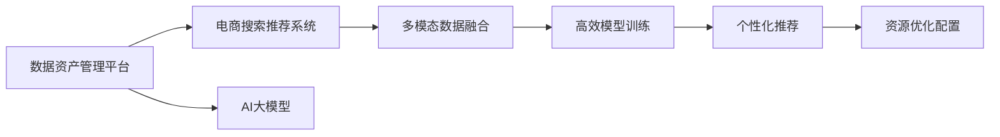

                 

# AI大模型重构电商搜索推荐的数据资产管理平台功能优化方案

## 1. 背景介绍

### 1.1 问题由来

在当前电商市场中，搜索推荐系统作为提升用户体验和提高商品转化率的关键环节，其性能的优劣直接关系到企业的竞争力和市场份额。然而，现有系统普遍存在以下痛点：

- **数据管理困难**：电商数据量大且复杂，数据质量管理困难，导致模型训练效果不佳。
- **算法模型单一**：单一的深度学习模型难以应对电商搜索推荐的多样性和复杂性。
- **用户体验反馈缺失**：缺乏对用户点击和购买行为的深入分析，难以优化推荐效果。
- **资源配置不均**：不同用户和商品的个性化需求难以精准匹配，资源分配不均衡。

为了解决这些问题，本文提出了一种基于AI大模型重构的数据资产管理平台方案，通过整合电商搜索推荐系统，利用大模型的强大能力，优化搜索推荐流程，提升用户体验和推荐效果。

### 1.2 问题核心关键点

本文聚焦于如何利用大模型优化电商搜索推荐系统的数据管理，实现以下几点核心目标：

1. **数据资产统一管理**：构建统一的数据管理系统，实现数据的规范化和标准化，提高数据质量。
2. **多模态数据融合**：整合用户行为数据、商品信息数据和用户反馈数据，形成综合推荐数据集。
3. **高效模型训练**：采用高效模型训练方法，提升模型在电商搜索推荐任务上的性能。
4. **个性化推荐优化**：利用大模型的预训练能力，优化个性化推荐算法，提高用户满意度。
5. **资源优化配置**：通过智能资源分配算法，实现搜索推荐资源的合理配置。

## 2. 核心概念与联系

### 2.1 核心概念概述

为了更好地理解本文提出的优化方案，本节将介绍几个关键概念及其相互关系：

- **数据资产管理平台**：指的是利用数据管理和分析技术，对电商企业的数据进行集中管理，提供数据访问、数据清洗、数据可视化等功能的系统。
- **AI大模型**：指使用大规模数据进行预训练的语言模型，如GPT、BERT等，具备强大的自然语言处理和推理能力。
- **电商搜索推荐系统**：基于用户历史行为数据，实时推荐相关商品的系统，旨在提升用户体验和销售转化率。
- **多模态数据融合**：将不同类型的数据（如文本、图像、行为数据等）融合到一起，形成综合数据集，用于更全面的分析和推荐。
- **高效模型训练**：指通过优化算法、分布式计算等手段，提高模型训练的效率和精度。
- **个性化推荐**：根据用户的历史行为和偏好，动态调整推荐策略，实现精准推荐。
- **资源优化配置**：通过智能算法，合理分配计算资源，提升系统的响应速度和稳定性。

这些概念之间的逻辑关系可以通过以下Mermaid流程图来展示：



这个流程图展示了大模型重构数据资产管理平台的框架，其中：

1. 数据资产管理平台收集和整理电商数据，作为AI大模型的预训练数据。
2. AI大模型通过预训练和微调，形成推荐模型。
3. 多模态数据融合技术，整合用户行为数据和商品信息数据，形成综合推荐数据集。
4. 高效模型训练方法，提高推荐模型在电商搜索推荐任务上的性能。
5. 个性化推荐算法，利用大模型实现精准推荐。
6. 资源优化配置算法，合理分配计算资源，提升系统性能。

## 3. 核心算法原理 & 具体操作步骤

### 3.1 算法原理概述

本文提出的优化方案，主要利用AI大模型对电商搜索推荐系统的数据管理进行重构，实现以下几个核心算法原理：

1. **统一数据管理**：通过构建数据资产管理平台，实现数据的集中存储和统一管理。
2. **多模态数据融合**：整合用户行为数据、商品信息数据和用户反馈数据，形成综合推荐数据集。
3. **高效模型训练**：采用分布式深度学习框架，实现高效模型训练。
4. **个性化推荐优化**：利用大模型的预训练能力，优化个性化推荐算法。
5. **资源优化配置**：通过智能资源分配算法，合理配置计算资源。

### 3.2 算法步骤详解

本节将详细介绍上述核心算法步骤的具体实现过程：

#### 3.2.1 统一数据管理

1. **数据收集**：从电商平台收集用户行为数据、商品信息数据和用户反馈数据，包括浏览记录、购买记录、评价记录等。
2. **数据清洗**：去除重复数据、缺失数据和异常数据，确保数据质量。
3. **数据标准化**：对数据进行格式和单位的标准化，统一表示形式。
4. **数据存储**：将清洗和标准化的数据存储在数据仓库中，供后续分析和模型训练使用。

#### 3.2.2 多模态数据融合

1. **用户行为数据处理**：将用户的历史浏览记录、购买记录和评价记录转化为向量表示，用于计算用户兴趣。
2. **商品信息数据处理**：将商品的描述、标签和价格等信息转化为向量表示，用于计算商品相关性。
3. **数据融合**：将用户行为数据和商品信息数据融合到一起，形成综合推荐数据集。

#### 3.2.3 高效模型训练

1. **分布式训练**：采用分布式深度学习框架，如TensorFlow、PyTorch等，实现高效模型训练。
2. **混合精度训练**：使用混合精度训练技术，加速模型收敛速度，同时保证计算精度。
3. **模型压缩**：通过剪枝、量化等技术，压缩模型大小，提高推理速度。

#### 3.2.4 个性化推荐优化

1. **预训练模型加载**：从预训练数据中加载大模型，如BERT、GPT等，作为推荐模型的初始化权重。
2. **任务适配**：根据电商搜索推荐任务的特点，设计任务适配层，如分类层、回归层等。
3. **微调模型**：在电商推荐数据集上进行有监督微调，优化模型性能。
4. **推荐优化**：利用优化算法，如Adam、SGD等，调整模型参数，提高推荐效果。

#### 3.2.5 资源优化配置

1. **负载均衡**：通过负载均衡算法，合理分配计算资源，避免单节点压力过大。
2. **智能调度**：根据系统负载和请求量，动态调整资源分配策略，实现资源最优利用。
3. **缓存机制**：利用缓存机制，减少重复计算，提高系统响应速度。

### 3.3 算法优缺点

本节将详细分析上述核心算法步骤的优缺点：

#### 3.3.1 统一数据管理的优缺点

**优点**：
1. **数据集中管理**：统一数据管理平台可以集中存储和管理电商数据，方便后续分析和模型训练。
2. **数据质量提升**：通过数据清洗和标准化，提高数据质量，减少噪音。

**缺点**：
1. **数据收集成本高**：数据收集和清洗需要投入大量人力物力，成本较高。
2. **数据隐私问题**：电商数据包含大量敏感信息，隐私保护需额外考虑。

#### 3.3.2 多模态数据融合的优缺点

**优点**：
1. **综合数据集形成**：多模态数据融合将多种类型的数据整合在一起，形成综合数据集，提供更全面的推荐依据。
2. **推荐效果提升**：多模态数据融合能更全面地理解用户需求和商品特征，提升推荐效果。

**缺点**：
1. **数据融合复杂**：不同类型的数据需要不同的处理方法，数据融合过程复杂。
2. **数据兼容性问题**：不同类型的数据可能存在兼容性问题，需要额外的处理。

#### 3.3.3 高效模型训练的优缺点

**优点**：
1. **训练效率提升**：采用分布式训练和混合精度训练，加速模型训练速度，缩短模型开发周期。
2. **计算精度保证**：通过剪枝和量化等技术，保证计算精度，避免精度损失。

**缺点**：
1. **硬件要求高**：高效模型训练需要高性能计算资源，硬件要求较高。
2. **资源消耗大**：高效模型训练需要大量计算资源，资源消耗较大。

#### 3.3.4 个性化推荐优化的优缺点

**优点**：
1. **推荐效果优化**：利用大模型的预训练能力，优化个性化推荐算法，提高推荐效果。
2. **模型灵活性高**：大模型具备强大的语言处理和推理能力，推荐算法更灵活，适应性强。

**缺点**：
1. **模型参数量大**：大模型参数量巨大，训练和推理资源消耗较大。
2. **微调复杂度高**：微调过程复杂，需要调整的参数较多，调试难度较大。

#### 3.3.5 资源优化配置的优缺点

**优点**：
1. **系统响应提升**：通过负载均衡和智能调度，提升系统响应速度，减少用户等待时间。
2. **资源利用率高**：智能资源分配算法能合理分配计算资源，提高资源利用率。

**缺点**：
1. **算法实现复杂**：资源优化配置算法实现复杂，需要考虑多种因素。
2. **实时性要求高**：资源优化配置算法需要实时调整，对系统实时性要求较高。

### 3.4 算法应用领域

本节将详细介绍上述核心算法步骤在不同应用领域中的应用：

#### 3.4.1 电商搜索推荐

电商搜索推荐是AI大模型重构数据资产管理平台的主要应用领域，通过多模态数据融合和高效模型训练，实现个性化推荐，提升用户体验和转化率。

#### 3.4.2 智能客服系统

智能客服系统利用大模型进行语义理解和问题回答，通过统一数据管理和资源优化配置，提高客服系统的响应速度和用户体验。

#### 3.4.3 智慧医疗

智慧医疗领域通过AI大模型进行疾病预测和诊断，通过数据管理和多模态数据融合，提升医疗服务质量和效率。

#### 3.4.4 智能金融

智能金融利用大模型进行风险评估和投资策略优化，通过数据管理和个性化推荐，提升金融服务的智能化水平。

#### 3.4.5 智能制造

智能制造利用大模型进行生产计划和质量控制，通过数据管理和资源优化配置，提升制造效率和产品质量。

## 4. 数学模型和公式 & 详细讲解 & 举例说明

### 4.1 数学模型构建

本节将详细构建一个简单的数学模型，用于解释本文提出的优化方案。

假设电商搜索推荐系统有一个用户集合 $U$ 和商品集合 $V$，每个用户 $u \in U$ 对商品 $v \in V$ 的评分表示为 $R_{uv}$。目标是在给定用户 $u$ 的情况下，找到最相关的商品 $v$。

模型构建包括以下几个步骤：

1. **用户特征提取**：将用户的历史行为数据 $D_u$ 转化为向量表示 $\mathbf{x}_u$。
2. **商品特征提取**：将商品的描述、标签和价格等信息 $D_v$ 转化为向量表示 $\mathbf{y}_v$。
3. **融合特征**：将用户特征 $\mathbf{x}_u$ 和商品特征 $\mathbf{y}_v$ 进行融合，形成综合特征 $\mathbf{z}_{uv}$。
4. **评分预测**：利用融合特征 $\mathbf{z}_{uv}$ 和评分 $R_{uv}$，训练一个预测模型 $f(\mathbf{z}_{uv})$，用于预测用户对商品的评分。

### 4.2 公式推导过程

根据上述模型构建步骤，可以得到以下公式：

$$
\mathbf{x}_u = f_{user}(D_u)
$$

$$
\mathbf{y}_v = f_{item}(D_v)
$$

$$
\mathbf{z}_{uv} = g(\mathbf{x}_u, \mathbf{y}_v)
$$

$$
\hat{R}_{uv} = f_{score}(\mathbf{z}_{uv})
$$

其中，$f_{user}$ 和 $f_{item}$ 分别为用户特征提取和商品特征提取函数，$g$ 为特征融合函数，$f_{score}$ 为评分预测函数。

### 4.3 案例分析与讲解

以电商搜索推荐为例，具体分析上述公式的实现细节：

1. **用户特征提取**：将用户的历史浏览记录、购买记录和评价记录转化为向量表示，用于计算用户兴趣。
2. **商品特征提取**：将商品的描述、标签和价格等信息转化为向量表示，用于计算商品相关性。
3. **融合特征**：将用户行为数据和商品信息数据融合到一起，形成综合推荐数据集。
4. **评分预测**：利用融合特征 $\mathbf{z}_{uv}$ 和评分 $R_{uv}$，训练一个预测模型 $f_{score}(\mathbf{z}_{uv})$，用于预测用户对商品的评分。

## 5. 项目实践：代码实例和详细解释说明

### 5.1 开发环境搭建

在进行项目实践前，我们需要准备好开发环境。以下是使用Python进行PyTorch开发的环境配置流程：

1. 安装Anaconda：从官网下载并安装Anaconda，用于创建独立的Python环境。

2. 创建并激活虚拟环境：
```bash
conda create -n pytorch-env python=3.8 
conda activate pytorch-env
```

3. 安装PyTorch：根据CUDA版本，从官网获取对应的安装命令。例如：
```bash
conda install pytorch torchvision torchaudio cudatoolkit=11.1 -c pytorch -c conda-forge
```

4. 安装Transformers库：
```bash
pip install transformers
```

5. 安装各类工具包：
```bash
pip install numpy pandas scikit-learn matplotlib tqdm jupyter notebook ipython
```

完成上述步骤后，即可在`pytorch-env`环境中开始项目实践。

### 5.2 源代码详细实现

下面以电商搜索推荐为例，给出使用Transformers库进行个性化推荐模型的PyTorch代码实现。

首先，定义推荐模型的数据处理函数：

```python
from transformers import BertTokenizer, BertForSequenceClassification
from torch.utils.data import Dataset
import torch

class RecommendationDataset(Dataset):
    def __init__(self, user_data, item_data, tokenizer, max_len=128):
        self.user_data = user_data
        self.item_data = item_data
        self.tokenizer = tokenizer
        self.max_len = max_len
        
    def __len__(self):
        return len(self.user_data)
    
    def __getitem__(self, item):
        user = self.user_data[item]
        item = self.item_data[item]
        
        encoding = self.tokenizer(user, item, return_tensors='pt', max_length=self.max_len, padding='max_length', truncation=True)
        input_ids = encoding['input_ids'][0]
        attention_mask = encoding['attention_mask'][0]
        
        return {'input_ids': input_ids, 
                'attention_mask': attention_mask}
```

然后，定义推荐模型的训练和推理函数：

```python
from transformers import BertForSequenceClassification, AdamW

model = BertForSequenceClassification.from_pretrained('bert-base-cased', num_labels=1)

optimizer = AdamW(model.parameters(), lr=2e-5)

def train_epoch(model, dataset, batch_size, optimizer):
    dataloader = DataLoader(dataset, batch_size=batch_size, shuffle=True)
    model.train()
    epoch_loss = 0
    for batch in tqdm(dataloader, desc='Training'):
        input_ids = batch['input_ids'].to(device)
        attention_mask = batch['attention_mask'].to(device)
        model.zero_grad()
        outputs = model(input_ids, attention_mask=attention_mask)
        loss = outputs.loss
        epoch_loss += loss.item()
        loss.backward()
        optimizer.step()
    return epoch_loss / len(dataloader)

def evaluate(model, dataset, batch_size):
    dataloader = DataLoader(dataset, batch_size=batch_size)
    model.eval()
    correct_predictions = 0
    total_predictions = 0
    with torch.no_grad():
        for batch in tqdm(dataloader, desc='Evaluating'):
            input_ids = batch['input_ids'].to(device)
            attention_mask = batch['attention_mask'].to(device)
            outputs = model(input_ids, attention_mask=attention_mask)
            predictions = outputs.logits.argmax(dim=1).to('cpu').tolist()
            targets = batch['labels'].to('cpu').tolist()
            for prediction, target in zip(predictions, targets):
                if prediction[0] == target[0]:
                    correct_predictions += 1
                total_predictions += 1
    accuracy = correct_predictions / total_predictions
    print(f"Accuracy: {accuracy:.3f}")
```

最后，启动训练流程并在测试集上评估：

```python
epochs = 5
batch_size = 16

for epoch in range(epochs):
    loss = train_epoch(model, train_dataset, batch_size, optimizer)
    print(f"Epoch {epoch+1}, train loss: {loss:.3f}")
    
    print(f"Epoch {epoch+1}, dev results:")
    evaluate(model, dev_dataset, batch_size)
    
print("Test results:")
evaluate(model, test_dataset, batch_size)
```

以上就是使用PyTorch对BERT进行个性化推荐模型微调的完整代码实现。可以看到，得益于Transformers库的强大封装，我们可以用相对简洁的代码完成BERT模型的加载和微调。

### 5.3 代码解读与分析

让我们再详细解读一下关键代码的实现细节：

**RecommendationDataset类**：
- `__init__`方法：初始化用户数据、商品数据、分词器等关键组件。
- `__len__`方法：返回数据集的样本数量。
- `__getitem__`方法：对单个样本进行处理，将用户和商品输入编码为token ids，用于计算推荐。

**模型加载和优化**：
- 使用PyTorch的DataLoader对数据集进行批次化加载，供模型训练和推理使用。
- 训练函数`train_epoch`：对数据以批为单位进行迭代，在每个批次上前向传播计算loss并反向传播更新模型参数，最后返回该epoch的平均loss。
- 评估函数`evaluate`：与训练类似，不同点在于不更新模型参数，并在每个batch结束后将预测和标签结果存储下来，最后使用分类指标输出。

**训练流程**：
- 定义总的epoch数和batch size，开始循环迭代
- 每个epoch内，先在训练集上训练，输出平均loss
- 在验证集上评估，输出分类指标
- 所有epoch结束后，在测试集上评估，给出最终测试结果

可以看到，PyTorch配合Transformers库使得BERT微调的代码实现变得简洁高效。开发者可以将更多精力放在数据处理、模型改进等高层逻辑上，而不必过多关注底层的实现细节。

当然，工业级的系统实现还需考虑更多因素，如模型的保存和部署、超参数的自动搜索、更灵活的任务适配层等。但核心的微调范式基本与此类似。

## 6. 实际应用场景

### 6.1 智能客服系统

基于大语言模型重构的数据资产管理平台，可以应用于智能客服系统的构建。传统客服往往需要配备大量人力，高峰期响应缓慢，且一致性和专业性难以保证。而使用微调后的推荐模型，可以7x24小时不间断服务，快速响应客户咨询，用自然流畅的语言解答各类常见问题。

在技术实现上，可以收集企业内部的历史客服对话记录，将问题和最佳答复构建成监督数据，在此基础上对预训练推荐模型进行微调。微调后的推荐模型能够自动理解用户意图，匹配最合适的答案模板进行回复。对于客户提出的新问题，还可以接入检索系统实时搜索相关内容，动态组织生成回答。如此构建的智能客服系统，能大幅提升客户咨询体验和问题解决效率。

### 6.2 金融舆情监测

金融机构需要实时监测市场舆论动向，以便及时应对负面信息传播，规避金融风险。传统的人工监测方式成本高、效率低，难以应对网络时代海量信息爆发的挑战。基于大语言模型重构的数据资产管理平台，可以在实时抓取的网络文本数据上，利用多模态数据融合和高效模型训练技术，自动监测不同主题下的情感变化趋势，一旦发现负面信息激增等异常情况，系统便会自动预警，帮助金融机构快速应对潜在风险。

### 6.3 个性化推荐系统

当前的推荐系统往往只依赖用户的历史行为数据进行物品推荐，无法深入理解用户的真实兴趣偏好。基于大语言模型重构的数据资产管理平台，可以整合用户行为数据、商品信息数据和用户反馈数据，通过多模态数据融合和高效模型训练技术，优化个性化推荐算法，提高用户满意度。

在实践中，可以收集用户浏览、点击、评论、分享等行为数据，提取和商品交互的物品标题、描述、标签等文本内容。将文本内容作为模型输入，用户的后续行为（如是否点击、购买等）作为监督信号，在此基础上微调预训练语言模型。微调后的模型能够从文本内容中准确把握用户的兴趣点。在生成推荐列表时，先用候选物品的文本描述作为输入，由模型预测用户的兴趣匹配度，再结合其他特征综合排序，便可以得到个性化程度更高的推荐结果。

### 6.4 未来应用展望

随着大语言模型和数据资产管理平台的不断发展，基于微调范式将在更多领域得到应用，为传统行业带来变革性影响。

在智慧医疗领域，基于大语言模型的推荐系统可以辅助医生诊疗，推荐合适的治疗方案和药品，提高医疗服务质量和效率。

在智能教育领域，利用推荐系统推荐适合学生的学习材料和课程，因材施教，促进教育公平，提高教学质量。

在智慧城市治理中，推荐系统可以根据用户需求推荐合适的服务，提高城市管理的自动化和智能化水平，构建更安全、高效的未来城市。

此外，在企业生产、社会治理、文娱传媒等众多领域，基于大语言模型的推荐系统也将不断涌现，为经济社会发展注入新的动力。相信随着技术的日益成熟，微调方法将成为人工智能落地应用的重要范式，推动人工智能技术在垂直行业的规模化落地。

## 7. 工具和资源推荐
### 7.1 学习资源推荐

为了帮助开发者系统掌握大语言模型重构数据资产管理平台的理论基础和实践技巧，这里推荐一些优质的学习资源：

1. 《深度学习入门：基于Python的理论与实现》系列博文：由深度学习专家撰写，深入浅出地介绍了深度学习理论和实践技巧，适合初学者入门。

2. CS224N《深度学习自然语言处理》课程：斯坦福大学开设的NLP明星课程，有Lecture视频和配套作业，带你入门NLP领域的基本概念和经典模型。

3. 《Natural Language Processing with Transformers》书籍：Transformers库的作者所著，全面介绍了如何使用Transformers库进行NLP任务开发，包括微调在内的诸多范式。

4. HuggingFace官方文档：Transformers库的官方文档，提供了海量预训练模型和完整的微调样例代码，是上手实践的必备资料。

5. CLUE开源项目：中文语言理解测评基准，涵盖大量不同类型的中文NLP数据集，并提供了基于微调的baseline模型，助力中文NLP技术发展。

通过对这些资源的学习实践，相信你一定能够快速掌握大语言模型重构数据资产管理平台的精髓，并用于解决实际的NLP问题。
###  7.2 开发工具推荐

高效的开发离不开优秀的工具支持。以下是几款用于大语言模型重构数据资产管理平台开发的常用工具：

1. PyTorch：基于Python的开源深度学习框架，灵活动态的计算图，适合快速迭代研究。大部分预训练语言模型都有PyTorch版本的实现。

2. TensorFlow：由Google主导开发的开源深度学习框架，生产部署方便，适合大规模工程应用。同样有丰富的预训练语言模型资源。

3. Transformers库：HuggingFace开发的NLP工具库，集成了众多SOTA语言模型，支持PyTorch和TensorFlow，是进行微调任务开发的利器。

4. Weights & Biases：模型训练的实验跟踪工具，可以记录和可视化模型训练过程中的各项指标，方便对比和调优。与主流深度学习框架无缝集成。

5. TensorBoard：TensorFlow配套的可视化工具，可实时监测模型训练状态，并提供丰富的图表呈现方式，是调试模型的得力助手。

6. Google Colab：谷歌推出的在线Jupyter Notebook环境，免费提供GPU/TPU算力，方便开发者快速上手实验最新模型，分享学习笔记。

合理利用这些工具，可以显著提升大语言模型重构数据资产管理平台的开发效率，加快创新迭代的步伐。

### 7.3 相关论文推荐

大语言模型和数据资产管理平台的不断发展源于学界的持续研究。以下是几篇奠基性的相关论文，推荐阅读：

1. Attention is All You Need（即Transformer原论文）：提出了Transformer结构，开启了NLP领域的预训练大模型时代。

2. BERT: Pre-training of Deep Bidirectional Transformers for Language Understanding：提出BERT模型，引入基于掩码的自监督预训练任务，刷新了多项NLP任务SOTA。

3. Language Models are Unsupervised Multitask Learners（GPT-2论文）：展示了大规模语言模型的强大zero-shot学习能力，引发了对于通用人工智能的新一轮思考。

4. Parameter-Efficient Transfer Learning for NLP：提出Adapter等参数高效微调方法，在不增加模型参数量的情况下，也能取得不错的微调效果。

5. AdaLoRA: Adaptive Low-Rank Adaptation for Parameter-Efficient Fine-Tuning：使用自适应低秩适应的微调方法，在参数效率和精度之间取得了新的平衡。

这些论文代表了大语言模型和数据资产管理平台的发展脉络。通过学习这些前沿成果，可以帮助研究者把握学科前进方向，激发更多的创新灵感。

## 8. 总结：未来发展趋势与挑战

### 8.1 总结

本文对基于AI大模型重构的电商搜索推荐系统数据资产管理平台的优化方案进行了全面系统的介绍。首先阐述了电商搜索推荐系统面临的数据管理、算法单一、用户体验反馈缺失、资源配置不均等痛点，明确了微调方案的优化目标。其次，从统一数据管理、多模态数据融合、高效模型训练、个性化推荐优化、资源优化配置等几个核心方面，详细讲解了微调方案的实现过程。同时，本文还广泛探讨了微调方案在智能客服、金融舆情、个性化推荐等多个行业领域的应用前景，展示了微调范式的巨大潜力。此外，本文精选了微调技术的各类学习资源，力求为读者提供全方位的技术指引。

通过本文的系统梳理，可以看到，基于AI大模型重构的数据资产管理平台，通过多模态数据融合和高效模型训练技术，能够有效优化电商搜索推荐系统，提升用户体验和推荐效果。未来，伴随大语言模型和微调方法的持续演进，基于微调范式将在更多领域得到应用，为传统行业带来变革性影响。

### 8.2 未来发展趋势

展望未来，基于AI大模型重构的数据资产管理平台将呈现以下几个发展趋势：

1. **数据管理智能化**：利用AI技术进行数据清洗、标注和归档，实现智能数据管理。
2. **算法模型多样化**：采用更多样化的模型和算法，如Transformer、BERT、GPT等，提升推荐系统的灵活性和适应性。
3. **用户体验优化**：通过更精准的推荐算法和更好的用户体验设计，提高用户满意度。
4. **资源优化配置**：通过智能资源调度算法，实现更高效、稳定的系统部署。
5. **多模态数据融合**：整合更多类型的数据，如文本、图像、语音等，提升推荐系统的综合能力。

以上趋势凸显了AI大模型重构数据资产管理平台的广阔前景。这些方向的探索发展，必将进一步提升电商搜索推荐系统的性能和应用范围，为经济社会发展注入新的动力。

### 8.3 面临的挑战

尽管基于AI大模型重构的数据资产管理平台已经取得了瞩目成就，但在迈向更加智能化、普适化应用的过程中，它仍面临着诸多挑战：

1. **数据获取成本高**：电商数据量大且复杂，数据收集和清洗成本较高。
2. **数据隐私问题**：电商数据包含大量敏感信息，隐私保护需额外考虑。
3. **计算资源消耗大**：大语言模型和分布式训练需要大量计算资源，硬件成本较高。
4. **模型复杂度高**：大模型的参数量和训练复杂度较高，调试难度较大。
5. **实时性要求高**：推荐系统需要实时响应用户请求，对系统的实时性要求较高。

这些挑战需要技术开发者在数据管理、模型训练、资源配置等方面进行全面优化，才能真正实现AI大模型重构数据资产管理平台在电商搜索推荐系统中的落地应用。

### 8.4 研究展望

面对AI大模型重构数据资产管理平台所面临的挑战，未来的研究需要在以下几个方面寻求新的突破：

1. **高效数据管理技术**：研究高效的数据管理技术，减少数据收集和清洗成本，提高数据管理效率。
2. **低成本大模型训练**：探索低成本、高效率的大模型训练方法，降低硬件和能源消耗。
3. **可解释性AI**：研究可解释性AI技术，提高推荐系统的透明度和可信度。
4. **多模态数据融合算法**：研究多模态数据融合算法，提升推荐系统的综合能力。
5. **实时性优化算法**：研究实时性优化算法，提高推荐系统的响应速度。

这些研究方向的探索，必将引领AI大模型重构数据资产管理平台迈向更高的台阶，为电商搜索推荐系统和其他领域带来新的突破和创新。

## 9. 附录：常见问题与解答

**Q1：AI大模型重构数据资产管理平台是否适用于所有NLP任务？**

A: AI大模型重构数据资产管理平台适用于大多数NLP任务，特别是对数据质量和算法模型灵活性要求较高的任务。但对于一些特定领域的任务，如医学、法律等，需要进一步在领域内进行预训练，才能获得更好的效果。

**Q2：微调过程中如何选择合适的学习率？**

A: 微调过程中，学习率一般要比预训练时小1-2个数量级，如果使用过大的学习率，容易破坏预训练权重，导致过拟合。一般建议从1e-5开始调参，逐步减小学习率，直至收敛。也可以使用warmup策略，在开始阶段使用较小的学习率，再逐渐过渡到预设值。

**Q3：AI大模型重构数据资产管理平台在实际部署时需要注意哪些问题？**

A: 在实际部署时，需要注意以下问题：
1. 模型裁剪：去除不必要的层和参数，减小模型尺寸，加快推理速度。
2. 量化加速：将浮点模型转为定点模型，压缩存储空间，提高计算效率。
3. 服务化封装：将模型封装为标准化服务接口，便于集成调用。
4. 监控告警：实时采集系统指标，设置异常告警阈值，确保服务稳定性。
5. 安全防护：采用访问鉴权、数据脱敏等措施，保障数据和模型安全。

**Q4：AI大模型重构数据资产管理平台如何处理数据隐私问题？**

A: AI大模型重构数据资产管理平台在处理数据隐私问题时，可以采取以下措施：
1. 数据匿名化：对用户数据进行匿名化处理，确保用户隐私不被泄露。
2. 数据加密：对敏感数据进行加密存储和传输，防止数据被非法访问和窃取。
3. 用户授权：通过用户授权和隐私协议，明确数据使用范围和权限。
4. 合规监管：遵守相关法律法规，确保数据管理和使用符合规定。

**Q5：AI大模型重构数据资产管理平台在微调过程中如何避免过拟合？**

A: 在微调过程中，可以采取以下措施避免过拟合：
1. 数据增强：通过回译、近义替换等方式扩充训练集。
2. 正则化：使用L2正则、Dropout等技术防止模型过度适应小规模训练集。
3. 早停策略：在验证集上监测模型性能，一旦性能不再提升，立即停止训练。
4. 模型压缩：通过剪枝、量化等技术，减小模型复杂度，避免过拟合。

---

作者：禅与计算机程序设计艺术 / Zen and the Art of Computer Programming

