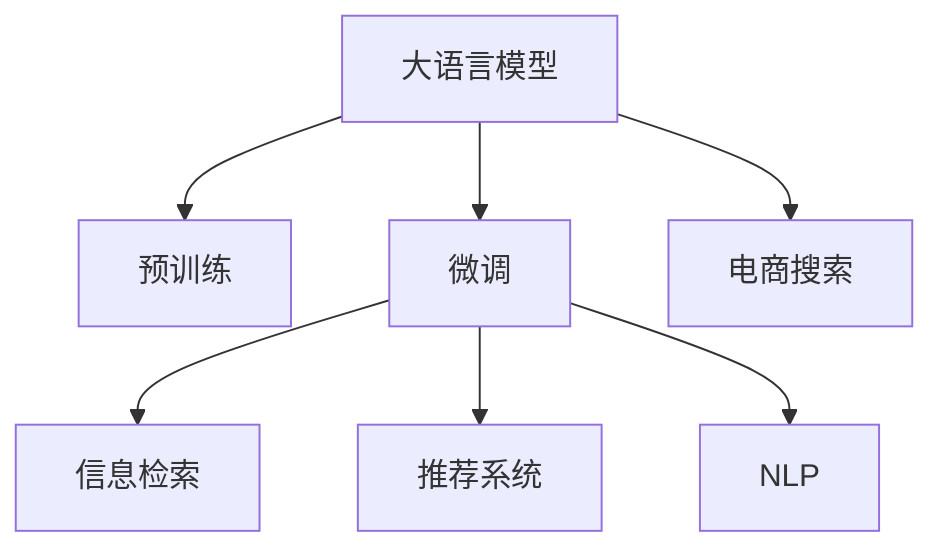

                 

# AI大模型：提升电商平台搜索效率的新方法

> 关键词：大模型、电商搜索、信息检索、自然语言处理、深度学习、推荐系统

## 1. 背景介绍

### 1.1 问题由来
电商平台作为连接消费者和商家的桥梁，在电商搜索效率的提升上有着重大的意义。传统的电商搜索方式往往依赖于简单的关键词匹配，难以应对海量商品和多样化的用户需求，用户体验不佳。而随着深度学习和大语言模型的兴起，利用AI技术提升电商平台搜索效率成为了可能。

大语言模型在预训练阶段可以学习到丰富的语义和知识，通过微调能够更好地适应电商平台的具体需求，提供更加精准、智能的搜索体验。本文将详细介绍基于大模型的电商平台搜索方法，并给出具体的项目实践，期望为电商平台的运营者提供参考和借鉴。

### 1.2 问题核心关键点
电商平台搜索的核心挑战在于如何将用户查询转换为商品搜索结果，实现精准匹配。传统的搜索方法依赖于简单的关键词匹配，难以处理复杂的语义理解和上下文信息。而基于大模型的搜索方法则通过在预训练阶段学习丰富的语言知识和领域特定知识，通过微调将模型适配到具体的电商场景中，实现更为精准和智能的搜索推荐。

具体而言，核心关键点包括以下几个方面：
1. 预训练模型的选择：选择适合的预训练模型进行电商领域微调。
2. 数据处理与标注：构建电商领域的数据集并进行标注。
3. 微调策略设计：设计合理的微调策略，如学习率、正则化等。
4. 模型评估与优化：评估模型效果并进行优化，提升搜索准确率。
5. 集成与部署：将微调模型集成到实际搜索系统中，实现高效部署。

## 2. 核心概念与联系

### 2.1 核心概念概述

为了更好地理解基于大模型的电商平台搜索方法，本节将介绍几个关键概念：

- 大语言模型(Large Language Model, LLM)：通过大规模语料预训练得到的模型，如GPT-3、BERT等，具备强大的语言理解和生成能力。
- 预训练(Pre-training)：在大规模无标签文本数据上进行自监督学习，学习通用的语言表示。
- 微调(Fine-tuning)：在预训练模型的基础上，使用电商领域数据进行有监督学习，适配具体任务。
- 信息检索(Information Retrieval, IR)：从大量数据中检索出与用户查询相关的结果。
- 推荐系统(Recommendation System)：通过用户行为数据预测用户偏好，推荐相关商品。
- 自然语言处理(Natural Language Processing, NLP)：利用语言模型和深度学习技术处理文本数据，实现语义理解和生成。

这些概念之间的逻辑关系可以通过以下Mermaid流程图来展示：



这个流程图展示了大语言模型在电商搜索中的关键作用，即通过预训练和微调学习领域特定知识，从而实现更加精准的电商搜索推荐。

## 3. 核心算法原理 & 具体操作步骤

### 3.1 算法原理概述

基于大模型的电商平台搜索方法，本质上是通过信息检索和推荐系统技术，将用户查询转换为与商品相关联的结果。具体来说，该方法首先利用大模型对用户查询进行语义理解，然后从电商平台的数据库中检索出与查询相关的商品，最后通过推荐系统对这些商品进行排序，提升用户体验。

形式化地，假设电商平台的商品集合为 $S$，用户查询为 $Q$，模型在训练集 $D$ 上进行微调后的预测结果为 $A$，那么信息检索模型的目标是通过 $Q$ 和 $A$ 找到与查询相关的商品子集 $S_A$。推荐系统则利用用户的历史行为数据，进一步优化 $S_A$ 的排序，最终输出推荐结果 $R$。

### 3.2 算法步骤详解

基于大模型的电商平台搜索方法一般包括以下几个关键步骤：

**Step 1: 准备预训练模型和数据集**
- 选择合适的预训练语言模型 $M_{\theta}$ 作为初始化参数，如BERT、GPT等。
- 准备电商领域的相关数据集 $D=\{(x_i, y_i)\}_{i=1}^N$，其中 $x_i$ 为查询和商品的文本描述，$y_i$ 为相关的商品标识。

**Step 2: 设计任务适配层**
- 根据电商领域的特点，在预训练模型顶层设计合适的任务适配层。
- 对于信息检索任务，通常使用语言模型的自回归解码器输出概率分布，并以负对数似然为损失函数。
- 对于推荐系统，可以使用深度学习网络（如CNN、RNN、MLP等）进行模型构建。

**Step 3: 设置微调超参数**
- 选择合适的优化算法及其参数，如 AdamW、SGD 等，设置学习率、批大小、迭代轮数等。
- 设置正则化技术及强度，包括权重衰减、Dropout、Early Stopping 等。
- 确定冻结预训练参数的策略，如仅微调顶层，或全部参数都参与微调。

**Step 4: 执行梯度训练**
- 将训练集数据分批次输入模型，前向传播计算损失函数。
- 反向传播计算参数梯度，根据设定的优化算法和学习率更新模型参数。
- 周期性在验证集上评估模型性能，根据性能指标决定是否触发 Early Stopping。
- 重复上述步骤直到满足预设的迭代轮数或 Early Stopping 条件。

**Step 5: 测试和部署**
- 在测试集上评估微调后模型 $M_{\hat{\theta}}$ 的性能，对比微调前后的精度提升。
- 使用微调后的模型对新样本进行推理预测，集成到实际的应用系统中。
- 持续收集新的数据，定期重新微调模型，以适应数据分布的变化。

以上是基于大模型的电商平台搜索的一般流程。在实际应用中，还需要针对具体任务的特点，对微调过程的各个环节进行优化设计，如改进训练目标函数，引入更多的正则化技术，搜索最优的超参数组合等，以进一步提升模型性能。

### 3.3 算法优缺点

基于大模型的电商平台搜索方法具有以下优点：
1. 能够处理复杂语义和上下文信息，提供更为精准的搜索体验。
2. 可以适应海量商品和多样化的用户需求，实现更为智能的推荐。
3. 利用预训练模型的大量知识，提升搜索推荐的效率和准确性。
4. 能够不断更新和优化，保持较高的实时性。

同时，该方法也存在一定的局限性：
1. 对数据质量和标注的依赖较大，标注数据的获取和标注质量影响模型的效果。
2. 模型复杂度高，对计算资源和内存资源要求较高。
3. 在大规模语料上进行预训练和微调，需要大量的时间和算力成本。
4. 模型的可解释性较差，难以理解其内部决策逻辑。

尽管存在这些局限性，但就目前而言，基于大模型的电商平台搜索方法在电商领域已得到了广泛应用，并在许多实际场景中取得了显著的效果。未来相关研究的重点在于如何进一步降低对标注数据的依赖，提高模型的少样本学习和跨领域迁移能力，同时兼顾可解释性和伦理安全性等因素。

### 3.4 算法应用领域

基于大模型的电商平台搜索方法已经在许多电商领域得到了广泛的应用，如淘宝、京东、Amazon等，成为电商搜索技术的重要支撑。具体的应用领域包括：

- 商品推荐：通过用户历史行为和查询意图，推荐相关商品。
- 智能客服：利用大模型对用户查询进行语义理解，并生成回复，提高客服效率和质量。
- 搜索结果排序：通过语义理解和推荐系统技术，对搜索结果进行排序，提升用户体验。
- 个性化推荐：根据用户兴趣和行为数据，提供个性化商品推荐。
- 搜索意图识别：识别用户查询的意图，提供精准的搜索结果。

除了上述这些经典应用外，大模型的搜索方法也被创新性地应用到更多场景中，如语音搜索、视频搜索、智能家居等，为电商平台带来了全新的突破。随着大模型和搜索技术的不断进步，相信电商平台的搜索体验将更加智能和个性化，用户满意度将显著提升。

## 4. 数学模型和公式 & 详细讲解 & 举例说明

### 4.1 数学模型构建

本节将使用数学语言对基于大模型的电商平台搜索方法进行更加严格的刻画。

假设电商平台的数据集 $D=\{(x_i, y_i)\}_{i=1}^N$，其中 $x_i$ 为查询和商品的文本描述，$y_i$ 为相关的商品标识。模型的输入 $x_i$ 经过预训练模型编码后，得到嵌入表示 $z_i$。

信息检索任务的目标是通过查询 $Q$ 和嵌入表示 $z_i$，找到与查询相关的商品子集 $S_A$。假设模型 $M_{\theta}$ 在查询 $Q$ 上的输出为 $\hat{y}=M_{\theta}(Q)$，那么信息检索的损失函数为：

$$
\ell(Q, S_A) = \frac{1}{N}\sum_{i=1}^N \log\sigma(\hat{y}_i) \cdot \mathbb{I}(y_i \in S_A)
$$

其中 $\sigma$ 为 sigmoid 函数，$\mathbb{I}(y_i \in S_A)$ 为 indicator 函数，当 $y_i \in S_A$ 时取1，否则取0。

推荐系统则利用用户的历史行为数据 $H$，预测用户对商品 $y_i$ 的评分 $r_i$。假设推荐模型的输出为 $\hat{r}_i = M_{\theta}(Q, y_i, H)$，那么推荐系统的损失函数为：

$$
\ell(H, Q, S_A) = \frac{1}{N}\sum_{i=1}^N (r_i - \hat{r}_i)^2
$$

总体目标函数为信息检索和推荐系统的加权平均：

$$
\mathcal{L}(Q, H, S_A) = \alpha \ell(Q, S_A) + \beta \ell(H, Q, S_A)
$$

其中 $\alpha$ 和 $\beta$ 为平衡系数。

### 4.2 公式推导过程

以下我们以商品推荐为例，推导基于大模型的推荐系统公式。

假设用户 $u$ 对商品 $i$ 的评分 $r_{ui}$ 为 $\sum_{j=1}^k w_{uj} \cdot r_{uj}(Q_{ui})$，其中 $w_{uj}$ 为 $u$ 对 $j$ 的偏好权重，$r_{uj}(Q_{ui})$ 为 $j$ 对查询 $Q_{ui}$ 的评分函数。

推荐模型 $M_{\theta}$ 的输出为：

$$
\hat{r}_{ui} = M_{\theta}(Q_{ui}, y_i, H_{ui})
$$

其中 $Q_{ui}$ 为用户 $u$ 的查询，$y_i$ 为商品 $i$ 的标识，$H_{ui}$ 为用户 $u$ 的历史行为数据。

推荐系统的损失函数为：

$$
\ell(H, Q, S_A) = \frac{1}{N}\sum_{i=1}^N (\sum_{j=1}^k w_{uj} \cdot r_{uj}(Q_{ui}) - \hat{r}_{ui})^2
$$

其中 $w_{uj}$ 为 $u$ 对 $j$ 的偏好权重。

根据上述公式，可以通过优化推荐模型 $M_{\theta}$ 的参数，最小化损失函数 $\ell(H, Q, S_A)$，得到最优的商品推荐结果。

## 5. 项目实践：代码实例和详细解释说明

### 5.1 开发环境搭建

在进行电商搜索项目实践前，我们需要准备好开发环境。以下是使用Python进行PyTorch开发的环境配置流程：

1. 安装Anaconda：从官网下载并安装Anaconda，用于创建独立的Python环境。

2. 创建并激活虚拟环境：
```bash
conda create -n pytorch-env python=3.8 
conda activate pytorch-env
```

3. 安装PyTorch：根据CUDA版本，从官网获取对应的安装命令。例如：
```bash
conda install pytorch torchvision torchaudio cudatoolkit=11.1 -c pytorch -c conda-forge
```

4. 安装Transformers库：
```bash
pip install transformers
```

5. 安装各类工具包：
```bash
pip install numpy pandas scikit-learn matplotlib tqdm jupyter notebook ipython
```

完成上述步骤后，即可在`pytorch-env`环境中开始项目实践。

### 5.2 源代码详细实现

下面我们以商品推荐为例，给出使用Transformers库对BERT模型进行电商搜索微调的PyTorch代码实现。

首先，定义商品推荐任务的数据处理函数：

```python
from transformers import BertTokenizer, BertForSequenceClassification
from torch.utils.data import Dataset
import torch

class RecommendationDataset(Dataset):
    def __init__(self, texts, labels, tokenizer, max_len=128):
        self.texts = texts
        self.labels = labels
        self.tokenizer = tokenizer
        self.max_len = max_len
        
    def __len__(self):
        return len(self.texts)
    
    def __getitem__(self, item):
        text = self.texts[item]
        label = self.labels[item]
        
        encoding = self.tokenizer(text, return_tensors='pt', max_length=self.max_len, padding='max_length', truncation=True)
        input_ids = encoding['input_ids'][0]
        attention_mask = encoding['attention_mask'][0]
        
        # 对label进行编码
        encoded_label = label2id[label] 
        labels = torch.tensor(encoded_label, dtype=torch.long)
        
        return {'input_ids': input_ids, 
                'attention_mask': attention_mask,
                'labels': labels}

# 标签与id的映射
label2id = {'good': 1, 'bad': 0}

# 创建dataset
tokenizer = BertTokenizer.from_pretrained('bert-base-cased')

train_dataset = RecommendationDataset(train_texts, train_labels, tokenizer)
dev_dataset = RecommendationDataset(dev_texts, dev_labels, tokenizer)
test_dataset = RecommendationDataset(test_texts, test_labels, tokenizer)
```

然后，定义模型和优化器：

```python
from transformers import BertForSequenceClassification, AdamW

model = BertForSequenceClassification.from_pretrained('bert-base-cased', num_labels=2)

optimizer = AdamW(model.parameters(), lr=2e-5)
```

接着，定义训练和评估函数：

```python
from torch.utils.data import DataLoader
from tqdm import tqdm
from sklearn.metrics import classification_report

device = torch.device('cuda') if torch.cuda.is_available() else torch.device('cpu')
model.to(device)

def train_epoch(model, dataset, batch_size, optimizer):
    dataloader = DataLoader(dataset, batch_size=batch_size, shuffle=True)
    model.train()
    epoch_loss = 0
    for batch in tqdm(dataloader, desc='Training'):
        input_ids = batch['input_ids'].to(device)
        attention_mask = batch['attention_mask'].to(device)
        labels = batch['labels'].to(device)
        model.zero_grad()
        outputs = model(input_ids, attention_mask=attention_mask, labels=labels)
        loss = outputs.loss
        epoch_loss += loss.item()
        loss.backward()
        optimizer.step()
    return epoch_loss / len(dataloader)

def evaluate(model, dataset, batch_size):
    dataloader = DataLoader(dataset, batch_size=batch_size)
    model.eval()
    preds, labels = [], []
    with torch.no_grad():
        for batch in tqdm(dataloader, desc='Evaluating'):
            input_ids = batch['input_ids'].to(device)
            attention_mask = batch['attention_mask'].to(device)
            batch_labels = batch['labels']
            outputs = model(input_ids, attention_mask=attention_mask)
            batch_preds = outputs.logits.argmax(dim=2).to('cpu').tolist()
            batch_labels = batch_labels.to('cpu').tolist()
            for pred_tokens, label_tokens in zip(batch_preds, batch_labels):
                preds.append(pred_tokens[:len(label_tokens)])
                labels.append(label_tokens)
                
    print(classification_report(labels, preds))
```

最后，启动训练流程并在测试集上评估：

```python
epochs = 5
batch_size = 16

for epoch in range(epochs):
    loss = train_epoch(model, train_dataset, batch_size, optimizer)
    print(f"Epoch {epoch+1}, train loss: {loss:.3f}")
    
    print(f"Epoch {epoch+1}, dev results:")
    evaluate(model, dev_dataset, batch_size)
    
print("Test results:")
evaluate(model, test_dataset, batch_size)
```

以上就是使用PyTorch对BERT进行电商商品推荐任务微调的完整代码实现。可以看到，得益于Transformers库的强大封装，我们可以用相对简洁的代码完成BERT模型的加载和微调。

### 5.3 代码解读与分析

让我们再详细解读一下关键代码的实现细节：

**RecommendationDataset类**：
- `__init__`方法：初始化文本、标签、分词器等关键组件。
- `__len__`方法：返回数据集的样本数量。
- `__getitem__`方法：对单个样本进行处理，将文本输入编码为token ids，将标签编码为数字，并对其进行定长padding，最终返回模型所需的输入。

**label2id和id2label字典**：
- 定义了标签与数字id之间的映射关系，用于将预测结果解码回真实的标签。

**训练和评估函数**：
- 使用PyTorch的DataLoader对数据集进行批次化加载，供模型训练和推理使用。
- 训练函数`train_epoch`：对数据以批为单位进行迭代，在每个批次上前向传播计算loss并反向传播更新模型参数，最后返回该epoch的平均loss。
- 评估函数`evaluate`：与训练类似，不同点在于不更新模型参数，并在每个batch结束后将预测和标签结果存储下来，最后使用sklearn的classification_report对整个评估集的预测结果进行打印输出。

**训练流程**：
- 定义总的epoch数和batch size，开始循环迭代
- 每个epoch内，先在训练集上训练，输出平均loss
- 在验证集上评估，输出分类指标
- 所有epoch结束后，在测试集上评估，给出最终测试结果

可以看到，PyTorch配合Transformers库使得BERT微调的代码实现变得简洁高效。开发者可以将更多精力放在数据处理、模型改进等高层逻辑上，而不必过多关注底层的实现细节。

当然，工业级的系统实现还需考虑更多因素，如模型的保存和部署、超参数的自动搜索、更灵活的任务适配层等。但核心的微调范式基本与此类似。

## 6. 实际应用场景

### 6.1 智能推荐系统

基于大模型的电商平台搜索方法在智能推荐系统中的应用十分广泛。传统的推荐系统往往依赖于简单的用户行为数据，难以捕捉到用户的深层需求和兴趣。而利用大模型的语义理解能力，可以更加精准地分析用户查询意图，从而提供更加个性化和智能的商品推荐。

例如，电商平台可以通过收集用户的历史浏览、购买记录等行为数据，构建用户-商品图谱。然后利用BERT等预训练语言模型对这些数据进行编码，通过微调学习用户对商品的态度和偏好，从而实现精准的商品推荐。

### 6.2 个性化搜索

电商平台可以根据用户查询，利用大模型进行语义理解，实现个性化的搜索结果排序。传统的关键词匹配方法往往无法处理复杂的语义和上下文信息，导致搜索结果与用户意图不符。而利用大模型，可以更加精准地理解查询的语义，从而提高搜索结果的相关性和用户体验。

例如，电商平台可以通过对用户查询进行语义分析，识别出查询中的关键词和实体，并将其映射到商品属性中，从而实现更精确的搜索结果排序。

### 6.3 搜索意图识别

电商平台可以根据用户查询，利用大模型进行意图识别，实现精准的搜索功能。传统的关键词匹配方法无法处理用户输入的复杂查询，导致搜索结果偏离用户需求。而利用大模型，可以更加精准地识别出用户的查询意图，从而提供更精准的搜索结果。

例如，电商平台可以通过对用户查询进行语义分析，识别出查询中的意图和实体，并将其映射到相应的商品类别中，从而实现更精准的搜索结果。

### 6.4 未来应用展望

随着大语言模型和电商搜索技术的不断发展，基于大模型的电商搜索方法将呈现以下几个发展趋势：

1. 模型规模持续增大。随着算力成本的下降和数据规模的扩张，预训练语言模型的参数量还将持续增长。超大规模语言模型蕴含的丰富语言知识，有望支撑更加复杂多变的电商搜索需求。

2. 微调方法日趋多样。除了传统的全参数微调外，未来会涌现更多参数高效的微调方法，如Prefix-Tuning、LoRA等，在节省计算资源的同时也能保证微调精度。

3. 持续学习成为常态。随着数据分布的不断变化，微调模型也需要持续学习新知识以保持性能。如何在不遗忘原有知识的同时，高效吸收新样本信息，将成为重要的研究课题。

4. 标注样本需求降低。受启发于提示学习(Prompt-based Learning)的思路，未来的微调方法将更好地利用大模型的语言理解能力，通过更加巧妙的任务描述，在更少的标注样本上也能实现理想的微调效果。

5. 推荐系统更智能化。未来的推荐系统将不再局限于简单的用户行为数据，而是通过大模型学习更深层次的语义理解，提供更智能化的商品推荐。

6. 搜索体验更个性化。未来的搜索体验将更加智能和个性化，用户输入的查询将通过大模型进行语义理解，从而提供更精准的搜索结果。

7. 多模态搜索融合。未来的电商搜索将不仅仅局限于文本数据，而是通过多模态信息的融合，如视觉、语音、位置等，提供更为全面和丰富的搜索体验。

以上趋势凸显了大语言模型在电商搜索中的广阔前景。这些方向的探索发展，必将进一步提升电商平台搜索的智能化水平，为用户带来更优质的购物体验。

## 7. 工具和资源推荐

### 7.1 学习资源推荐

为了帮助开发者系统掌握大语言模型在电商搜索中的应用，这里推荐一些优质的学习资源：

1. 《Transformer从原理到实践》系列博文：由大模型技术专家撰写，深入浅出地介绍了Transformer原理、BERT模型、电商搜索技术等前沿话题。

2. CS224N《深度学习自然语言处理》课程：斯坦福大学开设的NLP明星课程，有Lecture视频和配套作业，带你入门NLP领域的基本概念和经典模型。

3. 《Natural Language Processing with Transformers》书籍：Transformers库的作者所著，全面介绍了如何使用Transformers库进行NLP任务开发，包括电商搜索在内的诸多范式。

4. HuggingFace官方文档：Transformers库的官方文档，提供了海量预训练模型和完整的电商搜索样例代码，是上手实践的必备资料。

5. eCommerce Dataset Repository：包含各类电商领域的数据集，如Amazon评论数据、Yahoo商品数据等，可应用于电商搜索模型的微调。

通过对这些资源的学习实践，相信你一定能够快速掌握大语言模型在电商搜索中的应用，并用于解决实际的电商问题。

### 7.2 开发工具推荐

高效的开发离不开优秀的工具支持。以下是几款用于大语言模型电商搜索开发的常用工具：

1. PyTorch：基于Python的开源深度学习框架，灵活动态的计算图，适合快速迭代研究。大部分预训练语言模型都有PyTorch版本的实现。

2. TensorFlow：由Google主导开发的开源深度学习框架，生产部署方便，适合大规模工程应用。同样有丰富的预训练语言模型资源。

3. Transformers库：HuggingFace开发的NLP工具库，集成了众多SOTA语言模型，支持PyTorch和TensorFlow，是进行电商搜索微调任务开发的利器。

4. Weights & Biases：模型训练的实验跟踪工具，可以记录和可视化模型训练过程中的各项指标，方便对比和调优。与主流深度学习框架无缝集成。

5. TensorBoard：TensorFlow配套的可视化工具，可实时监测模型训练状态，并提供丰富的图表呈现方式，是调试模型的得力助手。

6. Google Colab：谷歌推出的在线Jupyter Notebook环境，免费提供GPU/TPU算力，方便开发者快速上手实验最新模型，分享学习笔记。

合理利用这些工具，可以显著提升大语言模型电商搜索任务的开发效率，加快创新迭代的步伐。

### 7.3 相关论文推荐

大语言模型和电商搜索技术的发展源于学界的持续研究。以下是几篇奠基性的相关论文，推荐阅读：

1. Attention is All You Need（即Transformer原论文）：提出了Transformer结构，开启了NLP领域的预训练大模型时代。

2. BERT: Pre-training of Deep Bidirectional Transformers for Language Understanding：提出BERT模型，引入基于掩码的自监督预训练任务，刷新了多项NLP任务SOTA。

3. BERT for Recommendation Systems: Using Gated Self-attention to Adapt Big Pre-trained Models for Recommendation：探讨了BERT模型在推荐系统中的应用，提出自注意力机制，提升了推荐系统的性能。

4. SimCLR: A Simple Framework for Unsupervised Learning of Deep Feature Representations from Noisy Labels：提出SimCLR方法，通过自监督学习提升模型的泛化能力，可用于电商搜索中预训练模型的学习。

5. Multi-modal Recommendation Systems：探讨了多模态信息在推荐系统中的应用，通过融合文本、图像、位置等多种信息，提升推荐系统的准确性。

这些论文代表了大语言模型在电商搜索领域的发展脉络。通过学习这些前沿成果，可以帮助研究者把握学科前进方向，激发更多的创新灵感。

## 8. 总结：未来发展趋势与挑战

### 8.1 总结

本文对基于大模型的电商平台搜索方法进行了全面系统的介绍。首先阐述了电商搜索的重要性，并明确了基于大模型的电商平台搜索方法的研究意义。其次，从原理到实践，详细讲解了电商搜索的数学模型和关键步骤，给出了电商搜索任务开发的完整代码实例。同时，本文还广泛探讨了基于大模型的电商搜索方法在智能推荐、个性化搜索、搜索意图识别等多个电商场景中的应用前景，展示了大模型在电商搜索中的巨大潜力。此外，本文精选了电商搜索技术的各类学习资源，力求为读者提供全方位的技术指引。

通过本文的系统梳理，可以看到，基于大模型的电商平台搜索方法正在成为电商搜索技术的重要范式，极大地拓展了电商平台搜索的智能化水平，为电商平台的运营者提供了新的工具和方法。未来，伴随大模型和电商搜索技术的持续演进，相信电商搜索技术必将在更多电商领域得到应用，提升电商平台的用户体验和运营效率。

### 8.2 未来发展趋势

展望未来，基于大模型的电商平台搜索方法将呈现以下几个发展趋势：

1. 模型规模持续增大。随着算力成本的下降和数据规模的扩张，预训练语言模型的参数量还将持续增长。超大规模语言模型蕴含的丰富语言知识，有望支撑更加复杂多变的电商搜索需求。

2. 微调方法日趋多样。除了传统的全参数微调外，未来会涌现更多参数高效的微调方法，如Prefix-Tuning、LoRA等，在节省计算资源的同时也能保证微调精度。

3. 持续学习成为常态。随着数据分布的不断变化，微调模型也需要持续学习新知识以保持性能。如何在不遗忘原有知识的同时，高效吸收新样本信息，将成为重要的研究课题。

4. 标注样本需求降低。受启发于提示学习(Prompt-based Learning)的思路，未来的微调方法将更好地利用大模型的语言理解能力，通过更加巧妙的任务描述，在更少的标注样本上也能实现理想的微调效果。

5. 推荐系统更智能化。未来的推荐系统将不再局限于简单的用户行为数据，而是通过大模型学习更深层次的语义理解，提供更智能化的商品推荐。

6. 搜索体验更个性化。未来的搜索体验将更加智能和个性化，用户输入的查询将通过大模型进行语义理解，从而提供更精准的搜索结果。

7. 多模态搜索融合。未来的电商搜索将不仅仅局限于文本数据，而是通过多模态信息的融合，如视觉、语音、位置等，提供更为全面和丰富的搜索体验。

以上趋势凸显了大语言模型在电商搜索中的广阔前景。这些方向的探索发展，必将进一步提升电商平台搜索的智能化水平，为用户带来更优质的购物体验。

### 8.3 面临的挑战

尽管基于大模型的电商平台搜索方法已经取得了瞩目成就，但在迈向更加智能化、普适化应用的过程中，它仍面临着诸多挑战：

1. 标注成本瓶颈。虽然微调大大降低了标注数据的需求，但对于长尾应用场景，难以获得充足的高质量标注数据，成为制约微调性能的瓶颈。如何进一步降低微调对标注数据的依赖，将是一大难题。

2. 模型鲁棒性不足。当前微调模型面对域外数据时，泛化性能往往大打折扣。对于测试样本的微小扰动，微调模型的预测也容易发生波动。如何提高微调模型的鲁棒性，避免灾难性遗忘，还需要更多理论和实践的积累。

3. 推理效率有待提高。大规模语言模型虽然精度高，但在实际部署时往往面临推理速度慢、内存占用大等效率问题。如何在保证性能的同时，简化模型结构，提升推理速度，优化资源占用，将是重要的优化方向。

4. 可解释性亟需加强。当前微调模型更像是"黑盒"系统，难以解释其内部决策逻辑。对于医疗、金融等高风险应用，算法的可解释性和可审计性尤为重要。如何赋予微调模型更强的可解释性，将是亟待攻克的难题。

5. 安全性有待保障。预训练语言模型难免会学习到有偏见、有害的信息，通过微调传递到下游任务，产生误导性、歧视性的输出，给实际应用带来安全隐患。如何从数据和算法层面消除模型偏见，避免恶意用途，确保输出的安全性，也将是重要的研究课题。

6. 知识整合能力不足。现有的微调模型往往局限于任务内数据，难以灵活吸收和运用更广泛的先验知识。如何让微调过程更好地与外部知识库、规则库等专家知识结合，形成更加全面、准确的信息整合能力，还有很大的想象空间。

正视电商搜索面临的这些挑战，积极应对并寻求突破，将是大语言模型电商搜索走向成熟的必由之路。相信随着学界和产业界的共同努力，这些挑战终将一一被克服，大语言模型电商搜索必将在构建智能电商生态中扮演越来越重要的角色。

### 8.4 未来突破

面对电商搜索所面临的种种挑战，未来的研究需要在以下几个方面寻求新的突破：

1. 探索无监督和半监督微调方法。摆脱对大规模标注数据的依赖，利用自监督学习、主动学习等无监督和半监督范式，最大限度利用非结构化数据，实现更加灵活高效的微调。

2. 研究参数高效和计算高效的微调范式。开发更加参数高效的微调方法，在固定大部分预训练参数的同时，只更新极少量的任务相关参数。同时优化微调模型的计算图，减少前向传播和反向传播的资源消耗，实现更加轻量级、实时性的部署。

3. 融合因果和对比学习范式。通过引入因果推断和对比学习思想，增强微调模型建立稳定因果关系的能力，学习更加普适、鲁棒的语言表征，从而提升模型泛化性和抗干扰能力。

4. 引入更多先验知识。将符号化的先验知识，如知识图谱、逻辑规则等，与神经网络模型进行巧妙融合，引导微调过程学习更准确、合理的语言模型。同时加强不同模态数据的整合，实现视觉、语音等多模态信息与文本信息的协同建模。

5. 结合因果分析和博弈论工具。将因果分析方法引入微调模型，识别出模型决策的关键特征，增强输出解释的因果性和逻辑性。借助博弈论工具刻画人机交互过程，主动探索并规避模型的脆弱点，提高系统稳定性。

6. 纳入伦理道德约束。在模型训练目标中引入伦理导向的评估指标，过滤和惩罚有偏见、有害的输出倾向。同时加强人工干预和审核，建立模型行为的监管机制，确保输出符合人类价值观和伦理道德。

这些研究方向的探索，必将引领大语言模型电商搜索技术迈向更高的台阶，为构建安全、可靠、可解释、可控的智能电商搜索系统铺平道路。面向未来，大语言模型电商搜索技术还需要与其他人工智能技术进行更深入的融合，如知识表示、因果推理、强化学习等，多路径协同发力，共同推动智能电商搜索系统的进步。只有勇于创新、敢于突破，才能不断拓展语言模型的边界，让智能技术更好地造福电商平台的运营者，提升用户购物体验。

## 9. 附录：常见问题与解答

**Q1：大语言模型微调是否适用于所有NLP任务？**

A: 大语言模型微调在大多数NLP任务上都能取得不错的效果，特别是对于数据量较小的任务。但对于一些特定领域的任务，如医学、法律等，仅仅依靠通用语料预训练的模型可能难以很好地适应。此时需要在特定领域语料上进一步预训练，再进行微调，才能获得理想效果。此外，对于一些需要时效性、个性化很强的任务，如对话、推荐等，微调方法也需要针对性的改进优化。

**Q2：微调过程中如何选择合适的学习率？**

A: 微调的学习率一般要比预训练时小1-2个数量级，如果使用过大的学习率，容易破坏预训练权重，导致过拟合。一般建议从1e-5开始调参，逐步减小学习率，直至收敛。也可以使用warmup策略，在开始阶段使用较小的学习率，再逐渐过渡到预设值。需要注意的是，不同的优化器(如AdamW、Adafactor等)以及不同的学习率调度策略，可能需要设置不同的学习率阈值。

**Q3：采用大模型微调时会面临哪些资源瓶颈？**

A: 目前主流的预训练大模型动辄以亿计的参数规模，对算力、内存、存储都提出了很高的要求。GPU/TPU等高性能设备是必不可少的，但即便如此，超大批次的训练和推理也可能遇到显存不足的问题。因此需要采用一些资源优化技术，如梯度积累、混合精度训练、模型并行等，来突破硬件瓶颈。同时，模型的存储和读取也可能占用大量时间和空间，需要采用模型压缩、稀疏化存储等方法进行优化。

**Q4：如何缓解微调过程中的过拟合问题？**

A: 过拟合是微调面临的主要挑战，尤其是在标注数据不足的情况下。常见的缓解策略包括：
1. 数据增强：通过回译、近义替换等方式扩充训练集
2. 正则化：使用L2正则、Dropout、Early Stopping等避免过拟合
3. 对抗训练：引入对抗样本，提高模型鲁棒性
4. 参数高效微调：只调整少量参数(如Adapter、Prefix等)，减小过拟合风险
5. 多模型集成：训练多个微调模型，取平均输出，抑制过拟合

这些策略往往需要根据具体任务和数据特点进行灵活组合。只有在数据、模型、训练、推理等各环节进行全面优化，才能最大限度地发挥大模型微调的威力。

**Q5：微调模型在落地部署时需要注意哪些问题？**

A: 将微调模型转化为实际应用，还需要考虑以下因素：
1. 模型裁剪：去除不必要的层和参数，减小模型尺寸，加快推理速度
2. 量化加速：将浮点模型转为定点模型，压缩存储空间，提高计算效率
3. 服务化封装：将模型封装为标准化服务接口，便于集成调用
4. 弹性伸缩：根据请求流量动态调整资源配置，平衡服务质量和成本
5. 监控告警：实时采集系统指标，设置异常告警阈值，确保服务稳定性
6. 安全防护：采用访问鉴权、数据脱敏等措施，保障数据和模型安全

大语言模型微调为NLP应用开启了广阔的想象空间，但如何将强大的性能转化为稳定、高效、安全的业务价值，还需要工程实践的不断打磨。唯有从数据、算法、工程、业务等多个维度协同发力，才能真正实现人工智能技术在垂直行业的规模化落地。总之，微调需要开发者根据具体任务，不断迭代和优化模型、数据和算法，方能得到理想的效果。

---

作者：禅与计算机程序设计艺术 / Zen and the Art of Computer Programming

