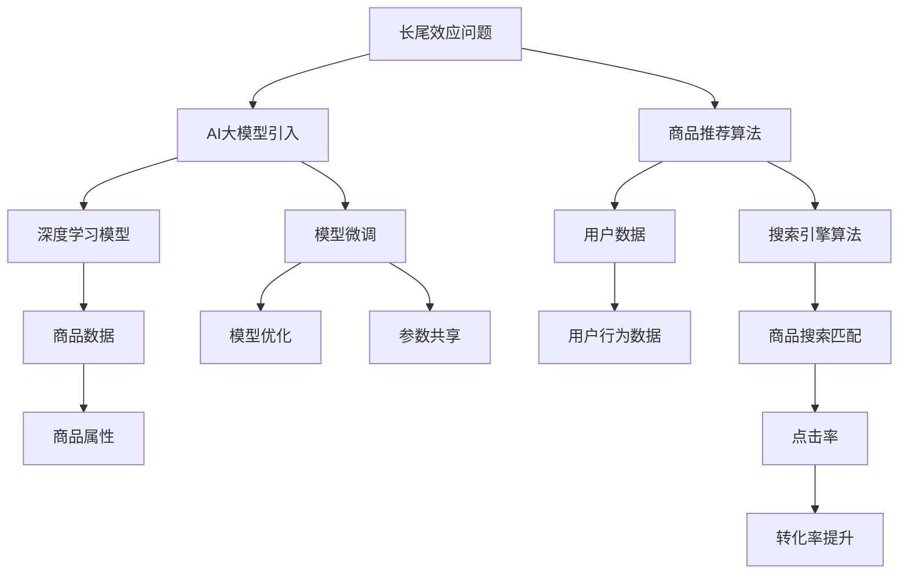

                 

# AI大模型：改善电商平台长尾效应的新方法

## 1. 背景介绍

在当前电子商务平台中，长尾效应是指少数热门商品占用了大量流量和注意力，而大多数销量较少的商品则被边缘化。这种流量分配不均，导致电商平台在销售低销量商品时面临困境。AI大模型，特别是大语言模型，能够通过对海量数据进行深度学习，提取有用信息，从而优化商品推荐、搜索算法，有效改善长尾效应。

## 2. 核心概念与联系

### 2.1 核心概念概述

- **AI大模型**：通过深度学习在大量数据上预训练的模型，拥有强大的特征提取能力和预测能力。例如，BERT、GPT-3、GPT-4等语言模型。
- **长尾效应**：指电商平台上少数商品占大部分流量，而大部分商品则销量低，难以被发现。
- **商品推荐**：通过算法将用户可能喜欢的商品推荐给用户，提升用户体验和销售额。
- **搜索引擎**：通过算法将查询与最相关的商品匹配，提高搜索效率和准确性。
- **转化率提升**：通过推荐系统优化，提高商品展示在用户面前时的转化率。

这些概念紧密相连，共同作用于电商平台优化商品的曝光和销售。

### 2.2 核心概念原理和架构的 Mermaid 流程图



这个图展示了从长尾效应问题到模型微调，再到最终优化电商转化率的流程。

## 3. 核心算法原理 & 具体操作步骤

### 3.1 算法原理概述

AI大模型通过分析用户行为和商品属性，预测用户对商品的需求。基于这些预测，调整商品推荐和搜索算法，提高长尾商品的曝光率和销售额。

核心算法包括：

- **用户行为分析**：通过分析用户浏览、点击、购买等行为数据，提取用户偏好。
- **商品属性建模**：提取商品名称、描述、标签等信息，建立商品特征向量。
- **相似度计算**：计算用户与商品之间的相似度，提高推荐和搜索的准确性。
- **优化推荐系统**：根据相似度计算结果，优化推荐算法。

### 3.2 算法步骤详解

1. **数据收集与预处理**：
    - 收集用户行为数据（点击、浏览、购买等）和商品属性数据（商品名、描述、标签等）。
    - 数据清洗和预处理，包括去除噪声、处理缺失值等。

2. **特征提取**：
    - 使用AI大模型（如BERT、GPT等）对用户行为和商品属性数据进行特征提取。
    - 提取用户行为特征和商品属性特征，构建用户-商品特征矩阵。

3. **相似度计算**：
    - 采用余弦相似度、Jaccard相似度等方法计算用户与商品之间的相似度。
    - 相似度计算基于用户行为特征和商品属性特征，进行多维度相似度综合。

4. **推荐系统优化**：
    - 根据相似度计算结果，调整推荐算法。
    - 使用协同过滤、基于内容的推荐等方法，优化推荐系统。

5. **模型微调**：
    - 将模型在特定任务上（如点击率预测、转化率提升）进行微调。
    - 使用随机梯度下降、Adam等优化算法进行模型微调，提升推荐和搜索效果。

### 3.3 算法优缺点

**优点**：

- **高效性**：大模型通过特征提取，可以高效处理大规模数据，提高推荐和搜索的准确性。
- **泛化性强**：大模型在多个领域均有应用，能够适应不同商品类别和用户需求。
- **自适应性强**：大模型能够根据用户行为和商品属性动态调整推荐策略，提升用户满意度。

**缺点**：

- **资源消耗高**：大模型需要大量的计算资源和存储空间，初期投入成本高。
- **效果依赖数据**：模型性能取决于数据质量和特征提取效果，对数据清洗和预处理要求高。
- **模型复杂性**：模型结构复杂，优化和调试难度大。

### 3.4 算法应用领域

AI大模型在电商平台中的应用领域广泛，包括：

- **商品推荐**：通过分析用户行为和商品属性，预测用户对商品的需求，调整推荐策略。
- **搜索引擎优化**：优化搜索算法，提高搜索结果的相关性和用户满意度。
- **个性化推荐**：根据用户行为和商品属性，提供个性化推荐，提升转化率。
- **广告投放**：优化广告投放策略，提高广告点击率和转化率。

## 4. 数学模型和公式 & 详细讲解 & 举例说明

### 4.1 数学模型构建

假设用户行为数据为 $X = (x_1, x_2, ..., x_n)$，商品属性数据为 $Y = (y_1, y_2, ..., y_m)$。用户行为特征向量为 $U$，商品属性特征向量为 $V$。相似度矩阵为 $S = (s_{ij})_{n \times m}$。

推荐算法 $R = f(U, V, S)$，其中 $f$ 为推荐函数。

### 4.2 公式推导过程

**相似度计算**：

$$
s_{ij} = \frac{\sum_{k=1}^{d} (u_k \cdot v_k)}{\sqrt{\sum_{k=1}^{d} u_k^2} \cdot \sqrt{\sum_{k=1}^{d} v_k^2}}
$$

其中，$u_k$ 为第 $k$ 个用户行为特征，$v_k$ 为第 $k$ 个商品属性特征，$d$ 为特征维度。

**推荐函数**：

$$
R = Softmax(S)
$$

其中，$Softmax$ 函数将相似度矩阵 $S$ 转化为概率分布，用于选择推荐商品。

### 4.3 案例分析与讲解

以电商平台的推荐系统为例，使用BERT模型进行用户行为特征和商品属性特征的提取。首先，将用户行为和商品属性数据输入BERT模型，得到用户行为向量 $U$ 和商品属性向量 $V$。然后，计算用户与商品的相似度 $S$，根据相似度矩阵 $S$ 和推荐函数 $R$ 得到推荐结果。

## 5. 项目实践：代码实例和详细解释说明

### 5.1 开发环境搭建

为了搭建开发环境，需要：

- 安装Python和必要的依赖库，如Pandas、NumPy、Scikit-learn等。
- 搭建深度学习框架，如TensorFlow或PyTorch。
- 收集并准备电商平台的用户行为和商品属性数据。

### 5.2 源代码详细实现

以下是一个简单的示例代码，使用TensorFlow和BERT模型实现商品推荐：

```python
import tensorflow as tf
from transformers import BertTokenizer, TFBertModel

# 初始化BERT模型和tokenizer
tokenizer = BertTokenizer.from_pretrained('bert-base-uncased')
model = TFBertModel.from_pretrained('bert-base-uncased')

# 定义用户行为和商品属性数据
user_data = ...
item_data = ...

# 数据预处理
# 这里假设数据已经经过清洗和预处理

# 构建特征向量
user_features = tokenizer.encode(user_data, add_special_tokens=True)
item_features = tokenizer.encode(item_data, add_special_tokens=True)

# 计算相似度
S = tf.matmul(user_features, item_features, transpose_b=True)

# 计算推荐结果
R = tf.nn.softmax(S)

# 输出推荐结果
print(R)
```

### 5.3 代码解读与分析

- **数据预处理**：使用BertTokenizer对用户行为和商品属性数据进行编码，得到特征向量。
- **相似度计算**：使用tf.matmul计算相似度矩阵 $S$。
- **推荐函数**：使用tf.nn.softmax函数将相似度矩阵转化为概率分布，得到推荐结果 $R$。

### 5.4 运行结果展示

运行上述代码，可以输出电商平台的商品推荐结果。这个结果可以用来调整推荐算法，进一步优化电商平台的用户体验和销售额。

## 6. 实际应用场景

AI大模型在电商平台中的应用场景包括：

- **商品推荐**：通过分析用户行为和商品属性，生成推荐列表，提升用户购买意愿。
- **搜索引擎优化**：优化搜索引擎算法，提高搜索结果的相关性。
- **个性化推荐**：根据用户行为和商品属性，提供个性化推荐，提升用户体验。
- **广告投放**：优化广告投放策略，提高广告效果和转化率。

## 7. 工具和资源推荐

### 7.1 学习资源推荐

- **自然语言处理课程**：如斯坦福大学的《CS224n: Natural Language Processing with Deep Learning》，深入学习深度学习在自然语言处理中的应用。
- **TensorFlow和PyTorch官方文档**：详细了解TensorFlow和PyTorch的深度学习框架和库。
- **BERT和GPT模型论文**：阅读BERT和GPT的原始论文，理解模型结构和训练过程。

### 7.2 开发工具推荐

- **TensorFlow和PyTorch**：深度学习框架，支持大规模数据处理和模型训练。
- **Jupyter Notebook**：交互式开发环境，方便进行代码调试和实验。
- **GitHub**：代码托管平台，方便团队协作和版本控制。

### 7.3 相关论文推荐

- **BERT论文**：BERT: Pre-training of Deep Bidirectional Transformers for Language Understanding，提出BERT模型，用于文本表示和分类任务。
- **GPT论文**：Attention is All You Need，提出GPT模型，用于自然语言生成任务。
- **广告推荐系统论文**：Deep and Cross Network: A High Throughput Model for Industrial级 Online Advertising Ranking，提出Deep and Cross网络，用于工业级广告推荐系统。

## 8. 总结：未来发展趋势与挑战

### 8.1 研究成果总结

基于AI大模型的电商平台长尾效应优化技术，显著提升了长尾商品的曝光率和销售额。通过特征提取和相似度计算，优化了推荐和搜索算法，提高了用户满意度和转化率。

### 8.2 未来发展趋势

- **多模态融合**：将文本、图像、视频等多模态数据进行融合，提升推荐系统的准确性。
- **个性化推荐**：利用用户多维度的行为数据，提供更加个性化的推荐服务。
- **实时动态调整**：根据用户实时行为数据，动态调整推荐策略，提升用户体验。
- **自动化模型调优**：利用自动化工具，优化模型参数，提升推荐系统效果。

### 8.3 面临的挑战

- **数据隐私和安全**：电商平台需要处理大量用户数据，需要确保数据安全和隐私保护。
- **模型可解释性**：AI大模型的决策过程较为复杂，难以解释，需要提升模型的可解释性。
- **计算资源需求**：大模型需要大量计算资源，需要优化资源使用效率，降低计算成本。
- **模型泛化性**：需要确保模型在不同场景下都有良好的泛化性能。

### 8.4 研究展望

未来的研究应该聚焦于：

- **多模态融合**：将不同模态的数据进行有效融合，提升推荐系统的准确性和多样性。
- **自动化模型调优**：利用自动化工具，优化模型参数，提升模型效果。
- **模型可解释性**：提高模型的可解释性，提升用户信任度。
- **实时动态调整**：根据用户实时行为数据，动态调整推荐策略，提升用户体验。

## 9. 附录：常见问题与解答

**Q1: 为什么使用AI大模型进行长尾效应优化？**

A: 使用AI大模型进行长尾效应优化，可以高效处理大规模数据，提取用户行为和商品属性的关键特征，优化推荐和搜索算法，从而提升电商平台的销售额。

**Q2: 使用哪些深度学习框架进行AI大模型优化？**

A: 常用的深度学习框架包括TensorFlow和PyTorch。这两个框架都支持大规模数据处理和模型训练，并且有丰富的预训练模型库。

**Q3: 如何保证AI大模型在推荐系统中的效果？**

A: 需要确保数据质量，进行数据清洗和预处理。使用特征提取算法，如BERT等，提取用户行为和商品属性特征。根据相似度计算结果，调整推荐算法，并进行模型微调，提升推荐效果。

**Q4: 如何优化AI大模型的计算资源使用效率？**

A: 可以使用分布式训练、模型压缩、量化加速等技术，降低计算成本，提升模型效率。

**Q5: 如何提升AI大模型的可解释性？**

A: 可以使用可解释性方法，如LIME、SHAP等，对AI大模型进行解释。还可以将专家知识和规则引入模型，增强模型的可解释性。

通过本文的系统梳理，我们可以看到，AI大模型在电商平台中的应用潜力巨大，能够显著提升长尾商品的曝光率和销售额。未来的研究需要进一步探索多模态融合、自动化模型调优等前沿技术，推动AI大模型在电商平台的广泛应用。

